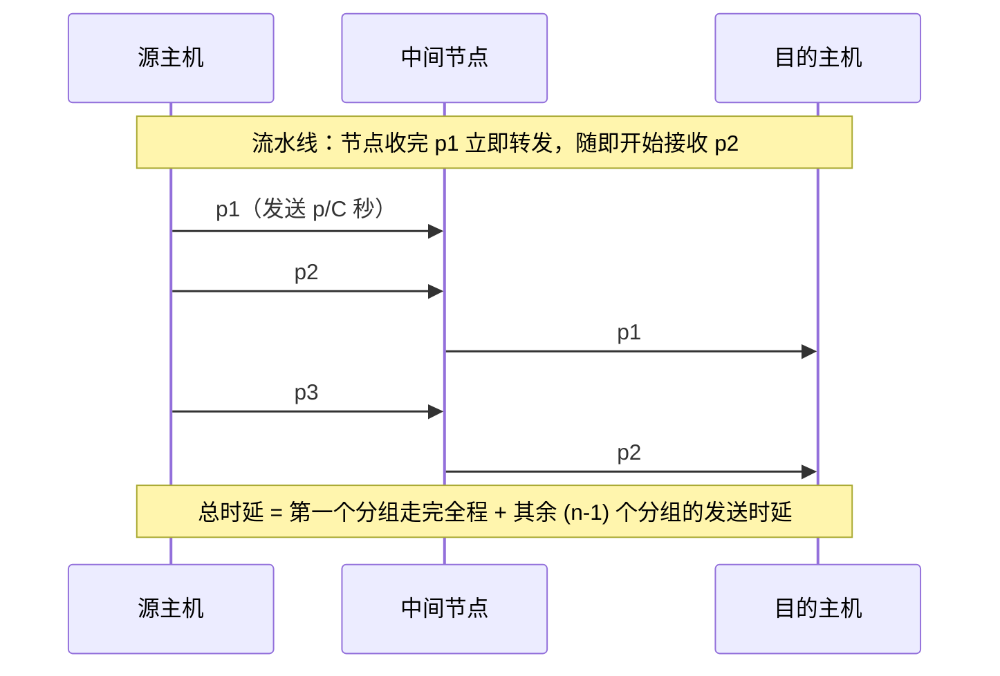

# 第 2 章：物理层

> 这章在 408 里重要度 ⭐⭐，每年一般出 1-2 道选择题，但**奈奎斯特/香农信道容量计算是必考送分题**——几乎每年至少考其中一个，且经常结合出（如"在该信噪比下用 V 个电平，实际速率上限是多少"）。三种交换方式对比、数据报与虚电路的区别是"以下说法正确的是"类选择题的高频素材；曼彻斯特编码的跳变方向也曾考过选择题。本章花 2-3 小时搞定即可，重点放在两个定理公式、编码四象限和分组交换流水线时延计算上。

---

## 2.1 通信基础概念

### 数据通信模型

一个数据通信系统可以划分为三大部分（源点/发送器 → 传输系统 → 接收器/终点）：

| 概念 | 含义 |
|------|------|
| **信源** | 产生数据的设备（如计算机、手机） |
| **信宿** | 接收数据的设备 |
| **信道** | 信号传送的通道，一般表示**单向**传输介质（一条传输介质可含多条信道） |
| **发送器/接收器** | 完成信号变换（编码/调制 与 解码/解调） |

### 信号与带宽

| 概念 | 说明 |
|------|------|
| **模拟信号** | 连续变化的信号，取值在时间和幅度上均连续 |
| **数字信号** | 离散信号，取值只有有限个（如高/低电平） |
| **带宽** | ① 通信角度：信道能通过的最高频率与最低频率之差，单位 Hz；② 网络速率角度：网络中某通路的最高数据率，单位 b/s |

> 同一个词"带宽"有两个含义，做题时看单位：Hz 是频带宽度，b/s 是数据率。香农/奈奎斯特公式里的 $W$ 用的是 **Hz** 那个含义。

### 码元、波特率与比特率

**码元**：承载信息量的基本信号单位，一个码元可以对应多种离散状态。

| 术语 | 定义 | 单位 |
|------|------|------|
| **码元速率（波特率）** | 单位时间内传送的码元个数 | Baud（波特） |
| **比特率（数据传输速率）** | 单位时间内传送的二进制比特数 | b/s |

若一个码元有 $V$ 个离散电平，则 1 个码元可携带的比特数为：

$$
\log_2 V \text{ bit}
$$

两者关系：

$$
\text{比特率} = \text{波特率} \times \log_2 V
$$

> 例：16 个电平时 1 码元携带 $\log_2 16 = 4$ bit。波特率是"每秒多少个码元"，比特率是"每秒多少 bit"，**二者只有在 1 码元 = 1 bit 时才数值相等**（如曼彻斯特编码）。

---

## 2.2 信道容量：奈奎斯特定理与香农定理（408 必考）

### 奈奎斯特定理（无噪信道）

在**无噪声**的**理想低通信道**中，极限数据传输速率为：

$$
C = 2W \log_2 V
$$

其中 $W$ 为信道带宽（单位 Hz）， $V$ 为码元的离散电平个数， $C$ 的单位是 b/s。

> 易错点 1：公式中的 $2W$ 是"带宽的两倍"， $W$ 是**低通信道的带宽**（Hz），不是数据率，也不是波特率。
>
> 易错点 2：该定理给出的是**无噪声条件下**的理论上限；实际信道有噪声，真正可用速率还要受香农定理约束。

### 香农定理（有噪信道）

在**带宽受限、有噪声**的信道中，极限**信息传输速率**为：

$$
C = W \log_2(1 + S/N)
$$

其中 $W$ 为信道带宽（Hz）， $S/N$ 为**信噪比**（信号平均功率与噪声平均功率之比）， $C$ 的单位是 b/s。

信噪比常用分贝（dB）表示，换算关系为：

$$
dB = 10 \log_{10}(S/N)
$$

> 常见换算：30 dB → $S/N = 10^3 = 1000$ ；20 dB → $S/N = 100$ ；10 dB → $S/N = 10$ 。题目给 dB 时**必须先换算回 S/N 再代入公式**，且代入的是 $1 + S/N$ ，不是 $S/N$ 。

### 两个定理的关系

- 奈奎斯特定理：**无噪声**时的极限数据率（受电平数限制）
- 香农定理：**有噪声**时的极限信息传输速率（受信噪比限制）
- 实际信道的极限速率：**取两者的较小值**

> 综合题套路：给出带宽、电平数和信噪比，分别算出奈奎斯特速率和香农速率，答案取较小值。只算一个就选往往是陷阱。

---

## 2.3 编码与调制

数据与信号各有数字/模拟两种形式，排列组合出四种变换：

| 变换方向 | 名称 | 代表技术 | 重要度 |
|---------|------|---------|--------|
| 数字数据 → 数字信号 | **编码** | NRZ、曼彻斯特、差分曼彻斯特 | ⭐⭐⭐ |
| 数字数据 → 模拟信号 | **调制** | ASK、FSK、PSK、QAM | ⭐⭐ |
| 模拟数据 → 数字信号 | **数字化（PCM）** | 采样、量化、编码 | ⭐⭐ |
| 模拟数据 → 模拟信号 | 频带搬移 | 调制后搬移到不同频段 | ⭐（了解） |

### 2.3.1 数字数据 → 数字信号编码

| 编码 | 规则 | 自同步 | 带宽代价 |
|------|------|--------|---------|
| **NRZ（非归零）** | 高电平表示 1，低电平表示 0，整个码元期间电平不变 | 否（连 0 连 1 无法同步） | 低 |
| **曼彻斯特** | 每个码元**中间必须跳变**，用跳变方向表示 0/1 | 是（跳变即同步信号） | 高（约为 NRZ 的 2 倍） |
| **差分曼彻斯特** | 每个码元中间必须跳变（仅用于同步），**码元边界处有无跳变**表示 0/1 | 是 | 高 |

**曼彻斯特编码的跳变方向约定差异**（选择题常考）：

| 约定 | "1" 的跳变方向 | 使用者 |
|------|--------------|--------|
| 约定一 | 低 → 高 | IEEE 802.3（以太网） |
| 约定二 | 高 → 低 | IEEE 802.4、谢希仁教材 |

> 两种约定都合法，考试时以题目波形图给出的约定为准；如果题目没给约定，通常问的是"中间是否跳变""能否自同步"这类与方向无关的性质。

关键结论：

- **自同步**：曼彻斯特编码每个码元中间都有跳变，接收方可从跳变中提取时钟，无需额外同步信号。
- **带宽代价**：跳变频率最高可达信号频率的 2 倍，即传输同样的数据率需要约 2 倍带宽。
- **数据速率 = 波特率**：曼彻斯特编码每个码元固定携带 1 bit，故比特率与波特率数值相等。

> 差分曼彻斯特比曼彻斯特编码多一个优点：**抗干扰性更强**——它只看边界有无跳变（有/无的判断比方向判断更可靠）。代价是编码电路更复杂。

### 2.3.2 数字数据 → 模拟信号调制

| 调制方式 | 改变的载波参数 | 说明 |
|---------|--------------|------|
| **ASK** 幅移键控 | 幅度 | 用不同幅度表示 0/1，实现简单、抗噪差 |
| **FSK** 频移键控 | 频率 | 用不同频率表示 0/1 |
| **PSK** 相移键控 | 相位 | 用不同相位表示 0/1，抗噪性好 |
| **QAM** 正交振幅调制 | 幅度 + 相位 | 星座图，一个码元携带多个 bit（如 16-QAM 携带 4 bit） |

> QAM 直接联系 2.1 节的 $\log_2 V$ ：星座点越多（ $V$ 越大），单码元携带比特越多，但越容易受噪声影响——这正是香农定理约束的体现。

### 2.3.3 模拟数据 → 数字信号：PCM

脉冲编码调制（PCM）分三步：**采样 → 量化 → 编码**。

**采样定理（奈奎斯特采样）**：只要采样频率不低于模拟信号最高频率的 2 倍，就可以从采样信号无失真地恢复原信号：

$$
f_s \geq 2 f_{max}
$$

> 经典数字：电话语音最高频率约 4 kHz，采样频率取 8 kHz，每样本量化为 8 bit，故一路 PCM 电话的数据率为 $8000 \times 8 = 64$ kb/s——这个 64 kb/s 在选择题里经常出现。

### 2.3.4 模拟数据 → 模拟信号

将基带信号的频谱搬移到更高频带（频带搬移），便于天线辐射或频分复用（如广播电台）。408 了解概念即可，不深入。

---

## 2.4 电路交换、报文交换与分组交换（408 必考对比）

### 三种交换方式对比

| 对比项 | 电路交换 | 报文交换 | 分组交换 |
|--------|---------|---------|---------|
| **建立连接** | 必须先建立专用通路 | 不需要 | 数据报不需要，虚电路需要 |
| **转发单位** | 比特流（一路直达） | 整个报文 | 短小的分组 |
| **转发方式** | 直通，不存储 | 存储转发（整报文） | 存储转发（逐分组） |
| **传输时延** | 小（无存储转发时延） | 大（整报文逐跳存储转发） | 小（流水线传输） |
| **链路利用率** | 低（独占，静默也占线） | 高（多报文共享链路） | 高 |
| **可靠性** | 差（通路故障即中断） | 较好 | 好（可逐分组选择路由） |
| **适用场景** | 电话网、实时通话 | 早期电报网（已基本淘汰） | 计算机网络（Internet） |

> 记忆口诀：**电路交换"独占不存储"，报文交换"整存整转"，分组交换"化整为零、流水线"**。分组交换的优势 = 报文交换的共享性 + 更小的时延。

### 分组交换的两种时延计算

设：报文总长 $L$ bit，链路数据率 $C$ b/s，路径共 $k$ 段链路（ $k-1$ 个中间节点），分组长 $p$ bit，共 $n = L/p$ 个分组（忽略传播时延和首部开销）。

**① 串行转发**（报文交换的转发方式）：整个报文在每一段链路上完整发送完毕才转发到下一段：

$$
T_{串行} = k \times \frac{L}{C}
$$

**② 流水线转发**（分组交换）：节点收全一个分组立即转发，各分组在时间上重叠：

$$
T_{流水线} = \frac{L}{C} + (k - 1) \times \frac{p}{C} = (n + k - 1) \times \frac{p}{C}
$$

> 直观理解：第一个分组走完全程耗时 $k \times p/C$ ，之后每 $p/C$ 秒到达一个分组，共 $n$ 个，故总时延 $(k + n - 1) \times p/C$ 。分组越小流水线效果越好，但分组太小则首部开销占比过大——这是分组长度的权衡。

---

## 2.5 数据报 vs 虚电路

分组交换的两种实现方式（注意这是**网络层**的服务方式，细节见[第 4 章（网络层）](04-network-layer.md)）：

| 对比项 | 数据报（无连接） | 虚电路（面向连接） |
|--------|----------------|-------------------|
| **建立连接** | 不需要 | 需要先建立虚电路 |
| **目的地址** | 每个分组携带**完整**目的地址 | 仅在连接建立时使用，分组携带短小的**虚电路编号** |
| **转发依据** | 路由表（独立路由） | 虚电路表（沿建立好的路径） |
| **分组顺序** | 可能乱序到达 | 总是按发送顺序到达 |
| **故障适应** | 强（节点故障可另选路由） | 弱（虚电路经过的节点故障，连接即中断） |
| **典型协议/技术** | IP | X.25、帧中继、ATM、MPLS |

> 一句话区分：**数据报每个分组各自为政、独立选路；虚电路先"修路"再发车，所有分组沿同一条逻辑路径走**。Internet 采用数据报方式，这也是它健壮性的重要来源。

---

## 2.6 传输介质（了解为主）

| 介质 | 类型 | 特点 |
|------|------|------|
| **双绞线** | 屏蔽双绞线（STP）/非屏蔽双绞线（UTP） | 最常用，UTP 是以太网标配；绞合可抗干扰，屏蔽层进一步提高抗干扰能力 |
| **同轴电缆** | 基带同轴（50Ω）/宽带同轴（75Ω） | 抗干扰优于双绞线；50Ω 曾用于局域网，75Ω 用于有线电视 |
| **光纤** | 单模光纤/多模光纤 | 多模：多条光线反射传播，适合近距离；单模：光线几乎直线传播，衰减小，适合远距离，光源须用激光 |
| **无线** | 微波、卫星、红外 | 微波直线传播、需中继；卫星是特殊的微波中继；红外短距离、不能穿墙 |

> 光纤的核心考点只有两个：**单模 vs 多模**（单模传输距离远、成本高）、**光纤不受电磁干扰**。传输介质本身属于物理层之下，不算物理层设备。

---

## 2.7 物理层接口的四个特性

物理层定义 DTE（数据终端设备）与 DCE（数据通信设备）之间接口的规范：

| 特性 | 规定内容 | 示例 |
|------|---------|------|
| **机械特性** | 接线器的形状、引脚数目与排列 | RJ-45 接口 8 针 |
| **电气特性** | 接口电缆上各线路的电压范围 | 高于某电压表示 1 |
| **功能特性** | 某电平表示的意义 | 某引脚电平表示数据/控制信号的含义 |
| **过程特性** | 各信号线的工作规程和时序 | 信号出现的先后顺序 |

> 口诀：**机械管形状、电气管电压、功能管含义、过程管时序**。

---

## 2.8 物理层设备

### 中继器（Repeater）

- 功能：对衰减的信号进行**放大整形**（再生），延伸网络传输距离
- 工作在物理层，只认比特不认帧
- **5-4-3 规则**（以太网中）：最多 **5** 个网段、 **4** 个中继器，其中最多 **3** 个网段可挂接计算机

### 集线器（Hub）

- 本质：**多端口的中继器**
- 从任一端口收到的信号会放大后从**其余所有端口**转发出去
- 所有端口处于**同一个冲突域、同一个广播域**，任意时刻只能有一个端口发送（半双工）

> 易错点：集线器**不隔离冲突域**，也不能隔离广播域——隔离冲突域的是交换机/网桥（见[第 3 章（数据链路层）](03-data-link-layer.md)），隔离广播域的是路由器（见[第 4 章（网络层）](04-network-layer.md)）。这条链路是跨章高频考点。

---

## 2.9 典型例题

**例 1**（奈奎斯特定理）：某无噪声信道的带宽为 4 kHz，采用 16 个离散电平，求该信道的极限数据传输速率。

**解**：

$$
C = 2W \log_2 V = 2 \times 4000 \times \log_2 16 = 8000 \times 4 = 32000 \text{ b/s} = 32 \text{ kb/s}
$$

> 注意 $W$ 要换算成 Hz：4 kHz $= 4000$ Hz。

**例 2**（香农定理）：某信道带宽为 3 kHz，信噪比为 30 dB，求该信道的极限信息传输速率。

**解**：

先换算信噪比： $30 = 10 \log_{10}(S/N) \Rightarrow S/N = 1000$

$$
C = W \log_2(1 + S/N) = 3000 \times \log_2(1001) \approx 3000 \times 9.97 \approx 29.9 \text{ kb/s}
$$

> 若此题同时给出电平数（比如 16 个电平），则还需算奈奎斯特速率 $2 \times 3000 \times 4 = 24$ kb/s，取较小值 24 kb/s 才是实际可达上限。

**例 3**（报文交换 vs 分组交换）：报文长 960000 bit，链路上数据率为 1000 b/s，源到目的经过 3 段链路（2 个中间节点），忽略传播时延与首部开销。分别计算：① 报文交换的总时延；② 若将报文划分为 960 个 1000 bit 的分组，分组交换流水线转发的总时延。

**解**：

报文交换（串行、整报文存储转发）：

$$
T_{报文} = k \times \frac{L}{C} = 3 \times \frac{960000}{1000} = 3 \times 960 = 2880 \text{ s}
$$

分组交换（流水线）：分组长 $p = 1000$ bit，分组数 $n = 960$ ：

$$
T_{分组} = (n + k - 1) \times \frac{p}{C} = (960 + 3 - 1) \times \frac{1000}{1000} = 962 \times 1 = 962 \text{ s}
$$

> 分组交换把时延从 2880 s 降到 962 s，接近 3 倍改善。核心原因：流水线让中间节点"收完一个分组就转发"，不必等整个报文收齐。

**例 4**（PCM）：某模拟信号最高频率为 4 kHz，按采样定理进行采样并量化为 8 bit，求最小采样频率与数字化后的数据率。

**解**：

$$
f_s \geq 2 f_{max} = 2 \times 4 = 8 \text{ kHz}
$$

数据率：

$$
R = 8000 \times 8 = 64000 \text{ b/s} = 64 \text{ kb/s}
$$

### 解题技巧总结

- 看到"无噪声 + 电平数"→ 奈奎斯特 $C = 2W \log_2 V$
- 看到"信噪比/dB"→ 香农 $C = W \log_2(1 + S/N)$ ，dB 先换算： $S/N = 10^{dB/10}$
- 同时给两种条件 → 两个都算，**取较小值**
- 看到"波形图"→ 看码元中间是否跳变定曼彻斯特/差分曼彻斯特，再看方向约定
- 看到"报文拆分组"→ 套 $(n + k - 1) \times p/C$ ，别忘了 $k$ 是链路段数不是节点数

### 常见陷阱清单

1. **奈奎斯特公式的 $2W$**： $W$ 是带宽（Hz），不是波特率；结果受电平数 $V$ 限制
2. **香农公式是 $1 + S/N$**：代入 $S/N = 1000$ 时是 $\log_2 1001$ ，别写成 $\log_2 1000$ （数值上接近，但公式写错没分）
3. **dB 换算底数是 10**： $dB = 10 \log_{10}(S/N)$ ，不是以 2 为底
4. **链路段数 vs 节点数**： $n$ 个节点的路径有 $n+1$ 段链路，公式里的 $k$ 是段数
5. **曼彻斯特编码数据速率 = 波特率**：每码元 1 bit；不要误以为曼彻斯特"效率高"，它的代价是带宽翻倍

---

## 本章小结

### 核心要点回顾

1. **码元与比特**：1 码元携带 $\log_2 V$ bit，比特率 = 波特率 × $\log_2 V$
2. **奈奎斯特定理**（无噪）： $C = 2W \log_2 V$ ， $W$ 为带宽（Hz）
3. **香农定理**（有噪）： $C = W \log_2(1 + S/N)$ ， $dB = 10 \log_{10}(S/N)$ ，30 dB → $S/N = 1000$
4. **编码四象限**：曼彻斯特码元中间跳变、自同步、数据速率 = 波特率、带宽代价 2 倍；PCM 采样定理 $f_s \geq 2 f_{max}$
5. **三种交换**：电路交换独占时延小、分组交换流水线时延小利用率高；流水线总时延 $(n + k - 1) \times p/C$
6. **数据报 vs 虚电路**：无连接独立选路 vs 先建连接沿路转发
7. **物理层设备**：中继器放大整形（5-4-3 规则），集线器 = 多端口中继器、同一冲突域

### 考试重点排序

| 优先级 | 考点 | 题型 |
|--------|------|------|
| ⭐⭐⭐ | 奈奎斯特/香农定理计算（含 dB 换算、取较小值） | 选择题 |
| ⭐⭐⭐ | 电路/报文/分组交换对比、流水线时延计算 | 选择题 |
| ⭐⭐ | 曼彻斯特/差分曼彻斯特编码（跳变方向、自同步） | 选择题 |
| ⭐⭐ | 数据报与虚电路的区别 | 选择题 |
| ⭐ | PCM 采样定理、接口四特性、中继器/集线器 | 选择题 |

> 本章复习策略：两个定理公式必须记牢并能互相区分（无噪/有噪），流水线时延公式推导一遍即可掌握；其余内容以表格记忆为主。学完后进入[第 3 章（数据链路层）](03-data-link-layer.md)，那里开始出现 CSMA/CD 和滑动窗口等真正的重点机制。体系结构的分层背景见[第 1 章（体系结构）](01-architecture.md)。

---

## 自测题

1. 奈奎斯特定理适用的前提条件是什么？公式中 $W$ 的含义和单位是什么？
2. 信噪比为 20 dB 时， $S/N$ 的值是多少？
3. 曼彻斯特编码为什么能自同步？它的带宽代价是什么？每个码元携带多少 bit？
4. 分组交换相比电路交换和报文交换的主要优势分别是什么？
5. 数据报与虚电路在"连接、分组顺序、故障适应"三方面有何区别？
6. 物理层接口的四个特性分别规定什么内容？

> **答案**：1. 前提是无噪声的理想低通信道； $W$ 是信道的带宽，单位 Hz。2. $S/N = 10^{20/10} = 100$ 。3. 每个码元中间必有一次电平跳变，接收方可从跳变中提取时钟信号；代价是所需带宽约为 NRZ 的 2 倍；每个码元携带 1 bit，数据速率 = 波特率。4. 相比电路交换：无需建立连接、链路利用率高（不独占）；相比报文交换：分组小、可流水线转发，传输时延显著降低。5. 数据报无连接、分组可能乱序、故障适应能力强；虚电路需先建立连接、分组按序到达、虚电路路径上的节点故障会导致连接中断。6. 机械特性规定接口形状与引脚排列；电气特性规定电压范围；功能特性规定电平的含义；过程特性规定信号出现的时序和规程。
