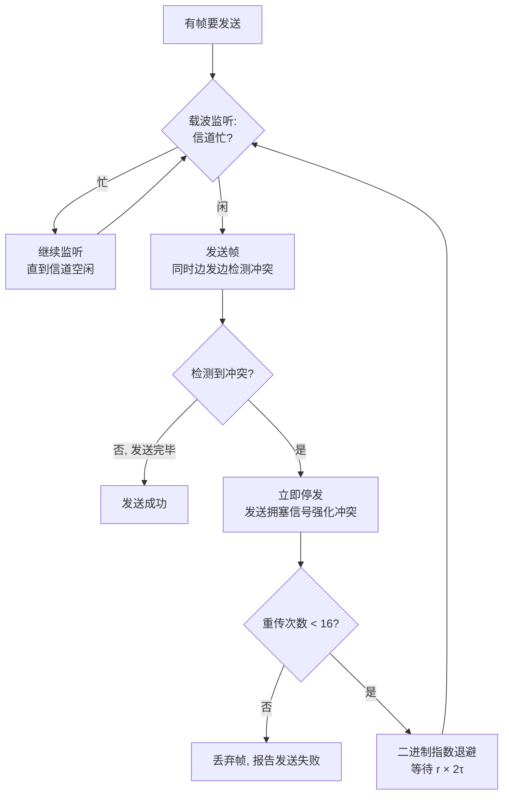

# 第 3 章：数据链路层

> 这章是 408 网络部分的重点章，重要度 ⭐⭐⭐，每年稳定贡献 2-3 道选择题，偶尔出现在综合题里（如 2022 年考过 IEEE 802.11 帧地址字段）。核心计算题四件套：**CRC 校验、海明码冗余位、CSMA/CD 最小帧长、滑动窗口与信道利用率**——全部是可套公式的送分题，必须拿满。概念上重点是以太网帧格式、交换机自学习与冲突域/广播域划分。建议投入 4-6 小时，重点放在计算题和 CSMA/CD 机制上。

---

## 3.1 数据链路层的功能

数据链路层位于物理层之上、网络层之下，负责把物理层提供的"可能出错的比特流"变成"可靠的链路"，并为网络层提供帧传输服务。它要解决的核心问题可以概括为五个功能：

| 功能 | 说明 |
|------|------|
| **封装成帧** | 给网络层交下来的数据加上首部和尾部，构成帧（Frame），帧是数据链路层的 PDU |
| **透明传输** | 数据部分出现与帧定界符相同的比特/字符时，要能正确区分（见 3.2） |
| **差错控制** | 检测（甚至纠正）传输中的比特错误，常用 CRC 检错 + 重传（见 3.3） |
| **流量控制** | 控制发送速率，避免接收方来不及处理，典型手段是滑动窗口（见 3.4） |
| **访问控制（MAC）** | 多个结点共享同一广播信道时，决定"谁在什么时候发送"（见 3.5） |

> 注意区分**流量控制**和**拥塞控制**：流量控制是点对点的、针对接收方处理能力的控制（本章）；拥塞控制是全局的、针对网络整体负载的控制（[第 5 章（传输层）](05-transport-layer.md) 的 TCP 拥塞控制）。两者常在同一道选择题里混合出现。

### 两个子层：LLC 与 MAC

IEEE 802 标准把局域网的数据链路层进一步划分为两个子层：

| 子层 | 全称 | 职责 |
|------|------|------|
| **LLC** | 逻辑链路控制子层 | 向网络层提供服务接口、帧的封装/解封装、差错控制、流量控制 |
| **MAC** | 介质访问控制子层 | 组帧/拆帧、实现 MAC 协议（决定如何共享信道）、MAC 地址识别 |

> 在 TCP/IP 体系中，数据链路层通常不再细分；但只要题目提到"802 标准"或局域网，就要知道 MAC 子层的存在——CSMA/CD、CSMA/CA 都工作在 MAC 子层。

---

## 3.2 封装成帧与透明传输

### 封装成帧

封装成帧就是在数据前后加上**帧定界符**，使接收方能确定帧的起止位置。帧长度有上下限：**MTU**（最大传送单元）限制帧的最大长度；以太网的帧长在 64-1518 B 之间（见 3.6）。

### 四种成帧方法

| 方法 | 原理 | 优缺点 |
|------|------|--------|
| **字符计数法** | 帧首部用一个字段标明帧内字符数 | 计数字段一旦出错，后续帧全部错位，已很少使用 |
| **字符填充法** | 用特殊字符（如 SOH/EOT）定界；数据中出现定界符时插入转义字符 ESC | 面向字节，数据长度必须是字符的整数倍 |
| **零比特填充法** | 用 `01111110` 定界；发送方每出现 **5 个连续 1** 就插入 1 个 0，接收方每看到 5 个连续 1 就删除后面的 0 | 面向比特，任意比特流都能传输，**PPP 协议采用**（见 3.9） |
| **违规编码法** | 利用物理层编码中不会出现的信号模式定界（如曼彻斯特编码中的"高-高""低-低"） | 只适用于采用冗余编码的物理层 |

> 零比特填充的口诀：**"5 插 0"**——发送方在数据中每出现 5 个连续的 1 就自动填充一个 0，这样数据部分永远不可能出现 6 个连续 1，标志字段 `01111110`（含 6 个连续 1）就不会被误认。选择题常给一段比特流问填充结果。

---

## 3.3 差错控制

差错控制分两类：**检错编码**（只能发现错误，配合重传纠错）和**纠错编码**（能定位并纠正错误，无需重传）。

### 检错编码

**奇偶校验码**：增加 1 位校验位，使码字中 1 的个数为奇数（奇校验）或偶数（偶校验）。只能检测**奇数位**错误，偶数位错误检测不出。检错能力弱，但开销最小。

**CRC 循环冗余校验**（408 高频计算题）：

1. 把生成多项式 $G(x)$ 写成二进制除数 $P$ ，其最高次幂为 $r$
2. 在 $k$ 位数据后面补 $r$ 个 0，得到 $k+r$ 位被除数
3. 用**模 2 除法**（加减均不进位/借位，即逐位异或）求余数，余数就是 $r$ 位的 **FCS（帧检验序列）**
4. 发送帧 = 数据 + FCS；接收方用收到的帧除以 $P$ ：余数为 0 视为无错

> CRC 只能**检错不能定位错误**，检出错后直接丢弃帧、靠重传恢复。CRC 的检错能力与生成多项式有关，但 408 只考计算过程，不考多项式设计。模 2 除法就是逐位异或，手算时注意**每一步只看当前最高位是否为 1**：为 1 就异或除数，为 0 就异或全 0，然后把下一位拉下来。

### 纠错编码：海明码

海明码在数据中插入多个校验位，每个校验位覆盖不同的数据位组合，出错时通过校验结果（伴随式）直接定位出错位并取反纠正。

- **校验位位置**：放在 2 的幂次位置（第 1、2、4、8、… 位），其余位置放数据位
- **冗余位数量**： $m$ 位数据要纠正 1 位错误，需要 $r$ 位冗余位，满足

$$
2^r \geq m + r + 1
$$

- **海明距离**：两个合法码字之间不同的位数。若要检测 $k$ 位错，编码的海明距离至少为 $k+1$ ；若要纠正 $k$ 位错，海明距离至少为 $2k+1$ 。标准海明码距离为 3，只能纠 1 位错

> 直觉解释不等式： $r$ 位校验位共 $2^r$ 种取值，其中 1 种表示"无错"，剩下 $2^r - 1$ 种必须足够指出 $m + r$ 个位置中的任何一个出错位置。

---

## 3.4 流量控制与可靠传输机制

### 滑动窗口机制

发送方把帧编号，任何时刻维护一个**发送窗口**，窗口内的帧允许连续发送而不必等待确认；每收到一个确认，窗口向前"滑动"。窗口内的帧分三类状态：


| 帧号 | 0 | 1 | 2 | 3 | 4 | 5 | 6 | 7 |
|------|---|---|---|---|---|---|---|---|
| 状态（窗口 = 4） | 已确认 | 已确认 | 已发未确认 | 已发未确认 | 可发送 | 可发送 | 不可发送 | 不可发送 |

**停-等协议**就是窗口大小恒为 1 的退化情况。

### 停-等协议（ARQ）

发送 1 帧 → 等待 ACK → 收到 ACK 才发下一帧；超时未收到 ACK 则重传。需要帧编号（1 bit 即可）和超时定时器。实现最简单，但信道利用率极低。

### 后退 N 帧（GBN，Go-Back-N）

- **发送窗口 > 1**，可连续发送窗口内的多个帧
- **接收窗口恒为 1**：接收方按序接收，遇到失序帧（有错或跳号）**一律丢弃**，并重复发送最后一个正确帧的确认
- 发送方收到对某帧的否定（超时）后，**重传该帧及其后所有已发送的帧**（回退 N 帧）
- 采用**累积确认**：对帧 $i$ 的确认隐含了对帧 $i$ 之前所有帧的确认

### 选择重传（SR，Selective Repeat）

- 接收窗口 > 1，为失序帧设置**接收缓存**，先存下来等缺失的帧补齐
- 只对出错/丢失的帧**逐个重传**（配合选择性确认），不重复传已正确到达的帧
- 接收窗口必须足够大，才能避免新旧窗口混淆（见下文窗口限制）

### GBN vs SR 对比

| 对比项 | GBN | SR |
|--------|-----|-----|
| 接收窗口 | **恒为 1** | $\geq 1$ ，通常与发送窗口相等 |
| 失序帧处理 | 丢弃，重复确认上一正确帧 | 缓存，等待补齐 |
| 重传策略 | 重传所有已发送未确认帧 | 只重传出错/丢失的帧 |
| 确认方式 | 累积确认 | 逐个确认（选择确认） |
| 带宽浪费 | 大（错误多时） | 小 |
| 接收方开销 | 小（无需缓存） | 大（需缓存乱序帧） |

> 易错点：**GBN 接收窗口恒为 1**。选择题若说"GBN 接收方可缓存失序帧"必错。另外 GBN 的累积确认意味着 ACK 丢失也不一定引发重传——只要后续帧的 ACK 到了，发送窗口照样前移。

### 窗口大小限制（408 常考）

设帧编号用 $n$ 位（编号范围 $0 \sim 2^n - 1$ ）：

| 协议 | 窗口限制 | 原因 |
|------|---------|------|
| 停-等 | $W_T = W_R = 1$ | — |
| GBN | $1 \leq W_T \leq 2^n - 1$ ， $W_R = 1$ | 若 $W_T = 2^n$ ：窗口内全部帧的 ACK 都丢失时，接收方无法区分"重传的旧帧"和"新窗口的帧"（编号完全重叠） |
| SR | $W_T + W_R \leq 2^n$ ，通常 $W_T = W_R \leq 2^{n-1}$ | 同理，要避免新旧窗口的编号区间重叠；两窗口相等时各占一半 |

> 记忆口诀：**GBN 是 $2^n - 1$ ，SR 和是 $2^n$ （各 $2^{n-1}$ ）**。例如 $n = 3$ 时：GBN 发送窗口最大 7；SR 收发窗口各最大 4。

### 信道利用率

设 $T_{send}$ 为发送一帧的时间， $RTT$ 为往返传播时延， $T_{ack}$ 为发送确认帧的时间（常忽略）。

**停-等协议**（一个发送周期 = 发一帧 + 等确认回来）：

$$
U = \frac{T_{send}}{T_{send} + RTT + T_{ack}}
$$

**GBN / SR（滑动窗口）**：窗口足够大时可连续发送，利用率等于窗口数乘以单帧利用率，上限为 1：

$$
U = \min\left(\frac{W \times T_{send}}{T_{send} + RTT + T_{ack}},\ 1\right)
$$

> 当 $W \times T_{send} \geq T_{send} + RTT + T_{ack}$ 时信道被"灌满"， $U = 1$ 。题目若问"至少需要多少位帧编号才能达到 100% 利用率"，就是先算出所需窗口 $W$ ，再套窗口限制反推 $n$ 。

---

## 3.5 介质访问控制

广播信道上多个结点共享同一信道，必须解决"谁何时发"的问题。三类方法：**信道划分**（静态）、**随机访问**（动态）、**轮询访问**。

### 静态划分信道

| 方法 | 划分维度 | 说明 |
|------|---------|------|
| **FDMA** | 频带 | 各用户占用不同频段，如广播电台 |
| **TDMA** | 时间 | 各用户轮流占用整个频带，如 GSM |
| **WDM** | 光的波长 | **波分复用就是光的频分复用**，用于光纤 |
| **CDMA** | 码字 | 各用户使用相互正交的码片序列，同一时间同一频带同时通信 |

#### CDMA 码分复用（理解 + 会解码）

- 每个比特时间被分成 $m$ 个更短的**码片**，每个站分配一个唯一的 $m$ 位**码片序列** $S$
- 发送比特 1 → 发送码片序列 $S$ ；发送比特 0 → 发送 $S$ 的反码 $-S$
- 不同站的码片序列**两两正交**：两个序列的内积为 0，即 $S \cdot T = 0$ ；自身内积 $S \cdot S = m$ ，与自身反码内积 $S \cdot (-S) = -m$
- **解码**：接收信号是各站发送信号的线性叠加。把接收信号与某站的码片序列求内积再除以 $m$ ，就还原出该站发送的比特（+1 表示 1，-1 表示 0）

> CDMA 解码题是固定题型：**内积除码长**。计算时把 0/1 码片写成 +1/-1 再点乘即可，见例 5。

### 随机访问

**ALOHA**：想发就发，冲突后随机退避重传。纯 ALOHA 最大信道利用率约 **18.4%**；时隙 ALOHA（只能在时隙起点发送）约 **36.8%**。408 记住这两个结论即可。

**CSMA（载波监听多点接入）**：发送前先监听信道，"先听后发"。三种坚持策略：

| 策略 | 信道忙时 | 信道闲时 | 特点 |
|------|---------|---------|------|
| **1-坚持** | 持续监听，一闲立即发 | 以概率 1 发送 | 冲突概率大，但信道利用率高 |
| **非坚持** | 放弃监听，随机等待后再来 | 发送 | 冲突小，但信道可能空闲浪费 |
| **p-坚持** | 持续监听（适用于时分信道） | 以概率 p 发送，以 1-p 推迟到下一时隙 | 折中方案 |

#### CSMA/CD（以太网的核心，408 必考）

CD = Collision Detection，"边发边听"。适用于**有线**总线型局域网（经典以太网）。

关键概念与公式：

- **τ（单程传播时延）**：帧从一端传到另一端的时间
- **争用期 = $2\tau$** ：最坏情况下，A 发送瞬间 B 也开始发送，B 的信号要经过 $2\tau$ 才能被 A 检测到冲突
- **最小帧长 = $2\tau \times$ 发送速率**：帧的发送时间必须 $\geq 2\tau$ ，才能保证"发送结束前一定能检测到冲突"；帧太短则发完了冲突信号还没回来，无法区分是发完了还是冲突了
- **以太网的取值**：10 Mbps 以太网规定争用期为 **51.2 μs**（ $\tau = 25.6\ \mu s$ ），最小帧长 = $51.2\ \mu s \times 10\ Mbps = 512$ bit = **64 B**
- **最大传输距离**：由争用期反推——网段越长， $2\tau$ 越大，要么提高最小帧长，要么降低速率。这就是为什么速率提升后（如千兆以太网）要么保留 64 B 最小帧但限制网段长度、要么采用帧扩展

**二进制指数退避算法**（冲突后重传）：

1. 确定基本退避时间 = 争用期 $2\tau$ （以太网为 51.2 μs）
2. 每次冲突后，取 $k = \min(\text{冲突次数}, 10)$ ，从 $[0,\ 2^k)$ 中随机取整数 $r$
3. 等待 $r \times 2\tau$ 后再重传
4. **重传达 16 次仍冲突则放弃**，丢弃帧并向高层报告



> 易错点：退避随机数的取值范围是 **$[0, 2^k)$** （左闭右开，共 $2^k$ 个值），且 $k$ 最大只算到 10——第 11 次及以后的冲突仍从 $[0, 2^{10})$ 取数，直到 16 次失败放弃。另外 CSMA/CD 发送过程中检测到冲突会**立即停止发送**（还要发一段拥塞信号让所有站知道），不是把帧发完。

#### CSMA/CA（无线局域网）

CA = Collision Avoidance。无线环境不能直接用 CD，原因：

- **隐蔽站问题**：A、C 都在 B 的范围内但互相听不见，A、C 同时发给 B 会冲突，而它们都检测不到
- 无线网卡收发共用天线，难以"边发边听"，且信号衰减使冲突检测不可靠

因此 CSMA/CA 以**预约和避让**为主：

- **预约信道**：发送前先发短控制帧 **RTS**（请求发送），AP 回 **CTS**（允许发送）；RTS/CTS 覆盖范围内的站都知道信道将被占用
- **NAV（网络分配向量）**：其他站收到 RTS/CTS 后设置一个计时器，在 NAV 有效期内**虚拟**认为信道忙，不发送——这就是虚拟载波监听
- **ACK**：无线链路误码率高，802.11 对每个单播数据帧都要接收方回 ACK（与以太网不同，以太网靠上层 TCP 确认）
- 此外还有 IFS 帧间间隔优先级、随机退避等机制

> 对比记忆：**CD 用于有线（以太网），CA 用于无线（802.11）**。CA 是"尽量避免冲突"，CD 是"冲突了再检测重发"。

### 轮询访问：令牌传递协议

一个特殊的**令牌**在逻辑环上依次传递，只有拿到令牌的站才能发送帧，发完把令牌交给下一站。无冲突、时延确定（适合负载重的工业环境），但令牌丢失/出错需要恢复机制。代表：令牌环（IEEE 802.5）、令牌总线（IEEE 802.4）。

### 三类 MAC 方法对比

| 类别 | 代表 | 冲突 | 信道利用率 | 时延确定性 |
|------|------|------|-----------|-----------|
| 静态划分 | FDMA/TDMA/WDM/CDMA | 无 | 轻载时浪费 | 确定 |
| 随机访问 | ALOHA/CSMA/CSMA/CD/CSMA/CA | 有 | 轻载时高 | 不确定 |
| 轮询访问 | 令牌传递 | 无 | 重载时高 | 确定 |

---

## 3.6 以太网与 IEEE 802.3

### 以太网帧格式（IEEE 802.3）

| 字段 | 字节数 | 说明 |
|------|--------|------|
| 前导码 | 8 | 7 字节前导码 + 1 字节帧开始定界符（SFD），用于同步，**不计入帧长** |
| 目的 MAC 地址 | 6 | 单播/组播/广播 |
| 源 MAC 地址 | 6 | 只能是单播 |
| 类型 | 2 | 标识上层协议，如 0x0800 = IPv4、0x0806 = ARP |
| 数据 | 46-1500 | 不足 46 B 时**填充（pad）** 到 46 B |
| FCS | 4 | CRC 校验 |

- **帧长范围：64-1518 B**（不含前导码）；最小 64 B = 512 bit 正是 CSMA/CD 最小帧长的要求
- 数据字段不足 46 B 时硬件自动填充，高层（IP）自己携带长度信息，填充不影响上层

> 三个高频陷阱：①**最小帧长 64 B 不含前导码**（前导码在物理层处理）；②最小帧长对应的是 **512 bit**，即 10 Mbps 下 51.2 μs 的发送时间；③数据字段最小 46 B 是为了凑够最小帧长，不是 IP 的要求。

### MAC 地址（48 位）

- 格式：6 字节，通常写成 `00-1A-2B-3C-4D-5E`；前 24 位由 IEEE 分配给厂商（OUI），后 24 位由厂商自行分配
- **地址类型**：第 1 字节最低位（I/G 位）为 0 是**单播**，为 1 是**组播**；全 1（ `FF-FF-FF-FF-FF-FF` ）是**广播地址**
- 第 1 字节次低位（U/L 位）为 0 是**全球管理**（厂商烧录），为 1 是**本地管理**（软件可改）
- MAC 地址是**网卡的硬件标识**，一般全球唯一；交换机的自学习、ARP 都围绕它展开（ARP 见[第 4 章（网络层）](04-network-layer.md)）

### 10BASE-T 命名规则

| 段 | 含义 | 示例 |
|----|------|------|
| 数字 | 速率（Mbps） | 10 = 10 Mbps |
| BASE/BROAD | 基带/宽带传输 | BASE = 基带 |
| 尾缀 | 传输介质 | T = 双绞线（Twisted pair）、F = 光纤、5/2 = 同轴电缆 |

即 10BASE-T = 10 Mbps、基带、双绞线以太网；类似的还有 100BASE-TX（百兆）、1000BASE-T（千兆）。10BASE-T 采用星型拓扑连接到**集线器**，网段最长 100 m。

---

## 3.7 IEEE 802.11 无线局域网

### 两种工作模式

| 模式 | 结构 | 说明 |
|------|------|------|
| **基础结构模式** | BSS + AP | 一个**BSS**（基本服务集）由若干无线站和一个**接入点 AP** 组成；AP 的标识叫 BSSID。多个 BSS 通过分配系统互联成 **ESS**（扩展服务集），对外表现为一个 SSID |
| **自组织模式（Ad Hoc）** | 无 AP | 各站点对点直接通信，又称 IBSS（独立 BSS） |

### MAC 帧的三个地址字段（2022 综合题考点）

802.11 MAC 帧有**三个地址字段 + 两个方向控制位**（To DS、From DS），因为帧可能经 AP 转发，"直接收发者"与"真正源/目的"可能不同：

| 字段 | 含义 |
|------|------|
| 地址 1（Addr1） | **接收地址 RA**：本跳的直接接收方 |
| 地址 2（Addr2） | **发送地址 TA**：本跳的直接发送方 |
| 地址 3（Addr3） | **源/目的地址**：真正的发送方或最终接收方 |

以"站 A 经 AP 发给站 B"为例：

| 方向 | Addr1（RA） | Addr2（TA） | Addr3 |
|------|------------|------------|-------|
| A → AP（To DS = 1） | AP 的地址 | A 的地址 | **B 的地址**（最终目的） |
| AP → B（From DS = 1） | B 的地址 | AP 的地址 | **A 的地址**（原始源） |

> 记忆方法：Addr1/Addr2 永远是**这一跳**的收发双方（其中一方是 AP），Addr3 填的是**不在本跳出现的那个角色**——上行帧填最终目的，下行帧填原始源。Ad Hoc 模式下不经过 AP，Addr1 = 目的、Addr2 = 源、Addr3 = BSSID。

---

## 3.8 交换机与 VLAN

### 交换机（多接口网桥）

交换机工作在数据链路层，核心能力是**自学习 + 按 MAC 地址转发**。

**自学习算法**（源地址学习）：收到一帧，把**源 MAC 地址**和**进入接口**记入交换表（含老化时间，默认通常几分钟）；表项过期自动删除，适应主机更换接口。

**转发规则**（按目的 MAC 查表）：

| 情况 | 动作 |
|------|------|
| 表中无该目的地址 | **洪泛**：向除进入接口外的所有接口转发 |
| 表中出口 = 进入接口 | **过滤（丢弃）**：目的主机就在来源一侧，无需转发 |
| 表中出口 ≠ 进入接口 | **定向转发**：只从该接口转发 |

**生成树协议（STP，IEEE 802.1D）**：多个交换机互联可能存在环路，环路会让帧无限循环（广播风暴）。STP 通过交换机间交换 BPDU 报文，逻辑上阻塞部分接口，把带环的物理拓扑裁剪成一棵无环的树；拓扑变化时自动重新计算。408 只需知道"STP 用于防止二层环路"这一概念。

### 冲突域与广播域（408 经典对比）

| 设备 | 工作层次 | 冲突域 | 广播域 |
|------|---------|--------|--------|
| 集线器 | 物理层 | 不隔离（所有接口同一冲突域） | 不隔离 |
| 网桥 / 交换机 | 数据链路层 | **隔离**（每个接口一个冲突域） | **不隔离**（广播帧照样洪泛） |
| 路由器 | 网络层 | 隔离 | **隔离** |

> 口诀：**交换机隔离冲突域不隔离广播域，路由器两个都隔离**。交换机的每个接口是一个独立的冲突域，接口越多冲突域越多；但所有接口默认属于同一个广播域——要分割广播域只能靠 VLAN 或路由器。

### VLAN（虚拟局域网）

- **原理**：在交换机上把若干接口逻辑地划分为一组，同组接口像连在同一台交换机上，不同组之间**二层隔离**（广播帧不跨 VLAN）
- **意义**：突破物理位置限制组网、缩小广播域、提高安全性
- **IEEE 802.1Q 标记**：在以太网帧的源 MAC 字段之后插入 **4 字节**标记（TPID = 0x8100 占 2 字节 + TCI 占 2 字节，其中含 12 位 VLAN ID，故最多 4094 个 VLAN）
- **跨 VLAN 通信**必须借助路由器或三层交换机（网络层）

---

## 3.9 PPP 协议

PPP（点对点协议）用于两个结点间的直连链路（如拨号上网），是**面向字节**的、**不可靠**的协议（无序号、无确认，差错靠丢弃 + 上层重传）。

三个组成部分：

1. **链路封装方法**：成帧规则（零比特填充/字节填充）
2. **LCP（链路控制协议）**：建立、配置、测试数据链路
3. **NCP（网络控制协议）**：为不同网络层协议（如 IP 的 IPCP）分别协商配置

**PPP 帧格式**：标志字段 F（0x7E）| 地址字段 A（固定 0xFF）| 控制字段 C（固定 0x03）| 协议字段（2 字节，标识数据是什么协议）| 信息部分 | FCS（2 字节，可协商为 4）| 标志字段 F（0x7E）。

**字节填充**（异步链路，面向字节传输）：

| 数据中出现 | 填充为 |
|-----------|--------|
| 0x7E | 0x7D 0x5E |
| 0x7D | 0x7D 0x5D |
| 控制字符（< 0x20） | 0x7D + （原字节 XOR 0x20） |

> 对比：PPP 在同步链路（面向比特）用**零比特填充**，在异步链路（面向字节）用**字节填充**；以太网只用零比特思想不适用（以太网靠长度/类型字段）。PPP 的 LCP/NCP 协商过程偶尔考选择题：链路建立（LCP）→ 鉴别（可选）→ 网络层协议配置（NCP）→ 通信 → 释放。

---

## 3.10 数据链路层设备

| 设备 | 类型 | 说明 |
|------|------|------|
| **透明网桥** | "即插即用"，自学习构建转发表 + 生成树防环（IEEE 802.1D） | 以太网主流；"透明"指对主机完全不可见 |
| **源路由网桥** | 发送帧时由源站把完整路由写进帧首部 | 用于令牌环网；可寻最优路径，但主机负担重 |
| **交换机** | 本质是多接口网桥 | 全双工、每个接口独立冲突域，现代局域网核心设备 |

**集线器 vs 网桥/交换机**：集线器是物理层设备，逐比特放大转发，所有接口共享带宽与冲突域；交换机是数据链路层设备，按 MAC 转发，各接口独享带宽。交换机是网桥的直接进化（硬件实现、接口更多、转发更快），408 中两者转发原理一致。

---

## 3.11 典型例题

**例 1**（CRC 计算）：要发送的数据为 `101001` ，生成多项式 $G(x) = x^3 + x + 1$ 。求 FCS 和实际发送的帧。

**解**：

1. $G(x)$ 对应除数 $P = 1011$ ，最高次幂 $r = 3$
2. 数据后补 3 个 0： `101001000`
3. 模 2 除法（逐位异或）：

```text
  101001000 ⊕ 1011          （前 4 位 1010 异或 1011）
= 000101000 → 去掉前导 0 得 101000
  101000    ⊕ 1011
= 000100 → 余数 100
```

4. FCS = `100` ，实际发送 `101001100`

验证：接收方将 `101001100` 用 `1011` 做模 2 除法：前 4 位 `1010 ⊕ 1011 = 0001` ，依次下移补位至前 4 位为 `1011` ， `1011 ⊕ 1011 = 0000` ，再下移 `00` ，余数 `000` ，判定无错。

**例 2**（海明码冗余位）：数据位 $m = 8$ 位，要求能纠正 1 位错误，至少需要几位冗余位？编码总长多少？

**解**：由 $2^r \geq m + r + 1$ ：

- $r = 3$ ： $2^3 = 8 < 8 + 3 + 1 = 12$ ，不满足
- $r = 4$ ： $2^4 = 16 \geq 8 + 4 + 1 = 13$ ，满足

故至少需 **4 位**冗余位，编码总长 $8 + 4 = 12$ 位。

**例 3**（CSMA/CD 最小帧长）：某局域网采用 CSMA/CD，数据传输速率 10 Mbps，最远两站距离 2 km，信号传播速度 $2 \times 10^8$ m/s。求争用期和最小帧长。

**解**：

单程传播时延：

$$
\tau = \frac{2 \times 10^3}{2 \times 10^8} = 10\ \mu s
$$

争用期 $2\tau = 20\ \mu s$ 。最小帧长：

$$
L_{min} = 2\tau \times C = 20\ \mu s \times 10\ Mbps = 200\ bit = 25\ B
$$

> 对比标准以太网：最小帧长 64 B = 512 bit，对应争用期 51.2 μs。题目给的距离和速率不同时照此公式重算即可。

**例 4**（GBN 窗口与信道利用率）：主机 A 向 B 发送数据帧，帧长 1000 B，链路速率 8 Mbps，RTT = 14 ms，确认帧发送时延忽略。①停-等协议的信道利用率？②若采用 GBN 且帧编号 3 位，最大发送窗口和对应利用率？③利用率要达到 100%，帧编号至少几位？

**解**：

$$
T_{send} = \frac{1000 \times 8}{8 \times 10^6} = 1\ ms
$$

①停-等： $U = \frac{1}{1 + 14} \approx 6.7\%$

②GBN 最大发送窗口 $W = 2^3 - 1 = 7$ ：

$$
U = \frac{7 \times 1}{1 + 14} \approx 46.7\%
$$

③令 $W \times 1 \geq 15$ 得 $W \geq 15$ ，由 $2^n - 1 \geq 15$ 得 $n \geq 4$ ，即帧编号至少 **4 位**。

**例 5**（CDMA 解码）：A、B 两站的码片序列为： $S_A = (-1,-1,-1,+1,+1,-1,+1,+1)$ ， $S_B = (-1,-1,+1,-1,+1,+1,+1,-1)$ （已验证正交）。某时刻接收到的信号为 $S = (-2,-2,0,0,2,0,2,0)$ 。问 A、B 各发送了什么比特？

**解**：接收信号是两站发送信号的叠加，分别内积再除以码长 8：

$$
S \cdot S_A = 2 + 2 + 0 + 0 + 2 + 0 + 2 + 0 = 8 \Rightarrow \frac{8}{8} = +1
$$

$$
S \cdot S_B = 2 + 2 + 0 + 0 + 2 + 0 + 2 + 0 = 8 \Rightarrow \frac{8}{8} = +1
$$

故 **A 发送 1，B 发送 1**（该时刻 $S = S_A + S_B$ ）。

### 解题技巧总结

- 看到"生成多项式 + 数据"→ 补 $r$ 个 0、模 2 除法、余数是 FCS
- 看到"纠正 1 位错"→ 直接套 $2^r \geq m + r + 1$
- 看到"距离 + 速率 + 传播速度"→ 先算 $\tau$ ，再算 $2\tau$ 和最小帧长
- 看到"利用率 + 帧编号"→ 利用率公式与窗口限制 $2^n - 1$ （GBN）/ $2^{n-1}$ （SR）联立
- 看到"码片序列 + 接收信号"→ 内积除以码长，+1 发 1、-1 发 0

### 常见陷阱清单

1. **最小帧长不含前导码**：64 B 是"目的地址 → FCS"的长度，前导码 8 B 另算
2. **GBN 接收窗口恒为 1**，只有 SR 的接收窗口大于 1
3. **GBN 窗口上限是 $2^n - 1$ ，SR 是收发窗口之和 $\leq 2^n$**——别记反
4. **以太网最短帧长对应 512 bit**（51.2 μs × 10 Mbps），不是 64 bit
5. **交换机隔离冲突域但不隔离广播域**；路由器才隔离广播域；VLAN 在二层分割广播域
6. 退避算法随机数范围是 **$[0, 2^k)$** ， $k$ 最大取 10，16 次失败放弃
7. 数据字段不足 46 B 时是**链路层填充**，与 IP 首部无关
8. CSMA/CA 的 ACK 是**无线链路层自身**的确认，与 TCP 的 ACK 是两回事

---

## 本章小结

### 核心要点回顾

1. **五大功能**：封装成帧、透明传输、差错控制、流量控制、介质访问控制；802 标准分为 LLC + MAC 子层
2. **透明传输**：零比特填充"5 个 1 插 0"（PPP 采用）；字节填充（PPP 异步链路）
3. **差错控制**：CRC 模 2 除法只检错；海明码 $2^r \geq m + r + 1$ 纠 1 位错
4. **可靠传输**：停-等 → GBN（接收窗口 1、累积确认、回退重传）→ SR（缓存乱序帧、选择重传）；窗口限制 GBN $\leq 2^n - 1$ 、SR 和 $\leq 2^n$
5. **信道利用率**： $U = \frac{T_{send}}{T_{send} + RTT + T_{ack}}$ ，滑动窗口乘窗口数（上限 1）
6. **MAC**：CDMA 内积解码；CSMA/CD 争用期 $2\tau$ 、最小帧长 $= 2\tau \times C$ 、二进制指数退避；CSMA/CA 用 RTS/CTS + NAV
7. **以太网**：帧长 64-1518 B（不含前导码）；MAC 48 位；广播地址全 F
8. **设备**：交换机隔离冲突域不隔离广播域，路由器都隔离；VLAN（802.1Q 标记 4 字节）分割广播域

### 考试重点排序

| 优先级 | 考点 | 题型 |
|--------|------|------|
| ⭐⭐⭐ | CSMA/CD：争用期、最小帧长、退避算法 | 选择题（计算） |
| ⭐⭐⭐ | 滑动窗口：GBN/SR 机制与窗口限制、信道利用率 | 选择题（计算） |
| ⭐⭐⭐ | CRC、海明码冗余位计算 | 选择题（计算） |
| ⭐⭐ | 以太网帧格式、MAC 地址、冲突域/广播域划分 | 选择题 |
| ⭐⭐ | CDMA 解码、零比特填充 | 选择题 |
| ⭐ | IEEE 802.11 三地址字段、PPP、VLAN、令牌协议 | 选择题（2022 年 802.11 帧地址上过综合题） |

> 本章复习策略：四个计算题型（CRC/海明码/最小帧长/利用率）各练 3-5 道真题即可稳定拿分；概念部分重点背 CSMA/CD 流程、窗口限制和冲突域/广播域对比表。学完本章后进入[第 4 章（网络层）](04-network-layer.md)，那里是 408 网络最大的得分点。

---

## 自测题

1. 零比特填充的规则是什么？为什么能保证透明传输？
2. 数据位为 16 位，要纠正 1 位错误，至少需要多少位冗余位？
3. 帧编号 3 位时，GBN 和 SR 的发送窗口最大各是多少？
4. 为什么 CSMA/CD 要规定最小帧长？标准以太网的最小帧长和争用期各是多少？
5. 二进制指数退避算法中，第 5 次冲突后随机数从什么范围取？第几次冲突后放弃？
6. 交换机收到一个目的 MAC 不在交换表中的帧，如何处理？这会不会扩散广播帧？
7. 无线局域网为什么用 CSMA/CA 而不是 CSMA/CD？RTS/CTS 和 NAV 各起什么作用？

> **答案**：1. 发送方在数据中每出现 5 个连续 1 就插入一个 0，接收方每看到 5 个连续 1 就删除其后的 0；这样数据部分永远不会出现 6 个连续 1，与标志字段 `01111110` 不会混淆。2. 由 $2^r \geq 16 + r + 1$ ： $r = 4$ 时 $16 < 21$ 不满足， $r = 5$ 时 $32 \geq 22$ 满足，故至少 5 位。3. GBN： $2^3 - 1 = 7$ ；SR： $2^{3-1} = 4$ 。4. 帧的发送时间必须不小于争用期 $2\tau$ ，才能保证发送结束前检测到冲突；标准以太网最小帧长 64 B（512 bit），争用期 51.2 μs。5. 第 5 次冲突后从 $[0, 2^5) = [0, 32)$ 取整数；重传 16 次仍冲突则放弃。6. 洪泛——向除进入接口外的所有接口转发；广播帧本来就会洪泛到所有接口，因此交换机不隔离广播域。7. 无线存在隐蔽站问题且难以边发边检测冲突，故以避让为主；RTS/CTS 用于预约信道、提前暴露隐蔽站，NAV 让其他站在预约期间虚拟认为信道忙，实现虚拟载波监听。
