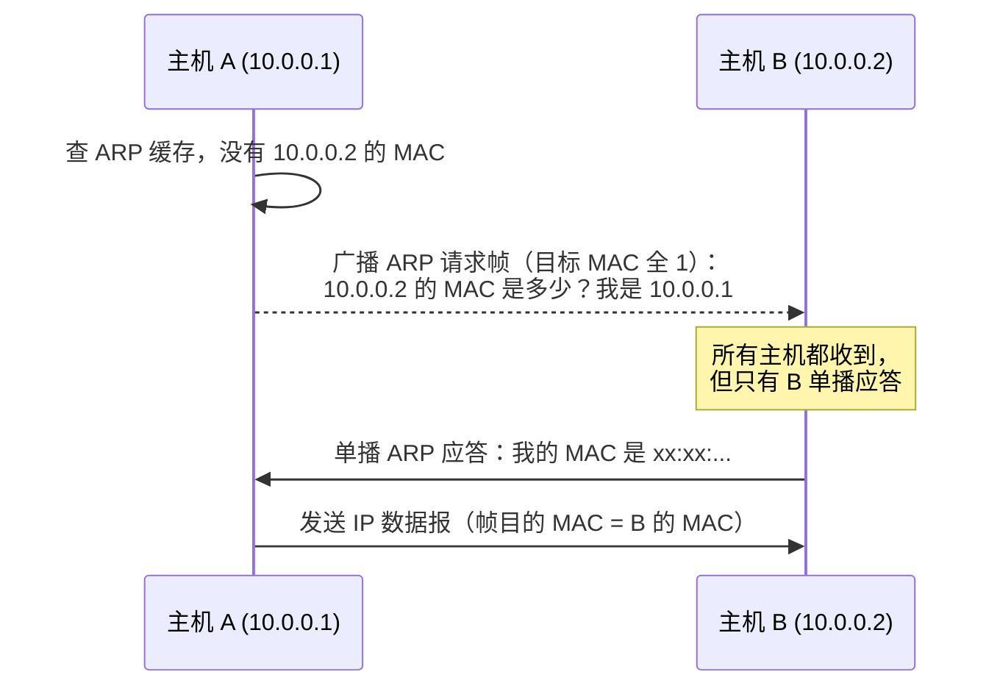

# 第 4 章：网络层

> 这是 408 计网**最重要的一章**，重要度 ⭐⭐⭐⭐⭐。选择题里子网划分、CIDR 聚合、IP 分片、路由协议对比几乎每年必出；综合题更是常客——2018 年考 IP 分片、2019/2020 年考 NAT 地址转换、ARP 与帧分析多次出现。本章内容多、计算多、协议多，建议投入 6-8 小时，把子网划分练到"看一眼就能写网络地址"的程度。

---

## 4.1 网络层的功能

网络层的核心任务是实现**异构网络互连**：不同网络的链路层协议（以太网、Wi-Fi、PPP）、MTU、帧格式各不相同，网络层通过统一的 IP 协议屏蔽底层差异，让分组能够跨越多个网络从源主机到达目的主机。

网络层的两大功能：

| 功能 | 平面 | 含义 |
|------|------|------|
| **路由选择** | 控制面 | 决定分组从源到目的走哪条路径，由路由协议（RIP/OSPF/BGP）计算路由表 |
| **分组转发** | 数据面 | 路由器根据目的地址查表，把分组从输入端口交换到正确的输出端口 |

> 路由是"制定路线"（控制面，慢），转发是"执行路线"（数据面，快）。路由器每转发一个分组都要查路由表。

**SDN（软件定义网络）**：传统路由器中控制面和数据面集成在同一设备中；SDN 将二者分离——数据面交换机只按流表转发，路由决策由集中的远程控制器（如 OpenFlow 控制器）统一下发。408 只需了解"控制面与数据面分离"这一核心思想。

**拥塞控制（网络层视角）**：当网络中的分组数超过网络处理能力时，路由器队列溢出导致丢包，全网性能下降，这就是拥塞。网络层可通过准入控制、流量感知、负载缓存等手段缓解拥塞。注意区分：**TCP 拥塞控制是端到端的**（发送方根据网络反馈调节发送速率，详见[第 5 章（传输层）](05-transport-layer.md)），而网络层拥塞控制是网络内部的全局手段，二者互补。

---

## 4.2 IPv4 分组格式

IP 数据报由**首部 + 数据**组成，首部固定部分 20 字节：

| 字段 | 位数 | 说明 |
|------|------|------|
| 版本 | 4 | IPv4 固定为 4 |
| 首部长度 | 4 | 以 **4 字节**为单位，最小 5（20B），最大 15（60B） |
| 服务类型 | 8 | 区分服务/优先级（考试一般不深究） |
| 总长度 | 16 | **首部 + 数据**的总字节数，最大 65535 |
| 标识 | 16 | 同一数据报的所有分片使用相同标识，用于重组 |
| 标志 | 3 | 第 1 位保留；**DF**=1 表示不允许分片；**MF**=1 表示后面还有分片 |
| 片偏移 | 13 | 该分片的数据在原数据报中的相对位置，以 **8 字节**为单位 |
| 生存时间 TTL | 8 | 每经过一个路由器减 1，减为 0 则丢弃并报告 ICMP 超时 |
| 协议 | 8 | 数据部分使用的上层协议：ICMP=1、OSPF=89、TCP=6、UDP=17 |
| 首部校验和 | 16 | **只校验首部，不校验数据部分** |
| 源 IP 地址 | 32 | 源主机地址 |
| 目的 IP 地址 | 32 | 目的主机地址 |
| 选项 | 0~40 | 填充至 4 字节整数倍 |

> 易错点 1：**首部长度以 4 字节为单位，片偏移以 8 字节为单位**，两个单位不一样，是选择题的高频陷阱。
> 易错点 2：IP 首部校验和**不包含数据部分**，因此每经过一个路由器只需重算首部校验和（TTL 变了），不必重新校验数据——这也是 IP 追求转发效率的体现。

---

## 4.3 IP 分片

链路层帧有**最大传输单元 MTU**（以太网为 1500 字节）。当 IP 数据报长度超过路径上某链路的 MTU 时，路由器对其进行分片；各分片**独立传输**，到目的主机才重组。

分片规则：

1. 每个分片都是完整的 IP 数据报：**每片都要有独立的 IP 首部**（首部字段从原数据报复制）
2. 所有分片的**标识字段相同**，MF、片偏移各不相同
3. 除最后一片外，每片的数据长度必须是 **8 的整数倍**（因为片偏移以 8 字节计）
4. **DF=1 时不允许分片**，超长则丢弃并报 ICMP"需要分片但 DF 已置位"
5. 分片之后如果 MTU 更小，**分片还可以再分片**
6. 中间路由器只分片不重组；重组只在目的主机进行

> 易错点：总长度字段是**每个分片自己的**首部+数据长度，不是原数据报的长度。片偏移 = 该分片数据在原数据报数据部分的起始位置 ÷ 8。

---

## 4.4 IP 地址

### 分类编址

IPv4 地址 32 位，点分十进制表示。分类编址按首几位划分：

| 类别 | 首位特征 | 地址范围 | 网络号位数 | 默认掩码 | 说明 |
|------|---------|---------|-----------|----------|------|
| A 类 | 0 | 1.0.0.0 ~ 126.255.255.255 | 8 | 255.0.0.0 | 大型网络 |
| B 类 | 10 | 128.0.0.0 ~ 191.255.255.255 | 16 | 255.255.0.0 | 中型网络 |
| C 类 | 110 | 192.0.0.0 ~ 223.255.255.255 | 24 | 255.255.255.0 | 小型网络 |
| D 类 | 1110 | 224.0.0.0 ~ 239.255.255.255 | — | — | 组播地址 |
| E 类 | 1111 | 240.0.0.0 ~ 255.255.255.255 | — | — | 保留 |

> A 类中网络号全 0（0.0.0.0）和 127 段保留：127.0.0.1 是**环回地址**，用于本机测试，不发到网络上。B、C 类同理，网络号全 0/全 1 不使用。

### 特殊地址

| 地址 | 含义 |
|------|------|
| 网络地址（主机位全 0） | 代表整个网络，如 192.168.1.0/24，不可分配给主机 |
| 广播地址（主机位全 1） | 向本网所有主机广播，如 192.168.1.255/24，不可分配给主机 |
| 255.255.255.255 | 本网络的受限广播 |
| 0.0.0.0 | 表示"本主机"（DHCP 请求时使用） |
| 127.0.0.1 | 环回测试地址 |

**私有地址**（仅在内部网络使用，不能出现在公网上，需经 NAT 转换）：

| 私有地址段 | CIDR 表示 | 可用主机数上限 |
|-----------|----------|--------------|
| 10.0.0.0 ~ 10.255.255.255 | 10.0.0.0/8 | 约 1677 万 |
| 172.16.0.0 ~ 172.31.255.255 | 172.16.0.0/12 | 约 104 万 |
| 192.168.0.0 ~ 192.168.255.255 | 192.168.0.0/16 | 65536 |

### 单播、广播、组播

- **单播**：一对一，目的地址是单个主机的 IP
- **广播**：一对全网（主机位全 1 或 255.255.255.255），路由器**不转发**广播分组
- **组播**：一对一组，使用 D 类地址 224.0.0.0/4（见 4.14 节）

---

## 4.5 子网划分与 CIDR

### 子网划分

两级 IP 地址（网络号 + 主机号）中，**从主机号借若干位作为子网号**，形成三级结构：网络号 + 子网号 + 主机号。子网划分对外部仍表现为一个网络，对内部划分为多个子网。

- **子网掩码**：网络位 + 子网位为 1，主机位为 0。如借 2 位做子网，C 类掩码从 255.255.255.0 变为 255.255.255.192（/26）
- **网络地址** = IP 地址 AND 子网掩码
- **广播地址** = 网络地址的主机位全部置 1
- **可用主机数** = $2^{\text{主机位数}} - 2$ （去掉网络地址和广播地址）

> 易错点：可用主机数必须**减 2**。题目问"可分配给主机的地址数"和"地址总数"是两个不同的问法。

### CIDR（无分类编址）

CIDR 取消 A/B/C 类划分，用 **网络前缀/前缀长度** 表示，如 202.113.96.0/24。CIDR 的优点：

1. 变长子网掩码（VLSM），地址分配更灵活，缓解地址浪费
2. 支持**路由聚合（超网）**，减小路由表规模

**路由聚合**：把多个连续的子网合并为一个更大的地址块对外通告。方法：将各网络地址写成二进制，找出**从左到右相同的位数**作为聚合后的前缀长度。

**最长前缀匹配**：CIDR 使路由表可能出现多个匹配项，转发时选择**前缀最长**（最精确）的那一条。实现上常用二叉树或 trie 结构。

> 路由聚合题的套路：写出待聚合地址的第三个字节（或第二个字节）的二进制，数公共前缀位数，前缀长度 = 原前缀 − 变化位数。聚合后的地址块大小必须是 2 的幂，且块首地址是块大小的整数倍。

---

## 4.6 NAT（网络地址转换）

私有地址不能直接上网，需要在私有网络与公网边界设置 **NAT 路由器**（至少有一个有效的公网地址），把私有地址转换为公网地址。

- **普通 NAT**：只转换 IP 地址，一个公网 IP 同时只能服务一台内网主机
- **NAPT（端口映射）**：同时转换 IP 地址和端口号，多台内网主机共享一个公网 IP，靠端口号区分会话——这是最常见的形式

NAT 路由器维护一张转换表：(内网 IP, 内网端口) ↔ (公网 IP, 公网端口)。

**分组穿越 NAT 的转换过程**（以 2019/2020 综合题考法为准）：

1. 内网主机发出分组：源 IP = 私有地址（如 192.168.1.2）
2. NAT 路由器**替换源 IP**（和源端口，若是 NAPT），目的 IP 不变
3. NAT 路由器像普通路由器一样把 **TTL 减 1**，并**重新计算首部校验和**（因为 TTL、源 IP 都变了）
4. 响应分组按转换表反向替换目的 IP（和端口）后送回内网

> 易错点：NAT 转换后**首部校验和一定改变**；TTL 每过一台路由器（包括 NAT 路由器）都要减 1。另外 NAT 对外屏蔽了内网结构，也缓解了公网地址不足。

---

## 4.7 IPv6

IPv4 地址即将耗尽，IPv6 主要特点：

| 特点 | 说明 |
|------|------|
| 地址 128 位 | 冒号十六进制表示，如 `2001:0db8:0000:0000:0000:ff00:0042:8329` |
| 首部固定 40 字节 | 简化字段，路由器处理更快 |
| **无广播地址** | 用组播替代广播；另新增任播地址 |
| **不允许中间路由器分片** | 分片只在源主机进行 |
| 即插即用 | 支持无状态地址自动配置（SLAAC） |

**地址表示规则**：

1. 每 16 位一组写为 4 位十六进制，共 8 组，用冒号分隔
2. **零压缩**：每组内前导 0 可省略
3. 连续的全 0 组可用 `::` 代替，但 **`::` 在一个地址中只能出现一次**（否则无法还原 0 的组数）

**IPv4 → IPv6 过渡技术**：

- **双栈**：同一台设备同时运行 IPv4 和 IPv6 两套协议栈
- **隧道**：把 IPv6 数据报封装在 IPv4 数据报中，穿越 IPv4 网络（"在 IPv4 的海洋上架桥"）

---

## 4.8 移动 IP

移动主机跨越不同网络时仍要用原地址通信，移动 IP 的四个关键概念：

| 概念 | 说明 |
|------|------|
| 归属地址 | 移动主机在归属网络中的永久地址，始终不变 |
| 转交地址 | 移动主机进入外地网络后临时获得的地址 |
| 归属代理 | 归属网络中的路由器，截获发给移动主机的分组并转发 |
| 外地代理 | 外地网络中的路由器，接收隧道分组并交付给移动主机 |

**间接路由**：通信方把分组发给移动主机的归属地址 → 归属代理发现主机在外地 → 通过隧道封装转交给外地代理 → 外地代理交给移动主机。

**三角路由**：移动主机把转交地址直接告知通信方，通信方直接发给转交地址。响应路径形成"通信方 → 移动主机 → 归属代理"的三角路径，效率高于间接路由但暴露了位置信息。

> 408 对移动 IP 要求不高，记住四个概念名词和"间接路由靠归属代理中转"即可。

---

## 4.9 路由算法与协议

### 静态路由与动态路由

- **静态路由**：管理员手工配置，简单、无开销，但不适应拓扑变化，适合小型网络
- **动态路由**：路由器之间用路由协议自动交换信息、更新路由表

### 层次路由：自治系统 AS

互联网规模巨大，单一路由协议无法支撑，因此划分为多个**自治系统（AS）**：

- **域内路由协议（IGP）**：AS 内部使用，如 RIP、OSPF
- **域间路由协议（EGP）**：AS 之间使用，目前只有 BGP

### 距离向量 vs 链路状态

| 对比项 | 距离向量（DV） | 链路状态（LS） |
|--------|---------------|---------------|
| 核心算法 | Bellman-Ford | Dijkstra 最短路 |
| 交换内容 | 自己的完整路由表（到所有目的的距离） | 与邻居的链路代价（LSA，洪泛全网） |
| 交换对象 | 只与邻居交换 | 向全网洪泛 |
| 信息视野 | 只知道方向和距离 | 掌握全网拓扑 |
| 收敛速度 | 慢（有计数到无穷问题） | 快 |
| 代表协议 | RIP | OSPF |

### RIP（路由信息协议）

RIP 基于距离向量算法（Bellman-Ford），属于域内路由协议：

- 度量：**跳数**，每经过一个路由器加 1；**跳数最大 15，16 表示不可达**——因此 RIP 只适合小型网络
- 每 **30 秒**向相邻路由器**广播**完整路由表（UDP 端口 520）
- 距离更新规则：收到邻居报文后，把其中各项距离加 1 作为"经由该邻居"的候选距离

**慢收敛与计数到无穷**：某网络不可达后，错误信息在相邻路由器间来回传递，跳数不断增加直到 16，收敛极慢。解决办法：

| 机制 | 内容 |
|------|------|
| 水平分裂 | 不把路由信息发回给它原来的来源方向 |
| 毒性逆转 | 把从某邻居学来的路由以"不可达（16 跳）"发回该邻居 |
| 触发更新 | 一旦检测到变化立即发送更新，不等 30 秒周期 |

> RIP 使用 UDP 传送（端口 520）。RIP 报文作为应用层数据，经 UDP → IP 封装；RIP 认为好的路由就是跳数最少的路由，而不考虑带宽。

### OSPF（开放最短路径优先）

OSPF 基于链路状态算法，属于域内路由协议：

- 每个路由器与相邻路由器交换**链路状态**，向全网**洪泛**，使每台路由器都拥有完整拓扑，再用 **Dijkstra 算法**计算最短路
- 链路度量可配置为带宽、时延等，比 RIP 灵活
- 收敛快，无计数到无穷问题
- **三层次结构**：**主干区域**（区域 0，连通所有其他区域）、**标准区域**、**末梢区域**（stub，不接收 AS 外部路由，减小区域内路由表）
- 支持 CIDR 和 VLSM；支持对报文**鉴别**（安全）；支持等价负载均衡
- **直接封装在 IP 数据报中**（IP 协议号 **89**），不使用 TCP/UDP

### BGP（边界网关协议）

BGP 是 AS 之间的域间路由协议：

- 基于**路径向量**算法，通告的不仅是距离，还有到达目的所经过的 AS 路径（防止环路）
- 每个 AS 至少一个 **BGP 发言人**；两个 AS 的发言人之间建立 **TCP 连接（端口 179）**，然后交换路由信息
- 与外部 AS 交换信息的称 **eBGP**，AS 内部发言人之间交换的称 **iBGP**
- BGP 只寻找**可行的、无环的路由**，不保证最优——因为 AS 间路由涉及商业政策、安全等复杂因素，"最优"难以定义

### 三大协议对比（必背）

| 对比项 | RIP | OSPF | BGP |
|--------|-----|------|-----|
| 算法 | 距离向量（Bellman-Ford） | 链路状态（Dijkstra） | 路径向量 |
| 度量 | 跳数（≤15） | 可配置（带宽等） | AS 路径等策略属性 |
| 范围 | 小型 AS 内部 | 大型 AS 内部 | AS 之间 |
| 收敛 | 慢 | 快 | 较慢（只追求可行路由） |
| 交换方式 | 30s 周期向邻居发送完整路由表 | 洪泛链路状态变化 | TCP 连接上交换报文 |
| 封装 | UDP 520 | IP 数据报（协议号 89） | TCP 179 |

> 记忆口诀：RIP 用 UDP（周期广播，丢了无所谓）、OSPF 直接跑在 IP 上（自己掌握洪泛可靠性）、BGP 用 TCP（AS 间交换必须可靠）。

---

## 4.10 路由器

### 路由器的组成

| 部件 | 功能 |
|------|------|
| **输入端口** | 接收比特流、解封装、查路由表确定输出端口、排队 |
| **交换结构** | 把分组从输入端口送到输出端口；三种实现：存储器交换、总线交换、交叉开关 |
| **输出端口** | 缓冲、调度（排队与丢弃策略，如尾丢弃/RED）、封装发送 |
| 路由处理机 | 运行路由协议、计算并维护路由表 |

> 输入端口查表转发是"数据面"工作，路由处理机计算路由表是"控制面"工作，呼应 4.1 节 SDN 的分离思想。

### 路由表与转发过程

路由表的每个表项包含：**目的网络前缀（含掩码）、下一跳地址（或接口）**。转发时：

1. 提取目的 IP，与表项的掩码做 AND 运算
2. 若与某表项的网络前缀匹配，则发往该表项的下一跳
3. 有多个匹配时，选**最长前缀**；都不匹配时走默认路由（0.0.0.0/0）
4. 下一跳通常是相邻路由器的接口地址，再用 ARP 解析其 MAC 地址后封装成帧（见 4.12 节）

---

## 4.11 ICMP

ICMP（网际控制报文协议）封装在 IP 数据报中传输（IP 协议号 1），用于报告差错和询问，**不能纠正差错**，只是让源主机知道出了问题。

### 差错报告报文（5 种）

| 类型 | 触发条件 |
|------|---------|
| 终点不可达 | 路由器/主机无法交付分组 |
| 源站抑制 | 路由器缓存满，请求源主机减速（现已少用） |
| 超时 | TTL 减为 0，或分片迟迟不能重组 |
| 参数问题 | 首部字段有错误 |
| 重定向 | 路由器告诉主机"有更好的下一跳" |

> **关键细节**：ICMP 差错报文的数据部分 = **原 IP 数据报的首部 + 数据部分的前 8 个字节**（前 8 字节含传输层端口号，源主机据此定位是哪个进程出错）。注意：对差错报文本身、广播分组、D 类组播分组**不产生** ICMP 差错报文。

### 询问报文（4 种）

| 类型 | 用途 |
|------|------|
| 回送请求 / 回送回答 | **ping** 的基础 |
| 时间戳请求 / 回答 | 同步时钟 |
| 地址掩码请求 / 回答 | 获取子网掩码 |
| 路由器询问 / 通告 | 发现路由器 |

**traceroute 原理**：源主机发送 TTL 从 1 开始逐次加 1 的分组（Unix 用 UDP 高端口，Windows 用 ICMP 回送请求）。TTL=1 的分组在第一个路由器被丢弃，该路由器回送 **ICMP 超时报文**；TTL=2 时第二个路由器回送超时……如此逐跳探测出路径，直到到达目的主机。

> ping 用 ICMP 回送请求/回答，**不需要 ARP 之外的任何高层协议**；但 ICMP 报文本身装在 IP 数据报里。

---

## 4.12 ARP（地址解析协议）

IP 地址最终要映射为链路层 MAC 地址才能发帧。**ARP 解决"同一局域网内"已知 IP 求 MAC 的问题**，每个主机维护一张 ARP 高速缓存。

要点：

- 请求**广播**，应答**单播**
- 收到请求的主机顺便把 A 的 IP-MAC 记入自己的缓存
- ARP 缓存有老化时间，超时未使用则删除
- **ARP 代理**：目的主机不在本网络时，路由器用自己的 MAC 地址应答，代替真实主机"应答"

**跨网段通信时的 ARP**：源主机发现目的 IP 不在本网络，则把分组发给**默认网关**——此时 ARP 解析的对象是**网关接口的 MAC**，而不是目的主机的 MAC。IP 地址全程不变，MAC 地址每换一个局域网就换一次。

> 易错点：ARP 只解析**下一跳**的 MAC 地址。"IP 地址端到端不变，MAC 地址逐跳改变"是 2011 年综合题的经典考法。

---

## 4.13 DHCP

DHCP（动态主机配置协议）为主机动态分配 IP 地址及子网掩码、默认网关、DNS 服务器等配置。基于 UDP：**服务器端口 67，客户端端口 68**。

**DORA 四步**（主机刚入网，尚无 IP，使用 0.0.0.0 → 255.255.255.255 广播）：

| 步骤 | 方向 | 内容 |
|------|------|------|
| 1. Discover | 客户 → 服务器（广播） | 寻找可用的 DHCP 服务器 |
| 2. Offer | 服务器 → 客户 | 提供拟分配的 IP 及配置 |
| 3. Request | 客户 → 服务器（广播） | 选定某服务器的提议并正式请求 |
| 4. ACK | 服务器 → 客户 | 确认分配，租期开始 |

- 分配的地址有**租期**，到期前客户要续租
- **DHCP 中继代理**：DHCP 广播报文不会被路由器转发；若某子网没有 DHCP 服务器，由该子网的中继代理（配置了服务器 IP）把 Discover 报文**以单播转发**给远端服务器

> 注意区分：DHCP 的 Discover/Request 用广播，而 ARP 请求也是广播——两者都不是 ICMP。

---

## 4.14 IP 组播

组播是一对多的传输方式，只把数据发给加入该组的主机：

- 组播地址：**D 类地址 224.0.0.0/4**（224.0.0.0 ~ 239.255.255.255）
- 组播只在局域网内用 MAC 组播地址（01-00-5E + IP 组播地址的低 23 位）直接交付；跨网络需组播路由器支持
- **IGMP（网际组管理协议）**：管理主机的组播组成员关系——主机用 IGMP 报告自己加入了哪个组播组，组播路由器据此决定是否向该网络转发组播分组

> 组播地址只作目的地址，不作源地址；组播不保证可靠传输。

---

## 4.15 典型例题

**例 1**（子网划分）：某主机 IP 为 202.112.10.131/27，求该子网的网络地址、广播地址、可分配给主机的地址范围和可用主机数。

**解**：

掩码 /27 = 255.255.255.224，最后一个字节 131 = 10000011，与 11100000 做 AND 得 10000000 = 128。

- 网络地址：202.112.10.**128**
- 广播地址：主机位全 1 → 202.112.10.**159**
- 主机范围：202.112.10.129 ~ 202.112.10.158
- 可用主机数： $2^5 - 2 = 30$

> 若题目改为"把 202.112.10.0/24 划分为 4 个子网"，则需借 2 位主机位，每个子网 /26，可用主机数为 $2^6 - 2 = 62$ 个。

**例 2**（路由聚合）：路由器收到 4 条路由：172.16.4.0/24、172.16.5.0/24、172.16.6.0/24、172.16.7.0/24。聚合后对外通告的路由是什么？

**解**：

写出第三个字节的二进制：

| 网络 | 第三字节 |
|------|---------|
| 172.16.4.0 | 000001**00** |
| 172.16.5.0 | 000001**01** |
| 172.16.6.0 | 000001**10** |
| 172.16.7.0 | 000001**11** |

前 6 位（000001）相同，后 2 位变化。聚合前缀长度 = 16 + 6 = 22，聚合结果：**172.16.4.0/22**（覆盖 172.16.4.0 ~ 172.16.7.255）。

**例 3**（最长前缀匹配）：路由表如下，分别求目的地址 131.22.32.70、131.22.100.5、131.23.1.1 的下一跳。

| 目的网络 | 下一跳 |
|----------|--------|
| 131.22.0.0/16 | R1 |
| 131.22.32.0/19 | R2 |
| 131.22.32.64/26 | R3 |
| 0.0.0.0/0 | R4 |

**解**：

- 131.22.32.70：匹配 /16；/19 覆盖 32.0~63.255，匹配；/26 覆盖 32.64~32.127，匹配。取最长前缀 → **R3**
- 131.22.100.5：只匹配 /16 → **R1**
- 131.23.1.1：无匹配，走默认路由 → **R4**

**例 4**（IP 分片）：一个 IP 数据报数据部分为 1620 字节（首部 20 字节），需经过 MTU = 800 字节的网络，应如何分片？写出各分片的总长度、MF 和片偏移。

**解**：

每片最大数据 = 800 − 20 = 780 字节，且须为 8 的整数倍 → 每片最多装 **776** 字节数据。1620 = 776 + 776 + 68，共 3 片：

| 分片 | 数据长度 | 总长度 | MF | 片偏移 |
|------|---------|--------|-----|--------|
| 片 1 | 776 | 796 | 1 | 0 |
| 片 2 | 776 | 796 | 1 | 776/8 = **97** |
| 片 3 | 68 | 88 | 0 | 1552/8 = **194** |

> 三片的标识字段相同。最后一片 68 字节不是 8 的倍数也合法（只有最后一片可以不是）。若片 2 再经过 MTU 更小的网络，还可能**再分片**。

**例 5**（RIP 更新）：路由器 A 的路由表如下，此时收到邻居 B 发来的距离向量（10.1.0.0: 1，10.2.0.0: 5，10.3.0.0: 3）。求 A 更新后的路由表。

| 目的网络 | 距离 | 下一跳 |
|----------|------|--------|
| 10.1.0.0 | 2 | B |
| 10.2.0.0 | 3 | C |
| 10.3.0.0 | 4 | B |

**解**：

更新规则：经由 B 的新距离 = B 报告的距离 + 1；**下一跳不变（仍是 B）的表项无条件更新**；下一跳改变的表项只在新距离更小时才更新。

| 目的网络 | 经由 B 的新距离 | 决策 | 更新后 |
|----------|----------------|------|--------|
| 10.1.0.0 | 1 + 1 = 2 | 下一跳本来就是 B，更新 | 距离 2，下一跳 B |
| 10.2.0.0 | 5 + 1 = 6 | 6 > 3（原经 C），保持 | 距离 3，下一跳 C |
| 10.3.0.0 | 3 + 1 = 4 | 下一跳是 B，更新 | 距离 4，下一跳 B |

**例 6**（ARP 与帧分析，2011 真题风格）：主机 A（192.168.1.10，MAC_A）向主机 B（192.168.2.20，MAC_B）发送分组，途经路由器 R：接口 1 为 192.168.1.1/MAC_R1（接 A 所在网段），接口 2 为 192.168.2.1/MAC_R2（接 B 所在网段）。A 的 ARP 缓存为空。问：① A 发出的第一个 ARP 请求的内容；② A 发出的 IP 分组封装成帧时的源/目的 MAC；③ B 收到的帧的源/目的 MAC。

**解**：

① A 发现目的 IP 192.168.2.20 不在本网络（掩码 255.255.255.0），于是 ARP 解析**默认网关** 192.168.1.1 的 MAC：**广播**"192.168.1.1 的 MAC 地址是什么？我是 192.168.1.10"，R 接口 1 **单播**应答 MAC_R1。

② A 发出的帧：源 MAC = MAC_A，**目的 MAC = MAC_R1**（网关），源 IP = 192.168.1.10，目的 IP = 192.168.2.20。

③ R 从接口 2 转发（先 ARP 解析 B 的 MAC），B 收到的帧：源 MAC = **MAC_R2**，目的 MAC = MAC_B，IP 地址不变。

> 结论：**IP 地址全程不变，MAC 地址每经过一个路由器改变一次**——源 MAC 是发出设备的接口 MAC，目的 MAC 永远是下一跳的接口 MAC。

**例 7**（NAT 转换，2019/2020 综合题风格）：内网主机 H（192.168.1.2，源端口 3105）访问 Web 服务器 S（202.2.2.2，端口 80）。NAT 路由器公网 IP 为 202.1.1.1，为该会话分配端口 5001。写出 H 发出的分组经过 NAT 路由器后的首部变化。

**解**：

| 字段 | 转换前 | 转换后 |
|------|--------|--------|
| 源 IP | 192.168.1.2 | **202.1.1.1** |
| 源端口 | 3105 | **5001** |
| 目的 IP | 202.2.2.2 | 不变 |
| TTL | 64（假设） | **63**（减 1） |
| 首部校验和 | 原值 | **重新计算** |

服务器应答时，NAT 路由器按转换表把目的 IP 202.1.1.1:5001 还原为 192.168.1.2:3105 送回内网。

---

## 本章小结

### 核心要点回顾

1. **网络层两大功能**：路由选择（控制面）与分组转发（数据面）
2. **IP 分组**：首部长度以 4 字节为单位；片偏移以 8 字节为单位；首部校验和只校验首部；TTL 每跳减 1 并重算校验和
3. **IP 地址**：A/B/C/D/E 五类；主机位全 0 是网络地址、全 1 是广播地址；三个私有地址段；可用主机数 = $2^n - 2$
4. **子网划分与 CIDR**：AND 掩码得网络地址；路由聚合找公共前缀；转发用最长前缀匹配
5. **NAT**：私有地址转公网地址，NAPT 连同端口一起转换；转换时 TTL 减 1、重算校验和
6. **IPv6**：128 位、无广播、路由器不分片、`::` 只出现一次；过渡用双栈和隧道
7. **路由协议**：RIP（距离向量、UDP 520、≤15 跳）、OSPF（链路状态、IP 协议号 89、三层次区域）、BGP（路径向量、TCP 179、AS 间）
8. **ICMP**：5 种差错报文 + 4 种询问报文；差错报文携带原 IP 首部 + 前 8 字节数据；ping 用回送请求/回答，traceroute 用 TTL 递增 + 超时报文
9. **ARP**：广播请求、单播应答，只解析下一跳 MAC；**DHCP**：DORA 四步，UDP 67/68，中继代理单播转发
10. **组播**：D 类地址 224.0.0.0/4，IGMP 管理组成员

### 考试重点排序

| 优先级 | 考点 | 题型 |
|--------|------|------|
| ⭐⭐⭐ | 子网划分 / CIDR / 路由聚合 / 最长前缀匹配 | 选择题 + 综合题 |
| ⭐⭐⭐ | IP 分片计算（片偏移、MF、各片长度） | 选择题 + 综合题（2018） |
| ⭐⭐⭐ | NAT 转换过程（源 IP 替换、TTL、校验和） | 综合题（2019/2020） |
| ⭐⭐⭐ | ARP 过程与帧中 MAC/IP 分析 | 综合题（2011） |
| ⭐⭐ | RIP/OSPF/BGP 对比、RIP 路由表更新 | 选择题 |
| ⭐⭐ | ICMP 差错报文（traceroute、TTL 超时） | 选择题 |
| ⭐⭐ | DHCP 四步与端口、IPv6 表示法 | 选择题 |
| ⭐ | 移动 IP、SDN、组播、路由器结构 | 选择题 |

> 复习策略：子网划分和分片计算靠刷题练手感（做 10 道真题即可熟练）；三大路由协议的对比表和 ICMP/DHCP 的细节靠记忆；综合题要会写"分组逐跳变化表"（IP 不变、MAC 变、TTL 递减）。学完本章请继续[第 5 章（传输层）](05-transport-layer.md)，那里有另一个每年必考的重点——TCP。MAC 地址与以太网帧的细节见[第 3 章（数据链路层）](03-data-link-layer.md)。

---

## 自测题

1. IP 分片中，片偏移字段以多少字节为单位？MF = 0 表示什么？
2. 三个私有地址段分别是什么（用 CIDR 表示）？
3. 某主机 IP 为 192.168.5.200/26，求其所在子网的网络地址、广播地址和可用主机数。
4. RIP、OSPF、BGP 分别使用什么协议封装传输？各有什么端口/协议号？
5. traceroute 是如何逐跳探测出到达目的主机的路径的？
6. DHCP 的四个报文步骤是什么？使用什么传输协议和端口？
7. NAT 路由器转发分组时，除了替换地址/端口，还必须对 IP 首部做哪两处修改？为什么？

> **答案**：1. 以 **8 字节**为单位；MF = 0 表示这是**最后一个分片**。2. **10.0.0.0/8、172.16.0.0/12、192.168.0.0/16**。3. 200 = 11001000，与 11000000 AND 得 11000000 = 192，故网络地址 **192.168.5.192**，广播地址 **192.168.5.255**（ $192 + 2^6 - 1 = 255$ ），可用主机数 $2^6 - 2 =$ **62**。4. RIP 用 **UDP 端口 520**；OSPF **直接封装在 IP 数据报中（协议号 89）**；BGP 用 **TCP 端口 179**。5. 发送 TTL 从 1 开始逐次加 1 的分组：TTL 在某路由器减为 0 时该路由器丢弃分组并回送 **ICMP 超时报文**，源主机由此得知该跳地址；TTL 不断增大直到到达目的主机，从而获得完整路径。6. **Discover → Offer → Request → ACK**（DORA）；使用 **UDP**，服务器端口 **67**，客户端端口 **68**。7. ① **TTL 减 1**（它是路由器，每跳必减）；② **重新计算首部校验和**（TTL 和源 IP 都发生了变化，而校验和覆盖整个首部）。
