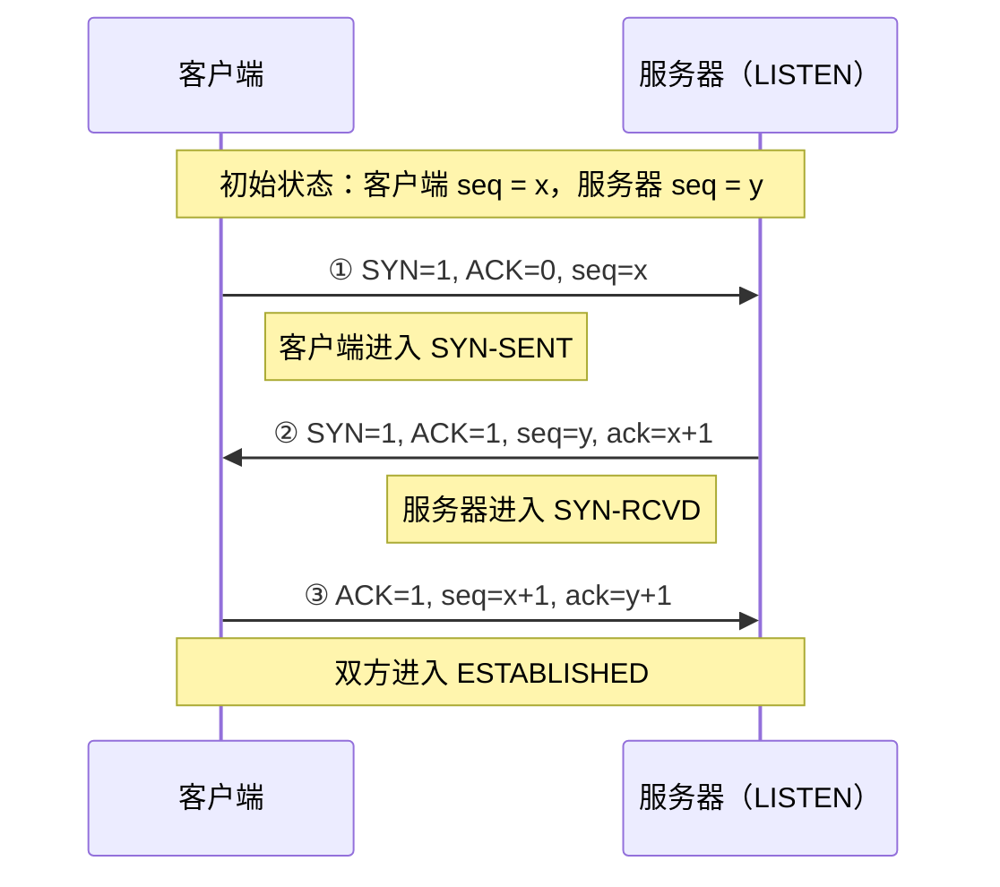
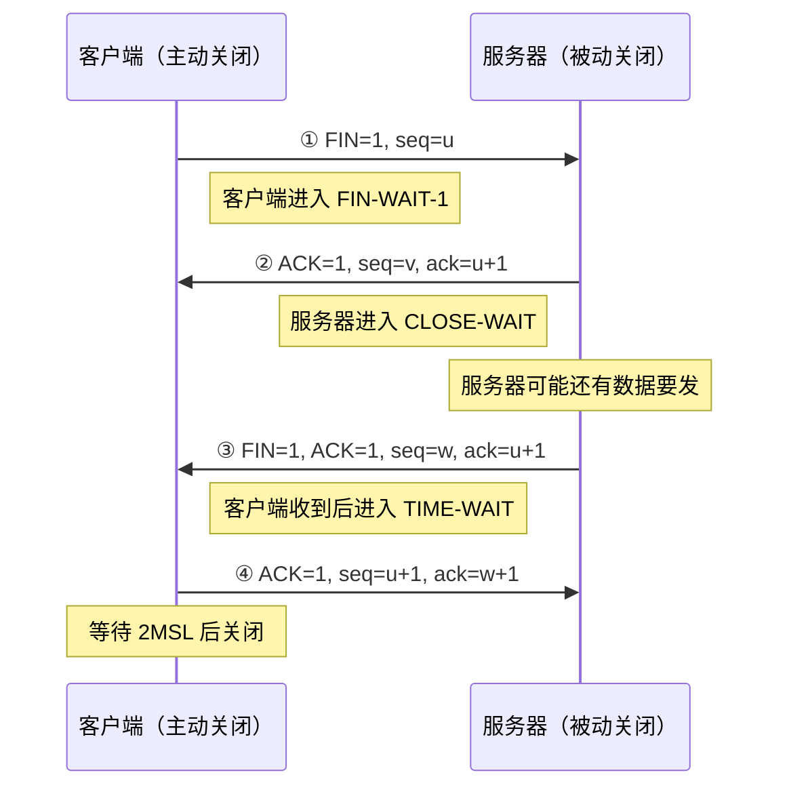

# 第 5 章：传输层

> 这章是 408 计网最重要的一章，重要度 ⭐⭐⭐⭐⭐。**三次握手、四次挥手、拥塞控制**是选择题与综合题的双重高频考点，几乎每年必出一题；2016 等年份的综合题直接考过 TCP 拥塞窗口推演。网络层解决的是**主机到主机**的通信，传输层在此之上解决**进程到进程**的通信，并为应用层提供 UDP（不可靠、尽力而为）和 TCP（可靠、面向连接）两种服务。本章建议投入 6-8 小时，重点是状态推演类题目的动手练习。

---

## 5.1 传输层的功能

### 进程间通信（端到端）

- **网络层**把分组从源主机送到目的主机（IP 地址标识主机）
- **传输层**把数据交付给目的主机上的**具体进程**（端口号标识进程）

传输层提供的逻辑通信称为**端到端（end-to-end）通信**。发送方的传输层把应用报文封装为**报文段（segment）**，交给网络层；接收方的传输层根据端口号把报文段交付给对应进程。

### 复用与分用

| 概念 | 方向 | 含义 |
|------|------|------|
| **复用** | 发送方 | 多个应用进程共用一个传输层，报文段加上不同端口号后一起交给 IP 层 |
| **分用** | 接收方 | 传输层根据**目的端口号**把报文段交付给不同的应用进程 |

> 复用分用的判断依据是**端口号**，就像网络层复用分用靠 IP 地址、链路层靠 MAC 地址一样。

### 端口号

端口号长度为 **16 bit**，取值范围 $0 \sim 65535$ ，分为三类：

| 类别 | 范围 | 说明 |
|------|------|------|
| **知名端口**（well-known） | 0-1023 | 永久分配给标准服务，如 HTTP 80、DNS 53 |
| **注册端口**（registered） | 1024-49151 | 供用户进程或应用程序注册使用，如很多数据库、中间件在此登记 |
| **动态/私有端口**（dynamic/private） | 49152-65535 | 客户端临时端口，由操作系统随机分配，用完即弃 |

常见知名端口（与[第 6 章（应用层）](06-application-layer.md)联动记忆）：

| 端口 | 服务 | 端口 | 服务 |
|------|------|------|------|
| 20/21 | FTP（数据/控制） | 80 | HTTP |
| 22 | SSH | 110 | POP3 |
| 23 | Telnet | 143 | IMAP |
| 25 | SMTP | 443 | HTTPS |
| 53 | DNS | 67/68 | DHCP |

> 端口号只具有**本地意义**：不同主机上的同一端口号互不相关。服务器端使用知名端口被动等待，客户端使用动态端口主动发起。

---

## 5.2 UDP 协议

### 特点：无连接、不可靠、面向报文

| 特点 | 含义 |
|------|------|
| **无连接** | 发送数据前不需要建立连接，减少时延和开销 |
| **不可靠** | 不保证交付、不排序、无拥塞控制、无流量控制 |
| **面向报文** | 应用层交下来的报文**不合并、不拆分**，加上首部后原样交给 IP 层 |
| 支持一对一/一对多 | 可用于单播、广播、多播 |

> **面向报文 vs 面向字节流**：UDP 保留报文边界，应用层每次 `recvfrom` 拿到的是一个完整报文；TCP 把数据看成无结构的字节流，没有报文边界，因此 TCP 有**粘包问题**而 UDP 没有。

### UDP 首部格式（8 字节）

| 字段 | 长度 | 位置说明 | 作用 |
|------|------|---------|------|
| 源端口 | 16 bit（2 B） | 字节 0~1 | 标识发送进程；可全 0（不需要对方回复时） |
| 目的端口 | 16 bit（2 B） | 字节 2~3 | 标识交付给哪个目的进程 |
| 长度 | 16 bit（2 B） | 字节 4~5 | UDP 用户数据报的总长度（首部 + 数据），最小值 8 |
| 校验和 | 16 bit（2 B） | 字节 6~7 | 检测差错；计算时加**伪首部** |

### 伪首部（pseudo header）

计算校验和时，在 UDP 数据报前临时加上一个 **12 字节**的伪首部：

- 源 IP 地址（4 字节）+ 目的 IP 地址（4 字节）
- 全 0 字段（1 字节）+ 协议号 17（1 字节）
- UDP 长度（2 字节）

> 伪首部**不向下传送也不向上交付**，只用于校验和计算。把 IP 地址纳入校验的目的是让 UDP 能检测出"数据报送到了错误的主机"。IPv4 中 UDP 校验和可置 0 表示不校验；IPv6 中 UDP 校验和**必须**使用。

### 适用场景

- **DNS**：查询报文小、一问一答（区域传送用 TCP）
- **视频流/实时通信**：容忍少量丢失，不能容忍重传带来的时延
- **QUIC**：基于 UDP 实现的可靠传输协议（HTTP/3 的底层），把可靠传输、拥塞控制上移到应用层

---

## 5.3 TCP 协议概述与报文段格式

### 主要特点

1. **面向连接**：通信前必须三次握手建立连接，结束后释放连接
2. **点对点**：每条连接只有两个端点（套接字 = IP 地址 : 端口号）
3. **可靠交付**：无差错、不丢失、不重复、按序到达
4. **全双工**：双方可同时发送和接收，每个方向独立维护序号与窗口
5. **面向字节流**：把应用数据看成无结构的字节流，按字节编号

### TCP 报文段首部格式

| 字段 | 长度 | 位置说明 | 作用 |
|------|------|---------|------|
| 源端口 | 16 bit（2 B） | 字节 0~1 | 标识源应用进程 |
| 目的端口 | 16 bit（2 B） | 字节 2~3 | 标识目的应用进程 |
| 序号 seq | 32 bit（4 B） | 字节 4~7 | 本报文段**第一个数据字节**的序号 |
| 确认号 ack | 32 bit（4 B） | 字节 8~11 | **期望收到**的下一个字节的序号 |
| 数据偏移 | 4 bit | 字节 12~13 的高 4 bit | 首部长度，单位 32 bit（4 字节） |
| 保留 | 6 bit | 字节 12~13，紧跟数据偏移 | 保留为 0 |
| 6 个标志位 | 各 1 bit（共 6 bit） | 字节 12~13 的低 6 bit | URG / ACK / PSH / RST / SYN / FIN（见下文「六个标志位」表） |
| 窗口 | 16 bit（2 B） | 字节 14~15 | 接收窗口 rwnd，流量控制用 |
| 校验和 | 16 bit（2 B） | 字节 16~17 | 差错检测；计算时也要加伪首部 |
| 紧急指针 | 16 bit（2 B） | 字节 18~19 | 配合 URG 指出紧急数据末尾位置 |
| 选项 + 填充 | 0 ~ 40 B | 字节 20 之后 | 填充至 4 字节整数倍，使首部长度可达 60 B |

**首部长度**：固定部分 **20 字节**（数据偏移最小值 5），加上选项最大 **60 字节**（数据偏移最大值 15，即 $15 \times 4 = 60$ 字节）。

### 六个标志位

| 标志 | 名称 | 作用 |
|------|------|------|
| URG | 紧急 | 本报文段含紧急数据，紧急指针有效 |
| **ACK** | 确认 | 确认号字段有效；连接建立后所有报文段 ACK=1 |
| PSH | 推送 | 接收方应尽快交付数据，不必等缓存填满 |
| RST | 复位 | 严重错误，必须释放连接重建 |
| **SYN** | 同步 | 建立连接时同步序号；SYN=1 且 ACK=0 表示连接请求 |
| **FIN** | 结束 | 释放连接，发送方数据已发完 |

> 易错点：SYN 报文和 FIN 报文即使**不携带数据**，也要**消耗一个序号**（相当于一个字节），对方确认时确认号要 +1。

---

## 5.4 序号与确认号的语义

TCP 把每个字节都编号。32 bit 序号空间为 $0 \sim 2^{32}-1$ ，循环使用（模 $2^{32}$ ）。

- **seq**：本报文段所携带数据的**第一个字节**的序号。例如发送 seq=301、共 200 字节的数据，覆盖序号 301-500
- **ack**：接收方**期望收到的下一个字节**的序号，隐含"ack-1 及之前的字节都已正确收到"——这就是**累积确认**

举例：A 依次发送三个报文段，数据各 200 字节，序号分别为 1、201、401。B 若已收到前两段，回复 `ack=401` 表示"400 及以前都收到了，等 401 开始"。若第二段丢失，B 收到第三段后仍回复 `ack=201`（重复 ACK），提示 A 从 201 重传。

> **确认号 = 已正确收到的最后一个字节序号 + 1**。考试中最常见的错误就是把 ack 当成"最后收到的字节序号"，算错一个字节。

---

## 5.5 TCP 连接管理：三次握手

### 完整时序

设客户端初始序号为 $x$ ，服务器初始序号为 $y$ ：

| 报文 | 标志位 | 序号字段 | 说明 |
|------|--------|---------|------|
| ① | SYN=1, ACK=0 | seq=x | 客户端发起连接请求，消耗一个序号 |
| ② | SYN=1, ACK=1 | seq=y, ack=x+1 | 服务器同意连接并确认收到 ① |
| ③ | ACK=1 | seq=x+1, ack=y+1 | 客户端确认收到 ②，可携带数据 |

### 为什么需要三次（不能两次）

1. **防止已失效的历史连接请求造成错误**：若客户端某次 SYN 在网络中滞留后到达服务器，两次握手会让服务器直接建立连接白白浪费资源；三次握手时客户端可以认出不属于自己的连接，发送 RST 拒绝
2. **同步双方初始序号（ISN）**：每个方向都要把自己的初始序号告诉对方并得到确认，两次握手只能同步一个方向
3. **确认双方收发能力正常**：第一次确认了服务器的收发能力，第二次确认了客户端的收发能力，第三次让服务器确认客户端收到了自己的序号

### SYN 洪泛攻击（了解）

攻击者伪造大量源 IP 发送 SYN，服务器为每个半连接分配资源后永远等不到第三次握手，半连接队列被占满，无法响应正常请求。缓解手段：SYN Cookie、缩短半连接超时等。

> 选择题常问"为什么不能两次握手"，标准答案要点就是**防止旧的重复连接初始化**与**同步初始序号**。

---

## 5.6 TCP 连接释放：四次挥手

### 完整时序

设客户端主动关闭，其当前序号为 $u$ （前面已发送的最后一个字节序号 +1），服务器当前序号为 $v$ ；服务器把剩余数据发完后，序号推进到 $w$ （即服务器已发送的最后一个字节序号 +1， $w \geq v$ ）：

| 报文 | 标志位 | 序号字段 | 说明 |
|------|--------|---------|------|
| ① | FIN=1 | seq=u | 客户端数据发完，请求释放，消耗一个序号 |
| ② | ACK=1 | seq=v, ack=u+1 | 服务器确认，此时连接处于**半关闭**状态 |
| ③ | FIN=1, ACK=1 | seq=w, ack=u+1 | 服务器数据也发完，请求释放 |
| ④ | ACK=1 | seq=u+1, ack=w+1 | 客户端最后确认，之后等待 2MSL |

### 为什么是四次

TCP 是**全双工**的，两个方向必须分别关闭。客户端发 FIN 后服务器先回 ACK；如果服务器此时**还有数据要发**，FIN 只能等数据发完后单独发送，因此 ACK 和 FIN 不能合并，共四次。若服务器收到 FIN 时已无数据可发，则 ② 和 ③ 可合并为一次发送，退化为**三次挥手**。

### TIME_WAIT（2MSL）

MSL（Maximum Segment Lifetime）是报文段在网络中的最长生存时间，RFC 建议 2 分钟，TIME_WAIT 持续 **2MSL**。作用有三：

1. **保证最后一个 ACK 能到达对方**：若 ④ 丢失，服务器会重传 FIN；客户端在 2MSL 内仍可收到并重新 ACK，否则服务器会误认为连接异常释放
2. **让本连接的旧报文段在网络中消失**：防止旧连接的迟到报文被新连接误收
3. **保证连接可靠地关闭**：综合前两点，确保连接的两个方向都真正终结

### 同时打开与同时关闭（了解）

- **同时打开**：两端同时发 SYN，各收到对方 SYN 后回 SYN+ACK，最终建立一条连接（共 4 个报文）
- **同时关闭**：两端同时发 FIN，互回 ACK，双方都进入 TIME_WAIT 后关闭

> 408 很少直接考同时打开/关闭，但**综合题可能给出非常规时序让你判断状态**，知道这两种情况可以避免误判。

---

## 5.7 TCP 可靠传输机制

### 滑动窗口与累积确认

- 发送方维护**发送窗口**，窗口内的字节可以连续发送而不必等待确认
- 接收方通过 TCP 首部的**窗口字段**通告自己的接收能力（rwnd）
- 采用**累积确认**：ack 号确认的是连续字节流，中间丢一个段，后续段即使到达也无法推进确认点

### 超时重传与 RTT 估计

发送方为每个报文段维护重传定时器。超时时间的设定依赖 RTT 采样：

$$
RTO = RTT_s + 4 \times RTT_d
$$

其中 $RTT_s$ 是加权平均的 RTT 样本， $RTT_d$ 是偏差的加权平均。基本概念：

- RTT 样本通过 `新样本 = 实际测量值` 、 $RTT_s = (1-\alpha) RTT_s + \alpha \times \text{样本}$ 加权平滑
- **Karn 算法**：报文段被重传后，其 RTT 样本**不能**用于估计（无法区分确认属于原报文还是重传报文）
- RTO 应略大于估计的 RTT；过小导致不必要的重传，过大导致网络空闲

> 408 不要求计算 RTO 公式，但要理解"为什么超时时间不能设得太小或太大"以及 Karn 算法的原因。

### 快速重传（fast retransmit）

- 发送方收到**3 个重复 ACK**（即累计 4 个相同的 ACK）时，**不等超时**，立即重传该重复 ACK 对应的报文段
- 原理：重复 ACK 说明后续报文已经到达但中间有缺口，大概率是丢包而非乱序
- 快速重传与超时重传的后续处理不同：超时 → cwnd 归 1 重新慢开始；快重传 → 进入快恢复（见 5.9）

---

## 5.8 TCP 流量控制

### 接收窗口 rwnd

- 接收方在 ACK 报文的**窗口字段**中通告自己接收缓存的剩余空间，即 rwnd
- 发送方的发送窗口**不能超过** rwnd，防止接收方缓存溢出
- 流量控制是**端到端**机制，只关心接收方处理能力；拥塞控制关心的是网络承载能力

### 零窗口问题与持续计数器

若接收方通告 rwnd=0，发送方停止发送，但双方都要防止**死锁**：

1. **零窗口探测报文**：发送方设置**持续计数器（persistence timer）**，定时发送只含 **1 字节**的探测报文，促使接收方重新通告窗口
2. **窗口更新报文丢失**：接收方后来发来的窗口更新 ACK 若丢失，靠探测报文机制恢复
3. **糊涂窗口综合症**：接收方每次只通告很小的窗口会造成效率低下，应积累到一定空间再通告

> 易错点：流量控制死锁的破解手段是**零窗口探测报文**，不是重传定时器，也不是 RST。

---

## 5.9 TCP 拥塞控制（408 综合题重灾区）

### 基本思路

发送方维护两个变量：

- **拥塞窗口 cwnd**：根据网络拥塞程度估计的窗口
- **慢开始门限 ssthresh**：慢开始与拥塞避免的分界线

$$
\text{发送窗口} = \min(rwnd,\ cwnd)
$$

> 流量控制与拥塞控制共同起作用：发送窗口取两者较小值。题目若说"接收窗口足够大"，则发送窗口就等于 cwnd。

### 四种算法

| 算法 | 触发条件 | cwnd 变化规则 |
|------|---------|--------------|
| **慢开始** | 连接初始 / 超时后， $cwnd < ssthresh$ | 每经过一个 RTT， $cwnd$ **翻倍**（指数增长） |
| **拥塞避免** | $cwnd \ge ssthresh$ | 每经过一个 RTT， $cwnd$ **+1 MSS**（线性增长） |
| **快重传** | 收到 **3 个重复 ACK** | 立即重传丢失报文段，不等超时 |
| **快恢复** | 快重传之后 | $ssthresh = cwnd/2$ ， $cwnd = ssthresh$ （或 $ssthresh + 3$ ），收到新 ACK 后进入拥塞避免 |
| 超时处理 | 重传定时器超时 | $ssthresh = cwnd/2$ ， $cwnd = 1$ ，重新慢开始 |

慢开始的过程（设初始 $cwnd = 1$ ，MSS 为一个报文段）：

| 传输轮次 | 1 | 2 | 3 | 4 | 5 |
|---------|---|---|---|---|---|
| cwnd | 1 | 2 | 4 | 8 | 16 |

> 关键区分：**超时**说明网络严重拥塞，惩罚重——cwnd 归 1；**快重传**（收到重复 ACK）说明网络还有数据在流动，拥塞较轻——cwnd 减半后继续（快恢复）。两种情况的 ssthresh 都减半。

> 关于 $cwnd = ssthresh$ 时用慢开始还是拥塞避免：谢希仁教材采用**拥塞避免**，408 真题也遵循这一约定。

---

## 5.10 TCP 与 UDP 对比

| 对比项 | TCP | UDP |
|--------|-----|-----|
| 连接 | 面向连接（三次握手） | 无连接 |
| 可靠性 | 可靠交付（确认、重传、排序） | 尽最大努力交付 |
| 面向 | **字节流**（有粘包问题） | **报文**（保留报文边界） |
| 传输方式 | 点对点 | 一对一/一对多，支持广播多播 |
| 首部 | 最小 20 字节，最大 60 字节 | 固定 8 字节 |
| 流量控制 | 有（rwnd） | 无 |
| 拥塞控制 | 有（四种算法） | 无 |
| 应用场景 | 文件传输、邮件、Web（HTTP/1.1、HTTP/2） | DNS、视频流、实时通信、QUIC |

---

## 5.11 典型例题

**例 1**（三次握手报文分析）：主机 A（端口 50000）向主机 B 的 HTTP 服务器（端口 80）发起 TCP 连接。A 的初始序号 $x = 100$ ，B 的初始序号 $y = 200$ 。连接建立后 A 立即发送一个携带 300 字节数据的报文段。求：① 三次握手三个报文中的 seq/ack 值；② B 对该数据报文段的确认号；③ A 下一个报文段的序号。

**解**：

① 三次握手：

- 报文 ①：SYN=1，seq=100
- 报文 ②：SYN=1，ACK=1，seq=200，ack=101（SYN 消耗一个序号）
- 报文 ③：ACK=1，seq=101，ack=201

② A 的数据报文段：seq=101，共 300 字节，覆盖序号 101-400。B 期望收到的下一个字节是 401，故**确认号 ack=401**。

③ A 下一个报文段的序号 = 已发送的最后一个字节序号 +1 = $101 + 300 = 401$ 。

> 本题综合了三个易错点：SYN 消耗序号、确认号是"期望的下一个字节"、下一个 seq 等于本段 seq + 数据长度。

**例 2**（拥塞控制推演，408 真题风格）：设 TCP 连接的 MSS = 1 KB，初始拥塞窗口 cwnd = 1 KB，初始慢开始门限 ssthresh = 16 KB。传输过程中，**第 8 个传输轮次**发生超时（该轮发送的报文段重传定时器超时）。之后没有再发生拥塞事件。求：① 第 1-7 轮各自的 cwnd；② 超时后新的 ssthresh 和 cwnd；③ 第 12 轮的 cwnd。

**解**：

① 慢开始阶段（ $cwnd < ssthresh$ ，每轮翻倍），第 5 轮达到 16 = ssthresh，此后进入拥塞避免（每轮 +1）：

| 轮次 | 1 | 2 | 3 | 4 | 5 | 6 | 7 | 8 |
|------|---|---|---|---|---|---|---|---|
| cwnd (KB) | 1 | 2 | 4 | 8 | 16 | 17 | 18 | 19 |

② 超时处理： $ssthresh = \lfloor 19/2 \rfloor = 9$ KB， $cwnd = 1$ KB，重新慢开始。

③ 超时后各轮：第 9 轮 cwnd=1，第 10 轮 2，第 11 轮 4，**第 12 轮 cwnd = 8** KB（仍小于新 ssthresh=9，处于慢开始）。

> 变式：若第 8 轮不是超时而是收到 3 个重复 ACK，则 $ssthresh = 9$ KB， $cwnd = 9$ KB（快恢复），第 9 轮起按拥塞避免每轮 +1。**超时与快重传的惩罚力度不同是最高频考点**。

**例 3**（序号空间回绕）：TCP 序号字段为 32 bit，MSL 为 60 s。求理论上不使序号在网络中重复出现的最大发送速率；并解释为什么高速链路需要时间戳选项（PAWS）。

**解**：

序号空间大小： $2^{32} = 4\,294\,967\,296$ 字节 $\approx 4.29 \times 10^9$ B。

要使序号在一个 MSL 内不回绕，发送速率上限为：

$$
\frac{2^{32}\ \text{B}}{60\ \text{s}} \approx 71.6 \times 10^6\ \text{B/s} \approx 573\ \text{Mb/s}
$$

即速率超过约 573 Mb/s 时，60 s 内序号就会回绕，**网络中残留的旧报文段可能携带"新"序号**而被连接误收。1 Gb/s 链路上回绕周期仅约 $2^{32}/(10^9/8) \approx 34$ s < MSL，因此高速 TCP 使用**时间戳选项（PAWS）** 给报文段打上时间戳来丢弃过期报文段。

> 注意单位：序号按**字节**编号，算速率时要区分 B/s 与 b/s（ $\times 8$ 关系）。

**例 4**（发送窗口与速率计算）：主机 A 向 B 发送数据，MSS = 1 KB，RTT 恒为 20 ms，接收方通告的窗口 rwnd = 8 KB 且保持不变，拥塞窗口 cwnd = 16 KB。链路带宽足够。求 A 的最大平均发送速率。

**解**：

发送窗口 $= \min(rwnd, cwnd) = \min(8, 16) = 8$ KB。

窗口内数据发出后需等待一个 RTT 才能收到确认并滑动窗口，因此最大平均速率：

$$
R = \frac{W}{RTT} = \frac{8\ \text{KB}}{20\ \text{ms}} = 400\ \text{KB/s} = 3.2\ \text{Mb/s}
$$

> 此类题的套路：**发送窗口 = min(rwnd, cwnd)**，再用"窗口 ÷ RTT"得速率；若题目还给链路带宽，还要与带宽取最小。

### 解题技巧总结

- 看到握手/挥手报文分析 → 先写出双方 ISN，再按"SYN/FIN 消耗一个序号"逐段推算
- 看到拥塞控制 → 列表格，明确每轮属于慢开始（翻倍）还是拥塞避免（+1），标出每次事件后的 ssthresh 与 cwnd
- 看到序号回绕 → $2^{32}$ 字节空间 ÷ 时间
- 看到发送速率 → 先求 min(rwnd, cwnd)，再除以 RTT

### 常见陷阱清单

1. **确认号是期望收到的下一个字节序号**，不是最后收到的序号（差 1）
2. **SYN/FIN 报文消耗一个序号**，即使不带数据
3. **超时**：cwnd 归 1、ssthresh 减半、重新慢开始；**快重传**：cwnd 减半、进入快恢复——两者不要混淆
4. **快重传触发条件是 3 个重复 ACK**（累计 4 个相同 ACK），不是 1 个也不是超时
5. **TIME_WAIT 时长是 2MSL**，作用是保证最后 ACK 可达 + 清除旧报文段
6. **TCP 面向字节流有粘包问题**，UDP 面向报文没有
7. 拥塞控制中 cwnd 的单位通常是 **MSS**，计算字节数时别忘乘 MSS

---

## 本章小结

### 核心要点回顾

1. **传输层提供进程间通信**：靠端口号复用分用；端口分三类（0-1023 / 1024-49151 / 49152-65535）
2. **UDP**：无连接、不可靠、面向报文，首部仅 8 字节；校验和计算要用伪首部
3. **TCP 报文段**：首部最小 20 最大 60 字节；seq = 本段第一个字节序号，ack = 期望收到的下一个字节序号；六个标志位 URG/ACK/PSH/RST/SYN/FIN
4. **三次握手**：SYN → SYN+ACK → ACK；目的是同步 ISN、防止历史连接误建立
5. **四次挥手**：FIN → ACK → FIN → ACK；TIME_WAIT 2MSL 保证最后 ACK 到达并清除旧报文
6. **可靠传输**：滑动窗口 + 累积确认 + 超时重传 + 快速重传（3 个重复 ACK）
7. **流量控制**：rwnd 通告接收能力；零窗口探测报文防死锁
8. **拥塞控制**：慢开始（翻倍）→ 拥塞避免（+1）；超时则 ssthresh 减半、cwnd=1；快重传则快恢复（cwnd=ssthresh）；发送窗口 = min(rwnd, cwnd)

### 考试重点排序

| 优先级 | 考点 | 题型 |
|--------|------|------|
| ⭐⭐⭐ | 拥塞控制 cwnd 推演（超时 vs 快重传） | 选择题 + 综合题 |
| ⭐⭐⭐ | 三次握手/四次挥手报文分析（seq/ack 推算） | 选择题 + 综合题 |
| ⭐⭐⭐ | TCP 首部字段与标志位语义 | 选择题 |
| ⭐⭐ | TIME_WAIT（2MSL）的作用、握手次数原因 | 选择题 |
| ⭐⭐ | TCP 与 UDP 对比、端口号分类 | 选择题 |
| ⭐ | RTT 估计、Karn 算法、零窗口探测、同时打开 | 选择题 |

> 本章复习策略：**拥塞控制一定要亲手画 cwnd 表格**（建议做 5 道以上真题），握手挥手的 seq/ack 推算要能在一分钟内完成。TCP 与[第 4 章（网络层）](04-network-layer.md)的 IP 分片经常联合出综合题（如 TCP 报文段经 IP 分片后某片丢失的分析）；掌握本章后进入[第 6 章（应用层）](06-application-layer.md)，应用层协议（DNS/HTTP/FTP/SMTP）的传输层选择会直接用到本章知识。

---

## 自测题

1. UDP 首部共多少字节？包含哪四个字段？伪首部的作用是什么？
2. 端口号分为哪三类？各自范围是什么？
3. 为什么 TCP 建立连接要三次握手，两次可以吗？
4. TCP 释放连接通常为什么需要四次挥手？什么情况下可以变成三次？
5. TIME_WAIT 状态持续多长时间？有什么作用？
6. 快速重传的触发条件是什么？它与超时重传在 cwnd/ssthresh 的处理上有何不同？
7. 为什么说 TCP 有粘包问题而 UDP 没有？
8. 发送方收到接收方通告的窗口 rwnd = 0 后完全停止发送，如何避免双方因此死锁？

> **答案**：
> 1. 8 字节；源端口、目的端口、长度、校验和（各 2 字节）；伪首部（源 IP、目的 IP、协议号、UDP 长度）用于校验和计算，可检测数据报是否被送到错误主机，本身不传送。
> 2. 知名端口 0-1023；注册端口 1024-49151；动态/私有端口 49152-65535。
> 3. 两次不行：① 无法防止已失效的历史连接请求到达服务器后错误建立连接；② 双方初始序号（ISN）需要在两个方向上都得到确认；③ 三次恰好让双方都确认了对方和自己的收发能力。
> 4. TCP 全双工，每个方向要单独关闭；服务器收到 FIN 后可能还有数据未发完，ACK 与 FIN 只能分开发送，共四次。若服务器收到 FIN 时已无数据可发，ACK 和 FIN 合并发送，即三次挥手。
> 5. 2MSL；① 保证最后一个 ACK 能到达对方（丢失时可重传 ACK）；② 让本连接在网络中的旧报文段全部消失；③ 保证连接可靠关闭。
> 6. 触发条件：收到 3 个重复 ACK。超时重传：ssthresh=cwnd/2、cwnd=1，重新慢开始；快重传：ssthresh=cwnd/2、cwnd=ssthresh（快恢复），收到新 ACK 后进入拥塞避免。
> 7. TCP 面向字节流，数据无边界，应用层读取长度与写入长度不一定对应，可能一次读到多个报文的数据（粘包）；UDP 面向报文，保留报文边界，一次交付一个完整报文。
> 8. 发送方设置持续计数器，定时发送 1 字节的零窗口探测报文，促使接收方重新通告窗口；接收方收到探测报文后在应答中给出当前窗口值，从而解除死锁。
