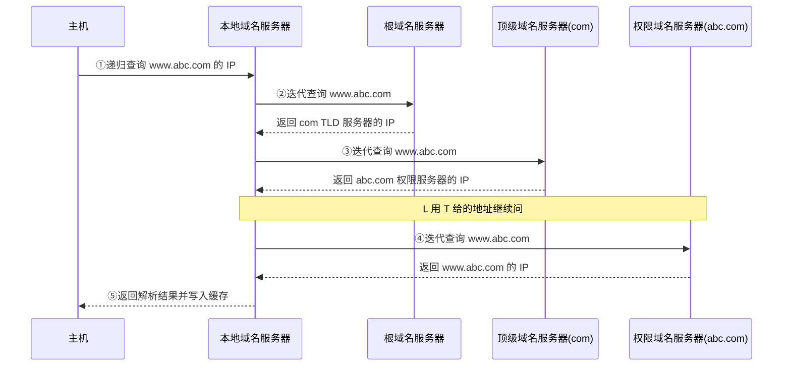
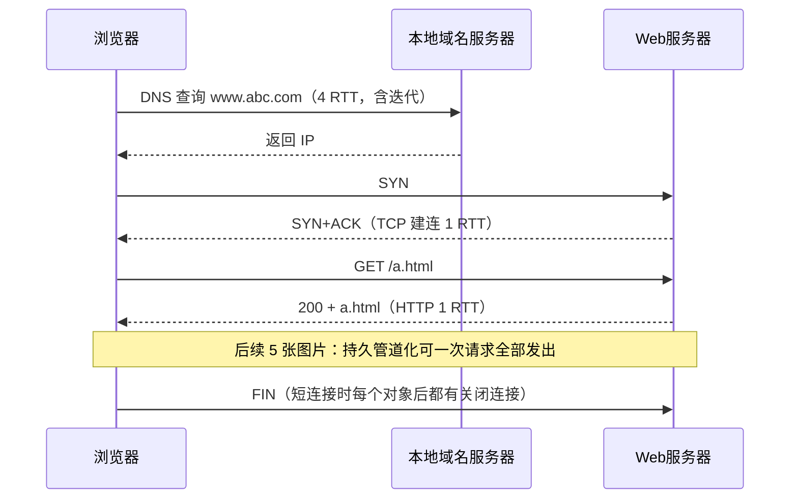

# 第 6 章：应用层

> 应用层是五层模型的顶层，直接面向用户进程。在 408 里本章重要度 ⭐⭐⭐，以选择题为主，但**"浏览器输入 URL 到页面显示"的全过程分析（DNS → TCP → HTTP）是综合题的高频素材**，2021 年综合题就考了访问 URL 过程中的 ARP、DNS 与交换机自学习帧分析。本章知识点偏记忆：协议端口、DNS 解析流程、HTTP 方法/状态码、FTP 双连接、邮件系统的推/拉协议。建议 2-3 小时搞定，重点放在 DNS 解析流程和访问全过程的 RTT 计算上。

---

## 6.1 网络应用模型

| 模型 | 特点 | 优点 | 缺点 |
|------|------|------|------|
| **C/S（客户/服务器）** | 服务器永久提供服务，客户机请求服务 | 管理集中、服务器资源充足 | 服务器是瓶颈，扩容成本高 |
| **P2P（对等网络）** | 每个节点既是客户又是服务器 | 可扩展性好，无中心瓶颈 | 管理分散、安全性差 |
| **混合结构** | C/S + P2P/CDN 结合 | 兼顾可控性与扩展性 | 架构复杂 |

- **P2P 的典型应用**：BitTorrent（文件分发）、早期 Skype（语音）
- **混合结构的典型应用**：大型视频网站——中心服务器管理用户信息（C/S），视频内容由 **CDN（内容分发网络）** 分发。CDN 把内容缓存到地理上靠近用户的节点，用户就近获取，减轻源站压力

> 注意 CDN 与 P2P 的区别：CDN 是"多副本缓存 + 就近访问"，本质上仍是 C/S；P2P 是每个参与者都贡献带宽。考试中问"某视频网站的架构"，答"混合结构（C/S + CDN）"。

---

## 6.2 DNS 域名系统

### 6.2.1 层次域名空间

DNS（Domain Name System）把便于记忆的域名映射为 IP 地址。域名空间是一棵**倒置的树**，从根到叶依次为：

```text
根域（.）→ 顶级域 TLD（com/cn/edu/org）→ 二级域（abc）→ 主机名（www）
完整域名：www.abc.com.（末尾的根域"."通常省略）
```

| 要点 | 说明 |
|------|------|
| 大小写 | **域名不区分大小写**（WWW.ABC.COM 与 www.abc.com 等价） |
| 长度限制 | 每个标号 ≤ 63 字符，**完整域名 ≤ 255 字符** |
| 标号分隔 | 用 "." 分隔，标号内不能再含 "." |

**常见顶级域分类**：

| 类别 | 例子 |
|------|------|
| 国家顶级域 nTLD | cn、us、jp |
| 通用顶级域 gTLD | com、net、org、edu、gov |
| 基础结构域名 | arpa（反向解析用，IP → 域名） |

### 6.2.2 域名服务器的层次

域名服务器与域名空间对应，也分四级：

| 服务器 | 职责 | 数量/特点 |
|--------|------|-----------|
| **根域名服务器** | 知道所有 TLD 服务器的地址，返回"下一步该问谁" | 全球 13 个逻辑根（a~m），不直接解析主机名 |
| **顶级域名服务器（TLD）** | 管理本顶级域，返回二级域的权限服务器地址 | 每个 TLD 一个（如 .com 服务器） |
| **权限域名服务器** | 负责一个区的解析，**给出的回答是权威的** | 每个区至少一个，如 abc.com 的服务器 |
| **本地/缓存域名服务器** | 不严格属于层次结构，离用户最近 | ISP 或单位提供；缓存解析结果，命中时不再向上查询 |

> 易错点：**根域名服务器并不直接返回最终 IP**，它只告诉你 TLD 服务器在哪。真正"一锤定音"的是权限域名服务器。

### 6.2.3 域名解析过程：递归 + 迭代

主机只向**本地域名服务器**发一次**递归查询**（要求对方负责查到底）；本地域名服务器向根、TLD、权限服务器逐个发**迭代查询**（对方只告诉"下一步问谁"，由本地服务器自己继续问）。



**例**：浏览器输入 `http://www.abc.com/index.html` 到拿到目标 IP，完整过程如下（设本地域名服务器缓存为空）：

**解**：

1. 浏览器先查**本地 hosts 文件和浏览器缓存**，未命中
2. 向本地域名服务器发**递归查询**（1 次 DNS 请求）
3. 本地域名服务器查自己的缓存，未命中，向**根服务器**发迭代查询（第 2 次），根返回 com TLD 服务器 IP
4. 向 **TLD 服务器**发迭代查询（第 3 次），返回 abc.com 权限服务器 IP
5. 向**权限服务器**发迭代查询（第 4 次），得到 www.abc.com 的 IP
6. 本地域名服务器将结果**缓存**（按 RR 中的 TTL 计时）后返回主机；浏览器随后用该 IP 发起 TCP 连接

> 若第 3 步本地域名服务器缓存**命中且未过期**，则流程在 2 之后直接结束，只有 1 次 DNS 往返。整个流程共 **4 次 DNS 请求、8 条 DNS 报文**（4 个请求 + 4 个响应，即 4 个 RTT），有些资料描述为"8 条 DNS 报文"，注意与"4 次请求"的问法对应。

### 6.2.4 DNS 报文格式与资源记录

DNS 请求与响应使用**同一种报文格式**：

| 部分 | 内容 |
|------|------|
| 首部 | **固定 12 字节**：标识（16b，匹配请求与响应）、标志（16b，区分查询/响应、递归位等）、**4 个计数字段**：问题数、回答资源记录数、权威资源记录数、附加资源记录数（各 16b） |
| 问题部分 | 查询的域名与类型 |
| 回答/权威/附加部分 | 资源记录 RR |

**资源记录 RR 是四元组**：（名字，类型，值，生存时间 TTL）

| 类型 | 名字 → 值的含义 |
|------|----------------|
| **A** | 域名 → IPv4 地址 |
| **AAAA** | 域名 → IPv6 地址 |
| **CNAME** | 别名 → 规范域名（别名解析） |
| **NS** | 域 → 该域的权限域名服务器 |
| **MX** | 域 → 邮件服务器（邮件交换） |
| **PTR** | IP → 域名（反向解析，用于 arpa 域） |

### 6.2.5 DNS 使用的传输层协议

| 场景 | 传输协议 | 说明 |
|------|---------|------|
| 一般查询与响应 | **UDP，端口 53** | 报文小，用 UDP 开销低 |
| **响应超过 512 字节** | **TCP，端口 53** | 服务器只回带截断标志的 UDP 首部，客户改用 TCP 重查 |
| **区域传送**（主从服务器间同步） | **TCP，端口 53** | 数据量大且要求可靠 |

> 常见陷阱：**DNS 默认用 UDP 但不只用 UDP**。选择题说"DNS 只使用 UDP"是错的；说"DNS 查询一定用 UDP"也要警惕超过 512 字节切换 TCP 的情况。

---

## 6.3 WWW 与 HTTP

### 6.3.1 WWW 的概念与 URL

WWW（万维网）是一个分布式超媒体系统，由**URL、页面（HTML 文档）、超链接**三要素组成，通过 HTTP 协议访问。

**URL 格式**：`scheme://host[:port]/path`

- `scheme`：协议名（http、https、ftp）
- `host`：主机域名或 IP
- `port`：可省略，省略时用协议默认端口（HTTP 默认 **80**，HTTPS 默认 **443**）
- `path`：资源路径

> 陷阱：`http://www.abc.com:8080/a.html` 访问的是 8080 端口而不是默认 80。**URL 中显式指定端口时用指定端口**。

### 6.3.2 HTTP 的连接方式

| 版本 | 连接方式 | 特点 |
|------|---------|------|
| HTTP/1.0 | **短连接** | 每个对象都要"建连 → 请求 → 释放"，开销大 |
| HTTP/1.1 | **持久连接（默认）** | 一次 TCP 连接可传送多个对象；非管道化时逐个请求-响应，**管道化**时可连续发请求再收响应 |
| HTTP/2 | 多路复用 + 二进制分帧（了解） | 一条连接上并行多个请求/响应，解决队头阻塞（应用层层面） |

> HTTP/1.1 持久连接分**非管道化**（收到响应才发下一个请求）和**管道化**（不等响应连续发请求）两种，计算题要会区分，见 6.8 例 2。

### 6.3.3 请求方法语义表

| 方法 | 语义 | 幂等 | 安全（只读） |
|------|------|------|------|
| **GET** | 读取资源，参数放在请求行 URL 中 | 是 | 是 |
| **POST** | 提交实体，由服务器处理（如表单提交） | 否 | 否 |
| **PUT** | 上传/整体替换指定资源 | 是 | 否 |
| **DELETE** | 删除指定资源 | 是 | 否 |
| **HEAD** | 只取响应首部、不取实体（测试用） | 是 | 是 |

> 幂等指多次执行效果与一次相同。GET/HEAD 还是"安全"方法（不应改变服务器状态）。

### 6.3.4 响应状态码

| 分类 | 含义 | 常见代码 |
|------|------|---------|
| 1xx | 通知信息 | 100 继续 |
| 2xx | 成功 | **200** OK |
| 3xx | 重定向 | **301** 永久移动；**302** 临时移动；**304** 资源未修改（协商缓存命中，见 6.3.7） |
| 4xx | 客户差错 | **400** 请求报文语法错误；**403** 服务器拒绝服务（无权限）；**404** 资源不存在 |
| 5xx | 服务器差错 | **500** 服务器内部错误；**502** 网关错误；**503** 服务器暂不可用（过载/维护） |

> 易错点：301 与 302 的区别是"永久 vs 临时"；403（有权限问题）与 404（资源不存在）别混；502 是网关/代理收到上游的无效响应，503 是服务器自身过载。

### 6.3.5 HTTP 报文结构

**请求报文** = 请求行 + 首部行 + 空行（CRLF）+ 实体（可选）：

```text
GET /index.html HTTP/1.1        ← 请求行：方法 + URL + 版本
Host: www.abc.com               ← 首部行
Cookie: ab=123
（空行）
（GET 一般无实体；POST 的表单数据在实体中）
```

**响应报文** = 状态行 + 首部行 + 空行 + 实体：

```text
HTTP/1.1 200 OK                 ← 状态行：版本 + 状态码 + 原因
Content-Type: text/html
Last-Modified: Wed, 05 Aug 2026 02:00:00 GMT
（空行）
<html>...</html>                ← 实体
```

### 6.3.6 Cookie 与 Session

HTTP 是**无状态**协议，服务器不记得之前的请求。Cookie 用来弥补：

1. 首次访问，服务器在响应中加 `Set-Cookie: user=alice` 首部
2. 浏览器保存该 Cookie，之后每次请求该站点都带上 `Cookie: user=alice` 首部
3. 服务器据此识别用户，实现"登录状态、购物车"等

| 对比项 | Cookie | Session |
|--------|--------|---------|
| 存放位置 | **客户端**（浏览器） | **服务器端** |
| 内容 | 少量键值对 | 会话数据（可较大） |
| 关联方式 | 通常 Session 依赖 Cookie 传递 SessionID | 服务器用 SessionID 查找会话 |

### 6.3.7 缓存与代理：条件 GET 与 304

浏览器/代理缓存过期后，不必重新下载整个对象，而是用**条件 GET** 与源服务器协商：

1. 浏览器发请求，带 `If-Modified-Since: <上次缓存的 Last-Modified 时间>`
2. 服务器比较该时间与资源的最后修改时间：
   - **未修改** → 返回 **304 Not Modified**，响应**不含实体**，浏览器继续用本地缓存
   - **已修改** → 返回 200 + 最新实体

> 304 的意义是**节省带宽**：只传首部不传实体。这是计算题考点——304 响应的实体长度为 0。

### 6.3.8 HTTPS

**HTTPS = HTTP + TLS/SSL**，默认端口 **443**。TLS/SSL 提供机密性（加密）、完整性与身份认证（数字证书）。

> HTTPS 工作在应用层（TLS 介于应用层与传输层之间），加密的是应用层报文；传输层 TCP 本身不加密。

### 6.3.9 访问全过程的 RTT 计算（综合题高频）

从"输入 URL"到"收到第一个对象"的完整过程（无缓存）：**DNS 解析 → TCP 建连 → HTTP 请求/响应**。设本地域名服务器缓存未命中，各环节各计 1 个 RTT：

| 阶段 | 过程 | RTT |
|------|------|-----|
| DNS | 主机 ↔ 本地域名服务器（递归）1 次；本地 ↔ 根/TLD/权限（迭代）3 次；共 4 次往返、8 条 DNS 报文 | **4** |
| TCP | 三次握手（SYN、SYN+ACK 算 1 个往返；最后的 ACK 捎带请求，不单独计） | **1** |
| HTTP | 发送请求报文 → 收到响应 | **1** |
| **合计** | | **6 RTT** |

**不同条件下的对比表**（访问 1 个对象）：

| 场景 | DNS RTT | TCP 建连 | HTTP 请求/响应 | 总 RTT |
|------|---------|---------|---------------|--------|
| 本地 DNS 无缓存 + 非持久连接 | 4 | 1 | 1 | **6** |
| 本地 DNS **缓存命中** + 非持久连接 | 0 | 1 | 1 | **2** |
| DNS 命中 + **持久连接（非管道化）** | 0 | 1 | 1 | **2** |
| DNS 命中 + 持久连接（管道化） | 0 | 1 | 1 | **2** |

**访问 n 个对象**（DNS 4 RTT、TCP 建连 1 RTT 的前提下）：

| 连接方式 | 请求阶段 RTT | 总 RTT |
|---------|-------------|--------|
| 非持久连接（每对象都要建连） | 每个对象 2 RTT | 4 + 2n |
| 持久连接非管道化 | 每对象 1 RTT，逐个进行 | 4 + 1 + n |
| 持久连接管道化 | 一次发完全部请求 | 4 + 1 + 1 + 1 |

> 持久连接管道化行的公式按「对象由页面引用、需先取页面」的依赖前提计算：先花 1 RTT 取到引用页（如 a.html），浏览器才能知道其余对象的 URL，剩余 n−1 个对象的请求再管道化一次发完（1 RTT）。若所有对象 URL 事先已知，则为 4 + 1 + 1。
>
> 完整的多对象计算例题见 6.8 例 2。记忆口诀：**"DNS 四（无缓存）TCP 一，HTTP 一往返"**；管道化的收益体现在多对象上。

---

## 6.4 FTP 文件传输协议

FTP 使用**两条 TCP 连接**：

| 连接 | 端口 | 生命周期 | 传输内容 |
|------|------|---------|---------|
| **控制连接** | **21** | **持久**：整个会话期间一直打开 | 命令与应答（USER、PASS、LIST、RETR、STOR 等） |
| **数据连接** | 主动模式：**20** | 每传送一个文件临时建立，传完即释放 | 文件内容、目录列表 |

**为什么要带外传送控制命令**：控制连接与数据连接分离后，传送大文件（数据连接被长时间占用）时仍可经控制连接发新命令、查进度、中断传输，控制信息不会被数据阻塞。

**主动模式 vs 被动模式**：

| 对比项 | 主动模式（PORT） | 被动模式（PASV） |
|--------|----------------|----------------|
| 数据连接发起方 | **服务器 → 客户**（服务器 20 端口主动连客户的高位端口） | **客户 → 服务器**（客户连服务器临时打开的高位端口） |
| NAT 友好性 | 差：NAT 后的客户没有公网端口可供服务器连入 | **好**：连接由内网客户发起，NAT 正常放行 |

> 陷阱 1：FTP 的**控制连接端口是 21，数据连接（主动模式）端口是 20**，别记反。陷阱 2：主动模式下数据连接由**服务器发起**，这是 FTP 独有的"反向连接"。

---

## 6.5 电子邮件

### 6.5.1 系统组成与收发链路

电子邮件系统由三部分组成：**用户代理（UA）、邮件服务器、协议**。发送用 SMTP（推），接收用 POP3/IMAP（拉）。


- 用户代理负责撰写、显示邮件；邮件服务器负责存储与转发
- 发件人 UA → 发送方服务器：SMTP；服务器之间：SMTP；收件人从服务器取信：POP3/IMAP

### 6.5.2 SMTP 与 MIME

**SMTP**：基于 **TCP 25** 端口，是**推协议**（发送方主动推给下一跳）；**只能传送 7 位 ASCII 文本**。

**MIME（多用途互联网邮件扩展）** 的作用：在不改变 SMTP 的前提下，通过**编码 + 首部声明**支持非 ASCII 文字、图片、音视频等二进制内容。

| MIME 首部 | 作用 | 例子 |
|-----------|------|------|
| Content-Type | 声明实体类型 | `text/plain`、`image/jpeg`、`multipart/mixed` |
| Content-Transfer-Encoding | 声明编码方式 | `base64`、`quoted-printable`、`7bit` |

### 6.5.3 POP3 与 IMAP

| 协议 | 端口 | 模式 | 特点 |
|------|------|------|------|
| **POP3** | TCP **110** | 拉取，两阶段：授权（USER/PASS）+ 事务 | 两种工作模式：**下载即删除**（读完从服务器删）、**下载并保留**（服务器留副本）；不在服务器维护目录结构 |
| **IMAP** | TCP **143** | 拉取，**服务器端管理** | 邮件默认留在服务器，支持文件夹、部分下载，**多设备状态同步** |

> 核心区分：**SMTP 是推、POP3/IMAP 是拉**。"发送用 SMTP，接收用 POP3/IMAP"是选择题送分点。注意 POP3 的"下载并保留"模式虽然服务器留副本，但对文件夹/已读状态的管理能力仍不如 IMAP。

---

## 6.6 DHCP 的应用层视角

DHCP（动态主机配置协议）为刚入网的主机动态分配 IP 地址及子网掩码、默认网关、DNS 服务器等配置，与[第 4 章（网络层）](04-network-layer.md)的 IP 编址呼应，协议本身属于**应用层**，基于 **UDP**：客户端用 **68** 端口，服务器用 **67** 端口，初期靠**广播**通信。

**DORA 四步**：

| 步骤 | 报文 | 方向与方式 |
|------|------|-----------|
| **D**iscover | DHCP 发现 | 客户 → 255.255.255.255 广播（源 0.0.0.0） |
| **O**ffer | DHCP 提供 | 服务器提供可用 IP（可广播或单播） |
| **R**equest | DHCP 请求 | 客户广播选择某个服务器的提供 |
| **A**ck | DHCP 确认 | 服务器确认，客户开始使用（地址有租期） |

> Discover 和 Request 用广播：前者因为客户还没有 IP，后者为了让所有 DHCP 服务器都知道客户的选择。DHCP 依赖 UDP 广播，因此**广播域之外需要 DHCP 中继代理**。

---

## 6.7 常见协议端口汇总

| 协议 | 端口 | 传输层 | 备注 |
|------|------|--------|------|
| DNS | 53 | UDP 为主，TCP | 查询 UDP；超 512 字节/区域传送用 TCP |
| HTTP | 80 | TCP | |
| HTTPS | 443 | TCP | HTTP + TLS/SSL |
| FTP | 21（控制）/ 20（数据，主动模式） | TCP | 双连接 |
| SMTP | 25 | TCP | 推协议 |
| POP3 | 110 | TCP | 拉协议 |
| IMAP | 143 | TCP | 拉协议 |
| DHCP | 67（服务器）/ 68（客户） | UDP | 广播 |
| Telnet | 23 | TCP | 远程登录，明文 |
| SSH | 22 | TCP | 加密的远程登录 |

> 端口号与[第 5 章（传输层）](05-transport-layer.md)的知名端口（0-1023）概念对应，这张表是选择题高频考点，建议背熟。

---

## 6.8 典型例题

**例 1**（DNS 解析 RTT）：主机 H 向本地域名服务器 LD 发起对 `www.abc.com` 的递归查询，LD 缓存为空。设 H ↔ LD 的 RTT 为 10 ms，LD 到根、com TLD、abc.com 权限服务器的 RTT 依次为 20 ms、30 ms、40 ms。求：(1) DNS 解析总时间；(2) 共发出多少次 DNS 请求；(3) 若 LD 缓存中已有未过期的记录，解析时间是多少？

**解**：

(1) 递归查询由 LD 负责查到底，LD 依次迭代访问根、TLD、权限服务器：

$$
T = 10 + 20 + 30 + 40 = 100 \text{ ms}
$$

(2) 共 4 次 DNS 请求（H → LD 1 次，LD → 根/TLD/权限 3 次），对应 8 条 DNS 报文。

(3) 缓存命中且未过期时，LD 直接应答，只需 H ↔ LD 一个往返： $T = 10$ ms。

> 本题要点：递归查询只发生在主机与本地域名服务器之间；"递归"指的是责任方式（LD 必须给出最终答案），LD 对外的查询仍可以是迭代的。

**例 2**（HTTP 访问全过程时延，408 真题风格）：浏览器访问 `http://www.abc.com/a.html`，本地域名服务器无缓存，且每个 DNS 往返、TCP 建连、HTTP 单次请求/响应均计 1 个 RTT（忽略发送时间）。已知 a.html 中还引用了 5 张小图片（共 6 个对象）。分别计算以下情况下从发起访问到收全全部对象所需的 RTT 数：(1) HTTP/1.0 非持久连接；(2) HTTP/1.1 持久连接非管道化；(3) HTTP/1.1 持久连接管道化；(4) 在第 (3) 种情况下，若本地域名服务器已有未过期的缓存记录。

**解**：

DNS 解析（无缓存）：H ↔ LD 1 次 + LD 迭代查根/TLD/权限 3 次 = **4 RTT**。

(1) 非持久连接：每个对象都要单独建连。每对象 = 1 RTT（TCP）+ 1 RTT（HTTP）= 2 RTT，共 6 个对象：

$$
T = 4 + 6 \times 2 = 16 \text{ RTT}
$$

(2) 持久连接非管道化：建连 1 次，6 个请求逐个发送、逐个等响应：

$$
T = 4 + 1 + 6 = 11 \text{ RTT}
$$

(3) 持久连接管道化：建连 1 次。注意对象间的依赖关系：浏览器必须先收到 a.html 才能解析出其中引用的 5 张图片的 URL，因此 6 个请求**不能**一次性发出，只能分两批。先请求 a.html 并收到响应（1 RTT），再把 5 个图片请求管道化连续发出、收齐全部响应（1 RTT）：

$$
T = 4 + 1 + 1 + 1 = 7 \text{ RTT}
$$

(4) DNS 缓存命中，省掉 4 个 RTT，但 a.html 与图片之间「先取页面、再取引用对象」的两批依赖仍然存在： $T = 1 + 1 + 1 = 3$ RTT（TCP 建连 + a.html + 5 图片管道化）。



> 本题是综合题模板。审题时抓住三个问题：**DNS 是否命中缓存？连接是否持久？是否管道化？**另外注意题目若给出"浏览器对同一服务器最多并行 TCP 连接数"等条件，非持久连接可并行建连，时间会缩短——以题目条件为准。

**例 3**（缓存协商与 304）：浏览器曾缓存图片 `b.jpg`，记录的 `Last-Modified` 为 `Mon, 03 Aug 2026 08:00:00 GMT`，本地缓存已过期。浏览器重新请求 `b.jpg`，而服务器上该文件最后修改时间仍是 8 月 3 日。请描述报文交互过程，并说明服务器响应与直接返回 200 相比节省了什么。

**解**：

1. 浏览器发送条件 GET，请求首部包含 `If-Modified-Since: Mon, 03 Aug 2026 08:00:00 GMT`
2. 服务器比较发现资源**未被修改**，返回状态行 `HTTP/1.1 304 Not Modified`，**响应实体为空**
3. 浏览器沿用本地缓存的 b.jpg

节省之处：304 响应只携带首部、不携带图片实体，节省了**实体数据的传输带宽与发送时延**；同时请求与响应报文都很小。

> 若文件在 8 月 3 日之后被修改过，服务器应返回 200 + 新实体（并更新 Last-Modified）。"缓存过期"只意味着要重新**验证**，不意味着一定要重新**下载**。

### 常见陷阱清单

1. **DNS 查询默认 UDP 但可切 TCP**：响应超过 512 字节或区域传送时改用 TCP 53
2. **FTP 控制连接与数据连接分离**：控制连接 21 端口持久保持，数据连接（主动模式 20 端口）每文件一建一拆，且主动模式由服务器发起
3. **SMTP 是推、POP3/IMAP 是拉**：发送邮件、服务器间转发都用 SMTP；收件人读信才用 POP3/IMAP
4. **HTTP 默认 80 但 URL 显式指定端口时用指定端口**：`http://host:8080/` 访问 8080
5. **DNS 报文数 vs 请求数**：无缓存完整解析是 4 次请求、8 条报文，审题看清问哪个
6. **递归只发生在主机与本地域名服务器之间**：本地域名服务器对根/TLD/权限服务器的查询通常是迭代

---

## 本章小结

### 核心要点回顾

1. **应用模型**：C/S、P2P、混合（C/S + CDN）；P2P 节点身兼客户与服务器
2. **DNS**：域名层次树（不区分大小写、≤ 255 字符）；根/TLD/权限/本地四级服务器；主机发递归、本地服务器发迭代；无缓存完整解析 = 4 次请求（8 条报文）；报文头 12 字节含 4 个计数字段；RR 四元组（名字、类型、值、TTL）；UDP 53 为主，超 512 字节/区域传送用 TCP
3. **HTTP**：1.0 短连接、1.1 持久连接（默认）+ 管道化；GET/POST/PUT/DELETE/HEAD 的语义与幂等性；状态码 200/301/302/304/400/403/404/500/502/503；Cookie（客户端）与 Session（服务器端）；条件 GET 与 304 协商缓存；HTTPS = HTTP + TLS/SSL（443）
4. **访问全过程**：无缓存时 4（DNS）+ 1（TCP）+ 1（HTTP）= 6 RTT（单对象）；缓存命中或持久连接时相应减少
5. **FTP**：控制 21（持久）+ 数据 20（主动模式，服务器发起）；带外控制的原因；被动模式对 NAT 友好
6. **电子邮件**：SMTP（TCP 25，推，7 位 ASCII）+ MIME（Content-Type、Content-Transfer-Encoding）；POP3（110，下载即删/保留）与 IMAP（143，服务器管理）
7. **DHCP**：应用层协议，UDP 67/68，DORA 四步，基于广播

### 考试重点排序

| 优先级 | 考点 | 题型 |
|--------|------|------|
| ⭐⭐⭐ | URL 访问全过程（DNS + TCP + HTTP）时延/报文数计算 | 综合题 |
| ⭐⭐⭐ | DNS 递归/迭代解析流程、报文数 | 选择 + 综合 |
| ⭐⭐⭐ | 协议端口与传输层协议（DNS 用 UDP、FTP 双连接等） | 选择题 |
| ⭐⭐ | HTTP 方法/状态码、持久连接与管道化、304 协商缓存 | 选择题 |
| ⭐⭐ | SMTP/POP3/IMAP 的推与拉、端口 | 选择题 |
| ⭐ | P2P 与混合模型、MIME、DHCP 应用层视角 | 选择题 |

> 复习策略：端口表和 DNS 流程必须滚瓜烂熟；把 6.8 的三道例题亲手算一遍，综合题套路就掌握了。学完理论后可用 wireshark 抓包观察真实的 DNS 查询与 HTTP 交互，加深理解。后续可回看[第 4 章（网络层）](04-network-layer.md)的 DHCP/NAT 与[第 5 章（传输层）](05-transport-layer.md)的 TCP 建连，打通全栈视角。

---

## 自测题

1. 简述 C/S、P2P、混合三种网络应用模型的区别，并各举一例。
2. 主机通过本地域名服务器解析域名时，递归查询和迭代查询分别发生在哪里？无缓存的完整解析共发出几次 DNS 请求？
3. DNS 默认使用什么传输协议和端口？什么情况下改用 TCP？
4. RR（资源记录）的四元组包含哪四项？A、CNAME、MX、NS 各表示什么映射？
5. 本地 DNS 缓存命中时，从输入 URL 到收到单个网页对象最少需要几个 RTT？分别对应什么阶段？
6. FTP 为什么要把控制连接和数据连接分开？主动模式和被动模式的数据连接分别由谁发起？
7. 为什么说 SMTP 是"推"协议而 POP3/IMAP 是"拉"协议？POP3 有哪两种工作模式？

> **答案**：1. C/S 由专用服务器提供服务（如 Web 服务）；P2P 中每个节点既是客户又是服务器（如 BitTorrent）；混合结构结合两者（如视频网站 C/S + CDN）。2. 递归查询发生在主机与本地域名服务器之间；本地域名服务器向根、TLD、权限服务器发起迭代查询；共 4 次 DNS 请求（主机 1 次 + 本地服务器 3 次），即 8 条 DNS 报文。3. 默认 UDP 53；响应超过 512 字节或区域传送时改用 TCP 53。4. 四元组：名字、类型、值、生存时间 TTL；A：域名→IPv4，CNAME：别名→规范域名，MX：域→邮件服务器，NS：域→权限域名服务器。5. 2 个 RTT：1 个用于 TCP 建连，1 个用于 HTTP 请求/响应（DNS 命中不产生 RTT）。6. 分离后传送大文件时控制命令仍能畅通（带外传送），便于中途发命令、查状态；主动模式数据连接由服务器（20 端口）发起，被动模式由客户发起（对 NAT 友好）。7. SMTP 由发送方主动把邮件推给下一跳服务器，故为推协议；收件人主动从邮件服务器取信，故 POP3/IMAP 为拉协议；POP3 有下载即删除、下载并保留两种模式。
