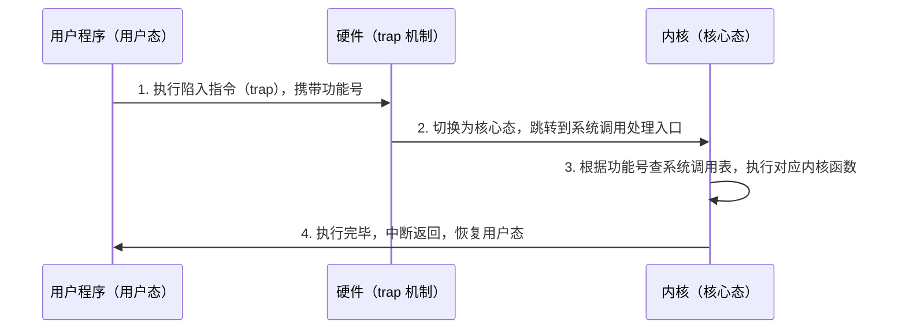
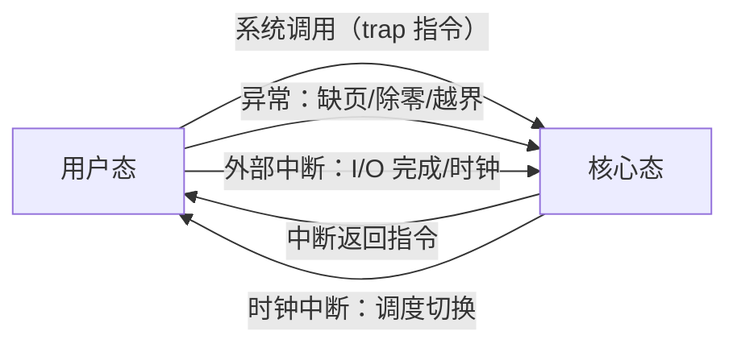

# 第 1 章：操作系统概述

> 本章在 408 中重要度 ⭐⭐，通常出 1-2 道选择题（约 2-4 分），但**用户态/核心态切换、系统调用、中断分类是后续所有章节的基础**，概念不清会在第 2 章（进程）和第 9 章（I/O）连续丢分。本章建议花 2-3 小时，重点放在双态切换的三种途径、特权指令判断和体系结构对比上，引导与虚拟机部分只需过一遍留个印象。

---

## 1.1 操作系统的概念与目标

### 定义

操作系统（Operating System，OS）是配置在计算机硬件上的**系统软件**，有两重身份：

1. **系统资源的管理者**：管理处理机、存储器、I/O 设备、文件等软硬件资源
2. **用户与计算机硬件之间的接口**：向上层提供方便、安全的服务，屏蔽硬件细节

> 注意区分两个容易混淆的说法：**命令接口**（shell 命令）和**程序接口**（系统调用）都是"用户与 OS 之间的接口"；而"OS 是用户与硬件之间的接口"是从系统分层角度说的。选择题中出现"操作系统是用户与计算机之间的接口"这类表述，判断其是否把硬件也算进去即可。

### 四大目标

| 目标 | 含义 | 记忆要点 |
|------|------|---------|
| **方便性** | 屏蔽硬件细节，提供易用接口 | 面向用户 |
| **有效性** | 提高系统资源利用率、提高吞吐量 | 面向资源 |
| **可扩展性** | 能方便地增加新功能模块 | 面向发展 |
| **开放性** | 遵循统一标准，软硬件兼容互操作 | 面向生态 |

> 方便性和有效性是一对矛盾：早期 OS 只追求有效性（批处理提高吞吐），后来才兼顾方便性（分时系统）。选择题若问"OS 最重要的设计目标"，不同语境答案不同，注意审题。

---

## 1.2 操作系统的功能

OS 的功能按管理对象分为四大模块，正好对应本书后续章节：

| 模块 | 核心功能 | 对应章节 |
|------|---------|---------|
| **处理机管理** | 进程控制、进程同步、进程通信、处理机调度 | [第 2-5 章](02-process-threads.md) |
| **存储器管理** | 内存分配与回收、地址映射、内存保护与共享、内存扩充（虚拟内存） | [第 6-7 章](07-virtual-memory.md) |
| **设备管理** | 缓冲管理、设备分配、设备驱动、虚拟设备（SPOOLing） | [第 9 章](09-io-management.md) |
| **文件管理** | 文件存储空间管理、目录管理、文件读写与保护 | [第 8 章](08-file-management.md) |

各模块的关键子功能：

- **处理机管理**：进程控制（创建/撤销/阻塞/唤醒）、进程同步（互斥与同步机制）、进程通信（共享存储/消息传递/管道）、调度（决定哪个进程占用 CPU）
- **存储器管理**：内存分配（动态分区/分页）、地址映射（逻辑地址 → 物理地址）、内存保护（防止越界访问）、内存扩充（虚拟内存技术）
- **设备管理**：缓冲管理（缓和 CPU 与设备速度不匹配）、设备分配、设备驱动（屏蔽硬件差异）、虚拟设备（用 SPOOLing 把独占设备改造成共享设备）
- **文件管理**：文件存储空间的管理（空闲块如何组织）、目录管理、文件的读/写/创建/删除、文件保护（存取权限控制）

> 408 常考"以下哪项不属于存储器管理的功能"这类题。记住一个技巧：**凡带"进程"二字的归处理机管理，凡带"磁盘调度/缓冲"的归设备管理**。

---

## 1.3 操作系统的特征

### 四大特征

| 特征 | 含义 | 关键点 |
|------|------|--------|
| **并发**（Concurrency） | 宏观上多个程序同时推进，微观上交替执行 | **最基本的特征**，与共享互为条件 |
| **共享**（Sharing） | 系统中的资源被多个并发进程共同使用 | 互斥共享 / 同时共享 |
| **虚拟**（Virtualization） | 把物理实体变成若干逻辑对应物，每个用户感觉"独占" | 时分复用 / 空分复用 |
| **异步**（Asynchronism） | 进程执行走走停停，推进速度不可预知 | 只要运行环境相同，结果必须确定（异步 ≠ 不确定） |

**共享的两种方式**：

- **互斥共享**：一段时间内只允许一个进程访问（如打印机、临界资源）
- **同时共享**：宏观上"同时"访问（如磁盘，微观上仍是分时交替）

**虚拟的两种技术**：

- **时分复用**：多个进程轮流占用 CPU，每个进程感觉独占了处理机（虚拟处理机）
- **空分复用**：多个程序共享内存空间，每个程序感觉独占了连续内存（虚拟存储器）

> 并发与共享**互为存在条件**：没有并发就没有资源共享的必要；没有共享机制，程序之间互相干扰，也无法并发。这是选择题的固定考点。

### 并发 vs 并行（易混淆）

| 对比项 | 并发（Concurrent） | 并行（Parallel） |
|--------|-------------------|-----------------|
| 宏观表现 | 多个程序都在"运行" | 多个程序真的"同时运行" |
| 微观实质 | 单核上交替执行 | 多核上同时执行 |
| 硬件要求 | 单核即可 | 必须有多核/多处理机 |
| 典型例子 | 单核 CPU 上浏览器边下载边播放 | 4 核 CPU 上 4 个进程各占一核 |

> 一句话辨析：**并发是"一个时间段内"同时处理，并行是"同一时刻"同时处理**。单核 CPU 只能并发不能并行；多核 CPU 上多进程既是并发也是并行。

---

## 1.4 系统调用

### 概念与作用

**系统调用**（System Call）是操作系统为应用程序提供的编程接口（API），是用户程序请求 OS 服务的**唯一途径**。

- 用户程序不能直接操作硬件、不能直接执行内核功能，必须通过系统调用"请求"OS 代办
- 系统调用在**用户态发起、核心态执行**，执行完毕后返回用户态

### 典型系统调用类型

| 类型 | 功能举例 |
|------|---------|
| 设备申请 | 请求分配设备、释放设备、读/写设备 |
| 文件操作 | 建立/删除/打开/关闭文件，读写文件 |
| 进程控制 | 创建/结束进程，阻塞/唤醒进程，修改进程属性 |
| 进程通信 | 消息传递、共享内存管理 |

### 系统调用执行过程

> 关键点：**系统调用由用户程序主动发起**，但真正的服务在内核中完成。一次系统调用涉及两次状态切换（用户态 → 核心态 → 用户态）和一次上下文保存/恢复，因此系统调用比普通函数调用开销大得多。

---

## 1.5 内核程序执行环境

### 用户态与核心态

CPU 通过**程序状态字（PSW）中的模式位**区分当前运行状态：

| 状态 | 别称 | 可执行指令 | 典型程序 |
|------|------|-----------|---------|
| 用户态 | 目态、管外态 | 非特权指令 | 普通应用程序 |
| 核心态 | 管态、内核态、特权态 | 全部指令（含特权指令） | 内核、中断处理程序 |

### 特权指令

**特权指令**只能在核心态执行的指令，例如：

- 开中断 / 关中断（置/清中断允许位）
- 存基址寄存器、置界寄存器（涉及内存保护）
- 置程序状态字（PSW）
- 停机指令、切换页表、修改页表

> **易错点 1**：trap（陷入）指令**不是特权指令**——如果它是特权指令，用户态程序根本无法执行它，系统调用也就无从谈起。trap 是一条用户态可执行、但会触发进入核心态的特殊指令。
>
> **易错点 2**：寄存器本身没有"特权/非特权"之分，**访问某些寄存器的指令**才是特权指令。例如"读时钟"可能不是特权指令，而"设置基址寄存器"一定是。

### 用户态 → 核心态的三种途径

| 途径 | 发起者 | 是否主动 | 说明 |
|------|--------|---------|------|
| **系统调用** | 用户程序 | 主动 | 通过 trap 指令触发 |
| **异常**（内中断） | 事件 | 被动 | 如缺页、除零、非法指令、访存越界 |
| **外部中断** | 外部设备 | 被动 | 如 I/O 完成、时钟中断 |

> **技术事实**：严格来说，用户态→核心态的切换最终都依赖硬件机制——系统调用通过**陷入指令（trap）** 触发，这是用户程序唯一能显式执行的进入核心态的指令；异常和外部中断是硬件检测并隐式触发的。因此"trap 指令是用户态进入核心态的唯一（显式）途径"这一说法是正确的，而中断/异常作为**触发源**同样会引起态切换，二者并不矛盾。

---

## 1.6 中断机制

### 内中断 vs 外中断

| 对比项 | 内中断（异常/陷阱） | 外中断（硬件中断） |
|--------|-------------------|-------------------|
| 来源 | CPU **内部**事件 | CPU **外部**设备 |
| 与当前指令的关系 | 由当前指令执行引起 | 与当前指令无关 |
| 典型例子 | 除零、缺页、溢出、非法指令、trap | I/O 完成、时钟、键盘输入 |
| 是否可屏蔽 | 异常不可屏蔽（trap 是主动的） | 可屏蔽中断可被关中断屏蔽 |
| 别称 | exception / trap | interrupt |

> 408 考法："下列哪个属于内中断？"——缺页、溢出、陷阱（trap）都是内中断；时钟中断、I/O 中断是外中断。**系统调用引发的 trap 属于内中断**，这是常设的坑。

### 中断处理过程（简述）

1. **中断请求**：中断源（设备/异常）发出中断请求
2. **中断响应**：CPU 在每条指令执行末尾检测中断，关中断、保存断点（PC）与 PSW，转入核心态
3. **中断识别**：硬件或软件确定中断类型，取得中断服务程序入口地址（中断向量）
4. **中断处理**：执行中断服务程序（保存现场 → 处理中断 → 恢复现场）
5. **中断返回**：执行中断返回指令，恢复 PSW 和 PC，回到被中断处继续执行

> 中断是**一条指令执行结束时**才被检测的（不是指令执行中途），这个细节在计组与 OS 的衔接考点中出现过。中断机制的详细硬件流程见计组相关章节。

---

## 1.7 操作系统体系结构

### 大内核 vs 微内核（高频对比表）

| 对比项 | 大内核（宏内核） | 微内核 |
|--------|----------------|--------|
| 功能范围 | 内核包含大量功能：进程调度、内存管理、文件系统、设备驱动等全部放在内核态 | 内核只保留最基本的进程调度、中断处理、进程通信，其余功能移至用户态 |
| 可靠性 | 任何一个模块的 bug 都可能导致整个内核崩溃 | 内核小、易验证，模块崩溃影响范围小，**可靠性高** |
| 性能 | 模块间直接调用，**开销小、效率高** | 频繁的用户态/核心态切换和消息传递，**开销较大** |
| 代表系统 | UNIX、Linux、Windows（偏大内核） | MINIX、Mach、QNX |

> 记忆口诀：**大内核"快但脆"，微内核"稳但慢"**。考试若问"微内核的主要缺点"→ 系统调用/消息传递开销大、态切换频繁。

### 其他结构（了解级）

| 结构 | 核心思想 |
|------|---------|
| **分层结构** | 把 OS 分成若干层，第 N 层只使用第 N-1 层的功能（如 THE 系统），便于调试和验证 |
| **模块化结构** | 内核划分为若干模块，模块间通过接口调用（Linux 采用模块化思想） |
| **外内核**（Exokernel） | 内核只负责资源的安全分配，把硬件抽象（虚拟化）交给用户库完成 |

---

## 1.8 操作系统引导

计算机加电后到 OS 就绪的过程：

1. **BIOS/UEFI 初始化**：上电自检（POST），初始化基本硬件，读取引导设备
2. **bootloader 加载**：从磁盘的引导扇区（MBR）或 EFI 分区读入引导程序（如 GRUB）
3. **内核加载**：bootloader 把 OS 内核映像装入内存，跳转执行
4. **内核初始化**：初始化中断向量表、内存管理、设备驱动，创建第一个进程（如 Linux 的 init/systemd），进入用户交互

> 了解级考点：知道引导的大致链条"固件 → bootloader → 内核 → init 进程"即可，细节不深究。

---

## 1.9 虚拟机（了解级）

虚拟机通过**虚拟机监控器（VMM，Hypervisor）** 把一台物理机器虚拟成多台逻辑机器：

| 类型 | 别称 | 结构 | 代表 |
|------|------|------|------|
| **Type-1（裸机型）** | 原生 VMM | 直接运行在硬件之上，客户 OS 运行在 VMM 之上 | VMware ESXi、Xen |
| **Type-2（宿主型）** | 托管 VMM | 作为普通应用运行在宿主 OS 之上，客户 OS 运行在 VMM 之上 | VMware Workstation、VirtualBox |

> 区分技巧：**VMM 下面有没有宿主操作系统**——没有就是 Type-1，有就是 Type-2。Type-1 性能更好（少一层），Type-2 部署更方便。

---

## 1.10 典型例题

**例 1**（特权指令判断）：下列指令中哪些是特权指令？① 开中断 ② 存基址寄存器 ③ 置程序状态字 ④ 陷阱（trap）指令 ⑤ 普通加法运算

**解**：

- ①②③ 都是特权指令：开/关中断影响中断机制的安全；写基址寄存器可改变内存保护边界；置 PSW 可改变 CPU 状态（包括模式位），均不允许用户程序直接执行
- ④ **不是特权指令**：trap 必须在用户态就能执行，否则用户程序无法发起系统调用；它是一条"能在用户态执行并引发切换到核心态"的特殊指令
- ⑤ 不是特权指令：普通运算指令任何状态下都可执行

> 本题原型是 408 真题。核心考点就是 trap 指令的身份——"不是特权指令但能进入核心态"，几乎每个考生都会在这里栽一次，务必记牢。

**例 2**（概念辨析）：判断下列说法正误：
（a）`printf()` 是系统调用；（b）单核 CPU 上两个进程并发执行意味着它们在同一时刻同时运行；（c）并发和共享互为存在条件。

**解**：

- （a）**错误**。`printf()` 是 C 标准库函数，底层通过 `write()` **系统调用**进入内核。库函数属于用户程序，系统调用属于 OS 接口，二者层级不同。库函数不一定触发系统调用（如纯计算的数学函数），但涉及 I/O、进程操作的库函数内部一定会
- （b）**错误**。单核上两个进程只能**并发**（微观交替执行），不能**并行**（同一时刻同时执行）。并行的前提是多个处理单元
- （c）**正确**。没有并发，资源共享没有意义；没有共享机制协调，程序之间互相破坏，也无法并发执行

### 常见陷阱清单

1. **"系统调用 = 库函数"**：库函数在用户态，可能封装了系统调用，也可能完全是纯用户态代码
2. **"中断是用户进入核心态的主动途径"**：只有系统调用是主动的，中断和异常都是被动触发
3. **"异步 = 结果不确定"**：异步指推进速度不可预知，但只要运行环境相同，执行结果必须一致，否则 OS 无法保证正确性
4. **"微内核性能好"**：恰恰相反，微内核牺牲性能换可靠性
5. **"虚拟就是模拟"**：虚拟是通过时分/空分复用让用户"感觉独占"，每个用户得到的是逻辑上的独立资源

---

## 本章小结

### 核心要点回顾

1. **OS 两重身份**：系统资源管理者 + 用户与硬件之间的接口；目标是方便性、有效性、可扩展性、开放性
2. **四大功能**：处理机管理、存储器管理、设备管理、文件管理
3. **四大特征**：并发（最基本）、共享（互斥/同时）、虚拟（时分/空分）、异步；并发与共享互为存在条件
4. **系统调用**是用户程序请求 OS 服务的唯一途径，通过 trap 指令进入核心态
5. **用户态 → 核心态三种触发**：系统调用（主动）、异常、外部中断；核心态 → 用户态通过中断返回
6. **trap 不是特权指令**，是用户态可执行的、唯一能显式进入核心态的指令
7. **大内核快但脆，微内核稳但慢**

### 考试重点排序

| 优先级 | 考点 | 题型 |
|--------|------|------|
| ⭐⭐⭐ | 用户态/核心态切换途径、特权指令判断 | 选择题 |
| ⭐⭐⭐ | 系统调用与库函数的关系 | 选择题 |
| ⭐⭐ | 四大特征辨析（尤其并发 vs 并行） | 选择题 |
| ⭐⭐ | 大内核 vs 微内核 | 选择题 |
| ⭐ | 内中断/外中断分类 | 选择题 |
| ⭐ | 引导过程、虚拟机类型 | 选择题（偶考） |

> 本章复习策略：把三种态切换途径和 trap 指令的身份彻底搞清，其他概念过一遍表格即可。本章是全书地基，[第 2 章（进程与线程）](02-process-threads.md)的中断与态切换会大量复用本章概念。

---

## 自测题

1. 操作系统的四大特征是什么？哪两个互为存在条件？
2. 用户态切换到核心态有哪三种途径？其中哪一种是用户程序主动发起的？
3. 陷阱（trap）指令是特权指令吗？为什么？
4. 缺页中断属于内中断还是外中断？时钟中断呢？
5. 微内核相比大内核的主要优缺点是什么？
6. 库函数与系统调用有何区别？`printf()` 属于哪一种？

> **答案**：1. 并发、共享、虚拟、异步；并发与共享互为存在条件。2. 系统调用、异常（内中断）、外部中断；只有系统调用是用户程序主动发起的（通过 trap 指令）。3. 不是特权指令——如果 trap 是特权指令，用户态程序无法执行它，系统调用将无法发起；它是用户态可执行并触发进入核心态的特殊指令。4. 缺页属于内中断（由 CPU 内部事件引起）；时钟中断属于外中断（由外部设备引起）。5. 优点：内核小而稳定，可靠性高，单个模块崩溃不影响全局；缺点：用户态与核心态切换频繁、消息传递开销大，性能低于大内核。6. 系统调用是 OS 提供的进入内核的接口，运行在核心态；库函数是用户态的函数库，可能封装系统调用也可能完全不涉及。`printf()` 是库函数，其底层通过 write 系统调用完成实际输出。
