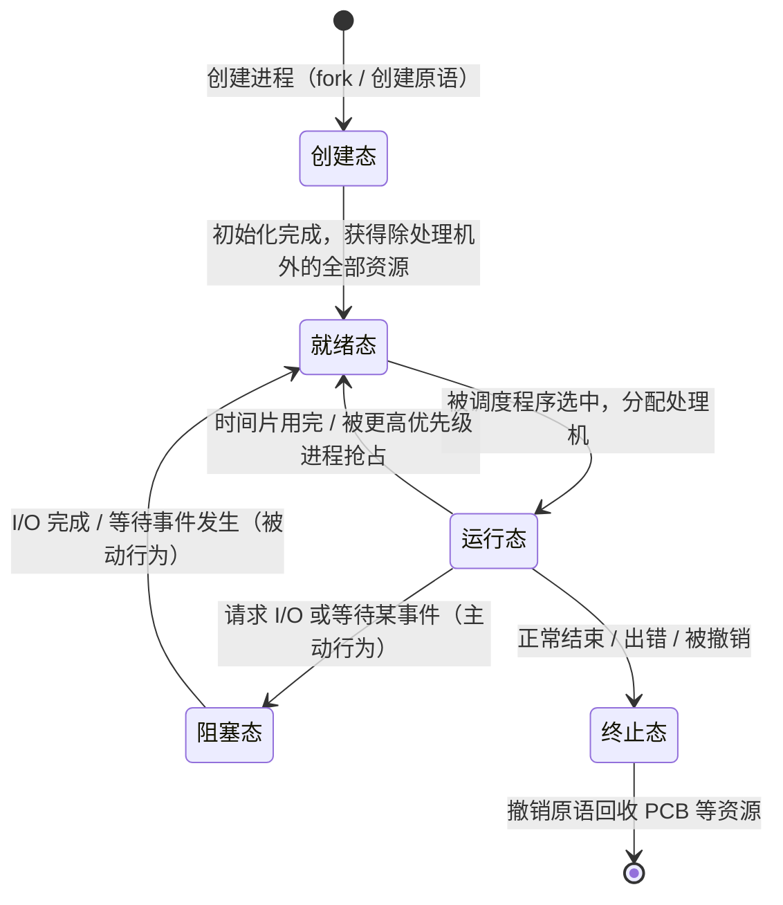
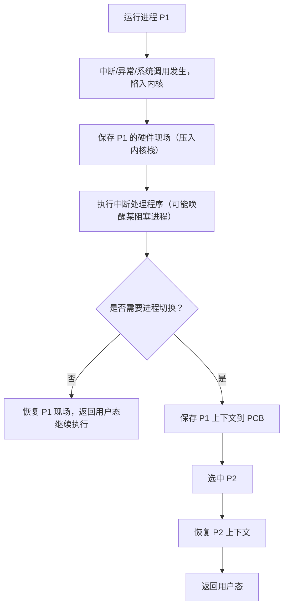
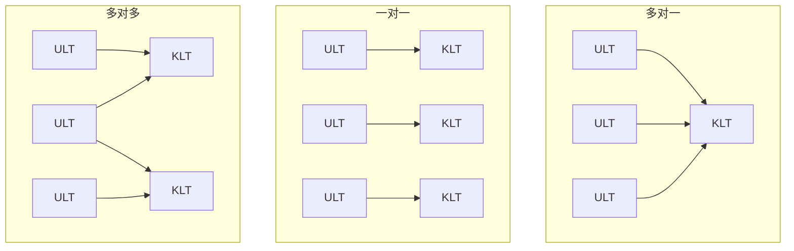

# 第 2 章：进程与线程

> 本章是操作系统的**核心章节之一**，重要度 ⭐⭐⭐⭐⭐。进程状态转换是 408 选择题的常客（"下列哪种状态转换不可能发生"几乎每几年就出现一次），fork 的返回值语义、管道的特性、用户级/内核级线程的区别也都是高频考点。更重要的是，本章的概念是[第 3 章（处理器调度）](03-scheduling.md)和[第 4 章（进程同步）](04-sync-mutex.md)的基础——不理解进程和临界区，后面两章根本没法做。建议投入 4-6 小时，重点放在状态转换图、fork 语义和线程模型对比上。

---

## 2.1 进程的概念

### 进程的定义

程序只能作为一个静态实体存放在磁盘上，而操作系统要支持多个程序**并发**执行，就必须引入一个能描述程序在某个数据集上动态执行过程的概念——这就是**进程（Process）**。

常见定义：**进程是程序在一个数据集上的一次运行过程，是操作系统进行资源分配和调度的基本单位**。

### 程序 vs 进程（408 高频对比）

| 对比项 | 程序 | 进程 |
|--------|------|------|
| 本质 | 静态的指令和数据的集合 | 动态的执行过程 |
| 存在方式 | 永久存放在磁盘等介质上 | 有生命周期：创建、运行、撤销 |
| 并发性 | 无 | 多个进程可并发执行 |
| 独立性 | 无 | 是资源分配和调度的独立单位 |
| 对应关系 | 一个程序可对应多个进程 | 一个进程一定对应至少一个程序 |
| 组成 | 只有代码和数据 | 程序段 + 数据段 + PCB |

> 经典判断题："程序和进程是一一对应的"——**错误**。同一个程序（如浏览器）可以同时运行多个进程实例；反过来，一个进程在执行过程中也可能调用多个程序。

### 进程的特征

| 特征 | 含义 |
|------|------|
| **动态性** | 进程是程序的一次执行过程，有创建、运行、撤销的生命周期（最基本特征） |
| **并发性** | 多个进程可以同时存在于内存中，在一段时间内交替推进 |
| **独立性** | 进程是资源分配和调度的独立单位，拥有独立的地址空间 |
| **异步性** | 各进程按各自独立的、不可预知的速度向前推进（走走停停） |
| **结构性** | 进程由程序段、数据段和 PCB 三部分构成 |

> 记忆口诀："动并独异构"。**动态性是进程最基本的特征**，这个表述在选择题里出现过。

### 进程的组成

一个进程实体（进程映像）由三部分组成：

1. **程序段**：要被执行的指令代码
2. **数据段**：程序运行时使用的数据（含全局变量、堆等）
3. **进程控制块（PCB）**：操作系统管理进程所需的信息

> 注意区分"程序"和"进程实体"：程序只有前两部分，进程实体多出 PCB。PCB 是进程存在的唯一标志，详见 2.2 节。

---

## 2.2 进程控制块（PCB）

### PCB 的作用

PCB（Process Control Block）是操作系统为管理进程而设置的一个专门的数据结构，记录进程的全部状态信息和管理信息。

**PCB 是进程存在的唯一标志**：创建进程实质上就是创建其 PCB，撤销进程实质上就是回收其 PCB。操作系统**通过 PCB 感知进程的存在**——没有 PCB，操作系统就不认为这个进程存在。

PCB 的主要作用：

1. 作为进程运行全过程的信息记录（状态、位置、资源）
2. 实现间断性运行：进程切换时保存/恢复现场信息
3. 提供进程管理所需的信息（调度、通信、资源分配）
4. 提供进程调度所需的信息（状态、优先级）

### PCB 的内容

| 类别 | 内容 |
|------|------|
| **进程描述信息** | 进程标识符 PID、用户标识符 UID、进程间家族关系（父/子进程） |
| **进程控制信息** | 进程状态、优先级、代码/数据入口地址、阻塞原因、调度相关信息 |
| **资源分配清单** | 已分配的内存区、打开的文件描述符、使用的 I/O 设备 |
| **处理机信息** | 通用寄存器值、程序计数器 PC、程序状态字 PSW、栈指针 |

> 易错点：处理机信息（寄存器、PC、栈指针）存放在 PCB 中，这正是进程切换时"保存/恢复上下文"的物理载体。

### PCB 的组织方式

PCB 通常以**链接表**或**索引表**的形式组织，操作系统按进程状态把 PCB 挂到不同的队列上：就绪队列、阻塞队列（每种等待事件一个队列）、各级等待队列。进程状态变化时，其 PCB 在队列间移动。

---

## 2.3 进程状态模型

### 三态模型

由于系统中进程数多于处理机数，且进程经常需要等待 I/O，进程被划分为三种基本状态：

| 状态 | 含义 | 说明 |
|------|------|------|
| **就绪态（Ready）** | 已具备除处理机（CPU）外的全部资源，只等被调度 | 就绪队列中等待 |
| **运行态（Running）** | 正在处理机上执行 | 单核系统中同一时刻最多 1 个 |
| **阻塞态（Blocked）** | 正在等待某事件发生（如 I/O 完成），即使给它 CPU 也无法运行 | 也叫等待态，每种等待事件通常各有一个阻塞队列 |

> 关键理解：**就绪和阻塞的区别在于"只差什么"**。就绪只差 CPU；阻塞即使给了 CPU 也干不了活（在等 I/O 结果、等锁、等信号）。

### 五态模型

在三态基础上增加**创建态**（新进程刚被建立、资源尚未就绪）和**终止态**（进程执行结束、等待操作系统善后），构成五态模型：



各转换的触发事件归纳如下：

| 转换 | 触发事件 |
|------|---------|
| 创建 → 就绪 | 进程获得除 CPU 外的所有必要资源 |
| 就绪 → 运行 | 调度程序选中该进程，分配处理机 |
| 运行 → 就绪 | 时间片用完、被更高优先级进程抢占 |
| 运行 → 阻塞 | 进程主动请求 I/O 或等待某事件（如 wait 信号量） |
| 阻塞 → 就绪 | 等待的事件发生（I/O 完成、资源到位），由中断处理程序唤醒 |
| 运行 → 终止 | 正常退出（exit）、出错（如除零、访存越界）、被其他进程撤销（kill） |

### 状态转换的约束（408 必考）

1. **阻塞 → 运行：不可能**。被唤醒的进程只能先进入就绪队列排队，等待调度。
2. **就绪 → 阻塞：不可能**。阻塞是进程主动放弃 CPU 等待事件的行为，就绪态进程还没有 CPU，谈不上"主动等待"。
3. **运行 → 阻塞是主动的，阻塞 → 就绪是被动的**：前者由进程自身发起（系统调用），后者由中断处理程序完成。
4. 创建态和终止态都是**过渡状态**，不进入调度队列。

> 一句话记忆："运行可以秒变就绪，阻塞必须排队再来"。选择题给出若干转换组合让你判断哪些可能，用上面四条排除即可。

### 挂起（了解）

引入挂起的原因：内存紧张时需要把部分进程换出到外存；此外还有终端需要、父进程需要调试子进程等场景。

挂起引入后，进程状态扩展为七态：在就绪/阻塞的基础上区分**静止（挂起，在外存）**与**活动（在内存）**：

| 状态 | 含义 |
|------|------|
| 活动就绪 / 静止就绪 | 在内存等待调度 / 被换出到外存等待调度 |
| 活动阻塞 / 静止阻塞 | 在内存等待事件 / 被换出到外存等待事件 |

> 挂起的核心特征是进程**不在内存**（被交换到磁盘）。408 对挂起要求不高，能区分"挂起 = 静止 = 在外存"，并知道挂起涉及中级调度（内存对换）即可。

---

## 2.4 进程控制

### 原语的概念

进程控制由操作系统内核中的一系列**原语（Primitive）**实现：创建原语、撤销原语、阻塞原语、唤醒原语、切换原语等。

原语的特点是**原子性（不可分割性）**：执行期间要么全部完成、要么完全不执行，中间不允许被打断。实现原子性的典型手段是**执行期间关中断**（屏蔽中断，CPU 不允许响应其他事件）。

> 易错点：原语是"不可中断的一段程序"，关中断只是保证其原子性的一种实现手段，不要把原语等同于关中断本身。

### 进程创建：fork

Unix/Linux 中通过 `fork` 系统调用创建子进程：

```c
#include <stdio.h>
#include <unistd.h>

int main() {
    pid_t pid = fork();
    if (pid < 0) {
        /* 创建失败 */
    } else if (pid == 0) {
        /* 子进程执行区域 */
        printf("I am child\n");
    } else {
        /* 父进程执行区域，pid 为子进程的进程号 */
        printf("I am parent, child pid = %d\n", pid);
    }
    return 0;
}
```

`fork` 的语义必须记牢：

| 视角 | fork 的返回值 |
|------|--------------|
| **子进程** | 返回 **0** |
| **父进程** | 返回**子进程的 PID**（正整数） |
| 创建失败 | 返回负值（-1） |

> "fork 调用一次、返回两次"：返回后父子进程各自拥有独立的地址空间，子进程是父进程的副本（实际实现采用写时复制，只有写入时才真正复制页面）。fork 之后的代码由**两个进程并发执行**，输出顺序不确定。

### 进程撤销

进程撤销的三类原因：

1. **正常结束**：程序执行完毕，调用 exit 退出
2. **出错退出**：运行时错误（越界访问、除零、资源不可用等）
3. **被强制终止**：父进程或操作系统（kill）终止该进程

撤销原语的工作：回收进程占用的资源（内存、打开文件），将 PCB 归还到空闲 PCB 池。若进程还有子进程，通常级联终止或交由 init 进程接管。

### 阻塞与唤醒

| 原语 | 动作 | 发起者 |
|------|------|--------|
| 阻塞（block） | 运行 → 阻塞：停止当前进程，保存现场，PCB 挂到相应阻塞队列 | 进程**主动**调用（等待 I/O 或事件） |
| 唤醒（wakeup） | 阻塞 → 就绪：从阻塞队列摘下 PCB，状态改为就绪，挂到就绪队列 | 事件发生时由**其他进程或中断处理程序**完成 |

> 阻塞和唤醒是**成对出现**的概念：进程因何事阻塞，就由何事唤醒。阻塞是"自我放弃"，唤醒是"他人拉一把"——进程自己无法把自己从阻塞态拉出来。

### 进程切换

进程切换（上下文切换）的时机与步骤：

1. 发生切换事件（中断、时间片用完、主动放弃 CPU）
2. 保存当前进程的 CPU 上下文到其 PCB
3. 从就绪队列选取下一个进程
4. 恢复新进程的上下文，令其继续执行

> 进程切换是有开销的（保存/恢复现场、刷新 TLB、Cache 失效等），开销大小与系统负载、内存大小有关。上下文切换的细节见 2.5 节。

---

## 2.5 上下文及其切换机制

### 上下文的组成

**上下文（Context）**是进程在某一时刻执行所需的全部环境信息，分为两层：

| 层次 | 内容 | 保存位置 |
|------|------|---------|
| **用户级上下文** | 程序计数器（PC）、通用寄存器、栈指针、用户栈 | 进程切换时保存到 PCB |
| **系统级上下文** | 页表、打开文件表、进程地址空间信息、PCB 本身 | 常驻内核，切换时只需切换指针 |

> 易错点：页表属于**系统级上下文**。进程切换时要换页表基址寄存器（如 x86 的 CR3），这会导致 **TLB 失效**，是切换开销的重要来源。

### 切换时机

进程切换只发生在**内核态**（内核态/用户态、中断与系统调用的概念见[第 1 章（操作系统概述）](01-introduction.md)），触发场景包括：

1. 当前进程时间片用完
2. 更高优先级进程到达（抢占式调度）
3. 当前进程主动请求 I/O 或等待事件（运行 → 阻塞）
4. 当前进程执行结束或被撤销
5. 中断/异常处理结束后，内核决定更换运行进程

### 切换的开销

切换本身的直接开销（保存/恢复寄存器、切换页表）通常只有微秒级，但间接开销更大：

- 刷新 TLB，访存变慢
- Cache 中旧进程的数据失效（Cache 污染）
- 调度程序本身的执行时间

### 进程切换与中断处理的关系

进程切换由中断/异常**触发**，但两者不是一回事：



> 关键结论：**中断处理结束后不一定发生进程切换**（若仍选中原进程则直接返回）；但每次进程切换必然发生在中断/异常/系统调用返回的路上。"中断一定引起进程切换"是错误说法。

---

## 2.6 进程同步的基本概念

本节只做概念引入，具体实现机制（信号量、PV 操作、管程）在[第 4 章（进程同步）](04-sync-mutex.md)展开。

### 临界资源与临界区

**临界资源**：一次仅允许一个进程使用的资源（打印机、共享变量、共享缓冲区等）。

**临界区（Critical Section）**：进程中**访问临界资源的那段代码**。对临界区的访问必须互斥进行。

把进程访问临界资源的代码段划分为四部分：

```pseudo
while (TRUE) {
    进入区（entry section）    // 检查能否进入临界区，建立互斥
    临界区（critical section） // 访问临界资源的代码
    退出区（exit section）     // 释放临界资源，解除互斥
    剩余区（remainder section）// 其余代码
}
```

### 同步 vs 互斥辨析

| 对比项 | 互斥（Mutual Exclusion） | 同步（Synchronization） |
|--------|-------------------------|------------------------|
| 目的 | 保证临界资源一次只被一个进程访问 | 保证多个协作进程按规定的**次序**执行 |
| 关系 | 竞争关系：大家都要用同一个资源 | 协作关系：一个进程的执行依赖另一个进程的信号 |
| 举例 | 两个进程竞争一台打印机 | 生产者先生产，消费者才能消费 |

> 一句话区分：**互斥是"别抢"，同步是"排队按顺序来"**。同步是比互斥更广义的概念，互斥可视为同步的一种特例。

### 临界区访问准则（四原则）

任何临界区访问机制都应满足：

| 准则 | 含义 |
|------|------|
| **空闲让进** | 临界区空闲时，请求进入的进程应立即获准进入 |
| **忙则等待** | 已有进程在临界区内时，其他进程必须等待（互斥的核心） |
| **有限等待** | 等待进入的进程不能无限期等待，防止饥饿 |
| **让权等待** | 暂时不能进入临界区的进程应释放处理机，防止忙等（busy-wait） |

> "有限等待"防饥饿，"让权等待"防忙等，这两个表述的区分是选择题易错点。让权等待不是硬性要求——自旋锁（如 TestAndSet 实现的锁）就不满足让权等待。

---

## 2.7 进程通信（IPC）

进程拥有独立的地址空间，一个进程无法直接访问另一个进程的内存，进程间交换数据必须借助操作系统提供的**进程通信（Inter-Process Communication, IPC）**机制。

### 共享存储

两个进程在地址空间中共享一块存储区，通过读写该区域交换数据。按共享对象不同分为两种：

| 类型 | 共享对象 | 特点 |
|------|---------|------|
| **基于数据结构的共享** | 共享一个数据结构（如共享数组、共享变量） | 速度慢、信息量小，需要同步机制保护 |
| **基于存储区的共享** | 共享一大块内存区域（如 shm） | 速度快、信息量大，进程像访问普通内存一样访问 |

> 共享存储方式下，**进程对共享区的访问必须互斥**，通常需要借助信号量（PV 操作）实现同步与互斥，否则会出现数据不一致。共享内存是**最快**的 IPC 方式（不需要内核中转数据）。

### 消息传递

进程通过操作系统提供的**发送（send）/ 接收（receive）原语**交换格式化的消息，通信细节由内核隐藏。

按寻址方式分为：

| 方式 | 说明 |
|------|------|
| **直接通信** | send(P, msg) / receive(Q, msg)：消息直接挂在接收进程的缓冲队列上，通信双方必须显式指名对方 |
| **间接通信** | send(MB, msg) / receive(MB, msg)：消息发送到**信箱（端口）**，接收方从信箱取，双方只需知道信箱名 |

> 直接通信双方是强绑定（一对一）；间接通信通过信箱解耦，一个信箱可被多个进程共享，灵活性更高。

### 管道（pipe）

管道是连接读写进程的一个**半双工的共享文件**（本质是一个固定大小的缓冲区），数据以**字符流**的形式在其中流动。408 常考的管道特性：

1. **半双工**：数据只能单向流动（一个进程写、另一个进程读）；如需双向通信，必须建立两个管道
2. **互斥访问**：同一时刻只允许一个进程对管道进行读/写操作（由内核保证互斥）
3. **写满阻塞**：管道缓冲区写满时，写进程阻塞，直到读进程读走数据
4. **读空阻塞**：管道为空时，读进程阻塞，直到有数据可读
5. **字符流格式**：数据以无结构的字节流形式传输，读进程读出的数据量与写进程写入的量无必然对应（以 PIPE_BUF 为原子单位）
6. 管道生命周期随进程：读写进程全部结束后，管道被撤销
7. 写端全部关闭后再读，读到 EOF；读端全部关闭后再写，产生 SIGPIPE 信号


> 408 真题反复考查管道特性，记住三句话：**半双工、互斥、字符流**。"管道支持双向同时传输""管道按消息边界传输"都是错误说法。另外注意：管道属于**进程间通信**机制，线程间不需要管道（线程共享地址空间，直接读写共享变量即可）。

### 信号（signal）

信号是一种**异步通知机制**：向目标进程发送一个信号，通知它某事件已经发生（如 SIGKILL 请求终止、SIGINT 来自键盘 Ctrl+C）。接收进程可以忽略信号（少数信号除外），也可以注册处理函数。

> 信号只能传递**事件编号**这种极少量信息，不适合传递大量数据；它的价值在于"异步打断"——目标进程正在做任何事都能收到通知。

### 四种 IPC 方式对比

| 方式 | 传输数据量 | 速度 | 同步要求 | 典型场景 |
|------|-----------|------|---------|---------|
| 共享存储 | 大 | 最快 | 需 PV 等机制保证互斥 | 大量数据的高速交换 |
| 消息传递 | 小-中 | 较慢（内核中转） | 内核管理收发同步 | 分布式系统、解耦通信 |
| 管道 | 中 | 中 | 读写自动阻塞同步 | 父子进程间的单向数据流 |
| 信号 | 极少（仅信号编号） | 快 | 异步 | 事件通知 |

---

## 2.8 线程

### 线程的概念

进程是**资源分配**的单位，但传统进程同时也是调度的单位——进程切换要切换整个地址空间，开销大；且进程间通信必须走 IPC，成本高。

为此引入**线程（Thread）**：线程是进程内的一个执行流，是**处理机调度的基本单位**，又称**轻量级进程（Light-Weight Process, LWP）**。

引入线程的主要原因：

1. **切换开销小**：同进程内的线程切换不需要切换地址空间（页表不变）
2. **共享进程资源**：同一进程的多个线程共享地址空间、打开的文件等资源，通信无需 IPC
3. **利于多核并行**：多个线程可分配到不同处理机上真正并行执行，发挥多核性能
4. **响应性好**：UI 进程中一个线程被阻塞，其他线程仍可继续执行

### 线程与进程对比（408 必背）

| 对比项 | 进程 | 线程 |
|--------|------|------|
| 定义 | 资源分配的基本单位 | 处理机调度的基本单位 |
| 地址空间 | 拥有独立的地址空间 | 无独立地址空间，共享所属进程的地址空间 |
| 拥有的资源 | PCB、地址空间、打开文件等完整资源 | 只有线程 ID、程序计数器、寄存器组、栈 |
| 共享关系 | 进程间相互独立 | 同进程线程共享代码段、数据段、打开文件 |
| 切换开销 | 大（切换页表、刷新 TLB/Cache） | 小（不切换地址空间） |
| 通信方式 | 必须通过 IPC（管道、共享内存等） | 可直接读写共享变量（需同步机制保护） |
| 健壮性 | 一个进程崩溃不影响其他进程 | 一个线程崩溃可能导致整个进程崩溃 |

> 记忆锚点：**进程管资源，线程管执行**。"线程是调度的单位、进程是资源分配的单位"这句话本身就是一个常考判断题。

### 线程的实现方式：ULT vs KLT

| 对比项 | 用户级线程（ULT） | 内核级线程（KLT） |
|--------|------------------|------------------|
| 管理者 | 用户空间的线程库 | 操作系统内核 |
| 内核感知 | 内核不知道线程的存在，按进程调度 | 内核以线程为单位调度 |
| 切换开销 | 小（用户态内切换，无需陷入内核） | 较大（切换需陷入内核） |
| 调度粒度 | 一个进程的所有 ULT 绑定在一个 KLT/进程上 | 每个线程独立参与调度 |
| **阻塞影响** | 一个 ULT 执行阻塞式系统调用，**整个进程被阻塞** | 一个线程阻塞，**其他线程仍可运行** |
| 多核并行 | 不能（同一进程的 ULT 只能在一个核上运行） | 能（多个线程可分到多个核） |
| 典型例子 | 早期 Java 绿色线程、Go 的 goroutine 是用户级线程的典型工程实现 | Linux pthread、Windows 线程 |

> 408 经典判断题："用户级线程中某一个线程被阻塞，只会影响该线程，不影响同进程其他线程"——**错误**。对内核而言整个进程只有一个执行流，该进程被阻塞则其所有用户级线程一起被阻塞。

### 多线程模型

按用户线程与内核线程的映射关系分为三种模型：

| 模型 | 映射关系 | 优点 | 缺点 |
|------|---------|------|------|
| **多对一** | 多个 ULT 映射到 1 个 KLT | 线程管理在用户态，效率高 | 一个线程阻塞则整个进程阻塞；无法利用多核 |
| **一对一** | 每个 ULT 映射 1 个 KLT | 一个线程阻塞不影响其他线程；可利用多核 | 创建线程开销大（每个线程都要内核支持） |
| **多对多** | n 个 ULT 映射到 m 个 KLT（n ≥ m） | 折中：既限制内核线程数量，又允许并发 | 实现复杂 |



> 现代主流操作系统（Linux、Windows）采用**一对一**模型；多对多模型（如 Solaris 早期实现）在考试中作为概念了解即可。

---

## 2.9 典型例题

**例 1**（进程状态转换）：在单处理机系统中，下列进程状态转换中，哪些是可能发生的？

① 就绪 → 运行　② 运行 → 就绪　③ 运行 → 阻塞　④ 阻塞 → 运行　⑤ 就绪 → 阻塞　⑥ 阻塞 → 就绪

**解**：

可能发生的是 ①②③⑥：

- ① 就绪 → 运行：被调度程序选中，可能
- ② 运行 → 就绪：时间片用完或被抢占，可能
- ③ 运行 → 阻塞：进程主动请求 I/O，可能
- ⑥ 阻塞 → 就绪：等待的事件发生，被唤醒，可能

不可能的是 ④⑤：

- ④ 阻塞 → 运行：被唤醒的进程必须先进就绪队列排队，不能直接获得 CPU
- ⑤ 就绪 → 阻塞：阻塞是持有 CPU 的进程主动等待事件的行为，就绪态进程没有 CPU，无从"主动等待"

> 本题是 408 真题原型（2011 年真题改造）。判断依据就是 2.3 节的四条约束。

**例 2**（fork 输出判断）：下列程序的输出是什么？共有几行输出？

```c
#include <stdio.h>
#include <unistd.h>

int main() {
    int a = 0;
    if (fork() == 0) {          /* 子进程 */
        a = a + 1;
        printf("a = %d\n", a);
    } else {                    /* 父进程 */
        a = a + 2;
        printf("a = %d\n", a);
    }
    return 0;
}
```

**解**：

`fork` 在子进程中返回 0，在父进程中返回子进程的 PID。因此：

- 子进程执行 `a = a + 1`，输出 `a = 1`
- 父进程执行 `a = a + 2`，输出 `a = 2`

**共输出 2 行**：`a = 1` 和 `a = 2`，但两行的先后顺序不确定（父子进程并发执行，调度顺序由系统决定）。

关键点：fork 之后父子进程拥有**各自独立的地址空间**，子进程对 `a` 的修改不会影响父进程中的 `a`（各自持有副本）。

> 若把 `printf` 放到 `fork` 之前，则输出会被"复制"——因为 printf 的输出先进入 stdout 缓冲区，fork 复制进程映像时连缓冲区一起复制，父子各刷新一次。这是 fork 类题目的进阶陷阱。

**例 3**（用户线程 vs 内核线程）：某进程有 3 个线程 T1、T2、T3。T1 执行一个阻塞式 read 系统调用。分别讨论在"多对一"和"一对一"模型下，T2、T3 能否继续执行。

**解**：

- **多对一模型**：3 个用户线程映射到同一个内核线程。内核只知道该进程在执行阻塞式 read，于是**整个进程被阻塞**，T2、T3 都无法继续执行。
- **一对一模型**：每个用户线程对应一个内核线程。T1 阻塞时内核只挂起 T1 对应的内核线程，T2、T3 对应的内核线程仍可被调度，**可以继续执行**（在多核上还可真正并行）。

> 这道题考查的核心是"内核是否感知线程"。用户级线程的一切调度都发生在用户态，一旦陷入内核，内核以**进程**为单位阻塞。

**例 4**（管道特性判断）：下列关于管道的说法中，正确的是？

① 管道支持双向同时传输　② 管道中的数据以字符流形式传输　③ 多个进程可以同时读写同一个管道而无需互斥　④ 管道写满时写进程阻塞　⑤ 管道是线程间通信的主要手段

**解**：

正确的是 ②④：

- ① 错：管道是半双工的，双向通信需要两个管道
- ② 对：管道以字节流（字符流）形式传输，无消息边界
- ③ 错：同一时刻只允许一个进程读/写，互斥由内核保证
- ④ 对：写满阻塞、读空阻塞是管道的同步机制
- ⑤ 错：管道属于 IPC；线程共享地址空间，直接读写共享变量即可通信

### 解题技巧总结

- 状态转换题：套 2.3 节四条约束，重点盯"阻塞 → 运行"和"就绪 → 阻塞"这两个不可能的转换
- fork 题：先数 fork 调用次数——n 次 fork 产生 $2^n$ 个进程（含父进程），再判断每个进程走哪个分支；记住子进程返回 0、父进程返回子 PID
- 线程题：先问"内核能否看见线程"——看不见就是用户级线程，阻塞必连坐整个进程
- 管道题：默写"半双工、互斥、字符流、写满/读空阻塞"四个关键词逐项对照

### 常见陷阱清单

1. **阻塞 → 运行不可能**：被唤醒只能进就绪队列，必须再经过调度
2. **就绪 ↔ 运行可以互转**：别和阻塞混淆
3. **进程切换必须保存/恢复上下文**：寄存器、PC、栈指针存入 PCB，换页表导致 TLB 失效
4. **中断不一定引起进程切换**：中断处理完后可能仍运行原进程
5. **管道属于 IPC**，不是线程通信手段；说"线程通过管道通信"是错误选项
6. **用户级线程阻塞 = 整个进程阻塞**（多对一模型下）
7. **fork 后的地址空间是独立的**：父子进程各有变量副本，修改互不影响
8. **"程序 = 进程"错误**：程序静态、进程动态，一个程序可对应多个进程

---

## 本章小结

### 核心要点回顾

1. **进程 = 程序 + 数据 + PCB**：动态性是最基本特征，PCB 是进程存在的唯一标志
2. **五态模型**：创建、就绪、运行、阻塞、终止；阻塞 → 运行、就绪 → 阻塞不可能发生
3. **进程控制靠原语**：原子性由关中断保证；fork 一次调用两次返回（子得 0、父得子 PID）
4. **上下文切换**：用户级上下文（PC、寄存器、栈）存入 PCB；系统级上下文含页表；切换有开销且必然伴随 TLB 失效
5. **同步互斥概念**：临界资源一次仅一个进程使用；四准则——空闲让进、忙则等待、有限等待、让权等待
6. **IPC 四方式**：共享存储（最快，需 PV）、消息传递（send/receive）、管道（半双工/互斥/字符流）、信号（异步通知）
7. **线程是调度单位、进程是资源分配单位**；同进程线程共享地址空间，切换开销小
8. **ULT/KLT 与三种映射模型**：用户级线程阻塞会连坐整个进程；一对一模型可利用多核

### 考试重点排序

| 优先级 | 考点 | 题型 |
|--------|------|------|
| ⭐⭐⭐ | 进程状态转换（哪些转换可能/不可能） | 选择题 |
| ⭐⭐⭐ | fork 的返回值语义与输出判断 | 选择题 |
| ⭐⭐⭐ | 管道特性（半双工、互斥、字符流、阻塞） | 选择题 |
| ⭐⭐⭐ | 用户级线程 vs 内核级线程、阻塞影响 | 选择题 |
| ⭐⭐ | PCB 的作用与内容、程序 vs 进程 | 选择题 |
| ⭐⭐ | 上下文切换的时机与开销、与中断的关系 | 选择题 |
| ⭐⭐ | 临界区四准则、同步 vs 互斥辨析 | 选择题 |
| ⭐ | 挂起、多线程映射模型、信号 | 选择题（偶尔） |

> 本章复习策略：五态转换图和 fork 语义必须做到"看一眼就会"，管道特性和线程模型对比表要背熟。概念理解到位后，把主要精力留给[第 3 章（处理器调度）](03-scheduling.md)的算法计算和[第 4 章（进程同步）](04-sync-mutex.md)的 PV 操作——那两章才是综合题的主战场。

---

## 自测题

1. 程序与进程有什么区别？为什么说"程序和进程不是一一对应的"？
2. 为什么说 PCB 是进程存在的唯一标志？进程切换时 PCB 起什么作用？
3. 在五态模型中，为什么"阻塞 → 运行"的转换不可能发生？
4. fork 系统调用在父进程和子进程中的返回值分别是什么？fork 之后父子进程的地址空间是什么关系？
5. 简述管道的四个关键特性。线程之间通信为什么不需要管道？
6. 在多对一线程模型中，一个用户级线程执行阻塞式系统调用，整个进程会被阻塞吗？一对一模型呢？
7. 临界区访问的四条准则分别是什么？哪一条是为了防止"忙等"？

> **答案**：1. 程序是静态的指令集合，永久存放在磁盘上；进程是程序的一次动态执行过程，有生命周期、可并发执行、由程序段+数据段+PCB 组成。不是一一对应：同一程序可同时运行出多个进程（如多个浏览器窗口），一个进程也可调用多个程序。2. 操作系统通过 PCB 感知进程，创建进程即创建 PCB、撤销进程即回收 PCB，没有 PCB 操作系统就不承认该进程存在；进程切换时，被切换进程的 CPU 现场（PC、寄存器、栈指针）保存在其 PCB 中，再次运行时据此恢复。3. 阻塞进程在等待某事件（如 I/O），事件发生后由中断处理程序将其唤醒并放入就绪队列排队，必须经过调度才能获得 CPU，不能跳过就绪态直接运行。4. 子进程中返回 0，父进程中返回子进程的 PID（创建失败返回负值）。fork 之后父子进程拥有各自独立的地址空间，子进程是父进程的副本（写时复制），修改互不影响。5. ① 半双工，单向流动；② 同一时刻仅允许一个进程读/写（互斥）；③ 写满阻塞、读空阻塞；④ 数据以字符流（字节流）形式传输，无消息边界。线程同属一个进程、共享地址空间，可直接读写共享变量通信，无需管道这类 IPC 机制。6. 多对一模型中会：内核只看见进程，阻塞式系统调用使整个进程被阻塞，其所有用户级线程都无法运行；一对一模型中不会：内核以线程为单位调度，仅该线程被阻塞，其他线程可继续运行。7. 空闲让进、忙则等待、有限等待、让权等待；"让权等待"要求暂时无法进入临界区的进程释放处理机，防止忙等（busy-wait）。
