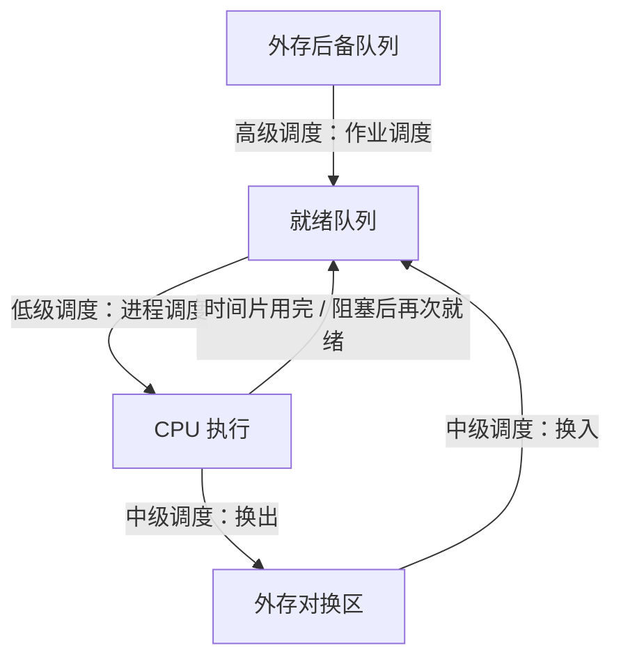

# 第 3 章：处理器调度

> 这章是 408 操作系统的**计算题重镇**，重要度 ⭐⭐⭐⭐⭐。调度算法的性能计算（周转时间、带权周转时间、响应比）几乎每年必出，既可以是选择题，也可以是综合题的一部分。本章的核心是"给定进程表 + 给定算法 → 画时间轴 → 算指标"，套路固定，**必须动手算到会**，光看懂没用。概念部分（三级调度、调度时机、可抢占性）则以选择题为主。

---

## 3.1 处理器调度的概念

### 三级调度

在多道程序系统中，一个作业从提交到执行完毕，可能要经历三级调度：

| 级别 | 别名 | 调度对象 | 频率 | 功能 |
|------|------|---------|------|------|
| 高级调度 | 作业调度 | 作业（外存后备队列 → 内存） | 最低（分钟级） | 决定把哪个作业调入内存创建为进程 |
| 中级调度 | 中程调度 / 内存调度 | 挂起进程（内存 ↔ 外存对换区） | 中等 | 内存紧张时把进程换出，缓解内存压力 |
| 低级调度 | 进程调度 | 就绪进程（就绪队列 → CPU） | **最高**（毫秒级） | 决定哪个就绪进程获得处理机 |

> 易错点：**低级调度是频率最高的调度**，也是唯一在分时系统中必须存在的调度。高级调度每个作业在生命周期内只经历一次（调入）；很多简单系统（如单道批处理）没有中级调度。选择题问"频率最高的是哪一级"，答进程调度。

### 调度的触发时机

进程调度并非随时发生，只在特定时刻触发。按"当前进程是否自愿让出 CPU"分为两类：

| 类别 | 触发条件 | 示例 |
|------|---------|------|
| **主动放弃**（非剥夺性切换） | 当前进程自己无法继续运行 | ① 运行结束；② 请求 I/O 或等待事件而阻塞；③ 主动执行阻塞原语（如 P 操作被挂起） |
| **被动剥夺**（剥夺性切换） | 当前进程还能运行，但被强制让出 | ① 时间片用完；② 更高优先级进程到达就绪队列；③ 中断处理结束后发现更优进程 |

### 调度时机与可抢占方式的关系

- **非抢占式（不可剥夺）**：只允许"主动放弃"类时机触发调度。一旦某进程获得 CPU，就独占运行直到结束或阻塞，**即使此时来了更高优先级的进程也不切换**。
- **抢占式（可剥夺）**：两类时机都可以触发调度。

> 易错点：**"时间片用完"只在抢占式（RR）调度中才谈得上**；非抢占式 SJF/优先级调度的调度时机只有"进程结束"和"进程阻塞"两种。考试给出算法时先判断是否可抢占，再画时间轴。

---

## 3.2 调度的性能指标

### 基本时间量

对一个进程（作业） $i$ ，设其到达时间为 $t_{arrive}$ ，完成时间为 $t_{finish}$ ，服务时间（要求服务时间 / 运行时间）为 $t_{service}$ ：

**周转时间**：从提交到完成的总时长（含等待 + 运行），单位为时间单位（ms、s 等，与题目所给单位一致）：

$$
T_{周转} = t_{finish} - t_{arrive}
$$

**平均周转时间**：

$$
\overline{T} = \frac{1}{n} \sum_{i=1}^{n} T_i
$$

**带权周转时间**：周转时间与服务时间之比，反映"等待的相对代价"：

$$
W_i = \frac{T_{周转,i}}{t_{service,i}}
$$

**平均带权周转时间**：

$$
\overline{W} = \frac{1}{n} \sum_{i=1}^{n} W_i
$$

> 关键结论：**带权周转时间恒 $\geq 1$**（因为周转时间 $=$ 等待时间 $+$ 服务时间 $\geq$ 服务时间）。算出小于 1 的结果一定是算错了。带权周转越接近 1 ，说明该进程几乎没等待。

**等待时间**：进程在就绪队列中等待的总时长：

$$
T_{等待} = T_{周转} - t_{service}
$$

**响应时间**：从提交请求到**首次获得响应**（首次上 CPU 开始运行）的时间。注意响应时间只算到"第一次开始运行"，与完成时间无关。

### 响应比

HRRN（高响应比优先）算法使用的综合指标：

$$
R_p = \frac{\text{等待时间} + \text{要求服务时间}}{\text{要求服务时间}} = 1 + \frac{\text{等待时间}}{\text{要求服务时间}}
$$

- 等待时间越长 → $R_p$ 越大（照顾长作业不至于饿死）
- 服务时间越短 → $R_p$ 越大（照顾短作业）
- 刚到达时等待时间为 0 ， $R_p = 1$ ；随着等待时间增长， $R_p$ 单调上升

> 响应比是"短作业优先"与"先来先服务"的折中：短作业靠分母小占优，长作业靠分子中的等待时间占优。

---

## 3.3 典型调度算法

### 3.3.1 FCFS 先来先服务

**规则**：按到达就绪队列的先后顺序调度，非抢占。

| 优点 | 缺点 |
|------|------|
| 实现简单、绝对公平 | 对短作业不利：一个长作业会阻塞后面所有短作业 |
| 无饥饿问题 | 平均等待时间较大；有利于 CPU 繁忙型作业，不利于 I/O 繁忙型作业 |

**适用场景**：批处理系统、作为其他算法的 tie-breaker（响应比/服务时间相同时按 FCFS）。

> FCFS 是**非抢占**的。经典反例：P1（服务 100）先到，P2（服务 1）随后到，P2 要等 P1 跑完——"护航效应"（convoy effect）。

### 3.3.2 SJF 短作业优先

**规则**：选择预计服务时间最短的作业；服务时间相同通常按 FCFS 次序。**通常讨论的是非抢占式**。

| 优点 | 缺点 |
|------|------|
| **平均等待时间最短**（可证明是最优的非抢占算法） | 对长作业不利，长作业可能**饥饿** |
| 吞吐量高 | 需要预知服务时间，实际中只能估计；不照顾紧迫性 |

**抢占式变体**：SRTN（最短剩余时间优先）——新进程到达时若其服务时间比当前进程的**剩余时间**短，则抢占。

> 易错点：SJF 的"短"指**本次剩余/预计服务时间**，不看优先级也不看到达顺序。题目若写"SJF（非抢占）"，长作业哪怕等得再久也不能插队；若写"SRTN / 抢占式 SJF"，则每次有新进程到达都要比较剩余时间。

### 3.3.3 HRRN 高响应比优先

**规则**：每次调度前**重新计算**所有就绪进程的响应比 $R_p$ ，选最大者。非抢占。

| 优点 | 缺点 |
|------|------|
| 兼顾短作业（服务时间小，响应比高）与长作业（等待久，响应比升高） | 每次调度都要计算所有就绪进程的响应比，**系统开销大** |
| 不会饥饿（等待足够久后响应比必然超过任何对手） | 仍然无法体现紧迫程度 |

**适用场景**：作业调度（批处理），是 SJF 与 FCFS 的折中。

> 易错点：**响应比必须每次调度前重算**，不能用上一次的值。等待时间在公式中是"到本次调度时刻为止"的累计等待时间。

### 3.3.4 RR 时间片轮转

**规则**：就绪队列按 FCFS 排队；每个进程最多运行一个时间片 $q$ ，用完即被剥夺 CPU 排到队尾，由下一个进程运行。主要用于分时系统，保证响应时间。

**时间片大小的影响**：

| 时间片 | 后果 |
|--------|------|
| 太小 | 进程频繁切换，**上下文切换开销占比过大**，CPU 效率下降 |
| 太大 | 大部分进程一个时间片内跑不完，RR 退化为 **FCFS** |
| 经验值 | 略大于一次典型交互所需时间；切换开销通常不超过 1%（取决于时间片大小与切换开销） |

**关键细节：时间片用完瞬间的排队顺序**。设在时刻 $t$ 某进程用完时间片，此时恰好有新进程到达，两种约定：

1. **新到达进程优先**：新到达进程先入队，被剥夺的进程再排到队尾。408 真题与王道教材**通常按此约定**处理。
2. **被剥夺进程优先**：被剥夺进程先排到队尾，新到达进程排在其后。

> 两种约定会导致不同的执行序列和周转时间！**审题时注意题目是否说明排队规则**；未说明时默认按"新到达优先"，但答案有歧义时应写出所用假设。

### 3.3.5 优先级调度

**规则**：选择优先级最高的就绪进程。约定因教材而异（数值越小优先级越高，或越大越高），**审题时以题目说明为准**。

两个维度的组合：

| 维度 | 分类 | 说明 |
|------|------|------|
| 优先级是否变化 | 静态优先级 | 创建时确定，整个生命周期不变；实现简单但不够灵活 |
| | 动态优先级 | 随等待时间、已运行时间等调整（如等待越久优先级越高） |
| 是否可抢占 | 非抢占式 | 高优先级进程到达也要等当前进程主动让出 |
| | 抢占式 | 高优先级进程到达立即剥夺当前进程的 CPU |

**核心问题：饥饿**。低优先级进程可能永远得不到调度。

**解决手段：老化（aging）**——随着等待时间增长逐步提高进程优先级，保证最终能被调度。

> 优先级调度是唯一"显式引入饥饿"的算法（SJF 也有，但优先级最典型）。选择题看到"低优先级进程长期得不到运行"→ 饥饿；看到"按等待时间提升优先级"→ 老化。

### 3.3.6 多级反馈队列（了解）

综合各算法优点的实际系统常用方案，规则：

1. 设置多个就绪队列，优先级从高到低，时间片从小到大；
2. 新进程进入**第一级**队列末尾，按 RR 运行；
3. 时间片用完未完成的进程，**降级**进入下一级队列末尾；
4. 每轮调度先检查高优先级队列，空了才调度下一级队列；
5. I/O 完成后通常回到原队列（具体实现各异）。

特点：照顾短进程（短进程在高优先级队列内完成）、不饥饿（可结合老化）、无需预知服务时间。UNIX、Windows 的调度器都是其变体。

### 3.3.7 调度算法对比总表

| 算法 | 可抢占性 | 平均等待时间 | 公平性 | 是否可能饥饿 | 典型场景 |
|------|---------|-------------|--------|-------------|---------|
| FCFS | 非抢占 | 较大 | 好（先来后到） | 否 | 批处理、作业调度 |
| SJF | 通常非抢占 | **最小**（非抢占下最优） | 差（歧视长作业） | 长作业可能饥饿 | 批处理、估计服务时间后使用 |
| HRRN | 非抢占 | 较小 | 较好 | **否**（响应比必升） | 批处理作业调度 |
| RR | 抢占 | 中等 | 好 | 否 | 分时 / 交互式系统 |
| 优先级 | 两者皆有 | 取决于优先级设计 | 差 | 低优先级可能饥饿（用老化解决） | 实时 / 通用系统 |
| 多级反馈队列 | 抢占 | 较小 | 较好 | 一般否 | 通用操作系统（UNIX/Windows） |

> 记忆口诀：**FCFS 公平但慢，SJF 最快但饿死长作业，HRRN 折中但要算，RR 保响应，优先级防饥饿靠老化**。

---

## 3.4 上下文及其切换机制

### 上下文（Context）的概念

进程上下文是进程在某一时刻的**运行现场**，切换时保存/恢复这些信息才能保证进程能从断点继续执行。主要包括：

| 组成 | 内容 |
|------|------|
| 用户级上下文 | 用户栈、静态/动态数据区（部分实现不保存，随地址空间保留） |
| 寄存器级上下文 | **通用寄存器、PC（程序计数器）、PSW（状态字）、栈指针** |
| 系统级上下文 | **PCB**（进程状态、内存管理信息、资源清单）、内核栈 |

> PCB 是进程存在的唯一标志，也是上下文中最核心的系统级部分，详见[第 2 章（进程与线程）](02-process-threads.md)。

### 上下文切换的时机与开销

**时机**：发生调度（无论主动放弃还是被动剥夺）时，都要执行上下文切换：保存旧进程上下文 → 更新 PCB → 装入新进程上下文 → 跳转到新进程 PC 处继续执行。

**开销**：

1. **直接开销**：保存/恢复寄存器和 PCB、切换地址空间（更新页表基址寄存器）所需的 CPU 时间；
2. **间接开销**：切换后 **TLB 失效**（若切换了地址空间，TLB 需全部或部分刷新）、**Cache 失效**（新进程的工作集重新填充 Cache），导致切换后一段时间访存变慢。

> 上下文切换是**纯开销**——不执行任何用户指令。这就是 RR 时间片不能太小的根本原因：时间片越小，单位时间内的切换次数越多，开销占比越高。

---

## 3.5 多处理机调度（了解）

多核 / 多处理机系统中，多个 CPU 共同承担就绪队列中的进程，调度问题变得更复杂。了解两个核心概念即可：

| 概念 | 含义 |
|------|------|
| **亲和调度**（affinity） | 尽量让进程继续在原来的 CPU 上运行，避免 Cache 中已加载的数据失效（硬亲和：强制绑定；软亲和：尽量但不保证） |
| **负载均衡** | 各处理机忙闲不均时，把进程从忙队列迁移到闲队列（推迁移 / 拉迁移） |

> 408 对多处理机调度只做概念考查：记住"亲和调度是为了利用 Cache 局部性、减少迁移开销"，"负载均衡是为了避免 CPU 空转或过载"即可。

---

## 3.6 典型例题

### 例 1：FCFS / SJF / HRRN 三算法对比

**例 1**：设 4 个进程的到达时间与服务时间如下表（单位：时间片）：

| 进程 | 到达时间 | 服务时间 |
|------|---------|---------|
| P1 | 0 | 7 |
| P2 | 1 | 5 |
| P3 | 5 | 2 |
| P4 | 6 | 1 |

分别用 FCFS、SJF（非抢占）、HRRN 调度，求各算法的平均周转时间和平均带权周转时间。

**解**：

**① FCFS**：严格按到达顺序执行。

| 时间 | 0~7 | 7~12 | 12~14 | 14~15 |
|------|-----|------|-------|-------|
| 进程 | P1 | P2 | P3 | P4 |

| 进程 | 完成时间 | 周转时间 | 带权周转时间 |
|------|---------|---------|-------------|
| P1 | 7 | 7 - 0 = 7 | 7 / 7 = 1 |
| P2 | 12 | 12 - 1 = 11 | 11 / 5 = 2.2 |
| P3 | 14 | 14 - 5 = 9 | 9 / 2 = 4.5 |
| P4 | 15 | 15 - 6 = 9 | 9 / 1 = 9 |

平均周转时间 $= (7+11+9+9)/4 = 9$ ；平均带权周转时间 $= (1+2.2+4.5+9)/4 = 4.175$ 。

**② SJF（非抢占）**：0 时刻只有 P1 到达，P1 先运行到 7；7 时刻就绪队列为 P2(5)、P3(2)、P4(1)，选最短的 P4，再 P3，最后 P2。

| 时间 | 0~7 | 7~8 | 8~10 | 10~15 |
|------|-----|-----|------|-------|
| 进程 | P1 | P4 | P3 | P2 |

| 进程 | 完成时间 | 周转时间 | 带权周转时间 |
|------|---------|---------|-------------|
| P1 | 7 | 7 | 1 |
| P4 | 8 | 8 - 6 = 2 | 2 / 1 = 2 |
| P3 | 10 | 10 - 5 = 5 | 5 / 2 = 2.5 |
| P2 | 15 | 15 - 1 = 14 | 14 / 5 = 2.8 |

平均周转时间 $= (7+2+5+14)/4 = 7$ ；平均带权周转时间 $= (1+2+2.5+2.8)/4 = 2.075$ 。

**③ HRRN**：每次调度前重算响应比。

- 0 时刻：只有 P1，运行 0~7。
- 7 时刻：P2 等待 6， $R_p = 1 + 6/5 = 2.2$ ；P3 等待 2， $R_p = 1 + 2/2 = 2.0$ ；P4 等待 1， $R_p = 1 + 1/1 = 2.0$ 。选 **P2**，运行 7~12。
- 12 时刻：P3 等待 7， $R_p = 1 + 7/2 = 4.5$ ；P4 等待 6， $R_p = 1 + 6/1 = 7.0$ 。选 **P4**，运行 12~13。
- 13 时刻：只剩 P3，运行 13~15。

| 进程 | 完成时间 | 周转时间 | 带权周转时间 |
|------|---------|---------|-------------|
| P1 | 7 | 7 | 1 |
| P2 | 12 | 11 | 11 / 5 = 2.2 |
| P4 | 13 | 13 - 6 = 7 | 7 / 1 = 7 |
| P3 | 15 | 15 - 5 = 10 | 10 / 2 = 5 |

平均周转时间 $= (7+11+7+10)/4 = 8.75$ ；平均带权周转时间 $= (1+2.2+7+5)/4 = 3.8$ 。

**对比**：SJF 平均周转时间最短（7 < 8.75 < 9），印证"SJF 平均等待时间最短"；但 SJF 让长作业 P2 的带权周转高达 2.8，而 HRRN 中等待最久的进程总能获得机会。

### 例 2：RR 时间片轮转

**例 2**：4 个进程如下表，时间片 $q = 2$ ，采用"新到达进程优先入队"约定（时间片用完时，期间新到达的进程先入队，被剥夺的进程再排到队尾），求各进程的完成时间、周转时间和平均带权周转时间。

| 进程 | 到达时间 | 服务时间 |
|------|---------|---------|
| P1 | 0 | 5 |
| P2 | 1 | 3 |
| P3 | 2 | 1 |
| P4 | 3 | 4 |

**解**：逐时刻模拟就绪队列：

| 时刻 | 事件 | 就绪队列（队头→队尾） | 下一个运行 |
|------|------|----------------------|-----------|
| 0 | P1 到达并开始 | — | P1（0~2） |
| 1 | P2 到达入队 | [P2] | — |
| 2 | P1 时间片到；P3 到达（先入队）；P1 排队尾 | [P2, P3, P1] | P2（2~4） |
| 3 | P4 到达入队 | [P3, P1, P4] | — |
| 4 | P2 时间片到（剩 1）；P4 已在队中；P2 排队尾 | [P3, P1, P4, P2] | P3（4~5） |
| 5 | P3 运行完毕 | [P1, P4, P2] | P1（5~7） |
| 7 | P1 时间片到（剩 1），排队尾 | [P4, P2, P1] | P4（7~9） |
| 9 | P4 时间片到（剩 2），排队尾 | [P2, P1, P4] | P2（9~10） |
| 10 | P2 运行完毕（剩 1 < q） | [P1, P4] | P1（10~11） |
| 11 | P1 运行完毕（剩 1） | [P4] | P4（11~13） |
| 13 | P4 运行完毕 | — | 结束 |

| 进程 | 完成时间 | 周转时间 | 带权周转时间 |
|------|---------|---------|-------------|
| P1 | 11 | 11 - 0 = 11 | 11 / 5 = 2.2 |
| P2 | 10 | 10 - 1 = 9 | 9 / 3 = 3 |
| P3 | 5 | 5 - 2 = 3 | 3 / 1 = 3 |
| P4 | 13 | 13 - 3 = 10 | 10 / 4 = 2.5 |

平均周转时间 $= (11+9+3+10)/4 = 8.25$ ；平均带权周转时间 $= (2.2+3+3+2.5)/4 = 2.675$ 。

> 若采用"被剥夺进程优先入队"约定，2 时刻 P1 会排在 P3 之前，后续执行序列不同。**做题务必先确认约定**，写清假设。

### 例 3：HRRN 响应比计算

**例 3**：某非抢占 HRRN 系统中，12 时刻正在运行的进程结束，就绪队列中有：

| 进程 | 到达时间 | 要求服务时间 |
|------|---------|-------------|
| P2 | 2 | 4 |
| P3 | 5 | 2 |
| P4 | 8 | 1 |

问：12 时刻应选哪个进程？若该进程运行完毕，下一次又选谁？

**解**：12 时刻各进程响应比：

$$
R_{p2} = 1 + \frac{12-2}{4} = 3.5, \quad R_{p3} = 1 + \frac{12-5}{2} = 4.5, \quad R_{p4} = 1 + \frac{12-8}{1} = 5
$$

选响应比最高的 **P4**（12~13 运行完毕）。

13 时刻**必须重算**：

$$
R_{p2} = 1 + \frac{13-2}{4} = 3.75, \quad R_{p3} = 1 + \frac{13-5}{2} = 5
$$

选 **P3**（13~15 运行完毕），之后才是 P2（15~19）。

> 注意 P3 的响应比从 4.5 升到 5 后反超 P2 的 3.75——这正是"每次调度前重算"的意义：等待越久，被调度的机会越大，长作业不会饥饿。

### 例 4：优先级调度（可抢占）

**例 4**：系统采用**可抢占**优先级调度，**优先级数越小优先级越高**。进程表如下：

| 进程 | 到达时间 | 服务时间 | 优先级 |
|------|---------|---------|--------|
| P1 | 0 | 8 | 3 |
| P2 | 1 | 4 | 1 |
| P3 | 2 | 2 | 4 |
| P4 | 3 | 1 | 2 |

画时间轴并求平均等待时间、平均周转时间。

**解**：逐时刻分析：

- 0 时刻：只有 P1，运行 0~1。
- 1 时刻：P2 到达，优先级 1 高于 P1 的 3 → **抢占**，P2 运行。
- 2 时刻：P3 到达，优先级 4 低于 P2 → 不抢占。
- 3 时刻：P4 到达，优先级 2 低于 P2 → 不抢占。
- 5 时刻：P2 完成；就绪队列中 P4（优先级 2）最高，运行 5~6 并完成。
- 6 时刻：P1（优先级 3）高于 P3（优先级 4），运行 6~13 完成。
- 13 时刻：P3 运行 13~15 完成。

| 时间 | 0~1 | 1~5 | 5~6 | 6~13 | 13~15 |
|------|-----|-----|-----|------|-------|
| 进程 | P1 | P2 | P4 | P1 | P3 |

| 进程 | 完成时间 | 周转时间 | 等待时间 |
|------|---------|---------|---------|
| P1 | 13 | 13 | 13 - 8 = 5 |
| P2 | 5 | 4 | 4 - 4 = 0 |
| P3 | 15 | 13 | 13 - 2 = 11 |
| P4 | 6 | 3 | 3 - 1 = 2 |

平均等待时间 $= (5+0+11+2)/4 = 4.5$ ；平均周转时间 $= (13+4+13+3)/4 = 8.25$ 。

> 可抢占优先级调度的关键：**每个新进程到达时刻都要比较优先级**；若本题改为非抢占式，P2 到达时 P1 会继续运行到结束，结果完全不同。

### 解题技巧总结

- 拿到调度计算题，先确认三件事：**算法、是否可抢占、（RR 时）排队约定**
- 画时间轴表格逐段推导，**每段标注起止时刻与进程**，别凭感觉口算
- 周转时间 $=$ 完成时刻 $-$ 到达时刻；等待时间 $=$ 周转 $-$ 服务时间
- HRRN 每次调度前列出所有就绪进程的等待时间，再套 $1 +$ 等待 $/$ 服务
- 算完用"带权周转 $\geq 1$ "和"总运行时长 $=$ 各服务时间之和"两个不变量验算

### 常见陷阱清单

1. **带权周转时间算出小于 1**：必然是周转时间算错（通常是把完成时刻当成了周转时间，忘了减到达时间）
2. **HRRN 响应比不重算**：沿用上一时刻的响应比会选错进程，每次调度前必须用当前时刻重算
3. **默认 SJF/HRRN 可抢占**：这两种算法默认讨论**非抢占**形式；SJF 的抢占形式叫 SRTN，题目会明确说明
4. **RR 排队顺序想当然**：时间片用完瞬间有新进程到达时，"新到达优先"与"被剥夺者优先"结果不同，408 一般按"新到达优先"，但要审题确认
5. **周转时间单位与到达时间不对齐**：题目可能到达时间用 ms、服务时间用 μs，先统一单位再算
6. **把响应时间当周转时间**：响应时间只到**首次**开始运行为止

---

## 本章小结

### 核心要点回顾

1. **三级调度**：高级（作业）、中级（内存对换）、低级（进程）；低级调度频率最高
2. **调度时机**：主动放弃（结束、阻塞）与被动剥夺（时间片到、更高优先级到达）；非抢占式只有前者
3. **性能指标**：周转时间 $=$ 完成 $-$ 到达；带权周转 $=$ 周转 $/$ 服务（ $\geq 1$ ）；等待 $=$ 周转 $-$ 服务
4. **响应比**： $R_p = 1 +$ 等待时间 $/$ 要求服务时间，每次调度前重算
5. **算法特性**：FCFS 非抢占无饥饿；SJF 平均等待最短但长作业饥饿；HRRN 折中不饥饿；RR 保响应、时间片大小是权衡；优先级调度防饥饿靠老化
6. **上下文切换**：保存/恢复寄存器与 PCB、刷新 TLB/Cache，是纯开销——RR 时间片不能太小的根源
7. **多处理机调度**：亲和调度（利用 Cache 局部性）+ 负载均衡（迁移进程）

### 考试重点排序

| 优先级 | 考点 | 题型 |
|--------|------|------|
| ⭐⭐⭐ | FCFS/SJF/HRRN/RR/优先级 计算周转时间、带权周转时间、等待时间 | 选择题 + 综合题 |
| ⭐⭐⭐ | 响应比计算与 HRRN 选择 | 选择题 |
| ⭐⭐ | RR 时间片大小的影响、排队约定 | 选择题 |
| ⭐⭐ | 调度时机、可抢占/不可抢占的判定 | 选择题 |
| ⭐⭐ | 饥饿与老化 | 选择题 |
| ⭐ | 三级调度、上下文切换开销、多处理机调度概念 | 选择题 |

> 本章复习策略：**例题至少亲手算两遍**，尤其是例 1（三算法对比）和例 2（RR 模拟）。公式本身简单，错都在"时间轴画错"和"约定没确认"上。学好本章也为[第 4 章（进程同步）](04-sync-mutex.md)打基础——PV 操作引起的阻塞/唤醒本质上就是调度时机的来源之一。

---

## 自测题

1. 三级调度分别指什么？哪一级调度频率最高？
2. 哪些情况会触发进程调度？非抢占式系统的调度时机有哪些？
3. 进程 P1（到达 0，服务 4）、P2（到达 1，服务 3），用 FCFS 调度，求平均周转时间和平均带权周转时间。
4. RR 算法中时间片过小和过大分别会导致什么问题？
5. 某进程要求服务时间为 3 ，已等待 9 个时间单位，求其响应比。
6. 什么是饥饿？哪种调度算法最容易出现饥饿？如何缓解？
7. 上下文切换的开销包括哪些方面？为什么它与 TLB、Cache 有关？

> **答案**：1. 高级调度（作业调度，外存→内存）、中级调度（内存↔外存对换）、低级调度（进程调度，就绪队列→CPU）；低级调度频率最高。2. 触发时机：进程结束、进程阻塞（主动放弃）；时间片用完、更高优先级进程到达（被动剥夺）。非抢占式只有前两种。3. P1 完成于 4（周转 4，带权 1），P2 完成于 7（周转 6，带权 2）；平均周转时间 $= 5$ ，平均带权周转时间 $= 1.5$ 。4. 过小则上下文切换开销占比过大，CPU 利用率下降；过大则退化为 FCFS，失去轮转的响应性意义。5. $R_p = 1 + 9/3 = 4$ 。6. 饥饿指某进程长期得不到资源（CPU）而无法推进；优先级调度和 SJF 最典型；缓解手段是老化——随等待时间增加逐步提高优先级（HRRN 的响应比机制也天然防饥饿）。7. 直接开销：保存/恢复寄存器、PC、PSW 及 PCB，切换地址空间；间接开销：TLB 失效（切地址空间后需刷新）、Cache 失效（新进程工作集需重新填充），切换后一段时间访存变慢。
