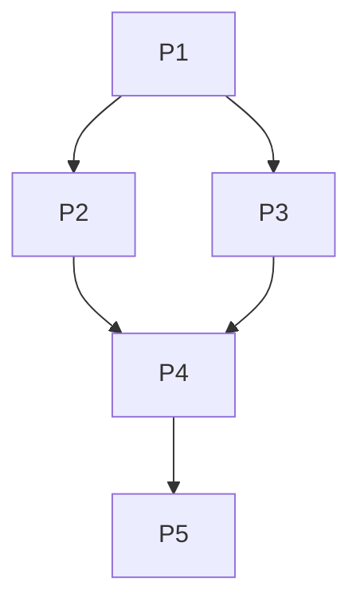

# 第 4 章：进程同步

> 本章是 408 操作系统的**分值之王**，重要度 ⭐⭐⭐⭐⭐。PV 操作几乎每年必考一道综合应用题（8~12 分），选择题也常考信号量取值、死锁判断。本章是[第 2 章（进程与线程）](02-process-threads.md)并发概念的落地，与[第 3 章（处理器调度）](03-scheduling.md)的阻塞/唤醒机制紧密相关，也是[第 5 章（死锁）](05-deadlock.md)的直接前置。学习重心只有一条：**把 PV 编程练到条件反射**——经典问题（生产者-消费者、读者-写者、哲学家进餐、前驱图）必须能默写出完整解法，然后才能应对真题的各种变式。

---

## 4.1 临界区问题回顾

| 概念 | 定义 |
|------|------|
| **临界资源** | 一次仅允许一个进程使用的资源（如打印机、共享变量、缓冲区） |
| **临界区** | 访问临界资源的那段代码，访问过程分为：进入区 → 临界区 → 退出区 → 剩余区 |
| **互斥** | 多个进程不能同时进入临界区（间接制约，源于资源竞争） |
| **同步** | 并发进程之间存在执行次序的约束（直接制约，源于协作） |

**临界区访问四准则**：

| 准则 | 含义 |
|------|------|
| **空闲让进** | 临界区空闲时应允许进程立即进入 |
| **忙则等待** | 已有进程在临界区时，其他进程必须等待（保证互斥） |
| **有限等待** | 等待进入临界区的进程不能无限等待（防止饥饿） |
| **让权等待** | 进不了临界区的进程应释放 CPU（避免忙等） |

> 选择题常以"某某算法违反了哪条准则"出题。判断技巧：**两个进程都进不去** → 违反空闲让进；**两个进程都进去了** → 违反忙则等待；**一个进程一直进不去** → 违反有限等待；**进不去还占着 CPU 空转** → 违反让权等待。

---

## 4.2 软件实现方法（了解缺陷即可）

设两个进程 $P_0$ 、 $P_1$ 竞争进入临界区，四种方法依次演进：

**① 单标志法**（共享变量 `turn` 表示允许进入的进程编号）、**② 双标志先检查法**（`flag[]` 表示想进意愿，先检查后修改）、**③ 双标志后检查法**（先声明后检查）：

```pseudo
// ① 单标志法
Pi: while (turn != i) ;            // turn 不是自己就一直等
    临界区; turn = j;              // 出来把"锁"交给对方

// ② 双标志先检查法
Pi: while (flag[j]) ;              // 先检查对方是否想进
    flag[i] = true; 临界区; flag[i] = false;

// ③ 双标志后检查法
Pi: flag[i] = true;                // 先声明自己想进
    while (flag[j]) ; 临界区; flag[i] = false;
```

**④ Peterson 算法**：结合 `flag` 和 `turn`，先表达意愿，再把优先权让给对方：

```pseudo
// 进程 Pi（j 是另一个进程）
flag[i] = true;
turn = j;                          // 主动谦让
while (flag[j] && turn == j) ;     // 对方想进且我在谦让时才等待
临界区;
flag[i] = false;
```

| 方法 | 缺陷 |
|------|------|
| 单标志法 | 违反**空闲让进**：`turn == j` 但 $P_j$ 不想进时， $P_i$ 也白白等待 |
| 双标志先检查法 | 违反**忙则等待**：检查和修改非原子，两进程同时检查到对方 flag 为 false 后同时进入 |
| 双标志后检查法 | 违反**空闲让进**：两进程同时声明后互相谦让，都进不去 |
| Peterson 算法 | 满足空闲让进、忙则等待、有限等待；但仍是**忙等**，不满足让权等待 |

> 记忆口诀：**单标志 → 空闲让进✗；双旗先检查 → 忙则等待✗；双旗后检查 → 空闲让进✗；Peterson → 全对（仅忙等）**。这是选择题高频考点。

---

## 4.3 硬件实现方法

**中断屏蔽**：进入临界区前关中断、退出后开中断，临界区操作天然不被打断。缺陷：仅适用单处理机（多核下其他 CPU 仍可并发执行）；把关中断特权交给用户进程太危险；临界区过长会长时间无法响应中断。

**TestAndSet 指令（TS / TSL）**：硬件提供一条**原子指令**，读出锁状态并同时置为"占用"：

```pseudo
bool TS(bool *lock) {
    bool old = *lock;
    *lock = true;
    return old;
}

// 每个进程进入临界区前：
while (TS(&lock)) ;   // 锁被别人占着就忙等
临界区;
lock = false;         // 退出时释放锁
```

**Swap 指令**：通过原子的交换操作实现：

```pseudo
void Swap(bool *a, bool *b) {
    bool temp = *a;
    *a = *b;
    *b = temp;
}

// 每个进程有一个局部变量 key
key = true;
while (key) Swap(&lock, &key);   // 换到锁才退出循环
临界区;
lock = false;
```

> TS 和 Swap 实现简单、正确性好，但都只解决了**互斥**：进程在 `while` 里**忙等**（不满足让权等待），且**不能保证有限等待**（调度不当时某进程可能一直抢不到锁而饥饿）。

---

## 4.4 锁（Lock）

互斥锁把临界区抽象为"加锁 → 访问 → 解锁"：

```pseudo
acquire(lock);    // 加锁：锁不可用则等待
临界区;
release(lock);    // 解锁
```

**自旋锁 vs 阻塞锁**：

| 对比项 | 自旋锁（spinlock） | 阻塞锁（mutex，可睡眠） |
|--------|------------------|---------------------|
| 等待方式 | 忙等，持续循环检查 | 阻塞自己让出 CPU，解锁时被唤醒 |
| CPU 开销 | 等待期间占着 CPU 空转 | 等待期间不占 CPU |
| 切换开销 | 无上下文切换 | 阻塞/唤醒有上下文切换开销 |
| **适用场景** | **临界区极短**、多核系统 | 临界区较长、单核系统 |

> 适用场景是选择题常考点：**自旋锁适合短临界区**（切换开销大于忙等开销），且在多核上等待进程可以真正并行等待；**单核 + 长临界区**用自旋锁纯属浪费——等待者和持有者在同一个 CPU 上，等待者空转只会拖慢持有者。

---

## 4.5 信号量机制（本章核心）

### 从整型信号量到记录型信号量

**整型信号量**的 P/V 定义：

```pseudo
wait(S) { while (S <= 0) ; S--; }   // 忙等
signal(S) { S++; }
```

缺陷：只要 $S \le 0$ 就不断循环测试，**不满足让权等待**。

**记录型信号量**引入等待队列，进不了临界区就阻塞自己：

```pseudo
typedef struct {
    int value;              // 信号量的值
    struct process *list;   // 等待队列
} semaphore;

// P 操作（wait）
void wait(semaphore S) {
    S.value--;
    if (S.value < 0) {          // 已无资源可用
        把当前进程加入 S.list;
        block(当前进程);        // 运行态 → 阻塞态，让权等待
    }
}

// V 操作（signal）
void signal(semaphore S) {
    S.value++;
    if (S.value <= 0) {         // 队列里还有等待者
        从 S.list 取出进程 W;
        wakeup(W);              // 阻塞态 → 就绪态
    }
}
```

**取值含义**（选择题必考）：

| 信号量取值 | 含义 |
|-----------|------|
| $S > 0$ | 可用资源的数量 |
| $S = 0$ | 无可用资源，也无进程等待 |
| $S < 0$ | 其**绝对值**为等待该资源的进程数 |

> P、V 操作必须**成对出现**且位于**同一进程**的合适位置：只 P 不 V 会导致资源耗尽、其他进程永久阻塞；只 V 不 P 会破坏互斥。另外，P、V 本身必须设计为**原子操作**（通常靠关中断或硬件指令实现）。

### 用信号量实现互斥

互斥信号量初值为 **1**，临界区夹在 P/V 之间：

```pseudo
semaphore mutex = 1;      // 临界资源只允许一个进程访问

进程 P1: ... P(mutex); 临界区; V(mutex); ...
进程 P2: ... P(mutex); 临界区; V(mutex); ...
```

### 用信号量实现同步（前驱关系）

"语句 $a$ 必须先于语句 $b$ 执行"——同步信号量初值为 **0**，前驱方 V、后继方 P：

```pseudo
semaphore S = 0;          // 表示"a 完成之前 b 不能开始"

进程 A: 语句a; V(S);      // 前驱完成后发信号
进程 B: P(S); 语句b;      // 后继执行前先等信号
```

> 初值设定口诀：**互斥初值 1，同步初值 0**。同步信号量初值为 0 的直觉：前驱还没执行时，"前驱已完成"这件事发生了 0 次，后继自然要等。

---

## 4.6 经典同步问题（必须默写）

### 4.6.1 生产者-消费者问题

**问题**：一组生产者和一组消费者共享容量为 $n$ 的缓冲区；缓冲区满时生产者不能放，空时消费者不能取；对缓冲区的访问必须互斥。

| 信号量 | 初值 | 含义 |
|--------|------|------|
| `mutex` | 1 | 互斥访问缓冲区 |
| `empty` | n | 空闲缓冲单元数 |
| `full` | 0 | 已满缓冲单元数（即产品数） |

```pseudo
semaphore mutex = 1;      // 互斥
semaphore empty = n;      // 空闲缓冲区数量
semaphore full  = 0;      // 产品数量

producer() {
    while (true) {
        生产一件产品;
        P(empty);         // ① 先申请空闲缓冲（资源信号量）
        P(mutex);         // ② 再申请互斥锁
        把产品放入缓冲区;
        V(mutex);
        V(full);          // 产品数 +1
    }
}

consumer() {
    while (true) {
        P(full);          // ① 先申请产品（资源信号量）
        P(mutex);         // ② 再申请互斥锁
        从缓冲区取走产品;
        V(mutex);
        V(empty);
        消费产品;
    }
}
```

**易错分析——P 操作顺序不能反**：若生产者写成 `P(mutex); P(empty);`，当缓冲区已满时，生产者持有 `mutex` 并阻塞在 `P(empty)` 上；消费者因拿不到 `mutex` 无法消费；缓冲区永远腾不出空位 → **死锁**。

> **必须"先 P 资源信号量，后 P 互斥信号量"；V 操作的顺序无所谓**（V 不会阻塞，不会引起死锁）。这是 408 综合题改错题的第一检查点。**变式：多类缓冲区**（如水果盘问题）——为每类物品设一个初值为 0 的同步信号量，另设空位资源信号量，见 4.9 节例 1。

### 4.6.2 读者-写者问题

**问题**：多个读进程可同时读文件；写进程与其他任何进程（读者或写者）都互斥。

| 变量/信号量 | 初值 | 含义 |
|------------|------|------|
| `count` | 0 | 当前正在读的读者数 |
| `mutex` | 1 | 互斥访问 `count` |
| `rw` | 1 | 互斥访问文件（读者与写者共享） |

**标准解法（读者优先）**：

```pseudo
int count = 0;
semaphore mutex = 1;      // 保护 count
semaphore rw = 1;         // 文件访问权

writer() {
    while (true) {
        P(rw);
        写文件;
        V(rw);
    }
}

reader() {
    while (true) {
        P(mutex);
        count++;
        if (count == 1) P(rw);   // 第一个读者负责挡住写者
        V(mutex);
        读文件;
        P(mutex);
        count--;
        if (count == 0) V(rw);   // 最后一个读者释放文件
        V(mutex);
    }
}
```

**要点**：`rw` 的 P/V 不是由每个读者执行的，而是由**第一个读者**（count 从 0 变 1）和**最后一个读者**（count 从 1 变 0）代表全体读者执行；只要还有读者在读，写者就拿不到 `rw`。**缺陷**：读者源源不断到来时，写者可能**饥饿**。

**公平版本**：增加信号量 `w = 1` ，让读者和写者到达"入口"时先排队：

```pseudo
semaphore w = 1;          // 读者、写者到达入口都要先排队

reader() {
    while (true) {
        P(w);             // 在入口排队，让写者有机会先到
        P(mutex);
        count++;
        if (count == 1) P(rw);
        V(mutex);
        V(w);             // 拿到入场资格立即放行
        读文件;
        P(mutex);
        count--;
        if (count == 0) V(rw);
        V(mutex);
    }
}

writer() {
    while (true) {
        P(w);
        P(rw);
        写文件;
        V(rw);
        V(w);
    }
}
```

> 公平版中 `w` 的作用：写者到达时若已有读者在读，写者阻塞在 `P(w)` 上；此后新到的读者也被挡在 `w` 之后，直到这批读者读完、写者写完才轮到读者——避免写者饥饿。注意 `w` 不是文件的互斥锁，文件的互斥仍由 `rw` 保证。

### 4.6.3 哲学家进餐问题

**问题**：5 位哲学家围坐圆桌，每人一只筷子共 5 只；吃面前需拿到左右两只筷子；拿不到就思考。

```pseudo
semaphore chopstick[5] = {1, 1, 1, 1, 1};

Pi() {                            // i = 0, 1, 2, 3, 4
    while (true) {
        思考;
        P(chopstick[i]);          // 拿左筷
        P(chopstick[(i+1) % 5]);  // 拿右筷
        吃饭;
        V(chopstick[i]);
        V(chopstick[(i+1) % 5]);
    }
}
```

**死锁条件**：5 人同时拿起左筷、同时等右筷，形成循环等待——这正是[第 5 章（死锁）](05-deadlock.md)循环等待条件的经典实例。

**三种解法**（破坏死锁必要条件）：

| 解法 | 做法 | 破坏了什么 |
|------|------|-----------|
| ① 限流 | 最多允许 **4 位**哲学家同时拿筷子（信号量 `people = 4` ） | 循环等待：5 只筷子必有至少一只空闲 |
| ② 奇偶编号不同顺序 | 奇数号先拿左筷再拿右筷，偶数号先拿右筷再拿左筷 | 循环等待：相邻两进程拿筷顺序相反，等待环路被断开 |
| ③ 成对拿取 | 仅当两只筷子都可用才允许拿（用互斥锁包住拿两只筷子的动作，或改用管程） | 请求与保持 |

解法①代码框架：

```pseudo
semaphore people = 4;     // 桌上最多 4 人同时拿筷子

Pi() {
    while (true) {
        思考;
        P(people);                  // 先限流
        P(chopstick[i]);
        P(chopstick[(i+1) % 5]);
        吃饭;
        V(chopstick[(i+1) % 5]);
        V(chopstick[i]);
        V(people);
    }
}
```

> 为什么"最多 4 人"一定不死锁？5 只筷子分给至多 4 人，若每人已持一只，至少剩 1 只空闲，持有它相邻位置的哲学家总能凑齐两只吃完释放，连锁解锁。推广：**N 只筷子最多允许 N-1 人同时拿**。

### 4.6.4 吸烟者问题（了解）

三种材料（烟叶、纸、胶水），每个吸烟者手里只有其中一种；供应者每轮在桌上放两种材料，拥有第三种材料的吸烟者卷好烟抽掉，并通知供应者下一轮。按材料组合设 3 个同步信号量：

| 信号量 | 初值 | 含义 |
|--------|------|------|
| `offer1` | 0 | 桌上放了"纸 + 胶水"（拿烟叶者可用） |
| `offer2` | 0 | 桌上放了"烟叶 + 胶水"（拿纸者可用） |
| `offer3` | 0 | 桌上放了"烟叶 + 纸"（拿胶水者可用） |
| `finish` | 0 | 吸烟者抽完，通知供应者 |

```pseudo
供应者:  轮流 V(offer1) / V(offer2) / V(offer3); 然后 P(finish); 循环
吸烟者1: P(offer1); 卷烟抽; V(finish); 循环   // 其余类推
```

> 本质是"单生产者-单消费者、消息按类型分发"问题，真题多以生产者-消费者变式出现。

---

## 4.7 管程（Monitor）

管程把共享数据和对数据的操作封装在一起，**任一时刻只允许一个进程在管程内执行**，互斥由编译器/运行时自动保证，无需程序员手写 P/V：

```pseudo
monitor Example {
    int count;                    // 共享数据结构
    condition c;                  // 条件变量

    procedure inc() {             // 对外提供的操作
        count++;
        ...
    }

    // 初始化代码（创建管程时执行一次）
    initialization: count = 0;
}
```

进程只能通过调用管程内的过程访问共享数据。进程在管程内发现条件不满足（如缓冲区空）时，调用 `wait(c)` 阻塞自己并挂在条件变量 `c` 的等待队列上；另一进程改变条件后调用 `signal(c)` 唤醒一个等待者。

**条件变量 vs 信号量**：

| 对比项 | 条件变量 | 信号量 |
|--------|---------|--------|
| 是否有值 | 无值，只是一个等待队列 | 有值，表示资源数 |
| signal 无人等待时 | **signal 直接消失，不产生任何效果** | V 使信号量值 +1，效果累积 |
| 用途 | 表达"等待某个条件成立" | 资源计数 + 同步 |

**signal 语义的两种流派**：

| 语义 | 行为 |
|------|------|
| **Hoare 管程** | 被唤醒进程**立即**执行；发出 signal 的进程让出管程（阻塞等待） |
| **Mesa 语义** | 被唤醒进程进入就绪队列稍后重新竞争进入管程；唤醒后必须**重新检查条件** |

> 选择题常考两点：① **signal 无人等待则无效果**（与信号量 V 操作本质区别）；② Mesa 语义下被唤醒者必须用 `while` 重查条件，Hoare 语义下条件必然成立。现代系统（如 Java 的 `synchronized + wait/notify` ）基本都是 Mesa 语义。

---

## 4.8 PV 操作解题方法论（408 应试核心）

**四步法**：

1. **分析并发进程与关系**：有几类进程？是否共享资源 → 互斥关系；是否有执行次序约束 → 同步/前驱关系
2. **设置信号量并给初值**：互斥 `mutex = 1`；资源计数初值 = 资源可用数量（如空缓冲 = n）；同步（前驱）初值 = 0
3. **在每个进程的正确位置写 P/V**：P 资源在前，P 互斥在后；前驱语句后 V，后继语句前 P
4. **检查死锁**：所有 P 是否都有对应的 V？是否存在"持锁等资源"的循环？把缓冲区满/空两个极端情形推演一遍

**综合例题（2011 年 408 真题风格）**：3 个进程 P1、P2、P3 共享一个缓冲区。P1 不断生产正整数放入缓冲区（容量视为无限）；P2 取出奇数并输出；P3 取出偶数并输出。用 PV 操作实现同步与互斥，说明信号量含义并给出初值。

**解**：

**① 分析关系**：缓冲区是临界资源，三进程访问要互斥 → `mutex = 1`；P1 的数分奇/偶两类分别流向 P2、P3 → 两条同步关系 → `odd = 0` 、 `even = 0`；缓冲区无限大 → 不需要 `empty` / `full`。

**② 信号量与初值**：

| 信号量 | 初值 | 含义 |
|--------|------|------|
| `mutex` | 1 | 互斥访问缓冲区 |
| `odd` | 0 | 缓冲区中可供取走的奇数个数 |
| `even` | 0 | 缓冲区中可供取走的偶数个数 |

**③ 代码**：

```pseudo
semaphore mutex = 1;
semaphore odd = 0, even = 0;

P1() {
    while (true) {
        x = 生产一个正整数;
        P(mutex);
        将 x 放入缓冲区;
        V(mutex);
        if (x % 2 == 1) V(odd);    // 奇数通知 P2
        else V(even);              // 偶数通知 P3
    }
}

P2() {
    while (true) {
        P(odd);
        P(mutex);
        从缓冲区取出一个奇数;
        V(mutex);
        输出该数;
    }
}

P3() {
    while (true) {
        P(even);
        P(mutex);
        从缓冲区取出一个偶数;
        V(mutex);
        输出该数;
    }
}
```

**④ 检查**：P/V 全部成对；P2/P3 先拿到"有对应类型的数"这个同步信号，再竞争 `mutex`，不会出现"持锁等数"的死锁。

> 本题三个得分点：①识别出两条同步关系并按类型分设信号量；② `mutex` 保护的是"缓冲区"这个临界资源；③说明"缓冲区无限大故无需 empty/full"。答题时把信号量含义和初值单独列表写出，是阅卷的给分点。

---

## 4.9 典型例题

**例 1**（生产者-消费者变式·水果盘）：桌上有一个盘子，最多放 1 只水果。爸爸只放苹果，妈妈只放橘子；儿子专吃橘子，女儿专吃苹果。盘子空时才能放水果，有对应水果时才能吃。用 PV 操作描述四个进程。

**解**：设 `plate = 1` （盘子空位数）、 `apple = 0` 、 `orange = 0` ：

```pseudo
semaphore plate = 1;
semaphore apple = 0, orange = 0;

爸爸()  { P(plate); 放苹果;   V(apple); }
妈妈()  { P(plate); 放橘子;   V(orange); }
女儿()  { P(apple); 取苹果;   V(plate); 吃苹果; }
儿子()  { P(orange); 取橘子;  V(plate); 吃橘子; }
```

> 盘子容量为 1，`plate = 1` 天然保证放和取互斥，**无需再设 mutex**。这是"多类物品共享单缓冲"的标准套路：一个空位信号量 + 每类物品一个同步信号量（2016 年真题原型）。

**例 2**（读者-写者变式·限流）：在读者-写者问题基础上，要求**最多同时 3 个读者**在读。写出读者进程代码。

**解**：在标准解法外加资源信号量 `rlimit = 3` ，读者进入前 P、离开后 V：

```pseudo
int count = 0;
semaphore mutex = 1, rw = 1;
semaphore rlimit = 3;     // 最多 3 个读者同时读

reader() {
    while (true) {
        P(rlimit);                 // 先限额
        P(mutex);
        count++;
        if (count == 1) P(rw);
        V(mutex);
        读文件;
        P(mutex);
        count--;
        if (count == 0) V(rw);
        V(mutex);
        V(rlimit);
    }
}
```

> `rlimit` 必须在 `mutex` **之外**包裹整个读过程（含对 `count` 的操作），否则第 4 个读者会堵在 `count` 的临界区里，挡住已在读的读者退出。

**例 3**（哲学家进餐·限流解法）：5 位哲学家，用"最多 4 人同时拿筷子"的方法写出完整解法，并说明为什么不会死锁。

**解**：见 4.6.3 解法①代码（信号量 `people = 4` ，在拿两只筷子之前 P、吃完之后 V）。不会死锁的理由：桌上 5 只筷子，同时拿筷子的至多 4 人。极端情况下 4 人各持一只左筷，仍剩 1 只筷子，它必是某位已持筷哲学家的右筷，该哲学家可吃完并释放筷子，其余人依次解锁。本质上是用限流破坏了**循环等待**条件。

**例 4**（前驱图）：有 5 个进程，前驱关系如下图，写出用 PV 操作保证正确执行顺序的完整代码。



**解**：每条前驱边设一个初值为 0 的同步信号量（ `a` ：P1→P2、 `b` ：P1→P3、 `c` ：P2→P4、 `d` ：P3→P4、 `e` ：P4→P5）：

```pseudo
semaphore a = 0, b = 0, c = 0, d = 0, e = 0;

P1: 语句1; V(a); V(b);
P2: P(a); 语句2; V(c);
P3: P(b); 语句3; V(d);
P4: P(c); P(d); 语句4; V(e);
P5: P(e); 语句5;
```

> 套路：**一条边一个信号量，前驱在语句后 V，后继在语句前 P**；有几个前驱就 P 几次（如 P4 必须等 P2、P3 都完成）。前驱图题是送分题，别把边的方向画反。

**例 5**（纠错题）：指出下面生产者-消费者代码的问题并改正：

```pseudo
semaphore mutex = 1, empty = n, full = 0;

producer() {
    P(mutex);        // 先锁后资源
    P(empty);
    放产品;
    V(full);
    V(mutex);
}

consumer() {
    P(mutex);        // 先锁后资源
    P(full);
    取产品;
    V(empty);
    V(mutex);
}
```

**解**：**会死锁**。缓冲区已满时：生产者 `P(mutex)` 成功 → `P(empty)` 阻塞（此时生产者持有 `mutex` ）→ 消费者 `P(mutex)` 被挡在外面，无法消费腾出空位 → `empty` 永远为 0 → 死锁。缓冲区为空的对称情形下，消费者也会先持锁等 `full` 而死锁。**改正**：两个进程都把资源信号量的 P 移到 `P(mutex)` 之前（即 4.6.1 的标准写法）。

> 这类纠错题的固定检查顺序：① P 的顺序（资源在前、互斥在后）；② P/V 是否成对；③ 初值是否合理（mutex 是否为 1、同步信号量是否为 0）；④ 临界区是否完整包在 P/V 之间。

**例 6**（信号量取值）：记录型信号量 S 初值为 5，经过若干次 P/V 操作后其值为 -3。此时有多少个进程在等待 S？S 表示的资源还剩多少？

**解**： $S < 0$ 时其绝对值即等待进程数，故**有 3 个进程在等待**；可用资源数为 0。从初值推演：消耗 5 个资源使 S 归零，再执行 3 次 P 使 S 变 -3，每次 P 阻塞一个进程。

### 常见陷阱清单

1. **P 顺序反了会死锁**：必须先 P 资源信号量、后 P 互斥信号量；V 的顺序无所谓
2. **P/V 必须成对**且在同一进程内配对使用；漏写 V 会让其他进程永久阻塞
3. **互斥信号量初值为 1**，写成 0 会导致第一个 P 就阻塞；**同步信号量初值为 0**，写成 1 会让后继"抢跑"破坏次序
4. **记录型信号量可以为负**：负值绝对值 = 等待进程数；整型信号量只会忙等不会为负
5. **管程的 signal 无人等待时无效果**，不会像信号量 V 那样累积；Mesa 语义下被唤醒者要重新检查条件
6. **读者-写者中 `rw` 由第一个/最后一个读者代表执行**，不是每个读者都 P(rw)/V(rw)

---

## 本章小结

### 核心要点回顾

1. **临界区四准则**：空闲让进、忙则等待、有限等待、让权等待——判断软件算法缺陷的依据
2. **软件方法**：单标志（空闲让进✗）、双旗先检查（忙则等待✗）、双旗后检查（空闲让进✗）、Peterson（正确但忙等）；**硬件方法**：关中断、TS、Swap（只保互斥，忙等，可能饥饿）
3. **记录型信号量**： $S > 0$ 资源数、 $S < 0$ 等待进程数；P 使值 -1，负则阻塞入队；V 使值 +1，非正则唤醒一个
4. **使用模式**：互斥初值 1、同步初值 0；P 资源在前、P 互斥在后；P/V 成对
5. **经典问题**：生产者-消费者（mutex/empty/full 三件套）、读者-写者（count + mutex + rw，公平版加 w ）、哲学家进餐（限流/奇偶/成对三解法）、吸烟者（按组合设信号量）
6. **管程**：互斥自动保证；条件变量无值，signal 无人等待则消失；Hoare 立即切换 vs Mesa 重新竞争

### 考试重点排序

| 优先级 | 考点 | 题型 |
|--------|------|------|
| ⭐⭐⭐ | PV 操作综合题（经典问题及其变式） | 综合应用题（每年必考） |
| ⭐⭐⭐ | 前驱图的 PV 实现、给定 PV 代码判断死锁 | 综合应用题 |
| ⭐⭐⭐ | 信号量取值含义、P/V 语义 | 选择题 |
| ⭐⭐ | 临界区四准则、软件/硬件互斥方法的缺陷 | 选择题 |
| ⭐⭐ | 自旋锁适用场景、管程与条件变量 | 选择题 |
| ⭐ | 吸烟者问题、Hoare/Mesa 语义 | 选择题（低频） |

> 本章复习策略：**先背四个经典解法**（生产者-消费者、读者-写者两版、哲学家限流版、前驱图模板），再用四步法刷历年真题变式。综合题答题模板：先列表写清信号量名称、初值、含义，再写代码，最后一句话说明无死锁。选择题重点刷"信号量取值"和"哪个算法违反哪条准则"两类。死锁的理论分析见[第 5 章（死锁）](05-deadlock.md)。

---

## 自测题

1. 临界区访问的四准则是什么？双标志先检查法违反了哪一条？
2. 记录型信号量 S 初值为 3，先后执行 5 次 P 操作和 1 次 V 操作后，S 的值是多少？有几个进程在等待？
3. 生产者-消费者问题中，为什么必须先 P(empty) 后 P(mutex)？顺序颠倒会发生什么？
4. 读者-写者问题的标准解法中，为什么不是每个读者都对 rw 执行 P/V？写者在什么条件下能进入？
5. 哲学家进餐问题的三种防死锁解法分别破坏了死锁的哪个必要条件？
6. 管程中的条件变量与信号量有什么本质区别？
7. 前驱图 P1 → P2、P1 → P3、P2 → P4、P3 → P4 需要设置几个同步信号量？P4 的执行代码框架是什么？

> **答案**：1. 空闲让进、忙则等待、有限等待、让权等待；双标志先检查法违反**忙则等待**（两进程同时通过检查后同时进入临界区）。2. $S = 3 - 5 + 1 = -1$ ，有 1 个进程等待（5 次 P 后 S = 3-5 = -2，阻塞了 2 个进程；执行 1 次 V 后 S = -1，V 只唤醒一个等待者，故还剩 1 个进程在等待）。3. 若先 P(mutex) 后 P(empty)，缓冲区满时生产者持锁阻塞在 P(empty) 上，消费者拿不到 mutex 无法消费，双方永久等待形成**死锁**。4. 读者是"集体"与写者竞争：由第一个读者（count 0→1）代表全体读者 P(rw)，最后一个读者（count 1→0）V(rw)；写者在没有读者在读（rw 可用）且无其他写者时才能进入。5. ①最多 4 人同时拿筷子：破坏**循环等待**；②奇偶编号拿筷顺序不同：破坏**循环等待**；③仅当两只筷子都可用才拿（成对拿取）：破坏**请求与保持**。6. 条件变量**没有值**，只是等待队列，signal 无人等待时直接消失；信号量有值且 V 操作的效果会累积。条件变量用于表达"等待某条件成立"，必须配合管程使用。7. 4 个（每条前驱边一个，初值均为 0）： `P4: P(c); P(d); 语句4;` （c 对应 P2→P4，d 对应 P3→P4，必须两个 P 都通过才能执行语句4）。
