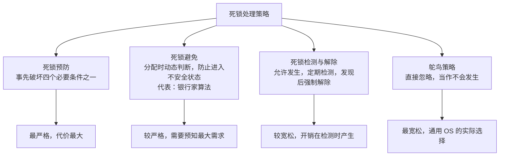
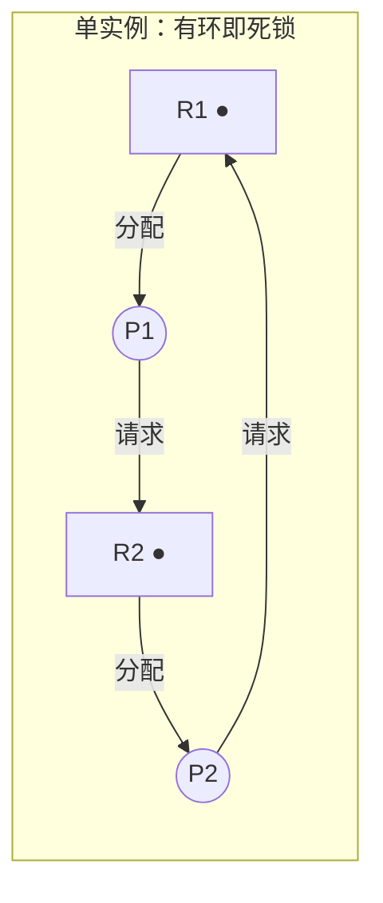
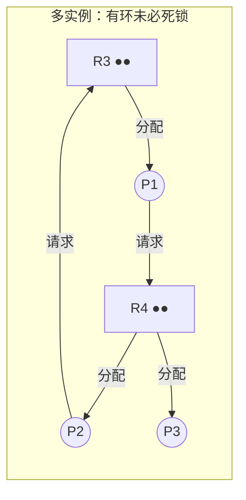

# 第 5 章：死锁

> 死锁是 408 操作系统的高频考点，重要度 ⭐⭐⭐⭐，几乎每年必有：选择题考四个必要条件、死锁与饥饿的辨析、最小资源数计算；综合题则偏爱**银行家算法**的完整推演。本章计算量不大但套路极强——银行家算法只要亲手算过两三遍就是送分题。学完[第 4 章（进程同步）](04-sync-mutex.md)的 PV 操作后，本章从"防止同步出问题"转向"出了问题怎么办"的视角。

---

## 5.1 死锁的概念

### 定义

**死锁（Deadlock）**：一组进程中的每个进程都在等待某个事件，而该事件只能由这组进程中的另一个进程引发，结果所有进程都永远阻塞下去。

最典型的场景：进程 P1 持有资源 R1、请求 R2；进程 P2 持有 R2、请求 R1。双方都持有对方想要的资源，又都不肯放手，于是同归于尽。

> 死锁的参与者不一定只有两个进程，n 个进程之间也能形成环形等待。死锁一旦发生，若无外力干预，相关进程将**永远**等待下去。

### 死锁 vs 饥饿 vs 活锁

这三个概念经常被放在同一道选择题里，务必分清：

| 概念 | 进程状态 | 本质 | 是否可能自行缓解 |
|------|---------|------|----------------|
| **死锁** | 阻塞（等待被其他死锁进程占有的资源） | 循环等待，谁也动不了 | 否，必须外部干预 |
| **饥饿** | 就绪或阻塞，长期得不到资源 | 调度/分配策略不公平，总被别人插队 | 可能，其他进程结束后轮到它 |
| **活锁** | 不断运行、不断改变状态 | 进程互相礼让/重试，做了无用功，毫无进展 | 可能（引入随机退避后） |

> 辨析要点：**死锁是"都不动"，活锁是"都在动但白动"，饥饿是"别人一直动、轮不到我"**。饥饿的进程并未持有别人等待的资源，它只是分不到资源；死锁的进程一定在等待组内某个进程持有的资源。哲学家进餐问题中"所有人同时拿起左筷子等右筷子"是死锁，"反复拿起又放下"则是活锁。

---

## 5.2 产生死锁的四个必要条件

死锁的发生必须**同时满足**以下四个条件，缺一不可：

| 条件 | 含义 | 通俗解释 |
|------|------|---------|
| **互斥**（Mutual Exclusion） | 资源在某时刻只能被一个进程占用 | 这把锁同一时刻只能一个人拿 |
| **请求与保持**（Hold and Wait） | 进程持有至少一个资源，又去申请新资源，且不释放已占有的 | 占着手里的，还惦记着别人的 |
| **不可剥夺**（No Preemption） | 进程已获得的资源只能由自己主动释放，系统不能强抢 | 别人不能把你手里的东西硬夺走 |
| **循环等待**（Circular Wait） | 存在进程-资源的环形等待链 | 你等我、我等TA、TA等你 |

> **考试金句**：四个必要条件**缺一不可**，但只要**破坏其中任意一个**，死锁就不可能发生。死锁预防的全部方法，本质都是在破坏这四个条件之一。
>
> 注意"循环等待"与"请求与保持"的区别：请求与保持只要求某个进程"边占边要"，循环等待则要求等待关系首尾相接成环。前者是后者的必要铺垫。

---

## 5.3 死锁处理策略总览

操作系统对付死锁有四种思路，从严格到宽松依次为：

| 策略 | 时机 | 核心思想 | 代价 |
|------|------|---------|------|
| 预防 | 设计时 | 破坏四个必要条件之一 | 资源利用率低、限制进程行为 |
| 避免 | 每次分配前 | 判断分配后是否仍处于安全状态 | 必须预先知道每个进程的最大需求 |
| 检测与解除 | 运行中/事后 | 允许死锁发生，检测出后剥夺资源 | 检测开销 + 解除造成的损失 |
| 忽略（鸵鸟） | —— | 概率极低，不值得付出代价 | 偶发死锁只能靠重启 |

> Linux、Windows 等通用操作系统实际采用的就是**鸵鸟策略**——死锁概率低，而预防和避免的代价太高。但考试考的是前三种策略的原理与计算。

### 5.3.1 死锁预防：破坏四个必要条件

| 破坏的条件 | 破坏方法 | 代价/局限 |
|-----------|---------|----------|
| 互斥 | 把独占设备改造成共享设备，如用 **SPOOLing 技术**将打印机共享化 | 并非所有资源都能共享（如写操作、磁带机），适用范围有限 |
| 请求与保持 | **一次性申请全部资源**（静态预分配）：进程运行前一次申请所需全部资源，全满足才运行 | 资源利用率低；进程可能长时间无法凑齐资源而**饥饿**；很多场景无法预知全部需求 |
| 不可剥夺 | 进程申请新资源得不到时，**主动释放**已占有的资源（回退后重新申请） | 实现复杂、开销大；只适用于状态易保存/恢复的资源（CPU、内存），不适用于 I/O 设备 |
| 循环等待 | **资源有序分配**：给资源编号，进程只能按编号递增顺序申请 | 编号顺序未必符合实际使用顺序，造成资源浪费；限制了编程灵活性 |

> 易错点：**破坏互斥**常考 SPOOLing 这个例子——它把独占的打印机变成共享设备，使打印机类资源不再互斥使用。而"破坏请求与保持"对应的就是静态分配，选择题常把两者混在一起让你判断破坏了哪个条件。

### 5.3.2 死锁避免：安全状态

死锁避免不限制进程的行为方式，而是在**每次真正分配资源之前**先做一次判断：这次分配会不会把系统带入危险境地？

**安全状态**：存在一个进程执行序列 $\langle P_{i_1}, P_{i_2}, \dots, P_{i_n} \rangle$ ，使得按此顺序每个进程都能顺利获得所需全部资源并执行完毕，则称系统处于安全状态，该序列称为**安全序列**。

- 安全状态 $\Rightarrow$ 一定不发生死锁
- 不安全状态 $\nRightarrow$ 一定死锁，只是**可能**死锁（如果进程恰好以某种顺序推进，仍可能相安无事）

> 易错点：**不安全状态 ≠ 死锁状态**。死锁一定是不安全状态，但不安全状态只是"存在通往死锁的可能路径"。银行家算法的职责就是让系统**始终停留在安全状态**，从而保证死锁永远不会发生。另外，**安全序列不唯一**，题目问"是否存在安全序列"时只要找到一条即可。

---

## 5.4 银行家算法（本章核心计算）

银行家算法（Banker's Algorithm）由 Dijkstra 提出：把操作系统比作银行家，资源比作现金——银行家绝不会把现金全放出去，总要留一手保证所有客户最终都能还清贷款。对应到 OS：**每次分配前先试探，确认分配后系统仍安全才真正分配**。

### 数据结构

设系统有 $n$ 个进程、 $m$ 类资源：

| 符号 | 类型 | 含义 |
|------|------|------|
| $Available$ | $1 \times m$ 向量 | 每类资源的**可用**数量 |
| $Max_i$ | $1 \times m$ 向量 | 进程 $i$ 对每类资源的**最大**需求 |
| $Allocation_i$ | $1 \times m$ 向量 | 进程 $i$ **已分到**的每类资源数 |
| $Need_i$ | $1 \times m$ 向量 | 进程 $i$ **还需要**的资源数， $Need_i = Max_i - Allocation_i$ |

> 易错点： $Available$ 、 $Need$ 等都是**向量**，比较时逐分量进行。" $Need_i \le Work$ "的意思是**每一类资源**的需求都不超过 Work 对应分量，不是总和比较。

### 安全性算法

1. 令 $Work = Available$ ， $Finish_i = false$ （对所有进程 $i$ ）
2. 找一个满足 $Finish_i = false$ 且 $Need_i \le Work$ 的进程 $i$ ；若找不到，转第 4 步
3. 假定把资源分配给 $i$ ，它执行完后归还全部资源： $Work = Work + Allocation_i$ ， $Finish_i = true$ ，转第 2 步
4. 若所有 $Finish_i = true$ ，系统处于安全状态；否则为不安全状态

> 第 2 步找到的进程**顺序可以任意**，不同的选择得到不同的安全序列，只要最后所有进程都能 Finish，系统就是安全的。

### 银行家算法请求流程

进程 $i$ 发出请求向量 $Request_i$ 时：

1. 若 $Request_i \le Need_i$ ，转第 2 步；否则报错（申请量超过宣布的最大需求）
2. 若 $Request_i \le Available$ ，转第 3 步；否则进程等待（系统目前没有足够资源）
3. **试探性分配**：
   - $Available = Available - Request_i$
   - $Allocation_i = Allocation_i + Request_i$
   - $Need_i = Need_i - Request_i$
4. 执行**安全性算法**。若安全，试探分配转为正式分配；若**不安全，必须回滚**第 3 步的修改（恢复 Available、Allocation、Need），进程 $i$ 等待。

> 易错点：第 3 步是**试探**，不是正式分配。安全性检查失败后必须**恢复现场**，很多同学算出不安全就忘了回滚这一步——答题时写出"恢复数据并让进程等待"才能拿全分。

### 完整例题：安全性判断与请求处理

**系统状态**：4 个进程、3 类资源，A、B、C 总量分别为 6、3、4：

| 进程 | Max (A,B,C) | Allocation (A,B,C) | Need (A,B,C) |
|------|-------------|--------------------|--------------|
| P0 | (3, 1, 2) | (1, 0, 2) | (2, 1, 0) |
| P1 | (4, 2, 1) | (1, 1, 0) | (3, 1, 1) |
| P2 | (3, 0, 2) | (2, 0, 1) | (1, 0, 1) |
| P3 | (2, 2, 1) | (0, 1, 0) | (2, 1, 1) |

已分配总量为 $(1+1+2+0,\ 0+1+0+1,\ 2+0+1+0) = (4, 2, 3)$ ，故 $Available = (6,3,4) - (4,2,3) = (2, 1, 1)$ 。

**第一步：判断当前是否安全**。执行安全性算法（ $Work$ 初始为 $(2,1,1)$ ）：

| 步骤 | Work | 选中进程（Need ≤ Work） | Allocation | Work + Allocation |
|------|------|------------------------|------------|-------------------|
| 1 | (2, 1, 1) | P2（Need=(1,0,1) ≤ (2,1,1)） | (2, 0, 1) | (4, 1, 2) |
| 2 | (4, 1, 2) | P0（Need=(2,1,0) ≤ (4,1,2)） | (1, 0, 2) | (5, 1, 4) |
| 3 | (5, 1, 4) | P1（Need=(3,1,1) ≤ (5,1,4)） | (1, 1, 0) | (6, 2, 4) |
| 4 | (6, 2, 4) | P3（Need=(2,1,1) ≤ (6,2,4)） | (0, 1, 0) | (6, 3, 4) |

全部进程 Finish，最终 $Work = (6,3,4)$ 恰好等于资源总量（验算无误），系统**处于安全状态**， $\langle P2, P0, P1, P3 \rangle$ 是一个安全序列。注意序列不唯一：第一步也可以先选 P0。

**第二步：处理请求**。先看一个会被直接拒绝的请求： $Request_{P2} = (1, 0, 2)$ 。第 1 条检查即失败——第三分量 $2 > Need_{P2}$ 的第三分量 $1$ ，报错"申请量超过宣布的最大需求"，不进入后续流程。

再处理合法请求 $Request_{P2} = (1, 0, 0)$ ：

1. $Request \le Need_{P2} = (1,0,1)$ ✓； $Request \le Available = (2,1,1)$ ✓
2. 试探分配后： $Available = (1, 1, 1)$ ，P2 的 Allocation 变为 $(3,0,1)$ ，Need 变为 $(0,0,1)$
3. 安全性检查（ $Work = (1,1,1)$ ）：P2 的 $Need = (0,0,1) \le Work$ → 完成后 $Work = (1,1,1)+(3,0,1) = (4,1,2)$ ；随后 P0 → $(5,1,4)$ 、P1 → $(6,2,4)$ 、P3 → $(6,3,4)$ ，全部 Finish
4. 试探后仍安全 → **正式分配**，请求被满足

再看请求 $Request_{P1} = (2, 1, 1)$ ：

1. $Request \le Need_{P1} = (3,1,1)$ ✓； $Request \le Available = (2,1,1)$ ✓
2. 试探分配后： $Available = (0, 0, 0)$ ，P1 的 Allocation 变为 $(3,2,1)$ ，Need 变为 $(1,0,0)$
3. 安全性检查（ $Work = (0,0,0)$ ）：P0 需 A=2 不满足、P1 需 A=1 不满足、P2 需 A、C 不满足、P3 需 A、B、C 不满足——**没有任何进程能继续**，不安全
4. **回滚**：恢复 $Available = (2,1,1)$ 及 P1 的 Allocation、Need，P1 等待

> 这道题浓缩了银行家算法的全部考点：先算 Need、再验 Available、试探分配、安全推演、失败回滚。考试综合题按这个流程一步步写表即可。

---

## 5.5 死锁检测与解除

预防和避免都"防患于未然"，检测与解除策略则**允许死锁发生**，再通过检测算法定位死锁、强制解除。检测工具是**资源分配图**。

### 资源分配图

资源分配图是有向图：

- **方框**表示资源类，框内小圆点个数 = 该类资源的实例数
- **圆圈**表示进程
- **资源 → 进程**的边：分配边（进程持有该资源）
- **进程 → 资源**的边：请求边（进程正在申请该资源）

### 死锁定理与化简法

**死锁定理**：

- 图中**无环** → **一定无死锁**
- 图中**有环** → **可能有死锁**（每类资源只有 1 个实例时，有环 ⟺ 死锁）
- 一般判据：系统处于死锁状态 **⟺ 资源分配图不可完全化简**

**化简（死锁检测）过程**：

1. 在图中找一个**不阻塞**的进程：它的所有请求边都能被当前空闲资源满足
2. 假定它运行完毕，释放其全部资源：删去该进程的所有边，把资源点"归还"为空闲
3. 重复 1-2，直到找不到这样的进程
4. 若所有边都被删除（图被完全化简）→ 无死锁；若剩下无法化简的环 → 环上的进程处于**死锁**

> 以上面第二张图为例：R3、R4 各有 2 个实例。P1 持有 1 个 R3、请求 R4；P2 持有 1 个 R4、请求 R3；P3 持有另 1 个 R4 且**没有请求**。虽然 P1→R4→P2→R3→P1 构成环，但 P3 不是阻塞进程，它运行完释放 R4 后，P1 的请求即可被满足，随后 P2 也能满足——图可完全化简，**有环但无死锁**。这正是"有环不一定死锁"的经典场景。

### 解除方法

检测到死锁后，常用的解除手段（按破坏性从小到大）：

| 方法 | 做法 | 代价 |
|------|------|------|
| **资源剥夺** | 从某些进程强行夺取资源给死锁进程，通常配合**回滚**到检查点再重试 | 被剥夺进程前功尽弃，可能反复回滚 |
| **撤销进程** | 逐个撤销死锁进程（常按优先级/已运行时间选择），直到环解除 | 撤销进程的全部工作丢失 |
| **进程回退** | 让进程主动回退到之前的安全检查点，释放资源重新执行 | 需要系统定期保存检查点，开销大 |

> 选择牺牲品时通常考虑：优先级低、已执行时间短、已产生结果少、持有资源少、属于交互进程的代价更大等。

---

## 5.6 鸵鸟策略

**鸵鸟策略**（Ostrich Algorithm）：像鸵鸟把头埋进沙子一样，**假装死锁不会发生**，不做任何预防、避免和检测。

- 理由：死锁发生概率极低，而预防/避免机制的**常态开销**却时时刻刻存在，得不偿失
- 现实：Linux、Windows、macOS 等通用操作系统均采用此策略；真出了死锁，用户重启即可
- 代价：实时系统、高可靠系统**不能**采用（如航天、医疗设备必须用预防/避免/检测）

---

## 5.7 三类策略对比

| 对比项 | 死锁预防 | 死锁避免（银行家算法） | 死锁检测与解除 |
|--------|---------|---------------------|---------------|
| 时机 | 系统设计时 | 每次资源分配前 | 死锁发生后 |
| 手段 | 破坏四个必要条件之一 | 判断分配后是否安全，不安全则拒绝 | 资源分配图化简检测；剥夺/撤销/回退解除 |
| 需要的先验信息 | 无 | 每个进程的**最大资源需求** | 当前的分配与请求情况 |
| 开销 | 资源利用率低、限制并发 | 每次分配都要跑安全性算法 | 检测算法周期性开销 + 解除损失 |
| 保守程度 | 最保守 | 较保守 | 最宽松（死锁真正发生过） |
| 适用场景 | 专用系统、需求可预知 | 进程数/资源数少、需求可声明 | 允许偶发死锁的一般系统 |

> 严格程度排序：**预防 > 避免 > 检测与解除 > 忽略**。越靠左约束越强、资源利用率越低；越靠右越接近实际通用 OS 的做法。

---

## 5.8 典型例题

**例 1**（银行家算法）：系统有 A、B、C 三类资源共 (6, 3, 4)，四个进程状态如下表。

| 进程 | Max | Allocation | Need |
|------|-----|------------|------|
| P0 | (3,1,2) | (1,0,2) | (2,1,0) |
| P1 | (4,2,1) | (1,1,0) | (3,1,1) |
| P2 | (3,0,2) | (2,0,1) | (1,0,1) |
| P3 | (2,2,1) | (0,1,0) | (2,1,1) |

（1）判断系统是否处于安全状态，若是给出一个安全序列；（2）若 P2 请求 $Request = (1,0,0)$ ，能否立即分配？

**解**：

（1） $Available = (6,3,4) - (4,2,3) = (2,1,1)$ 。安全性推演：

| Work | Need | Allocation | Work + Allocation |
|------|------|------------|-------------------|
| (2,1,1) | P2: (1,0,1) | (2,0,1) | (4,1,2) |
| (4,1,2) | P0: (2,1,0) | (1,0,2) | (5,1,4) |
| (5,1,4) | P1: (3,1,1) | (1,1,0) | (6,2,4) |
| (6,2,4) | P3: (2,1,1) | (0,1,0) | (6,3,4) |

所有进程均可完成，系统安全，安全序列 $\langle P2, P0, P1, P3 \rangle$ （不唯一， $\langle P0, P2, P1, P3 \rangle$ 也对）。

（2） $Request = (1,0,0) \le Need_{P2} = (1,0,1)$ 且 $\le Available = (2,1,1)$ ，试探分配： $Available = (1,1,1)$ ，P2 的 Need 变为 $(0,0,1)$ 。推演：P2 先完成 → $Work = (4,1,2)$ → P0 → $(5,1,4)$ → P1 → $(6,2,4)$ → P3 → $(6,3,4)$ ，仍安全，**可以立即分配**。

**例 2**（资源分配图）：系统有 R1、R2 两类资源各 2 个实例。P1 持有 1 个 R1、请求 1 个 R2；P2 持有 1 个 R2、请求 1 个 R1；P3 持有 1 个 R2、无请求。问系统是否死锁？

**解**：此时空闲资源为 R1 ×1、R2 ×0。图中存在环 P1 → R2 → P2 → R1 → P1，但**不能直接下结论**。用化简法：P3 无请求，可先行完成并释放 1 个 R2 → R2 空闲 1 个，可满足 P1 的请求 → P1 完成并释放 R1 → 可满足 P2 的请求 → P2 完成。图被**完全化简**，故**无死锁**。若题目改为"R2 只有 1 个实例且被 P2 持有"，则环不可化简，即为死锁。

**例 3**（最小资源数）：系统有同类资源 R 若干， $m$ 个进程各自最多需要 $n$ 个 R。问至少需要多少个 R 才能保证不发生死锁？

**解**：最坏情况下，每个进程都持有 $n-1$ 个 R 并等待最后 1 个，此时共占用 $m(n-1)$ 个资源且形成死锁。只要再多 1 个资源，就至少有一个进程能凑齐 $n$ 个并运行完毕、归还资源，连锁解开所有进程。故最少需要

$$
m(n-1) + 1
$$

例如 3 个进程各需 3 台磁带机，至少需要 $3 \times (3-1) + 1 = 7$ 台才保证不死锁；只有 6 台时，每个进程各占 2 台互等第 3 台，即死锁。

> 该公式是选择题高频考点，推导逻辑（最坏情况各差 1 个）比公式本身更重要——题目常换个说法问"最多几个进程不会死锁"，反向套用即可。

### 常见陷阱清单

1. **四个必要条件缺一不可，但破坏任意一个即可预防死锁**——选择题常问"以下哪种做法不能预防死锁"，注意"减少资源总量""增加进程数"之类的干扰项
2. **银行家算法试探分配后要回滚**：安全性检查失败必须恢复 Available、Allocation、Need，让进程等待，而不是直接把资源分出去
3. **Available、Need 都是向量**，比较必须逐分量进行，" $Need \le Work$ "不是比较分量总和
4. **资源分配图有环不一定死锁**：每类资源有多个实例时环可能可化简；但"无环一定无死锁""死锁一定有环"永远成立；每类资源只有 1 个实例时，有环 ⟺ 死锁
5. **安全序列不唯一，不安全状态 ≠ 已死锁**：不安全只是"存在导致死锁的推进方式"，找到任意一条安全序列即可证明系统安全
6. **饥饿与死锁混淆**：被"一次性申请全部资源"策略卡住的进程是饥饿不是死锁，它没有持有别人等待的资源

---

## 本章小结

### 核心要点回顾

1. **死锁四必要条件**：互斥、请求与保持、不可剥夺、循环等待——缺一不可，破坏其一即可预防
2. **预防手段对应关系**：SPOOLing 破坏互斥；一次性全部分配破坏请求与保持；申请不到就释放破坏不可剥夺；资源有序编号破坏循环等待
3. **银行家算法**： $Need = Max - Allocation$ ；请求时先查 $Request \le Need$ 与 $Request \le Available$ ，试探分配后跑安全性算法（ $Work = Available$ ，循环找 $Need \le Work$ 的进程并回收），不安全则回滚
4. **安全状态必不死锁**；不安全状态未必死锁；安全序列不唯一
5. **死锁定理**：无环必无死锁；单实例资源有环即死锁；一般用化简法判定（不可完全化简 ⟺ 死锁）
6. **最小资源数公式**： $m$ 个进程各需 $n$ 个同类资源，至少 $m(n-1)+1$ 个才保证不死锁
7. 解除方法：剥夺、撤销、回退；通用 OS 实际采用鸵鸟策略

### 考试重点排序

| 优先级 | 考点 | 题型 |
|--------|------|------|
| ⭐⭐⭐ | 银行家算法完整推演（安全序列 + 请求处理） | 综合应用题 |
| ⭐⭐⭐ | 四个必要条件及破坏方法 | 选择题 |
| ⭐⭐⭐ | 最小资源数 $m(n-1)+1$ | 选择题 |
| ⭐⭐ | 资源分配图化简、死锁定理 | 选择题/综合题 |
| ⭐⭐ | 死锁 vs 饥饿 vs 活锁、安全/不安全状态辨析 | 选择题 |
| ⭐ | 鸵鸟策略、解除方法 | 选择题 |

> 复习策略：银行家算法务必亲手完整算两遍以上（含试探-回滚流程），直到能不看书推演；四个必要条件和最小资源数公式属于背了就能拿分的内容。死锁与[第 4 章（进程同步）](04-sync-mutex.md)的哲学家进餐问题常联动考察（"如何修改方案避免死锁"），复习时放在一起。内存分配中的连续分配也可能涉及资源等待问题，可结合[第 6 章（内存管理基础）](06-memory-foundation.md)理解。

---

## 自测题

1. 产生死锁的四个必要条件是什么？"资源有序分配法"破坏的是哪一个条件？
2. 系统处于不安全状态是否意味着已经死锁？为什么银行家算法在试探分配后必须做安全性检查？
3. 某系统有同类资源 11 个，每个进程最多需要 3 个，最多允许几个进程并发运行而保证不死锁？
4. 资源分配图中出现环路是否一定发生死锁？在什么条件下"有环"等价于"死锁"？
5. 简述死锁与饥饿的区别。

> **答案**：1. 互斥、请求与保持、不可剥夺、循环等待；资源有序分配（按编号递增申请）破坏的是**循环等待**条件。2. 不是。不安全状态只是存在某种推进顺序会导致死锁，若进程实际推进顺序"运气好"仍可全部完成；银行家算法试探分配后做安全性检查，是为了确保正式分配后系统仍处于安全状态，若不安全则回滚并拒绝请求，从而把系统始终约束在安全状态内。3. 设最多 $m$ 个进程，由 $m(3-1)+1 \le 11$ 得 $m \le 5$ ，即最多 5 个进程（最坏情况每个进程各持有 2 个，共 10 个，剩余 1 个可让任一进程凑齐 3 个完成）。4. 不一定。每类资源有多个实例时，环可能被化简（环外进程释放资源后可解环）；当**每类资源都只有 1 个实例**时，有环 ⟺ 死锁。5. 死锁是多个进程互相等待对方持有的资源，全部永久阻塞，且每个进程都持有别人等待的资源；饥饿是某个进程因调度/分配策略不公平长期分不到资源，但它并未持有别人等待的资源，其他进程结束后它仍可能获得资源。
