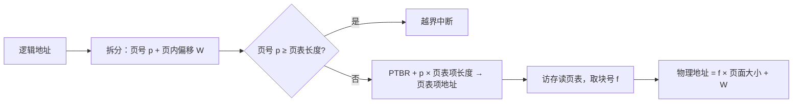

# 第 6 章：内存管理基础

> 内存管理是 408 操作系统的两大核心之一（另一个是进程管理），重要度 ⭐⭐⭐⭐⭐。本章的**分页地址变换**和 **TLB/Cache 有效访问时间计算**几乎每年必考——选择题常考概念辨析，综合题常考地址变换与 EAT 计算。学完死锁（[第 5 章（死锁）](05-deadlock.md)）后，从本章开始进入内存管理：先建立"逻辑地址 → 物理地址"的基本观念，掌握连续分配、分页、分段三种管理方式，为[第 7 章（虚拟内存管理）](07-virtual-memory.md)的请求分页打基础。本章与计组存储系统高度联动，计算题建议动手算一遍。

---

## 6.1 内存管理的基本概念

### 逻辑地址与物理地址

| 概念 | 别名 | 含义 |
|------|------|------|
| **逻辑地址** | 相对地址 | 编译后目标程序中相对于起始地址的地址，用户程序看到的地址 |
| **物理地址** | 绝对地址 | 内存单元的实际地址，内存硬件真正使用的地址 |

- **逻辑地址空间**：一个目标程序的所有逻辑地址组成的集合
- **物理地址空间**：内存中所有物理地址组成的集合

程序在内存中运行时，CPU 产生的每一条指令中的地址都是逻辑地址，必须经过**地址变换机构**转换为物理地址才能真正访存。

> 易错点：逻辑地址从 0 开始编号，物理地址从内存的实际位置开始。两者数值一般不相等（绝对装入的古老方式除外）。

### 为什么需要地址变换

程序装入内存时，无法预知会被放到哪个位置。若把逻辑地址"绑定"到某个固定物理地址，一旦该区域被占用程序就无法运行。因此需要一种机制：**装入时或运行时**再把逻辑地址转换为实际物理地址，这就引出了三种装入方式。

---

## 6.2 程序的装入与链接

### 三种装入方式

| 装入方式 | 地址转换时机 | 特点 |
|---------|------------|------|
| **绝对装入** | 编译时 | 编译时就确定物理地址，程序只能装入指定位置。仅适用于单道程序环境，现已不用 |
| **可重定位装入**（静态重定位） | 装入时 | 装入内存时一次性完成地址转换，之后不再改变。需要**重定位寄存器**支持 |
| **动态运行时装入**（动态重定位） | 运行时 | 每次访存前才做地址转换，由**重定位寄存器**（基址寄存器）硬件完成 |

动态运行时装入的硬件支持：

- **基址寄存器**（重定位寄存器）：存放程序在内存中的起始物理地址
- **变址寄存器**：存放相对偏移量（逻辑地址）
- 物理地址 $=$ 基址寄存器 $+$ 变址寄存器（逻辑地址），每次访存自动完成

> 动态重定位的优点：程序可以在内存中移动（只要移动后更新基址寄存器即可），这是**紧凑（compaction）** 技术的前提。静态重定位一旦装入就不能移动。

### 三种链接方式

| 链接方式 | 时机 | 特点 |
|---------|------|------|
| **静态链接** | 运行前 | 所有目标模块一次性链接成完整可执行程序，之后不再拆开 |
| **装入时动态链接** | 装入时 | 装入过程中边装入边链接，便于模块共享和修改 |
| **运行时动态链接** | 运行时 | 执行到某模块时才链接（如动态库 .so / .dll），最灵活，节省内存 |

> 408 选择题常考对应关系：动态运行时装入 ↔ 动态重定位 ↔ 基址寄存器；运行时动态链接 ↔ 动态库。别把"装入"和"链接"两个阶段混淆。

---

## 6.3 内存保护与内存共享

### 内存保护的目的

保证每道程序只在**自己的地址空间**内运行，防止越界访问其他程序或操作系统。

### 上下界寄存器保护

使用一对寄存器划定进程可访问的地址范围：

- **基址寄存器**（下界）：进程在内存中的起始物理地址
- **界限寄存器**（限长寄存器）：进程地址空间的长度

每次访存前硬件检查：

$$
\text{基址寄存器} \le \text{物理地址} < \text{基址寄存器} + \text{界限寄存器}
$$

越界则触发**越界中断**（地址越界异常）。

> 另一种等价方案是"基址寄存器 + 上界寄存器"（直接记录结束地址）。408 中更常见的是基址 + 限长的组合，注意区分"界限"是长度还是结束地址。

### 页表保护位

分页系统中，页表项中设置**保护位**（读/写/执行权限位），地址变换机构在访问页面时检查权限，实现页级保护。此外，**页表本身的范围检查**（页号 $\ge$ 页表长度即越界）也构成保护。

### 可重入代码（纯代码）的共享

多个进程共享同一段代码（如编辑器、编译器的代码段）可节省内存，但共享必须满足两个条件：

1. **代码是不可修改的**（纯代码）：运行过程中代码本身不发生改变，只读
2. **所有进程共享同一份代码**：每个进程各自拥有独立的**数据区**（局部变量、工作单元）

> 经典考点："可重入代码为什么能共享"——因为代码不修改，多个进程同时执行也不会互相干扰；而每个进程的可变数据（栈、数据段）仍然私有。共享代码段通常放在内存的**共享库/共享代码区**，各进程的页表都指向同一组物理块。

---

## 6.4 连续分配管理方式

连续分配指为一个进程分配**连续的内存区域**，是最早的内存管理方式。

### 单一连续分配

- 内存分为**系统区**（低地址）和**用户区**，用户程序独占整个用户区
- 适用于**单用户单任务**系统（如早期 DOS），无需内存保护（或仅用界限寄存器简单保护）
- 无碎片问题，但内存利用率极低

### 固定分区分配

内存被预先划分为若干**固定大小**的分区，每个分区装入一道作业：

| 形式 | 特点 |
|------|------|
| 分区大小相等 | 实现简单，但小作业浪费严重 |
| 分区大小不等 | 灵活一些，仍缺乏弹性 |

用**分区表**记录每个分区的起始地址、大小和状态（已分配/空闲）。

> 固定分区产生**内部碎片**：分区内部未被利用的空间。因为作业大小通常不等于分区大小，剩余部分浪费在分区"内部"。

### 动态分区分配（可变分区）

分区在进程装入时**动态创建**，大小恰好等于进程需求，装入时内存中没有内部碎片。

**数据结构**：空闲分区表（起始地址、大小）或空闲分区链（按地址链接）。

**四种分配算法**（408 必考对比）：

| 算法 | 空闲区排序方式 | 思想 | 优点 | 缺点 |
|------|--------------|------|------|------|
| **首次适应 FF** | 按起始地址递增 | 从低地址开始找第一个满足的分区 | 简单高效；高地址端大分区得以保留 | 低地址端被反复切分，留下许多小碎片 |
| **最佳适应 BF** | 按容量递增 | 选能满足要求的最小分区 | 每次留下的碎片最小 | 大分区不断被切分，产生大量难以利用的小碎片 |
| **最坏适应 WF** | 按容量递减 | 选最大的分区切分 | 切分后剩余部分仍较大，小碎片少 | 大分区消耗最快，后续大作业无法分配 |
| **邻近适应 NF** | 环形结构，记录上次位置 | 从上次分配位置开始循环查找 | 分布均匀，避免每次都从头切分 | 高地址端的大分区也容易被切碎 |

**回收与合并**：进程释放内存时，若回收区与上邻/下邻空闲区相邻，应**合并**成更大的空闲区，减少碎片。

**外部碎片与紧凑**：

- **外部碎片**：动态分区分配产生的、分区之间零散的太小而无法利用的空闲空间
- **紧凑（compaction）**：移动所有已分配区到内存一端，把碎片合并成一个大空闲区
- 紧凑的代价：需要移动大量数据并**重定位**所有程序，只有采用**动态重定位**（基址寄存器）的系统才可行——静态重定位的程序移动后地址就失效了

> 高频辨析：**固定分区 → 内部碎片；动态分区 → 外部碎片**。分页产生内部碎片（最后一页装不满），分段产生外部碎片（按段分配连续空间）。

---

## 6.5 基本分页存储管理

### 页与块

- **页（页面）**：把进程的逻辑地址空间划分成**大小相等**的块
- **块（页框）**：把内存物理空间划分成与页同样大小的存储单位
- **页大小通常为 2 的幂**（如 1 KB、4 KB），这样页内偏移直接取逻辑地址的低位即可，硬件实现简单

> 页是**物理单位**（系统管理的需要），段是**逻辑单位**（用户编程的需要）——这是分页与分段最本质的区别。

### 页表

页表记录每个页面对应的内存块号，实现**页号 → 块号**的映射：

| 页号 | 块号 | 保护位/状态位等 |
|------|------|----------------|
| 0 | 2 | R/W/X |
| 1 | 5 | R/W/X |
| … | … | … |

- 页号是隐含的（页表按页号顺序存放），页表项中只需存块号和各种标志位
- **页表基址寄存器（PTBR）**：存放当前进程页表在内存中的起始地址，进程切换时随 PCB 一起切换

### 地址变换

逻辑地址结构：**页号 $p$ + 页内偏移 $W$**

$$
p = \lfloor \text{逻辑地址} / \text{页面大小} \rfloor, \quad W = \text{逻辑地址} \bmod \text{页面大小}
$$

$$
\text{物理地址} = \text{块号} f \times \text{页面大小} + W
$$

> 一次访存取数据前，必须先访存取页表项——所以没有快表时，**每次访存至少需要 2 次内存访问**。这是引入 TLB 的动机。

### 二级页表

**为什么需要**：32 位逻辑地址、页面大小 4 KB 时，页表有 $2^{20}$ 项，每项 4 B，单级页表达 4 MB，且要求**连续存放**——大进程的页表很难找到连续空间。解决办法：把页表也分页，离散存放在内存中，再为这些"页表的页"建立一张索引表（**页目录表 / 外层页表**）。

二级页表的逻辑地址结构：**页目录号（外层页号） + 页号 + 页内偏移**

| 字段 | 位数（示例：32 位地址、4 KB 页、4 B 页表项） |
|------|-------------------------------------------|
| 页目录号 | 10 位（ $2^{10} = 1024$ 项） |
| 页号 | 10 位（每张二级页表 1024 项，恰好占满 1 页） |
| 页内偏移 | 12 位，即 $2^{12} = 4\text{ KB}$ |

**时间开销**：无快表时访问一个数据需要 **3 次访存**（页目录 → 二级页表 → 目标单元），比单级页表多 1 次。

**多级推广**： $n$ 级页表的逻辑地址分为 $n$ 段页号 + 1 段页内偏移，无快表时需要 $n+1$ 次访存。每级页表必须能在 1 页内容纳，因此每级能索引的页号位数 $= \log_2(\text{页面大小} / \text{页表项大小})$ 。

> 二级页表解决的是页表**连续存放**和**过大**的问题，并不能减少访存次数（反而增加）。真正加速地址变换的是 TLB。

---

## 6.6 快表（TLB）

### TLB 是什么

**TLB（Translation Lookaside Buffer，快表）** 是位于 CPU 内的高速缓存，保存**最近使用的部分页表项**（页号 → 块号的映射副本），用相联存储器按内容并行查找。

### 命中与缺失流程

1. CPU 产生逻辑地址，拆出页号 $p$ 和偏移 $W$
2. 查 TLB：
   - **命中**：直接得到块号 $f$ ，拼接物理地址（省去一次访存）
   - **缺失**：访问内存中的页表取出页表项，得到块号；然后**把该页表项写入 TLB**（TLB 满则按替换算法换出一项）
3. 物理地址 $= f \times$ 页面大小 $+ W$

### 有效访问时间（EAT）计算——核心考点

设 TLB 访问时间为 $t_{TLB}$ ，内存访问时间为 $t_{mem}$ ，TLB 命中率为 $\lambda$ 。分两种硬件假设：

**① TLB 与内存串行查找**（先查 TLB，未命中再访存取页表）：

$$
EAT = \lambda \times (t_{TLB} + t_{mem}) + (1-\lambda) \times (t_{TLB} + 2 t_{mem})
$$

TLB 命中：查 TLB（ $t_{TLB}$ ）+ 访问目标单元（ $t_{mem}$ ）；TLB 缺失：查 TLB + 访存取页表项 + 访问目标单元。

**② TLB 与内存并行查找**（TLB 和内存页表同时查）：

$$
EAT = \lambda \times \max(t_{TLB}, t_{mem}) + (1-\lambda) \times (\max(t_{TLB}, t_{mem}) + t_{mem})
$$

通常 $t_{TLB} < t_{mem}$ ，命中时页表访问与 TLB 查询重叠，只需 $t_{mem}$ ；缺失时页表项已取到，再加一次访存取目标。

> 做题第一步永远是**判断串行还是并行**：题目说"TLB 查找时间为 x，内存访问时间为 y"且未说明并行，默认串行；明确说"TLB 与内存同时访问"才用并行公式。

### TLB 与 Cache 联动（与计组综合）

引入 Cache 后，取目标数据时先查 Cache、未命中才访存（详见 [计组第 3 章（存储系统）](../../computer-organization/doc/03-memory-system.md)）。设 Cache 命中率为 $b$ ，Cache 访问时间为 $t_C$ ，访存时间为 $t_M$ ，TLB 命中率为 $\lambda$ ，TLB 时间为 $t_{TLB}$ ，串行模型下：

$$
EAT = \lambda \big[ b(t_{TLB}+t_C) + (1-b)(t_{TLB}+t_C+t_M) \big] + (1-\lambda)\big[ t_{TLB}+t_M + b\,t_C + (1-b)(t_C+t_M) \big]
$$

其中 $(1-\lambda)$ 分支里多出的 $t_M$ 是 **TLB 缺失时访存取页表项**的开销（一般假设这次访问不经过 Cache 或必然未命中）。

> 关键原则：**Cache 缺失才访存；TLB 缺失要额外访存取页表项**。这两个"额外一次访存"是联动计算题最常见的丢分点。

### 局部性原理的支撑

- **空间局部性**：相邻逻辑地址通常落在同一页内，一页的页表项进入 TLB 后可服务多次访问
- **时间局部性**：循环和栈操作反复访问同一批页面

因此 TLB 命中率通常可达 **95% 以上**，地址变换速度接近纯硬件直查。

---

## 6.7 基本分段存储管理

### 段表结构

按程序的逻辑结构（主程序段、子程序段、数据段、栈段……）把地址空间划分为长度不等的**段**。段表每项包含：

| 字段 | 含义 |
|------|------|
| 段号 | 隐含（按段号顺序存放） |
| 段长 | 该段的长度，用于越界检查 |
| 基址 | 该段在内存中的起始物理地址 |

### 地址变换与越界检查

逻辑地址 $=$ 段号 $s$ $+$ 段内偏移 $W$ ：

1. $s \ge$ 段表长度 → **越界中断**（段号非法）
2. $W \ge$ 段长 → **越界中断**（段内偏移越界）
3. 物理地址 $=$ 该段基址 $+ W$

> 对比记忆：**页式越界靠页号范围**（页号 $\ge$ 页表长度），因为页长固定、最后一页可能未装满，无需检查页内偏移；**段式越界靠段长**，因为段长不固定，必须逐次比较。

### 分段 vs 分页（408 高频对比表）

| 对比项 | 分页 | 分段 |
|--------|------|------|
| 划分单位 | 物理单位，大小固定（2 的幂） | 逻辑单位，大小不等，由用户程序决定 |
| 地址空间 | 一维 | 二维（段号 + 段内地址） |
| 碎片 | 有内部碎片（最后一页） | 无内部碎片，有外部碎片 |
| 共享与保护 | 以页为单位，不易对应逻辑含义 | 以段为单位，天然便于共享代码段和保护 |
| 用户可见性 | 对用户透明 | 用户可见（编程时即分段） |
| 越界检查 | 页号范围检查 | 段长检查 |

### 段页式管理（了解）

先分段、段内再分页：段表项指向该段的**页表**，地址变换为"段号 → 段表 → 页表 → 块号"。兼得分段便于共享保护和分页无外部碎片的优点，但访存次数更多。

---

## 6.8 典型例题

**例 1**（动态分区四种算法）：某系统采用动态分区分配，当前空闲分区表如下。请求序列依次为 80 KB、130 KB、30 KB，分别用首次适应（FF）、最佳适应（BF）、最坏适应（WF）、邻近适应（NF）算法，说明每次请求分配的分区位置。

| 分区号 | 起始地址 | 大小 |
|--------|---------|------|
| 1 | 100 KB | 150 KB |
| 2 | 350 KB | 100 KB |
| 3 | 600 KB | 200 KB |

**解**：

- **FF**（按地址递增查找）：80 KB → 分区 1（100~180，余 180/70）；130 KB → 分区 1 剩余不够、分区 2 不够、分区 3（600~730，余 730/70）；30 KB → 从分区 1 剩余开始，180/70 够（180~210，余 210/40）。
- **BF**（按容量递增选最小够用者）：80 KB → 分区 2（350~430，余 430/20）；130 KB → 分区 3（600~730，余 730/70）；30 KB → 剩余空闲区中 730/70 最小够用（730~760，余 760/40）。
- **WF**（按容量递减选最大者）：80 KB → 分区 3（600~680，余 680/120）；130 KB → 分区 1（100~230，余 230/20）；30 KB → 最大空闲区 680/120（680~710，余 710/90）。
- **NF**（从上次位置环形查找）：80 KB → 分区 1（100~180，余 180/70）；130 KB → 从分区 1 剩余继续，70、100 均不够，到分区 3（600~730，余 730/70）；30 KB → 从分区 3 剩余继续，730/70 够用（730~760，余 760/40）。

| 请求 | FF | BF | WF | NF |
|------|-----|-----|-----|-----|
| 80 KB | 100~180 | 350~430 | 600~680 | 100~180 |
| 130 KB | 600~730 | 600~730 | 100~230 | 600~730 |
| 30 KB | 180~210 | 730~760 | 680~710 | 730~760 |

> 同一请求序列下四种算法结果差异明显。注意 BF 是选"最小够用"而不是"最小"，WF 是选"最大"。

**例 2**（分页地址变换）：某分页系统页面大小为 1 KB，某进程页表如下。求逻辑地址 2500 和 4100 对应的物理地址。

| 页号 | 块号 |
|------|------|
| 0 | 2 |
| 1 | 5 |
| 2 | 8 |
| 3 | 11 |

**解**：

逻辑地址 2500：

$$
p = \lfloor 2500 / 1024 \rfloor = 2, \quad W = 2500 - 2 \times 1024 = 452
$$

查页表，页 2 → 块 8，物理地址 $= 8 \times 1024 + 452 = 8644$ 。

逻辑地址 4100：

$$
p = \lfloor 4100 / 1024 \rfloor = 4
$$

页号 4 超出页表长度（共 4 页，页号 0~3），产生**越界中断**，不存在物理地址。

> 陷阱：不要想当然地认为任何逻辑地址都能转换，页号越界检查是地址变换的第一步。

**例 3**（二级页表）：某系统逻辑地址 32 位，页面大小 4 KB，页表项 4 B。若采用单级页表需要多大空间？改为二级页表后地址结构如何划分？无 TLB 时访问一个数据需要几次访存？设内存访问时间 100 ns，求地址变换加取数的总时间。

**解**：

页内偏移占 $\log_2 4096 = 12$ 位，页号占 $32 - 12 = 20$ 位，共 $2^{20}$ 个页表项。

单级页表大小 $= 2^{20} \times 4\text{ B} = 4\text{ MB}$ ，且必须连续存放，过大。

二级页表：每页可容纳 $4096 / 4 = 1024 = 2^{10}$ 个页表项，故 20 位页号划分为 **10 位页目录号 + 10 位页号**，加 12 位页内偏移。

访存次数：页目录（1 次）→ 二级页表（1 次）→ 目标单元（1 次），共 **3 次**，总时间 $= 3 \times 100 = 300\text{ ns}$ 。

**例 4**（TLB + 内存 EAT，串行/并行）：某分页系统内存访问时间 100 ns，TLB 访问时间 20 ns，TLB 命中率 90%。分别计算 TLB 与内存串行查找、并行查找两种情形下的有效访问时间（不考虑 Cache）。

**解**：

**串行**：命中 $= 20 + 100 = 120\text{ ns}$ ；缺失 $= 20 + 100 + 100 = 220\text{ ns}$ 。

$$
EAT = 0.9 \times 120 + 0.1 \times 220 = 108 + 22 = 130\text{ ns}
$$

**并行**：命中 $= \max(20, 100) = 100\text{ ns}$ ；缺失 $= 100 + 100 = 200\text{ ns}$ 。

$$
EAT = 0.9 \times 100 + 0.1 \times 200 = 90 + 20 = 110\text{ ns}
$$

> 并行查找时 TLB 缺失不需要"补查"——查 TLB 的同时页表也在访存，页表项已经取到了。

**例 5**（TLB + Cache + 内存三级联动，408 综合题风格）：某系统 TLB 访问时间 10 ns，Cache 访问时间 20 ns，内存访问时间 100 ns，TLB 命中率 90%，Cache 命中率 95%。地址变换串行进行，访存一律先查 Cache、未命中才访问内存；TLB 缺失时访存取页表项（该次访问不命中 Cache）。求有效访问时间。

**解**：按 TLB 命中/缺失 × Cache 命中/缺失分四种情形：

| 情形 | 概率 | 时间分解 | 时间 |
|------|------|---------|------|
| TLB 命中，Cache 命中 | $0.9 \times 0.95 = 0.855$ | $10 + 20$ | 30 ns |
| TLB 命中，Cache 缺失 | $0.9 \times 0.05 = 0.045$ | $10 + 20 + 100$ | 130 ns |
| TLB 缺失，Cache 命中 | $0.1 \times 0.95 = 0.095$ | $10 + 100 + 20$ | 130 ns |
| TLB 缺失，Cache 缺失 | $0.1 \times 0.05 = 0.005$ | $10 + 100 + 20 + 100$ | 230 ns |

$$
EAT = 0.855 \times 30 + 0.045 \times 130 + 0.095 \times 130 + 0.005 \times 230 = 25.65 + 5.85 + 12.35 + 1.15 = 45\text{ ns}
$$

> 注意 TLB 缺失分支：10 ns 查 TLB 未命中 → 100 ns 访存取页表项 → 之后还要像 TLB 命中那样走一遍 Cache/内存取数据。漏掉"取页表项的 100 ns"是最常见的错误。

**例 6**（联动变式：TLB 时间可忽略）：同上系统，但 TLB 访问时间忽略不计，TLB 命中率 95%，Cache 命中率 90%，Cache 访问时间 30 ns，内存访问时间 120 ns。求有效访问时间。

**解**：

先看"取数据"环节的期望时间（无论页表项怎么来，取数据都先查 Cache）：

$$
t_{data} = 0.9 \times 30 + 0.1 \times (30 + 120) = 27 + 15 = 42\text{ ns}
$$

- TLB 命中（概率 0.95）：直接取数据，耗时 42 ns
- TLB 缺失（概率 0.05）：先访存取页表项 120 ns，再取数据 42 ns，共 162 ns

$$
EAT = 0.95 \times 42 + 0.05 \times 162 = 39.9 + 8.1 = 48\text{ ns}
$$

> 技巧：把"取数据"环节封装成一个期望时间 $t_{data}$ ，TLB 缺失只需在其前面加一次访存，计算更快且不易出错。

### 常见陷阱清单

1. **页内偏移位数 $= \log_2(\text{页大小})$** ：页大小 4 KB → 12 位，1 KB → 10 位，别算错
2. **越界检查方式不同**：页式靠页号范围（页表长度），段式靠段长；页式不检查页内偏移
3. **TLB 缺失要多一次访存**取页表项，不要与 Cache 缺失的访存混为一谈
4. **Cache 缺失才访存**：Cache 命中时不需要再加内存访问时间
5. **紧凑依赖动态重定位**：静态重定位的程序移动后地址失效，无法紧凑
6. **碎片类型对应**：固定分区/分页 → 内部碎片；动态分区/分段 → 外部碎片

---

## 本章小结

### 核心要点回顾

1. **逻辑地址 vs 物理地址**：CPU 产生逻辑地址，经地址变换机构转换为物理地址
2. **装入三方式**：绝对装入（编译时）、可重定位装入（装入时/静态重定位）、动态运行时装入（运行时/基址寄存器）
3. **连续分配**：单一连续（单任务）、固定分区（内部碎片）、动态分区（四种算法 + 外部碎片 + 紧凑）
4. **分页地址变换**： $p = \lfloor \text{逻辑地址}/\text{页大小} \rfloor$ ，物理地址 $= f \times \text{页大小} + W$ ；无 TLB 时 2 次访存，二级页表 3 次
5. **TLB EAT**：串行 $EAT = \lambda(t_{TLB}+t_{mem}) + (1-\lambda)(t_{TLB}+2t_{mem})$ ；并行把 $t_{TLB}+t_{mem}$ 换成 $\max$
6. **分段**：二维地址、段长检查越界、便于共享保护；段页式结合两者优点

### 考试重点排序

| 优先级 | 考点 | 题型 |
|--------|------|------|
| ⭐⭐⭐ | TLB/Cache/内存有效访问时间计算 | 选择题 + 综合题 |
| ⭐⭐⭐ | 分页地址变换（含二级页表） | 选择题 + 综合题 |
| ⭐⭐⭐ | 动态分区四种分配算法推演 | 选择题 + 综合题 |
| ⭐⭐ | 分页 vs 分段对比、碎片类型辨析 | 选择题 |
| ⭐⭐ | 装入/链接方式、内存保护与可重入代码 | 选择题 |
| ⭐ | 固定分区、段页式概念 | 选择题 |

> 复习策略：三种计算题型（地址变换、动态分区推演、EAT）务必亲手算到数字准确；概念部分抓住"碎片归属"和"越界检查方式"两条主线。本章是[第 7 章（虚拟内存管理）](07-virtual-memory.md)的直接前置，页表项结构和缺页处理会在此基础上扩展。

---

## 自测题

1. 三种装入方式分别在什么时机完成地址转换？哪种方式支持程序在内存中移动？
2. 固定分区分配和动态分区分配各产生什么类型的碎片？分页和分段呢？
3. 页面大小为 2 KB，逻辑地址为 5000，求页号和页内偏移。
4. 无 TLB 时，二级页表访问一个数据需要几次访存？为什么引入二级页表？
5. TLB 与内存串行查找时，EAT 的公式是什么？TLB 缺失比命中多花的时间用在哪里？
6. 可重入代码（纯代码）为什么可以被多个进程共享？

> **答案**：1. 绝对装入在编译时、可重定位装入在装入时、动态运行时装入在运行时；只有动态运行时装入（动态重定位，基址寄存器）支持移动，移动后更新基址寄存器即可。2. 固定分区 → 内部碎片，动态分区 → 外部碎片；分页 → 内部碎片（最后一页），分段 → 外部碎片。3. 页号 $= \lfloor 5000/2048 \rfloor = 2$ ，页内偏移 $= 5000 - 2 \times 2048 = 904$ 。4. 3 次（页目录、二级页表、目标单元）；引入二级页表是为了解决页表过大且必须连续存放的问题，将页表离散存放，代价是增加访存次数。5. $EAT = \lambda(t_{TLB}+t_{mem}) + (1-\lambda)(t_{TLB}+2t_{mem})$ ；多出的一次访存用于访问内存中的页表取出页表项。6. 因为可重入代码在运行中不被修改（只读），多个进程同时执行互不干扰；各进程只共享代码段，数据区（栈、局部变量）仍然各自独立。
