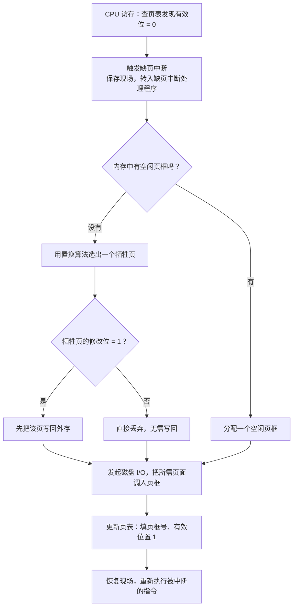

# 第 7 章：虚拟内存管理

> 虚拟内存是 408 内存管理篇的收官章节，重要度 ⭐⭐⭐⭐⭐。**页面置换算法模拟是每年必考的高频计算题**——给定页面访问序列和帧数，用 OPT/FIFO/LRU/Clock 推演缺页次数，选择题和综合题都会出。本章建立在[第 6 章（内存管理基础）](06-memory-foundation.md)的分页机制之上：第 6 章解决"逻辑地址怎么变成物理地址"，本章解决"页面不在内存时怎么办"。学习重点是缺页中断机制和四类置换算法的推演，所有例题务必自己动手算一遍。

---

## 7.1 虚拟内存的概念

### 局部性原理

虚拟内存的可行性建立在**局部性原理**之上：程序在执行过程中，对内存的访问呈现出局部聚集的特征。

| 局部性 | 含义 | 例子 |
|--------|------|------|
| **时间局部性** | 最近被访问过的数据，不久后很可能再次被访问 | 循环变量、计数器、栈顶元素 |
| **空间局部性** | 刚被访问过的数据，其邻近的数据很快也会被访问 | 顺序执行的指令、数组遍历 |

正因为局部性成立，才可以把程序当前**不需要**的部分放到外存，只把**正在使用和即将使用**的部分留在内存——程序照常运行，用户却感觉内存"足够大"。

### 虚拟内存的定义与特征

**虚拟内存**：基于局部性原理，把程序的一部分装入内存即可运行；运行时若需要不在内存中的页面，再由操作系统**请求调入**；内存不够时，把暂时不用的页面**置换**到外存。从而在逻辑上扩充内存容量。

虚拟内存的三个特征（与[第 6 章](06-memory-foundation.md)的基本分页对比记忆）：

| 特征 | 含义 |
|------|------|
| **多次性** | 一个作业被分成多个部分，可**多次**分批装入内存（基本分页要求一次性全部装入） |
| **对换性** | 运行过程中允许把暂时不用的页面**换出**到外存，需要时再换入 |
| **离散性** | 程序离散地分布在内存的各个页框中（继承自分页/分段管理） |

> 易错点：**虚拟存储器的容量由计算机的地址结构（地址位数）决定，而不是物理内存大小**。32 位地址结构的机器，逻辑地址空间最大为 $2^{32} = 4\text{ GB}$ ，这就是虚拟内存的容量上限；实际大小还受外存容量限制。选择题常问"虚拟内存能有多大"，答案看地址位数，不看内存条。

> 虚拟内存 $\ne$ 物理内存的简单扩充：它本质是"以时间换空间"——用频繁的缺页中断和外存 I/O 代价，换取比实际内存大得多的逻辑地址空间。若程序局部性很差，缺页率飙升，性能反而急剧下降（见 7.5 抖动）。

---

## 7.2 请求分页与缺页中断

### 请求分页的页表项扩充

请求分页在基本分页页表项（页号 → 页框号）的基础上，增加以下字段：

| 字段 | 别名 | 作用 |
|------|------|------|
| **状态位**（有效位/存在位） | 中断位 | 1 表示该页**已在内存**，0 表示不在内存（访问时触发缺页中断） |
| **修改位**（脏位） | 修改位 | 该页调入内存后**是否被写过**。换出时：脏位为 1 必须写回外存，为 0 直接丢弃 |
| **访问位** | 引用位 | 该页最近**是否被访问过**，供 NRU/Clock 类置换算法使用 |
| **保护位** | 存取方式字段 | 读/写/执行权限，越权访问触发保护中断 |
| **外存地址** | 辅存地址 | 该页在外存（磁盘对换区）中的位置，缺页时据此调入 |

> 修改位的考点：换出页面时**是否需要写回外存**由修改位决定。写回一次磁盘的开销远大于直接丢弃，所以改进型 Clock 算法会优先淘汰未修改的页面（见 7.3.6）。

### 缺页中断

访问的页面不在内存（有效位 = 0）时，硬件触发**缺页中断**（缺页异常，page fault），由操作系统负责把所需页面调入内存。

缺页中断与一般中断（外中断）的区别是高频考点：

| 对比项 | 缺页中断 | 一般中断（外中断） |
|--------|---------|------------------|
| 产生时间 | **指令执行期间**产生（访存时发现页面不在） | 一条指令**执行结束后**检测 |
| 类别 | **内中断**（异常/陷入类，与当前指令相关） | 外中断（来自 CPU 外部，与当前指令无关） |
| 产生次数 | **一条指令可能产生多次**（如一条指令跨页且两页都不在内存） | 一条指令执行期间最多检测一次 |
| 处理后 | **重新执行**被中断的那条指令 | 执行下一条指令 |

缺页中断的处理流程：

> 三个易错结论，选择题反复考：① 缺页中断属于**内中断**（异常），不是外中断；② 缺页中断在**指令执行期间**产生，一般中断在指令执行末尾检测；③ **一次访存最多引起一次缺页中断，但一条指令可能引起多次缺页中断**（取指、取数、写结果各可能缺页；跨页访问也会）。

---

## 7.3 页面置换算法（核心）

缺页且无空闲页框时，必须从内存中选一个页面换出，腾出页框。**选择换出哪个页面的规则就是页面置换算法**。算法目标：尽量降低缺页率。

**本章约定**（也是 408 通行约定）：**首次装入也计入缺页次数**。即页面序列中第一次出现的页面，每装入一次算一次缺页。考试若题目另有说明，以题目为准。

推演时注意记录每个帧的"入队顺序"或"最近使用顺序"，这是 FIFO 和 LRU 判断牺牲页的依据。

### 7.3.1 OPT 最佳置换算法

**思想**：每次淘汰**以后永不使用**、或**最长时间内不再被访问**的页面。

| 特点 | 说明 |
|------|------|
| 缺页率 | **理论最低**，任何其他算法都无法超过它 |
| 可实现性 | **无法实现**——OS 无法预知未来的访问序列 |
| 用途 | 作为**性能基准**，衡量其他算法与最优解的差距 |

OPT 的推演需要"上帝视角"：看到当前访问后，扫描整个剩余序列决定淘汰谁。

### 7.3.2 FIFO 先进先出算法

**思想**：淘汰**最早调入**内存的页面。实现只需一个指针（或队列）记录页面的调入顺序，开销最小。

FIFO 有一个反直觉的缺陷——**Belady 异常**：分配的页框数增加，缺页次数**反而增多**。

**例 1**（Belady 异常）：页面访问序列为 `1, 2, 3, 4, 1, 2, 5, 1, 2, 3, 4, 5`，分别用 3 个页框和 4 个页框运行 FIFO，统计缺页次数。

**解**：

3 个页框的推演：

| 时刻 | 1 | 2 | 3 | 4 | 1 | 2 | 5 | 1 | 2 | 3 | 4 | 5 |
|------|---|---|---|---|---|---|---|---|---|---|---|---|
| 访问页 | 1 | 2 | 3 | 4 | 1 | 2 | 5 | 1 | 2 | 3 | 4 | 5 |
| 帧内容 | 1 | 1,2 | 1,2,3 | 2,3,4 | 3,4,1 | 4,1,2 | 1,2,5 | 1,2,5 | 1,2,5 | 2,5,3 | 5,3,4 | 5,3,4 |
| 缺页 | ✓ | ✓ | ✓ | ✓ | ✓ | ✓ | ✓ | | | ✓ | ✓ | |

共 **9 次**缺页。

4 个页框的推演：

| 时刻 | 1 | 2 | 3 | 4 | 1 | 2 | 5 | 1 | 2 | 3 | 4 | 5 |
|------|---|---|---|---|---|---|---|---|---|---|---|---|
| 访问页 | 1 | 2 | 3 | 4 | 1 | 2 | 5 | 1 | 2 | 3 | 4 | 5 |
| 帧内容 | 1 | 1,2 | 1,2,3 | 1,2,3,4 | 1,2,3,4 | 1,2,3,4 | 2,3,4,5 | 3,4,5,1 | 4,5,1,2 | 5,1,2,3 | 1,2,3,4 | 2,3,4,5 |
| 缺页 | ✓ | ✓ | ✓ | ✓ | | | ✓ | ✓ | ✓ | ✓ | ✓ | ✓ |

共 **10 次**缺页。**帧数从 3 增加到 4，缺页反而从 9 次变成 10 次**——这就是 Belady 异常。

> Belady 异常**只出现在 FIFO 这类不具有"栈性质"的算法**中。OPT 和 LRU 是栈算法，帧数增多缺页次数单调不增，不会出现异常。选择题问"哪种算法可能出现 Belady 异常"，选 FIFO。

### 7.3.3 LRU 最近最久未使用算法

**思想**：淘汰**最近最长时间没有被访问**的页面（向前看最近最久）。依据是时间局部性：刚被访问过的页面，近期很可能再次被访问。

实现需要硬件支持，记录每个页面的最近访问时间，两种典型方式：

| 实现方式 | 机制 | 开销 |
|---------|------|------|
| **计数器法** | 每个页表项加一个时间戳字段，每次访存更新；缺页时比较选出时间戳最小的页 | 每次访存都要写计数器，且需比较电路 |
| **栈法** | 维护一个页面栈，每次访问把该页移到栈顶；淘汰时取栈底 | 每次访存都要调整栈，开销更大，但无需比较 |

LRU 的性能**接近 OPT**，且**没有 Belady 异常**；缺点是需要专门的硬件支持，每次访存都要更新记录，开销大。实际系统多用其近似算法（Clock 等）。

### 7.3.4 典型例题：三算法同序列模拟

**例 2**：页面访问序列为 `7, 0, 1, 2, 0, 3, 0, 4, 2, 3, 0, 3, 2, 1, 2, 0, 1, 7, 0, 1`（共 20 次访问），分配 **3 个页框**，分别用 OPT、FIFO、LRU 计算缺页次数（首次装入计缺页）。

**解**：

**（1）OPT**——淘汰未来最久不再使用的页面：

| 时刻 | 1 | 2 | 3 | 4 | 5 | 6 | 7 | 8 | 9 | 10 | 11 | 12 | 13 | 14 | 15 | 16 | 17 | 18 | 19 | 20 |
|------|---|---|---|---|---|---|---|---|---|----|----|----|----|----|----|----|----|----|----|----|
| 访问页 | 7 | 0 | 1 | 2 | 0 | 3 | 0 | 4 | 2 | 3 | 0 | 3 | 2 | 1 | 2 | 0 | 1 | 7 | 0 | 1 |
| 帧内容 | 7 | 7,0 | 7,0,1 | 0,1,2 | 0,1,2 | 0,2,3 | 0,2,3 | 2,3,4 | 2,3,4 | 2,3,4 | 2,3,0 | 2,3,0 | 2,3,0 | 2,0,1 | 2,0,1 | 2,0,1 | 2,0,1 | 0,1,7 | 0,1,7 | 0,1,7 |
| 淘汰页 | | | | 7 | | 1 | | 0 | | | 4 | | | 3 | | | | 2 | | |
| 缺页 | ✓ | ✓ | ✓ | ✓ | | ✓ | | ✓ | | | ✓ | | | ✓ | | | | ✓ | | |

缺页 **9 次**。注意时刻 6：帧中 0、1、2 的未来再次使用时刻分别是 7、14、9，淘汰最远的 1；时刻 8：0、2、3 的未来使用时刻为 11、9、10，淘汰 0。

**（2）FIFO**——淘汰最早调入的页面：

| 时刻 | 1 | 2 | 3 | 4 | 5 | 6 | 7 | 8 | 9 | 10 | 11 | 12 | 13 | 14 | 15 | 16 | 17 | 18 | 19 | 20 |
|------|---|---|---|---|---|---|---|---|---|----|----|----|----|----|----|----|----|----|----|----|
| 访问页 | 7 | 0 | 1 | 2 | 0 | 3 | 0 | 4 | 2 | 3 | 0 | 3 | 2 | 1 | 2 | 0 | 1 | 7 | 0 | 1 |
| 帧内容 | 7 | 7,0 | 7,0,1 | 0,1,2 | 0,1,2 | 1,2,3 | 2,3,0 | 3,0,4 | 0,4,2 | 4,2,3 | 2,3,0 | 2,3,0 | 2,3,0 | 3,0,1 | 0,1,2 | 0,1,2 | 0,1,2 | 1,2,7 | 2,7,0 | 7,0,1 |
| 缺页 | ✓ | ✓ | ✓ | ✓ | | ✓ | ✓ | ✓ | ✓ | ✓ | ✓ | | | ✓ | ✓ | | | ✓ | ✓ | ✓ |

缺页 **15 次**——明显多于 OPT。注意时刻 5 访问 0 命中（0 还在内存），不更新调入顺序，这是 FIFO 与 LRU 的关键差异。

**（3）LRU**——淘汰最近最久未访问的页面：

| 时刻 | 1 | 2 | 3 | 4 | 5 | 6 | 7 | 8 | 9 | 10 | 11 | 12 | 13 | 14 | 15 | 16 | 17 | 18 | 19 | 20 |
|------|---|---|---|---|---|---|---|---|---|----|----|----|----|----|----|----|----|----|----|----|
| 访问页 | 7 | 0 | 1 | 2 | 0 | 3 | 0 | 4 | 2 | 3 | 0 | 3 | 2 | 1 | 2 | 0 | 1 | 7 | 0 | 1 |
| 帧内容 | 7 | 7,0 | 7,0,1 | 0,1,2 | 1,2,0 | 2,0,3 | 2,3,0 | 3,0,4 | 0,4,2 | 4,2,3 | 2,3,0 | 2,0,3 | 0,3,2 | 3,2,1 | 3,1,2 | 1,2,0 | 2,0,1 | 0,1,7 | 1,7,0 | 7,0,1 |
| 缺页 | ✓ | ✓ | ✓ | ✓ | | ✓ | | ✓ | ✓ | ✓ | ✓ | | | ✓ | | ✓ | | ✓ | | |

缺页 **12 次**。表中帧内容按"最久未用 → 最近使用"排列，命中时也要把该页移到队尾（更新使用顺序），如时刻 5、7、12、13 等。

**三算法对比**：OPT（9 次） $<$ LRU（12 次） $<$ FIFO（15 次）。LRU 利用时间局部性，明显优于 FIFO，接近理论最优 OPT。

> 应试技巧：推演时按列推进，命中（不缺页）的时刻帧内容不变但顺序可能变（LRU）；FIFO 命中时顺序完全不变。数缺页次数时别漏掉前几次"空帧装入"。

### 7.3.5 NRU 最近未使用算法

NRU（Not Recently Used）以**访问位**和**修改位**为依据，把内存中的页面分为四类，**优先淘汰类号最小的页面**：

| 类号 | 访问位 | 修改位 | 含义 | 淘汰优先级 |
|------|-------|-------|------|-----------|
| 0 | 0 | 0 | 最近未访问、未修改 | 最高（直接丢弃，无 I/O） |
| 1 | 0 | 1 | 最近未访问、已修改 | 次高（需写回） |
| 2 | 1 | 0 | 最近已访问、未修改 | 次低 |
| 3 | 1 | 1 | 最近已访问、已修改 | 最低 |

硬件在每个时钟周期（或时间片结束）把所有页面的**访问位清 0**，从而"最近"是一个周期内的概念。同类中多个候选时随机选一个。

例：内存中有 4 页，状态分别为 A(0,0)、B(1,1)、C(0,1)、D(1,0)，需要置换时选 A（第 0 类）；若无第 0 类页面，如只剩 B(1,1)、C(0,1)、D(1,0)，则选 C（第 1 类）。

### 7.3.6 Clock（时钟）算法

Clock 算法也叫简单 Clock / NRU 改进型，是 LRU 的近似，实际系统应用广泛。

**数据结构**：把所有空闲/已分配的页框组织成**环形链表**，每个页面有一个**访问位**；一个**替换指针**（时钟指针）指向环形链表中的某个帧。

**置换过程**（发生缺页时）：

1. 检查指针所指页面的访问位：
   - 访问位 = 0：**直接淘汰**该页，装入新页面（访问位置 1），指针移到下一帧；
   - 访问位 = 1：**清 0**，指针移到下一帧，继续检查。
2. 若转了一圈所有访问位都被清成 0，第二圈必然找到访问位为 0 的页面淘汰。

即"**第一次扫过清 0，第二次扫过替换**"，最多扫描两圈。页面被访问时硬件自动将其访问位置 1。

**例 3**（Clock 推演）：4 个页框组成环形链表，初始依次存放页面 `2, 5, 3, 1`，访问位均为 1，指针指向页面 2。依次访问页面 `6, 3, 4`，推演 Clock 算法过程。

**解**：

| 步骤 | 访问 | 是否缺页 | 扫描过程 | 结果 |
|------|------|---------|---------|------|
| ① | 6 | 缺页 | 指针扫过 2(1)清0 → 5(1)清0 → 3(1)清0 → 1(1)清0 → 回到 2(0)，淘汰 2 | 装入 6（访问位 1），指针指向 5 |
| ② | 3 | 命中 | — | 页面 3 的访问位置 1 |
| ③ | 4 | 缺页 | 指针所指 5 的访问位为 0，直接淘汰 5 | 装入 4（访问位 1），指针指向 3 |

最终内存：`6(1), 4(1), 3(1), 1(0)`（括号内为访问位），指针指向页面 3。步骤 ① 演示了"整圈清 0 后回到起点替换"，步骤 ③ 演示了"访问位为 0 立即替换"。

### 7.3.7 改进型 Clock 算法

简单 Clock 只考虑访问位，可能把刚修改过的页面淘汰掉，白白多一次写回 I/O。改进型 Clock 同时考虑**访问位和修改位**，用 (访问位, 修改位) 组成四类，按以下顺序扫描（最多两圈，必能淘汰）：

| 扫描轮次 | 寻找的目标 | 扫描时是否修改标志位 |
|---------|-----------|-------------------|
| 第 1 轮 | (0, 0)：未访问、未修改 | 不修改任何标志位 |
| 第 2 轮 | (0, 1)：未访问、已修改 | **顺带把扫过页面的访问位清 0** |
| 第 3 轮 | 再次找 (0, 0)（第 2 轮清 0 可能产生新的 (0,0)） | — |
| 第 4 轮 | 再次找 (0, 1) | — |

优先级口诀：**00 → 01 → 00 → 01**。既优先淘汰未访问的页面（近似 LRU），又在同访问状态下优先淘汰未修改的页面（减少写回 I/O）。

**例 4**（改进型 Clock 推演）：4 个页框环形排列，初始状态（访问位, 修改位）依次为：页面 2 (1,0)、页面 3 (1,1)、页面 4 (0,1)、页面 5 (1,0)，指针指向页面 2。访问页面 6 发生缺页，推演淘汰过程。

**解**：

- **第 1 轮找 (0,0)**：2(1,0) ✗ → 3(1,1) ✗ → 4(0,1) ✗ → 5(1,0) ✗，一圈无果；
- **第 2 轮找 (0,1)**，并把扫过页面的访问位清 0：
  - 页面 2 (1,0) 不匹配，访问位清 0 → 变为 (0,0)；
  - 页面 3 (1,1) 不匹配，访问位清 0 → 变为 (0,1)；
  - 页面 4 (0,1) **匹配**，淘汰页面 4。

装入页面 6（访问位置 1，修改位 0），指针移到下一帧（页面 5）。最终状态：页面 2 (0,0)、页面 3 (0,1)、页面 6 (1,0)、页面 5 (1,0)。

> 若第 2 轮扫完仍没找到（说明所有页都曾被访问且第 2 轮已清 0），第 3 轮必然能找到一个 (0,0)。所以改进型 Clock **最多扫描两圈**。

### 7.3.8 置换算法对比

| 算法 | 核心思想 | 缺页率 | 硬件开销 | 实现难度 | Belady 异常 |
|------|---------|--------|---------|---------|------------|
| OPT | 淘汰未来最久不用的页 | 理论最低 | —（无法实现） | 不可实现，仅作基准 | 无 |
| FIFO | 淘汰最早调入的页 | 较低 | 一个指针 | 最简单 | **有** |
| LRU | 淘汰最近最久未用的页 | 接近 OPT | 大（每次访存更新记录） | 较难，需硬件记录访问时间 | 无 |
| NRU | 按 (访问位, 修改位) 分类淘汰 | 中等 | 小（两个标志位 + 定期清 0） | 简单 | 无 |
| Clock | 环形扫描 + 访问位清 0 | 介于 FIFO 与 LRU 之间 | 小 | 简单 | 无 |
| 改进型 Clock | Clock + 修改位，少写回 | 略优于 Clock | 小 | 简单 | 无 |

> NRU 与 Clock 都以**访问位**为基础，但机制不同：**NRU 按四类优先级选择**（访问位定期统一清 0，不关心顺序）；**Clock 用环形指针顺序扫描**（第一次清 0、第二次替换）。选择题常把两者混在一起考，注意区分。

---

## 7.4 页面分配与调入策略

### 三种页面分配策略

按"分配帧数是否可变"与"置换范围是局部还是全局"组合：

| 策略 | 帧数 | 置换范围 | 特点 |
|------|------|---------|------|
| **固定分配局部置换** | 固定 | 本进程内 | 进程整个运行期间帧数不变，缺页只能换出自己的页。分配多少帧难以确定：多了浪费、少了频繁缺页 |
| **可变分配全局置换** | 可变 | 全体进程 | 缺页时可换出**其他进程**的页面给自己。实现简单，但可能剥夺其他进程的页面，影响其运行 |
| **可变分配局部置换** | 可变 | 本进程内 | 缺页时先在本进程内置换；若本进程帧太少，再从系统空闲帧补充。兼顾公平与效率，实际系统常用 |

**缺页率与分配帧数的关系**：分配帧数增加 → 缺页率下降，但**边际收益递减**；帧数增加到一定程度后再增加几乎不降低缺页率。反之，帧数过少会导致缺页率急剧上升甚至引发抖动（见 7.5）。

### 页面调入策略

| 策略 | 机制 | 说明 |
|------|------|------|
| **请求调页** | 缺页时才调入所需页面 | 主流方式，不会调入无用页，但每次缺页都有 I/O 延迟 |
| **预读（预取）** | 利用局部性，缺页时顺带调入附近可能用到的页面 | 减少缺页次数；预取不准则浪费 I/O 和内存 |
| **页面缓存** | 换出的页面不立即释放，放入空闲帧组成的缓存池；再次需要时直接恢复 | 脏页可延迟写回，减少磁盘 I/O（了解） |

---

## 7.5 抖动（颠簸）与工作集

### 抖动现象

某进程刚换出的页面立刻又要访问，于是再次缺页调入 → 又挤出别的页面 → 又缺页……如此反复，**缺页率极高，CPU 大部分时间花在换页上**，利用率骤降，系统看似忙碌实则几乎无进展，这种现象称为**抖动（颠簸，thrashing）**。

抖动的根本原因：**同时运行的进程太多**，所有进程需要的帧总数超过物理帧总数，每个进程分到的帧数少于其活跃页面数。

### 工作集模型

**工作集**：在某段时间窗口内进程实际访问的页面集合：

$$
W(t, \Delta) = \text{进程在时间区间 } [t - \Delta, t] \text{ 内访问的页面集合}
$$

其中 $t$ 是检测时刻， $\Delta$ 是**工作集窗口**大小。 $\Delta$ 太小，不能包含活跃页面； $\Delta$ 太大，会包含已不再使用的页面。工作集大小 $|W|$ 随程序执行阶段变化（如进入新循环时增大）。

**驻留集与工作集的关系**：驻留集是进程当前实际占用的页面集合。若**驻留集 $\ge$ 工作集**，活跃页面都在内存，缺页率低；若驻留集小于工作集，就会频繁缺页乃至抖动。防止抖动的核心就是保证各进程的驻留集不小于其工作集。

### 防止抖动的措施

1. **控制并发进程数**：进程过多时暂停（挂起）部分进程，释放其占用的帧，待内存充裕再恢复（中级调度/对换）；
2. **工作集动态监控**：系统定期统计各进程的工作集大小并动态调整其驻留集；若所有工作集之和超过可用帧数，暂停某些进程；
3. **缺页率控制（PFF）**：设定缺页率上下限，过高则增加分配帧、过低则回收帧（了解）。

> 考点：抖动的本质是"进程数过多导致人均帧数不足"，解决方法是**减少并发进程数**，而不是增大页面或提高 CPU 速度。

---

## 7.6 内存映射文件（了解）

**内存映射文件**（mmap）把磁盘文件直接映射到进程的**逻辑地址空间**：之后对该文件的访问就像访问普通内存一样，用**内存读写指令代替 read/write 系统调用**。

| 要点 | 说明 |
|------|------|
| 基本机制 | 文件被分成若干页，以请求分页方式装入；访问映射区触发缺页中断，由 OS 从文件调入对应页 |
| 好处 | 省去用户态/内核态数据拷贝（传统 read 需要磁盘 → 内核缓冲区 → 用户区两次拷贝）；多进程映射同一文件可**共享内存**实现通信 |
| 写回时机 | 对映射区的修改先只改内存中的页（置脏位），在**页面被置换出**、显式同步（如 msync）或取消映射/关闭时才写回磁盘 |

内存映射文件把"文件"与"虚拟内存"两套机制打通，是[第 8 章（文件管理）](08-file-management.md)与本章的交叉点，408 以概念考查为主。

---

## 7.7 虚拟存储器性能的影响因素

虚拟存储器的性能取决于**缺页率**与**每次缺页的服务开销**，主要影响因素如下：

| 因素 | 影响与改进 |
|------|-----------|
| **页面大小** | 见下文详述，存在最优值 |
| **分配帧数** | 帧数越多缺页率越低，但边际收益递减（见 7.4） |
| **程序局部性** | 局部性越好，缺页率越低。改进方法：程序编写时集中访问热点数据、按行序遍历数组（空间局部性） |
| **预取** | 利用空间局部性提前调入相邻页面，减少缺页次数 |
| **页面缓存** | 换出页暂存于空闲帧，重复使用时免去磁盘 I/O |

### 页面大小的选择

页面大小是 408 常考的权衡题：

| 页面大小 | 优点 | 缺点 |
|---------|------|------|
| **太小** | 内碎片小 | 页数多 → **页表过大**；单页覆盖范围小，**TLB 覆盖的内存范围变小**（TLB 项数固定），TLB 缺失增多；空间局部性利用差，缺页率升高 |
| **太大** | 页数少、页表小、单次 I/O 传输量大 | **内碎片增大**；每次缺页调入大量暂时用不到的数据；内存中能驻留的页数减少，工作集装不下时缺页率反而升高 |

**页面大小与缺页率的关系曲线**：缺页率随页面大小增大**先下降后上升**，呈"U 形"，中间存在使缺页率最低的**最优页面大小**。太小则局部性利用不足，太大则无关信息挤占内存。现代系统页面大小一般为 4 KB（也支持 2 MB 等大页用于特定场景）。

### 缺页率与有效访问时间（EAT）

设内存访问时间为 $T_m$ ，缺页率为 $p$ （每次访存发生缺页的概率），缺页服务时间为 $T_f$ （含磁盘 I/O，通常是毫秒级，远大于内存访问），则**有效访问时间**：

$$
EAT = (1 - p) \times T_m + p \times (T_m + T_f) \approx (1 - p) \times T_m + p \times T_f
$$

由于 $T_f \gg T_m$ ，缺页率即使只有百万分之几，也会显著拖慢访存。这是虚拟内存"以时间换空间"的量化体现。

**例 5**：某请求分页系统中，内存访问时间为 200 ns，缺页服务时间平均为 10 ms。若要求有效访问时间不超过 220 ns，求可接受的最大缺页率 $p$ 。

**解**：

$$
EAT = (1 - p) \times 200 + p \times 10^7 \le 220 \quad (\text{单位 ns，} 10\text{ ms} = 10^7\text{ ns})
$$

$$
200 + p \times (10^7 - 200) \le 220 \implies p \le \frac{20}{10^7 - 200} \approx 2 \times 10^{-6}
$$

即缺页率必须控制在约**百万分之二**以内。若题目要求考虑 TLB，则把命中/未命中 TLB 两种情况分别代入再叠加缺页项（结合[第 6 章](06-memory-foundation.md)的 EAT 公式）。

---

## 7.8 常见陷阱清单

1. **缺页中断属于内中断（异常）**，在指令执行期间产生；一般中断（外中断）在指令执行末尾检测。别答反。
2. **一次访存最多引起一次缺页中断，一条指令可能引起多次缺页中断**（跨页、取指+访数分开等）。
3. 缺页中断处理后**重新执行被中断的指令**，而不是执行下一条。
4. **Belady 异常只出现在 FIFO**；OPT、LRU 是栈算法，帧数增加缺页不会变多。
5. **NRU 与 Clock 要分清**：NRU 按四类优先级选；Clock 环形指针扫描、先清 0 后替换。两者都以访问位为基础。
6. **LRU 必须依赖硬件**记录页面的最近访问时间（计数器或栈），纯软件无法高效实现；FIFO 只需要一个指针。
7. **修改位（脏位）决定换出时是否写回**：脏位为 1 必须写回外存，为 0 直接丢弃。改进型 Clock 优先淘汰 (0,0) 类就是为了避免写回。
8. **虚拟内存容量由地址位数决定**，与物理内存大小无关；首次装入计入缺页次数（除非题目另有约定）。
9. FIFO 命中时**不改变**页面调入顺序；LRU 命中时**必须更新**使用顺序——模拟推演时最容易错的地方。

---

## 本章小结

### 核心要点回顾

1. **虚拟内存**基于局部性原理，通过请求调入 + 页面置换在逻辑上扩充内存；容量由**地址位数**决定
2. **请求分页页表项**扩充：状态位（有效位）、修改位、访问位、保护位、外存地址
3. **缺页中断**是内中断，指令执行期间产生，一条指令可能多次缺页，处理后重新执行该指令
4. **置换算法**：OPT（基准）、FIFO（有 Belady 异常）、LRU（接近 OPT，硬件开销大）、NRU/Clock/改进型 Clock（基于访问位与修改位的近似算法）
5. **抖动**源于并发进程过多，用**工作集** $W(t, \Delta)$ 模型刻画；保证驻留集 $\ge$ 工作集
6. **EAT 公式**： $EAT = (1-p) \times T_m + p \times T_f$ ，缺页率必须控制在极低水平

### 考试重点排序

| 优先级 | 考点 | 题型 |
|--------|------|------|
| ⭐⭐⭐ | 页面置换算法模拟（FIFO/LRU/OPT/Clock 缺页次数推演） | 选择题 + 综合题 |
| ⭐⭐⭐ | Belady 异常、缺页中断的特点（内中断、多次缺页） | 选择题 |
| ⭐⭐ | EAT 与缺页率计算 | 选择题 |
| ⭐⭐ | NRU/Clock/改进型 Clock 的机制与区分、修改位的作用 | 选择题 |
| ⭐ | 工作集与抖动、页面大小的权衡、内存映射文件 | 选择题 |

> 本章复习策略：置换算法推演必须动手练到"又快又准"——考试时 20 个访问序列 3 分钟内要推完。概念部分抓住 7.8 的陷阱清单逐条过关。地址变换的底层机制（页表、TLB、多级页表）请回顾[第 6 章（内存管理基础）](06-memory-foundation.md)，文件与缺页换入换出的联系见[第 8 章（文件管理）](08-file-management.md)。

---

## 自测题

1. 虚拟内存基于什么原理？其容量由什么决定，为什么与物理内存大小无关？
2. 缺页中断与一般中断有哪些区别？一条指令能否引起多次缺页中断？
3. 什么是 Belady 异常？哪些置换算法可能出现？
4. NRU 算法如何分类页面？改进型 Clock 的四轮扫描顺序是什么？
5. 序列 `1, 2, 3, 4, 1, 2, 5, 1, 2, 3, 4, 5` 用 LRU、3 个页框的缺页次数是多少？（动手算一下）
6. 什么是抖动？用工作集模型说明其成因与防止方法。
7. 页面大小选择要权衡哪些因素？页面大小与缺页率是什么关系？

> **答案**：1. 基于局部性原理（时间局部性与空间局部性）；容量由机器地址位数决定（如 32 位地址最大 4 GB），因为逻辑地址空间大小由可表示的地址数量决定，物理内存只是虚拟内存的"缓存层"。2. 缺页中断在指令执行期间产生、属于内中断、一条指令可能产生多次、处理后重新执行被中断指令；一般中断在指令执行末尾检测、属于外中断、一条指令期间最多一次、处理后执行下一条指令。能，例如一条指令跨页访问且两页都不在内存。3. 分配帧数增加缺页次数反而增多的现象；只出现在 FIFO 这类非栈算法中，OPT 和 LRU 不会。4. NRU 按 (访问位, 修改位) 分为 00/01/10/11 四类，优先淘汰类号最小的页面，并定期把访问位清 0；改进型 Clock 扫描顺序为找 (0,0) → 找 (0,1)（顺带清访问位）→ 再找 (0,0) → 再找 (0,1)。5. 10 次（提示：LRU 命中也要更新顺序，缺页发生在 1,2,3,4,1,2,5 和末尾的 3,4,5）。6. 抖动是刚换出的页面又要访问、缺页率极高导致 CPU 利用率骤降的现象；成因是并发进程过多、各进程驻留集小于其工作集 $W(t, \Delta)$ （ $\Delta$ 窗口内访问过的页面集合）；防止方法是减少并发进程数（挂起部分进程）、按工作集动态调整驻留集。7. 页面太小：页表过大、TLB 覆盖范围小、局部性利用差；页面太大：内碎片大、调入无关数据多；缺页率随页面大小先降后升，存在最优页面大小。
