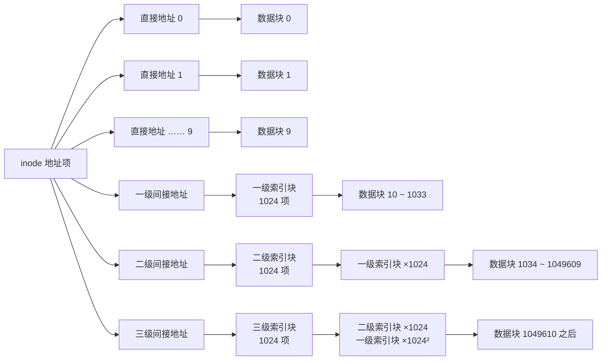
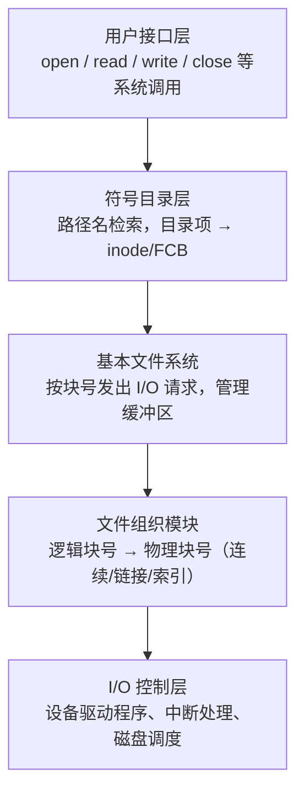

# 第 8 章：文件管理

> 文件管理在 408 中重要度 ⭐⭐⭐，以选择题为主，但**混合索引（inode 寻址范围）计算是综合题/选择题的高频考点**，几乎每年都有相关题目：最大文件大小、某逻辑块号落在第几级索引、访问某字节需要几次访盘。位示图行列互算、FAT 查链次数、目录检索次数也是常客。本章概念多但计算套路固定，把例题吃透即可。磁盘调度算法（FCFS/SSTF/SCAN/C-SCAN）按本知识库编排放在[第 9 章（I/O 管理）](09-io-management.md)中讲解。

---

## 8.1 文件的概念与属性

### 文件的定义

**文件**（File）是以计算机存储器为载体的、**带属性的信息集合**。它是操作系统对用户提供的存储抽象：用户不必关心信息在磁盘上如何存放，只需按名存取。

- **文件系统**（File System）：操作系统中负责管理文件、记录文件信息、提供按名存取接口的那部分软件，包括管理文件的程序、数据结构和存储空间。

### 文件的属性

| 属性 | 说明 |
|------|------|
| 名称 | 人类可读的符号名，按名存取的依据 |
| 标识符 | 文件系统内部的文件唯一编号（如 inode 号） |
| 类型 | 普通文件、目录文件、字符设备、块设备等 |
| 位置 | 文件在外存上的物理存放位置（由文件系统维护） |
| 大小 | 当前长度，有的还记录最大允许长度 |
| 保护 | 访问权限（读/写/执行）、属主信息 |
| 时间/用户信息 | 创建时间、最后访问时间、最后修改时间、创建者等 |

### 文件控制块 FCB

**文件控制块**（File Control Block, FCB）是操作系统为管理文件而设置的数据结构，**存放文件的全部属性信息**。一个文件对应一个 FCB。

- FCB 的有序集合构成**文件目录**，目录项的基本内容就是 FCB（或其指针）
- 在 UNIX/Linux 中，FCB 的核心部分称为 **索引节点（inode）**，文件名与 inode 号分离存放在目录项中（见 8.5）

> 易错点：FCB 描述的是"文件本身的属性"，而进程对文件的打开状态由**打开文件表**（见 8.6）维护，两者不要混淆。

---

## 8.2 文件的逻辑结构

逻辑结构是**用户视角**的组织形式，与物理存放无关。

| 分类 | 形式 | 说明 |
|------|------|------|
| 无结构文件 | 流式文件 | 字符（字节）序列，如 UNIX 的普通文件、源码文件 |
| 有结构文件 | 记录式文件 | 由若干记录组成，如数据库表 |

有结构文件的三种组织方式：

| 组织方式 | 结构 | 访问方式 | 特点 |
|---------|------|---------|------|
| 顺序文件 | 记录按顺序连续存放 | 顺序查找，只能从头读 | 简单；检索第 $i$ 个记录需先经过前 $i-1$ 个 |
| 索引文件 | 数据 + 索引表 | 按关键字随机访问 | 索引表本身顺序存放，先查索引再取记录 |
| 索引顺序文件 | 顺序文件 + 索引表 | 顺序 + 随机 | 分组建索引，索引表较小，兼顾两种访问 |

> 408 一般只考概念区分：看到"流式/字节序列"选无结构，看到"记录/关键字检索"选有结构。

---

## 8.3 文件的物理结构（核心）

物理结构指文件在外存上的**实际存放方式**，决定访问速度与空间利用率。外存分配以**盘块**（块/簇）为单位。

先区分两种访问方式：

- **顺序访问**：按文件中信息的先后次序依次访问，如磁带
- **随机访问（直接访问）**：可按任意次序访问任意位置，如磁盘

物理结构的核心矛盾：**连续分配利于随机访问但浪费空间，离散分配节省空间但随机访问变慢**——索引分配正是折中方案。

### 三种分配方式总览

| 对比项 | 连续分配 | 链接分配（隐式） | 链接分配（显式 FAT） | 索引分配 |
|--------|---------|----------------|-------------------|---------|
| 随机访问 | ✅ 支持，速度快 | ❌ 只能顺序 | ✅ 支持（查 FAT） | ✅ 支持（查索引块） |
| 空间碎片 | 有外部碎片 | 无 | 无 | 无（索引块本身有开销） |
| 文件增长 | 困难（需预留连续空间） | 容易 | 容易 | 容易 |
| 额外开销 | 无 | 每块 1 个指针 | FAT 表常驻内存 | 每文件 1 个或多个索引块 |
| 可靠性 | — | 指针损坏则全文件丢失 | FAT 损坏影响全局 | 索引块损坏则全文件丢失 |
| 典型系统 | 磁带、CD-ROM、系统分区 | 早期软盘 | DOS/Windows FAT | UNIX/Linux、NTFS |

### 连续分配

为文件分配**一组连续的盘块**。给定起始块号 $b$ 和块长，逻辑块号 $i$ 对应物理块号 $b + i$ ，因此**顺序访问和随机访问都快**。

缺点：
1. **外部碎片**：删除文件后留下难以利用的小空隙（与第 6 章内存动态分区的问题同源）
2. **不利于文件增长**：创建时必须预估大小，增长时若后方无足够连续空间则须整体搬迁

### 链接分配

**隐式链接**：每个盘块存放数据 + 指向下一块的指针，文件目录记录首块号（有时含末块号）。
- 只能**顺序访问**：找第 $i$ 块必须从首块沿链走 $i$ 次
- 指针占用块内空间；**可靠性差**，一个指针损坏后续全部丢失
- 常用改进：把链改为按"簇"（多块一组）链接，减少指针数

**显式链接（FAT）**：把用于链接的指针**全部集中存放在一张文件分配表 FAT** 中。FAT 表项以块号为下标，内容是下一块的块号（特殊值表示链尾/坏块/空闲）。
- FAT 在文件卷启动时读入内存并**常驻内存**，查链只需**访存**，不必反复读盘
- 支持随机访问：要定位第 $i$ 块，在内存中沿 FAT 表项查 $i$ 次即可
- FAT 本身占内存较大（FAT16/FAT32 的命名即来自表项位数）

### 索引分配

为每个文件建立一张**索引块**（索引表）：表项 $j$ 存放文件第 $j$ 个逻辑块的物理块号。索引块号记录在文件目录项（或 inode）中。

- 支持随机访问，无外部碎片；代价是**索引块本身占空间**（小文件也要一个索引块）
- 单个索引块可寻址的块数 $=$ 块大小 $/$ 地址项大小，文件更大时需要扩展：

| 扩展方式 | 做法 | 说明 |
|---------|------|------|
| 链接索引 | 索引块用尽时，末尾指针指向下一个索引块 | 靠前的块访问快，靠后需顺链查找 |
| 多级索引 | 顶层索引块再指向二级索引块 | 访问一个数据块可能需多次读索引块 |
| **混合索引** | 直接地址 + 一级间接 + 二级间接（+ 三级间接） | UNIX 经典方案，408 计算题核心 |

### 混合索引结构（UNIX 经典）

上图为块大小 4 KB、地址项 4 B（每块 1024 项）、10 个直接地址的混合索引：

| 地址项 | 可寻址逻辑块数 | 覆盖的逻辑块号 | 该区段容量 |
|--------|--------------|--------------|-----------|
| 直接地址 ×10 | 10 | 0 ~ 9 | 40 KB |
| 一级间接 ×1 | 1024 | 10 ~ 1033 | 4 MB |
| 二级间接 ×1 | $1024^2 = 1\,048\,576$ | 1034 ~ 1049609 | 4 GB |
| 三级间接 ×1 | $1024^3$ | 1049610 起 | 4 TB |

不计缓存时，读取混合索引文件某数据块所需的访盘次数：

| 数据块所在区段 | 访问路径 | 访盘次数 |
|--------------|---------|---------|
| 直接地址区 | inode → 数据块 | 1 |
| 一级间接区 | inode → 一级索引块 → 数据块 | 2 |
| 二级间接区 | inode → 二级索引块 → 一级索引块 → 数据块 | 3 |
| 三级间接区 | inode → 三级 → 二级 → 一级索引块 → 数据块 | 4 |

> **计算题万能套路**：先算每块可放地址项数 $k =$ 块大小 $/$ 地址长度，再按"直接 → 一级 → 二级 → 三级"逐段累加块数。判断某逻辑块号落在哪一级，就是看它超过前面几段的累计块数。**索引块本身也是盘块，读索引块要算访盘次数！** 若题目说明索引块已调入内存或索引被缓存，则相应减少访盘次数，审题要仔细。

---

## 8.4 文件存储空间管理

外存空间管理要解决两个问题：如何记录空闲空间、如何分配/回收。

### 四种方法对比

| 方法 | 适用分配方式 | 特点 |
|------|------------|------|
| 空闲表法 | 连续分配 | 记录每个空闲区首块号与块数，分配时查表 |
| 空闲链表法 | 离散分配 | 空闲盘块链 / 空闲盘区链，分配时从链头摘取 |
| 位示图法 | 离散分配 | 每位对应一个盘块，0 空闲 1 占用，可快速分配且易找连续块 |
| 成组链接法 | 离散分配 | UNIX 使用，结合空闲表与空闲链，了解即可 |

**空闲链表法**的两个变体：
- **空闲盘块链**：以单个盘块为结点串成链，分配/回收一次一块，盘块多时链很长
- **空闲盘区链**：以连续盘区（若干连续盘块）为结点，结点记录盘区首块号与块数，效率更高

### 位示图法（必考公式）

用 $m \times n$ 的二进制位阵表示盘块使用情况，字长为 $w$ 位。设盘块号从 **0** 开始编号，盘块号 $i$ 与位示图位置的换算：

$$
\text{字号} = \lfloor i / w \rfloor, \quad \text{位号} = i \bmod w
$$

即第 $i$ 个盘块对应第 $\lfloor i / w \rfloor$ 个字（第 $i$ 行）的第 $i \bmod w$ 位（第 $i$ 列）。反向换算：

$$
i = \text{字号} \times w + \text{位号}
$$

> 陷阱：编号一律**从 0 开始**。若题目说"第 3 行第 5 列"而未说明起点，先确认是从 0 还是从 1 编号，408 真题默认从 0 开始。位示图本身很小（1 亿个盘块、64 位字长也只需约 1.5 MB），可常驻内存。

### 成组链接法（了解）

UNIX 大型文件系统使用：把空闲块每 100 个分为一组，第一组的块号与下一组的信息存放在超级块中；分配/回收以组为单位在超级块登记，超级块记满/记空时才与下一组交接。优点是不需要巨大的位示图，分配回收都快。

---

## 8.5 目录结构

### 目录结构的演进

| 结构 | 形式 | 优点 | 缺点 |
|------|------|------|------|
| 单级目录 | 所有文件在同一目录 | 简单 | 不允许重名，无分组 |
| 两级目录 | 主目录 + 各用户目录 | 解决不同用户重名 | 无子目录，不便分类 |
| 树形目录 | 多级层次 | 按路径唯一定位，便于分类与保护 | 不便于文件共享 |
| 无环图目录 | 树 + 链接实现共享 | 支持共享 | 需维护引用计数，删除复杂 |

> 树形目录中**不允许有环**（否则路径不唯一、遍历会死循环）；共享通过"链接"（硬/软链接）实现，因此叫无环图。

### 路径

- **绝对路径**：从根目录开始，如 `/home/wang/a.c`
- **相对路径**：从当前工作目录开始，如 `./src/a.c`；`.` 表示当前目录，`..` 表示上级目录

### 目录项与 FCB 的关系

| 方式 | 目录项内容 | 说明 |
|------|-----------|------|
| FCB 方式 | 文件名 + 完整 FCB | 早期系统，目录项很大，检索一个目录需读入大量块 |
| inode 方式 | 文件名 + inode 号 | UNIX/Linux 采用；打开文件时先按文件名找到 inode 号，再读 inode |

inode 方式的好处：目录项小（一条目录项只需文件名 + 一个整数），检索目录更快；同时**多个文件名可指向同一 inode**，天然支持硬链接。

### 目录检索与优化

按路径检索目录时，需要从根目录（绝对路径）或当前目录（相对路径）出发，**逐级读取目录文件并查找目录项**，路径越深、目录越大，开销越大。常见优化手段：

- **当前目录（工作目录）**：把常用路径设为工作目录，用相对路径减少检索级数
- **目录项缓存**：缓存最近使用过的目录项/inode，命中则免读磁盘
- **符号链接**：跨目录共享时避免复制，但每次访问都要先解析链接（见 8.8）

---

## 8.6 文件系统的实现

### 文件系统层次结构

自上而下：用户接口层面向用户程序；符号目录层完成**按名查找**；基本文件系统把对文件的读写转成对盘块的读写；文件组织模块负责逻辑地址到物理地址的映射（8.3 的三种结构在此实现）；I/O 控制层最终驱动硬件。

### 文件打开过程与打开文件表

`open(pathname)` 系统调用的工作：
1. 从根目录（或当前目录）出发**逐级检索路径**中的每个目录项
2. 找到目标文件的 FCB/inode，读入内存
3. 在**系统打开文件表**（全系统一张）中登记该文件
4. 在**进程打开文件表**（每进程一张）中建立表项，指向系统表项，返回给用户一个文件描述符 fd

之后每次 `read/write` 只需用 fd 索引进程打开文件表，**不再逐级检索目录**；`close` 时递减计数，计数为 0 才真正关闭。

两级打开文件表的分工：

| 表 | 作用域 | 表项内容 |
|----|--------|---------|
| 系统打开文件表 | 全系统一张 | 文件的 FCB/inode 副本、读写指针、访问计数 |
| 进程打开文件表 | 每进程一张 | 文件描述符 → 指向系统打开文件表项的指针 |

多个进程（或同一进程多次 open）共享同一个系统表项，通过访问计数管理关闭时机。

> 这正是 open 的价值：把"一次昂贵的目录检索"与"多次廉价的读写"分开。目录检索的时间复杂度与路径长度、目录大小有关，读写则只依赖 fd 对应的指针。

### 目录的实现方式

| 实现 | 检索 | 插入/删除 | 说明 |
|------|------|----------|------|
| 线性表 | 顺序查找，慢 | 简单 | 小目录可用；可用缓存加速 |
| 哈希表 | 平均 O(1) | 需处理冲突 | 大目录常用，配合散列桶 |
| B 树/红黑树 | O(log n) | O(log n) | 大型文件系统实际采用的变体（了解） |

---

## 8.7 文件系统的全局结构

### 外存布局（UNIX/ext 风格）

磁盘分区从低地址到高地址依次为：

| 区域 | 内容 |
|------|------|
| 引导块（boot block） | 引导程序，启动操作系统 |
| 超级块（super block） | 文件系统的元信息：块大小、inode 数量、空闲空间信息等 |
| inode 区（inode list） | 全部索引节点，每个文件一个 inode，按 inode 号索引 |
| 数据区（data blocks） | 文件内容与目录内容 |

> 超级块是文件系统的"总目录"，挂载时必读入内存；系统崩溃后常靠超级块与备份恢复。

### 虚拟文件系统 VFS

一台机器上可能同时存在 ext4、FAT、NFS 等不同文件系统。**VFS（Virtual File System）** 在系统与具体文件系统之间提供一层统一抽象：

- 定义统一的对象接口（superblock、inode/vnode、目录项、文件对象）
- 所有系统调用（open/read/write…）都面向 VFS 的统一接口，VFS 再转发给具体文件系统实现
- **屏蔽差异**：用户程序无需知道底层是哪种文件系统，也能透明访问网络文件系统

### 文件系统挂载（mount）

挂载的基本过程：

1. 用户发出 mount 请求，指定设备、挂载点与文件系统类型
2. 内核读入该文件系统的**超级块**，校验其有效性
3. 在挂载点目录处建立关联，登记进内核挂载表
4. 之后访问挂载点路径即进入新文件系统，卸载（umount）时反向解除

要点：

- **挂载点**：全局目录树中的某个已存在目录
- 挂载后，该文件系统出现在挂载点之下，**合并进全局目录树**；访问挂载点目录相当于访问新文件系统的根目录
- 由此可以**跨文件系统访问**：路径 `/home`（分区 A）下出现 `/home/data`（分区 B）的内容，用户无感知
- 挂载时需指定设备与文件系统类型（或由自动识别），挂载信息记入内核的挂载表

---

## 8.8 文件共享与保护

### 硬链接 vs 软链接（符号链接）

| 对比项 | 硬链接 | 软链接（符号链接） |
|--------|--------|------------------|
| 本质 | 多个目录项指向**同一个 inode** | 独立的小文件，内容为**目标文件的路径名** |
| 链接计数 | 共享 inode 的 link count | 有自己的 inode，不影响目标的 link count |
| 跨文件系统 | ❌ 不能（inode 号只在同一文件系统内有效） | ✅ 可以（存的是路径名字符串） |
| 指向目录 | ❌ 一般不允许（防止成环） | ✅ 可以 |
| 目标删除后 | 文件仍在（link count 减到 0 才回收） | 成为**悬空链接**，访问报"文件不存在" |
| 访问路径 | 直接到 inode | 先读链接文件内容，再按路径找目标，多一次开销 |

**删除语义**：删除目录项（`unlink`）只是让 link count 减 1；**只有 link count 减到 0 且无进程打开该文件时**，系统才回收 inode 与数据块。

### 文件保护

| 机制 | 说明 |
|------|------|
| 存取控制矩阵 | 行为用户、列为文件，元素为权限；稀疏，实际不直接存储 |
| 访问控制表 ACL | 按文件存放（用户, 权限）对，存取矩阵按列分解，最常用 |
| 口令/密码 | 对文件或目录设置口令，简单但管理不便、易泄露 |
| 权限位 | UNIX 的 rwx + 属主/组/其他（如 755），ACL 的简化形式 |

> 易错点：ACL 是存取控制矩阵的**按列（按文件）压缩存储**；按行（按用户）存储则称为能力表（capability list）。

---

## 8.9 典型例题

**例 1**（混合索引寻址范围，核心）：某文件系统盘块大小 4 KB，每个盘块地址占 4 B。某文件 inode 含 10 个直接地址、1 个一级间接地址、1 个二级间接地址和 1 个三级间接地址。求：（1）该文件系统支持的最大文件大小；（2）访问字节偏移量 36 000（从 0 计）需要几次访盘？落在哪级索引？（3）访问字节偏移量 5 000 000 呢？

**解**：

每个索引块可放 $k = 4096 / 4 = 1024$ 个地址项。

（1）最大文件大小 $=$ 直接 + 一级 + 二级 + 三级寻址范围之和：

$$
(10 + 1024 + 1024^2 + 1024^3) \times 4 \text{ KB} = 40 \text{ KB} + 4 \text{ MB} + 4 \text{ GB} + 4 \text{ TB}
$$

（2）由 $36\,000 \div 4096 = 8 \cdots\cdots 3232$ ，落在**逻辑块 8**，属于直接地址（0 ~ 9）。直接由 inode 得到物理块号，读数据块 **1 次访盘**。

（3）由 $5\,000\,000 \div 4096 = 1220 \cdots\cdots 2880$ ，落在**逻辑块 1220**。直接地址覆盖 0 ~ 9，一级间接覆盖 10 ~ 1033，而 $1220 > 1033$ ，故属于**二级间接**区段：

- 读二级索引块：1 次
- 读相应一级索引块：1 次
- 读数据块：1 次

共 **3 次访盘**。

> 本题结论可直接推广：落在直接区 1 次访盘，一级间接 2 次，二级间接 3 次，三级间接 4 次（均不计缓存）。最大文件大小**由索引级数与盘块大小决定**，与逻辑地址空间无关。

**例 2**（FAT 显式链接）：某 FAT 文件系统簇链如下：文件 F 的目录项记录首簇号为 100，FAT 表项依次为 FAT[100]=106，FAT[106]=108，FAT[108]=115，FAT[115]=121，FAT[121]=EOF。FAT 已常驻内存。读文件 F 的第 3 个簇（从 1 计），需要查几次 FAT？需要几次读盘？

**解**：

第 3 个簇的链为 $100 \to 106 \to 108$ ，需要查 FAT[100] 和 FAT[106]，共 **2 次 FAT 查表**。由于 FAT 常驻内存，这 2 次都是**访存而非访盘**；最后读簇 108 的数据，**1 次读盘**。

> 若 FAT 尚未装入内存，还需先把 FAT 从磁盘读入，额外增加读 FAT 的访盘次数。做题时注意题目是否给出"FAT 已调入内存"。

**例 3**（位示图行列互算）：某磁盘共有若干盘块，盘块号从 0 开始编号，位示图字长为 $w$ ，求：（1）当 $w = 32$ 时，盘块 4513 对应的字号与位号；（2）当 $w = 32$ 时，第 12 个字第 7 位对应的盘块号；（3）当 $w = 64$ 时，盘块 4513 对应的字号与位号。

**解**：

（1）由 $4513 = 32 \times 141 + 1$ ，字号为 $\lfloor 4513 / 32 \rfloor = 141$ ，位号为 $4513 \bmod 32 = 1$

（2）盘块号为 $12 \times 32 + 7 = 391$

（3）由 $4513 = 64 \times 70 + 33$ ，字号为 $70$ ，位号为 $33$

> 同一盘块号，字长不同结果不同；务必先看清字长。编号从 0 开始，若按从 1 开始的习惯去减 1 就错了。

**例 4**（目录检索）：某文件系统目录采用线性结构。执行 `open("/level1/level2/level3/data.txt")`，根目录含 128 个目录项，level1、level2、level3 目录分别含 64、32、16 个目录项，且每个被查找的目标目录项都恰好排在所在目录的**最后一个**。问：（1）open 共需检查多少个目录项？（2）打开后，用户程序连续读写该文件 100 次，还需要检索目录吗？（3）若 data.txt 已被同进程打开且未关闭，再次 open 同一路径会怎样？

**解**：

（1）逐级检索：根目录中查 level1（128 项）、level1 中查 level2（64 项）、level2 中查 level3（32 项）、level3 中查 data.txt（16 项），共 $128 + 64 + 32 + 16 = 240$ 个目录项。

（2）不需要。open 后读写只使用文件描述符 fd，经**进程打开文件表**直接定位文件对象，检索目录的开销已在 open 时一次性付清。

（3）系统发现该文件已在**系统打开文件表**中，只需在进程打开文件表中新增一项并指向同一系统表项（引用计数加 1），**无需再次逐级检索目录**。

**例 5**（硬/软链接删除）：文件 F 有目录项 `/A/f` 与 `/B/fh`，二者均为指向同一 inode 的硬链接（link count = 2）；另有 `/C/fs` 是指向 `/A/f` 的软链接。问：（1）删除 `/A/f` 后文件内容还在吗？（2）再删除 `/B/fh` 后 inode 与数据块会被回收吗？（3）若先删 `/A/f`，通过 `/C/fs` 访问会怎样？（4）为什么硬链接不能跨文件系统？

**解**：

（1）在。删除 `/A/f` 只是删除一个目录项，inode 的 link count 从 2 减为 1，文件数据不受影响，经 `/B/fh` 访问完全正常。

（2）会。删除 `/B/fh` 后 link count 减为 0，且无进程打开该文件，系统回收 inode 和数据块。

（3）`/C/fs` 本身仍是合法文件（有独立 inode），但其内容是路径名 `/A/f`，目标已不存在，访问 `fs` 时报**"文件不存在"（悬空链接）**。

（4）inode 号只在**同一文件系统内部**唯一有效，不同文件系统的 inode 号可以重复且含义无关；硬链接直接共享 inode，因此无法跨文件系统。软链接存的是路径名，不受此限制。

### 常见陷阱清单

1. **最大文件大小由索引结构决定**，与逻辑地址空间/地址位数无关——问"最大文件"就去数索引级数和块大小
2. **位示图编号从 0 开始**，且必须按题目给定的字长换算
3. **硬链接不能跨文件系统、一般不能指向目录**；软链接两条限制都没有，但会悬空
4. **open 之后不再逐级查目录**；重复 open 同一文件可命中打开文件表
5. **FAT 常驻内存**：查簇链是访存不是访盘，只有读数据簇才计访盘
6. **索引块的访盘次数要算**：访问二级间接区的数据块是 3 次访盘而不是 1 次；混合索引中"读第 $N$ 字节"要先换算成逻辑块号再判断级数
7. 删除文件（unlink）≠ 数据立即消失：link count 减到 0 才回收

---

## 本章小结

### 核心要点回顾

1. **文件 = 带属性的信息集合**；FCB 存属性，UNIX 中核心是 inode
2. **逻辑结构**：无结构（流式）vs 有结构（顺序/索引/索引顺序）
3. **物理结构**：连续（随机访问快、有外部碎片）、隐式链接（只能顺序）、显式链接 FAT（常驻内存、支持随机）、索引（混合索引是重点）
4. **混合索引计算**：每块地址项数 $k =$ 块大小 $/$ 地址长度；按直接 → 一级 → 二级 → 三级逐段累加；访盘次数 = 经过的索引块数 + 1
5. **空闲空间管理**：空闲表、空闲链（盘块链/盘区链）、位示图（字号 $\lfloor i/w \rfloor$ ，位号 $i \bmod w$ ，从 0 编号）、成组链接
6. **目录**：单级 → 两级 → 树形 → 无环图；绝对/相对路径；UNIX 目录项 = 文件名 + inode 号
7. **文件系统实现**：五层结构；open 建立系统/进程打开文件表，后续读写免目录检索
8. **全局结构**：引导块 → 超级块 → inode 区 → 数据区；VFS 屏蔽差异；mount 合并目录树
9. **共享与保护**：硬链接共享 inode（不跨文件系统、不指向目录），软链接存路径名（可跨文件系统、会悬空）；ACL 是存取控制矩阵的按列存储

### 考试重点排序

| 优先级 | 考点 | 题型 |
|--------|------|------|
| ⭐⭐⭐ | 混合索引寻址范围与访盘次数 | 选择题/综合题 |
| ⭐⭐⭐ | 位示图行列互算 | 选择题 |
| ⭐⭐⭐ | 硬链接/软链接的删除与共享 | 选择题 |
| ⭐⭐ | FAT 查链次数与随机访问 | 选择题 |
| ⭐⭐ | 目录检索次数、open 的作用 | 选择题 |
| ⭐⭐ | 三种物理结构的优缺点比较 | 选择题 |
| ⭐ | 外存布局、VFS、挂载、目录结构类型 | 选择题 |

> 复习策略：把例 1 的混合索引计算练到 2 分钟内做完（它可能出现在综合题中），其余考点记住对比表结论即可。磁盘调度算法见[第 9 章（I/O 管理）](09-io-management.md)；文件读写的底层 I/O 机制与[第 7 章（虚拟内存管理）](07-virtual-memory.md)的内存映射文件（mmap）相衔接。

---

## 自测题

1. 连续分配、隐式链接、索引分配三种方式中，哪些支持随机访问？各自的主要缺点是什么？
2. FAT（显式链接）相比隐式链接解决了什么问题？代价是什么？
3. 盘块大小 1 KB、地址项 2 B、8 个直接地址 + 1 个一级间接 + 1 个二级间接，最大文件大小是多少？
4. 位示图字长 64 位，盘块号 2050 对应第几个字第几位？（从 0 编号）
5. 硬链接与软链接有哪些关键区别？（至少三点）
6. 磁盘分区从低地址到高的四个区域是什么？超级块的作用是什么？
7. 为什么说 open 系统调用能显著减少目录检索开销？

> **答案**：1. 连续分配与索引分配支持随机访问（隐式链接只能顺序访问）。连续分配的缺点是外部碎片、不利于文件增长；隐式链接的缺点是只能顺序访问、指针损坏则文件丢失；索引分配的缺点是索引块本身占用空间。2. FAT 把所有指针集中成表并常驻内存，使链接分配也支持随机访问，且查链只需访存；代价是 FAT 占用较大内存、FAT 损坏影响全局。3. 每块地址项为 $1024/2 = 512$ ，最大文件为 $(8 + 512 + 512^2) \times 1 \text{ KB} = 262\,664 \text{ KB} \approx 256.5 \text{ MB}$ ；4. 由 $2050 = 64 \times 32 + 2$ 得第 32 个字第 2 位；5. ①硬链接共享同一 inode，软链接是存放路径名的独立文件；②硬链接不能跨文件系统、一般不能指向目录，软链接均可；③删除目标的最后一个硬链接才回收数据，而目标被删后软链接会悬空。6. 引导块 → 超级块 → inode 区 → 数据区；超级块存放文件系统的关键元信息（块大小、inode 总数、空闲空间信息等），挂载时读入内存。7. open 一次性完成逐级目录检索并建立打开文件表项，返回文件描述符；之后每次读写只需以 fd 索引打开文件表，不再按路径逐级查找目录。
