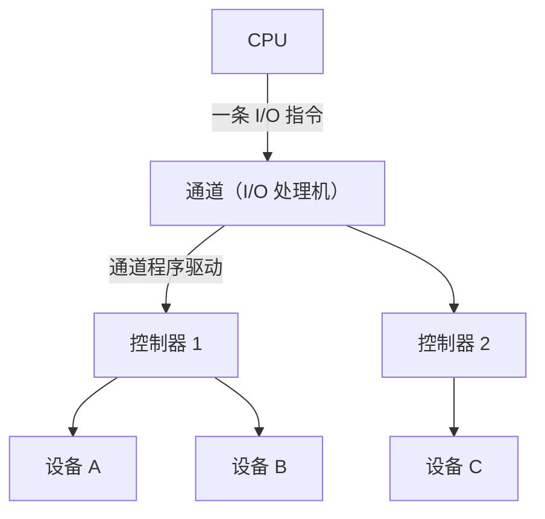

# 第 9 章：I/O 管理

> I/O 管理在 408 中重要度 ⭐⭐⭐，以选择题为主，但**缓冲时间计算**和**磁盘调度计算**是计算题常客，综合题也可能结合[第 8 章（文件管理）](08-file-management.md)的文件物理结构一起考。本章内容"概念多、计算少而精"：四种 I/O 控制方式的对比、I/O 软件层次、SPOOLing 靠理解记忆；缓冲公式和磁盘调度靠动手算。建议 2-3 小时学完概念，再用 1 小时把例题和自测题全部亲手验算一遍。

---

## 9.1 I/O 设备分类

### 按使用特性分类

| 类别 | 说明 | 典型设备 |
|------|------|---------|
| **人机交互类设备** | 用于用户与计算机交互，输入/输出信息 | 键盘、鼠标、显示器、打印机 |
| **存储设备** | 长期保存数据，容量大、速度较慢 | 磁盘、磁带、固态硬盘 |
| **网络通信设备** | 用于计算机之间的数据通信 | 网卡、调制解调器 |

### 按信息交换单位分类

| 类别 | 交换单位 | 特点 | 典型设备 |
|------|---------|------|---------|
| **块设备** | 数据块（block） | 可寻址、传输速率高、常采用 DMA 方式传输 | 磁盘、SSD |
| **字符设备** | 字节（byte） | 不可寻址、以字节流方式顺序读写、常采用中断方式 | 键盘、鼠标、打印机 |

> 选择题陷阱：**磁盘是块设备，键盘/打印机是字符设备**。注意"按速率分类"（低速/中速/高速）也偶有出现，与上面两种分类角度别混淆。

---

## 9.2 I/O 控制方式

四种控制方式体现了 CPU 干预程度逐步降低、并行程度逐步提高的演进过程。

### 1. 程序直接控制（轮询 / 忙等）

CPU 不断循环查询 I/O 设备状态寄存器，直到设备就绪才进行一个单位（通常是一个字/字节）的数据传输。

- **传输单位**：字/字节，每传一个单位都要 CPU 全程参与
- **缺点**：CPU 与设备**串行**工作，忙等（busy-waiting）浪费大量 CPU 时间
- **适用**：简单系统、极低速的控制场景

### 2. 中断驱动

设备完成一个数据单位（字节）的传输后主动向 CPU 发中断，CPU 在中断服务程序中取走数据。CPU 不必忙等，可执行其他程序。

- **传输单位**：字节，每传一个字节中断一次
- **优点**：CPU 利用率提高，I/O 与计算可并行
- **缺点**：**中断频繁**，每次中断都有现场保护/恢复开销，不适合高速块设备

### 3. DMA（直接存储器存取）

DMA 控制器接管总线，直接在**设备与内存**之间传输一整块数据，不需要 CPU 逐字节搬运。

- **传输单位**：**数据块**（一次传一块，如磁盘的一个扇区组）
- CPU 只在**传输开始**（初始化 DMA 控制器）和**传输结束**（处理一次 DMA 中断）时介入
- 内存访问方式：**停止 CPU 访问内存**（DMA 独占总线）或**周期窃取**（DMA 与 CPU 交替访存，每次窃取一个存取周期）
- 数据传输由硬件 DMA 控制器完成，**不占 CPU**，但需要内存地址寄存器等硬件支持

> 易错点：**DMA 方式仍然需要中断**——整块数据传完后，DMA 控制器发一次中断通知 CPU。"DMA 完全不需要中断"是错误说法。DMA 细节（周期窃取、预处理/后处理）见[计组第 7 章（I/O 系统）](../../computer-organization/doc/07-io-system.md)。

### 4. 通道控制

通道（Channel）是一种**专用的 I/O 处理机（硬件）**，可以执行内存中的**通道程序**（由通道指令组成），独立控制 I/O 操作。一个通道可管理多个控制器，一个控制器可挂多个设备，形成四级结构：

- CPU 只需发一条 I/O 指令，通道执行完整个通道程序后再以中断通知 CPU
- 相当于"增强版 DMA"：一个通道 = 多个 DMA 控制器的管理者，可组织复杂的成批 I/O
- 并行性最高，适用于大型机、服务器

> 易错点：**通道是硬件（专用处理机），不是软件**；通道程序存放在内存中，由通道（而非 CPU）执行。

### 四种方式对比（必背）

| 控制方式 | CPU 干预程度 | 传输单位 | 中断频率 | 适用场景 |
|---------|------------|---------|---------|---------|
| 程序直接控制 | 最高（全程忙等） | 字/字节 | 无中断 | 早期/简单系统 |
| 中断驱动 | 较高（每字节一次中断） | 字节 | 很高 | 低速字符设备 |
| DMA | 低（仅开始和结束介入） | 数据块 | 每块一次 | 高速块设备（磁盘） |
| 通道控制 | 最低（一条 I/O 指令） | 成组数据块 | 每组一次 | 大型机、高吞吐 I/O |

> 记忆线索：**干预程度递减，传输粒度递增，并行度递增**。选择题常问"哪种方式按字节中断""哪种方式 CPU 只介入两次"。

---

## 9.3 I/O 应用程序接口

| 接口类型 | 面向设备 | 访问方式 | 典型系统调用 |
|---------|---------|---------|-------------|
| 字符设备接口 | 键盘、显示器 | 按字节流读写，不可寻址 | `read` / `write` |
| 块设备接口 | 磁盘、SSD | 按块读写，可按块号寻址 | `read` / `write`（按块） |
| 网络设备接口 | 网卡 | 按报文收发 | socket：`send` / `recv` |

### 阻塞 I/O vs 非阻塞 I/O

| 模式 | 行为 | 特点 |
|------|------|------|
| **阻塞 I/O** | 进程发起 I/O 后被挂起，直到操作完成才返回 | 编程简单，是多数系统调用的默认模式 |
| **非阻塞 I/O** | 调用立即返回（成功则给出数据，未就绪则返回错误码） | 进程可继续执行，需轮询或配合 I/O 多路复用 |

> 阻塞 I/O 中进程处于**阻塞态**（见[第 2 章（进程与线程）](02-process-threads.md)），让出 CPU 而不是忙等——这正是引入中断驱动的意义。

---

## 9.4 I/O 软件层次

自下而上分为四层，越往上越通用、越远离硬件：

| 层次（自下而上） | 主要职责 |
|----------------|---------|
| **中断处理程序** | 处理 I/O 完成中断/设备异常，唤醒等待该设备的驱动程序或进程 |
| **设备驱动程序** | 与具体硬件强相关；设置设备寄存器、向控制器发命令、启动传输 |
| **设备无关 I/O 软件** | 所有设备共用的功能：设备命名与保护、块大小适配、**缓冲管理**、**设备分配与释放**、错误报告 |
| **用户层 I/O 软件** | 用户态 I/O 库函数（如 `printf`）、**SPOOLing**（假脱机）进程 |

> 易错点：**缓冲、设备分配、设备命名都在"设备无关 I/O 软件"层**完成；而启动具体设备、等待中断的细节在**设备驱动程序**层。选择题常考某个功能属于哪一层。

---

## 9.5 设备分配与回收

### 数据结构（四张表及链接关系）

| 表 | 数量 | 主要记录内容 |
|----|------|------------|
| 系统设备表（SDT） | 全系统一张 | 每类/每台设备一项：类型、标识、状态、指向 DCT 的指针 |
| 设备控制表（DCT） | 每台设备一张 | 设备类型、标识、状态、等待队列、指向所属控制器（COCT）的指针 |
| 控制器控制表（COCT） | 每个控制器一张 | 控制器标识、状态、等待队列、指向所属通道（CHCT）的指针 |
| 通道控制表（CHCT） | 每个通道一张 | 通道标识、状态、使用该通道的控制器队列 |

链接关系：**SDT → DCT → COCT → CHCT**，上级表通过指针找到下级表，分配设备时沿链检查"设备 → 控制器 → 通道"是否都可用。

### 分配方式与设备属性

| 分类角度 | 类型 | 说明 |
|---------|------|------|
| 分配时机 | 静态分配 | 进程运行前一次性分配所需全部设备，运行期间独占（类似死锁预防的"一次性分配"） |
| | 动态分配 | 运行中按需申请、用完即还，设备利用率高但需防死锁 |
| 设备属性 | **独占设备** | 一段时间内只能分配给一个进程（如打印机），易引发死锁 |
| | **共享设备** | 可宏观上同时分配给多个进程交替使用（如磁盘） |
| | **虚拟设备** | 用 SPOOLing 技术把独占设备模拟成多个逻辑设备（见 9.7） |

### 分配的安全性

独占设备 + 动态分配可能产生死锁（如进程 A 占打印机请求磁带，进程 B 占磁带请求打印机）。保证分配安全性的常用手段：

- **静态分配**（破坏"请求与保持"条件）
- 对设备**按序编号、按序申请**（破坏"循环等待"条件）
- 及时回收 + 死锁检测（见[第 5 章（死锁）](05-deadlock.md)）

---

## 9.6 缓冲技术（核心计算）

### 引入缓冲的三个目的

1. **缓和 CPU 与 I/O 设备速度不匹配的矛盾**
2. **减少对 CPU 的中断频率**，减轻 CPU 负担
3. **解决数据粒度不匹配**的问题（如网络包与磁盘块大小不同）

### 四种缓冲形式

| 形式 | 说明 |
|------|------|
| 单缓冲 | 内存中只设一个缓冲区，设备与用户进程对该缓冲区的访问需串行协调 |
| 双缓冲 | 设两个缓冲区交替使用：设备向一块输入时，进程可处理另一块 |
| 循环缓冲 | 多个大小相等的缓冲区首尾相连成环，用两个指针（in/out）指示空/满位置 |
| 缓冲池 | 系统公用的缓冲队列集合，含**空缓冲队列、满输入队列、空输出队列、满输出队列**四类队列，供输入/输出进程共享 |

### 时间参数定义（务必先看清题目字母含义）

本章约定：

| 符号 | 含义 |
|------|------|
| $T$ | 设备将一块数据**传送到缓冲区**的时间 |
| $M$ | 进程将数据**从缓冲区复制到用户工作区**的时间 |
| $C$ | CPU 对该块数据**进行计算**的时间 |

> 注意教材版本差异：**有的版本把 $M$ 与 $T$ 的字母互换**（ $M$ 表示传送到缓冲、 $T$ 表示缓冲到用户区），此时单缓冲公式应写成 $\max(C, M) + T$ 。公式本身不变：**串行的是"输入 + 复制"，能与下一块"输入"并行的是本块的"计算"**。考试时以题目给出的字母定义为准。

### 缓冲时间公式

**单缓冲**：输入 $T$ 与复制 $M$ 必须串行（共用同一缓冲区）；本块 CPU 计算 $C$ 可与下一块输入 $T$ 并行。处理一块数据的时间：

$$
T_{单} = \max(C, T) + M
$$

**双缓冲（理想情形）**：输入、复制、计算三个阶段流水并行，处理一块数据的时间取决于最慢的阶段：

$$
T_{双} = \max(C, M, T)
$$

> 适用条件提醒：双缓冲公式成立的前提是**相邻两块的"复制到工作区"与"CPU 计算"能够并行推进**（理想流水）。若题目强调工作区只有一个且复制与计算严格串行，则瓶颈变为 $M + C$ ，此时每块时间为 $\max(T, M + C)$ 。绝大多数 408 题目按理想公式 $\max(C, M, T)$ 计算即可，但心里要清楚它的前提。

---

## 9.7 SPOOLing 技术（假脱机）

SPOOLing（Simultaneous Peripheral Operations On-Line）用软件 + 共享存储把**独占设备改造成共享设备**。

### 组成

| 组成部分 | 位置/作用 |
|---------|----------|
| 输入井 / 输出井 | 磁盘上的两个大存储区：输入井暂存输入数据，输出井暂存待输出结果 |
| 输入缓冲区 / 输出缓冲区 | 内存中各一块，用于设备与井之间的数据中转 |
| 输入进程 / 输出进程 | 模拟脱机输入/输出：输入进程把数据从设备经缓冲区送入输入井；输出进程把输出井数据经缓冲区送往设备 |

### 打印机 SPOOLing 示例

打印机是独占设备。SPOOLing 后：各进程"打印"时只是把输出数据写入**输出井**（得到一份逻辑上的打印请求），随即返回继续运行；**输出进程**在打印机空闲时逐个把输出井中的数据送往打印机。对每个用户进程而言，好像各自独占了一台打印机。

SPOOLing 的实现前提：**大容量磁盘**（存放输入井/输出井）和**支持多道程序设计的操作系统**（用输入/输出进程与用户进程并发执行）。

> 本质：**以共享设备 + 软件方式模拟独占设备**，把独占设备变成每个用户感觉上的"虚拟设备"。这与虚拟内存（见[第 7 章（虚拟内存）](07-virtual-memory.md)）一样，是"虚拟"思想的应用。易错点：输出进程由操作系统管理，**不是用户进程自己直接控制打印机**；"SPOOLing 提高了设备本身的物理速度"是错误说法——它提高的是设备**利用率**和用户响应速度。

---

## 9.8 磁盘与固态硬盘

### 磁盘结构与访问时间

磁盘由多个盘片组成，每个盘面划分为同心圆的**磁道**，磁道再划分为**扇区**；所有盘面上相同半径的磁道构成一个**柱面**。磁盘地址编址顺序为**柱面号 > 盘面号 > 扇区号**（原因见"减少延迟的方法"）。使用前需**格式化**（划分磁道扇区、写入控制信息）与**分区**（划分逻辑存储区、建立文件系统）。

访问时间由三部分组成：

$$
T_{访问} = T_{寻道} + T_{旋转延迟} + T_{传输}
$$

| 组成 | 公式/说明 | 影响因素 |
|------|----------|---------|
| 寻道时间 | $t_s = m \times n + s$ （ $m$ ：跨越一条磁道的时间， $n$ ：跨越磁道数， $s$ ：启动延迟）；题目也常直接给平均寻道时间 | 目标磁道与当前磁头位置的距离 |
| 旋转延迟 | 平均为**半圈**时间： $\dfrac{60}{2r}$ 秒（ $r$ ：转速，单位 rpm） | 磁盘转速 |
| 传输时间 | 传输字节数 / 传输速率；转一圈可读取一个磁道的数据 | 传输数据量、转速、磁道容量 |

> 寻道时间是三者中最大的一项（毫秒级），因此磁盘调度（减少寻道）是性能优化的重点。

### 磁盘调度算法

设请求队列、当前磁头位置与移动方向已知，各算法逐一如下。设盘面编号 0~199（后面例 3 使用）。

**1. FCFS（先来先服务）**：按请求到达顺序服务。公平、不会饥饿，但磁头来回摆动，平均寻道距离最大。

**2. SSTF（最短寻道时间优先）**：每次选择距当前磁头**最近**的请求。平均寻道距离小（贪心），但**不是全局最优**；对远端请求不公平，可能**饥饿**；新请求集中在当前磁道附近时会出现**磁臂粘着**（磁头长期停留在局部区域）。

**3. SCAN（扫描 / 电梯算法）**：磁头沿一个方向移动并服务途中请求，**到达磁盘端点**（0 或最大磁道）后才反向。不会饥饿，等待时间较均匀；缺点是无请求时也要扫到端点。

**4. C-SCAN（循环扫描）**：只沿一个方向服务，到端点后**快速返回**起始端再重新扫描。等待时间比 SCAN 更均匀（请求不会被"刚反向错过"），代价是回程开销。

**5. LOOK / C-LOOK（了解）**：SCAN 家族改进——不真正到达端点，**到达该方向最远的请求即反向**（C-LOOK 则跳回最小请求处），省去无请求区域的空扫。

| 算法 | 平均寻道距离 | 公平性/饥饿 | 特点 |
|------|------------|------------|------|
| FCFS | 最大 | 最公平，不饥饿 | 简单 |
| SSTF | 较小 | 不公平，**可能饿死远端请求** | 贪心、可能磁臂粘着 |
| SCAN | 中等 | 不饥饿 | 到端点才反向 |
| C-SCAN | 中等 | 不饥饿，等待更均匀 | 单向服务 + 回程 |
| LOOK/C-LOOK | 比 SCAN/C-SCAN 更小 | 不饥饿 | 到最远请求即反向 |

> 易错点对比：**SCAN 到端点才反向，LOOK 到最远请求即反向**；**C-SCAN 只单向服务，SCAN 双向服务**。SSTF 看似最优，但它只是局部贪心——既不能保证总移动距离最短，也不能防止饥饿。

### 减少磁盘延迟的方法

1. **交替编号（错开扇区）**：若读出一个扇区后还需时间把数据复制到内存并处理，则物理上把逻辑相邻扇区**错开若干个**编号，使处理完成时下一个逻辑扇区恰好转到磁头下（详见例 5）。
2. **磁盘地址结构设计**：编址顺序为**柱面号 > 盘面号 > 扇区号**。连续的数据尽量存放在同一柱面的不同盘面上——读完一个盘面只需电子切换磁头（几乎不耗时），避免寻道。
3. **数据预读**：利用局部性，读当前扇区时把后续若干扇区一并读入缓冲区。

### 固态硬盘（SSD）

| 特性 | 说明 |
|------|------|
| 读写单位 | **按页（page）读写**（典型 4~16 KB） |
| 擦除单位 | **按块（block）擦除**（一块含多页），且**写前必须先擦除** |
| 性能 | **读快写慢**：读无需擦除；写若目标页非空需"整块读出→修改→擦除→整块写回" |
| 寿命 | 擦写次数有限（有磨损上限），不能反复擦写同一块 |
| **磨损均衡（wear leveling）** | FTL 将写入尽量**均匀分散到各个块**，避免个别块先磨损坏掉 |
| FTL（闪存转换层） | 位于 SSD 控制器中的固件层，完成逻辑地址到物理页的映射、磨损均衡、垃圾回收（了解即可） |

> 易错点：SSD **没有机械部件，不存在寻道时间和旋转延迟**；随机读性能好，但随机写受"先擦后写"限制。"SSD 也需要磁盘调度"是错误说法。

---

## 9.9 典型例题

**例 1**（I/O 控制方式的 CPU 时间占用）：将内存中 1000 个字符送到打印机输出，打印机每输出一个字符需 1 ms。CPU 主频 1 GHz。方式一：程序直接控制（轮询），CPU 全程忙等；方式二：中断驱动，每输出完一个字符发一次中断，每次中断处理（含现场保护恢复）耗 1000 个时钟周期。分别求两种方式下 CPU 的时间占用率。

**解**：输出 1000 个字符总耗时 $1000 \times 1 \text{ ms} = 1 \text{ s}$ 。

- **轮询**：CPU 在整个 1 s 内不停查询打印机状态，无法执行其他任务，CPU 占用率 $= 100\%$ 。
- **中断**：共 1000 次中断，总开销 $1000 \times 1000 = 10^6$ 个时钟周期。主频 $10^9$ Hz，故占用 CPU 时间 $10^6 / 10^9 = 10^{-3} \text{ s} = 1 \text{ ms}$ ，占用率 $= 1 \text{ ms} / 1 \text{ s} = 0.1\%$ 。

> 同一任务，中断方式把 CPU 占用率从 100% 降到 0.1%——这就是中断驱动的意义。若改用 DMA/通道，中断次数进一步降到 1 次（整块传完才中断）。

**例 2**（单缓冲 vs 双缓冲）：将数据块从磁盘输入缓冲区耗时 $T = 100 \text{ μs}$ ，从缓冲区复制到用户工作区耗时 $M = 20 \text{ μs}$ ，CPU 计算一块数据耗时 $C = 50 \text{ μs}$ 。求：(1) 单缓冲与双缓冲处理一块数据的时间；(2) 连续处理 10 块数据的总时间。

**解**：

(1) 单缓冲： $T_{单} = \max(C, T) + M = \max(50, 100) + 20 = 120 \text{ μs}$ 。

双缓冲（理想）： $T_{双} = \max(C, M, T) = \max(50, 20, 100) = 100 \text{ μs}$ 。

(2) 第一块数据必须依次经历"输入 → 复制 → 计算"，耗时 $T + M + C = 170 \text{ μs}$ ；之后系统进入稳定流水状态，每增加一块耗时等于每块处理时间。

- 单缓冲： $170 + 9 \times 120 = 1250 \text{ μs}$ 。
- 双缓冲： $170 + 9 \times 100 = 1070 \text{ μs}$ 。

> 本例输入耗时 $T$ 最大，是系统瓶颈：单缓冲时每块还需额外付出一次复制时间 $M$ ，双缓冲则把它隐藏进了流水中。若改为 $C = 150 \text{ μs}$ （计算最重），则单缓冲每块 $= \max(150, 100) + 20 = 170 \text{ μs}$ ；双缓冲理想值 $150 \text{ μs}$ ，但若复制与计算因工作区冲突而严格串行，实际瓶颈为 $M + C = 170 \text{ μs}$ ，双缓冲就失去优势——这就是双缓冲公式的适用条件。

**例 3**（磁盘调度，教材经典数据）：请求队列为 98, 183, 37, 122, 14, 124, 65, 67，磁头初始位于 53，磁道范围 0~199，初始移动方向为磁道号增大方向。分别用 FCFS、SSTF、SCAN、C-SCAN、LOOK 求服务顺序与总寻道距离。

**解**：

- **FCFS**：顺序 98, 183, 37, 122, 14, 124, 65, 67。
  移动： $45 + 85 + 146 + 85 + 108 + 110 + 59 + 2 = 640$ ，平均 $640/8 = 80$ 。
- **SSTF**：每次选最近请求，顺序 65, 67, 37, 14, 98, 122, 124, 183。
  移动： $12 + 2 + 30 + 23 + 84 + 24 + 2 + 59 = 236$ ，平均 $29.5$ 。
- **SCAN**：先向大号方向扫到端点 199 再反向。顺序 65, 67, 98, 122, 124, 183, （199）, 37, 14。
  移动： $12 + 2 + 31 + 24 + 2 + 59 + 16 + 162 + 23 = 331$ 。
- **C-SCAN**：单向服务到 199，返回 0 后再向大号方向服务。顺序 65, 67, 98, 122, 124, 183, （199 → 0）, 14, 37。
  计入回程移动： $146 + 199 + 14 + 23 = 382$ ；若题目约定回程不计入寻道距离，则为 $146 + 14 + 23 = 183$ 。
- **LOOK**：到该方向最远请求 183 即反向，不去 199。顺序 65, 67, 98, 122, 124, 183, 37, 14。
  移动： $12 + 2 + 31 + 24 + 2 + 59 + 146 + 23 = 299$ 。
- **C-LOOK**（了解）：服务到 183 后跳回最小请求 14 继续。服务移动 $130 + 23 = 153$ （若计入 $183 \to 14$ 的跳跃则再加 169，为 322）。

> SSTF（236）远好于 FCFS（640），但它只是贪心结果，且不保证最优：若 183 附近长时间没有新请求而 14 附近不断来新请求，183 可能被无限推迟（饥饿）。SCAN/LOOK 通过方向性扫描解决了公平性问题。

**例 4**（磁盘访问时间）：某磁盘转速 6000 rpm，平均寻道时间 5 ms，每磁道 200 个扇区，扇区大小 512 B。求：(1) 随机读取一个扇区的平均访问时间；(2) 从随机位置开始连续读取 10 个相邻扇区的平均访问时间。

**解**：旋转一圈时间 $= 60 / 6000 = 10 \text{ ms}$ ；平均旋转延迟 $= 10 / 2 = 5 \text{ ms}$ ；读一个扇区的传输时间 $= 10 / 200 = 0.05 \text{ ms}$ 。

(1) $T = 5 + 5 + 0.05 = 10.05 \text{ ms}$ 。

(2) 寻道与旋转延迟只需一次（对第一个扇区），之后 10 个扇区连续转过磁头： $T = 5 + 5 + 10 \times 0.05 = 10.5 \text{ ms}$ 。

> 对比可见**连续读远比随机读划算**——这正是文件系统尽量把文件连续存放、按柱面编址的原因。若题目给出寻道公式 $t_s = m \times n + s$ ，则代入跨越磁道数 $n$ 计算，例如 $m = 0.2 \text{ ms}$ 、 $s = 2 \text{ ms}$ 、 $n = 10$ 时 $t_s = 0.2 \times 10 + 2 = 4 \text{ ms}$ 。

**例 5**（交替编号）：某磁盘一个磁道划分为 8 个扇区（编号 1~8），每个扇区读出耗时 2 ms（即转一圈 16 ms）。每读出一个扇区后需 4 ms 将数据送入内存并处理，处理期间磁盘照常旋转。求：(1) 不采用交替编号时，依次读完该磁道 8 个扇区需要多少时间？(2) 采用合适的交替编号后需要多少时间？

**解**：

(1) 读完扇区 1（2 ms）后开始处理（4 ms），处理期间磁盘又转过 2 个扇区，磁头已来到扇区 4 的起始处，必须再等扇区 1 转到磁头下才能重读——**每读一个扇区实际上要等一整圈**： $8 \times 16 = 128 \text{ ms}$ 。

(2) 处理耗时 4 ms $=$ 转过 2 个扇区的时间，因此让**逻辑相邻的扇区在物理上错开 3 个位置**（中间隔 2 个扇区）：逻辑 1~8 依次存放在物理扇区 1, 4, 7, 2, 5, 8, 3, 6。这样处理完当前扇区时，下一逻辑扇区恰好转到磁头下，无需等待。每块耗时 $= 2 + 4 = 6 \text{ ms}$ ，总计 $8 \times 6 = 48 \text{ ms}$ 。

> 交替编号把 128 ms 降到 48 ms。解题套路：先算"处理时间折合几个扇区"，错开的扇区数 $=$ 处理折合扇区数 $+ 1$ （本题 $2 + 1 = 3$ ），再验证总时间。

### 解题技巧总结

- 看到"缓冲 + 三个时间参数"→ 先确认字母定义，再套单缓冲 $\max(C, T) + M$ 、双缓冲 $\max(C, M, T)$
- 看到"请求队列 + 磁头位置 + 移动方向"→ 画数轴，逐次标记服务顺序并累加距离，注意 SCAN/C-SCAN 的端点与回程约定
- 看到"转速 rpm"→ 一圈 $60/r$ 秒，平均旋转延迟取其一半
- 看到"交替编号"→ 处理时间折合扇区数，错开位置 $=$ 折合数 $+ 1$ ，再按"每块读取 + 处理时间"求总时间
- 看到"轮询 vs 中断"→ 轮询按全程忙等算占用率；中断按"中断次数 × 每次开销"算 CPU 时间

### 常见陷阱清单

1. **缓冲公式字母**：不同教材 $T$ 、 $M$ 含义可能互换，动笔前先确认题目定义
2. **双缓冲公式适用条件**： $\max(C, M, T)$ 要求传输与计算能真正流水并行；复制与计算严格串行时瓶颈是 $M + C$
3. **SSTF 不是最优算法**：只是局部贪心，且会饿死远端请求、产生磁臂粘着
4. **SCAN 与 LOOK 的反向位置**：SCAN 到磁盘端点才反向，LOOK 到最远请求即反向
5. **DMA 仍需要中断**：整块传完后发一次 DMA 中断；"DMA 无中断"错误
6. **通道是硬件**：是专用 I/O 处理机，通道程序由通道执行而非 CPU
7. **SSD 无寻道/旋转延迟**：磁盘调度算法对 SSD 无意义

---

## 本章小结

### 核心要点回顾

1. **设备分类**：按使用特性（人机交互/存储/网络通信）、按交换单位（块设备/字符设备）
2. **四种 I/O 控制方式**：轮询（忙等）→ 中断（按字节）→ DMA（按数据块，CPU 只介入开始/结束）→ 通道（通道程序，四级结构），CPU 干预递减
3. **I/O 软件四层**：中断处理程序 → 设备驱动程序 → 设备无关 I/O 软件（缓冲、分配在此层）→ 用户层 I/O 软件
4. **设备分配**：SDT → DCT → COCT → CHCT 四级表链接；独占/共享/虚拟设备；安全性防死锁
5. **缓冲计算**：单缓冲 $\max(C, T) + M$ ，双缓冲理想 $\max(C, M, T)$ （ $T$ = 设备→缓冲， $M$ = 缓冲→工作区， $C$ = CPU 计算）
6. **SPOOLing**：输入井/输出井 + 缓冲区 + 输入/输出进程，本质是独占设备 → 虚拟共享设备
7. **磁盘访问时间** = 寻道 + 旋转延迟（平均半圈）+ 传输；调度算法 FCFS / SSTF / SCAN / C-SCAN / LOOK
8. **减少延迟**：交替编号、柱面 > 盘面 > 扇区编址、预读；SSD 按页读写按块擦除、磨损均衡

### 考试重点排序

| 优先级 | 考点 | 题型 |
|--------|------|------|
| ⭐⭐⭐ | 缓冲时间计算（单/双缓冲） | 选择/综合题 |
| ⭐⭐⭐ | 磁盘调度算法移动距离计算 | 选择题 |
| ⭐⭐⭐ | 四种 I/O 控制方式对比 | 选择题 |
| ⭐⭐ | 磁盘访问时间计算、交替编号 | 选择题 |
| ⭐⭐ | I/O 软件层次功能归属、SPOOLing 组成 | 选择题 |
| ⭐ | 设备分配数据结构、SSD 特性 | 选择题 |

> 本章与[第 8 章（文件管理）](08-file-management.md)的磁盘空间管理、文件物理结构共同构成"磁盘相关"考点群，建议合并复习；DMA 与通道的硬件细节参见[计组第 7 章（I/O 系统）](../../computer-organization/doc/07-io-system.md)。

---

## 自测题

1. 四种 I/O 控制方式中，CPU 干预程度如何排序？DMA 方式下 CPU 何时介入？
2. 缓冲管理、设备命名、设备分配属于 I/O 软件四层中的哪一层？
3. 引入缓冲技术的三个目的是什么？
4. 设 $T = 100 \text{ μs}$ 、 $M = 20 \text{ μs}$ 、 $C = 50 \text{ μs}$ （本章字母约定），单缓冲处理一块数据需要多少时间？
5. SSTF 为什么可能导致"饥饿"？它与磁臂粘着有什么关系？
6. 磁盘地址为什么按"柱面号 > 盘面号 > 扇区号"的顺序编址？
7. SSD 为什么要"先擦后写"？磨损均衡解决什么问题？

> **答案**：1. 程序直接控制 > 中断驱动 > DMA > 通道控制；DMA 下 CPU 仅在传输开始时初始化 DMA 控制器、传输结束时处理一次 DMA 中断。2. 设备无关 I/O 软件层。3. 缓和 CPU 与设备速度不匹配、减少中断频率、解决数据粒度不匹配。4. $\max(50, 100) + 20 = 120 \text{ μs}$ 。5. SSTF 总是优先服务离磁头最近的请求，若近处请求源源不断地到来，远端请求会被无限推迟；磁臂粘着是其极端表现——磁头长时间停留在某一小片区域服务局部请求。6. 连续数据尽量落在同一柱面：读完一个盘面只需电子切换磁头（几乎零耗时），避免代价高昂的寻道。7. 闪存只能按块擦除、按页写入，覆盖写必须先擦除整块；擦写次数有限，磨损均衡把写入均匀分散到各块，避免个别块过早磨损。
