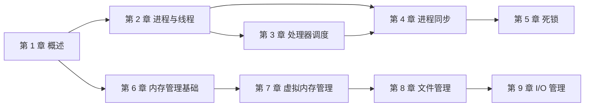

# 操作系统学习大纲（408 考研）

> 按照全国硕士研究生招生考试计算机学科专业基础（408）操作系统部分设计。覆盖进程管理、内存管理、文件管理、I/O 管理四大核心模块，侧重概念理解、算法计算和综合分析。

---

## 📌 元信息

| 项目 | 说明 |
|------|------|
| **考试大纲** | 408 计算机学科专业基础 — 操作系统部分（依据 2026 版大纲；2027 版预计 2026 年 9 月发布，近两年 OS 考点无实质变动，届时核对即可） |
| **分值占比** | 约 35 分 / 150 分（选择题第 23-32 题共 10 题 20 分；综合应用题通常 1-2 题，多为第 45/46 题，共约 15 分） |
| **目标读者** | 408 考研备考者、需要系统掌握 OS 原理的开发者 |
| **前置知识** | 计算机组成原理（中断、DMA、存储层次）、C 语言基础 |
| **配套教材** | 汤小丹《计算机操作系统》（第四版）/ 王道考研操作系统 |

---

## 🎯 学习目标

完成本模块学习后，你应该能够：

1. 准确描述操作系统的四大特征（并发、共享、虚拟、异步）及运行环境
2. 掌握进程/线程模型、调度算法的计算与分析
3. 熟练运用 PV 操作解决经典同步互斥问题
4. 掌握死锁的判定、预防、避免（银行家算法）
5. 理解分页/分段/虚拟内存机制，能完成地址变换与页面置换计算
6. 掌握文件物理结构与磁盘调度算法
7. 理解 I/O 控制方式与缓冲技术

---

## 📋 408 考纲知识点分布

| 章节 | 核心考点 | 题型倾向 | 重要度 |
|------|---------|---------|--------|
| 操作系统概述 | 内核态/用户态、中断/异常、系统调用 | 选择题 | ⭐⭐ |
| 进程管理 | 调度算法、PV 操作、死锁 | 选择 + 综合题 | ⭐⭐⭐⭐⭐ |
| 内存管理 | 页表/地址变换、页面置换算法 | 选择 + 综合题 | ⭐⭐⭐⭐⭐ |
| 文件管理 | 文件物理结构、混合索引寻址计算 | 选择 + 综合题 | ⭐⭐⭐ |
| I/O 管理 | I/O 控制方式、磁盘调度、缓冲计算 | 选择 + 综合题 | ⭐⭐⭐ |

---

## 🗺️ 学习路径

| 阶段 | 主题 | 产出 |
|------|------|------|
| **第 1 章** | 操作系统概述 | 理解 OS 定位、内核态/用户态切换机制、系统调用 |
| **第 2 章** | 进程与线程 | 掌握进程状态转换、PCB、线程模型 |
| **第 3 章** | 处理器调度 | 能计算 FCFS/SJF/RR/优先级/多级反馈队列的周转时间 |
| **第 4 章** | 进程同步 | 能用 PV 操作解决生产者-消费者、读者-写者、哲学家进餐、前驱图 |
| **第 5 章** | 死锁 | 掌握银行家算法、死锁检测与解除 |
| **第 6 章** | 内存管理基础 | 理解连续分配、分页/分段地址变换 |
| **第 7 章** | 虚拟内存管理 | 掌握请求分页、页面置换算法（OPT/FIFO/LRU/Clock）、工作集 |
| **第 8 章** | 文件管理 | 掌握文件物理结构、目录、磁盘空间管理 |
| **第 9 章** | I/O 管理 | 理解 I/O 控制方式、缓冲技术、磁盘调度 |

各章依赖关系（建议沿依赖链递进学习，不要跳章）：



---

## 📚 文档目录规划

```text
src/computer-science/operating-system/
├── os-learning-outline.md                    # 本文件（学习大纲）
├── doc/
│   ├── 01-introduction.md                    # 操作系统概述
│   ├── 02-process-threads.md                 # 进程与线程
│   ├── 03-scheduling.md                      # 处理器调度
│   ├── 04-sync-mutex.md                      # 进程同步（含互斥）
│   ├── 05-deadlock.md                        # 死锁
│   ├── 06-memory-foundation.md               # 内存管理基础
│   ├── 07-virtual-memory.md                  # 虚拟内存管理
│   ├── 08-file-management.md                 # 文件管理
│   └── 09-io-management.md                   # I/O 管理（含磁盘调度）
└── assets/                                   # 图表、示意图
```

---

## 📖 各章知识点细化

### 第 1 章：操作系统概述

- 操作系统的概念、目标、功能
- 四大特征：并发、共享、虚拟、异步
- 发展与分类：批处理 → 分时 → 实时 → 通用
- 运行环境：
  - 内核态（核心态）与用户态
  - 中断与异常（内中断/外中断）
  - 系统调用（用户程序**主动**进入内核态的唯一途径；中断/异常也会触发态切换，但非用户程序主动发起）
- 体系结构：大内核 vs 微内核（另了解分层、模块化、外内核）
- 操作系统引导：BIOS/UEFI、bootloader、内核加载与初始化
- 虚拟机：概念、Type-1/Type-2 虚拟机监控器（了解）

### 第 2 章：进程与线程

- 进程的概念与组成（PCB + 程序段 + 数据段）
- 进程的特征：动态性、并发性、独立性、异步性
- 进程状态与转换：
  - 五状态模型：创建 → 就绪 → 运行 → 阻塞 → 终止
  - 状态转换条件（调度、I/O 请求、I/O 完成、时间片用完）
- 进程控制：创建（fork）、撤销、阻塞、唤醒
- 进程通信：
  - 共享存储
  - 消息传递（send/receive）
  - **管道（pipe）**：半双工、同一时刻仅允许一个进程访问（互斥）、**408 选择题常考管道的特性**
  - 信号（signal）：异步通知机制（了解）
- 线程：
  - 线程 vs 进程（资源共享、调度单位）
  - 多线程模型：ULT、KLT、多对一、一对一、多对多

### 第 3 章：处理器调度

- 三级调度：高级（作业）、中级（内存）、低级（进程）
- 调度时机与方式：非抢占 vs 抢占
- 调度算法：
  - FCFS（先来先服务）
  - SJF（短作业优先）/ SRTN（最短剩余时间优先）
  - HRRN（高响应比优先）：响应比 = (等待时间 + 服务时间) / 服务时间 = 1 + 等待时间 / 服务时间
  - RR（时间片轮转）
  - 优先级调度（静态/动态、抢占/非抢占）
  - 多级反馈队列
- 性能指标：周转时间、带权周转时间、等待时间、响应时间
- 上下文及其切换机制：上下文组成、切换时机与开销（与第 2 章进程控制呼应）
- 多处理机调度（了解概念即可）

### 第 4 章：进程同步

- 临界区与临界资源
- 临界区访问规则（空闲让进、忙则等待、有限等待、让权等待）
- 互斥实现：
  - 软件方法（Peterson 算法）
  - 硬件方法（关中断、TestAndSet、Swap）
- 锁（Lock）：互斥锁的基本思想（与信号量的对比）
- 信号量机制：
  - 整型/记录型信号量
  - P 操作（wait）/ V 操作（signal）
  - 用信号量实现互斥与同步
- 经典同步问题：
  - 生产者-消费者问题
  - 读者-写者问题（读者优先 / 写者优先）
  - 哲学家进餐问题（死锁预防策略）
  - 前驱图问题（用 PV 操作描述前驱关系，408 综合题常客）
- 管程（Monitor）：概念与基本结构、条件变量（wait/signal）

### 第 5 章：死锁

- 死锁的概念与必要条件：
  - 互斥、请求与保持、不可剥夺、循环等待
- 死锁预防：破坏四个必要条件之一
- 死锁避免：
  - 安全状态与不安全状态
  - 银行家算法（资源分配图、安全性算法）
- 死锁检测与解除：
  - 资源分配图化简
  - 解除策略：剥夺、撤销、回退
- 鸵鸟策略（忽略死锁）

### 第 6 章：内存管理基础

- 程序的装入与链接：
  - 绝对装入、可重定位装入、动态运行时装入
  - 静态链接、装入时动态链接、运行时动态链接
- 连续分配：
  - 单一连续分配
  - 固定分区分配（内部碎片）
  - 动态分区分配（首次适应、最佳适应、最坏适应、邻近适应）
  - 外部碎片与紧凑（compaction）
- 内存共享与内存保护：
  - 可重入代码（纯代码）的共享
  - 页表保护位、上下界寄存器
- 基本分页存储管理：
  - 页（页面）与页框（块）
  - 页表与地址变换机构
  - 逻辑地址 → 物理地址的计算
  - 快表（TLB）
  - 多级页表（解决页表过大问题）
- 基本分段存储管理：
  - 段表与地址变换
  - 分段 vs 分页（逻辑单位 vs 物理单位）
- 段页式管理

### 第 7 章：虚拟内存管理

- 虚拟内存的概念与特征：
  - 多次性、对换性、离散性
  - 局部性原理（时间局部性、空间局部性）
- 请求分页管理：
  - 页表项扩展（状态位、访问字段、修改位/脏位、外存地址）
  - 缺页中断
- 页面置换算法：
  - OPT（最佳置换，理论最优）
  - FIFO（先进先出，Belady 异常）
  - LRU（最近最久未使用）
  - NRU（最近未使用，按访问位/修改位分四类替换）
  - Clock（时钟算法，环形指针扫描近似 LRU，注意与 NRU 区分）
  - 改进型 Clock
- 页面分配与调入策略：
  - 固定分配局部置换
  - 可变分配全局置换
  - 可变分配局部置换
  - 页面调入策略（调入时机、调入位置、预取）
  - 页框分配与回收（2025 版大纲新增表述，可结合 PFF 缺页率反馈理解）
- 抖动（颠簸）与工作集：
  - 工作集模型
  - 缺页率与分配帧数的关系
- 内存映射文件（mmap）：将文件映射到进程地址空间，以内存读写代替 I/O 系统调用
- 虚拟存储器性能的影响因素及改进方法：页面大小、分配帧数、局部性、预取与页面缓存

### 第 8 章：文件管理

- 文件的概念与属性
- 文件的逻辑结构：
  - 无结构文件（流式）
  - 有结构文件（顺序、索引、索引顺序）
- 文件的物理结构：
  - 连续分配（顺序）
  - 链接分配（隐式链接、显式链接/FAT）
  - 索引分配（单级索引、多级索引、**混合索引**）
  - **i-node 混合索引寻址范围计算**（直接地址 + 一级间接 + 二级间接，408 综合题高频）
- 目录结构：
  - 单级、两级、树形、无环图
  - 路径名（绝对路径、相对路径）
- 文件存储空间管理：
  - 空闲表法
  - 空闲链表法
  - 位示图法（bitmap）
  - 成组链接法（UNIX）
- 文件共享与保护：
  - 硬链接与软链接（符号链接）
  - 存取控制矩阵、访问控制表
- 文件系统全局结构：
  - 文件系统在外存中的布局（引导块、超级块、inode 区、数据区）
  - 虚拟文件系统（VFS）：统一抽象层，屏蔽不同文件系统的差异
  - 文件系统挂载（mount）：挂载点与目录树的合并

> 注：磁盘调度算法按本知识库编排放在第 9 章（I/O 管理）中讲解。

### 第 9 章：I/O 管理

- I/O 设备分类：
  - 按使用特性：人机交互、存储、网络通信
  - 按信息交换单位：块设备、字符设备
- I/O 控制方式：
  - 程序直接控制（轮询）
  - 中断驱动
  - DMA 方式
  - 通道控制
- I/O 应用程序接口：字符设备接口、块设备接口、网络设备接口；阻塞/非阻塞 I/O
- I/O 软件层次：
  - 中断处理程序
  - 设备驱动程序
  - 设备无关 I/O 软件
  - 用户层 I/O 软件
- 设备分配与回收：
  - 设备控制表（DCT）、控制器表、通道表
  - 静态分配与动态分配、设备分配的安全性
- 缓冲技术：
  - 单缓冲、双缓冲
  - 循环缓冲、缓冲池
  - 缓冲时间计算（T 值分析）
- SPOOLing 技术（假脱机）：
  - 将独占设备改造为共享设备
  - 输入井/输出井、输入/输出缓冲区
- 磁盘与固态硬盘：
  - 磁盘结构、格式化、分区
  - 磁盘访问时间 = 寻道时间 + 旋转延迟 + 传输时间
  - **磁盘调度算法**：FCFS、SSTF（最短寻道时间优先）、SCAN（电梯算法）、C-SCAN（循环扫描）、LOOK / C-LOOK（计算磁道移动总数，选择题高频）
  - 减少磁盘延迟的方法（交替编号、磁盘地址结构设计）
  - SSD：读写性能特性（读快写慢、按块擦除）、磨损均衡

---

## 📐 高频计算题型

| 题型 | 涉及章节 | 关键公式/方法 |
|------|---------|--------------|
| 调度算法性能计算 | 第 3 章 | 周转时间 = 完成时间 - 到达时间；带权周转时间 = 周转时间 / 服务时间 |
| PV 操作设计 | 第 4 章 | 信号量初值设定、P/V 配对 |
| 银行家算法 | 第 5 章 | Need = Max - Allocation；安全性算法 |
| 页表地址变换 | 第 6 章 | 逻辑地址 = 页号 × 页大小 + 页内偏移 |
| 页面置换模拟 | 第 7 章 | 画出页面走向、统计缺页次数 |
| 磁盘调度计算 | 第 9 章 | 磁道移动总数、平均寻道时间 |
| 缓冲时间计算 | 第 9 章 | 单缓冲每块： $\max(C, T) + M$ ；双缓冲每块（理想）： $\max(C, M, T)$ （详见 doc） |

> 注：T = 从磁盘传送至缓冲区时间，C = CPU 处理时间，M = 从缓冲区传送至用户区时间。具体数值例题见 09-io-management.md

---

## ❓ 408 高频真题考点

1. **进程状态转换**：哪些转换不可能发生？（阻塞 → 运行 ✗）
2. **调度算法比较**：给定进程到达时间和服务时间，计算各算法的平均周转时间
3. **PV 操作**：生产者-消费者变体、读者-写者变体、前驱图的 PV 描述
4. **银行家算法**：判断安全状态、给出安全序列
5. **页表与 TLB**：给定页表，完成逻辑地址到物理地址的转换
6. **页面置换**：给定页面走向，用 FIFO/LRU 计算缺页次数
7. **文件物理结构**：索引节点（i-node）的寻址范围计算
8. **磁盘调度**：给定磁道请求序列，计算各算法的磁道移动总数

---

## ✅ 完成标准

- [ ] 能画出进程五状态模型并说明各转换条件
- [ ] 能用 FCFS/SJF/RR/优先级/多级反馈队列计算周转时间
- [ ] 能用 PV 操作解决至少 3 种经典同步问题
- [ ] 能用银行家算法判断系统安全状态
- [ ] 能完成分页地址变换（含 TLB 和多级页表）
- [ ] 能模拟页面置换并计算缺页率（能区分 NRU 与 Clock 算法）
- [ ] 能计算索引文件的寻址范围
- [ ] 能说明 VFS 的作用与文件系统挂载过程
- [ ] 能用 FCFS/SSTF/SCAN/C-SCAN 计算磁盘调度结果
- [ ] 能区分四种 I/O 控制方式的特点
- [ ] 能计算单缓冲/双缓冲的传输时间

---

## 🔗 关联模块

- 计算机组成原理：[computer-organization/](../computer-organization/) 中断机制、DMA、存储层次（Cache-主存-辅存）
- 实操互补：[deploy/linux/](../../deploy/linux/) — 第 2 章进程概念对应 `04-process-network-systemd.md` 的 ps/top 实操；第 1 章系统调用对应 Shell 命令的底层机制
- 网络协议：[networking/](../networking/) I/O 多路复用与网络编程

---

## 📝 学习建议

1. **进程管理是核心**：占 408 OS 分值约 40%，PV 操作和死锁几乎每年必考
2. **算法要动手算**：调度算法、银行家算法、页面置换不能只看，必须拿真题练
3. **PV 操作靠模式识别**：总结"互斥信号量初值 1、同步信号量初值 0"等基本模式，再做变体
4. **内存管理重计算**：页表地址变换、缺页中断处理流程是综合题常客
5. **文件与 I/O 概念多、计算少而精**：理解原理后记住关键结论即可，但 inode 混合索引、磁盘调度、缓冲计算仍是计算题常客，例题务必亲手算
6. **配合真题**：每章学完后做对应年份的 408 真题，检验掌握程度
