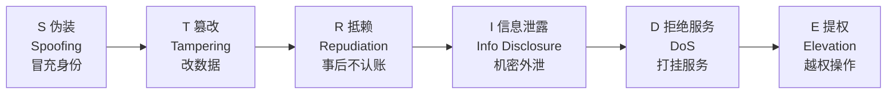

# 01 — 安全名词科普

> 全栈工程师视角的安全"词典总索引"。目标不是让你成为安全专员，而是：任何安全词汇出现时，你能用一句话说清"它是什么"，并知道这事跟你写代码有什么关系。

---

## 📌 元信息

| 项目 | 内容 |
|------|------|
| **模块** | 认知层 · 第 1 篇（全系列词典总索引） |
| **预计时间** | 40 分钟通读，之后随用随查 |
| **面试可答** | CVE/CVSS/CWE 是什么、渗透测试和红队别混为一谈、OWASP Top 10 十类一句话 |

---

## 1. 安全三要素：CIA（机密性 / 完整性 / 可用性）

一切安全名词，最后都能对号入座到这三个词之一：

| 要素 | 英文 | 一句话人话 | 被破坏的例子 |
|------|------|-----------|-------------|
| **机密性** | Confidentiality | 不该看到的人看不到 | 接口泄露他人手机号、明文密码被拖库 |
| **完整性** | Integrity | 不该改的东西改不了 | 充值金额被篡改、npm 包被投毒 |
| **可用性** | Availability | 该用的时候用得着 | 被 DDoS 打到服务宕机 |

> 💡 全栈直觉：你写接口时做的所有防越权、防注入，本质都是在维护 **C**；给数据加签名/哈希，是在维护 **I**；做限流、熔断、冗余部署，是在维护 **A**。

---

## 2. 视角术语：攻击者怎么看你

- **攻击面（Attack Surface）**：一个系统能被攻击者触达的"入口"总和。你暴露的每个接口、每个静态文件、每个依赖包、甚至每份错误日志，都是攻击面上的一个点。**代码审查 = 缩小攻击面**。
- **攻击向量（Attack Vector）**：攻击者实际"打进来的那条路"，比如一个不校验文件类型的上传接口、一个不过滤参数的回调。攻击面上有很多点，向量是具体被利用的那一条。
- **威胁建模（Threat Modeling）**：动手写代码前，先问"这个功能可能被谁、从哪个点、用什么方式攻击"，再决定要防什么。常用的记忆口诀是 **STRIDE**：

- **利用链（Exploit Chain）**：单个小漏洞往往不足以致命，攻击者会把多个弱点串起来（如：先 SSRF 打到内网 → 再读云元数据拿密钥 → 最后进 S3 拖数据）。这就是为什么"小洞也要补"。

---

## 3. 角色与流程：谁在干安全这摊事

| 名词 | 一句话人话 | 与你（开发）的关系 |
|------|-----------|-------------------|
| **渗透测试（Pentest）** | 规范授权的"模拟攻击"，在限定期限内按约定范围找漏洞并出报告 | 上线前的安全评审常会引入，报告里的条目发到你手上让你修 |
| **红队 / 蓝队** | 红队"演攻击方"、蓝队"演防守方"的红蓝对抗演练 | 大型企业/攻防演练（如护网）时，你负责的应用可能就是靶子 |
| **漏洞赏金（Bug Bounty）** | 厂商公开"欢迎来打，打中给钱" | 与你的关系主要是：安全研究者提交的问题会进入工单流 |
| **安全评审 / 安全 PRD** | 设计与上线前的安全审查环节，按清单核对有没有踩雷 | 记住"评审前自查" = 用 07 的检查表提前扫一遍 |
| **CNA（CVE 编号授权机构）** | 有权给你发现的漏洞分配 CVE 编号的组织 | 大厂/开源基金会多承担此角色，你作为开发者更多是"接收方" |

---

## 4. 编号体系：CVE / CWE / CVSS

这是安全圈"三大件"，也是你被 @ 时最先看到的三个缩写：

- **CVE（Common Vulnerabilities and Exposures）**：漏洞的"身份证号"。格式 `CVE-年份-序号`，如 `CVE-2021-44228`（Log4Shell）。只负责"给漏洞一个唯一编号"，不负责打分。
- **CWE（Common Weakness Enumeration）**：弱点的"分类学"。CVE 是"某个具体库的具体漏洞"，CWE-79（跨站脚本 XSS）、CWE-89（SQL 注入）是"这一类问题"。**CVE 是实例，CWE 是类别**。
- **CVSS（Common Vulnerability Scoring System）**：漏洞严重度的"打分系统"，0~10 分：

| 分数 | 等级 | 开发动作 |
|------|------|---------|
| 9.0~10.0 | Critical | 立刻响应，通常当天要出修复/缓解方案 |
| 7.0~8.9 | High | 优先进入排期，找出受影响面 |
| 4.0~6.9 | Medium | 正常排期，评估真实可达性 |
| 0.1~3.9 | Low | 记录追踪即可 |
| 0.0 | None | 无需处理 |

> ⚠️ **时效说明**：当前生态处于 **CVSS v3.1（2019）为主流、v4.0（2023 发布）过渡中**的状态——GitHub Advisory 已支持 v4.0，但 NVD 等多数来源仍主要给 v3.1 分。看到两套分数并存不用慌，先看等级（Critical/High）再看具体得分。

---

## 5. 行业清单：OWASP Top 10:2025（十类一句话）

OWASP Top 10 是全球公认的"网站十大安全风险"清单，不用背，但要"眼熟"。**详述 + 防御在 `04-web-attacks.md`**：

| 编号 | 风险 | 一句话人话 |
|------|------|-----------|
| A01 | 访问控制失效 | 用户能访问到不该访问的数据/功能（含 SSRF、越权） |
| A02 | 安全配置错误 | 默认口令、云桶公开、多余端口，"配置即暴露面" |
| A03 | 供应链失效 | 依赖、构建、分发链路被攻击（投毒的包、被黑的 CI） |
| A04 | 加密失效 | 明文传输、弱哈希、自己造加密 |
| A05 | 注入 | 输入拼进 SQL/命令/模板，被当成代码执行 |
| A06 | 不安全设计 | 信任边界画错（把前端校验当安全边界） |
| A07 | 认证失效 | 暴力破解、撞库、会话可被偷 |
| A08 | 软件与数据完整性失效 | 反序列化、签名缺失，数据被篡改不报错 |
| A09 | 安全日志与告警失效 | 出了事没有日志、没有告警，漏报 |
| A10 | 异常处理不当 | 报错信息泄露内部结构、异常没兜住导致崩溃 |

> ⚠️ 版本提示：2025 版是当前正式版（相对 2021 版的主要变化：新增 A03 供应链、A10 异常处理两个类目；SSRF 并入 A01；安全配置错误升至第 2）。

---

## 6. 高频事件词（新闻里每天见）

- **零日（Zero-day）**：漏洞被公开/被利用时，厂商还没来得及发补丁——"第 0 天"。打补丁前暴露期越长，风险越高。
- **数据泄露（Breach）**：敏感数据被未授权获取。对你而言：**假设性思维**——如果这个库/日志/缓存被拖走，损失是什么？这就是做脱敏的理由。
- **勒索软件（Ransomware）**：加密你的数据勒索赎金。防御重点是备份与最小权限，而不是只靠杀软。
- **社工 / 钓鱼（Social Engineering / Phishing）**：不打技术漏洞，攻"人"。不点陌生链接、不泄露验证码，是最便宜的防线。
- **撞库（Credential Stuffing）**：用别处泄露的"账号+密码"批量尝试登录你的系统。防御 = 强制强密码策略 + **MFA**（多因素认证）。

---

## 7. 工程启发：一份安全告警/报告，一句话该看什么

1. **什么资产/接口**（影响范围确定）→ 2. **CVE/CWE 归类**（问题类型确定）→ 3. **CVSS 等级**（优先级确定）→ 4. **受影响版本**（是否命中你的依赖）→ 5. **修复建议**（升级到什么版本/改什么写法）。

> 💡 别被满屏英文术语唬住：安全文档和代码 review 一样，只看"波及范围 → 严重等级 → 怎么修"三步就能拿到 80% 的信息量。

---

## 🆚 对比板块：渗透测试 vs 红队 vs 漏洞赏金

| 维度 | 渗透测试 | 红队对抗 | 漏洞赏金 |
|------|---------|---------|---------|
| 目标 | 找漏洞、出报告 | 模拟真实攻击者，突破到目标 | 激励研究者持续提交真实漏洞 |
| 范围 | 明确约定（某个系统/时间段） | 尽量接近真实（常不提前通知防守方） | 厂商公开划定范围 |
| 产出 | 漏洞清单 + 修复建议 | 攻防演习报告 | 逐个漏洞的提交与报酬 |
| 你的身份 | 评审对象 | 靶子或参与者 | 修复方 |

---

## ❓ 面试问答

> **问：CVE、CWE、CVSS 是什么关系？**
> **答：** CVE 是"具体漏洞的编号"（哪个库、哪个版本）；CWE 是"这类漏洞的分类"（XSS、注入…）；CVSS 是"针对 CVE 的严重度打分"（0~10）。类比：CVE=病历编号，CWE=疾病分类，CVSS=病情评分。

> **问：渗透测试和红队有什么区别？**
> **答：** 渗透测试是在约定范围内、约定时间内的"规范找洞"，核心产出是漏洞报告；红队是更接近真实攻击演进的对抗演练，防守方可能不知情，目标是检验整体检测与响应能力，而不是单纯出报告。

> **问：客户端传上来的参数做了校验，就算安全了吗？**
> **答：** 不算。前端校验只服务于体验，所有输入最终都必须在**服务端信任边界**上重新校验——攻击者可以绕过前端直接打接口（对应 A06 不安全设计）。

---

## 🎮 练习

**要求**：用自己的话向同事解释下面 15 个术语，每个不超过 3 句话。
CIA、攻击面、威胁建模、STRIDE、渗透测试、红队、CVE、CWE、CVSS、OWASP Top 10、零日、撞库、社工、CNA、利用链。

**提示**：用"一句话人话 + 一个你踩过的坑或见过的例子"结构；讲不出来的就是下一篇要查的。
**预期效果**：这 15 个词过完嘴，后续 02~07 阅读基本无障碍。

---

## 🔗 继续阅读

- 下一篇：[02-security-devices.md](02-security-devices.md) 安全设备与设施（企业安全设施科普）
- 详见：[04-web-attacks.md](04-web-attacks.md) OWASP Top 10 逐类详解
- 词表与本篇对应：[../security-learning-outline.md](../security-learning-outline.md)