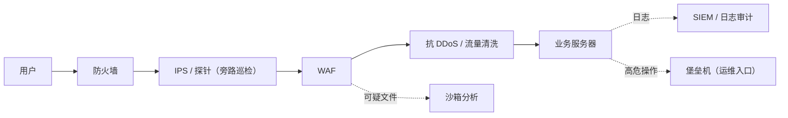

# 02 — 安全设备与设施（企业安全设施科普）

> 这一篇不是让你去部署这些设备，而是让你**认识它们**：部署、联调、排查时它们会和你"相遇"。目标很简单——看到名字不懵、知道它在请求链路上哪一环、大致管什么。全文可按需单独翻查，无需在系列学习中"必须经过"。

---

## 📌 元信息

| 项目 | 内容 |
|------|------|
| **模块** | 认知层 · 第 2 篇（独立词条，可随时翻查） |
| **预计时间** | 30 分钟通读 |
| **面试可答** | 堡垒机为什么必要、WAF/IDS/IPS 的区别、SIEM/探针/蜜罐各自干什么 |

---

## 1. 先建立一张"链路地图"

先有整体，再谈单点。一次普通的用户请求，在**企业级**环境里大致这样流动：

> 💡 你不一定每个都见过（小型团队可能只有防火墙 + 云厂商的 WAF），但**知道每家公司在哪一层补了什么，是理解"为什么我的接口要这样写"的钥匙**。

---

## 2. 网络分区：DMZ（隔离区）

**一句话人话**：把"必须对外开放的服务"和"绝不能对外暴露的资产"隔开的中间地带。

- 典型布局：**DMZ 放 Web/API/邮件网关**，数据库、内网管理后台、密钥仓库放**内网**。
- 为什么？即使 DMZ 里的 Web 服务器被攻破，攻击者要再打进内网数据库，还得多过一道内网防火墙。
- 全栈含义：你的 API 网关/前端静态资源通常部署在 DMZ 侧；`DATABASE_URL` 这类内网地址不能出现在能被外网触达的配置里。

---

## 3. 边界防护三件套：防火墙 / WAF / VPN

| 设备 | 作用层级 | 一句话人话 | 举个例子 |
|------|---------|-----------|---------|
| **防火墙** | 网络层（IP/端口） | "按门牌号放行" | 只放行 80/443 进 Web 区，数据库端口只对内网开 |
| **WAF**（Web 应用防火墙） | 应用层（HTTP 内容） | "按请求内容拦流氓" | 拦截明显是 SQL 注入/XSS 的攻击载荷；**对应 04 篇那类攻击它挡一部分** |
| **VPN** | 网络层（加密隧道） | "远程拉一根加密专线" | 员工在外网也能安全连回公司内网办公 |

> ⚠️ 常见误区：**WAF 不是万能盾**。它依赖规则库，绕过手段很多（编码混淆、分块传输、蜜罐才懂的攻击手法）。WAF 是"兜底的哨兵"，不是"代码写得烂的赎罪券"。

**配套**：**抗 DDoS 设备 / 流量清洗**——当 DDoS 大流量打来时，先将流量引流到清洗节点，过滤掉攻击流量再把"干净流量"放回业务。这也是为什么被 DDoS 时经常看到"IP 变了/绕了 CDN"。

---

## 4. 检测与响应：IDS / IPS / 探针 / 蜜罐 / 沙箱

| 设备 | 工作方式 | 一句话人话 |
|------|---------|-----------|
| **IDS**（入侵检测） | 旁路监听，发现可疑行为**只报警** | "站岗的看到小偷，喊一嗓子" |
| **IPS**（入侵防御） | 串联在链路上，发现后**主动拦截** | "门卫直接拦住不让进" |
| **探针 / NDR**（网络检测与响应） | 旁路镜像流量抓包分析，发现异常行为 | "藏在暗处的监控摄像头，观察但不挡路" |
| **蜜罐**（Honeypot） | 故意放一个"假目标" | "放一只假羊，狼一来就暴露" |
| **沙箱**（Sandbox） | 隔离环境运行可疑文件/样本 | "先拿小白鼠试毒，验完再决定放不放行" |

> 💡 关于"**探针**"：这个词在不同语境下含义很宽——安全领域的**流量探针/NDR 探针**指旁路抓流量的传感器；监控领域也有"日志探针、性能探针"指各类采集器。听到"探针"先问"探的什么"，通常指**采集数据的传感器**。

**全栈含义**：你上传的文件会先被丢进沙箱跑一遍再被业务处理；你在导出接口里返回的可疑外链 URL 可能被安全网关检查。上传功能千万不要"直接信任文件内容"。

---

## 5. 汇聚与分析：SIEM / SOC / 日志审计

| 设施 | 一句话人话 |
|------|-----------|
| **SIEM**（安全信息与事件管理） | 把防火墙、WAF、应用、数据库的**全量日志聚合**起来，做关联分析并告警——"把所有监控数据汇总到一个指挥中心" |
| **SOC**（安全运营中心） | 人 + 平台 + 流程：一群安全运营人员盯着 SIEM 的告警做响应——"指挥中心全天候有人值班" |
| **日志审计系统** | 专门记录"谁在什么时候做了什么操作"，重点是**不可抵赖**——"全程录像" |

> ⚠️ 对你的直接影响：**应用日志会被 SIEM 收集**。所以你要做到 ① 结构化、含必要的上下文字段（用户 ID、请求 ID、IP）；② **永不把密码/Token/手机号等敏感字段打进日志**——否则告警会顺着日志"追"到你头上。

---

## 6. 访问管控与审计：堡垒机 / 4A / NAC / DLP

- **堡垒机 / 跳板机（Bastion Host / Jump Server）**：进入生产环境的**统一入口**，全程录屏与命令审计。你在公司 `ssh user@prod-server` 之前，通常要先登录堡垒机再跳过去——"生产环境没有一个入口能直连，全部要走安检门"。
  - **为什么不能公网直连生产？** ① 暴露面太大（22 端口天天被扫）；② 没有审计，出事说不清是谁干的；③ 统一管控账号权限（某人离职一键禁用）。
- **4A**（认证 / 授权 / 账号 / 审计）：以堡垒机为核心的**国内企业常见一体化方案**，把"你是谁、你能干嘛、你有哪些账号、你干了啥"四项统一管起来。
- **NAC（准入控制）**：设备不达标（没装杀软、没打补丁、不合规）**不允许联网**——"进门先查健康证"。
- **DLP（数据防泄漏）**：监控/拦截敏感文件外发（U 盘、邮件、网盘）——"敏感东西不能随随便便带出门"。

> 全栈含义：别把生产密钥放开给所有人；权限按角色最小化（对应 05 篇 RBAC 的思路，在这里是"人"的维度）。

---

## 7. 资产与合规（了解即可）

- **漏洞扫描器**（如 Nessus / OpenVAS）：定期对内网资产"过一遍安检"，扫出版本过旧、弱口令、缺补丁等问题，产出修复清单。你的服务器被扫出高危漏洞时，工单会到运维和你手上。
- **HSM（硬件安全模块）**：把加密密钥"锁死在硬件芯片里"，密钥永不出设备。银行/证书颁发场景主力，日常开发知道其存在即可。

---

## 🆚 对比板块：防火墙 vs IDS/IPS vs WAF

| 维度 | 防火墙 | IDS/IPS | WAF |
|------|--------|---------|-----|
| 关注层 | 网络层（IP/端口） | 网络/传输层行为 | 应用层（HTTP 内容） |
| 工作方式 | 按规则放行/拒绝 | IDS 旁路报警，IPS 串联拦截 | 旁路或串联，针对 Web 攻击载荷 |
| 看不到 | 请求内容 | 应用语义 | 网络层问题 |
| 类比 | 小区门禁 | 保安巡逻（喊人 / 拦人） | 安检门（查你带的"东西"） |

**结论**：三者是不同层的互补，不是二选一；现代方案常把它们揉进**UTM（统一威胁管理）**或云厂商安全产品里，你只需要理解"哪层在看哪类问题"。

---

## ❓ 面试问答

> **问：为什么生产环境不能公网直连？堡垒机解决了什么？**
> **答：** 公网直连等于把 22 号端口暴露给全世界扫描，且操作没有审计、账号无法统一管控。堡垒机作为唯一入口：收窄暴露面、录屏/命令审计、集中账号权限管理，出事能追溯"谁在什么时间干了什么"。

> **问：WAF、IDS、IPS 有什么区别？**
> **答：** 按"看哪层、拦不拦"记。WAF 看**应用层 HTTP 内容**、拦 Web 攻击；IDS 看**网络行为**、只报警；IPS 看**网络行为**、直接拦截。WAF 拦"攻击载荷长什么样"，IDS/IPS 管"流量行为是否异常"。

> **问：SIEM、探针、蜜罐各自干什么？**
> **答：** 探针负责**采**（旁路镜像流量抓数据）、SIEM 负责**聚**（把各方日志聚合起来关联告警）、蜜罐负责**诱**（放诱饵暴露攻击者）。三者是"采集—分析—诱捕"的不同环节。

---

## 🎮 练习

**要求**：画一张"从用户请求到你后端"沿途经过的安全设备链路图（个人或企业部署都行，画得出即可）。
**提示**：按本篇 1~7 节的顺序从"外"往"内"画；没有企业环境就按常见云上部署推演（云 WAF → 负载均衡 → 应用 → 日志平台）。
**预期效果**：一张链路图在手，之后听安全同事说话、看安全架构图，都能对上号。

---

## 🔗 继续阅读

- 上一篇：[01-security-terms.md](01-security-terms.md) 安全名词科普
- WAF 拦截的那些攻击，详见 [04-web-attacks.md](04-web-attacks.md)
- 零信任与 VPN 的对比视角，见 [06-transport-data-security.md](06-transport-data-security.md)
- 词表总索引：[../security-learning-outline.md](../security-learning-outline.md)