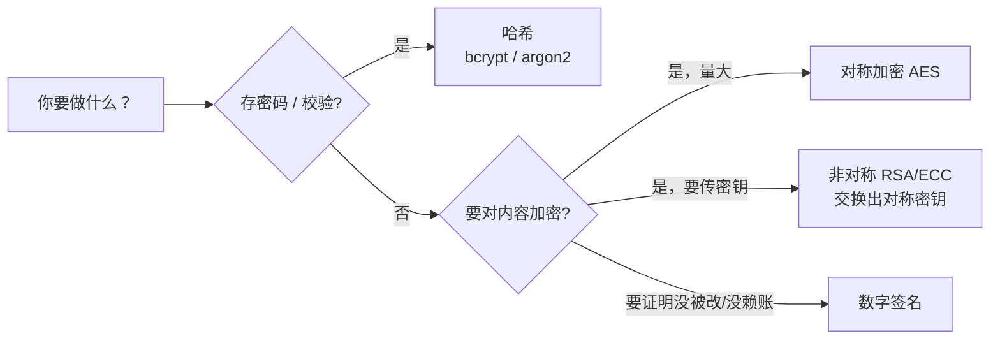

# 03 — 密码学基础（工程视角）

> 本节不教你写加密算法（那是数学家的活，你也不该自己造），只解决全栈最常被问的一件事：**什么时候该用哪种原语**。记住口诀：**哈希管"校验"、对称管"加密"、非对称管"分发"、签名管"防篡改"**。

---

## 📌 元信息

| 项目 | 内容 |
|------|------|
| **模块** | 原理层 · 第 3 篇（前置：01） |
| **预计时间** | 45 分钟 |
| **面试可答** | 密码为什么不能 MD5 存、对称/非对称/哈希各自用途、数字签名是干嘛的 |

---

## 1. 四类原语一张表（本节唯一重点：会选型）

| 原语 | 是否可逆 | 典型算法 | 用途 | 类比 |
|------|---------|---------|------|------|
| **哈希 Hash** | 不可逆 | SHA-256、bcrypt、argon2 | 校验完整性、**存密码** | 指纹：只能比对，反推不出人 |
| **对称加密** | 可逆，加解密同一把钥 | AES | 数据量大时的**内容加密** | 一把钥匙锁箱子 |
| **非对称加密** | 可逆，公钥/私钥成对 | RSA、ECC（ECDSA/EdDSA） | **密钥分发**（公钥传出去，私钥留着） | 信箱：谁都能往里投信（公钥），只有你有钥匙开（私钥） |
| **数字签名** | 私钥签、公钥验 | ECDSA、EdDSA、RSA-PSS | **防篡改 + 抗抵赖** | 签名印章：盖上去就不能赖 |



---

## 2. 哈希：不可逆的"指纹"

**一句话人话**：输入任意长度 → 输出固定长度（如 SHA-256 输出 32 字节）；由输出**无法反推**输入；输入差一丁点，输出面目全非。

### 2.1 校验完整性 vs 存密码，是两种用法

- **校验用**（文件完整性、消息摘要）：`SHA-256` 这种"快哈希"就行。对比两个文件是否一致、下载包是否被篡改——快就好。
- **存密码用**（关键！）：必须用**慢哈希** `bcrypt` / `argon2`，**绝不能用 MD5/SHA-1**：

| 方案 | 速度 | 为什么不行/行 |
|------|------|--------------|
| `MD5` / `SHA-1` | 极快 | 快 = 攻击者能每秒试几十亿次；且已被证明可碰撞，**只配做校验，不配做安全** |
| `bcrypt` | 刻意慢（cost 因子） | 默认内置盐，老牌稳定，"能用就用它" |
| `argon2` | 慢 + 抗 GPU | 当代推荐，内存硬（防专用硬件加速），竞赛冠军 |

> 💡 所以面试题"密码为什么不能 MD5 存"的答案是两层：① MD5 快 → 破解成本极低；② 无盐 → 相同密码得到相同哈希，可撞库/彩虹表。bcrypt/argon2 恰好同时解决这两点（内置随机盐 + 刻意慢）。

### 2.2 演示：为什么"很快"很危险

用 Node 自带 `crypto` 对比一下就知道（Bun 直接能跑）：

```typescript
// demo.ts — bun run demo.ts
import { createHash } from "node:crypto"
import bcrypt from "bcryptjs" // bun add bcryptjs

const md5 = (s: string) => createHash("md5").update(s).digest("hex")

// 1. 同样的密码 → 同样的哈希（撞库/彩虹表的温床）
console.log(md5("p@ssw0rd"), md5("p@ssw0rd"))
// 2. md5 快到手感为零 vs bcrypt 刻意慢
const t = performance.now()
for (let i = 0; i < 100_000; i++) md5(`pwd-${i}`)
console.log("md5 x100k:", (performance.now() - t).toFixed(1), "ms")

const t2 = performance.now()
await bcrypt.hash("p@ssw0rd", 10)
console.log("bcrypt x1:", (performance.now() - t2).toFixed(1), "ms")
```

**要点**：让"试一个密码"的成本从微秒级涨到几十毫秒级，暴力破解的性价比就崩了。

---

## 3. 对称加密：AES

**一句话人话**：一把密钥，加密解密都用它；快、适合大量数据。

- 你真正接触它的地方：**TLS 会话数据面**、字段级加密（如存身份证号时 `AES-256-GCM`）。
- 工程要点（知道即可，别手搓）：
  - 用**认证加密模式** `AES-256-GCM`（加密 + 防篡改一体的 AEAD 模式），不要用缺失完整性校验的 ECB；
  - 官网库优先：Node 用 `node:crypto` 的 `createCipheriv`，别自实现。

```typescript
import { createCipheriv, createDecipheriv, randomBytes } from "node:crypto"
// AES-256-GCM：key 32 字节，iv 12 字节推荐
const key = randomBytes(32)
const iv = randomBytes(12)

const cipher = createCipheriv("aes-256-gcm", key, iv)
const enc = Buffer.concat([cipher.update("hello 敏感数据", "utf8"), cipher.final()])
const tag = cipher.getAuthTag() // GCM 自带的完整性校验

const decipher = createDecipheriv("aes-256-gcm", key, iv)
decipher.setAuthTag(tag)
const dec = Buffer.concat([decipher.update(enc), decipher.final()]).toString()
console.log(dec) // hello 敏感数据
```

---

## 4. 非对称加密：RSA / ECC

**一句话人话**：成对的钥匙，**公钥随便给别人，私钥只有你有**。用公钥加密的东西只有私钥能解——于是"别人可以安全地给我传秘密"。

- 朴素直觉的用途是"公钥加密、私钥解密"（保密）；
- 工程里更普遍的是**密钥交换**：TLS 握手里，双方用非对称（如 ECDHE）协商出一个**临时的对称密钥**，之后大数据量通信走快的 AES——**非对称负责"开局分发密钥"，对称负责"挂挡加速"**，各司其职。
- **RSA vs ECC**：ECC 用更短的钥获得同等强度（256 位 ECC ≈ 3072 位 RSA），性能更好，现代 TLS 1.3 默认走 ECC 系。

> 💡 你的代码里几乎不会手写非对称加密——但 JWT 签名、证书、TLS 都用它，理解"公钥可泄露、私钥必须锁死（HSM/文件权限/环境变量）"就能避开大多数事故。

---

## 5. 数字签名：私钥签，公钥验

**一句话人话**：用**私钥**对内容签名，任何人用对应**公钥**都能验证"这内容没被改过、且确实出自私钥持有者"。

两件事它都能证明：
1. **完整性**：内容任何字节被改，验证必失败；
2. **抗抵赖（来源）**：只有私钥持有者能签出这个签名，签了就不能赖。

你在工程里见到它的地方：**JWT 的 Signature 段**（05 篇详述）、软件包/镜像的发布校验、证书链。

```typescript
// 签名 = 私钥，验证 = 公钥；方向别搞反
import { generateKeyPairSync, sign, verify } from "node:crypto"

const { privateKey, publicKey } = generateKeyPairSync("ec", { namedCurve: "prime256v1" })
const data = Buffer.from("发行版本 v1.0.0")

const sig = sign("sha256", data, privateKey)
console.log(verify("sha256", data, publicKey, sig)) // true
console.log(verify("sha256", Buffer.from("被篡改的包"), publicKey, sig)) // false
```

---

## 6. 随机数与密钥派生（了解即可）

- **安全随机数 ≠ `Math.random()`**：`Math.random()` 是伪随机、可预测，**绝不能用来生成密码、密钥、Token**。Node 用 `crypto.randomBytes` / `randomUUID`。
- **密钥派生**：把"人类密码/弱种子"扩成高熵密钥（PBKDF2 / HKDF / argon2 都有派生用途）。只有你做加密系统才用得上，知道概念即可。

---

## 🆚 对比板块：哈希 vs 对称 vs 非对称

| 维度 | 哈希 | 对称（AES） | 非对称（RSA/ECC） |
|------|------|-----------|------------------|
| 可逆 | 不可逆 | 可逆（同钥） | 可逆（钥对） |
| 速度 | 快（慢哈希除外） | 快 | 慢（慢一两个数量级） |
| 用途 | 校验 / 存密码 | 数据量大的内容加密 | 密钥分发 / 签名 |
| 工程例子 | bcrypt 存密码 | TLS 会话加密 | TLS 握手 / JWT 签名 |

---

## ❓ 面试问答

> **问：对称加密和非对称加密各在什么问题上有优势？**
> **答：** 对称快但"密钥怎么安全传给对方"是问题；非对称能安全分发密钥但慢。所以 TLS 的经典组合是：用非对称（ECDHE）完成密钥交换，协商出一个临时对称密钥，之后用 AES 加密实际数据。**非对称解决分发，对称解决速度**。

> **问：哈希和加密的区别？**
> **答：** 加密**可逆**（有钥就能解回来），哈希**不可逆**（只能比对）。所以密码用哈希存（数据库被拖走也推不出明文），而需要读回原文的字段（如身份证号展示）用对称加密。

> **问：数字签名为什么不直接加密？**
> **答：** 签名是"私钥签 + 公钥验"，验证的是**完整性 + 来源**，任何人有公钥都能验；加密是"公钥加密 + 私钥解密"，目的是**保密**。JWT 用签名不用加密——Token 里的内容本来就要让服务器读到，要防的是"被别人伪造"而非"被人看见"。

---

## 🎮 练习

**要求**：用 Node `crypto`（或 bun + bcryptjs）对比 `md5` 与 `bcrypt` 的哈希耗时与输出形态，并说明各自输出里有没有盐。
**提示**：直接跑 2.2 节的 demo；观察 ① 同样输入 md5 输出是否相同；② bcrypt 输出是否两次不同（内置盐）；③ 耗时量级差。
**预期效果**：亲眼看到"为什么不能 MD5 存密码"，以及"为什么 bcrypt 输出长得不一样"。

---

## 🔗 继续阅读

- 上一篇：[02-security-devices.md](02-security-devices.md) 安全设备与设施
- 密码存储是 05/06 篇的地基：[05-auth-authz.md](05-auth-authz.md)、[06-transport-data-security.md](06-transport-data-security.md)
- JWT 里怎么用签名、算法攻击怎么打：见 [05-auth-authz.md](05-auth-authz.md)
- 词表总索引：[../security-learning-outline.md](../security-learning-outline.md)