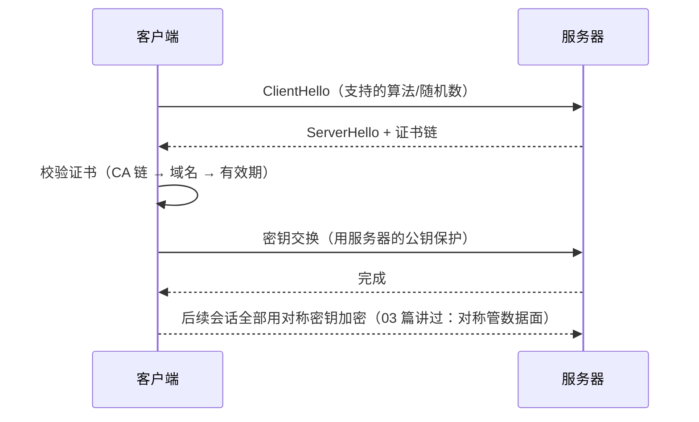

# 06 — 传输安全与数据保护

> 一句话定位：知道敏感数据"在链路上 / 在库里 / 在内存里"分别怎么保护，并理解 HTTPS 到底解决什么、解决不了什么。TLS 配置实操不重复（见 `deploy/network` 篇），这里只补原理认知与工程取舍。

---

## 📌 元信息

| 项目 | 内容 |
|------|------|
| **模块** | 应用层 · 第 6 篇（前置：01、03、04） |
| **预计时间** | 50 分钟 |
| **面试可答** | HTTPS 握手过程、TLS 1.2 vs 1.3、数据保护三态、零信任是什么 |

---

## 1. HTTPS/TLS：它到底保证了什么

**一句话人话**：HTTPS = HTTP + **TLS**，给链路加了**三件套**——加密（机密性）、防篡改（完整性）、服务器身份认证。

一个关键认知，也是全栈踩坑本源：**HTTPS 只保护"传输中的链路"，不保护"业务逻辑"**。

| HTTPS 解决了 | HTTPS 解决不了 |
|-------------|---------------|
| 中间人偷听（加密） | XSS、CSRF、越权（04 篇那类） |
| 中间人篡改（完整性） | 服务端被拖库 |
| 你连的是不是真服务器（证书认证） | 前端校验当安全边界 |

> 💡 面试一键回答："上了 HTTPS 就安全"是误区——它只是**底线之一**，攻击面依然在那里（对应大纲「关键误区」第一条）。

### HTTPS 常规握手（TLS 1.2，理解版）



**TLS 1.2 vs 1.3 关键差异**（面试高频对比）：

| 维度 | TLS 1.2 | TLS 1.3 |
|------|---------|---------|
| 握手往返 | 2 RTT 起步 | 1-RTT，复用会话 0-RTT |
| 弱算法 | 仍兼容大量旧套件 | **移除** RSA 密钥交换、静态 DH、CBC 等弱项 |
| 前向保密 | 可选/可配错 | **默认强制**（每次握手都是临时密钥） |
| 现状 | 仍广泛部署 | 当前推荐主流；TLS 1.0/1.1 已按 RFC 8996 废弃 |

---

## 2. 证书链路：PKI / CA / 中间人

- **PKI（公钥基础设施）**：一套"谁可信、证书怎么签发验证"的制度。
- **CA（证书颁发机构）**：签发证书的"权威"；浏览器信任链 = 根 CA → 中间 CA → 你的服务器证书。
- 校验三连：**证书链可信 → 域名匹配 → 未过期/未吊销**，其中任何一环断掉浏览器都会报警。

**开发里的典型坑（`rejectUnauthorized`）**：

```typescript
// vulnerable.ts — ❌ 开发图省事直接关闭证书校验
import https from 'node:https'

const req = https.get('https://internal-api.corp', {
  rejectUnauthorized: false // ❌ 等于放弃服务端身份认证，中间人畅通无阻
}, (res) => { /* ... */ })
```

```typescript
// fixed.ts — ✅ 默认校验；内网用受信根证书/私有 CA 挂到 trust store
import https from 'node:https'
// 生产：不传 rejectUnauthorized，用系统信任库；或显式 ca: [专用私有CA]
const req = https.get('https://internal-api.corp', {
  ca: [readFileSync('/etc/ssl/corp-root-ca.pem')] // ✅ 给链路装"自家的根"
}, (res) => { /* ... */ })
```

---

## 3. 数据保护三态（记这个框架，所有存储方案都能归类）

| 状态 | 风险例子 | 常用手段 |
|------|---------|---------|
| **传输中（in transit）** | 明文 HTTP、日志里记了 body | TLS 1.2+、HSTS |
| **静止（at rest）** | 数据库/备份被拖走 | 密码哈希（03 篇）、字段加密（AES-GCM）、磁盘/云盘加密 |
| **使用中（in use）** | 内存日志打出了手机号、缓存泄露 | 日志脱敏、最小化收集、运行时加密（高级） |

**HSTS（HTTP 严格传输安全）**：告诉浏览器"这个域名以后只准 HTTPS"——防止第一次跳转被降级成 HTTP。配套 `Strict-Transport-Security` 响应头（07 篇清单里有）。

---

## 4. 密码与密钥存储：两条线分开管

- **密码**：永远哈希存储（bcrypt/argon2，见 [03 篇 §2](03-cryptography-primer.md)），不是加密。
- **应用密钥（JWT_SECRET / API Key / DB 密码）**：放 **环境变量 / Vault**，不进代码库、不进 `docker-compose.yml`、不进前端 bundle。

```typescript
// vulnerable.ts — ❌ 密钥写死在代码/配置里
const config = { jwtSecret: 'hardcoded-secret-123' } // ❌ 进 Git 历史就撤销不了
```

```typescript
// fixed.ts — ✅ 环境变量 + 启动时必检
const jwtSecret = process.env.JWT_SECRET
if (!jwtSecret) throw new Error('JWT_SECRET 未配置，拒绝启动') // ✅ 缺配快速失败
```

> 补充：企业级用 **Vault**（密钥集中托管 + 动态轮换 + 审计），小型项目先做到"不进 Git + 环境变量 + 定期轮换"。

---

## 5. 零信任（Zero Trust）：一句话理解

**传统模型**：进了内网 = 可信。
**零信任**：**不信任网络位置**，每个请求都默认验证（你是谁、设备是否合规、权限是否最小）——"无论从哪来，先过安检再说"。

对照 [02 篇的 VPN](02-security-devices.md)：VPN 是"拉根隧道回内网就信任"，零信任是"拉进来也逐请求验证"。两者可以共存，但思路不同。

---

## 6. 隐私合规浅谈（不深入法规）

- **PII（个人身份信息）**：手机号、身份证、邮箱、位置等。原则：**能不收集就不收集，能脱敏就脱敏，日志里打尾号/遮罩**。
- 日志最小化：只记需要的字段，不记完整敏感值——既合规，又防"拖日志=拖数据"。

---

## 🆚 对比板块：TLS 1.2 vs 1.3 vs 云端托管

| 维度 | TLS 1.2 | TLS 1.3 | 云托管（如 Cloudflare/ALB 证书） |
|------|---------|---------|-------------------------------|
| 配置成本 | 需仔细选套件 | 默认安全 | 几乎零成本，证书自动续期 |
| 握手速度 | 2 RTT | 1-RTT/0-RTT | 取决于边缘节点 |
| 适用 | 存量系统/兼容旧客户端 | 新系统首选 | 通用小团队最省心 |

**结论**：新项目直接 TLS 1.3；不想管证书就上云托管/Let's Encrypt 自动续期。

---

## ❓ 面试问答

> **问：HTTPS 握手大概几步？**
> **答：** 三步记：**协商**（ClientHello/ServerHello 谈算法与随机数）→ **身份认证**（服务器给证书链，客户端校验 CA/域名/有效期）→ **密钥交换**（用服务器公钥或 ECDHE 生成会话对称密钥），之后数据面走 AES。

> **问：TLS 1.2 和 1.3 最大区别？**
> **答：** ① 更快：1.2 要 2 RTT，1.3 降为 1-RTT（会话复用 0-RTT）；② 更安全：1.3 移除 RSA 密钥交换、CBC 等弱套件，**默认强制前向保密**（临时密钥）。1.0/1.1 已废弃，别再用。

> **问：数据保护里"传输中/静止/使用中"分别怎么护？**
> **答：** 传输中用 TLS；静止中密码用慢哈希、敏感字段用 AES-GCM 加密、云盘加密；使用中做日志脱敏、最小化收集。三态一起护，只做一态不是全链路保护。

> **问：零信任和过去的"内网信任"区别？**
> **答：** 过去进内网即可信（VPN 拉隧道就算"自己人"）；零信任不信任位置，每个请求都默认验证身份与权限。本质是把信任边界从"网络"细化到"每一次访问"。

---

## 🎮 练习

**要求**：`curl -v https://example.com` 观察一次 HTTPS 握手；用 securityheaders.com 检查自己任意站点。
**提示**：看 `curl -v` 输出里的 `TLSv1.3`、`SSL certificate verify ok`；对照 07 篇安全响应头清单逐项核对。
**预期效果**：学会"上线前 2 分钟自查"，并且 HSTS/CSP 缺什么心里有数。

---

## 🔗 继续阅读

- 上一篇：[05-auth-authz.md](05-auth-authz.md) 认证与授权（令牌传输安全的地基）
- 证书/TLS 的服务端配置实操（不重复，去这里看）：`deploy/network/02-https-tls-certificate`、`deploy/nginx`
- 安全响应头完整清单：下一篇 [07-engineering-cheatsheet.md](07-engineering-cheatsheet.md)