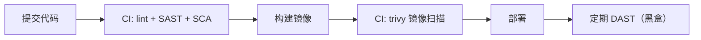

# 07 — 安全工程化、速查与面试

> 收尾篇：把前六篇的能力"接进日常工作"。前半是工程防线（供应链、扫描、Secrets、头清单），后半是速查（误区 + 面试题库）。这更像工具箱，随用随翻。

---

## 📌 元信息

| 项目 | 内容 |
|------|------|
| **模块** | 工程层 + 速查层 · 第 7 篇（前置：全篇） |
| **预计时间** | 60 分钟主读 + 长期翻阅 |
| **面试可答** | 供应链攻击怎么防、SAST/DAST/SCA 区别、安全响应头清单、DevSecOps 流程 |

---

## 1. 供应链与依赖安全（A03 的落地篇）

### 1.1 SBOM：依赖"物料清单"

**一句话人话**：一份列出"我的软件用了哪些组件、什么版本"的清单。有了它，爆出漏洞（如 Log4Shell）时能**一键查到哪个项目受影响**。

### 1.2 扫描工具：SCA（依赖审计）

把"依赖漏洞扫描"接进日常，是全栈最性价比的一步：

```bash
# 三类常用工具（三选一即可起步）
npm audit --audit-level=high        # npm 生态自带的依赖审计
brew install osv-scanner && osv-scanner scan .   # 官方无 npm 包：brew/go install 后按 V2 语法扫描
# 容器/镜像层面：trivy image <image>（见 deploy/ci 篇）
```

### 1.3 Dependency Confusion：小心"装错包"

**发生**：私有包名如果和公开 npm 同名，`npm i` 可能从**公开源**装到攻击者上传的迷惑包。
**防御**：私有包加 `@scope/` 前缀、锁定 registry 源并显式指向私有源、锁文件提交 + 校验。

> 记住：**供应链攻击 = 攻击者把恶意代码混进你"信任的安装过程"**（投毒的包、被黑的 CI、伪造的更新）。所以锁文件必须提交、CI 跑扫描、镜像用不可变 tag。

---

## 2. 扫描分层：SAST / DAST / IAST / SCA

| 扫描 | 全称 | 探测器装在哪 | 何时跑 | 一句话人话 |
|------|------|-------------|--------|-----------|
| **SAST** | 静态应用安全测试 | 源码里（不运行） | 提交/CI 内 | "读代码找坏写法"（lint 的安全版） |
| **DAST** | 动态应用安全测试 | 对运行中的应用黑盒打 | 部署后/定期 | "黑盒攻击测试"，扫运行态漏洞 |
| **IAST** | 交互式应用安全测试 | 运行时插桩 | 测试阶段 | "边测边看后面干了啥"，精准、贵 |
| **SCA** | 软件组成分析 | 依赖清单 | CI 内 | "查依赖清单找已知漏洞"（§1.2） |



> 💡 全栈落地策略：**先接 SAST + SCA 到 CI**（免费、快、立竿见影），DAST 有预算/合规要求再上。

---

## 3. Secrets 管理：密钥不进代码库

```bash
# gitleaks 扫当前仓库有没有把密钥提交进 Git 历史
gitleaks git --source . --redact

# .gitignore 兜底（本仓库 agents.md 5.2 已有）
# .env ; *.pem ; *.key
```

- **绝不硬编码**：API Key / 密码 / Token 不进代码、不进日志、不进 `docker-compose.yml`。
- **环境变量只是第一层**：生产环境用平台 Secret 管理（GitHub Secrets、云 KMS、Vault）。
- 发现已泄露：**立即轮换**，并在 Git 历史里扫一遍有没有残留。

---

## 4. 安全响应头清单（速查，随用随抄）

```typescript
// Bun 里加安全头的完整姿势
const securityHeaders: Record<string, string> = {
  'Content-Security-Policy': "default-src 'self'",              // 限制资源来源（04 篇讲过的 XSS 后手）
  'Strict-Transport-Security': 'max-age=63072000; includeSubDomains', // 强制 HTTPS（06 篇）
  'X-Frame-Options': 'DENY',                                     // 防点击劫持（防被 iframe 套壳）
  'X-Content-Type-Options': 'nosniff',                           // 禁止 MIME 嗅探
  'Referrer-Policy': 'no-referrer'                               // 控制 Referer 泄露
}
const res = new Response(body, { headers: securityHeaders })
```

> 提示：这五条就能覆盖常见扫描器告警的"大头"；nginx 侧配置见 `deploy/nginx`。

---

## 5. 安全编码检查表（Review 前对照一遍）

- [ ] 输入：所有用户输入在**服务端**二次校验（类型/长度/白名单）
- [ ] 注入：SQL 一律参数化；orderBy/表名走白名单映射（04 篇）
- [ ] 输出：渲染用户内容用 `textContent`/模板转义，禁 `innerHTML` 拼用户输入
- [ ] 越权：每个资源访问都带 owner 校验，默认拒绝（04 篇 A01）
- [ ] 认证：密码 bcrypt/argon2、登录限速、Cookie `HttpOnly+Secure+SameSite`
- [ ] JWT：标准库 + `algorithms` 白名单 + 短 exp（05 篇）
- [ ] 配置：默认口令、debug/stack trace 关闭、云桶私有（04 篇 A02）
- [ ] Secrets：不进代码/日志，环境变量注入
- [ ] 日志：敏感字段脱敏，不记完整 PII

---

## 6. DevSecOps：把安全"左移"进流程

**一句话人话**：安全不是发布前的"终审关口"，而是从**提交那一刻**就嵌入 CI 的关卡。

最小闭环（对应 `deploy/ci` 04 篇的落地）：
1. 提交 → pre-commit 钩子/CI：`lint + gitleaks`（密钥零容忍）
2. CI：`SAST + SCA(npm audit/osv) + 单测`，高危不过不放行
3. 构建：`trivy` 扫镜像，HIGH/CRITICAL 阻断
4. 部署：镜像不可变 tag（`sha-xxx`/`v1.0.0`），配健康检查
5. 上线后：定期 DAST + 日志告警兜底

> 跟老派"上线前安全评审一次"的区别：**把检查点前移到每一次提交**，漏洞成本随发现时点越早越低。

---

## ⚠️ 全栈高频误区速查（对应大纲「关键误区」）

| 误区 | 问题说明 | 正确认知 |
|------|---------|---------|
| "上了 HTTPS 就安全了" | 只保传输，不解决 XSS/越权 | 传输安全是底线之一 |
| "前端校验了就没事" | 前端只是 UX | 信任边界在服务端 |
| "CORS 是安全机制" | 是同源策略的**放松** | CSRF 靠 SameSite + Token |
| "JWT 无状态所以更好" | 换来注销难、泄露难收回 | 按场景选型 |
| "MD5/SHA1 也是加密" | 是哈希且已不安全 | bcrypt/argon2 |
| "安全是上线后的事" | 越晚越贵 | CI 扫描前移 |

---

## 🆚 对比板块：SAST vs DAST vs SCA vs 人工 Review

| 维度 | SAST | DAST | SCA | 人工代码 Review |
|------|------|------|-----|---------------|
| 看什么 | 源码 | 运行行为 | 依赖清单 | 业务逻辑与设计 |
| 成本 | 低 | 中高 | 免费起 | 人时 |
| 误报 | 较多 | 少 | 准（已知漏洞） | 视人而定 |
| 推荐时机 | 每次提交 | 上线前后/定期 | 每次提交 | 每次合并 |

---

## ❓ 面试题库（集中冲刺版）

> **问：怎么应对供应链攻击（log4j 这类）？**
> **答：** ① SBOM 盘点受影响组件；② CI 接 SCA（npm audit/osv/trivy）与 SAST；③ 锁文件提交、私有源隔离（防 Dependency Confusion）；④ 镜像不可变 tag + 定期扫描；⑤ 无法立即修的设白名单 + 限期 + 缓解措施（如禁用 JNDI）。

> **问：SAST、DAST、SCA 区别？**
> **答：** SAST 不运行、读源码找坏写法（左移、免费快）；DAST 黑盒打运行中的应用（真实但后置）；SCA 只查依赖清单的已知漏洞。三者互补，按 CI 阶段组合。

> **问：常用的安全响应头有哪些？**
> **答：** 背五个：`Content-Security-Policy`（XSS）、`Strict-Transport-Security`（HTTPS 强制）、`X-Frame-Options`（点击劫持）、`X-Content-Type-Options: nosniff`（MIME 嗅探）、`Referrer-Policy`（Referer 泄露）。

> **问：CSP 除了 `default-src 'self'`，一般还配什么？**
> **答：** 常用组合：`script-src 'self'`（禁外部脚本，XSS 后手）、`img-src` / `connect-src` 按业务白名单放行、`frame-ancestors 'none'`（可替代 X-Frame-Options）、`upgrade-insecure-requests`。原则是默认收紧、按需放开，宁可先严后松。

> **问：Cookie 的 HttpOnly / Secure / SameSite 各自防什么？**
> **答：** `HttpOnly` 防 XSS 用 JS 偷会话；`Secure` 防被降级到明文 HTTP 时在链路上泄露；`SameSite` 防跨站请求自动带 Cookie（CSRF 最省事防线）。三件套一起上是登录 Cookie 的底线配置。

> **问：给项目接安全门禁，你会接到哪几步？**
> **答：** 我的最小集：提交钩子/CI 跑 gitleaks（密钥）→ CI 跑 lint+SAST+SCA（依赖）→ 构建镜像 trivy 扫 HIGH/CRITICAL 阻断 → 不可变 tag + 健康检查。安全测试覆盖率另说，这四步先立规矩（对应 `deploy/ci` 篇）。

> **问：越权漏洞一般在哪里复查？**
> **答：** 三个 hook 位点：① 读接口按资源 id 查时，是否带 owner 条件（IDOR/BOLA）；② 写接口更新/删除前，是否校验属主和角色（BFLA）；③ 中间件只查"登录与否"的地方，往往漏了"资源级授权"。对应 04 篇 A01 的成对代码。

> **问：Vault 比环境变量强在哪？**
> **答：** 集中托管 + 动态轮换 + 访问审计 + 到期自动更新；环境变量只是"不进代码"，Vault 管"生命周期"。中小项目先做到环境变量 + 不进 Git + 定期轮换即可。

---

## 🎮 练习

**要求**：给个人项目跑一遍 `gitleaks` + `trivy`（或 `npm audit`），修复发现的问题并接入 CI。
**提示**：接入方式直接抄 `deploy/ci` 04 篇的 workflow 写法；扫描不过先看是不是误报，记录忽略理由。
**预期效果**：CI 里已经有"密钥零容忍 + 依赖漏洞阻断"两道真实门禁——**学到这一条，本系列就值回票价**。

---

## 🔗 继续阅读

- 工具实操与 YAML 落地：[`deploy/ci/04-security-gates`](../../../deploy/ci/doc/04-security-gates.md)
- nginx 安全头配置：`deploy/nginx` HTTPS 实操篇
- 本系列起点：[01-security-terms.md](01-security-terms.md)
- 大纲与验收标准：[../security-learning-outline.md](../security-learning-outline.md)