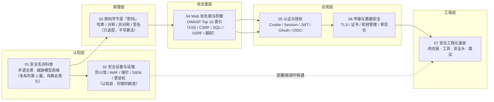

# 网络安全学习大纲（全栈工程师 · 科普级）

> 面向**全栈/后端开发者**的网络安全**名词科普**系列。目的不是培养安全专员，而是让你：看得懂安全报告与术语、写代码时能规避常见漏洞、能和安全同事顺畅对话、面试时能把常见安全题答明白。整体**浅显、术语词典式、工程视角**，不做原理推导与源码级深挖。

---

## 📌 元信息

| 项目 | 说明 |
|------|------|
| **定位** | 名词科普 · 全栈视角（非安全专员视角）· 浅层理解优先 |
| **目标读者** | 资深前端/全栈工程师（见 `agents.md` 作者画像，无需基础科普，但无需安全基础） |
| **前置要求** | HTTP(S)、前后端开发经验；建议先看 [networking/](../networking/) 应用层与 [deploy/network/](../../deploy/network/) 的 HTTPS/TLS 实操 |
| **学习目标** | 1) 遇到安全术语能说人话；2) 编码时知道哪些写法是"踩雷"；3) 认识企业安全设施（堡垒机/探针/WAF/SIEM 等）在请求链路中的位置；4) 给项目接入基础安全门禁（依赖扫描/密钥扫描） |
| **面试目标** | OWASP 常见漏洞"是什么/怎么防"、认证授权选型、密码学最常用名词、安全工程化流程 |
| **预计学习时间** | 核心 6~8 小时（每篇 30~60 分钟，随用随查） |
| **覆盖规范** | 内容基线 = OWASP Top 10:2025（当前正式版）+ 全栈高频安全术语 |

---

## 🎯 设计原则（为什么是 7 篇、为什么这样写）

1. **科普级深度**：每篇给出"一句话人话定义 + 一种典型危害 + 一条工程防御"，不做攻击原理推导、不写 exploit
2. **全栈视角**：叙事围绕"你在开发/联调/上线时会遇到什么"，不围绕"安全研究员怎么打"
3. **术语索引化**：全系列本质是一本**按主题分组的安全词典**，每篇内的术语用一个词条式结构组织，方便回查
4. **与既有模块互补不重复**：TLS 配置实操归 [deploy/network/](../../deploy/network/)，CI 扫描归 [deploy/ci/](../../deploy/ci/)，本系列只补"原理认知 + 编码规避"
5. **代码对照优先**：贴合作者画像（`agents.md`，代码示例 > 纯文字），04/05 等"一说就懂"的主题至少一半篇幅写成 **vulnerable → fixed 成对代码**（Bun + TS），白话只做铺垫、不做主体

---

## 🧭 学习路径图



> 依赖说明：01 是全网总索引、一切篇目的前置；02（设备）可随时插入、遇到再查；03（哈希）是 04（密码存储）与 05（JWT 签名）的前置；05/06 可互换顺序，二者都依赖 04 的漏洞直觉。

---

## 📚 文档目录规划

```text
src/computer-science/security/
├── security-learning-outline.md          # 本文件（学习大纲）
├── doc/
│   ├── 01-security-terms.md              # 安全名词科普（术语全景）
│   ├── 02-security-devices.md            # 安全设备与设施（企业安全设施科普）
│   ├── 03-cryptography-primer.md         # 密码学基础（工程视角）
│   ├── 04-web-attacks.md                 # Web 攻击面与防御（OWASP Top 10:2025）
│   ├── 05-auth-authz.md                  # 认证与授权
│   ├── 06-transport-data-security.md     # 传输安全与数据保护
│   └── 07-engineering-cheatsheet.md      # 安全工程化、速查与面试
└── assets/                               # 交互/攻击示意图（如 CSP 拦截示意）
```

> 文件名命名契约：01/02（认知层·名词科普与设施认识）→ 03（原理层·密码学）→ 04（攻击面层·全栈安全底线）→ 05/06（应用层）→ 07（工程层+速查层），严格沿依赖链递进；02 可随时单独翻查。

---

## 📋 篇目规划

| 序号 | 篇名 | 层 | 一句话定位 | 核心知识点 | 前置篇目 |
|------|------|----|-----------|-----------|---------|
| 01 | 安全名词科普 | 认知层 | 给整个系列建"词典总索引"：任何安全词汇都能用一句话说清是什么 | CIA 三元组、攻击面、威胁建模（STRIDE）、红队/蓝队/渗透测试、CVE/CVSS/CWE、OWASP Top 10 概览、零日、社工 | 无 |
| 02 | 安全设备与设施 | 认知层 | 认识企业安全设施：从一条用户请求到你后端的路上会依次碰到哪些设备，各管什么 | 防火墙/WAF/VPN、IDS/IPS、探针/NDR、SIEM/SOC、堡垒机/4A、蜜罐/沙箱、DMZ 分区、漏洞扫描、NAC/DLP | 01 |
| 03 | 密码学不是"密码" | 原理层 | 搞清哈希/对称/非对称/签名的分工与适用场景，**学会选型而非写算法** | 单向哈希（bcrypt/argon2）、SHA 家族、对称加密（AES）、非对称（RSA/ECC）、数字签名、随机数与密钥派生 | 01 |
| 04 | Web 攻击面与防御 | 攻击面层 | 用 **OWASP Top 10:2025** 当索引，看懂每种攻击的"发生 → 危害 → 防御" | 注入（SQLi/NoSQLi/ORM/原型污染）、XSS、CSRF、SSRF、IDOR/越权（BOLA/BFLA）、安全配置错误、文件上传、CSP/CORS/SameSite/HttpOnly、参数化查询 | 01、03 |
| 05 | 认证与授权 | 应用层 | 把 Cookie/Session/JWT/OAuth/OIDC 的关系理清，能回答"该用哪个、为什么" | Cookie 安全属性、Session 与存储、JWT 结构/签名/缺点、OAuth 2.0 与 2.1、OIDC、SSO、RBAC/ABAC、MFA | 01、03、04 |
| 06 | 传输安全与数据保护 | 应用层 | 知道敏感数据"在链路上/在库里/在内存里"分别怎么保护 | TLS 1.2/1.3 与握手、证书/PKI/CA、中间人攻击、密码存储方案、密钥管理（Vault）、零信任概念、隐私合规浅谈 | 01、03、04 |
| 07 | 安全工程化与速查 | 工程层 + 速查层 | 把安全接进日常工作：扫描工具、安全 HTTP 头清单、踩坑与面试问答 | SBOM、SCA/SAST/DAST、Dependency Confusion 与供应链攻击、Secrets 管理、安全响应头、日志与告警、DevSecOps | 全篇 |

---

## 🧩 每篇知识点细化

### 01 · 安全名词科普

- 安全三要素 **CIA**：机密性 / 完整性 / 可用性（一切安全名词都能对号入座）
- 视角术语：攻击面、攻击向量、威胁建模（STRIDE）、攻击者心智（脆弱点/利用链）
- 角色与流程：渗透测试、红队/蓝队、漏洞赏金、安全评审、CVSS 评分人（CNA）
- 编号体系：**CVE**（漏洞编号）、**CWE**（弱点分类）、**CVSS**（严重度评分，了解 v3.1 与 v4.0 并存即可）
- 行业清单：**OWASP Top 10:2025** 十类风险一句话概览（详述在 04）
- 高频事件词：零日、数据泄露、勒索软件、社工/钓鱼、撞库
- 工程启发：安全报告/告警里的"一句话该看什么"

### 02 · 安全设备与设施（企业安全设施科普）

> 这一节不是让你去部署它们，而是让你**认识它们**：部署、联调、排查时这些设备会和你"相遇"。认识名词 + 知道"它在哪一环、管什么"就够了。

- 网络分区视角：内网 / 外网 / **DMZ**（隔离区）——对外的服务放 DMZ，数据库等敏感资产放内网
- 边界防护三件套：
  - **防火墙**：网络层过滤器，按 IP / 端口放行或拒绝
  - **WAF**（Web 应用防火墙）：应用层过滤器，专门拦 XSS、SQLi 等 OWASP 类攻击（对应 04 的漏洞）
  - **VPN**：加密隧道，让"在外部的人"安全接回内网（可与 06 的零信任对比思考）
- 防御与清洗：**抗 DDoS 设备 / 流量清洗**——大流量攻击打进来时先分流清洗，再进业务
- 检测与响应：
  - **IDS / IPS**：入侵检测（只报警）/ 入侵防御（直接拦截）
  - **探针**（流量探针 / NDR）：旁路镜像流量抓包分析，发现可疑行为；"探针"也泛指各类采集器（日志 / 性能 / 安全探针）
  - **蜜罐（Honeypot）**：故意放置的诱饵系统，谁碰它谁暴露
  - **沙箱（Sandbox）**：隔离环境跑可疑文件 / 样本，结论出来前不许外传
- 汇聚与分析：**SIEM**（全量日志聚合 + 关联告警）、**SOC**（安全运营中心：人 + 平台 + 流程）、日志审计系统
- 访问管控与审计：
  - **堡垒机 / 跳板机**：进入生产环境的统一入口，全程录屏审计——公司里 SSH 线上服务器通常先跳堡垒机
  - **4A**（认证 / 授权 / 账号 / 审计）：以堡垒机为核心的国内企业常见一体化方案
  - **NAC 准入控制**：设备不达标（没装杀软、没打补丁）就不允许联网
  - **DLP 数据防泄漏**：监控 / 拦截敏感文件外发（U 盘、邮件、网盘）
- 资产与合规（了解即可）：**漏洞扫描器**（Nessus / OpenVAS 这类，定期扫内网资产）、**HSM**（硬件安全模块，密钥不出硬件设备）
- 工程启发：你发布的请求可能依次过 **WAF → 探针 → SIEM**；所以日志要规范、敏感字段要脱敏，否则告警会顺着日志"追"到你头上

### 03 · 密码学基础（工程视角）

- **哈希**（不可逆）：用途 = 校验完整性 + 存密码；密码存储用 **bcrypt / argon2**（加盐、慢哈希），`MD5/SHA1` 仅用于校验不用于安全
- **对称加密**：AES 原理一句话 + 什么场景用（数据加密、TLS 数据面）
- **非对称加密**：RSA/ECC（EC 派生的 ECDSA/EdDSA），公钥加密 + 私钥签名；交互场景（TLS 握手密钥交换）
- **数字签名** = 私钥签 + 公钥验，用途：防篡改 + 抗抵赖（JWT、软件发布校验）
- 随机数与密钥派生：安全随机数 ≠ `Math.random()`；HKDF/PBKDF2 一句话了解
- 工程清单：什么时候该用哪种原语（**本节唯一考试重点**：会选型 = 会画表格）

### 04 · Web 攻击面与防御（OWASP Top 10:2025 索引）

- **A01 访问控制失效**（含 SSRF、IDOR/BOLA/BFLA）：越权测试思路（两个账号互换 token / 改 id）+ 默认拒绝
- **A02 安全配置错误**：默认口令、云桶公开、多余端口——"配置即暴露面"
- **A03 供应链失效**：依赖漏洞、被投毒的包（详述在 07）
- **A04 加密失效**：明文传输、弱哈希、自己造加密（承接 03）
- **A05 注入**：SQLi/NoSQLi/命令注入、**ORM 不等于免注入**（raw query / orderBy）、**原型污染**（JS 深度 merge 的坑）→ 参数化查询、输入白名单
- **A06 不安全设计**：信任边界画错（如把前端校验当安全边界）
- **A07 认证失效**：暴力破解/撞库 → 速率限制、MFA
- **A08 完整性失效**：反序列化、签名缺失（承接 03 签名）
- **A09/A10**：日志与告警缺失、异常处理不当（生产事故与"500 页面泄露信息"）
- 浏览器侧防线：**CSP、CORS 正确定位、SameSite、HttpOnly/Secure**（高频面试组合拳）

### 05 · 认证与授权

- Cookie 属性全家桶：`HttpOnly` / `Secure` / `SameSite` / `Domain` / `Path`
- **Session 会话**：服务端状态 + Session ID 存储（内存/Redis），登出/续期怎么处理
- **JWT**：`Header.Payload.Signature` 结构、无状态本质、**已知缺点**（注销难、泄露即失效、体积、密钥管理）、**算法攻击**（`alg:none` / RS256→HS256 密钥混淆）→ 规避：用 `jose` 等标准库并显式校验 `alg`，不给攻击者替我们选算法
- Session vs JWT 选型表（含 BFF/网关场景）
- **OAuth 2.0**：角色四件套、授权码流程（`authorization_code` + refresh token）、与 OAuth 2.1 的差异一句话
- **OIDC**：OAuth 之上的身份层（ID Token），与 SSO/企业登录的关系
- 授权模型：RBAC / ABAC 一句话对比、越权复查 hook 位点（04 的落地）
- MFA / WebAuthn / 用户名密码登录的工程陷阱

### 06 · 传输安全与数据保护

- **TLS/HTTPS**：连接了加密、完整性与服务端认证；TLS 1.2 vs 1.3 关键差异（1-RTT → 0-RTT、移除弱套件）；TLS 1.0/1.1 已废弃
- 证书链路：CA → 证书链 → 证书校验；自签名/内网证书的坑（`rejectUnauthorized`）
- 中间人攻击（MITM）与"HTTPS 里还会有什么问题"（承接 04：HTTP 头注入、HSTS 缺失）
- 数据保护三态：传输中（TLS）、静止（字段加密/磁盘加密）、使用中（内存、日志脱敏）
- 密码与密钥存储：密码哈希选型（03 落地）、应用密钥放 **Vault/环境变量**，绝不进代码库
- 零信任（Zero Trust）一句话：不信任网络位置，默认验证每一个请求
- 隐私合规浅谈：PII 脱敏、日志最小化（不深入法规）

### 07 · 安全工程化、速查与面试

- **供应链与依赖**：SBOM（物料清单）、SCA 扫描（trivy / npm audit / osv-scanner）、Dependency Confusion 攻击
- **扫描分层**：SAST（静态，lint 级别）/ DAST（动态，黑盒）/ IAST（运行中插桩）一句话对比
- **Secrets 管理**：gitleaks 扫密钥、绝不硬编码、`.env` 不进 Git（呼应根目录 `agents.md` 5.2）
- **安全响应头清单**：`Content-Security-Policy` `Strict-Transport-Security` `X-Frame-Options` `X-Content-Type-Options` `Referrer-Policy`
- **安全编码检查表**：输入校验 / 输出编码 / 最小权限 / 默认拒绝
- **DevSecOps 流程**：把扫描接进 CI（关联 [deploy/ci/](../../deploy/ci/) 04 安全门禁）
- **常见误区**（全栈高频踩坑）：见下方"关键误区"
- **面试问答汇总**：8~10 道真题 + 回答模板

---

## 🎮 练习递进线

| 篇目 | 练习要求 | 提示 | 预期效果 |
|------|---------|------|---------|
| 01 | 用自己的话向同事解释 15 个术语（每个 ≤ 3 句话） | 用"一句话人话 + 一个你踩过的坑/见过的例子" | 词表自查：全系列后续阅读无障碍 |
| 02 | 画出"从用户请求到你后端"沿途经过的安全设备链路图 | 对照本篇"从外到内"的章节顺序；没有企业环境就按常见云上部署推演 | 一张链路图在手，听安全同事说话不再懵 |
| 03 | 用 Node `crypto` 对比 `md5` 与 `bcrypt`/`argon2` 的哈希耗时与输出 | `bcryptjs` 是纯 JS 实现，本地脚本即可 | 亲见"为什么不能 MD5 存密码" |
| 04 | 在本地靶场（DVWA 或自写两个接口）触发一次 SQLi 与一次反射型 XSS | 只在自己机器上，注意遵守规范不出网打真实站点 | 把"概念"变成"亲历"，防御才有感觉 |
| 05 | 用 Express 分别实现 Session 认证与 JWT 认证，列出各自登出/续期的写法 | 技术栈按 `agents.md` 5.6：Bun + TS + oxlint | 能讲清"该用哪个、为什么"并出手 demo |
| 06 | `curl -v` 观察一次 HTTPS 握手；用 securityheaders.com 检查自己任意站点 | 对照 07 的安全头清单逐项看 | 学会"上线前 2 分钟自查" |
| 07 | 给个人项目跑一遍 `trivy` + `gitleaks`，修复 HIGH/CRITICAL 项并接入 CI | 参考 [deploy/ci/](../../deploy/ci/) 04 的接入方式 | CI 里已有真实安全门禁 |

---

## ❓ 面试覆盖图

| 高频面试点 | 覆盖篇目 |
|-----------|---------|
| XSS 与 CSRF 的区别、各自怎么防 | 04 |
| CORS 是干嘛的、怎么配、为什么不能当安全边界 | 04 |
| Cookie 的 HttpOnly / SameSite / Secure 各自作用 | 04、05 |
| 堡垒机/跳板机是什么、为什么生产环境不能公网直连 | 02 |
| WAF、IDS、IPS 有什么区别 | 02 |
| SIEM、探针、蜜罐、沙箱分别干什么 | 02 |
| JWT 与 Session 怎么选、JWT 的缺点有哪些 | 05 |
| 密码为什么不能明文/MD5 存、正确做法是什么 | 03、06 |
| OAuth 2.0 授权码流程、refresh token 作用 | 05 |
| HTTPS 握手过程、TLS 1.2 与 1.3 差异 | 06 |
| 什么是 SSRF、攻击者能拿到什么、怎么防 | 04 |
| CVE / CVSS / CWE / SBOM 分别是什么 | 01、07 |
| 怎么应对供应链攻击（log4j 这类） | 07 |
| 常用的安全响应头有哪些 | 07 |
| 什么是零信任、和 VPN/内网信任模型的区别 | 06 |

---

## ⚠️ 关键误区（全栈高频踩坑）

| 误区 | 问题说明 | 正确认知 |
|------|---------|---------|
| "上了 HTTPS 就安全了" | HTTPS 只解决传输，不解决 XSS/CSRF/越权 | 传输安全是底线之一，不是全部 |
| "前端校验了就没问题" | 前端校验只是 UX，接口才是安全边界 | 信任边界放服务端，默认拒绝 |
| "CORS 是安全机制" | CORS 是浏览器同源策略的**放松**，不是防线 | CSRF 防御靠 SameSite + Token，不靠 CORS |
| "JWT 无状态所以更好" | 无状态换来的是登出难、泄露难收回 | 按场景选 Session/JWT，别无脑 JWT |
| "MD5/SHA1 也是加密" | 是哈希且已不安全，且概念上不是加密 | 存储密码用 bcrypt/argon2 |
| "安全是上线后的事" | 漏洞越晚修成本越高 | 用 07 的检查表 + CI 扫描前置 |

---

## ✅ 完成标准

- [ ] 能一句话说清 CIA、CVE/CVSS/CWE、OWASP Top 10:2025 是什么
- [ ] 能画出"用户请求 → 你后端"一路上经过的安全设备，并说出各管什么
- [ ] 能列出对称/非对称/哈希/签名的用途并正确选型（表格画得出）
- [ ] 能讲清 XSS、CSRF、SSRF、IDOR 的"发生 → 危害 → 防御"，并写出对应防御代码
- [ ] 能讲清 Cookie/Session/JWT/OAuth/OIDC 关系，完成 05 的 Express 双实现练习
- [ ] 能用 `curl -v` 与 securityheaders.com 完成一次站点安全自查
- [ ] 给个人项目跑通 `trivy` + `gitleaks` 并接入 CI（呼应 [deploy/ci/](../../deploy/ci/) 04）
- [ ] 能答出面试覆盖图中 6 道以上题目

---

## 🔗 关联模块

| 模块 | 关系 |
|------|------|
| [networking/](../networking/) | 协议层原理（HTTP、TCP）；本系列假设你已掌握 |
| [deploy/network/](../../deploy/network/) 02-https-tls-certificate | TLS/证书**实操配置**，本系列不重复，只讲原理认知 |
| [deploy/nginx/](../../deploy/nginx/) 03-https-url-rewrite-practice | nginx 级 HTTPS、安全头配置实操 |
| [deploy/ci/](../../deploy/ci/) 04-security-gates | trivy/gitleaks/质量门禁的 CI 落地 |
| [program-analysis/](../program-analysis/) | 污点分析（可选延伸：SAST 工具原理） |
| LLM/Agent 安全（可选延伸） | prompt injection / RAG 数据投毒 / 工具滥用；基线参考 OWASP Top 10 for LLM Applications，与 [agent-fullstack/](../../artificial-intelligence/agent/agent-fullstack/) 呼应。本系列正文不收，避免破坏篇幅 |

---

## 📝 学习建议

1. **把系列当词典用**：不追求一次读完，遇到安全词汇先查对应篇目的词条
2. **04 是本系列的重心**：全栈面试 80% 安全题落在 Web 攻击面，多读两遍
3. **每篇做一张"人话表"**：术语 → 一句话人话 → 工程例子，比背定义有效
4. **05/06 顺序可调**：先做 05 认证动手练习，再补 06 传输原理，感受互为支撑