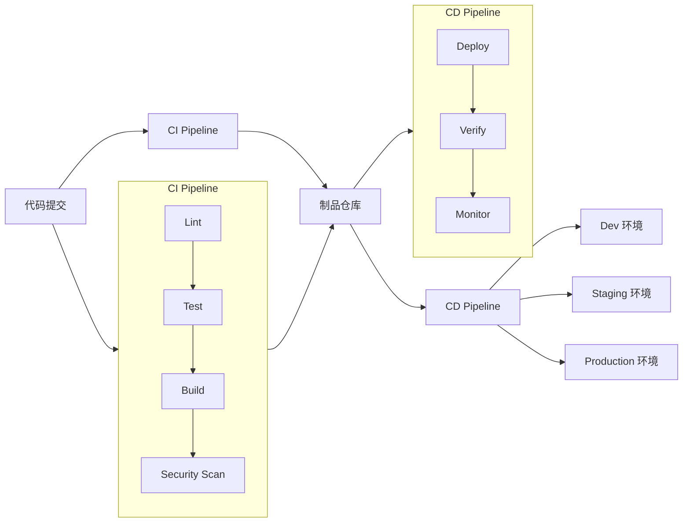
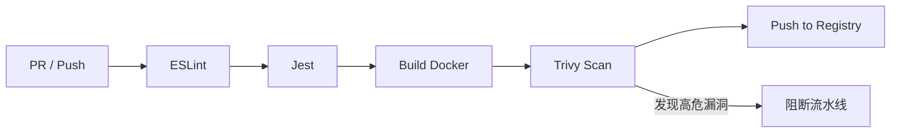

# CI/CD 学习大纲

> 面向技术负责人的 CI/CD 学习路径：不只学会写流水线，更要掌握 Pipeline 设计、工具选型、质量门禁和部署策略。

---

## 📌 元信息

| 项目 | 说明 |
|------|------|
| **预计学习时间** | 5 天核心 + 2 天进阶（约 20-30 小时） |
| **目标读者** | 技术负责人、后端/全栈 TL、希望系统掌握 CI/CD 设计的开发者 |
| **前置模块** | [Docker](../docker/docker-learning-outline.md)、Git、Linux Shell |
| **面试覆盖** | 9 道核心题 + 6 篇 doc 中的面试模板 |
| **实战产出** | 为个人项目搭建 GitHub Actions + GitLab CI 两条完整流水线 |

---

## 🎯 学习目标

完成本模块学习后，你应该能够：

1. 清晰解释 CI、CD（Continuous Delivery / Continuous Deployment）的区别与联系
2. 独立为一个前后端项目设计完整的 CI/CD Pipeline
3. 熟练使用 **GitHub Actions** 和 **GitLab CI** 两门主流工具
4. 在 Pipeline 中接入代码质量门禁、安全扫描、镜像扫描
5. 理解并选择适合的部署策略（滚动更新、蓝绿、金丝雀）
6. 能根据团队规模、项目类型、部署环境做 CI/CD 工具选型
7. 面试中能回答 CI/CD 常见设计与实践问题

---

## 📋 前置要求

- 熟悉 Git 基础操作（branch、merge、rebase、remote）
- 了解 Docker / Docker Compose（已在本仓库 `deploy/docker/` 覆盖）
- 有 Linux / Shell 基础
- 有一个可接入 CI 的项目（如 Vue / Node.js / Python 项目）

---

## 🏗️ CI/CD 在软件交付中的位置



---

## 🧠 核心概念

| 概念 | 说明 |
|------|------|
| **CI（Continuous Integration）** | 持续集成：代码频繁合并，自动构建和测试 |
| **CD（Continuous Delivery）** | 持续交付：代码自动构建、测试，可手动触发部署到生产 |
| **CD（Continuous Deployment）** | 持续部署：代码通过测试后自动部署到生产 |
| **Pipeline** | 流水线：由多个 Stage / Job 组成的工作流 |
| **Stage** | 阶段：Pipeline 中的逻辑分组，如 build、test、deploy |
| **Job** | 任务：Stage 中的具体执行单元 |
| **Runner** | 执行 Job 的 worker 节点（GitHub Actions / GitLab CI 均使用此术语） |
| **Artifact** | 制品：构建产物，如编译结果、Docker 镜像、测试报告 |
| **Cache** | 缓存：加速重复构建（如 node_modules） |
| **Trigger** | 触发器：push、MR/PR、定时、手动、webhook |
| **Quality Gate** | 质量门禁：测试/扫描不通过则阻断流水线 |
| **GitOps** | 以 Git 为唯一事实来源，自动同步基础设施和应用状态 |

---

## 🔧 主流 CI/CD 工具对比

| 工具 | 最佳适用场景 | 优点 | 缺点 |
|------|-------------|------|------|
| **GitHub Actions** | 开源项目、个人项目、云原生团队 | 生态丰富、YAML 简洁、Actions 市场庞大 | 私有部署成本高、大型仓库账单可能较高 |
| **GitLab CI** | 企业私有部署、需要一体化 DevOps 平台 | 与 GitLab 深度集成、Runner 灵活、内置安全扫描 | 配置复杂、资源占用大 |
| **Jenkins** | 传统企业、复杂自定义流程 | 插件极多、生态成熟 | 维护成本高、插件兼容性风险 |
| **ArgoCD / Flux** | Kubernetes 环境的 GitOps 部署 | 声明式、自动同步、回滚方便 | 仅限 K8s、需要额外学习成本 |
| **Drone CI / Woodpecker** | 轻量级容器原生 CI | 配置简单、容器优先 | 生态较小 |

> 学习建议：**先精通 GitHub Actions，再学 GitLab CI**。两者概念高度相通，会两门就能覆盖绝大多数场景。

---

## 🗺️ 学习路径（5 天 + 2 天进阶）

| 天数 | 主题 | 产出 |
|------|------|------|
| **Day 1** | CI/CD 基础概念与 Pipeline 设计 | 能为项目画出 Pipeline 流程图 |
| **Day 2** | GitHub Actions 实战 | 跑通一个真实项目的 PR 检查 + 镜像构建 |
| **Day 3** | GitLab CI 实战 | 跑通同样流程的 GitLab CI 版本 |
| **Day 4** | 质量门禁与安全扫描 | Pipeline 接入 ESLint/Jest、Trivy 镜像扫描、SonarCloud 代码质量、GitLeaks 密钥扫描、Secrets 管理 |
| **Day 5** | 部署策略、回滚、多环境与 GitOps | 能讲清滚动/蓝绿/金丝雀/回滚，能设计 dev/staging/prod 多环境 CI/CD |
| **Day 6** | 工具选型与面试总结 | 能根据场景选型并回答常见 CI/CD 面试题 |

---

## 📚 文档目录规划

```text
src/deploy/ci/
├── ci-learning-outline.md          # 本文件：学习地图
├── doc/
│   ├── 01-ci-cd-concepts.md        # CI/CD 基础概念与 Pipeline 设计
│   ├── 02-github-actions.md        # GitHub Actions 实战
│   ├── 03-gitlab-ci.md             # GitLab CI 实战
│   ├── 04-security-gates.md        # 质量门禁、安全扫描、Secrets 管理
│   ├── 05-deployment-strategies.md # 部署策略、回滚、多环境、GitOps
│   └── 06-tool-selection.md        # 工具选型与面试总结
└── assets/                         # 流程图、Pipeline 截图、架构图
```

---

## 🎮 实战项目

### 项目目标
为个人项目（如 kb-vault 或一个 Vue + Node 全栈项目）搭建两条完整的 CI/CD 流水线。

### 项目结构

```text
ci-demo/
├── .github/
│   └── workflows/
│       └── ci.yml                  # GitHub Actions 流水线
├── .gitlab-ci.yml                  # GitLab CI 流水线
├── Dockerfile
├── docker-compose.yml
├── package.json
└── src/
```

### GitHub Actions 流水线目标



### GitLab CI 流水线目标


### 覆盖知识点

- Workflow / Pipeline 设计
- Job 并行与依赖
- Secrets / Variables 管理
- Docker 镜像构建与推送
- 镜像 tag 策略（`latest`、`sha`、`v1.0.0`）
- 缓存配置（`node_modules`）
- Artifact 上传下载
- 分支保护规则
- 部署到远程服务器（可选扩展）

### 实战验收清单

完成实战项目后，应能验证以下结果：

- [ ] 提交 PR 时，GitHub Actions 自动触发 ESLint + Jest，失败则 PR 被阻断
- [ ] ESLint + Jest 通过后，自动构建 Docker 镜像并推送到 Registry
- [ ] 使用 `git rev-parse --short HEAD` 或 `v1.0.0` 方式为镜像打 tag，不使用单一 `latest`
- [ ] Trivy 扫描发现 HIGH/CRITICAL 漏洞时，workflow 失败并阻止推送
- [ ] GitLab CI 侧实现与 GitHub Actions 同等流程（MR 检查 + 镜像构建/推送）
- [ ] Secrets（Registry 账号、部署密钥）未硬编码在 YAML 中
- [ ] 缓存 `node_modules` 后，重复构建时间明显缩短
- [ ] 可选：成功部署到 Staging 环境并通过健康检查

---

## ❓ 面试常见问题

> 以下问题不仅要能回答，还要能结合项目经历说明。每题后列出核心回答要点与对应文档。

### 1. CI 和 CD 有什么区别？Delivery 和 Deployment 又有什么区别？

- **CI**：频繁合并代码，自动构建、测试，保证主干随时可集成
- **CD（Delivery）**：通过测试后自动到达可发布状态，但部署到生产需要人工审批/触发
- **CD（Deployment）**：通过测试后自动部署到生产，无需人工干预
- 关键区分：Delivery 是"随时可发"，Deployment 是"自动发"
- 对应文档：[01-ci-cd-concepts.md](doc/01-ci-cd-concepts.md)

### 2. 如何设计一个高质量的前端 / 后端 Pipeline？

- 阶段顺序：Lint → Test → Build → Security Scan → Push Artifact
- 失败策略：任一阶段失败立即阻断，不继续执行
- 并行化：无依赖的 Job 并行跑（如单元测试、类型检查）
- 产物管理：Docker 镜像、测试报告、构建产物明确归档
- 对应文档：[01-ci-cd-concepts.md](doc/01-ci-cd-concepts.md)

### 3. GitHub Actions 和 GitLab CI 各适合什么场景？

- **GitHub Actions**：开源/个人项目、GitHub 生态、Actions Marketplace 丰富、按分钟计费
- **GitLab CI**：企业私有部署、需要一体化 DevOps 平台、Runner 灵活、自托管成本低
- 两者 YAML 结构相似，核心概念（Job/Stage/Artifact/Cache）互通
- 对应文档：[06-tool-selection.md](doc/06-tool-selection.md)

### 4. Pipeline 中如何保证密钥安全？

- 绝不硬编码 Secrets，使用平台提供的 Secrets/Variables 机制
- 区分 Repository Secrets 与 Environment Secrets（多环境隔离）
- 不在日志中打印 Secrets，必要时使用 `mask`
- Self-hosted Runner 要注意运行环境的 `.env`、缓存、容器残留
- 对应文档：[04-security-gates.md](doc/04-security-gates.md)

### 5. 什么是 Quality Gate？你通常会设置哪些门禁？

- 定义：Pipeline 中的质量检查点，不通过则阻断发布
- 常见门禁：单元测试覆盖率、Lint 0 错误、镜像漏洞扫描（HIGH/CRITICAL=0）、构建失败阻断
- 门禁要"可修复"，避免设置无法稳定达成的指标导致团队绕过
- 对应文档：[04-security-gates.md](doc/04-security-gates.md)

### 6. 蓝绿部署、金丝雀部署、滚动更新有什么区别？

- **滚动更新**：逐步替换旧实例，零停机但回滚慢，适合无状态服务
- **蓝绿部署**：同时部署两套环境，流量一键切换，回滚快但资源翻倍
- **金丝雀**：先切少量流量到新版本，观察指标后逐步扩大，风险最小但复杂
- 选型依据：业务对停机的容忍度、回滚速度要求、可观测性成熟度
- 对应文档：[05-deployment-strategies.md](doc/05-deployment-strategies.md)

### 7. CI 中镜像扫描不通过怎么办？

- 首先确认是否为误报，Trivy/Snyk 可设置忽略规则（需记录理由）
- HIGH/CRITICAL 漏洞优先修复基础镜像（升级 Alpine、使用 distroless）
- 无法立即修复时，设置漏洞白名单 + 限期修复，并在 Pipeline 中显式声明
- 阻断策略要根据团队成熟度调整，避免一开始就导致所有构建失败
- 对应文档：[04-security-gates.md](doc/04-security-gates.md)

### 8. 如何实现一键回滚？

- 前提是使用不可变镜像 tag（如 `sha-xxx`、`v1.0.0`），拒绝只依赖 `latest`
- 蓝绿部署：切换流量即可回滚
- K8s 滚动更新：`kubectl rollout undo deployment/xxx`
- GitOps：回退 Git 仓库中的镜像版本，ArgoCD/Flux 自动同步
- 对应文档：[05-deployment-strategies.md](doc/05-deployment-strategies.md)

### 9. GitOps 是什么？它和传统 CD 有什么不同？

- **GitOps**：以 Git 为唯一事实来源，应用/基础设施状态由 Git 仓库驱动
- **传统 CD**：CI 工具直接调用部署脚本/SSH/Kubectl 进行部署
- GitOps 优势：变更可审计、回滚简单、声明式管理、自动漂移检测
- 典型工具：ArgoCD、Flux；适用场景：Kubernetes 环境
- 对应文档：[05-deployment-strategies.md](doc/05-deployment-strategies.md)

---

## ✅ 完成标准

- [ ] 能画出项目从提交到部署的完整 CI/CD 流程图
- [ ] 能用 GitHub Actions 为一个项目实现 PR 检查 + Docker 镜像构建
- [ ] 能用 GitLab CI 实现同样的流程
- [ ] Pipeline 中至少接入 lint、test、build 三个阶段
- [ ] 能正确配置 Secrets / Variables，不把密钥硬编码在 YAML 中
- [ ] 能解释滚动更新、蓝绿、金丝雀三种部署策略的适用场景
- [ ] 能根据团队场景说出为什么选择 GitHub Actions 或 GitLab CI
- [ ] 能回答 5 道以上 CI/CD 面试题

---

## 🔗 关联模块

- [Docker 学习大纲](../docker/docker-learning-outline.md)
- [Nginx 学习大纲](../nginx/nginx-learning-outline.md)

---

## 📝 学习建议

1. **先通读概念，再动手**：不要一上来就写 YAML，先理解 Pipeline 为什么这样设计
2. **一门精通，一门会用**：GitHub Actions 建议深度实践，GitLab CI 做到能看懂、能改、能搭
3. **从小项目开始**：先给自己的博客或脚手架项目加 CI，再挑战多环境部署
4. **关注安全和回滚**：技术负责人最容易被问到的就是「密钥怎么管」「上线出问题怎么回滚」

---

## ⚠️ 常见踩坑点

| 踩坑点 | 问题说明 | 正确做法 |
|--------|---------|---------|
| **只用 `latest` tag** | 无法确定当前运行的镜像版本，回滚和排障困难 | 使用 `sha-xxx`、`v1.0.0` 等不可变 tag |
| **缓存 key 设计不当** | 跨分支/跨 PR 共享缓存，导致构建结果不一致 | 按 `runner.os` + 锁文件 hash + 分支名设计 key |
| **Secrets 硬编码在 YAML** | 密钥泄露到 Git 历史，无法撤销 | 使用 GitHub/GitLab Secrets，配合 Environment 隔离 |
| **Self-hosted Runner 残留** | 容器、`.env`、构建产物留在 Runner 上，可能被后续 Job 读取 | 开启 `ephemeral` 模式，每次 Job 后清理环境 |
| **门禁一开始设太严** | 漏洞扫描一失败就阻断所有 PR，团队被迫绕过 CI | 先设警告阈值，团队修复基线后再改为阻断 |
| **忽略 Artifact 生命周期** | 测试报告、镜像长期堆积，存储成本激增 | 设置保留策略，重要产物归档到长期存储 |
| **生产部署无健康检查** | 新版本启动失败但流量已切换，导致服务不可用 | 部署后加 `healthcheck` / `smoke test`，失败自动回滚 |
