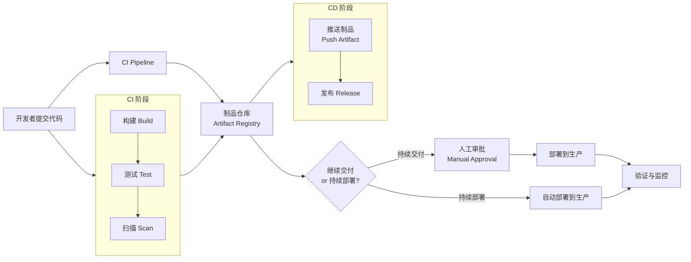
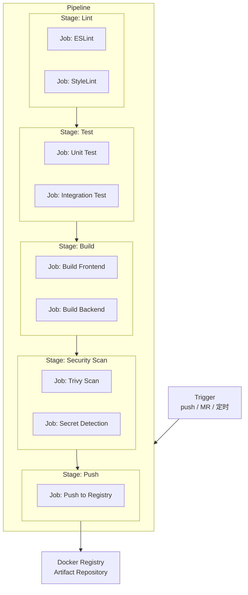
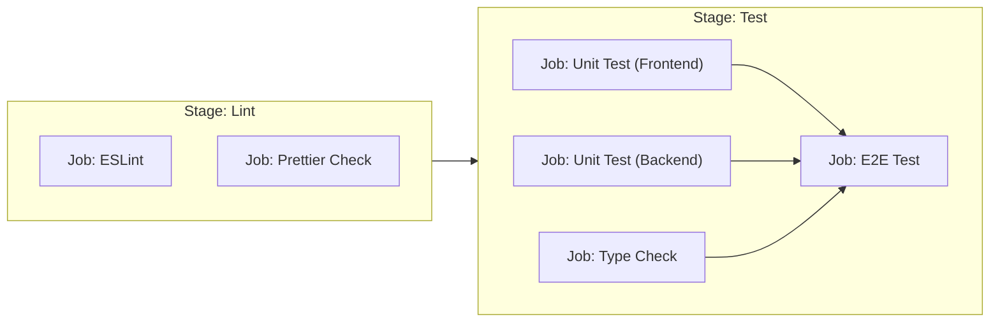
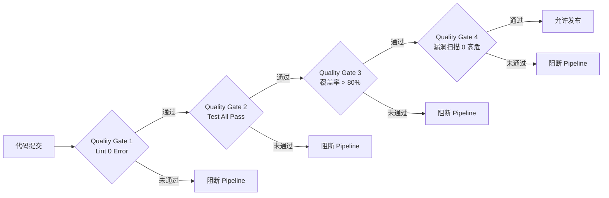

# 01 — CI/CD 基础概念与 Pipeline 设计

> 理解 CI/CD 的本质，掌握 Pipeline 核心概念与设计原则，能为项目画出完整的 Pipeline 流程图。

---

## 🎯 学习目标

- 理解 CI（持续集成）和 CD（持续交付 / 持续部署）的本质区别
- 掌握 Pipeline、Stage、Job、Runner、Artifact、Cache 等核心概念
- 学会 Pipeline 的设计原则：阶段顺序、失败策略、并行化、幂等
- 理解 Quality Gate（质量门禁）的作用与常见类型
- 能回答 CI/CD 相关的核心面试问题

---

## 1. CI 和 CD 的本质

### 1.1 CI（Continuous Integration，持续集成）

持续集成的核心思想是：**频繁地将代码合并到主干，每次合并都自动触发构建和测试**。

在传统开发模式中，团队成员可能各自在分支上开发数天甚至数周，最后合并时才发现冲突或集成问题，修复成本极高。CI 要求开发者每天至少合并一次代码到主干，每次合并都由 CI 系统自动执行：

- **代码编译 / 转译**：确保代码语法正确、能成功构建
- **自动化测试**：运行单元测试、集成测试，快速发现回归缺陷
- **代码规范检查**：执行 Lint，保证代码风格一致性
- **静态分析**：检测潜在 Bug、安全漏洞、代码异味

CI 的价值在于**将问题暴露在引入的时刻**，而不是上线前夜。

### 1.2 CD（Continuous Delivery / Continuous Deployment）

CD 有两个含义，它们的区分非常关键：

| 概念 | 英文 | 说明 |
|------|------|------|
| **持续交付** | Continuous Delivery | 代码通过 CI 后自动到达**可发布状态**（Artifact 已就绪、镜像已构建），但部署到生产环境需要**人工审批按钮** |
| **持续部署** | Continuous Deployment | 代码通过 CI 后**自动部署到生产环境**，全程无人为干预 |

> **区分要点**：Delivery 是"随时可发"——制品准备好了，但发不发由人决定；Deployment 是"自动发"——测试通过就直接上线。

### 1.3 CI → CD 的完整流程



---

## 2. Pipeline 核心概念

### 2.1 Pipeline、Stage、Job、Runner

| 概念 | 说明 | 类比 |
|------|------|------|
| **Pipeline**（流水线） | 从代码提交到部署的完整工作流 | 工厂的生产流水线 |
| **Stage**（阶段） | Pipeline 中的逻辑分组，如 Build、Test、Deploy | 流水线上的工位 |
| **Job**（任务） | Stage 中的具体执行单元，一个 Stage 可以有多个 Job | 工位上的具体操作 |
| **Runner** | 执行 Job 的 worker 节点，GitHub Actions 与 GitLab CI 均使用此术语 | 流水线上的工人 |

> GitHub Actions 和 GitLab CI 都称执行 Job 的服务器为 **Runner**，Azure DevOps 中才称为 **Agent**。三者概念等价。

### 2.2 Pipeline 结构示意



### 2.3 Artifact 与 Cache 的区别

这是面试中经常被问到的问题：

| 维度 | Artifact（制品） | Cache（缓存） |
|------|-----------------|---------------|
| **用途** | 存档构建产物，供后续 Stage 或部署使用 | 加速重复构建，避免重复下载依赖 |
| **示例** | Docker 镜像、编译后的二进制文件、测试报告 | `node_modules`、`~/.m2/repository` |
| **生命周期** | 长期保留（与 Pipeline 运行绑定） | 短期保留，按 key 命中后清除 |
| **跨 Pipeline** | 可以跨 Pipeline 下载和使用 | 仅在同一项目、同一分支下共享 |
| **是否必需** | 是——没有 Artifact 就没有部署的"原料" | 否——没有 Cache 只是慢，不影响正确性 |

**一句话记住**：Artifact 是**产出**，没有它交付不了；Cache 是**加速**，没有它只是慢。

### 2.4 Trigger 类型

Pipeline 可以由多种事件触发：

- **Push**：代码推送到分支时触发（最常用）
- **MR / PR**：创建或更新合并请求时触发（常用于代码审查流程）
- **定时（Scheduled）**：按 Cron 表达式定时触发（如每天凌晨执行安全检查）
- **手动（Manual）**：人工在 CI 平台点击触发（常用于部署到生产）
- **Webhook**：外部系统通过 HTTP 请求触发（如第三方平台通知）

> 设计 Pipeline 时，**不同类型的 Trigger 可以触发不同的 Stage 组合**。例如：Push 只触发 Lint + Test，Merge 到主干触发完整的 Build + Scan + Push。

---

## 3. Pipeline 设计原则

### 3.1 阶段顺序

一个高质量的 Pipeline，Stage 的顺序应当遵循**从快到慢、从轻到重**的原则：

```
Lint（秒级） → Test（秒到分级） → Build（分级） → Security Scan（分级） → Push
```

- **Lint 最早**：语法和风格问题能在几秒内反馈，不值得进入后续阶段
- **Test 其次**：单元测试运行时不需要构建产物，且能快速发现逻辑错误
- **Build 居中**：构建需要依赖前面的代码通过检验，但它是后续扫描的前提
- **Security Scan 靠后**：镜像扫描需要构建产物，且扫描耗时较长
- **Push 最后**：只有所有门禁都通过了，才把制品推送到仓库

### 3.2 失败策略：Fail-Fast

Pipeline 设计的一个核心原则是 **"一旦失败，立即阻断"**（fail-fast）：

- 任一 Stage 中的 Job 失败，整个 Pipeline 立即停止，不继续执行后续 Stage
- 这样可以**节省 Runner 的资源和时间**，让开发者快速得到反馈
- 例如：Lint 失败了，就不需要跑 Test 和 Build

> **例外**：某些场景下你可能希望即使 Lint 有警告也让后续流程继续运行。这种情况更适合使用**软门禁**（Soft Gate）——报告问题但不阻断，而不是取消 fail-fast。

### 3.3 并行化

同一 Stage 中，**无依赖关系的 Job 应当并行执行**，以缩短 Pipeline 的整体耗时：



> 并行化的前提是 Job 之间没有资源竞争（如写同一个文件、抢占同一个端口）。GitHub Actions 和 GitLab CI 都支持通过 `needs` 或 `dependencies` 声明 Job 的依赖关系。

### 3.4 幂等原则

幂等（Idempotent）意味着**每次构建都是独立、可重复的**，不受历史构建的影响：

- **相同的输入（相同代码 + 相同依赖版本）必须产生相同的输出**
- 不依赖 Runner 的本地状态（如残留的临时文件、环境变量）
- 依赖版本锁定：使用 `package-lock.json`、`yarn.lock`、`go.sum` 等锁文件
- 使用不可变 tag 的镜像作为构建基础镜像

> **反例**：一个 Pipeline 在第二次运行时，因为 `node_modules` 被缓存了，结果和第一次不同——这就是副作用。缓存只应该加速，不应该改变结果。

---

## 4. Quality Gate（质量门禁）概念

### 4.1 什么是 Quality Gate

Quality Gate（质量门禁）是 Pipeline 中的**质量检查点**——只有当门禁条件满足时，Pipeline 才允许继续执行或发布代码。



### 4.2 常见门禁类型

| 门禁类型 | 检查内容 | 阻断标准 |
|---------|---------|---------|
| **Lint 检查** | ESLint、StyleLint、Prettier | 存在 Error 级别问题 |
| **单元测试** | Jest、Vitest、pytest | 有测试用例失败 |
| **测试覆盖率** | Istanbul、Codecov、JaCoCo | 低于设定的阈值（如 80%） |
| **安全漏洞扫描** | Trivy、Snyk、SonarQube | 存在 HIGH / CRITICAL 级别的漏洞 |
| **密钥泄露检测** | GitLeaks、TruffleHog | 检测到疑似密钥硬编码 |
| **构建失败** | 编译 / 转译 / 打包 | 构建命令返回非零状态码 |
| **依赖审查** | `npm audit`、Dependabot | 依赖存在已知严重漏洞 |

### 4.3 门禁的"可修复"原则

一个好的 Quality Gate 必须**可修复（Actionable）**——当门禁阻断时，团队成员能清楚地知道问题是什么、如何修复。

- **门禁标准必须是团队可达成的**：不要一开始就设 100% 覆盖率，这大概率会导致团队选择绕开门禁
- **门禁反馈必须具体可操作**：不要只说"质量不合格"，要给出具体的行号、规则名称、修复建议
- **门禁可以渐进收紧**：先设置为 Warning（不阻断），等团队习惯后再改为 Error（阻断）

> **反面案例**：某团队设置了"测试覆盖率必须 ≥ 90%"，但项目历史遗留了 10 万行没有测试的代码。结果是每次提交都失败，最后团队在 CI 配置里注释掉了这个门禁——它变成了"死门禁"。

---

## 5. 面试回答模板

> **问：** CI 和 CD 有什么区别？Delivery 和 Deployment 又有什么区别？

**答：** CI（Continuous Integration，持续集成）强调的是频繁合并代码到主干，每次合并都自动触发构建和测试，目标是尽早发现集成问题。CD 则有两个分支：Continuous Delivery（持续交付）和 Continuous Deployment（持续部署）。

关键区别在于**是否需要人工干预上线这一步**：Delivery 是"代码通过 CI 后，制品已经处于可发布状态，但部署到生产需要有人点击确认按钮"；Deployment 是"测试通过就直接自动部署到生产，没有人为干预环节"。

用一个比喻来记：CI 是做菜的**准备和检验**（洗菜、切菜、试味），Delivery 是**做好装盘端到出餐口**（随时可以上菜），Deployment 是**直接送到顾客桌上**。Delivery 和 Deployment 的区别就是"等人来端"和"直接上菜"的区别。

---

> **问：** 如何设计一个高质量的前端 / 后端 Pipeline？

**答：** 设计高质量的 Pipeline，我会遵循以下几个原则：

第一，**阶段顺序从快到慢**：Lint（秒级）→ Test（秒到分级）→ Build（分级）→ Security Scan（分级）→ Push。Lint 最先执行是因为语法问题不值得进入后面的阶段；Security Scan 靠后是因为它需要构建产物，且扫描本身耗时较长。

第二，**Fail-fast 失败策略**：任一阶段失败立即阻断，不浪费后续资源和开发者的等待时间。

第三，**并行化执行无依赖的 Job**：比如前端和后端的单元测试没有依赖关系，就并行执行，缩短整体 Pipeline 耗时。GitHub Actions 中用 `needs` 关键字控制依赖。

第四，**幂等原则**：每次构建独立可重复，依赖版本用锁文件锁定，不依赖 Runner 环境中的任何残留状态。

第五，**接入质量门禁**：Lint 0 Error、测试全部通过、覆盖率不低于 80%、镜像漏洞扫描无 HIGH/CRITICAL——这些都是常见的门禁项，但门禁标准要"可修复"，不能设得让团队不得不绕开它。

---

> **问：** CI 中如果某一阶段失败了应该怎么处理？

**答：** 这要分阶段来看。

**如果 Lint 阶段失败**：通常是代码规范问题，开发者应该在本地配置 pre-commit hook，在提交前自动修复。CI 中看到 Lint 报错后，本地跑一次 `npm run lint --fix` 即可。

**如果 Test 阶段失败**：需要排查是测试用例本身的问题还是代码改动引入的回归。可以用 `git bisect` 定位是哪次提交引入了问题。对于失败的测试，优先考虑是否 flaky test（不稳定的测试），如果是，先标记为 skip 并开 Issue 追踪修复。

**如果 Build 阶段失败**：最常见的是依赖问题（如 lock 文件未更新、依赖缺失）或构建配置错误。检查构建日志中的错误信息，本地确认 `npm run build` 或 `docker build` 能否通过。

**如果 Security Scan 阶段失败**：先确认扫描结果是误报还是真实漏洞。如果是真实漏洞，根据严重级别制定修复计划——CRITICAL 级别应立即修复，LOW 级别可以纳入下一迭代。无法立即修复需要设置白名单时必须记录理由和修复截止时间。

> 核心原则：**CI 失败不应该简单回退代码了事**。要找到根因（Root Cause），修复或优化 Pipeline，避免同样的问题反复出现。CI 失败是改进流程的机会，不是麻烦。

---

## 📝 总结

本文覆盖了 CI/CD 的核心知识体系：

- **CI 的本质**：频繁集成、自动构建测试、尽早发现问题
- **CD 的两个分支**：Continuous Delivery（随时可发）和 Continuous Deployment（自动上线）
- **Pipeline 核心概念**：Pipeline → Stage → Job → Runner，Artifact vs Cache，Trigger 类型
- **Pipeline 设计原则**：阶段顺序、fail-fast、并行化、幂等
- **Quality Gate**：门禁类型与"可修复"原则

Day 1 的产出要求是**能为项目画出完整的 Pipeline 流程图**——现在你已经掌握了所需的所有概念，下一步是打开 GitHub Actions 或 GitLab CI，开始写你的第一个 `.yml` 文件。

---

## 🔗 参考与延伸

- 下一章：[02-github-actions.md](02-github-actions.md) — GitHub Actions 实战
- [CI/CD 学习大纲](../ci-learning-outline.md)
