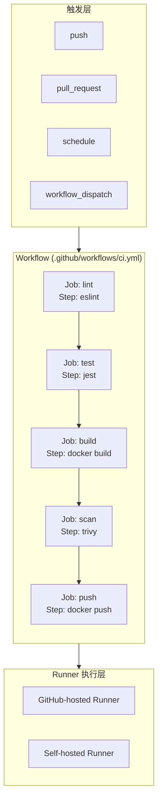

# 02 — GitHub Actions 实战

> 从零编写 GitHub Actions Workflow，跑通一个真实项目的 PR 检查 + 镜像构建流程。

---

## 🎯 学习目标

- 理解 Workflow、Job、Step、Action 的关系
- 掌握常用触发事件（push、pull_request、schedule、workflow_dispatch）
- 能独立编写包含 Lint → Test → Build → Scan → Push 的完整 Workflow
- 掌握 Secrets / Variables 管理与缓存配置
- 了解 Workflow 调试技巧

---

## 1. GitHub Actions 核心概念

GitHub Actions 是 GitHub 提供的 CI/CD 平台，通过 YAML 文件定义自动化工作流。

### 1.1 四层模型

GitHub Actions 的配置由四个层级组成：

| 层级 | 说明 | 类比 |
|------|------|------|
| **Workflow** | 一个完整的自动化流程，定义在 `.github/workflows/*.yml` | 流水线 |
| **Job** | Workflow 中的一个执行单元，可并行或依赖执行 | 阶段 |
| **Step** | Job 中的每个具体操作，运行一条命令或一个 Action | 步骤 |
| **Action** | 可复用的自动化单元，来自 Actions Market 或自定义 | 函数 |

Workflow 包含一个或多个 Job，Job 包含一个或多个 Step，每个 Step 执行一个 Action 或 Shell 命令——这种嵌套结构让 CI/CD 配置既灵活又可复用。

### 1.2 触发事件

Workflow 通过 `on` 字段定义触发条件：

```yaml
# 分支推送时触发
on:
  push:
    branches: [main]

# PR 事件触发
on:
  pull_request:
    branches: [main]

# 定时触发（cron 表达式，UTC 时间）
on:
  schedule:
    - cron: "0 2 * * 1"  # 每周一凌晨 2 点

# 手动触发
on:
  workflow_dispatch:
```

实际项目中通常组合使用。典型配置：分支推送和 PR 触发 CI 检查，`schedule` 用于夜间安全扫描，`workflow_dispatch` 用于手动触发部署。

### 1.3 Runner 类型

Runner 是执行 Workflow Job 的服务器：

| Runner 类型 | 说明 | 适用场景 |
|-------------|------|---------|
| **GitHub-hosted** | GitHub 提供的托管 Runner，Linux/macOS/Windows 可选 | 开源项目、标准构建 |
| **Self-hosted** | 自行维护的 Runner 服务器 | 需要内网访问、自定义硬件、降低成本 |

GitHub-hosted Runner 免费额度为每月 2000 分钟（公开仓库不限），超过后按分钟计费。Self-hosted Runner 免费但需要自行维护，适合企业或需要访问内网资源的场景。

### 1.4 架构图



---

## 2. 编写第一个 Workflow

下面是一个完整的 CI Workflow 示例，包含 ESLint 代码检查、Jest 单元测试、Docker 镜像构建、Trivy 安全扫描和镜像推送。

### 2.1 Workflow 文件

在项目根目录创建 `.github/workflows/ci.yml`：

```yaml
name: CI Pipeline

on:
  push:
    branches: [main]
  pull_request:
    branches: [main]
  workflow_dispatch:

env:
  REGISTRY: ghcr.io
  IMAGE_NAME: ${{ github.repository }}

jobs:
  lint:
    name: Lint
    runs-on: ubuntu-latest
    steps:
      - uses: actions/checkout@v4
      - uses: actions/setup-node@v4
        with:
          node-version: 18
      - name: Cache node_modules
        uses: actions/cache@v4
        with:
          path: node_modules
          key: ${{ runner.os }}-node-${{ hashFiles('package-lock.json') }}
          restore-keys: |
            ${{ runner.os }}-node-
      - run: npm ci
      - run: npm run lint

  test:
    name: Test
    needs: lint
    runs-on: ubuntu-latest
    strategy:
      matrix:
        node-version: [18, 20, 22]
    steps:
      - uses: actions/checkout@v4
      - uses: actions/setup-node@v4
        with:
          node-version: ${{ matrix.node-version }}
      - name: Cache node_modules
        uses: actions/cache@v4
        with:
          path: node_modules
          key: ${{ runner.os }}-node-${{ matrix.node-version }}-${{ hashFiles('package-lock.json') }}
          restore-keys: |
            ${{ runner.os }}-node-${{ matrix.node-version }}-
      - run: npm ci
      - run: npm test
      - name: Upload test results
        uses: actions/upload-artifact@v4
        with:
          name: test-results-${{ matrix.node-version }}
          path: junit.xml

> 要让 Jest 输出 `junit.xml`，需要安装 `jest-junit` 并在 `jest.config.js` 中配置 reporters，例如：`reporters: ['default', 'jest-junit']`。

  build-and-scan:
    name: Build & Scan
    needs: test
    runs-on: ubuntu-latest
    steps:
      - uses: actions/checkout@v4
      - name: Build Docker image
        run: |
          SHORT_SHA=$(git rev-parse --short HEAD)
          docker build -t ${{ env.REGISTRY }}/${{ env.IMAGE_NAME }}:$SHORT_SHA .
          docker tag ${{ env.REGISTRY }}/${{ env.IMAGE_NAME }}:$SHORT_SHA \
            ${{ env.REGISTRY }}/${{ env.IMAGE_NAME }}:latest
      - name: Trivy vulnerability scan
        uses: aquasecurity/trivy-action@0.29.0
        with:
          image-ref: ${{ env.REGISTRY }}/${{ env.IMAGE_NAME }}:latest
          format: table
          exit-code: 1
          severity: HIGH,CRITICAL
      - name: Log in to GitHub Container Registry
        uses: docker/login-action@v3
        with:
          registry: ${{ env.REGISTRY }}
          username: ${{ github.actor }}
          password: ${{ secrets.GITHUB_TOKEN }}
      - name: Push Docker images
        run: |
          SHORT_SHA=$(git rev-parse --short HEAD)
          docker push ${{ env.REGISTRY }}/${{ env.IMAGE_NAME }}:$SHORT_SHA
          docker push ${{ env.REGISTRY }}/${{ env.IMAGE_NAME }}:latest
```

### 2.2 关键设计说明

**分支过滤**：`on.push.branches: [main]` 和 `on.pull_request.branches: [main]` 确保只在 main 分支和向 main 发起的 PR 上触发，避免功能分支的重复构建。

**Matrix 策略**：test Job 使用 `strategy.matrix.node-version` 同时在三个 Node 版本（16/18/20）上运行测试，确保跨版本兼容性。GitHub 会自动为每个组合创建一个并行 Job。

**依赖控制**：通过 `needs` 字段控制 Job 执行顺序（lint → test → build-and-scan）。如果 lint 失败，test 和 build-and-scan 都不会执行，节省时间和资源。

**镜像 Tag 策略**：使用 `git rev-parse --short HEAD`（短 SHA）作为不可变 tag，同时打 `latest` tag 便于开发环境使用。避免只用 `latest`。

**安全扫描阻断**：Trivy 配置了 `exit-code: 1`，当扫描到 HIGH 或 CRITICAL 级别的漏洞时，Workflow 直接失败，阻止不安全镜像推送。

---

## 3. Secrets 与 Variables 管理

Pipeline 中不可避免地需要访问各类凭证，正确管理 Secrets 是 CI/CD 安全的基础。

### 3.1 配置 Secrets

在 GitHub 仓库中配置 Secrets 的路径：

```
Settings → Secrets and variables → Actions → Repository secrets → New repository secret
```

常见需要配置的 Secrets：

| Secret 名称 | 用途 |
|-------------|------|
| `DOCKER_USERNAME` | Docker Registry 登录用户名 |
| `DOCKER_PASSWORD` | Docker Registry 登录密码或 Token |
| `SONAR_TOKEN` | SonarCloud 代码质量平台 Token |
| `SLACK_WEBHOOK` | 通知机器人 Webhook 地址 |

### 3.2 在 YAML 中引用

```yaml
- name: Login to Docker Hub
  uses: docker/login-action@v3
  with:
    username: ${{ secrets.DOCKER_USERNAME }}
    password: ${{ secrets.DOCKER_PASSWORD }}
```

### 3.3 Environment Secrets

当项目需要部署到多个环境（dev / staging / prod）时，不同环境使用不同的凭证。GitHub 提供了 Environment 级别的 Secrets 隔离：

1. 进入 `Settings → Environments`，创建 `production` 环境
2. 在该环境下添加只能在生产环境中使用的 Secrets（如生产数据库密码）
3. 在 YAML 中指定环境：

```yaml
jobs:
  deploy:
    runs-on: ubuntu-latest
    environment: production
    steps:
      - run: echo "${{ secrets.PROD_DB_PASSWORD }}"
```

### 3.4 安全要点

- 绝不在 YAML 中硬编码 Secrets（即使仓库是私有的）
- GitHub Actions 会自动将 Secrets 值在日志中替换为 `***`，但依然要避免在 `run` 中使用 `echo` 输出 Secrets
- Self-hosted Runner 上运行的 Job 要警惕缓存和日志残留
- 定期轮换 Secrets（尤其是团队成员变动时）

---

## 4. Artifact 与缓存配置

### 4.1 Artifact（制品）

Artifact 是 Job 产出的文件，如测试报告、编译结果、安装包。Artifact 可在 Job 之间共享，也可在 Workflow 完成后下载。

**上传 Artifact**：
```yaml
- uses: actions/upload-artifact@v4
  with:
    name: test-report
    path: reports/
```

**下载 Artifact**（在后续 Job 中使用）：
```yaml
- uses: actions/download-artifact@v4
  with:
    name: test-report
    path: reports/
```

Artifact 默认保留 90 天，可在仓库 `Settings → Actions → General → Artifact and log retention` 调整。

### 4.2 Cache（缓存）

Cache 用于加速依赖安装，避免每次重新下载。配置时需注意 key 的设计：

```yaml
- uses: actions/cache@v4
  with:
    path: node_modules
    key: ${{ runner.os }}-node-${{ hashFiles('package-lock.json') }}
    restore-keys: |
      ${{ runner.os }}-node-
```

**缓存 key 设计策略**：

| key 方案 | 命中率 | 说明 |
|----------|--------|------|
| `os-node-lockfile` | 高 | 锁文件不变时命中，推荐方案 |
| `os-node-branch` | 中 | 同一分支共享缓存 |
| `os-node-*`（固定 key） | 极高 | 但可能使用过期缓存 |

`restore-keys` 提供降级策略——当精确 key 未命中时，按前缀匹配最近的缓存。这避免了锁文件变化后完全丢失缓存的窘境。

### 4.3 Artifact vs Cache 对比

| 维度 | Artifact | Cache |
|------|----------|-------|
| 用途 | 传递构建产物 | 加速依赖安装 |
| 保留策略 | 默认 90 天，可配置 | 7 天无访问自动清除 |
| 跨 Workflow | 支持 | 支持 |
| 跨 Job | 支持（通过 `download-artifact`） | 支持（同 key 共享） |
| 典型场景 | 测试报告、编译输出 | node_modules、pip 缓存 |
| 管理界面 | 可在 Actions 页面下载 | 仅通过 Actions 缓存页面查看 |

---

## 5. Workflow 调试技巧

### 5.1 使用 `act` 本地调试

`act` 是一个在本地运行 GitHub Actions 的工具，无需推送即可测试 Workflow。

```bash
# 安装 act（macOS）
brew install act

# 模拟 push 事件触发
act push

# 模拟 PR 事件
act pull_request

# 指定 Job 运行
act -j lint

# 使用自定义 secrets 文件（创建 .secrets 文件后）
act --secret-file .secrets

# 查看详细日志
act -v
```

`act` 有几个常见限制需要注意：它默认使用 Docker 模拟 GitHub Runner 环境，某些 GitHub 特有的 Action（如 `actions/cache`）可能不完全兼容；Self-hosted Runner 的上下文变量也与 GitHub-hosted 不同。

### 5.2 查看 Workflow 运行日志

进入 GitHub 仓库的 `Actions` 标签页，点击任意 Workflow 运行记录可查看：

- **概览页面**：显示所有 Job 的状态、耗时、触发者、分支
- **Job 详情**：展开每个 Step，查看标准输出和错误信息
- **Annotations**：Action 生成的问题标记（如 Trivy 扫描结果）
- **重试失效 Job**：对于偶发失败（如网络超时），可直接点击 Re-run jobs

### 5.3 常见失败与处理

| 失败场景 | 典型原因 | 处理方法 |
|----------|---------|---------|
| ESLint 检查不通过 | 代码风格或语法问题 | 本地运行 `npm run lint` 修复 |
| 测试失败 | 代码变更导致用例失败 | 查看测试报告定位失败用例 |
| Docker 构建失败 | Dockerfile 错误或网络问题 | 本地 `docker build` 验证 |
| Trivy 发现漏洞 | 基础镜像存在已知漏洞 | 升级基础镜像版本或更换镜像 |
| Secrets 未设置 | 未在 GitHub 中配置 | 检查 `Settings → Secrets` |
| `npm ci` 失败 | `package-lock.json` 缺失或不一致 | 确保提交了 `package-lock.json` |

---

## 6. 面试回答模板

> **问：** GitHub Actions 中如何保证密钥安全？

GitHub Actions 的密钥安全从三个层面保障。第一，使用平台提供的 Secrets 机制，所有凭证通过 `Settings → Secrets and variables → Actions` 配置，在 YAML 中使用 `${{ secrets.XXX }}` 引用，GitHub 自动在日志中脱敏。第二，通过 Environment Secrets 实现多环境隔离，生产环境、测试环境使用不同的凭证，避免交叉泄露。第三，对于 Self-hosted Runner，需额外注意运行环境的清理——开启 `ephemeral` 模式确保每个 Job 结束后销毁 Runner 容器，同时避免在缓存和日志中残留凭证。此外，绝不把 Secrets 硬编码在 YAML 文件中是基本的底线原则。

> **问：** GitHub Actions 中 Artifact 和 Cache 有什么区别？

两者虽然都用于文件存储和共享，但定位完全不同。Artifact 是构建产物，核心目的是在 Job 之间传递或供人工下载，典型用途包括测试报告、编译二进制文件、Docker 镜像层缓存等，默认保留 90 天，可在 Actions 页面直接下载查看。Cache 是依赖缓存，核心目的是加速重复构建，典型用途是 `node_modules`、Maven `.m2` 目录等，7 天无访问会自动清除，且不需要人工查看。在缓存 key 的设计上，Cache 需要精确的 key 匹配策略（如锁文件 hash），而 Artifact 通过 `name` 字段区分。简单记忆：Artifact 产出的结果，Cache 存的是"半成品"。

> **问：** 如何设计镜像 tag 策略使其既能追溯又能回滚？

镜像 tag 策略的核心原则是"不可变"——一旦推送就不该覆盖。实践中采用双重 tag：首先是**唯一标识 tag**，用 `git rev-parse --short HEAD`（短 SHA）或语义化版本号（如 `v1.2.3`），保证每个构建都有唯一的镜像 ID，便于精准回滚到任一次构建；其次是**语义 tag**，如 `latest` 或 `staging`，指向当前环境期望使用的版本。部署时始终使用短 SHA tag 拉取镜像，回滚时只需将之前的短 SHA 重新部署即可。

---

## ✅ 本日验收清单

- [ ] 能在项目根目录创建 `.github/workflows/ci.yml` 并跑通
- [ ] PR 提交时自动触发 ESLint + Jest，失败则阻断合入
- [ ] Test 阶段使用 Matrix 策略在多个 Node 版本上运行
- [ ] 构建 Docker 镜像并使用短 SHA 作为 tag
- [ ] Trivy 扫描 HIGH/CRITICAL 漏洞时阻断流水线
- [ ] Secrets（Registry 凭证等）未硬编码在 YAML 中
- [ ] `node_modules` 使用 `actions/cache` 缓存，重复构建明显加速
- [ ] 能在本地用 `act` 调试 Workflow

---

## 🔗 下一步

下一章：[03-gitlab-ci.md](03-gitlab-ci.md) — GitLab CI 实战
