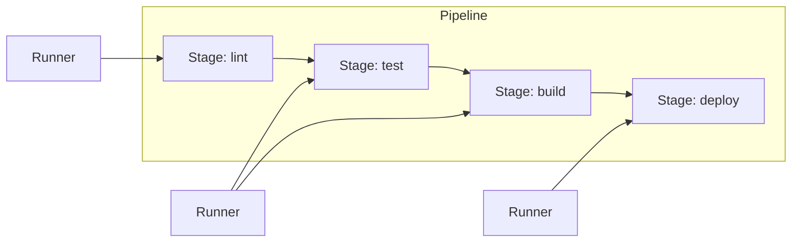
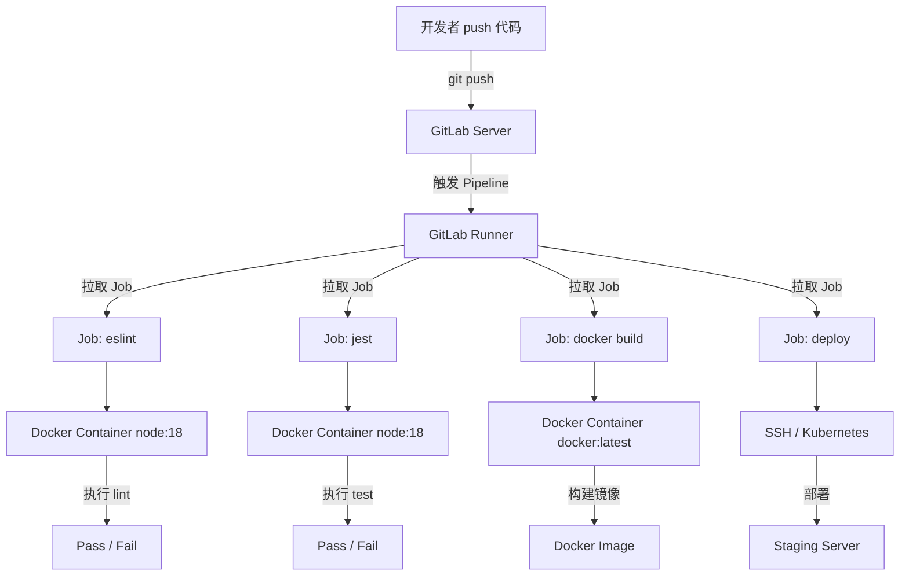
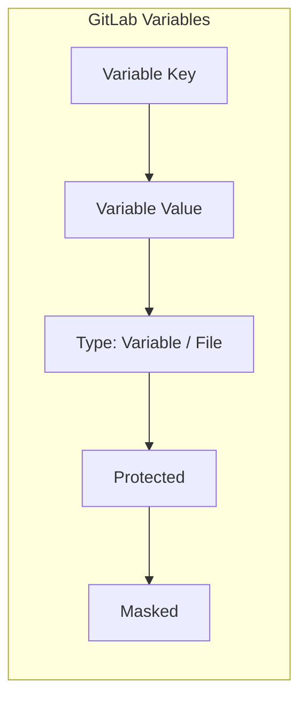
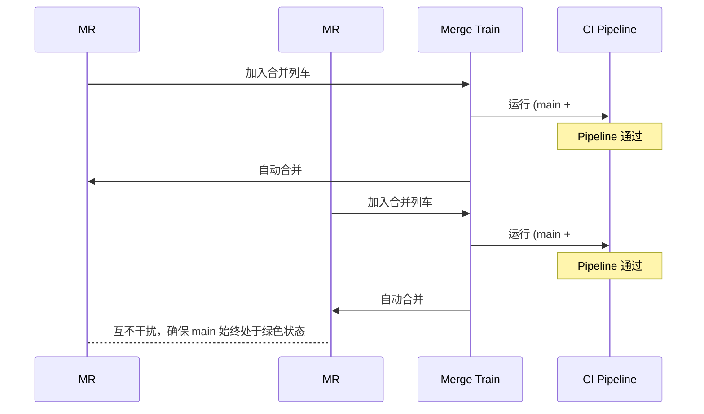

# 03 — GitLab CI 实战

> 跑通与 GitHub Actions 同样流程的 GitLab CI 版本，掌握企业级 CI/CD 工具的核心理念与操作。

---

## 🎯 学习目标

- 理解 GitLab CI 的核心概念（Job、Stage、Runner、Pipeline）
- 能编写完整的 `.gitlab-ci.yml` 实现 Lint → Test → Build → Deploy 流程
- 掌握 GitLab Runner 的注册、选择与维护
- 学会 CI/CD Variables 配置 Secrets 管理
- 了解 Merge Request Pipeline 与 Merge Trains

---

## 1. GitLab CI 核心概念

### 1.1 .gitlab-ci.yml 文件结构

GitLab CI 使用 YAML 描述流水线，文件必须命名为 `.gitlab-ci.yml` 并放置在仓库根目录。每次 push 到仓库，GitLab 会自动检测该文件并触发 Pipeline。

基本结构：

```yaml
stages:
  - lint
  - test
  - build
  - deploy

eslint-job:
  stage: lint
  script:
    - npm run lint

jest-job:
  stage: test
  script:
    - npm test
```

### 1.2 Job、Stage、Runner 的关系

| 概念 | 说明 |
|------|------|
| **Pipeline** | 一次 CI/CD 执行的全流程，包含多个 Stage |
| **Stage** | Pipeline 中的阶段，同一阶段的 Job 默认并行执行 |
| **Job** | 具体的执行任务，定义要执行的命令 |
| **Runner** | 真正运行 Job 的代理进程 |

Pipeline 执行规则：



### 1.3 与 GitHub Actions 的概念对照

| GitHub Actions | GitLab CI | 说明 |
|----------------|-----------|------|
| Workflow | Pipeline | 一次完整的 CI/CD 流程 |
| Job | Job | 最小执行单元 |
| Step（Job 内的步骤） | Script（Job 内的命令） | 执行的具体命令 |
| Action（可复用的单元） | - | GitLab 无对应概念，用 `before_script`/`after_script` 复用 |
| Runner | Runner | 执行 Job 的代理 |
| Event | Trigger（push / MR / tag） | 触发 Pipeline 的条件 |
| Matrix Strategy | Parallel:matrix | 并行策略 |
| Service Container | Services | 附加容器（如数据库、Docker） |

核心差异点：GitHub Actions 的 Job 可以有多个 Step，每个 Step 可以用不同的 Action；GitLab CI 的 Job 只有 script（一组命令），复用靠 `before_script`、`after_script` 或 `extends` 关键字。

### 1.4 Pipeline 类型

GitLab CI 支持多种触发方式：

**Branch Pipeline** — push 到分支时触发：

```yaml
workflow:
  rules:
    - if: $CI_PIPELINE_SOURCE == "push"
```

**Merge Request Pipeline** — 创建或更新 MR 时触发：

```yaml
workflow:
  rules:
    - if: $CI_PIPELINE_SOURCE == "merge_request_event"
```

**Tag Pipeline** — 打 tag 时触发（通常用于发布）：

```yaml
workflow:
  rules:
    - if: $CI_COMMIT_TAG
```

**Scheduled Pipeline** — 定时触发：

```yaml
workflow:
  rules:
    - if: $CI_PIPELINE_SOURCE == "schedule"
```

> 实际项目中通常将上述条件合并写在一个 `workflow:rules` 块中：
>
> ```yaml
> workflow:
>   rules:
>     - if: $CI_PIPELINE_SOURCE == "merge_request_event"
>     - if: $CI_COMMIT_BRANCH == $CI_DEFAULT_BRANCH
>     - if: $CI_COMMIT_TAG
>     - if: $CI_PIPELINE_SOURCE == "schedule"
> ```

### 1.5 GitLab CI 架构



---

## 2. 编写第一个 .gitlab-ci.yml

下面是一个完整的 GitLab CI 配置，实现与 Day 2 GitHub Actions 同样的流程：eslint → jest → docker build → deploy to staging。

```yaml
image: node:18-alpine

stages:
  - lint
  - test
  - build
  - deploy

# 缓存 node_modules 加速构建
cache:
  key:
    files:
      - package-lock.json
    prefix: ${CI_COMMIT_REF_SLUG}
  paths:
    - node_modules/

# 全局 before_script：所有 Job 执行前先安装依赖
before_script:
  - npm ci --cache .npm --prefer-offline

# ============ Stage: lint ============

eslint-job:
  stage: lint
  script:
    # 将 ESLint 结果输出为 JSON，供 artifacts 收集
    - npm run lint -- --format json --output-file eslint-report.json || true
  artifacts:
    name: "eslint-report-${CI_COMMIT_SHORT_SHA}"
    paths:
      - eslint-report.json
    expire_in: 30 days
    when: always
  rules:
    - if: $CI_PIPELINE_SOURCE == "merge_request_event"
    - if: $CI_COMMIT_BRANCH == $CI_DEFAULT_BRANCH

# ============ Stage: test ============

jest-job:
  stage: test
  script:
    # 需要 Jest 配置 coverageReporters 包含 cobertura 才会生成 coverage/cobertura-coverage.xml
    - npm test -- --coverage --coverageReporters=text --coverageReporters=cobertura
  artifacts:
    name: "coverage-${CI_COMMIT_SHORT_SHA}"
    paths:
      - coverage/
    expire_in: 30 days
    reports:
      coverage_report:
        coverage_format: cobertura
        path: coverage/cobertura-coverage.xml
  coverage: '/All files[^|]*\|[^|]*\s+([\d\.]+)/'
  rules:
    - if: $CI_PIPELINE_SOURCE == "merge_request_event"
    - if: $CI_COMMIT_BRANCH == $CI_DEFAULT_BRANCH

# ============ Stage: build (Docker) ============

docker-build-job:
  stage: build
  image: docker:latest
  services:
    - docker:dind
  variables:
    DOCKER_TLS_CERTDIR: "/certs"
    IMAGE_TAG: ${CI_COMMIT_TAG:-${CI_COMMIT_SHORT_SHA}}
  script:
    - docker login -u $CI_REGISTRY_USER -p $CI_REGISTRY_PASSWORD $CI_REGISTRY
    - docker build -t $CI_REGISTRY_IMAGE:$IMAGE_TAG .
    - docker push $CI_REGISTRY_IMAGE:$IMAGE_TAG
  rules:
    - if: $CI_COMMIT_BRANCH == $CI_DEFAULT_BRANCH
    - if: $CI_COMMIT_TAG
  needs:
    - eslint-job
    - jest-job

# ============ Stage: deploy ============

> ⚠️ **安全提示**：以下 SSH 部署示例仅用于学习与 Staging 环境。生产环境建议使用 File 类型 Variable 管理私钥、配置 `UserKnownHostsFile` 固定主机指纹，并避免 `StrictHostKeyChecking=no`。

deploy-staging-job:
  stage: deploy
  image: alpine:latest
  before_script:
    - apk add --no-cache openssh-client
    - eval $(ssh-agent -s)
    # 建议将 STAGING_SSH_PRIVATE_KEY 设置为 GitLab CI/CD Variables 的 File 类型
    - echo "$STAGING_SSH_PRIVATE_KEY" | tr -d '\r' | ssh-add -
    - mkdir -p ~/.ssh
    - chmod 700 ~/.ssh
  script:
    - ssh -o StrictHostKeyChecking=no $STAGING_HOST "
        docker pull $CI_REGISTRY_IMAGE:$CI_COMMIT_SHORT_SHA &&
        docker stop my-app || true &&
        docker rm my-app || true &&
        docker run -d --name my-app -p 3000:3000 $CI_REGISTRY_IMAGE:$CI_COMMIT_SHORT_SHA
      "
  environment:
    name: staging
    url: https://staging.example.com
  rules:
    - if: $CI_COMMIT_BRANCH == $CI_DEFAULT_BRANCH
  needs:
    - docker-build-job
```

### 关键配置说明

**image 与 services：**

- `node:18-alpine` — 前端 Lint/Test 的环境
- `docker:latest` + `services: docker:dind` — 使用 Docker-in-Docker 构建镜像。dind（Docker in Docker）允许在容器内部运行 Docker 守护进程，实现一个 CI Job 中完成 docker build & push

**cache 配置：**

```yaml
cache:
  key:
    files:
      - package-lock.json
    prefix: ${CI_COMMIT_REF_SLUG}
  paths:
    - node_modules/
```

- `files: package-lock.json` — 锁文件未变化时复用缓存
- `prefix: ${CI_COMMIT_REF_SLUG}` — 不同分支使用不同缓存，避免污染

**artifacts 配置：**

- `artifacts.paths` — 指定要保留的构建产物（lint 报告、测试覆盖率）
- `artifacts.expire_in` — 设置过期时间，避免长期占用存储
- `artifacts.reports.coverage_report` — GitLab 原生支持的覆盖率报告，会显示在 MR 页面

**needs 关键字：**

- 显式声明 Job 的依赖关系，默认 Stage 间串行、Stage 内并行
- `needs` 允许跨 Stage 指定依赖，跳过无关 Stage 的等待

---

## 3. GitLab Runner 管理

### 3.1 Shared Runner 与 Specific Runner

| 类型 | 适用范围 | 说明 |
|------|---------|------|
| **Shared Runner** | 整个 GitLab 实例 | 所有项目共享，由平台管理员维护 |
| **Group Runner** | 某个 Group 内的项目 | 组级共享，适合团队使用 |
| **Specific Runner** | 单个项目 | 项目专属，可定制环境，适合有特殊硬件依赖的项目 |

选择建议：先用 GitLab 提供的免费 Shared Runner 快速启动，当有特殊依赖（GPU、内网资源、大内存）时再注册 Specific Runner。

### 3.2 注册 Self-hosted Runner

在目标服务器上执行以下步骤：

```bash
# 1. 下载 GitLab Runner 二进制文件
sudo curl -L --output /usr/local/bin/gitlab-runner \
  https://gitlab-runner-downloads.s3.amazonaws.com/latest/binaries/gitlab-runner-linux-amd64
sudo chmod +x /usr/local/bin/gitlab-runner

# 2. 安装并启动
sudo gitlab-runner install --user=gitlab-runner --working-directory=/home/gitlab-runner
sudo gitlab-runner start

# 3. 注册 Runner（token 从项目 Settings > CI/CD > Runners 获取）
sudo gitlab-runner register \
  --url https://gitlab.com \
  --registration-token YOUR_REGISTRATION_TOKEN \
  --executor docker \
  --description "My Docker Runner" \
  --docker-image alpine:latest \
  --docker-privileged \
  --tag-list "docker,staging"
```

注册完成后，Runner 会出现在项目的 Runner 列表中。也可以在注册时添加 `--run-untagged=true` 允许该 Runner 运行没有指定 tag 的 Job。

### 3.3 Executor 类型

| Executor | 适用场景 | 优势 | 劣势 |
|----------|---------|------|------|
| **Shell** | 简单任务、单机部署 | 最轻量，无需 Docker | 环境隔离差，依赖主机环境 |
| **Docker** | 大多数 CI 场景 | 环境隔离好，可指定镜像 | 需要 Docker 环境 |
| **Kubernetes** | 大规模容器化场景 | 弹性伸缩，资源利用率高 | 运维复杂 |
| **SSH** | 远程服务器部署 | 无需在目标机装 Runner | 适合窄场景（仅部署） |

### 3.4 Runner Tag 的使用

Tag 是 Runner 的标签，Job 通过 `tags` 字段指定需要的 Runner：

```yaml
deploy-prod-job:
  stage: deploy
  tags:
    - production
  script:
    - ./deploy.sh
```

当 Job 设置了 `tags`，只有带这些标签的 Runner 才能执行该 Job。反之，未设置 tags 的 Job 只能被 `run-untagged=true` 的 Runner 执行。

---

## 4. Secrets 管理

### 4.1 CI/CD Variables 配置

路径：**Settings > CI/CD > Variables**



在 `.gitlab-ci.yml` 中使用：

```yaml
script:
  - docker login -u $CI_REGISTRY_USER -p $CI_REGISTRY_PASSWORD $CI_REGISTRY
  - curl -H "Authorization: Bearer $DEPLOY_TOKEN" https://api.example.com/deploy
```

### 4.2 Masked Variable 与 File Variable

**Masked Variable** — 在 Job 日志中自动隐藏值（用 `[MASKED]` 替代）：

- 值必须符合格式要求：长度至少 8 位，base64 编码或纯文本
- 不能包含 `$`、`{`、`}` 等特殊字符
- 不能是 URL 等结构化文本

**File Variable** — 将变量值写入临时文件，`$VARIABLE_NAME` 会解析为文件路径：

```yaml
variables:
  DEPLOY_KEY: ${STAGING_SSH_KEY}  # File Variable

script:
  - cat $DEPLOY_KEY > ~/.ssh/id_rsa  # 变量值是文件路径
```

File Variable 适合 SSH 私钥、证书等需要文件形式的内容。

### 4.3 Protected Variable

Protected Variable 只在受保护分支（如 `main`、`production`）上可用：

- 设置 Variable 时勾选 **Protected** 即可
- 未受保护的分支中，该变量值为空
- 适用于生产环境密钥、数据库密码等高敏感信息

### 4.4 变量优先级

从低到高：

1. **Group-level Variables** — 组级别定义，所有子项目继承
2. **Project-level Variables** — 项目级别定义
3. **Variables 块中定义** — `.gitlab-ci.yml` 的 `variables` 关键字
4. **Trigger API 变量** — 通过 API 触发 Pipeline 时传入
5. **Job-level Variables** — Job 内 `variables` 局部覆盖

优先级规则：**更具体的覆盖更宽泛的**。Job 级 > 项目级 > 组级。

---

## 5. Merge Request Pipeline

### 5.1 MR 触发 Pipeline 的配置

当开发者创建或更新 Merge Request 时触发 Pipeline：

```yaml
workflow:
  rules:
    - if: $CI_PIPELINE_SOURCE == "merge_request_event"
    - if: $CI_COMMIT_BRANCH == $CI_DEFAULT_BRANCH
    - if: $CI_COMMIT_TAG
```

在 MR Job 中，还可以使用 `$CI_MERGE_REQUEST_*` 系列变量：

```yaml
jest-job:
  script:
    - npm test
  artifacts:
    reports:
      coverage_report:
        coverage_format: cobertura
        path: coverage/cobertura-coverage.xml
```

当 MR Pipeline 通过后，GitLab 会在 MR 页面上显示 Pipeline 状态。可以在项目设置中开启 **Pipelines must succeed** 作为 MR 合入门禁。

### 5.2 Merge Trains（合并列车）

Merge Trains 是一种有序合并机制：多个 MR 排队依次通过 Pipeline，保证始终有一份"合并后"的代码通过测试。

启用方式：

1. 项目 **Settings > General > Merge requests > Merge options**
2. 勾选 **Merge trains**
3. 同时开启 **Pipelines must succeed** 和 **Skipped pipeline are considered failed**



Merge Trains 的优势：多人同时提交 MR 时，传统模式是逐个合并逐个跑 Pipeline，Merge Trains 保证"合入后"的代码也通过了测试，避免合入瞬间集体变红。

### 5.3 Pipeline 状态作为门禁

在项目设置中配置：

1. **Settings > General > Merge requests > Merge checks**
2. 开启以下选项：
   - **Pipelines must succeed** — Pipeline 必须全部通过
   - **All discussions must be resolved** — 所有评论必须解决

效果：开发者无法合并一个 Pipeline 失败的 MR，即使有 Maintainer 权限。

---

## 6. 面试回答模板

> **问：** GitLab CI 和 GitHub Actions 的主要区别是什么？

**答：** 两者核心概念高度相似（Job/Stage/Pipeline/Runner），但有几个关键差异：

1. **复用机制不同**：GitHub Actions 通过 Action 市场实现 Job 内 Step 级别的复用；GitLab CI 没有 Action 的概念，主要通过 `extends`、`before_script`、`after_script` 和 include 模块化 YAML 来复用。

2. **Runner 策略不同**：GitHub Actions 默认使用 GitHub 托管的 Runner，按分钟计费，自托管 Runner 需要手动配置；GitLab CI 自带 Runner 注册机制，自托管是"一等公民"，企业可以轻松搭建 Shared Runner 池。

3. **触发方式**：GitHub Actions 的触发条件更灵活（`push`、`pull_request`、`schedule`、`workflow_dispatch` 等）；GitLab CI 通过 `rules` 关键字控制，同样支持 push、MR、tag、schedule。

4. **安全扫描**：GitLab CI 内置了 SAST、DAST、Secret Detection 等安全扫描能力（Ultimate 版）；GitHub Actions 需要从市场安装第三方 Action。

5. **配置复杂度**：GitHub Actions 的 YAML 更简洁直观，适合小型项目快速上手；GitLab CI 功能更强大但配置也更复杂，需要学习 `rules`、`needs`、`extends` 等高级语法。

> **问：** GitLab CI 中不同类型 Runner 的选型建议？

**答：** Runner 选型需要综合考虑项目规模、资源需求和安全要求：

1. **云上项目 + 标准需求** → 优先使用 GitLab 提供的 Shared Runner，零维护成本。适合大多数开源项目和小型团队。

2. **企业私有部署** → 推荐自建 Specific Runner，使用 Docker Executor。优点：Job 环境隔离、镜像灵活选择、内网资源可达、不依赖外网。每台服务器可以注册为不同 tag 的 Runner（如 `linux`、`gpu`、`staging`），Job 通过 `tags` 字段调度。

3. **需要 GPU 或专有硬件** → 必须有 Specific Runner，使用 Shell Executor 或 Docker Executor（需配置 `--gpus all`）。Shared Runner 无法满足这类特殊资源需求。

4. **Kubernetes 环境** → 使用 Kubernetes Executor，Runner 自动创建 Pod 执行 Job，天然支持弹性伸缩和高可用。适合大规模微服务项目的 CI 场景。

5. **安全敏感项目** → 使用 Ephemeral Runner（`--ephemeral` 模式），每次 Job 后自动销毁 Runner 实例，避免残留数据。配合 Protected Variable 管理生产环境密钥。

选型口诀：**共享跑标准，自建跑特殊，K8s 跑大规模，Ephemeral 跑敏感。**

---

## 📝 本章小结

- GitLab CI 与 GitHub Actions 概念高度相似，核心差异在复用机制和 Runner 管理
- `.gitlab-ci.yml` 通过 `stages`、`job`、`script`、`rules` 定义 Pipeline
- `cache` 和 `artifacts` 是提升 CI 效率的两个关键配置
- Self-hosted Runner 是 GitLab CI 的企业级优势，灵活且可控
- CI/CD Variables 配合 Masked/Protected 实现安全的 Secrets 管理
- Merge Request Pipeline + Merge Trains 保证代码合入质量

下一步：[Day 4 — 质量门禁与安全扫描](04-security-gates.md)
