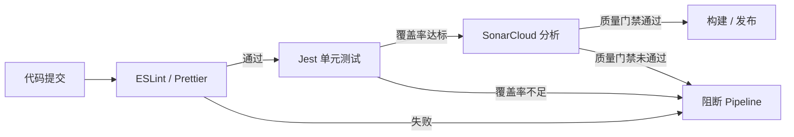
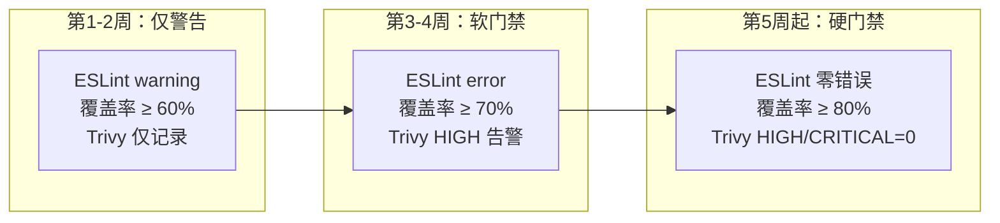
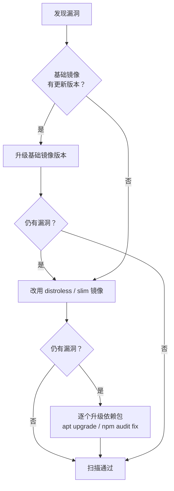
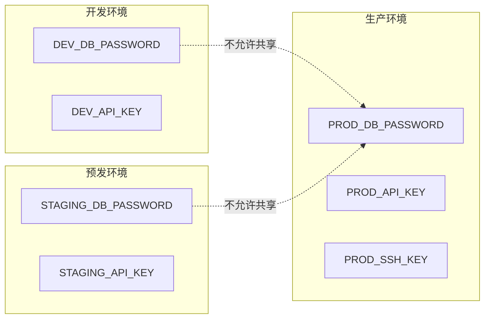

# 04 — 质量门禁、安全扫描与 Secrets 管理

> 本文件是 CI/CD 学习路径的第 4 天内容。Day 4 聚焦于在 Pipeline 中接入质量门禁与安全扫描，包括 ESLint/Jest 覆盖率门禁、SonarCloud 代码质量分析、Trivy 镜像漏洞扫描、GitLeaks 密钥泄露检测，以及 Secrets 安全管理的最佳实践。

---

## 📌 元信息

| 项目 | 说明 |
|------|------|
| **学习目标** | Pipeline 中接入 ESLint/Jest、Trivy、SonarCloud、GitLeaks，掌握 Secrets 管理 |
| **前置知识** | GitHub Actions / GitLab CI 基本操作（Day 2、Day 3） |
| **预计时间** | 4-6 小时 |
| **产出** | 支持质量门禁 + 安全扫描的完整 Pipeline 配置 |

---

## 1. 代码质量门禁

质量门禁（Quality Gate）是 Pipeline 中的检查点——不通过则阻断发布流程，而不是简单记录问题在后续阶段处理。



### 1.1 ESLint / Prettier 在 CI 中的配置

**目标**：每次提交自动检查代码规范，确保风格一致。

**GitHub Actions 配置示例**：

```yaml
name: Lint Check
on: [pull_request]

jobs:
  lint:
    runs-on: ubuntu-latest
    steps:
      - uses: actions/checkout@v4
      - uses: actions/setup-node@v4
        with:
          node-version: 20
          cache: 'npm'
      - run: npm ci
      - run: npm run lint
      - run: npm run format:check
```

**GitLab CI 配置示例**：

```yaml
lint:
  stage: lint
  image: node:20-alpine
  before_script:
    - npm ci
  script:
    - npm run lint
    - npm run format:check
  rules:
    - if: $CI_PIPELINE_SOURCE == "merge_request_event"
```

**package.json 中推荐的 scripts**：

```json
{
  "scripts": {
    "lint": "eslint 'src/**/*.{js,ts,vue}' --max-warnings 0",
    "format": "prettier --write 'src/**/*.{js,ts,vue}'",
    "format:check": "prettier --check 'src/**/*.{js,ts,vue}'"
  }
}
```

> `--max-warnings 0` 表示零容忍——有任何 warning 即阻断。但建议团队逐步收紧，不要一开始就设零。

### 1.2 单元测试覆盖率门禁

Jest 的 `--coverage` 标志可以生成覆盖率报告，并支持阈值门禁：

```bash
npx jest --coverage --coverageThreshold='{"global":{"branches":80,"functions":80,"lines":80,"statements":80}}'
```

在 `jest.config.js` 中集中管理覆盖率阈值：

```javascript
module.exports = {
  collectCoverage: true,
  coverageThreshold: {
    global: {
      branches: 80,
      functions: 80,
      lines: 80,
      statements: 80,
    },
    'src/utils/**': {
      // 工具函数要求更高覆盖率
      branches: 90,
      lines: 90,
    },
  },
  collectCoverageFrom: ['src/**/*.{js,ts,vue}', '!src/**/*.d.ts'],
};
```

**覆盖率门禁的设定原则**：

- 不要一开始就要求 90%+ 覆盖率。团队未建立测试习惯时，这会让 CI 形同虚设
- 建议分阶段设置：先 60% → 70% → 80%，每个阶段给团队 1-2 周的适应期
- 对不同模块设置不同阈值。核心业务逻辑要求 80%+，UI 组件可放宽
- 新代码覆盖率控制在 PR 级别，不追溯历史

### 1.3 SonarCloud 接入

SonarCloud（或自建 SonarQube）提供静态代码分析、技术债务评估和代码质量门禁。

**项目根目录下的 `sonar-project.properties`**：

```properties
sonar.projectKey=my-project
sonar.organization=my-org
sonar.host.url=https://sonarcloud.io

# 源码目录
sonar.sources=src
sonar.exclusions=**/*.test.*,**/*.spec.*,node_modules/**

# 测试与覆盖率
sonar.tests=tests
sonar.test.inclusions=**/*.test.*,**/*.spec.*
sonar.javascript.lcov.reportPaths=coverage/lcov.info

# 语言
sonar.language=ts
```

**GitHub Actions 集成示例**：

```yaml
- name: SonarCloud Scan
  uses: SonarSource/sonarcloud-github-action@v2
  env:
    GITHUB_TOKEN: ${{ secrets.GITHUB_TOKEN }}
    SONAR_TOKEN: ${{ secrets.SONAR_TOKEN }}
```

**GitLab CI 集成示例**：

```yaml
sonar:
  stage: quality
  image: sonarsource/sonar-scanner-cli:latest
  variables:
    SONAR_TOKEN: $SONAR_TOKEN
    SONAR_HOST_URL: "https://sonarcloud.io"
  script:
    - sonar-scanner
  rules:
    - if: $CI_PIPELINE_SOURCE == "merge_request_event"
    - if: $CI_COMMIT_BRANCH == "main"
```

### 1.4 门禁阈值的设定原则



**核心原则**：

1. **先 warn 再 error**：给团队缓冲时间，避免流水线全线漂红
2. **阈值要有依据**：根据项目当前实际水平 + 10-15% 的合理提升目标设定
3. **允许例外**：对 legacy 模块、非核心代码设低阈值或排除
4. **门禁要可修复**：如果团队需要两周才能修好一个问题，那阈值高得有问题

---

## 2. 镜像安全扫描

### 2.1 Trivy 介绍

[Trivy](https://github.com/aquasecurity/trivy) 是 Aqua Security 开源的镜像/文件系统/代码库漏洞扫描器。它支持：

- 操作系统软件包漏洞（Alpine、Debian、Ubuntu 等）
- 应用依赖漏洞（npm、pip、maven、go 等）
- IaC 配置安全（Dockerfile、K8s、Terraform）
- Secrets 泄露检测

**本地安装**：

```bash
# macOS（推荐）
brew install trivy

# Linux（推荐通过官方仓库安装，具体见 Trivy 官方文档）
# 如果临时使用，可用以下脚本，但生产环境建议改用包管理器或固定版本镜像
curl -sfL https://raw.githubusercontent.com/aquasecurity/trivy/main/contrib/install.sh | sh

# Docker 运行（CI 中最常用，可固定版本）
docker run --rm -v /var/run/docker.sock:/var/run/docker.sock aquasec/trivy:latest image my-image:latest
```

### 2.2 GitHub Actions 集成

使用 `aquasecurity/trivy-action` 官方 Action：

```yaml
- name: Build Docker Image
  run: docker build -t my-app:${{ github.sha }} .

- name: Run Trivy Scan
  uses: aquasecurity/trivy-action@master
  with:
    image-ref: 'my-app:${{ github.sha }}'
    format: 'sarif'
    output: 'trivy-results.sarif'
    severity: 'CRITICAL,HIGH'
    exit-code: '1'  # 发现 CRITICAL/HIGH 漏洞时退出码为 1，阻断 Pipeline
    ignore-unfixed: true  # 忽略无修复方案的漏洞
    vuln-type: 'os,library'

- name: Upload Trivy results to GitHub Security
  uses: github/codeql-action/upload-sarif@v3
  with:
    sarif_file: 'trivy-results.sarif'
```

### 2.3 GitLab CI 集成

```yaml
container_scan:
  stage: scan
  image:
    name: aquasec/trivy:latest
    entrypoint: [""]
  variables:
    CI_IMAGE: $CI_REGISTRY_IMAGE:$CI_COMMIT_SHORT_SHA
  before_script:
    - docker login -u $CI_REGISTRY_USER -p $CI_REGISTRY_PASSWORD $CI_REGISTRY
  script:
    - trivy image --severity CRITICAL,HIGH --exit-code 1 --ignore-unfixed $CI_IMAGE
  rules:
    - if: $CI_PIPELINE_SOURCE == "merge_request_event"
    - if: $CI_COMMIT_BRANCH == "main"
```

### 2.4 扫描结果解读

Trivy 输出格式示例：

```
node:20-alpine (alpine 3.19)
===================
Total: 3 (CRITICAL: 1, HIGH: 2)

┌──────────┬────────────────┬──────────┬──────────────────┐
│ Library  │ Vulnerability  │ Severity │ Installed Version │
├──────────┼────────────────┼──────────┼──────────────────┤
│ openssl  │ CVE-2024-XXXX │ CRITICAL │ 3.1.4-r0         │
│ libcrypto│ CVE-2024-YYYY │ HIGH     │ 3.1.4-r0         │
│ npm      │ CVE-2024-ZZZZ │ HIGH     │ 10.2.4           │
└──────────┴────────────────┴──────────┴──────────────────┘
```

| 严重级别 | 含义 | 建议处理时限 |
|----------|------|-------------|
| **CRITICAL** | 可远程利用、无需认证、影响广泛的漏洞 | 24 小时内 |
| **HIGH** | 可导致数据泄露或服务中断 | 7 天内 |
| **MEDIUM** | 特定条件下可利用 | 30 天内 |
| **LOW** | 理论风险，实际利用困难 | 下一个发布周期 |

### 2.5 误报处理与忽略策略

有些漏洞在当前上下文中不构成实际威胁（如通过环境变量控制的配置项暴露风险），可通过 `.trivyignore` 忽略。

**`.trivyignore` 文件示例**：

```text
# 理由：此 CVE 影响的是 openssl 的 FIPS 模式，我们不使用该模式
CVE-2024-XXXX

# 理由：影响的是特定的 TLS 握手场景，我们的服务不对外暴露 TLS
CVE-2024-YYYY

# 指定 expire 日期，到期后自动重新生效
CVE-2024-ZZZZ expires: 2025-06-30
```

**在 Trivy 命令中指定忽略文件**：

```bash
trivy image --ignorefile .trivyignore --severity CRITICAL,HIGH my-image:latest
```

> **重要**：每次添加忽略条目时，必须在注释中写明理由和负责人。忽略不是逃避，而是有管理的风险接受。

### 2.6 漏洞修复策略

当 Trivy 报告漏洞时，按以下优先级修复：



**具体做法**：

1. **升级基础镜像**：`node:20-alpine` → `node:22-alpine`，或切换到打了补丁的 patch 版本
2. **使用 distroless 镜像**：Distroless 镜像仅包含应用和运行时，无 shell/包管理器，攻击面最小

   ```dockerfile
   # 多阶段构建：distroless 作为运行阶段
   FROM node:20-alpine AS builder
   WORKDIR /app
   COPY package*.json ./
   RUN npm ci
   COPY . .
   RUN npm run build

   FROM gcr.io/distroless/nodejs20-debian12
   COPY --from=builder /app/dist /app
   CMD ["/app/index.js"]
   ```

3. **Patch 依赖**：对无法升级基础镜像的场景，在 Dockerfile 中显式修复

   ```dockerfile
   RUN apk upgrade --no-cache openssl libcrypto
   # 或
   RUN npm audit fix --production
   ```

---

## 3. 密钥泄露扫描

### 3.1 GitLeaks 的配置与使用

[GitLeaks](https://github.com/gitleaks/gitleaks) 是开源的静态分析工具，用于检测 Git 仓库中的密钥、令牌、密码等敏感信息。

**安装**：

```bash
# macOS
brew install gitleaks

# 或使用 Docker
docker pull zricethezav/gitleaks:latest
```

**本地扫描**：

```bash
# 扫描当前工作目录
gitleaks detect --source . --verbose

# 扫描整个 Git 历史
gitleaks detect --source . --verbose --log-opts="--all"
```

**`.gitleaks.toml` 自定义配置**：

```toml
title = "My Project GitLeaks Config"

# 扩展默认规则
[extend]
useDefault = true

# 添加自定义规则
[[rules]]
id = "my-custom-token"
description = "My project specific API token"
regex = '''my-project-api-key-[A-Za-z0-9]{16,}'''
tags = ["my-project", "api-key"]

# 白名单——排除已知无风险的路径或内容
[allowlist]
paths = [
    "test/fixtures/*",
    "*.test.ts",
]
regexes = [
    "placeholder|example|test-key",
]
```

**GitHub Actions 集成**：

```yaml
- name: GitLeaks Scan
  uses: gitleaks/gitleaks-action@v2
  env:
    GITHUB_TOKEN: ${{ secrets.GITHUB_TOKEN }}
```

**GitLab CI 集成**：

```yaml
gitleaks:
  stage: security
  image: zricethezav/gitleaks:latest
  script:
    - gitleaks detect --source . --verbose --no-git  # 当前分支，不扫描历史
  rules:
    - if: $CI_PIPELINE_SOURCE == "merge_request_event"
```

### 3.2 GitHub Secret Scanning

GitHub 提供了内置的 Secret Scanning 功能，对公有仓库免费，对私有仓库需 GitHub Advanced Security。

- 自动检测已知模式的密钥（AWS Key、GitHub Token、npm token 等）
- 检测到密钥后会给仓库管理员和密钥提供方发送告警
- 支持自定义模式

**开启方式**：`仓库 Settings → Security → Secret scanning → Enable`

### 3.3 密钥检测的误报处理

GitLeaks / Secret Scanning 可能产生误报，常见场景：

- 测试用例中的占位密钥（如 `test-key-12345`）
- 文档中的示例代码（如 `.env.example`）
- 第三方库中自带的测试密钥

**处理方式**：

1. 在 `.gitleaks.toml` 的 `allowlist` 中明确添加排除规则
2. 每次排除都需写明理由，并在代码评审中人工确认
3. 对测试数据中的占位符统一使用约定前缀（如 `PLACEHOLDER_`）

### 3.4 历史 Git 记录中的密钥清理

如果密钥已经被提交到 Git 历史中，仅删除当前文件是不够的——历史记录中仍然存在。这时需要使用 [BFG Repo-Cleaner](https://rtyley.github.io/bfg-repo-cleaner/) 清理。

```bash
# 1. 克隆裸仓库
git clone --mirror git@github.com:my-org/my-repo.git

# 2. 使用 BFG 替换指定文本
java -jar bfg.jar --replace-text passwords.txt my-repo.git

# 3. 清理并强制推送
cd my-repo.git
git reflog expire --expire=now --all && git gc --prune=now --aggressive
git push --force
```

> **安全提醒**：即便删除了 Git 历史，密钥仍可能已被下游工具（CI 缓存、Docker 镜像层等）缓存。**最佳做法是立即轮换密钥**，而不仅依赖历史清理。

---

## 4. Secrets 安全最佳实践

### 4.1 Secrets 加密存储原则

- **绝不硬编码**：不在 YAML、Dockerfile、代码中写入任何明文密钥
- **使用平台机制**：GitHub Secrets / GitLab CI Variables / 云厂商 Secret Manager
- **传输加密**：确保 CI 到制品仓库、部署目标之间的通信使用 HTTPS / TLS
- **静态加密**：存储在云 Secret Manager 中的密钥默认加密

**错误示例**（禁止）：

```yaml
# ❌ 绝不这样做
- name: Login to Docker Hub
  run: echo "my-password-123" | docker login -u my-user --password-stdin
```

**正确示例**：

```yaml
# ✅ 使用 GitHub Secrets
- name: Login to Docker Hub
  uses: docker/login-action@v3
  with:
    username: ${{ secrets.DOCKER_USERNAME }}
    password: ${{ secrets.DOCKER_PASSWORD }}
```

### 4.2 多环境 Secrets 隔离

不同环境使用不同的密钥，避免开发环境的密钥泄露影响生产：

```yaml
# GitHub Actions 环境级 Secrets
jobs:
  deploy:
    runs-on: ubuntu-latest
    environment: production  # 指定环境
    steps:
      - run: echo "${{ secrets.DEPLOY_KEY }}"  # 仅 production 环境的密钥
```



**最佳实践**：

- 开发人员不应知道生产环境的密钥
- 生产环境的密钥变更频率应高于开发环境
- CI 日志中应屏蔽所有密钥（GitHub 自动 mask `${{ secrets.* }}`）

### 4.3 Secrets 轮换策略

| 密钥类型 | 建议轮换周期 | 触发轮换条件 |
|----------|-------------|-------------|
| 数据库密码 | 90 天 | 人员离职、疑似泄露 |
| API 密钥 | 按合同或 180 天 | 项目交接、安全审计 |
| SSH 密钥 | 180 天-1 年 | 服务器迁移、员工离职 |
| CI 系统 Token | 90 天 | 仓库权限变更 |

**自动化轮换**：

- 使用 GitHub Actions 配合云厂商 API 自动生成新密钥并更新 Secrets
- 利用 Vault 等密钥管理工具的动态 Secrets 能力（每次 access 生成临时凭证）

### 4.4 不要在日志、构建产物中泄露 Secrets

```bash
# ❌ 不安全的做法
echo "Deploying with password: $DEPLOY_PASSWORD"

# ✅ 安全的做法
echo "Deploying to $DEPLOY_HOST"
```

**检查清单**：

- [ ] 使用 `printenv` 前确认环境变量中不包含密钥
- [ ] 构建产物中不包含 `.env` 文件
- [ ] Cache 目录中不包含密钥文件
- [ ] 测试报告、覆盖率报告中不暴露连接信息

### 4.5 Self-hosted Runner 的安全注意事项

使用自托管 Runner 时，攻击面比 GitHub-hosted 大得多。每个 Job 都可能拉取恶意代码，因此隔离至关重要。

| 风险 | 缓解措施 |
|------|---------|
| Job 间残留数据 | 启用 `ephemeral` 模式，每次 Job 后销毁 Runner |
| 主机级漏洞 | 使用容器化 Runner（`docker run --rm ...`） |
| 网络暴露 | 限制 Runner 的出站规则，仅允许白名单 Registry |
| 密钥访问权限 | 最小权限原则，Runner 只读需要操作的目标 |

**Ephemeral Runner 配置示例**：

`ephemeral` 是 Runner 注册时的参数，不是 Workflow 配置。注册时加上 `--ephemeral`，该 Runner 执行完一个 Job 后就会自动注销并清理环境：

```bash
# 在 Runner 主机上执行注册
./config.sh --ephemeral --url https://github.com/org/repo --token xxx
```

```yaml
# Workflow 中仍然使用 runs-on: self-hosted，但底层 Runner 是 ephemeral 的
jobs:
  build:
    runs-on: self-hosted
```

**GitLab CI 安全 Runner 配置**：

```yaml
# config.toml
[[runners]]
  name = "secure-runner"
  url = "https://gitlab.com/"
  executor = "docker"
  [runners.docker]
    image = "alpine:latest"
    privileged = false  # 不以 privileged 模式运行
    volumes = ["/cache"]
  [runners.custom_build_dir]
    enabled = true
```

---

## 5. 面试回答模板

> **问：什么是 Quality Gate？你通常会设置哪些门禁？**

Quality Gate（质量门禁）是 CI/CD  Pipeline 中的自动化质量检查点。每一次代码提交都必须通过这些检查才能进入下一个阶段（合并、构建、部署）。通常我们会设置以下门禁：

1. **代码规范门禁**：ESLint / Prettier 零错误（团队成熟后设为零 warning）
2. **单元测试门禁**：覆盖率不低于 80%（核心模块不低于 90%），且全部用例通过
3. **安全扫描门禁**：Trivy 镜像扫描无 CRITICAL / HIGH 漏洞
4. **密钥扫描门禁**：GitLeaks 检测无暴露密钥
5. **代码质量门禁**：SonarCloud 质量门禁（无 blocker/critical 异味）

设定门禁时，建议分阶段推进：先告警、再软阻断、最后硬阻断，给团队适应时间。

> **问：CI 中镜像扫描不通过怎么办？**

扫描不通过时，按以下步骤处理：

1. **确认是否为误报**：如果是误报，在 `.trivyignore` 中添加忽略规则并注明理由
2. **优先升级基础镜像**：将 `node:18-alpine` 升级到 `node:20-alpine` 通常能解决大部分系统级漏洞
3. **改用 distroless 镜像**：Distroless 镜像没有包管理器和 shell，攻击面最小
4. **Patch 依赖**：对应用层依赖（npm/pip），执行 `npm audit fix` 或手动升级
5. **无法立即修复时**：在 Issue 中跟踪，设定修复期限（如 7 天），Pipeline 中该漏洞降级为 warning

关键是区分"可阻断"和"可接受"的风险。对于无法修复且风险较低的漏洞（如仅在特定配置下可利用），通过补充防御（WAF、网络隔离）来降低风险，而非盲目阻断所有构建。

> **问：Pipeline 中如何保证密钥安全？**

要从多个层面保证密钥安全：

1. **存储层**：使用 CI 平台的 Secrets 机制（GitHub Secrets / GitLab CI Variables），绝不硬编码在 YAML 或代码中
2. **传输层**：所有密钥通过安全通道传递，CI 工具会自动 mask 日志中的 Secrets 值
3. **环境隔离**：不同环境使用不同的密钥集，生产密钥只有生产环境的 Job 可以访问
4. **生命周期**：定期轮换密钥（数据库密码 90 天、API Key 180 天），人员离职立即轮换
5. **历史清理**：一旦发现密钥暴露，立即轮换密钥，并使用 BFG Repo-Cleaner 清理 Git 历史
6. **运行层**：Self-hosted Runner 启用 ephemeral 模式，防止 Job 间数据残留

一句话总结：密钥管理的本质不是"藏起来"，而是**可审计、可轮换、可隔离**。

---

## 补充资源

- [Trivy 官方文档](https://aquasecurity.github.io/trivy/)
- [GitLeaks 官方文档](https://gitleaks.io/)
- [SonarCloud 文档](https://docs.sonarcloud.io/)
- [BFG Repo-Cleaner](https://rtyley.github.io/bfg-repo-cleaner/)
- [GitHub Secret Scanning](https://docs.github.com/en/code-security/secret-security)

---

## 🔗 下一步

下一章：[05-deployment-strategies.md](05-deployment-strategies.md) — 部署策略、回滚、多环境、GitOps
