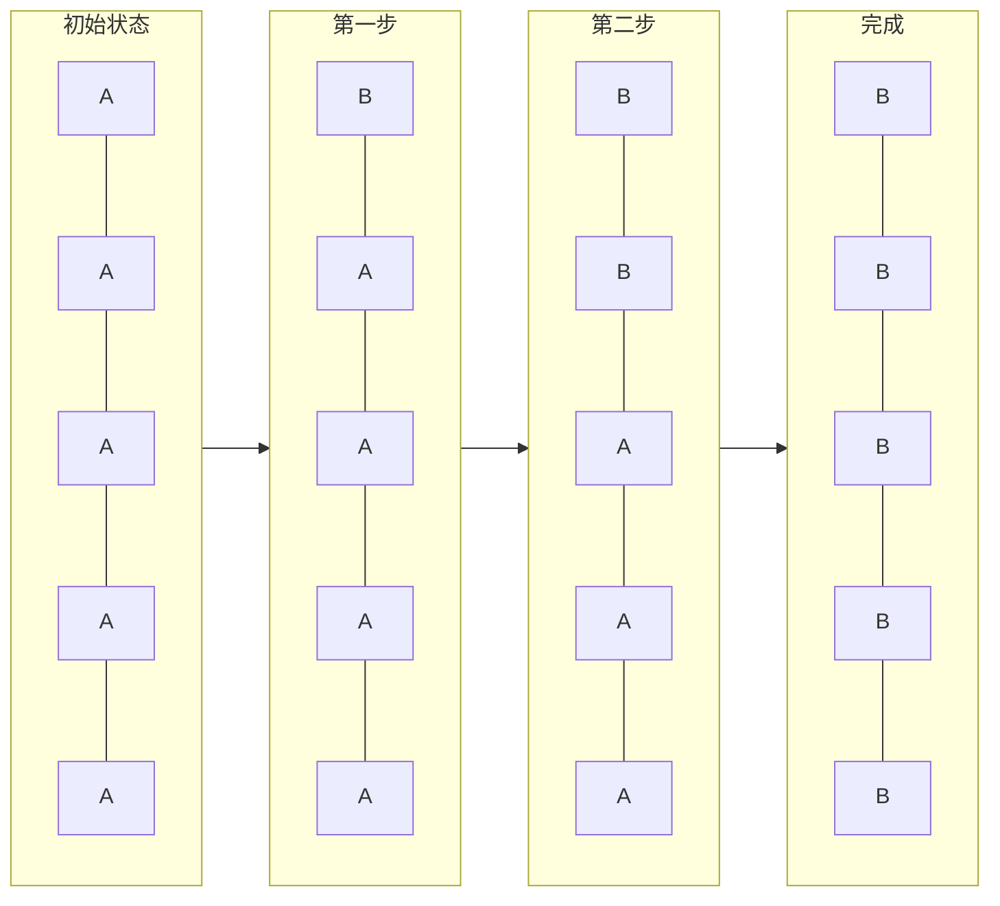
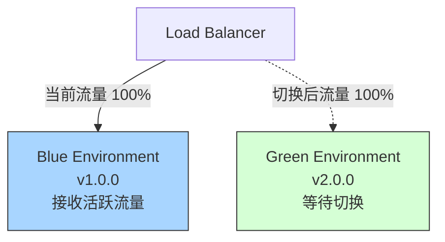
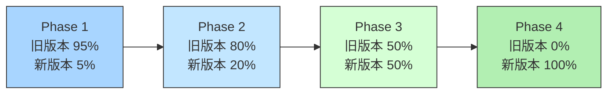
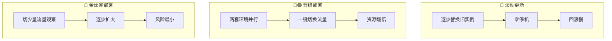
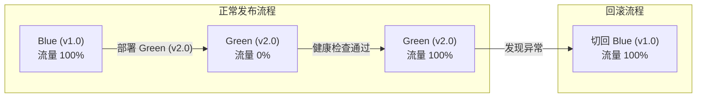
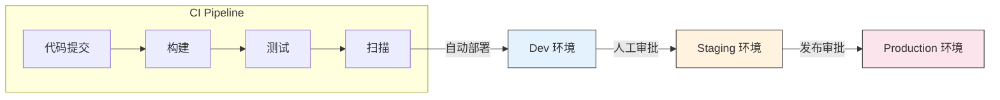
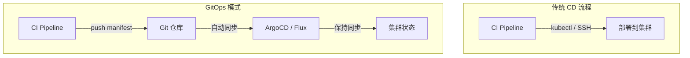
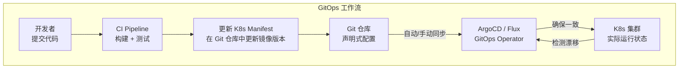

# 05 — 部署策略、回滚、多环境、GitOps

> 掌握部署策略设计，能讲清滚动/蓝绿/金丝雀/回滚，理解多环境管理与 GitOps。

---

## 🎯 学习目标

- 理解三种核心部署策略（滚动更新、蓝绿部署、金丝雀部署）的原理与适用场景
- 掌握不同策略下的回滚机制
- 能设计多环境部署流程（Dev / Staging / Production）
- 理解 GitOps 核心理念及其与传统 CD 的区别
- 能回答部署相关的面试题（蓝绿 vs 金丝雀 vs 滚动、一键回滚、GitOps）

---

## 1. 三种核心部署策略

部署策略决定了新版本代码如何发布到生产环境。不同的策略在**风险、速度、资源消耗和回滚能力**上各有取舍。

### 1.1 滚动更新（Rolling Update）

**工作方式**：逐步替换旧版本的实例，每次替换一部分，直到所有实例都更新为新版本。



> A = 旧版本 Pod，B = 新版本 Pod。K8s 会逐个替换，期间始终保证可用副本数。

| 维度 | 说明 |
|------|------|
| **优点** | 零停机、无需额外资源、逐步暴露问题 |
| **缺点** | 回滚慢（需反向逐步替换）、无流量控制、多版本共存期间兼容性问题 |
| **适用场景** | 无状态服务、资源敏感的环境、常规版本迭代 |
| **K8s 支持** | Deployment 默认策略 |

**K8s 配置示例**：

```yaml
apiVersion: apps/v1
kind: Deployment
metadata:
  name: my-app
spec:
  replicas: 5
  strategy:
    type: RollingUpdate
    rollingUpdate:
      maxUnavailable: 1        # 更新时最多允许 1 个 Pod 不可用
      maxSurge: 1               # 更新时最多允许超出期望副本数 1 个
  template:
    spec:
      containers:
        - name: app
          image: myapp:v2.0.0
```

> `maxUnavailable` 和 `maxSurge` 控制滚动速度：值越小越保守（慢但安全），值越大越快但风险更高。

### 1.2 蓝绿部署（Blue-Green）

**工作方式**：同时运行两套完整环境（蓝=旧版本，绿=新版本），通过负载均衡器/路由器一键切换流量。



| 维度 | 说明 |
|------|------|
| **优点** | 回滚极快（切换回蓝色即可）、新旧完全隔离、切换瞬间完成 |
| **缺点** | 资源翻倍（需运行两套完整环境）、数据库兼容性挑战（schema 变更）|
| **适用场景** | 关键业务系统、需要快速回滚的场景、停机不可接受的场景 |

**关键注意事项**：

- **数据库兼容性**：如果新版本修改了数据库 schema，切换到蓝色时旧版本可能无法正常运行。通常需要采用**向前兼容**的 schema 变更策略（先加字段，再改代码，后删旧字段）。
- **资源成本**：两套环境同时运行，意味着 2x 的服务器/容器资源消耗。
- **切换方式**：可以通过 DNS 切换、负载均衡器配置更新、Service Mesh 流量路由等方式实现。

### 1.3 金丝雀部署（Canary）

**工作方式**：先将少量流量引入新版本，观察关键指标（错误率、延迟、业务指标），确认稳定后逐步扩大流量比例，直至全量切换。



> 可用下表对照理解：
>
> | 阶段 | 旧版本 v1.0 | 新版本 v2.0 | 观察时间 |
> |------|:-----------:|:-----------:|:--------:|
> | Phase 1 | 95% | 5% | 10 分钟 |
> | Phase 2 | 80% | 20% | 10 分钟 |
> | Phase 3 | 50% | 50% | 10 分钟 |
> | Phase 4 | 0% | 100% | 全量发布 |

| 维度 | 说明 |
|------|------|
| **优点** | 风险最小、问题影响面小、可做 A/B 测试、可基于真实流量验证 |
| **缺点** | 架构复杂（需要流量路由能力）、需要完善的可观测性支撑、发布时间较长 |
| **适用场景** | 重要新功能、不确定稳定性的版本、需要真实流量验证的场景 |

**实现方式**：

- **K8s 原生**：运行多个 Deployment（一个稳定版、一个金丝雀版），通过 Service 的 label selector 控制流量比例。需配合多个 Service 或 Service Mesh。
- **Service Mesh**：Istio / Linkerd 提供精细化的流量分配（百分比、Header 路由等）。
- **Ingress Controller**：如 Nginx Ingress 支持基于权重的流量路由。

```yaml
# Istio VirtualService 的金丝雀配置示例
apiVersion: networking.istio.io/v1beta1
kind: VirtualService
metadata:
  name: my-app
spec:
  hosts:
    - my-app
  http:
    - route:
        - destination:
            host: my-app
            subset: stable
          weight: 95
        - destination:
            host: my-app
            subset: canary
          weight: 5
```

### 1.4 三种策略对比



| 策略 | 回滚速度 | 资源消耗 | 风险等级 | 复杂度 | 适用场景 |
|------|---------|---------|---------|-------|---------|
| **滚动更新** | 慢（逐步回滚） | 零额外 | 中 | 低 | 常规发布、无状态服务 |
| **蓝绿部署** | 极快（切换流量） | 2x 资源 | 低 | 中 | 关键业务、快速回滚需求 |
| **金丝雀部署** | 较快（切回流量） | 少量额外 | 极低 | 高 | 重要功能、不确定版本 |

---

## 2. 回滚机制

回滚是部署流程的最后一道防线。无论测试多么充分，生产环境总可能出现意料之外的问题。

### 2.1 不可变镜像 Tag（回滚的前提）

**没有不可变 tag，回滚就是碰运气。**

```bash
# ❌ 危险：latest 是可变 tag，回滚时不知道对应哪个版本
docker pull myapp:latest

# ✅ 正确：每次构建使用唯一 tag
docker pull myapp:v1.0.0
docker pull myapp:sha-a1b2c3d
```

**推荐 tag 策略**：

| Tag 类型 | 示例 | 用途 |
|----------|------|------|
| Git SHA | `sha-a1b2c3d` | 精确对应每次提交，支持任意版本回滚 |
| 语义化版本 | `v1.2.3`, `v2.0.0` | 正式发布版本标识 |
| 日期 + SHA | `20260719-a1b2c3d` | 按时间线排序，兼具可读性和唯一性 |

### 2.2 蓝绿回滚

蓝绿部署的回滚最简单——将流量切回蓝色环境即可。



### 2.3 K8s 滚动回滚

```bash
# 查看部署历史（记录每次 ReplicaSet 变更）
kubectl rollout history deployment/my-app

# 回滚到上一个版本
kubectl rollout undo deployment/my-app

# 回滚到指定版本
kubectl rollout undo deployment/my-app --to-revision=3

# 查看回滚状态
kubectl rollout status deployment/my-app
```

**前置条件**：

- Deployment 的 `revisionHistoryLimit` 保留足够的历史版本记录（默认 10）
- 使用不可变镜像 tag（否则回滚到"旧版本"的 `latest` 时实际上拉取了不同的镜像）

### 2.4 GitOps 回滚

在 GitOps 模式下（见第 4 节），回滚就是回退 Git 仓库中的声明式配置。

```bash
# 1. 回退 Git 提交
git revert <rollout-commit-hash>
git push

# 2. ArgoCD / Flux 自动检测到 Git 仓库变化
# 3. 自动将集群状态同步回退到旧版本
```

**优势**：整个回滚过程有完整的 Git 审计记录，谁回滚了、回滚到什么版本、何时回滚——全部可追溯。

### 2.5 数据库回滚的挑战

数据库回滚是端到端回滚中最棘手的部分。应用代码可以瞬间回退，但数据库数据不能简单"回退"。

| 变更类型 | 回滚难度 | 策略 |
|----------|---------|------|
| 新增字段（非 NOT NULL） | 低 | 旧代码忽略即可 |
| 新增表 | 低 | 旧代码不引用即可 |
| 删除字段 | 高 | 需保留字段直到确认不回滚 |
| 数据迁移（如拆分字段） | 极高 | 需要反向迁移脚本 |

**最佳实践**：

1. **数据库变更与应用部署分离**：先部署兼容两版本的数据库变更，再部署应用
2. **仅向前兼容的变更**：所有 DDL 操作保证不影响旧版本代码正常运行
3. **数据迁移使用 Flyway / Liquibase**：版本化的迁移脚本，支持回退

> **面试要点**："数据库回滚"是一个很好的区分度问题。能说到"schema 变更与应用部署解耦"和"需要分步执行"就证明有实际经验。

---

## 3. 多环境管理

### 3.1 环境划分

| 环境 | 用途 | 部署方式 | 数据 | 谁访问 |
|------|------|---------|------|--------|
| **Dev** | 开发自测、联调 | CI 自动部署（无需审批） | 测试数据/Mock | 开发团队 |
| **Staging** | 集成测试、预发布验证 | CI 触发 + 审批 | 脱敏数据/模拟数据 | 测试/产品/开发 |
| **Production** | 线上服务 | 审批后部署（或 GitOps 自动同步） | 真实用户数据 | 最终用户 |



### 3.2 环境配置差异管理

不同环境的配置差异（如数据库地址、API Key、日志级别）必须与代码分离。

| 方案 | 说明 | 适用场景 |
|------|------|----------|
| **环境变量** | 运行时注入，代码中读取 | 简单配置、密钥（配合 Secrets） |
| **ConfigMap / Secret**（K8s）| 声明式配置管理 | K8s 环境 |
| **配置中心**（Nacos / Apollo）| 统一配置管理，支持动态刷新 | 微服务架构 |
| **.env 文件** | 本地开发使用，不上传 Git | 开发环境 |

> **关键原则**：配置与代码分离。代码在构建阶段就确定了，配置在运行时根据环境注入。

### 3.3 环境 Promotion 策略

环境 Promotion 指代码经过一系列环境验证后最终到达生产环境的过程。

```yaml
# GitHub Actions 多环境部署示例
name: Deploy

on:
  push:
    branches: [develop, staging, main]

jobs:
  deploy-dev:
    if: github.ref == 'refs/heads/develop'
    runs-on: ubuntu-latest
    environment: dev
    steps:
      - uses: actions/checkout@v4
      - name: Deploy to Dev
        run: echo "Deploying to Dev..."

  deploy-staging:
    if: github.ref == 'refs/heads/staging'
    runs-on: ubuntu-latest
    environment: staging
    steps:
      - uses: actions/checkout@v4
      - name: Deploy to Staging
        run: echo "Deploying to Staging..."

  deploy-production:
    if: github.ref == 'refs/heads/main'
    runs-on: ubuntu-latest
    environment: production
    steps:
      - uses: actions/checkout@v4
      - name: Deploy to Production
        run: echo "Deploying to Production..."
```

### 3.4 部署审批流程

生产环境部署通常需要审批环节，CI/CD 平台原生支持：

- **GitHub Actions**：`environment` 字段可配置 required reviewers
- **GitLab CI**：`environment` 配合 `needs` 和手动触发 job（`when: manual`）
- **ArgoCD**：Project 级别的 RBAC 和 Sync Window

```yaml
# GitLab CI 审批流程示例
deploy-production:
  stage: deploy
  script:
    - kubectl set image deployment/my-app app=$IMAGE_TAG
  environment:
    name: production
  when: manual                # 需要手动触发
  rules:
    - if: $CI_COMMIT_BRANCH == "main"
```

---

## 4. GitOps 入门

### 4.1 GitOps 核心原则

GitOps 是一种以 **Git 仓库为唯一事实来源**的部署模式。集群的期望状态（应用版本、配置、基础设施）全部声明在 Git 仓库中，由自动化工具持续同步。

| 原则 | 说明 |
|------|------|
| **声明式** | 所有配置以声明式 YAML 描述（K8s manifests、Helm Chart、Kustomize） |
| **版本控制** | Git 仓库是唯一事实来源，每次变更都有完整的审计记录 |
| **自动同步** | 自动化工具持续监控 Git 仓库与集群状态，确保两者一致 |
| **自愈** | 集群状态被手动修改后，工具会自动恢复到 Git 中定义的状态 |

### 4.2 GitOps vs 传统 CD



| 维度 | 传统 CD | GitOps |
|------|---------|--------|
| **触发方式** | CI 工具直接调用部署命令 | Git 仓库变更触发自动同步 |
| **权限模型** | CI 工具需要集群访问凭证 | GitOps 工具持有集群凭证，开发人员只需访问 Git |
| **审计追踪** | 部署记录在 CI 工具中 | 每次变更记录在 Git commit 中 |
| **状态一致性** | 部署后不主动管理集群状态 | 持续监控并确保集群与 Git 一致 |
| **漂移检测** | 无（手动修改集群后不感知） | 自动检测漂移并修复 |
| **回滚方式** | CI 工具重新运行部署 Job | 回退 Git 提交，自动同步 |
| **适用场景** | 简单部署、传统运维 | K8s 环境、需要严格审计的团队 |

### 4.3 ArgoCD / Flux 工作原理

**ArgoCD** 与 **Flux** 是目前最主流的两个 GitOps 工具，均为 CNCF 毕业/孵化项目。



**ArgoCD 核心概念**：

| 概念 | 说明 |
|------|------|
| **Application** | 一组 K8s 资源的集合，定义了 Git 仓库路径和目标集群 |
| **Sync** | 将 Git 仓库中的声明式配置应用到集群 |
| **Sync Policy** | 自动同步 / 手动同步 / 带 PreSync/PostSync hook 的同步 |
| **Sync Status** | Synced（已同步）/ OutOfSync（漂移）/ 异常 |
| **Health Status** | 应用的运行健康状态（Healthy / Degraded / Progressing） |
| **RBAC** | 基于角色的访问控制，支持 SSO 集成 |

**Flux 核心概念**：

| 概念 | 说明 |
|------|------|
| **Source Controller** | 管理 Git / Helm / Bucket 等配置来源 |
| **Kustomize Controller** | 处理 Kustomize 覆盖和变量替换 |
| **Helm Controller** | 管理 Helm Chart 的安装和升级 |
| **Notification Controller** | 发送部署通知（Slack、Webhook 等） |
| **Image Controller** | 自动检测新镜像并更新 Git 仓库 |

> **简化的选择标准**：想要 Web UI 和更成熟的 RBAC → **ArgoCD**；想要更轻量和紧密的 K8s 原生集成 → **Flux**。

---

## 5. 面试回答模板

> **问：** 蓝绿部署、金丝雀部署、滚动更新有什么区别？

**答：** 这三种是生产环境最常用的部署策略，核心区别在于风险控制策略和资源消耗不同。

- **滚动更新**：逐步替换旧实例，每次替换一部分。优点是零停机、无额外资源消耗；缺点是回滚慢（需要反向逐步替换），且更新期间新旧版本共存，需要代码兼容。
- **蓝绿部署**：同时运行两个完整环境（蓝=旧、绿=新），通过负载均衡器一键切换流量。回滚极快（切回去即可），但资源消耗翻倍。关键挑战是数据库兼容性——schema 变更需要向前兼容。
- **金丝雀部署**：先将少量流量（如 5%）导入新版本，观察错误率和延迟等指标，稳定后逐步扩大比例。风险最小但复杂度最高，需要流量路由能力和完善的可观测性。

**选型建议**：常规迭代用滚动更新，关键业务用蓝绿部署，重大变更用金丝雀部署。很多团队会组合使用——先用金丝雀验证，再蓝绿全量切换。

---

> **问：** 如何实现一键回滚？

**答：** "一键回滚"的前提条件是**使用不可变镜像 tag**（如 `sha-a1b2c3d` 或 `v1.0.0`），拒绝只依赖 `latest`。否则回滚时拉取的镜像可能已经不是当初部署的那个版本。

具体实现取决于部署方式：

- **蓝绿部署**：回滚最简单，将负载均衡器从绿色切回蓝色即可，本质上是流量切换。
- **K8s 滚动更新**：`kubectl rollout undo deployment/my-app` 回滚到上一个 Revision，或 `--to-revision=N` 回滚到指定版本。
- **GitOps 模式**（ArgoCD / Flux）：在 Git 仓库中 `git revert` 回退到上一个 commit，工具自动同步集群状态。整个过程有完整的 Git 审计记录，谁回滚、回滚到什么版本都可追溯。

数据库回滚是一键回滚的最大挑战。通常需要"分步走"策略——数据库变更与应用部署解耦，先做好向前兼容的 schema 变更，再分阶段部署应用。

---

> **问：** GitOps 是什么？它和传统 CD 有什么不同？

**答：** GitOps 是一种以 Git 仓库为唯一事实来源的部署模式。它的核心是三个原则：

1. **声明式**——集群的期望状态（应用版本、配置、基础设施）全部以 YAML 描述并存储在 Git 中
2. **自动同步**——ArgoCD / Flux 等工具持续监控 Git 仓库，自动将集群状态与 Git 保持一致
3. **自愈**——如果有人手动修改了集群状态，GitOps 工具会自动检测到"漂移"并恢复到 Git 中定义的状态

与传统 CD 的关键区别：

- **触发方式**：传统 CD 是 CI 工具直接调用部署命令（`kubectl`、SSH 脚本）；GitOps 是 Git 仓库变更触发自动同步
- **权限模型**：传统 CD 中 CI 工具需要持有集群凭证；GitOps 中只有 GitOps Operator 持有凭证，开发者只需访问 Git
- **审计追踪**：传统 CD 的部署记录存在于 CI 工具中；GitOps 的每次变更都在 Git commit 中，天然可审计、可追溯
- **状态管理**：传统 CD 只管"部署那一刻"；GitOps 持续监控集群状态，能自动修复漂移

简单来说，传统 CD 是"推"模式（CI 推送到集群），GitOps 是"拉"模式（Operator 从 Git 拉取状态）。

---

## ✅ 自检清单

- [ ] 能解释滚动更新、蓝绿部署、金丝雀部署的工作方式与优缺点
- [ ] 能根据业务场景选择适合的部署策略
- [ ] 理解不可变镜像 tag 对回滚的重要性
- [ ] 能操作 K8s 的 `kubectl rollout undo` 回滚命令
- [ ] 理解数据库回滚的挑战及解决方案
- [ ] 能画出 Dev / Staging / Production 的 Promotion 流程
- [ ] 理解 GitOps 三大核心原则（声明式、版本控制、自动同步）
- [ ] 能说出 GitOps 与传统 CD 的 3 个以上区别
- [ ] 能回答蓝绿/金丝雀/滚动面试题并结合实际场景说明

---

## 🔗 相关文档

- 上一篇：[04 - 质量门禁、安全扫描与 Secrets 管理](./04-security-gates.md)
- 下一篇：[06 - 工具选型与面试总结](./06-tool-selection.md)
- 大纲：[CI/CD 学习大纲](../ci-learning-outline.md)
- [ArgoCD 官方文档](https://argo-cd.readthedocs.io/)
- [Flux CD 官方文档](https://fluxcd.io/)
- [Kubernetes Deployment 策略](https://kubernetes.io/docs/concepts/workloads/controllers/deployment/#strategy)
- [Istio 金丝雀部署](https://istio.io/latest/docs/tasks/traffic-management/canary/)

---

*最后更新：2026年7月*
