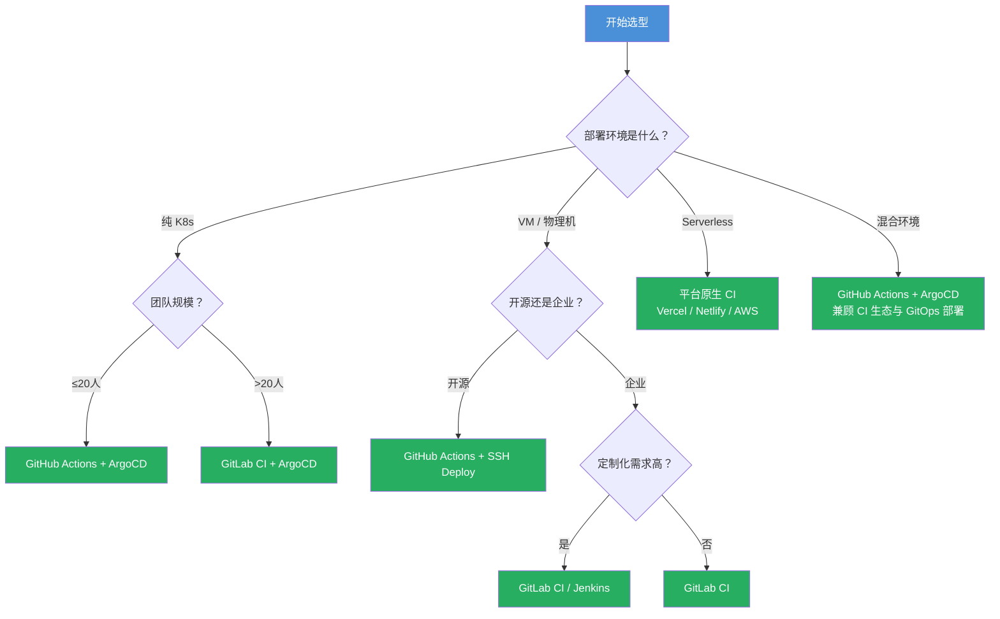
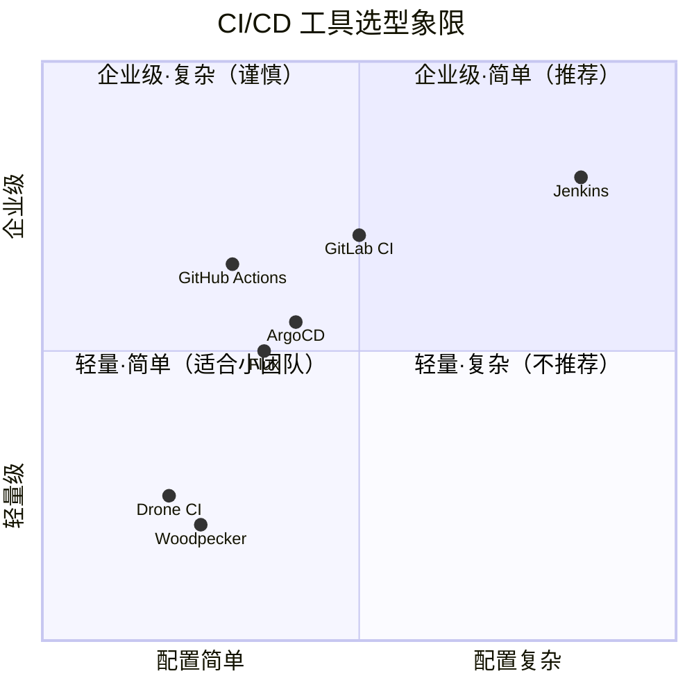
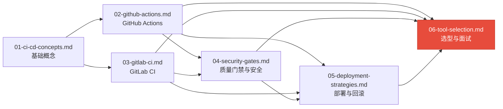

# 06 — 工具选型与面试总结

> 系统掌握 CI/CD 工具选型方法论，汇集全模块面试知识，能根据场景做出技术决策并回答面试追问。

---

## 🎯 学习目标

- 掌握从团队规模、项目类型、部署环境三个维度的工具选型决策框架
- 深度理解 GitHub Actions 与 GitLab CI 的异同，能给出选型建议
- 了解 Jenkins / ArgoCD / Drone CI 的适用场景
- 汇总前 5 篇文档的面试题目，能回答 9 道核心面试题并给出加分回答
- 能站在技术负责人视角回答 CI/CD 架构与工具选型问题

---

## 1. 工具选型决策框架

CI/CD 工具选型没有"银弹"。选型需要综合考虑团队规模、项目类型、部署环境三个维度，没有哪个工具在所有场景下都是最优解。

### 1.1 团队规模维度

| 团队规模 | 推荐工具 | 核心理由 |
|----------|---------|---------|
| **1-5 人**（小团队 / 个人） | GitHub Actions / Drone CI | 配置简单、零运维、快速上手，无需自建 Runner 即可开始 |
| **5-20 人**（中型团队） | GitLab CI | 一体化 DevOps 平台，代码托管 + CI/CD + 制品管理一站式，自托管 Runner 经济 |
| **20+ 人**（大型团队） | GitLab CI + ArgoCD | 需要多环境隔离、合规审计、细粒度权限管控，GitOps 模式更适合规模化 |

> 小团队的核心矛盾是"快速验证"，大团队的核心矛盾是"可控与合规"。选型时先判断当前处于哪个阶段。

### 1.2 项目类型维度

| 项目类型 | 推荐工具 | 核心理由 |
|----------|---------|---------|
| **开源项目** | GitHub Actions | 免费额度充足（公开仓库完全免费）、Actions Marketplace 生态丰富、社区模板多 |
| **企业私有项目** | GitLab CI / Jenkins | 私有部署、数据不离开内网、LDAP/OAuth 集成完善 |
| **K8s 原生项目** | ArgoCD / Flux（GitOps） | 声明式部署、自动漂移检测、回滚即 Git revert，与 K8s 完美契合 |

### 1.3 部署环境维度

| 部署环境 | 推荐工具组合 | 说明 |
|----------|-------------|------|
| **纯 K8s 集群** | GitHub Actions（CI）+ ArgoCD（CD） | CI 负责构建和推送镜像，CD 由 ArgoCD 从 Git 同步，职责分离 |
| **VM / 物理机** | GitLab CI / Jenkins | 直接 SSH 部署或通过 Ansible 编排，Jenkins Pipeline 对传统环境支持更好 |
| **Serverless** | 平台原生 CI（Vercel / Netlify / AWS CodePipeline） | 平台级集成最佳，无需额外工具链 |

### 1.4 选型决策树



---

## 2. GitHub Actions vs GitLab CI 深度对比

两个工具是当前最主流的选择，了解其差异有助于做出更精准的选型判断。

### 2.1 配置语法对比

| 对比项 | GitHub Actions | GitLab CI |
|--------|---------------|-----------|
| **配置文件** | `.github/workflows/*.yml` | `.gitlab-ci.yml`（单文件） |
| **触发方式** | `on: [push, pull_request, schedule]` | `trigger:` / `rules:` |
| **并行机制** | Job 级别 `needs` 控制依赖 | Stage 级别 + `needs` 关键字 |
| **矩阵构建** | `strategy.matrix` 原生支持 | `parallel:matrix` 原生支持 |
| **缓存策略** | `actions/cache`（第三方 Action） | `cache:` 关键字（内置） |
| **Artifact** | `actions/upload-artifact` | `artifacts:` 关键字（内置） |
| **条件执行** | `if:` 表达式 | `rules:` / `only:` / `except:` |
| **环境变量** | `env:` + `vars` 上下文 | `variables:` 关键字 |
| **Secrets 管理** | Settings → Secrets → Actions | Settings → CI/CD → Variables |
| **自定义镜像** | `container:` 关键字 | `image:` 关键字 |
| **手动审批** | `environment:` + reviewers | `when: manual` + 角色权限 |

```yaml
# GitHub Actions 语法示例
name: CI
on: [push]
jobs:
  test:
    runs-on: ubuntu-latest
    steps:
      - uses: actions/checkout@v4
      - run: npm test
```

```yaml
# GitLab CI 语法示例
stages: [test]
test:
  image: node:20-alpine
  script:
    - npm test
```

> 两者 YAML 结构高度相似，核心概念（Job/Stage/Artifact/Cache）一一对应。精通一门后，切换到另一门的成本很低。

### 2.2 生态与市场对比

| 维度 | GitHub Actions | GitLab CI |
|------|---------------|-----------|
| **市场占有率** | ~40%（2025，持续增长） | ~25%（稳定） |
| **生态丰富度** | 20,000+ Actions，社区极活跃 | 内置功能丰富，但第三方集成较少 |
| **公开仓库** | 免费（2000 分钟/月） | 免费（400 分钟/月，自托管 Runner 不限） |
| **私有仓库** | 免费（2000 分钟/月） | 免费（50 分钟/月，自托管 Runner 不限） |
| **最大优势** | Actions Marketplace、社区生态 | 自托管 Runner 成本低、一体化平台 |

> 市场占有率与免费额度数据为 **2025 年左右的参考值**，具体额度以 [GitHub Actions 官方计费](https://docs.github.com/en/billing/managing-billing-for-github-actions) 和 [GitLab CI 官方文档](https://docs.gitlab.com/ee/ci/) 最新说明为准。

### 2.3 私有部署成本对比

| 成本项 | GitHub Actions | GitLab CI |
|--------|---------------|-----------|
| **托管费用** | 按分钟计费，大团队账单可能较高 | CE 版免费自托管，EE 版按用户收费 |
| **Runner 运维** | GitHub 托管免运维；自托管需自行维护 | Runner 自托管是常态，需投入运维 |
| **存储成本** | Artifact 有存储限制，超出收费 | 自托管无额外存储成本 |
| **许可证成本** | Enterprise 按席位收费 | CE 免费，EE 按用户收费 |

### 2.4 选型建议

- **优先选择 GitHub Actions**：你的项目在 GitHub 上、团队 ≤20 人、偏好云原生体验
- **优先选择 GitLab CI**：需要私有部署、预算有限、已在用 GitLab 管理代码、团队规模大
- **混合使用**：CI 用 GitHub Actions（生态好），CD 用 GitLab CI（自托管 Runner 省钱）
- **学习顺序**：先精通 GitHub Actions，再学 GitLab CI——两者概念互通，覆盖面最广

---

## 3. Jenkins / ArgoCD / Drone CI 简要对比

除了 GitHub Actions 和 GitLab CI，以下工具在特定场景下也有不可替代的价值。

### 3.1 Jenkins

| 维度 | 说明 |
|------|------|
| **适用场景** | 传统企业、需要高度定制化 Pipeline、遗留系统集成 |
| **优势** | 插件生态最庞大（1800+），几乎能对接一切工具；Pipeline as Code（Groovy DSL）表达力极强 |
| **劣势** | 维护成本高（Master 节点、插件兼容性、安全更新）；UI 老旧；配置复杂 |
| **一句话总结** | 功能极强但运维代价大，除非有强定制需求，否则优先考虑云原生方案 |

### 3.2 ArgoCD / Flux（GitOps）

| 维度 | 说明 |
|------|------|
| **适用场景** | Kubernetes 环境的部署管理 |
| **优势** | 声明式部署、自动同步 Git 状态、漂移检测、回滚即 `git revert` |
| **劣势** | 仅适用于 K8s，不覆盖 CI 阶段，需配合 GitHub Actions / GitLab CI 使用 |
| **一句话总结** | K8s 部署的标配选择，CI 工具负责构建镜像，ArgoCD 负责同步部署 |

### 3.3 Drone CI / Woodpecker

| 维度 | 说明 |
|------|------|
| **适用场景** | 小型团队、容器化项目、需要极简 CI |
| **优势** | 配置极简（单文件 + 容器化 Step）、资源占用低、Docker 原生 |
| **劣势** | 生态小、插件有限、企业级特性不足 |
| **一句话总结** | 适合个人或极小型团队，大团队不建议 |

### 工具选型全景图



---

## 4. CI/CD 面试题汇总

以下题目汇集了前 5 篇文档中的核心面试问题。每道题附有**加分点**——面试官真正想听到的深度回答。

### 4.1 CI 和 CD 有什么区别？Delivery 和 Deployment 又有什么区别？

**加分点：**
1. 用具体场景说明：线上紧急修复走 Deployment（全自动），重大版本发版走 Delivery（人工审批）
2. 提及"发布工程师"角色演变——Delivery 保留人工判断，Deployment 将最终决策交给自动化
3. 从 DevOps 成熟度模型角度解释：Delivery → Deployment 是成熟度从 L3 到 L4 的跃迁

### 4.2 如何设计一个高质量的前端 / 后端 Pipeline？

**加分点：**
1. 强调"尽早失败"原则：最可能失败的 Job 最先跑（Lint → Test → Build），节约团队等待时间
2. 提及 Pipeline 性能优化：缓存策略（按锁文件 hash + OS 的 cache key）、Job 并行化、Docker 层缓存
3. 说出"Pipeline 也是代码"的理念：Pipeline 配置应做 Code Review、版本化管理、可测试

### 4.3 GitHub Actions 和 GitLab CI 各适合什么场景？

**加分点：**
1. 不给出绝对答案，而是从三个维度（团队规模、项目类型、部署环境）分析
2. 提及混合方案：用 GitHub Actions 做 CI（生态好），用自托管 GitLab Runner 做 CD（省钱可控）
3. 指出成本陷阱：GitHub Actions 在公开仓库免费，但私有仓库大量构建时账单可能远超预期

### 4.4 Pipeline 中如何保证密钥安全？

**加分点：**
1. 分层防御：平台 Secrets（第一层） + 环境级隔离（第二层） + 运行时 Mask（第三层）
2. 提及 Dynamic Secrets 方案（如 HashiCorp Vault + 临时 Token），相比静态 Secrets 更安全
3. Self-hosted Runner 的安全风险：Job 隔离、Ephemeral 模式、容器逃逸防护——真正的加分点在于你能说出"静态 Secrets 本身不是问题，问题是 Secrets 的分发、轮转和审计"

### 4.5 什么是 Quality Gate？你通常会设置哪些门禁？

**加分点：**
1. 强调门禁的"渐进式"实施：先 Warning 再 Error，避免团队因门禁太严而绕过 CI
2. 区分"阻断性门禁"和"预警性门禁"：单元测试失败阻断（强硬），覆盖率下降预警（柔性）
3. 提及"门禁的可修复性"：如果某个门禁经常被开发者绕过，说明它的阈值设置不合理，应该调整而非硬抗

### 4.6 蓝绿部署、金丝雀部署、滚动更新有什么区别？

**加分点：**
1. 用"风险 vs 成本"框架分析：金丝雀风险最低但复杂度最高，蓝绿回滚最快但资源翻倍，滚动更新最经济但回滚慢
2. 提及灰度策略的细节：金丝雀比例不是固定的，应配合监控指标（错误率、延迟、业务指标）做自动扩缩
3. 说出真实教训："我们刚开始用滚动更新时没加 Readiness Probe，新版本一启动就接流量，直接导致线上 P0"

### 4.7 CI 中镜像扫描不通过怎么办？

**加分点：**
1. 先确认是真漏洞还是误报：Trivy/Snyk 允许设置 `.trivyignore` 忽略规则，但必须记录忽略理由和责任人
2. 提及"基础镜像瘦身"策略：从 Ubuntu 切换到 Alpine 再到 Distroless，漏洞数量逐级递减
3. 说出团队落地经验：一开始只设 Warning 不阻断 → 一个月后基线修复完成 → 正式开启阻断策略

### 4.8 如何实现一键回滚？

**加分点：**
1. 强调"可回滚的前提"：不可变镜像 tag（拒绝 `latest`）、数据库 Schema 向前兼容、回滚脚本要经过测试
2. 从架构层面讲：蓝绿部署一键回滚（切换流量），GitOps 回滚（`git revert` + 自动同步），K8s Rolling Update 回滚（`kubectl rollout undo`）
3. 说出"回滚本身也有风险"：回滚可能引入数据不一致，建议结合 Feature Flag、灰度验证后再执行全量回滚

### 4.9 GitOps 是什么？它和传统 CD 有什么不同？

**加分点：**
1. 不只是"Git 驱动部署"，而是"Git 作为 Single Source of Truth + 自动漂移检测"
2. 对比 Drift Detection：传统 CD 只管部署那一刻，GitOps 持续检测集群状态是否偏离 Git 定义
3. 说出 GitOps 的隐形成本：需要 Git 仓库管理 K8s Manifest（Kustomize / Helm），对团队 Git 规范要求高，误操作可能波及整个集群

---

## 5. 本模块知识图谱

```mermaid
mindmap
  root((CI/CD 知识体系))
    Day1_基础
      CI/CD 概念
      Pipeline 设计原则
      Stage / Job / Artifact / Cache
      [01-ci-cd-concepts.md]
    Day2_GitHub_Actions
      Workflow 语法
      触发器与矩阵构建
      Actions Marketplace
      Docker 构建与推送
      [02-github-actions.md]
    Day3_GitLab_CI
      配置文件结构
      Runner 管理与注册
      MR 触发流水线
      [03-gitlab-ci.md]
    Day4_质量与安全
      ESLint / Jest 门禁
      Trivy 镜像扫描
      SonarCloud 代码质量
      Gitleaks 密钥扫描
      Secrets 管理最佳实践
      [04-security-gates.md]
    Day5_部署与回滚
      滚动更新
      蓝绿部署
      金丝雀发布
      一键回滚策略
      GitOps 模式
      [05-deployment-strategies.md]
    Day7_选型与面试
      工具选型决策框架
      面试题汇总与回答模板
      知识图谱
      [06-tool-selection.md] <-- 本篇
    关联模块
      Docker 镜像构建与优化
      Nginx 反向代理部署
      K8s 基础概念
```

### 文档依赖关系图



> 说明：前 5 篇文档是"横向"的知识点展开，本篇是"纵向"的总结升华。每篇文档的知识都会在面试题和选型决策中被调用。

---

## 6. 面试回答模板

以下回答模板展示了"技术负责人视角"的回答方式。建议在面试前用自己的项目经历填充具体细节。

> **问：GitHub Actions 和 GitLab CI 各适合什么场景？**
>
> **答：** 这个问题不能一概而论，我通常从三个维度来分析。
>
> 第一是团队规模。5 人以下的小团队用 GitHub Actions 就够了——它零运维、配置简单、Actions 生态好，一个 eslint 检查不需要自己写脚本，从 Marketplace 找一个即可。到了 20 人以上的规模，GitLab CI 的自托管 Runner 能大幅降低成本，且一体化平台减少了工具链的组合复杂度。
>
> 第二是项目类型。开源项目首选 GitHub Actions，因为公开仓库免费且社区模板多。企业私有项目我倾向 GitLab CI，数据不出内网、LDAP 集成方便。
>
> 第三是部署环境。如果是 K8s 环境，我建议 CI 用 GitHub Actions（做构建和推送镜像），CD 用 ArgoCD（通过 GitOps 同步部署），职责清晰且各取所长。
>
> **加分项：** 我注意到很多团队只给出了"哪个更好"的判断，没有给出组合方案。实际上 GitHub Actions + ArgoCD 的组合近年来越来越常见，CI 侧享受 GitHub 的生态优势，CD 侧享受 GitOps 的声明式管理优势。

> **问：你们团队为什么选择 X 工具？**
>
> **答：** 我们团队最终选择了 GitHub Actions + ArgoCD 的组合，决策过程是这样的。
>
> 当时我们面临的核心约束是：团队 8 人、代码托管在 GitHub、部署目标是 K8s 集群。我们对比了三个方案：
>
> 1. **纯 GitHub Actions**：CI/CD 一体化，但 CD 部分要通过 SSH 或 kubectl 触发，Pipeline 里夹杂部署脚本，难以审计和回滚
> 2. **纯 GitLab CI**：需要迁移代码仓库，迁移成本高，团队学习成本大
> 3. **GitHub Actions + ArgoCD**：CI 在 Actions 中完成（lint → test → build → push），只负责产出镜像；CD 完全交给 ArgoCD，由它从 Git 仓库同步部署状态。这样 CI 和 CD 职责清晰，互不耦合。
>
> 我们选了方案 3，运行半年多的感受是：ArgoCD 的自动漂移检测很实用，有几次线上配置被人手动改过，ArgoCD 自动修正了回来。部署回滚也很简单——`git revert` 一个 commit，ArgoCD 自动同步回去。
>
> **加分项：** 回答这类问题时一定要说清楚"为什么不是另一个选项"，展示你做过对比分析，而不是拍脑袋决定。此外，如果能说出选型后的实际效果（正面和负面都要提），会更有说服力。

> **问：设计 CI/CD Pipeline 时你有哪些最佳实践？**
>
> **答：** 我总结了四个原则。
>
> **第一，尽早失败。** Pipeline 应该把最容易失败的阶段放在最前面。典型的顺序是 Lint → Unit Test → Build → Integration Test → Security Scan。Lint 几秒钟就能失败，而不是等 10 分钟构建完才发现代码格式有问题。
>
> **第二，Pipeline as Code。** Pipeline 配置要像应用代码一样做 Code Review、版本化管理。我们曾经因为直接往主分支 push Pipeline 配置导致所有构建瘫痪——从那以后 Pipeline 配置改必走 PR。
>
> **第三，缓存策略要精确。** Cache key 应该包含锁文件 hash（如 `package-lock.json`）和操作系统，不跨分支共享缓存。用 `npm ci` 替代 `npm install` 保证可复现构建。
>
> **第四，渐进式门禁。** 质量门禁不要一开始就设得太严。我们刚开始在 Pipeline 中接入 Trivy 镜像扫描时，如果把 HIGH 漏洞全部设成阻断，那一个 PR 都合不进来。我们是先设警告一个月，团队修复了存量漏洞后再改成阻断，这样既保证了安全又保护了团队交付效率。
>
> **加分项：** 面试官不仅想听你知道什么，更想听你踩过什么坑。能说出"我们踩过 cache key 设计不当导致构建结果不一致的坑"或"门禁设太严导致团队绕过 CI"这种真实教训，远比背诵最佳实践列表更能体现你的经验深度。

---

## 7. 学习建议与下一步

### 7.1 面试准备建议

1. **用 STAR 法则组织回答**：尤其是"你们为什么选择 X 工具"这类问题，用 Situation（背景）→ Task（任务）→ Action（行动）→ Result（结果）的结构组织，比直接说结论更有说服力
2. **准备 1-2 个真实踩坑案例**：技术负责人面试中，"你遇到的最大故障是什么，怎么解决的"几乎是必问题，提前准备一个 Pipeline 相关的故障案例
3. **不要强行推荐某个工具**：面试官想听的是"你有能力根据场景做决策"，而不是"你只会用某个工具"。表现出对不同工具的客观认知，比表现出对某个工具的狂热更加分

### 7.2 延伸学习方向

完成本模块后，你可以继续探索：

- **Kubernetes 深度实践**：学习 Helm Charts 编写、K8s 资源管理，配合 ArgoCD 实现完整 GitOps 工作流
- **可观测性**：在 Pipeline 中集成 OpenTelemetry 追踪、Prometheus 指标与 Grafana 面板
- **FinOps**：优化 CI 执行成本，分析构建时长与资源消耗，实现成本拆分与预算管控
- **平台工程**：用 Backstage / Port 构建内部开发者平台（IDP），让开发者通过自助服务门户触发 Pipeline

---

*本文档对应学习路径：Day 7（进阶）——工具选型与面试总结*
*前置文档：[01-ci-cd-concepts.md](01-ci-cd-concepts.md)、[02-github-actions.md](02-github-actions.md)、[03-gitlab-ci.md](03-gitlab-ci.md)、[04-security-gates.md](04-security-gates.md)、[05-deployment-strategies.md](05-deployment-strategies.md)*
