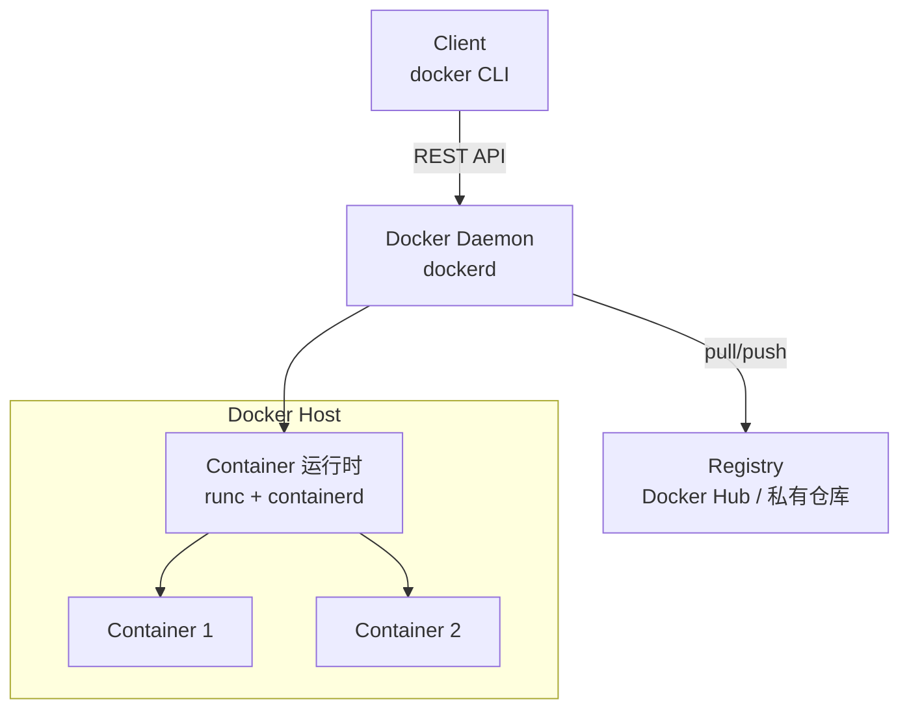
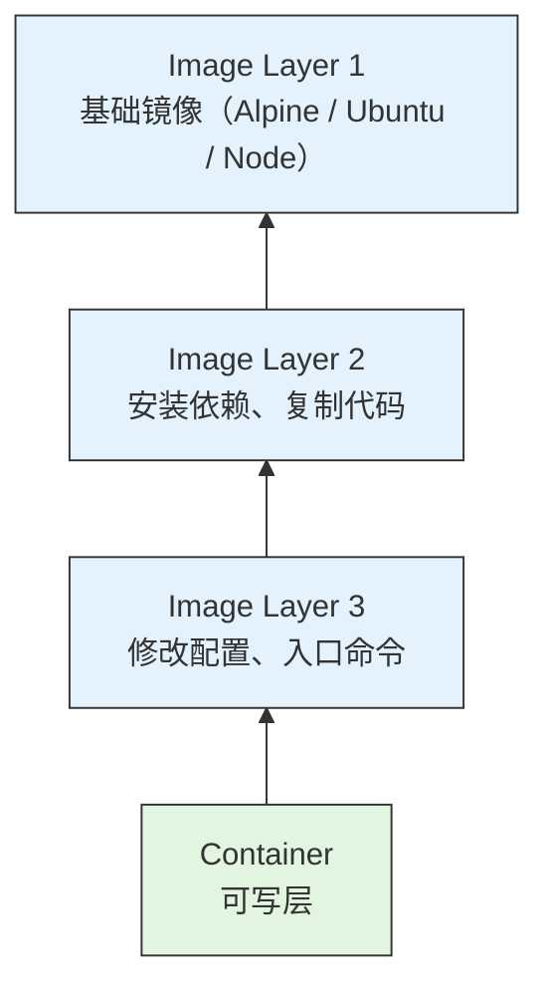
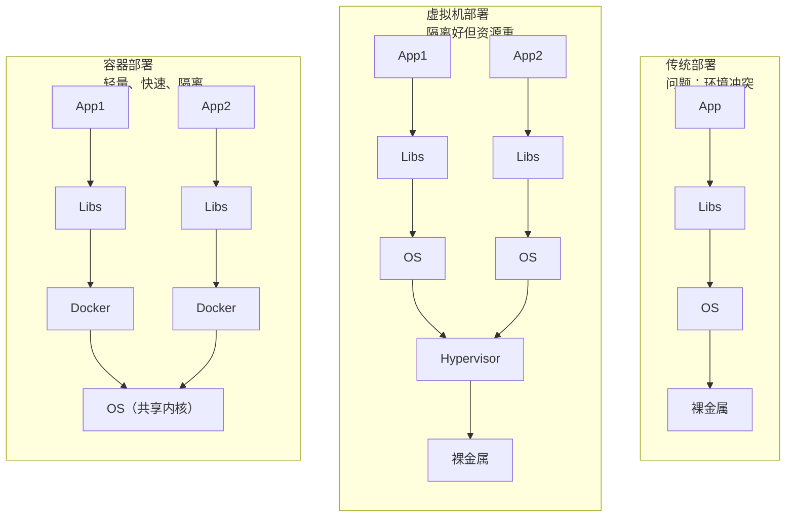

# 01 — Docker 概述 + 核心概念 + 基础命令

> 理解 Docker 架构，掌握核心概念，能独立运行和管理容器。

---

## 🎯 学习目标

- 理解 Docker 是什么以及它解决了什么问题（环境一致性）
- 掌握 Docker 的核心概念：镜像、容器、仓库、Dockerfile
- 理解 Docker C/S 架构与镜像分层机制
- 掌握镜像管理命令（pull、images、rmi、tag）
- 掌握容器生命周期命令（run、stop、exec、logs、rm）
- 能独立运行和管理一个 Nginx 容器

---

## 1. Docker 是什么

Docker 是一个开源的容器化平台，用于开发、运输和运行应用程序。

**为什么需要 Docker**：
传统的应用部署流程中，最常见的问题就是"我机器上能跑，你机器上跑不了"——开发环境、测试环境、生产环境之间总有细微差异（操作系统版本、依赖库、环境变量等），导致部署后出现各种问题。Docker 将应用及其所有依赖打包到一个标准化的容器中，确保在任何环境中行为一致。

**核心特性**：

| 特性 | 说明 |
|------|------|
| 轻量 | 共享宿主机内核，无需完整操作系统，MB 级开销 |
| 快速 | 容器启动毫秒级，秒级可完成启动 |
| 可移植 | 一次构建，随处运行（任何安装 Docker 的机器） |
| 隔离性 | 进程级隔离（Namespace + Cgroups），互不干扰 |
| 标准化 | 统一的镜像格式、运行时接口、编排规范 |
| 可复现 | Dockerfile 定义构建过程，保证每次构建结果一致 |

**Docker vs 虚拟机对比**（面试常问）：

| 维度 | Docker 容器 | 虚拟机 |
|------|-------------|--------|
| 内核 | 共享宿主机内核 | 每个 VM 独立内核（Hypervisor 层） |
| 启动速度 | 毫秒级 | 秒级至分钟级 |
| 资源占用 | 轻量（MB 级） | 重量（GB 级） |
| 隔离级别 | 进程级（Namespace + Cgroups） | 硬件级虚拟化 |
| 镜像大小 | MB 级（Alpine 仅 5MB） | GB 级（完整 OS） |
| 性能损耗 | 几乎无（直接调用宿主机内核） | 有一定损耗（虚拟化层开销） |
| 适用场景 | 微服务、CI/CD、应用打包 | 多 OS 需求、强隔离需求 |

---

## 2. Docker 架构（C/S 模型）

Docker 采用客户端-服务器架构：



**三个核心角色**：

| 角色 | 说明 |
|------|------|
| **Client（客户端）** | `docker` 命令行工具，用户通过它输入命令，通过 REST API 与 Daemon 通信 |
| **Daemon（守护进程）** | `dockerd`，后台运行的核心服务，负责管理镜像、容器、网络、卷等 |
| **Registry（仓库）** | 存储 Docker 镜像的仓库，默认是 Docker Hub，也可搭建私有仓库 |

**镜像分层结构**：



### macOS（本机开发环境）

```bash
# 使用 Homebrew 安装 Docker Desktop（推荐，包含 Engine、Compose、Dashboard）
brew install --cask docker

# 或从 Docker Desktop 官网下载
# https://www.docker.com/products/docker-desktop/
```

### Linux

```bash
# 一键安装脚本（适用于 Ubuntu / CentOS / Debian 等）
curl -fsSL https://get.docker.com | sh

# 安装后将当前用户加入 docker 组（避免每次用 sudo）
sudo usermod -aG docker $USER
# 重新登录终端生效
```

### 验证安装

```bash
# 查看版本
docker --version

# 查看更详细的版本信息
docker version

# 查看系统信息
docker info

# 运行测试容器（验证能否正常拉取和运行镜像）
docker run hello-world
```

运行 `docker run hello-world` 后，如果看到以下输出，说明安装成功：

```
Hello from Docker!
This message shows that your installation appears to be working correctly.
...
```

---

## 4. 镜像管理命令

镜像（Image）是容器的只读模板，包含运行应用所需的一切。

| 命令 | 作用 | 常用参数 |
|------|------|----------|
| `docker pull` | 从仓库拉取镜像 | `<name>:<tag>` 指定版本 |
| `docker images` | 列出本地镜像 | `-a` 列出中间层镜像 |
| `docker rmi` | 删除镜像 | `-f` 强制删除 |
| `docker tag` | 给镜像打标签 | `<原镜像>:<原标签> <新名称>:<新标签>` |
| `docker search` | 搜索镜像 | `<关键词>` |
| `docker login` | 登录仓库 | `-u <用户名>` |
| `docker logout` | 退出登录 | - |

### 示例

```bash
# 搜索镜像
docker search nginx

# 拉取镜像（指定版本）
docker pull nginx:alpine

# 拉取镜像（默认 latest 标签）
docker pull nginx

# 列出本地镜像
docker images

# 给镜像打标签
docker tag nginx:alpine my-nginx:v1

# 删除镜像
docker rmi nginx:alpine

# 强制删除（有容器引用时）
docker rmi -f my-nginx:v1

# 登录 Docker Hub
docker login

# 登录私有仓库
docker login registry.example.com
```

**镜像命名规则**：
```
[仓库地址/]名称[:标签]

示例：
nginx:alpine           → Docker Hub 上的 nginx 仓库，alpine 标签
myapp:v1.0.0           → 本地镜像 myapp，版本 v1.0.0
registry.example.com/myapp:latest  → 私有仓库的镜像
```

---

## 5. 容器生命周期命令

容器（Container）是镜像的运行实例，可以被启动、停止、删除。

### 创建与运行

```bash
# 基本运行（前台运行，Ctrl+C 退出）
docker run nginx:alpine

# 后台运行（detached 模式）
docker run -d nginx:alpine

# 交互式运行（进入容器，适合调试）
docker run -it ubuntu:22.04 /bin/bash

# 指定容器名称
docker run -d --name my-nginx nginx:alpine

# 端口映射（宿主机:容器）
docker run -d --name my-nginx -p 8080:80 nginx:alpine

# 挂载卷（数据持久化）
docker run -d --name my-nginx -v /host/data:/usr/share/nginx/html nginx:alpine

# 自动清理（容器退出后自动删除）
docker run --rm -it ubuntu:22.04 /bin/bash
```

**`docker run` 常用参数速查**：

| 参数 | 作用 | 示例 |
|------|------|------|
| `-d` | 后台运行 | `docker run -d nginx` |
| `-it` | 交互式终端 | `docker run -it ubuntu bash` |
| `--name` | 指定容器名 | `--name my-nginx` |
| `-p` | 端口映射 | `-p 8080:80` |
| `-v` | 卷挂载 | `-v /data:/app/data` |
| `--rm` | 退出自动删除 | `--rm` |
| `-e` | 环境变量 | `-e NODE_ENV=production` |
| `--network` | 指定网络 | `--network host` |
| `--restart` | 重启策略 | `--restart unless-stopped` |

### 查看容器

```bash
# 查看运行中的容器
docker ps

# 查看所有容器（包含已停止的）
docker ps -a

# 只显示容器 ID
docker ps -q

# 显示最近创建的容器
docker ps -l

# 过滤
docker ps --filter "status=exited"
```

### 停止与启动

```bash
# 停止容器（发送 SIGTERM，等待优雅退出）
docker stop my-nginx

# 强制停止（发送 SIGKILL）
docker kill my-nginx

# 启动已停止的容器
docker start my-nginx

# 重启容器
docker restart my-nginx

# 暂停容器进程
docker pause my-nginx

# 恢复暂停的容器
docker unpause my-nginx
```

### 进入容器

```bash
# 在运行中的容器内执行命令
docker exec -it my-nginx /bin/sh

# 在容器内执行单条命令
docker exec my-nginx ls /etc/nginx

# 以 root 用户进入容器
docker exec -u root -it my-nginx /bin/sh
```

### 日志与监控

```bash
# 查看日志
docker logs my-nginx

# 实时跟踪日志（类似 tail -f）
docker logs -f my-nginx

# 显示最后 N 行日志
docker logs --tail 50 my-nginx

# 查看容器内进程
docker top my-nginx

# 查看容器资源使用（CPU、内存、网络）
docker stats

# 查看单个容器的资源使用
docker stats my-nginx
```

### 删除容器

```bash
# 删除已停止的容器
docker rm my-nginx

# 强制删除运行中的容器
docker rm -f my-nginx

# 删除所有已停止的容器
docker container prune

# 删除所有容器（包含运行中）
docker rm -f $(docker ps -aq)
```

### 清理命令

```bash
# 清理所有未使用的资源（容器、网络、镜像、构建缓存）
docker system prune

# 清理所有未使用的资源（包含未使用的镜像）
docker system prune -a

# 清理已停止的容器
docker container prune

# 清理 dangling 镜像（无标签的镜像）
docker image prune

# 清理未使用的卷
docker volume prune

# 查看磁盘使用情况
docker system df
```

---

## 6. Docker vs 虚拟机深入对比

### 为什么需要容器：部署演进



Docker 使用 Linux Namespace 实现进程级隔离。每个容器拥有独立的：

```bash
# Linux 支持的 8 种 Namespace
# 查看当前进程的 Namespace
lsns

# 查看容器的 Namespace（在宿主机上）
ls -la /proc/<PID>/ns/
```

| Namespace | 隔离内容 | 作用 |
|-----------|----------|------|
| **PID** | 进程编号 | 容器内只能看到自己的进程 |
| **Network** | 网络栈 | 容器有独立的 IP、端口、路由表 |
| **Mount** | 文件系统挂载 | 容器有独立的根文件系统 |
| **UTS** | 主机名和域名 | 容器可设置自己的 hostname |
| **IPC** | 进程间通信 | 隔离信号量、消息队列 |
| **User** | 用户和组 ID | 容器内 root ≠ 宿主机 root |
| **Cgroup** | 控制组 | 资源限制（见下文） |
| **Time** | 系统时间 | 容器可设置独立的时间偏移 |

### Cgroups 资源限制

Cgroups（Control Groups）控制容器能使用多少资源：

```bash
# 在宿主机上查看容器的 Cgroups 路径
# Cgroups v1: /sys/fs/cgroup/memory/docker/<容器ID>/memory.limit_in_bytes
# Cgroups v2: /sys/fs/cgroup/system.slice/docker-<容器ID>.scope/memory.max
# 现代 Linux 发行版（Ubuntu 22.04+）多为 v2，路径已统一

# 查看内存限制（v1 示例）
cat /sys/fs/cgroup/memory/docker/<容器ID>/memory.limit_in_bytes
  --cpuset-cpus=0 \       # 绑定到 CPU 0
  nginx:alpine

# 查看容器的 Cgroups 配置
docker inspect limited-nginx | grep -A 10 "HostConfig"
```

```bash
# 在宿主机上查看容器的 Cgroups 路径
# /sys/fs/cgroup/system.slice/docker-<容器ID>.scope/

# 查看内存限制
cat /sys/fs/cgroup/memory/docker/<容器ID>/memory.limit_in_bytes
```

**Cgroups 的两种版本**：

| 版本 | 特点 | 使用场景 |
|------|------|----------|
| **Cgroups v1** | 每个子系统独立层级 | 大多数旧系统（CentOS 7、Ubuntu 18.04） |
| **Cgroups v2** | 统一层级，更简洁 | 新系统（Ubuntu 22.04+、Fedora） |

---

## 🎯 实战：第一个容器

用 Nginx 演示容器的完整生命周期。

### 1. 拉取镜像

```bash
docker pull nginx:alpine
```

### 2. 运行 Nginx 容器

```bash
docker run -d --name my-nginx -p 8080:80 nginx:alpine
```

参数说明：
- `-d`：后台运行
- `--name my-nginx`：容器命名为 my-nginx
- `-p 8080:80`：宿主机 8080 端口映射到容器 80 端口

### 3. 验证运行状态

```bash
# 查看容器状态
docker ps

# 访问 Nginx
curl http://localhost:8080

# 预期输出：Nginx 默认 HTML 页面
```

### 4. 查看日志

```bash
docker logs my-nginx

# 实时跟踪
docker logs -f my-nginx
```

### 5. 进入容器

```bash
docker exec -it my-nginx /bin/sh

# 进入后可以查看 Nginx 配置
# ls /etc/nginx/
# exit（退出容器）
```

### 6. 查看容器详情

```bash
# 查看容器的完整配置和状态
docker inspect my-nginx

# 查看资源使用
docker stats my-nginx
```

### 7. 停止并删除

```bash
# 优雅停止
docker stop my-nginx

# 确认已停止
docker ps -a | grep my-nginx

# 删除容器
docker rm my-nginx

# 验证已删除
docker ps -a | grep my-nginx

# 清理所有已停止的容器
docker container prune
```

### 完整脚本速查

```bash
# 一行完成：运行 → 测试 → 停止 → 删除
docker run -d --name test-nginx -p 8080:80 nginx:alpine && \
  sleep 1 && \
  curl -s -o /dev/null -w "%{http_code}" http://localhost:8080 && \
  echo "" && \
  docker stop test-nginx && \
  docker rm test-nginx
```

---

## ✅ 自检清单

- [ ] 能解释 Docker 是什么以及解决了什么问题
- [ ] 能画出 Docker C/S 架构图
- [ ] 能解释镜像分层机制（只读层和可写层）
- [ ] 能说出 Docker 与虚拟机的 5 个核心区别
- [ ] 掌握从仓库拉取镜像和管理镜像的命令
- [ ] 会用 `docker run` 的常用参数（-d、-it、--name、-p、-v、--rm）
- [ ] 能进入运行中的容器执行命令
- [ ] 能查看容器日志和资源使用情况
- [ ] 理解 Namespace 和 Cgroups 的作用
- [ ] 能独立完成容器的创建、访问、停止、删除

---

## 🔗 相关文档

- 下一篇：[02 - Dockerfile + 镜像构建 + 最佳实践](./02-dockerfile-image-build.md)
- 大纲：[Docker 学习大纲](../docker-learning-outline.md)
- [Docker 官方文档](https://docs.docker.com/)
- [Docker Hub](https://hub.docker.com/)

---

*最后更新：2026年7月*
