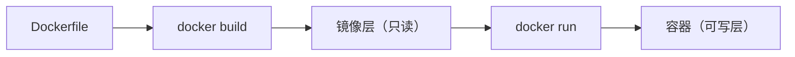
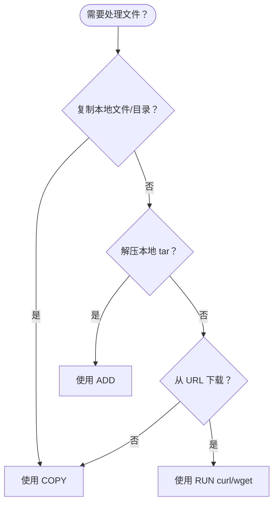
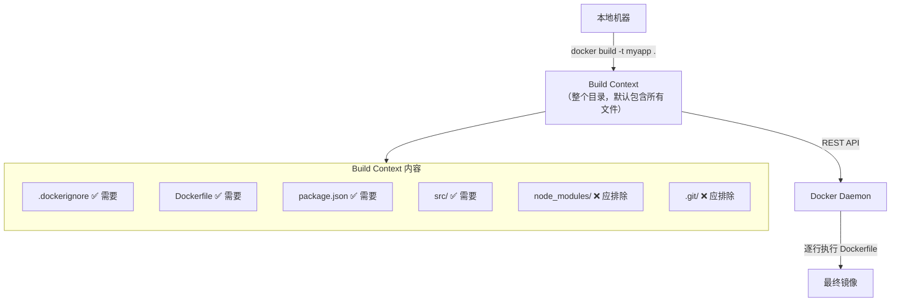
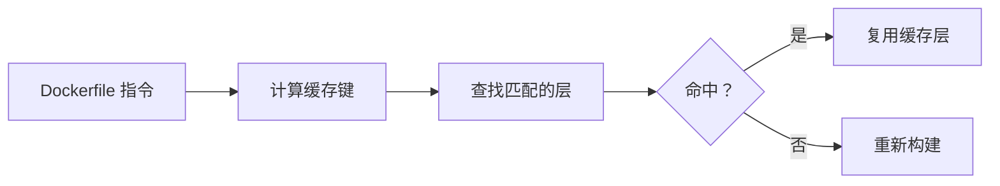
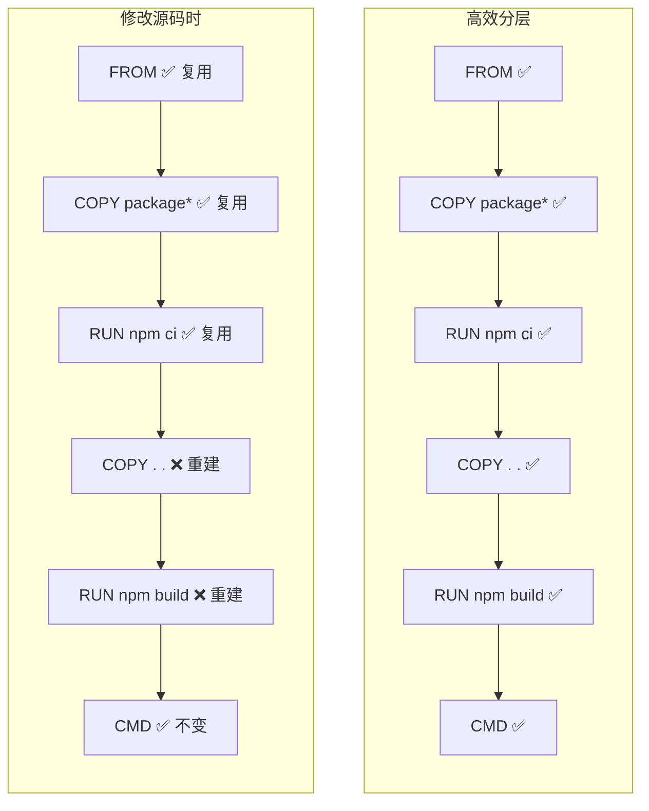

# 02 — Dockerfile 与镜像构建

> 掌握 Dockerfile 编写规范，能独立构建和优化生产级镜像。

---

## 🎯 学习目标

- 理解 Dockerfile 的作用与镜像构建流程
- 掌握所有常用 Dockerfile 指令及其适用场景
- 能区分 CMD 与 ENTRYPOINT、COPY 与 ADD 的核心差异
- 掌握镜像构建缓存机制与分层优化技巧
- 能使用多阶段构建将镜像体积减少 50% 以上
- 能独立编写生产级 Dockerfile 并应用最佳实践

---

## 1. 什么是 Dockerfile

**Dockerfile** 是一个文本文件，包含一系列指令，告诉 Docker 如何一步一步构建出一个镜像。

### 构建流程



执行 `docker build` 时，Docker 守护进程逐行读取 Dockerfile 中的指令，每执行一条指令就创建一个新的只读镜像层。所有层叠加在一起构成最终镜像。当使用该镜像运行容器时，Docker 在最上层添加一个可写层（Container Layer）。

### 构建过程示意

```mermaid
graph TB
    FROM["FROM node:20-alpine<br/>Layer A: Alpine Linux 基础层"]
    WORKDIR["WORKDIR /app<br/>Layer B: 设置工作目录"]
    COPY_PKG["COPY package*.json ./<br/>Layer C: 复制依赖描述文件"]
    RUN_NPM["RUN npm ci<br/>Layer D: 安装依赖（最重的层）"]
    COPY_SRC["COPY . .<br/>Layer E: 复制源码"]
    CMD["CMD [\"node\", \"server.js\"]<br/>Layer F: 设置启动命令（元数据层）"]
    IMAGE["最终镜像 = A + B + C + D + E + F<br/>只读层叠加"]

    FROM --> WORKDIR --> COPY_PKG --> RUN_NPM --> COPY_SRC --> CMD --> IMAGE

    style RUN_NPM fill:#fff3e0,stroke:#333
    style IMAGE fill:#e1f5e1,stroke:#333
```

### 关键点

| 概念 | 说明 |
|------|------|
| **镜像层** | 每一条 `FROM`、`RUN`、`COPY` 指令都会创建一个新层 |
| **只读性** | 构建出的镜像层都是只读的，不可修改 |
| **可写层** | 容器运行时在最上层叠加可写层，容器删除后可写层随之销毁 |
| **缓存复用** | 未变更的层可复用构建缓存，加速后续构建 |

---

## 2. Dockerfile 指令详解

### 指令速查表

| 指令 | 用途 | 示例 | 注意事项 |
|------|------|------|----------|
| `FROM` | 指定基础镜像 | `FROM node:20-alpine` | 必须是第一条非注释指令；尽量选 Alpine / Slim 版本 |
| `WORKDIR` | 设置工作目录 | `WORKDIR /app` | 目录不存在会自动创建，后续指令基于此路径 |
| `COPY` | 复制文件到镜像 | `COPY package.json ./` | 只做复制，不做任何处理；优先使用 |
| `ADD` | 复制 + 自动解压 | `ADD app.tar.gz /app` | 自动解压 tar 文件；支持 URL（不推荐）；仅在需要解压时使用 |
| `RUN` | 执行构建命令 | `RUN npm ci` | 每个 `RUN` 创建一个新镜像层；尽量合并 |
| `CMD` | 容器启动默认命令 | `CMD ["node", "app.js"]` | 可被 `docker run` 参数覆盖；推荐 exec 格式 |
| `ENTRYPOINT` | 容器入口命令 | `ENTRYPOINT ["nginx"]` | 不可被覆盖（除非 `--entrypoint`）；常与 CMD 组合使用 |
| `ENV` | 设置环境变量 | `ENV NODE_ENV=production` | 构建时和运行时均生效 |
| `ARG` | 构建时变量 | `ARG VERSION=latest` | 仅在 `docker build` 时存在，不会保留到最终镜像 |
| `EXPOSE` | 声明暴露端口 | `EXPOSE 3000` | **仅文档作用**，不真正映射端口 |
| `VOLUME` | 声明挂载点 | `VOLUME /data` | 用于数据持久化；运行时可通过 `-v` 覆盖 |
| `USER` | 指定运行用户 | `USER appuser` | 安全最佳实践，避免使用 root |
| `HEALTHCHECK` | 健康检查 | `HEALTHCHECK CMD curl ...` | 生产环境必备，Docker 会根据检查结果管理容器 |
| `LABEL` | 添加元数据 | `LABEL version="1.0"` | 键值对形式，用于组织和管理镜像 |
| `SHELL` | 指定 shell 格式 | `SHELL ["/bin/sh", "-c"]` | 默认 Linux 为 `/bin/sh -c`，Windows 为 `cmd /S /C` |

### 指令详解

#### FROM

`FROM` 指定构建的基础镜像，必须是 Dockerfile 中的第一条非注释指令。

```dockerfile
# 基础用法
FROM node:20-alpine

# 多阶段构建时命名构建阶段
FROM node:20-alpine AS builder

# 基于 scratch（空镜像，适合纯静态二进制）
FROM scratch

# 基于发行版
FROM ubuntu:22.04
FROM debian:bookworm-slim
```

**最佳实践**：
- 优先选择 Alpine 变体（如 `node:20-alpine`），体积小且安全
- 使用明确版本标签，不要用 `latest`
- 多阶段构建时给阶段命名方便引用

#### WORKDIR

设置工作目录，后续的 `RUN`、`COPY`、`CMD`、`ENTRYPOINT` 等指令都在此目录下执行。

```dockerfile
WORKDIR /app
RUN pwd          # 输出 /app
COPY . .         # 复制到 /app/
```

**注意**：如果目录不存在会自动创建。推荐始终使用 `WORKDIR` 而非 `RUN cd`，后者只在当前 `RUN` 中生效。

#### COPY

将构建上下文中的文件或目录复制到镜像中。

```dockerfile
# 复制单个文件
COPY package.json /app/package.json

# 复制多个文件
COPY package.json yarn.lock ./

# 复制整个目录
COPY . .

# 带 --chown 设置所有者
COPY --chown=appuser:appgroup . .

# 多阶段构建中从其他阶段复制
COPY --from=builder /app/dist ./dist
```

#### ADD

功能与 COPY 类似，但额外支持：
- **自动解压** tar 文件（如 `.tar`, `.tar.gz`, `.tgz`）
- **支持 URL**（但官方建议用 `curl` 或 `wget` 替代）

```dockerfile
# 自动解压 tar 文件到目标目录
ADD app.tar.gz /app/

# 从 URL 下载（不推荐，建议用 RUN curl）
ADD https://example.com/file.tar.gz /tmp/
```

**最佳实践**：除非需要自动解压 tar，否则始终使用 `COPY`。`ADD` 的行为不够透明，容易引起误解。

#### RUN

在构建过程中执行命令，每个 `RUN` 都会创建一个新的镜像层。

```dockerfile
# shell 格式（默认使用 /bin/sh -c）
RUN apt-get update && apt-get install -y curl

# exec 格式（不会启动 shell）
RUN ["apt-get", "update"]

# Alpine 中安装包
RUN apk add --no-cache curl bash

# 合并多个命令减少层数
RUN apt-get update && \
    apt-get install -y \
        curl \
        git \
        build-essential && \
    rm -rf /var/lib/apt/lists/*
```

**注意**：在 Alpine 中使用 `apk add --no-cache` 避免产生缓存文件；在 Debian/Ubuntu 中使用 `rm -rf /var/lib/apt/lists/*` 清理 apt 缓存。

#### ENV 与 ARG

| 特性 | `ENV` | `ARG` |
|------|-------|-------|
| 作用域 | 构建期 + 运行期 | 仅构建期 |
| 覆盖方式 | `docker run -e` 可覆盖 | `docker build --build-arg` 可覆盖 |
| 保留在镜像中 | ✅ 是 | ❌ 否 |
| 适用场景 | 运行时配置 | 构建时参数（版本号、代理等） |

```dockerfile
# ENV：构建和运行时均生效
ENV NODE_ENV=production
ENV APP_HOME=/app \
    APP_PORT=3000

# ARG：仅在构建时存在
ARG NODE_VERSION=20
FROM node:${NODE_VERSION}-alpine

ARG BUILD_NUMBER
RUN echo "Build: ${BUILD_NUMBER}"

# ARG 可在 FROM 之前声明（仅用于 FROM 中的变量）
ARG IMAGE_TAG=20-alpine
FROM node:${IMAGE_TAG}
```

#### EXPOSE

声明容器运行时监听的端口。**仅起文档作用**，不会自动映射端口。

```dockerfile
EXPOSE 3000          # TCP（默认）
EXPOSE 80/tcp        # 显式声明 TCP
EXPOSE 53/udp        # UDP
```

运行时仍需 `-p` 或 `-P` 进行端口映射：
```bash
docker run -p 8080:3000 myapp
```

#### VOLUME

声明容器中的挂载点，用于数据持久化。

```dockerfile
VOLUME /data
```

等价于运行时 `-v` 但不指定宿主机路径：
```bash
docker run -v /data myapp    # Docker 自动创建匿名卷
docker run -v myvolume:/data myapp  # 使用命名卷
```

#### USER

指定运行容器时使用的用户，安全最佳实践。

```dockerfile
# Alpine 创建用户
RUN addgroup -S appgroup && adduser -S appuser -G appgroup
USER appuser

# Debian/Ubuntu 创建用户
RUN groupadd -r appgroup && useradd -r -g appgroup appuser
USER appuser
```

#### HEALTHCHECK

定义如何检查容器是否健康。

```dockerfile
HEALTHCHECK --interval=30s --timeout=3s --start-period=5s --retries=3 \
  CMD curl -fs http://localhost:3000/health || exit 1
```

| 参数 | 默认值 | 说明 |
|------|--------|------|
| `--interval` | 30s | 检查间隔 |
| `--timeout` | 30s | 单次检查超时 |
| `--start-period` | 0s | 容器启动后等待多久开始检查 |
| `--retries` | 3 | 连续失败次数判定为 unhealthy |

---

## 3. CMD vs ENTRYPOINT（面试必问）

这是 Docker 面试中出现频率最高的问题之一。

### 核心区别

| 特性 | `CMD` | `ENTRYPOINT` |
|------|-------|--------------|
| 可被覆盖 | ✅ `docker run <镜像>` 追加参数可覆盖 | ❌ 只能通过 `--entrypoint` 覆盖 |
| 默认行为 | 提供容器启动的默认命令/参数 | 设置容器的主入口程序 |
| 覆盖方式 | `docker run <镜像> <新命令>` 完全覆盖 | `docker run --entrypoint <新入口> <镜像>` |
| 组合使用 | 作为 ENTRYPOINT 的默认参数 | 固定入口，CMD 提供默认参数 |

### 三种格式

```dockerfile
# 1. Exec 格式（推荐）—— JSON 数组形式
CMD ["node", "app.js"]
ENTRYPOINT ["nginx", "-g", "daemon off;"]

# 2. Shell 格式——字符串形式
CMD node app.js
ENTRYPOINT nginx -g "daemon off;"

# 3. 参数格式——仅提供参数（与 ENTRYPOINT 搭配）
CMD ["-g", "daemon off;"]
```

### Exec 格式 vs Shell 格式

| 对比维度 | Exec 格式 | Shell 格式 |
|----------|-----------|------------|
| 写法 | `["executable", "param"]` | `executable param` |
| shell 进程 | ❌ 无 shell，直接运行 | ✅ 以 `/bin/sh -c` 运行 |
| 信号传递 | ✅ 直接接收信号 | ❌ shell 不转发信号 |
| 环境变量展开 | ❌ 不会展开 `$VAR` | ✅ shell 会展开变量 |
| 推荐度 | ⭐ 推荐 | ⚠️ 注意信号问题 |

```dockerfile
# Exec 格式：不会自动展开环境变量
CMD ["node", "app.js"]

# 如需展开变量，手动调用 shell
CMD ["sh", "-c", "node app.js --port=${PORT}"]
```

### 组合使用：ENTRYPOINT + CMD

最常见的生产模式：`ENTRYPOINT` 固定入口程序，`CMD` 提供默认参数。

```dockerfile
# 组合使用
ENTRYPOINT ["node"]
CMD ["server.js"]
```

运行时行为：

```bash
# 使用默认参数
docker run myapp                    # 执行 node server.js

# 覆盖 CMD 参数（追加替换 CMD 部分）
docker run myapp app.js             # 执行 node app.js

# 覆盖 ENTRYPOINT
docker run --entrypoint /bin/sh myapp  # 执行 /bin/sh
```

### 典型生产示例

```dockerfile
FROM node:20-alpine

WORKDIR /app
COPY . .

# ENTRYPOINT 固定为 node，CMD 提供默认入口文件
ENTRYPOINT ["node"]
CMD ["dist/server.js"]
```

```dockerfile
FROM python:3.12-slim

WORKDIR /app
COPY . .

ENTRYPOINT ["python"]
CMD ["app.py"]
```

### 面试常见问题

**Q: 如果同时写了 CMD 和 ENTRYPOINT，容器启动时执行什么？**

A: 容器启动时执行 `ENTRYPOINT` + `CMD` 拼接。如果 `CMD` 是完整命令，则覆盖 `ENTRYPOINT`；如果 `CMD` 是参数格式（不以可执行文件开头），则作为 `ENTRYPOINT` 的默认参数。

```
ENTRYPOINT ["node"]    +  CMD ["server.js"]      →  node server.js
ENTRYPOINT ["node"]    +  CMD ["app.js"]          →  node app.js（docker run 覆盖）
ENTRYPOINT ["nginx"]   +  CMD ["-g", "daemon off;"]  →  nginx -g "daemon off;"
```

---

## 4. COPY vs ADD 的区别

### 对比表格

| 对比维度 | `COPY` | `ADD` |
|----------|--------|-------|
| 功能 | 复制文件/目录到镜像 | 复制 + 自动解压 + URL 支持 |
| 自动解压 tar | ❌ | ✅ `.tar`, `.tar.gz`, `.tgz` 等 |
| URL 支持 | ❌ | ✅ 支持远程 URL |
| 行为透明度 | 高——只做复制 | 低——自动解压可能出人意料 |
| 官方推荐 | ✅ **优先使用** | ⚠️ 仅当需要解压时使用 |
| 构建缓存 | 文件变化使缓存失效 | 同 COPY |

### 示例对比

```dockerfile
# COPY：只复制，不做多余的事情
COPY app.tar.gz /tmp/
# 结果：/tmp/app.tar.gz（仍是压缩文件）

# ADD：自动解压 tar
ADD app.tar.gz /tmp/
# 结果：/tmp/ 下包含解压后的文件
```

### 最佳实践


**为什么不推荐用 ADD 下载 URL**：
- 下载失败时不提供重试机制
- 无法利用构建缓存（每次重新下载）
- 不透明，不如 `RUN curl` 清晰

```dockerfile
# ❌ 不推荐
ADD https://example.com/file.tar.gz /tmp/

# ✅ 推荐
RUN curl -fsSL https://example.com/file.tar.gz -o /tmp/file.tar.gz && \
    tar -xzf /tmp/file.tar.gz -C /app && \
    rm /tmp/file.tar.gz
```

---

## 5. 构建上下文（Build Context）与 .dockerignore

### 什么是构建上下文

执行 `docker build` 时，指定的目录会被发送给 Docker 守护进程，这个目录称为**构建上下文（Build Context）**。

```bash
# 构建上下文是当前目录（.）
docker build -t myapp .

# 构建上下文是 ./myapp 目录
docker build -t myapp ./myapp

# 从标准输入读取 Dockerfile
docker build -t myapp - < Dockerfile

# 指定远程 URL
docker build -t myapp https://github.com/user/repo.git
```

**工作原理**：



### .dockerignore 文件

`.dockerignore` 的语法与 `.gitignore` 类似，用于排除不需要发送到构建上下文中的文件。

```dockerfile
# .dockerignore 文件示例

# 版本控制
.git/
.gitignore

# 依赖目录
node_modules/
vendor/

# 环境变量（可能包含敏感信息）
.env
.env.local

# 构建产物
dist/
build/
*.tsbuildinfo

# 日志
*.log
npm-debug.log*

# IDE 配置
.idea/
.vscode/
*.swp

# OS 文件
.DS_Store
Thumbs.db

# Docker 相关
Dockerfile
.dockerignore
```

### 为什么构建上下文大小很重要

| 构建上下文大小 | 影响 |
|---------------|------|
| 100KB | 毫秒级传输 |
| 10MB | 秒级传输 |
| 100MB | 明显变慢 |
| 1GB+ | 严重拖慢构建，甚至超时 |

**检查构建上下文大小**：
```bash
# 查看构建上下文中有多少个文件
tar -czf - . | wc -c | numfmt --to=iec
```

### .dockerignore 的匹配规则

| 模式 | 说明 | 示例 |
|------|------|------|
| `node_modules/` | 排除目录 | 匹配任意层级的 node_modules |
| `*.log` | 通配符 | 匹配所有 .log 文件 |
| `!dist/app.js` | 取反（排除但保留特定文件） | 排除所有 .js 但保留 dist/app.js |
| `**/temp/` | 双星号匹配任意层级 | 匹配 a/temp/ 和 a/b/temp/ |

---

## 6. 镜像构建缓存机制

### 缓存工作原理

Docker 在构建时，对每一条指令都会检查是否存在可复用的缓存层。



**缓存键由以下因素决定**：
- 父层 ID
- 指令内容（如 `FROM node:20-alpine`）
- `COPY`/`ADD` 文件的 checksum
- 构建时传递的 `--build-arg` 值

### 缓存失效条件

| 条件 | 影响 |
|------|------|
| 指令内容改变 | 该层及后续所有层缓存失效 |
| `COPY` 的文件内容变化 | 该层及后续所有层缓存失效 |
| 父层缓存失效 | 子层必然失效 |
| `ARG` 值变化 | 引用的指令缓存失效 |
| `--no-cache` 参数 | 所有缓存全部跳过 |

### 分层优化技巧

**核心原则**：把不常变化的内容放在前面，经常变化的内容放在后面。

```dockerfile
# ❌ 低效——缓存命中率低
FROM node:20-alpine
WORKDIR /app
COPY . .                    # 源码一改，所有层缓存失效
RUN npm ci                  # 每次都重装依赖
RUN npm run build
CMD ["node", "dist/server.js"]
```

```dockerfile
# ✅ 高效——最大化缓存利用
FROM node:20-alpine
WORKDIR /app

# 第 1 步：只复制依赖描述文件（很少变化）
COPY package*.json ./
COPY yarn.lock ./

# 第 2 步：安装依赖（只要 package.json 不变，此层复用缓存）
RUN npm ci --omit=dev

# 第 3 步：复制源码（经常变化）
COPY . .

# 第 4 步：构建
RUN npm run build

CMD ["node", "dist/server.js"]
```

**缓存命中示意图**：



### 调试缓存

```bash
# 查看构建过程中的缓存使用
docker build --progress=plain -t myapp .

# 强制跳过缓存
docker build --no-cache -t myapp .

# 查看镜像分层
docker history myapp
```

---

## 7. 多阶段构建

### 为什么需要多阶段构建

在实际项目中，构建环境和运行环境的需求往往是矛盾的：

| 环境 | 需要 | 不需要 |
|------|------|--------|
| **构建环境** | 编译器、构建工具、开发依赖 | 运行时无关文件 |
| **运行环境** | 最精简的运行时、生产依赖 | gcc、typescript、测试框架 |

传统做法是"一刀切"——构建工具和运行环境混在一个镜像里，导致镜像体积膨胀。

**多阶段构建**（Multi-stage Build）通过在一个 Dockerfile 中使用多个 `FROM` 语句，让构建环境和运行环境分离，只将构建产物复制到最终阶段。

### 基础示例

```dockerfile
# ==== 阶段 1：构建阶段 ====
FROM node:20-alpine AS builder
WORKDIR /app

# 安装依赖
COPY package*.json ./
COPY yarn.lock ./
RUN yarn install --frozen-lockfile

# 复制源码并构建
COPY . .
RUN yarn build

# ==== 阶段 2：运行阶段 ====
FROM node:20-alpine AS runner
WORKDIR /app

# 只复制构建产物和生产依赖
COPY --from=builder /app/dist ./dist
COPY --from=builder /app/node_modules ./node_modules
COPY --from=builder /app/package.json ./

EXPOSE 3000

CMD ["node", "dist/server.js"]
```

### 多阶段构建的优势

| 对比维度 | 单阶段构建 | 多阶段构建 |
|----------|-----------|-----------|
| 镜像体积 | 1GB+（包含构建工具） | 150-200MB（仅运行时） |
| 安全风险 | 包含编译器、测试工具等攻击面 | 最小化攻击面 |
| 构建效率 | 每次重新构建 | 可单独缓存构建阶段 |
| 最终镜像内容 | 包含源码、node_modules、构建工具 | 仅运行时必需文件 |

### 多阶段构建的可视化流程

```mermaid
graph TB
    subgraph Builder["阶段 1: builder"]
        direction TB
        B1["FROM node:20-alpine AS builder"]
        B2["COPY package*.json ./"]
        B3["RUN npm ci"]
        B4["COPY . ."]
        B1 --> B2 --> B3 --> B4
    end

    Copy["COPY --from=builder"]

    subgraph Runner["阶段 2: runner"]
        direction TB
        R1["FROM node:20-alpine"]
        R2["COPY --from=builder /app/node_modules ./node_modules"]
        R3["COPY --from=builder /app/package.json ./"]
        R4["COPY --from=builder /app/server.js ./"]
        R5["USER appuser"]
        R6["CMD [\"node\", \"server.js\"]"]
        R1 --> R2 --> R3 --> R4 --> R5 --> R6
    end

    Builder --> Copy --> Runner

    Note["最终镜像 ≈ 150MB（仅运行时文件）"]
    Runner --> Note
```

### 多阶段构建进阶用法

#### 从不同阶段复制

```dockerfile
# 阶段 1：下载工具
FROM alpine:3.18 AS downloader
RUN apk add --no-cache curl
RUN curl -fsSL https://example.com/binary.tar.gz -o /tmp/binary.tar.gz

# 阶段 2：构建
FROM node:20-alpine AS builder
WORKDIR /app
COPY . .
RUN npm run build

# 阶段 3：最终运行
FROM node:20-alpine
WORKDIR /app
COPY --from=downloader /tmp/binary.tar.gz /tmp/
COPY --from=builder /app/dist ./dist
CMD ["node", "dist/server.js"]
```

#### 构建时指定目标阶段

```bash
# 只构建到 builder 阶段（调试用）
docker build --target builder -t myapp-builder .

# 构建最终阶段（默认）
docker build -t myapp .
```

### 面试常见问题

**Q: 多阶段构建为什么能减小镜像体积？**

A: 最终镜像只包含运行阶段的内容。构建阶段的依赖、中间文件、构建工具等都被丢弃了。最终镜像只保留运行时所需的最小文件集。

**Q: 多阶段构建会影响构建速度吗？**

A: 不会。每个阶段的层都会被缓存。只有变更的阶段需要重建，其他阶段复用缓存。总体上构建时间与单阶段相当，甚至更快（因为每阶段更专注）。

---

## 8. 镜像优化最佳实践

### 最佳实践汇总

| # | 实践 | 说明 | 效果 |
|---|------|------|------|
| 1 | 使用 Alpine/Slim 基础镜像 | `node:20-alpine` vs `node:20` | 体积减少 80%+ |
| 2 | 合并 RUN 命令 | 用 `&&` 连接多条命令 | 减少镜像层数 |
| 3 | 合理分层 | 不常变的内容放前面 | 提高缓存命中率 |
| 4 | 多阶段构建 | 构建与运行分离 | 体积减少 50%+ |
| 5 | 使用 .dockerignore | 排除无关文件 | 构建上下文缩小 |
| 6 | 固定版本标签 | 不用 `latest` | 保证可复现性 |
| 7 | 使用非 root 用户 | `USER appuser` | 安全加固 |
| 8 | 最小化镜像层数 | 合并 `RUN`、清理缓存 | 减少层数 |

### 1. 优先使用 Alpine/Slim

```dockerfile
# ❌ 体积大
FROM node:20          # ~1.1GB

# ✅ 推荐
FROM node:20-slim     # ~200MB

# ⭐ 最佳
FROM node:20-alpine   # ~120MB
```

**各基础镜像体积对比**（Node.js 为例）：

| 镜像 | 大小 | 说明 |
|------|------|------|
| `node:20` | ~1.1GB | 完整 Debian 系统 |
| `node:20-slim` | ~200MB | 精简 Debian，不含多余工具 |
| `node:20-alpine` | ~120MB | Alpine Linux，基于 musl libc |
| `node:20-bookworm-slim` | ~190MB | Debian Bookworm 精简版 |

### 2. 合并 RUN 命令

```dockerfile
# ❌ 每行一个 RUN，产生 3 层
RUN apt-get update
RUN apt-get install -y curl
RUN rm -rf /var/lib/apt/lists/*

# ✅ 合并为一个 RUN，只有 1 层
RUN apt-get update && \
    apt-get install -y --no-install-recommends curl && \
    rm -rf /var/lib/apt/lists/*
```

### 3. 合理分层

```dockerfile
# ✅ 分层顺序：基础 → 依赖 → 配置 → 源码
FROM node:20-alpine

# 基础（几乎不变）
WORKDIR /app

# 依赖（需求变化时更新）
COPY package*.json ./
RUN npm ci --omit=dev

# 配置（偶尔变化）
COPY .env.production .env

# 源码（经常变化）
COPY . .

CMD ["node", "dist/server.js"]
```

### 4. 清理构建缓存

```dockerfile
# Alpine
RUN apk add --no-cache curl && \
    rm -rf /var/cache/apk/*

# Debian/Ubuntu
RUN apt-get update && \
    apt-get install -y --no-install-recommends curl && \
    rm -rf /var/lib/apt/lists/*
```

### 5. 完整优化示例

```dockerfile
# 一个遵循所有最佳实践的 Dockerfile

# 1. 使用 Alpine 基础镜像
FROM node:20-alpine

# 2. 创建非 root 用户
RUN addgroup -S appgroup && adduser -S appuser -G appgroup

WORKDIR /app

# 3. 先复制依赖描述文件（利用缓存）
COPY package*.json ./

# 4. 合并 RUN 命令 + 清理缓存
RUN npm ci --omit=dev && \
    npm cache clean --force && \
    rm -rf /tmp/*

# 5. 复制源码
COPY . .

# 6. 切换到非 root 用户
USER appuser

EXPOSE 3000

# 需要在镜像中安装 curl：apk add --no-cache curl
HEALTHCHECK --interval=30s --timeout=3s --start-period=5s --retries=3 \
  CMD curl -fsS http://localhost:3000/health > /dev/null || exit 1

CMD ["node", "dist/server.js"]
```

---

## 🎯 实战：构建一个 Node.js 镜像

从 0 开始编写 Dockerfile，构建一个简单的 Node.js 应用，然后使用多阶段构建优化。

### 第一步：准备 Node.js 应用

```bash
# 创建项目目录
mkdir docker-node-demo && cd docker-node-demo

# 初始化
npm init -y
npm install express
```

创建 `server.js`：

```javascript
const express = require('express');
const app = express();
const port = process.env.PORT || 3000;

app.get('/', (req, res) => {
  res.json({ message: 'Hello from Docker!' });
});

app.get('/health', (req, res) => {
  res.json({ status: 'healthy' });
});

app.listen(port, () => {
  console.log(`Server running on port ${port}`);
});
```

创建 `.dockerignore`：

```dockerfile
node_modules/
.git
.env
*.md
.DS_Store
```

### 第二步：编写基础 Dockerfile

```dockerfile
# 基础 Dockerfile（单阶段）
FROM node:20-alpine

WORKDIR /app

COPY package*.json ./
RUN npm ci --omit=dev

COPY . .

EXPOSE 3000

CMD ["node", "server.js"]
```

### 第三步：构建并查看大小

```bash
# 构建基础镜像
docker build -t node-demo:basic .

# 查看镜像大小
docker images node-demo:basic
# 预期输出：node-demo:basic  ~180MB
```

### 第四步：优化为多阶段构建

```dockerfile
# 先创建这个文件：Dockerfile.multistage

# ==== 构建阶段 ====
FROM node:20-alpine AS builder
WORKDIR /app

COPY package*.json ./
RUN npm ci

COPY . .

# ==== 运行阶段 ====
FROM node:20-alpine
WORKDIR /app

RUN addgroup -S appgroup && adduser -S appuser -G appgroup

COPY --from=builder /app/node_modules ./node_modules
COPY --from=builder /app/package.json ./
COPY --from=builder /app/server.js ./

USER appuser

EXPOSE 3000

# 需要在镜像中安装 curl：apk add --no-cache curl
HEALTHCHECK --interval=30s --timeout=3s --start-period=5s --retries=3 \
  CMD curl -fsS http://localhost:3000/health > /dev/null || exit 1  # 需确保镜像已安装 curl

CMD ["node", "server.js"]
```

### 第五步：构建优化版本并对比

```bash
# 使用 Dockerfile 构建
docker build -t node-demo:optimized -f Dockerfile.multistage .

# 对比镜像大小
docker images | grep node-demo

# 输出示例：
# node-demo     optimized    xxxx    约 147MB
# node-demo     basic        xxxx    约 180MB
```

### 第六步：运行并验证

```bash
# 运行优化后的镜像
docker run -d --name my-node-app -p 3000:3000 node-demo:optimized

# 测试
curl http://localhost:3000
# {"message":"Hello from Docker!"}

curl http://localhost:3000/health
# {"status":"healthy"}

# 查看容器状态和健康检查
docker ps

# 查看镜像分层
docker history node-demo:optimized

# 查看日志
docker logs my-node-app

# 清理
docker stop my-node-app && docker rm my-node-app
```

### 实战对比总结

```bash
# 如果构建了一个基础镜像后再用 scratch 做多阶段复制静态二进制
# 体积可以从 180MB 降到 15MB 甚至更小
# 以下是使用 Go 语言构建的极端示例（仅示意）

# Go 应用 Dockerfile（多阶段 + scratch）
FROM golang:1.22 AS builder
WORKDIR /app
COPY . .
RUN CGO_ENABLED=0 go build -o server .

FROM scratch
COPY --from=builder /app/server /
EXPOSE 3000
CMD ["/server"]

# 构建后镜像大小：约 15MB
```

---

## ✅ 自检清单

- [ ] 能解释 Dockerfile 是什么以及构建流程
- [ ] 能写出所有常用 Dockerfile 指令（FROM、WORKDIR、COPY、RUN、CMD、ENTRYPOINT、ENV、EXPOSE）
- [ ] 能清晰解释 CMD 与 ENTRYPOINT 的区别（Exec 格式 vs Shell 格式）
- [ ] 能说出 COPY 与 ADD 的区别及各自适用场景
- [ ] 理解构建上下文概念，知道如何编写 .dockerignore
- [ ] 能解释镜像构建缓存机制及分层优化策略
- [ ] 能写出多阶段构建的 Dockerfile 并解释为什么能减小体积
- [ ] 能说出至少 5 条镜像优化最佳实践
- [ ] 能独立从 0 开始构建一个 Node.js 生产级镜像
- [ ] 能使用 `docker history` 查看镜像分层信息

---

## 🔗 相关文档

- 上一篇：[01 - Docker 概述 + 核心概念 + 基础命令](./01-docker-overview-command.md)
- 下一篇：[03 - Docker Compose + 多容器编排 + 实践项目](./03-compose-multi-container.md)
- 大纲：[Docker 学习大纲](../docker-learning-outline.md)
- [Dockerfile 官方参考](https://docs.docker.com/engine/reference/builder/)
- [Dockerfile 最佳实践](https://docs.docker.com/develop/develop-images/dockerfile_best-practices/)
- [Hadolint - Dockerfile Linter](https://github.com/hadolint/hadolint)

---

*最后更新：2026年7月*
