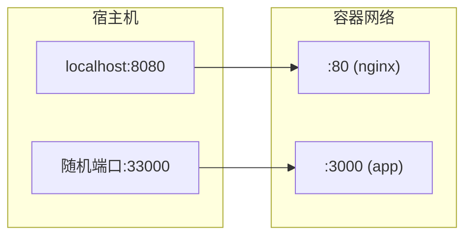
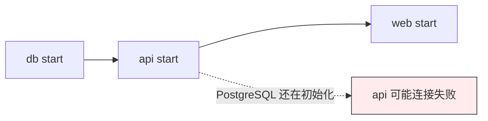
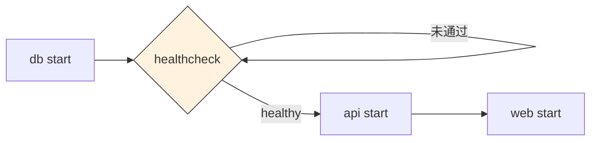

# 03 — Docker Compose 多容器编排

> 掌握 Docker Compose 编排多容器应用，能独立部署全栈项目。

---

## 🎯 学习目标

- 理解 Docker Compose 解决的核心问题（多容器编排）
- 掌握 `docker-compose.yml` 的完整结构与各字段含义
- 熟练使用 Compose 常用命令管理多容器应用
- 理解 `depends_on` 的三种行为及其局限性（面试高频）
- 能独立编排"前端 + 后端 + 数据库"全栈项目

---

## 1. 为什么需要 Docker Compose

### 真实场景

一个典型的 Web 应用通常由多个服务组成：


如果用 `docker run` 手动启动每个容器：

```bash
# 启动数据库
docker run -d --name db \
  -e POSTGRES_USER=myapp \
  -e POSTGRES_PASSWORD=secret \
  -e POSTGRES_DB=myapp \
  -v pgdata:/var/lib/postgresql/data \
  postgres:15-alpine

# 启动后端（需要先知道数据库的 IP）
docker run -d --name backend \
  -e DB_HOST=db \
  -e DB_PORT=5432 \
  -p 3000:3000 \
  --link db \
  myapp-backend

# 启动前端
docker run -d --name frontend \
  -p 80:80 \
  --link backend \
  myapp-frontend
```

**手动方式的问题**：

| 问题 | 说明 |
|------|------|
| **命令冗长** | 每个容器需要 5-10 个参数，容易写错 |
| **启动顺序** | 需要手动管理依赖关系 |
| **网络配置** | 需要创建自定义网络或使用 `--link` |
| **环境变量** | 多个容器间共享的配置需要手动同步 |
| **不可复现** | 没有统一的配置文件，团队成员靠"默契"运行 |
| **难以扩展** | 增加新服务需要再写一长串命令 |

### Compose 的解决方案

Docker Compose 用 YAML 文件定义多容器应用：

```yaml
# 一个命令启动所有服务
services:
  frontend:
    build: ./frontend
    ports:
      - "80:80"
  backend:
    build: ./backend
    ports:
      - "3000:3000"
  db:
    image: postgres:15-alpine
    volumes:
      - pgdata:/var/lib/postgresql/data

volumes:
  pgdata:
```

```bash
# 一行命令启动全部
docker compose up -d
```

**Compose 的核心价值**：

- **声明式配置**：所有服务定义在一个文件中，可版本化管理
- **一键启停**：`up` / `down` 管理整个应用生命周期
- **自动网络**：服务名就是域名，容器间自动发现
- **环境隔离**：每个项目有独立的网络和资源
- **可复现**：新成员 clone 后直接 `docker compose up` 就能跑

---

## 2. docker-compose.yml 结构

### 整体骨架

```yaml
# 新版 Docker Compose (v2+) 中 version 字段已标记为可选
# 官方推荐直接省略 version，保留仅为了兼容旧版 docker-compose (v1)
# 本教程省略 version 字段，使用新版 Compose 语法

services:
  # 服务名（也是 DNS 域名，其他服务可通过此名称访问）
  web:
    image: nginx:alpine        # 使用现有镜像
    # build: ./dir             # 或从 Dockerfile 构建
    ports:
      - "80:80"
    networks:
      - frontend

  app:
    build:
      context: .               # 构建上下文目录
      dockerfile: Dockerfile   # Dockerfile 路径（默认 ./Dockerfile）
    ports:
      - "3000:3000"
    environment:
      - NODE_ENV=production
    depends_on:
      - db
    networks:
      - frontend
      - backend

  db:
    image: postgres:15-alpine
    volumes:
      - pgdata:/var/lib/postgresql/data
    environment:
      POSTGRES_PASSWORD: secret
    networks:
      - backend
    healthcheck:
      test: ["CMD-SHELL", "pg_isready"]
      interval: 10s

# 定义网络
networks:
  frontend:
  backend:

# 定义数据卷
volumes:
  pgdata:
```

### 顶级字段一览

| 字段 | 作用 | 是否必须 |
|------|------|----------|
| `services` | 定义所有服务（容器） | ✅ 必须 |
| `networks` | 定义自定义网络 | 按需 |
| `volumes` | 定义命名数据卷 | 按需 |
| `configs` | 定义配置（Swarm 模式） | 可选 |
| `secrets` | 定义敏感信息（Swarm 模式） | 可选 |

### 最小示例（web + redis）

```yaml
services:
  web:
    image: nginx:alpine
    ports:
      - "8080:80"

  redis:
    image: redis:7-alpine
```

```bash
# 启动
docker compose up -d

# 验证
docker compose ps

# 访问
curl http://localhost:8080
```

---

## 3. 服务定义详解

### 3.1 image / build

```yaml
services:
  # 方式一：使用现有镜像（从仓库拉取）
  web:
    image: nginx:alpine

  # 方式二：从 Dockerfile 构建
  app:
    build: ./app              # 指定 Dockerfile 所在目录

  # 方式三：详细构建配置
  app-with-args:
    build:
      context: ./app          # 构建上下文目录
      dockerfile: Dockerfile.prod  # 指定 Dockerfile 文件名
      args:                   # 构建时变量（对应 Dockerfile 中的 ARG）
        - NODE_ENV=production
        - VITE_API_BASE_URL=/api
      target: production      # 多阶段构建的目标阶段
      platforms:              # 指定目标平台
        - linux/amd64
        - linux/arm64
```

**build 与 image 的互斥关系**：

| 组合 | 行为 |
|------|------|
| 只有 `image` | 从仓库拉取镜像（若本地不存在） |
| 只有 `build` | 从 Dockerfile 构建，不指定镜像名 |
| 两者都有 | 构建后打标签为指定名称，相当于 `docker build -t <image> .` |

### 3.2 ports（端口映射）

```yaml
services:
  web:
    ports:
      # 格式：宿主机端口:容器端口
      - "80:80"             # 明确映射
      - "8080:80"           # 宿主机 8080 → 容器 80
      - "443:443"

      # 不指定宿主机端口（随机分配）
      - "80"                # 宿主机随机端口 → 容器 80

      # 指定协议
      - "80:80/tcp"         # TCP（默认）
      - "53:53/udp"         # UDP
```

**端口映射示意图**：


### 3.3 environment / env_file

```yaml
services:
  app:
    # 方式一：直接写（推荐，清晰可读）
    environment:
      NODE_ENV: production
      DB_HOST: db
      DB_PORT: "5432"        # 注意：数值型环境变量需要加引号
      DB_USER: myapp
      DB_PASSWORD: secret

    # 方式二：数组形式（等效）
    environment:
      - NODE_ENV=production
      - DB_HOST=db
      - DB_PORT=5432

    # 方式三：从 .env 文件加载
    env_file:
      - .env                 # 路径相对于 docker-compose.yml

    # 方式四：混合使用（env_file + environment 可叠加）
    # environment 优先级高于 env_file
```

**环境变量优先级**（从高到低）：

1. `docker compose run -e VAR=val`（命令行）
2. `environment` 字段（YAML 中定义）
3. `env_file` 字段（从文件加载）
4. 容器镜像默认环境变量

### 3.4 volumes（数据持久化）

```yaml
services:
  db:
    image: postgres:15-alpine
    volumes:
      # 命名卷（推荐用于数据库等持久化数据）
      - pgdata:/var/lib/postgresql/data

      # 绑定挂载（开发时用于热重载或配置文件）
      - ./init.sql:/docker-entrypoint-initdb.d/init.sql
      - ./config:/app/config:ro        # :ro 表示只读挂载

      # 匿名卷（极少使用）
      - /var/log/app

  app:
    build: ./app
    volumes:
      # 开发模式：将本地代码挂载到容器内，修改即生效
      - ./app/src:/app/src

# 命名卷需要在顶级 volumes 中声明
volumes:
  pgdata:                    # 声明名为 pgdata 的卷
  # 可以指定驱动选项
  # pgdata:
  #   driver: local
  #   driver_opts:
  #     type: none
  #     device: /path/on/host
  #     o: bind
```

**命名卷 vs 绑定挂载**：

| 对比维度 | 命名卷（Named Volume） | 绑定挂载（Bind Mount） |
|----------|------------------------|------------------------|
| 管理方式 | Docker 管理 | 用户管理 |
| 存储位置 | `/var/lib/docker/volumes/` | 宿主机任意路径 |
| 跨容器共享 | ✅ 方便 | ✅ 方便 |
| 备份恢复 | 需要 `docker cp` 或专用工具 | 直接复制文件 |
| 依赖宿主机路径 | ❌ 不依赖 | ✅ 依赖（移植性差） |
| 适用场景 | 数据库、持久数据 | 开发热重载、配置文件注入 |

### 3.5 depends_on + condition

```yaml
services:
  backend:
    build: ./backend
    depends_on:
      - db                    # 简写形式：仅控制启动顺序

  api:
    build: ./api
    depends_on:
      db:
        condition: service_started    # 默认行为（等同简写）

  worker:
    build: ./worker
    depends_on:
      db:
        condition: service_healthy    # 等待健康检查通过

  web:
    build: ./web
    depends_on:
      api:
        condition: service_completed_successfully  # 等待服务成功退出（job 场景）
```

**三种 condition 详解**（见第 5 章专题讨论）。

### 3.6 restart（重启策略）

```yaml
services:
  app:
    # restart 取值：
    restart: "no"                # 默认值，不自动重启
    restart: always              # 总是重启（容器退出就重启）
    restart: on-failure          # 仅在非正常退出时重启（exit code ≠ 0）
    restart: unless-stopped      # 总是重启，除非手动停止（最常用）
```

**重启策略对比**：

| 策略 | 容器退出后重启 | 手动停止后重启 | Docker 重启后自动启动 |
|------|:-------------:|:--------------:|:-------------------:|
| `no` | ❌ | ❌ | ❌ |
| `always` | ✅ | ✅ | ✅ |
| `on-failure` | ✅（仅非正常退出） | ❌ | ✅ |
| `unless-stopped` | ✅ | ❌ | ✅ |

> **推荐**：对需要保持运行的服务（Web、API、数据库），使用 `restart: unless-stopped`。这样 Docker 重启后服务自动恢复，且手动停止后不会意外重启。

### 3.7 healthcheck（健康检查）

```yaml
services:
  app:
    build: ./app
    healthcheck:
      test: ["CMD", "curl", "-f", "http://localhost:3000/health"]
      interval: 30s         # 检查间隔
      timeout: 10s          # 单次检查超时
      retries: 3            # 连续失败多少次视为不健康
      start_period: 10s     # 启动后等待多久开始检查

  db:
    image: postgres:15-alpine
    healthcheck:
      test: ["CMD-SHELL", "pg_isready -U myapp -d myapp"]
      interval: 10s
      timeout: 5s
      retries: 5

  redis:
    image: redis:7-alpine
    healthcheck:
      test: ["CMD", "redis-cli", "ping"]
      interval: 10s
      timeout: 3s
```

**healthcheck 状态**：

```
# docker compose ps 显示的健康状态
STATUS                   含义
──────────────────────────────────
running (healthy)        健康检查通过
running (unhealthy)      连续失败超过 retries 次数
running (starting)       在 start_period 内，暂不判定
running                  未配置 healthcheck
```

### 3.8 networks（网络配置）

```yaml
services:
  # 前端服务：只接入前端网络
  frontend:
    build: ./frontend
    ports:
      - "80:80"
    networks:
      - frontend

  # 后端服务：同时接入前端和后端网络
  backend:
    build: ./backend
    networks:
      - frontend
      - backend

  # 数据库：只接入后端网络（不暴露给前端）
  db:
    image: postgres:15-alpine
    networks:
      - backend

networks:
  frontend:
    # 默认 driver: bridge
  backend:
    driver: bridge
    ipam:                  # IP 地址管理
      config:
        - subnet: 172.20.0.0/16
```

**网络隔离的意义**：


**容器间通信方式**：在同一个 Compose 网络中，直接用 `服务名` 作为域名即可访问：

```javascript
// 后端代码中连接数据库
const db = new Pool({
  host: 'db',              // ← 服务名，自动解析为容器 IP
  port: 5432,
  database: 'myapp',
});
```

---

## 4. Compose 常用命令

### 生命周期管理

| 命令 | 作用 | 常用参数 |
|------|------|----------|
| `docker compose up` | 创建并启动所有服务 | `-d` 后台运行，`--build` 重新构建 |
| `docker compose down` | 停止并删除所有服务 | `-v` 同时删除卷，`--rmi all` 删除镜像 |
| `docker compose start` | 启动已存在的服务 | - |
| `docker compose stop` | 停止服务（不删除） | - |
| `docker compose restart` | 重启服务 | - |
| `docker compose pause` | 暂停服务 | - |
| `docker compose unpause` | 恢复暂停的服务 | - |

### 查看状态

| 命令 | 作用 |
|------|------|
| `docker compose ps` | 查看所有服务状态 |
| `docker compose ps <service>` | 查看指定服务状态 |
| `docker compose logs` | 查看所有服务日志 |
| `docker compose logs -f` | 实时跟踪日志 |
| `docker compose logs -f backend` | 实时跟踪指定服务日志 |
| `docker compose logs --tail=50` | 查看最近 50 行日志 |
| `docker compose top` | 查看各服务内的进程 |
| `docker compose stats` | 查看各服务的资源使用情况 |

### 操作与调试

| 命令 | 作用 |
|------|------|
| `docker compose exec <service> <cmd>` | 在运行中的容器内执行命令 |
| `docker compose exec backend /bin/sh` | 进入后端容器 |
| `docker compose exec -u root backend /bin/sh` | 以 root 用户进入容器 |
| `docker compose run <service> <cmd>` | 运行一次性命令（启动一个新容器） |
| `docker compose run --rm backend npm test` | 运行测试（执行完自动删除） |

### 构建与验证

| 命令 | 作用 |
|------|------|
| `docker compose build` | 构建所有服务的镜像 |
| `docker compose build backend` | 只构建指定服务 |
| `docker compose build --no-cache` | 不使用缓存构建 |
| `docker compose pull` | 拉取所有依赖的镜像 |
| `docker compose pull db` | 拉取指定服务的镜像 |
| `docker compose config` | 验证 YAML 语法并输出解析后的配置 |
| `docker compose images` | 列出各服务使用的镜像 |

### 清理

```bash
# 停止并清除所有容器和网络
docker compose down

# 清除所有容器、网络、卷（⚠️ 会丢失数据）
docker compose down -v

# 清除所有容器、网络、卷、镜像
docker compose down -v --rmi all
```

### 常见命令组合速查

```bash
# 开发时最常用：构建并后台启动
docker compose up -d --build

# 查看所有日志（实时）
docker compose logs -f

# 只查看后端日志
docker compose logs -f backend

# 进入后端容器调试
docker compose exec backend /bin/sh

# 重启某个服务（不改代码时）
docker compose restart backend

# 更新某个服务的镜像后重建
docker compose up -d --build backend

# 完整重启：停止 → 删除 → 构建 → 启动
docker compose down && docker compose up -d --build

# 验证 YAML 语法
docker compose config
```

---

## 5. depends_on 的三种行为（面试常问）

### 问题：depends_on 能保证服务就绪吗？

**不能。**

`depends_on` 只控制**启动顺序**（先启动依赖的服务），但不等待服务真正**就绪**（端口监听、数据库连接等）。这是面试中对 Compose 理解深浅的常见分水岭。

### 三种 condition 详解

#### condition: service_started（默认行为）

```yaml
services:
  web:
    image: nginx:alpine
    depends_on:
      - api            # 简写形式，等价于下面的完整写法

  api:
    image: myapp-api
    depends_on:
      db:
        condition: service_started  # 默认行为
```

**行为**：确保 `db` 容器的进程已启动，但不等待 `db` 的端口或服务准备就绪。

**实际效果**：

```

#### condition: service_healthy

```yaml
services:
  api:
    image: myapp-api
    depends_on:
      db:
        condition: service_healthy
  db:
    image: postgres:15-alpine
    healthcheck:
      test: ["CMD-SHELL", "pg_isready -U myapp"]
      interval: 5s
      timeout: 5s
      retries: 10
```

**行为**：等待 `db` 的 healthcheck 通过后，才启动 `api`。

**实际效果**：


#### condition: service_completed_successfully

```yaml
services:
  app:
    build: ./app
    depends_on:
      init-db:
        condition: service_completed_successfully

  init-db:
    build: ./init-db
    # 这是一个"一次性"任务，执行完就退出
    # 用于数据库初始化、数据迁移等
```

**行为**：等待依赖的服务**正常退出**（exit code = 0）后再启动。适合数据库迁移、数据初始化等一次性任务场景。

### 面试追问

**问**：那如何确保后端在数据库完全就绪后再启动？

**答**：两种方案：

1. **使用 healthcheck + condition: service_healthy**（推荐）：
   ```yaml
   depends_on:
     db:
       condition: service_healthy
   ```

2. **在应用代码中实现重试机制**（更健壮）：
   ```javascript
   // Node.js 示例：连接数据库时自动重试
   async function connectWithRetry() {
     const maxRetries = 10;
     for (let i = 0; i < maxRetries; i++) {
       try {
         await pool.connect();
         console.log('数据库连接成功');
         return;
       } catch (err) {
         console.log(`等待数据库就绪... (${i + 1}/${maxRetries})`);
         await new Promise(r => setTimeout(r, 2000));
       }
     }
     throw new Error('数据库连接超时');
   }
   ```

> **最佳实践**：healthcheck + 代码重试双保险。healthcheck 确保启动顺序合理，代码重试应对边界情况。

---

## 6. 多容器前后端项目

### 项目结构

```text
fullstack-app/
├── docker-compose.yml
├── .env
├── .env.example
├── backend/
│   ├── Dockerfile
│   ├── package.json
│   └── src/
│       └── server.js
└── frontend/
    ├── Dockerfile
    ├── nginx.conf
    ├── package.json
    └── src/
        └── App.vue
```

### 后端 Dockerfile

```dockerfile
# ===== Build Stage =====
FROM node:20-alpine AS builder
WORKDIR /app
COPY package*.json ./
RUN npm ci
COPY . .

# ===== Production Stage =====
FROM node:20-alpine
WORKDIR /app

RUN addgroup -S appgroup && adduser -S appuser -G appgroup

COPY --from=builder /app/node_modules ./node_modules
COPY --from=builder /app/package.json ./
COPY --from=builder /app/server.js ./

USER appuser

EXPOSE 3000

# 需要在镜像中安装 curl：apk add --no-cache curl
HEALTHCHECK --interval=30s --timeout=3s --start-period=5s --retries=3 \
  CMD curl -fsS http://localhost:3000/health > /dev/null || exit 1

CMD ["node", "server.js"]
```
### 后端应用示例（server.js）

```javascript
const express = require('express');
const app = express();

app.get('/health', (req, res) => res.json({ status: 'ok' }));

app.get('/api/items', (req, res) => {
  // 实际项目从数据库查询
  res.json([{ id: 1, name: 'Docker 入门' }, { id: 2, name: 'Compose 编排' }]);
});

const PORT = process.env.PORT || 3000;
app.listen(PORT, () => console.log(`Server running on port ${PORT}`));
```

### 前端 Dockerfile（Vue + Nginx 多阶段构建）

```dockerfile
# ===== Build Stage =====
FROM node:20-alpine AS builder
WORKDIR /app

COPY package*.json ./
RUN npm ci

COPY . .

# Vite 环境变量构建时注入
ARG VITE_API_BASE_URL=/api
ENV VITE_API_BASE_URL=${VITE_API_BASE_URL}

RUN npm run build

# ===== Production Stage =====
FROM nginx:alpine

# 复制构建产物
COPY --from=builder /app/dist /usr/share/nginx/html

# 复制自定义 Nginx 配置
COPY nginx.conf /etc/nginx/conf.d/default.conf

EXPOSE 80

CMD ["nginx", "-g", "daemon off;"]
```

### Nginx 配置（处理 history 模式 + 反向代理）

```nginx
# frontend/nginx.conf
server {
    listen 80;
    server_name localhost;

    # 前端静态资源
    location / {
        root /usr/share/nginx/html;
        index index.html;

        # Vue Router history 模式：防止刷新 404
        try_files $uri $uri/ /index.html;
    }

    # 反向代理 /api 到后端服务
    location /api/ {
        proxy_pass http://backend:3000/;
        proxy_set_header Host $host;
        proxy_set_header X-Real-IP $remote_addr;
        proxy_set_header X-Forwarded-For $proxy_add_x_forwarded_for;
    }
}
```

### .env.example

```bash
# 数据库配置
DB_USER=myapp
DB_PASSWORD=myapp_secret_2026
DB_NAME=myapp_db
```

### 完整的 docker-compose.yml

```yaml
services:
  # ─── 前端（Vue + Nginx） ───
  frontend:
    build:
      context: ./frontend
      args:
        - VITE_API_BASE_URL=/api
    ports:
      - "80:80"
    depends_on:
      - backend
    restart: unless-stopped

  # ─── 后端 API（Node.js Express） ───
  backend:
    build: ./backend
    ports:
      - "3000:3000"
    environment:
      - NODE_ENV=production
      - PORT=3000
      - DB_HOST=db
      - DB_PORT=5432
      - DB_USER=${DB_USER}
      - DB_PASSWORD=${DB_PASSWORD}
      - DB_NAME=${DB_NAME}
    depends_on:
      db:
        condition: service_healthy
    restart: unless-stopped

  # ─── 数据库（PostgreSQL） ───
  db:
    image: postgres:15-alpine
    volumes:
      - pgdata:/var/lib/postgresql/data
    environment:
      - POSTGRES_USER=${DB_USER}
      - POSTGRES_PASSWORD=${DB_PASSWORD}
      - POSTGRES_DB=${DB_NAME}
    healthcheck:
      test: ["CMD-SHELL", "pg_isready -U ${DB_USER} -d ${DB_NAME}"]
      interval: 10s
      timeout: 5s
      retries: 5
    restart: unless-stopped

volumes:
  pgdata:
```

### 启动方式

```bash
# 1. 准备环境变量
cp .env.example .env
# 编辑 .env 填写实际配置（生产环境需修改密码）

# 2. 一键构建并后台启动所有服务
docker compose up -d --build

# 3. 查看启动状态
docker compose ps

# 4. 查看所有日志
docker compose logs -f

# 5. 访问验证
# 前端：http://localhost           → 前端页面
# 后端 API：http://localhost:3000  → 直接访问后端
# 后端健康检查：http://localhost:3000/health

# 6. 停止并清理
docker compose down
```

### 访问验证

```bash
# 验证前端
curl -s -o /dev/null -w "%{http_code}" http://localhost
# 预期：200

# 验证后端 API（通过 Nginx 代理）
curl -s http://localhost/api/items
# 预期：[{"id":1,"name":"Docker 入门"},{"id":2,"name":"Compose 编排"}]

# 验证后端健康检查
curl -s http://localhost:3000/health
# 预期：{"status":"ok"}
```

---

## 🚨 常见踩坑

### 页面刷新 404

**问题**：Vue / React 使用前端路由（history 模式）时，直接访问 `http://example.com/user/123` 返回 404。

**原因**：Nginx 找不到对应的静态文件（`/user/123` 路径下没有文件），返回了 404。

**解决**：在 Nginx 配置中添加 `try_files`：

```nginx
location / {
    root /usr/share/nginx/html;
    index index.html;
    try_files $uri $uri/ /index.html;  # ← 关键：所有路由回退到 index.html
}
```

### 前端环境变量构建时固化

**问题**：修改 `.env` 中的 `VITE_API_BASE_URL` 后，重新访问前端页面发现没有生效。

**原因**：Vite / Vue CLI 的环境变量在 `npm run build` **构建时**注入到代码中，运行时无法修改。

```yaml
# ❌ 错误做法：运行时设置（对 Vite 无效）
frontend:
  environment:
    - VITE_API_BASE_URL=/api  # 前端的 Dockerfile 中没用到这个

# ✅ 正确做法：构建时通过 ARG 传递
frontend:
  build:
    context: ./frontend
    args:
      - VITE_API_BASE_URL=/api  # 在 Dockerfile 构建阶段使用
```

修改环境变量后需要重新构建：

```bash
docker compose up -d --build frontend
```

### depends_on 不等待就绪

> 详细见第 5 章。核心问题：`depends_on` 只等启动，不等就绪。

**解决方案**：

1. 配合 healthcheck 使用 `condition: service_healthy`
2. 应用代码中实现连接重试机制

### 跨域 vs 代理路径混淆

**问题**：后端 API 部署在 `localhost:3000`，前端部署在 `localhost`（80 端口），浏览器跨域请求失败。

**两种方案对比**：

| 方案 | 说明 | 优点 | 缺点 |
|------|------|------|------|
| **Nginx 反向代理**（推荐） | 通过 Nginx 将 `/api` 转发到后端 | 无跨域问题，统一入口 | 需要配置 Nginx |
| **后端 CORS** | 后端设置 `Access-Control-Allow-Origin` | 前后端独立部署灵活 | 需要后端配合，浏览器仍需处理预检请求 |

**推荐方案**：Nginx 反向代理。前端请求 `http://localhost/api/items`，Nginx 转发到 `http://backend:3000/items`。

```nginx
# Nginx 配置（代理路径映射）
location /api/ {
    # 注意：proxy_pass 末尾的 / 很重要
    # http://backend:3000/  → /api/items 变成 /items
    # http://backend:3000   → /api/items 变成 /api/items（保持路径）
    proxy_pass http://backend:3000/;
}
```

**`proxy_pass` 末尾斜杠的区别**：

| `proxy_pass` 写法 | 请求 `/api/users` 转发到 |
|--------------------|--------------------------|
| `proxy_pass http://backend:3000/;` | `http://backend:3000/users`（去掉 `/api` 前缀） |
| `proxy_pass http://backend:3000;` | `http://backend:3000/api/users`（保留完整路径） |

### Volume 权限问题

**问题**：绑定挂载本地目录到容器后，容器内进程无法写入文件（Permission denied）。

**原因**：容器内进程以非 root 用户运行，但挂载的目录归宿主机的 root 或另一个用户所有。

**解决方案**：

```yaml
services:
  app:
    image: myapp
    user: "1000:1000"    # 显式指定容器内的 UID:GID
    volumes:
      - ./data:/app/data
```

```dockerfile
# 或在 Dockerfile 中创建与宿主机 UID 匹配的用户
RUN addgroup -S appgroup --gid 1000 && \
    adduser -S appuser -G appgroup --uid 1000

# 确保挂载目录有正确权限
RUN mkdir -p /app/data && chown -R appuser:appgroup /app/data
```

**对比方案**：

| 方案 | 适用场景 | 说明 |
|------|----------|------|
| 调整 UID/GID | 开发环境 | 确保容器内用户与宿主机用户 UID 一致 |
| 使用命名卷 | 生产环境 | Docker 自动管理权限，通常不会有权限问题 |
| 放宽目录权限 | 快速解决 | `chmod 777` 不推荐，有安全风险 |

---

## ✅ 自检清单

- [ ] 能说出手动 `docker run` 管理多容器的痛点
- [ ] 能写出完整的 `docker-compose.yml`（services / volumes / networks）
- [ ] 理解 `build` 和 `image` 的区别及使用场景
- [ ] 掌握端口映射的多种写法（明确映射、随机端口）
- [ ] 理解命名卷和绑定挂载的区别和适用场景
- [ ] 能配置 healthcheck 并使用 `condition: service_healthy`
- [ ] 理解 `depends_on` 的三种 condition 行为
- [ ] 能回答面试题："depends_on 能保证服务就绪吗？"
- [ ] 熟练使用 Compose 常用命令（up / down / logs / exec / ps）
- [ ] 能完整编排一个"前端 + 后端 + 数据库"的全栈项目
- [ ] 能解决前端刷新 404 的问题（try_files）
- [ ] 理解前端环境变量为何需要在构建时注入
- [ ] 能区分 Nginx 反向代理和后端 CORS 两种跨域方案
- [ ] 遇到 Volume 权限问题时知道排查方向

---

## 🔗 相关文档

### 本系列文档

- 大纲：[Docker 学习大纲](../docker-learning-outline.md)
- 上一篇：[02 - Dockerfile + 镜像构建 + 最佳实践](./02-dockerfile-image-build.md)
- 下一篇：[04 - 网络模式、数据持久化、日志管理](./04-network-volume-log.md)

### 官方文档

- [Docker Compose 官方文档](https://docs.docker.com/compose/)
- [Compose 文件参考](https://docs.docker.com/compose/compose-file/)
- [Docker Compose 命令参考](https://docs.docker.com/compose/reference/)
- [Dockerfile 最佳实践](https://docs.docker.com/develop/develop-images/dockerfile_best-practices/)

### 相关主题

- [Nginx 反向代理配置](https://nginx.org/en/docs/http/ngx_http_proxy_module.html)
- [Vue Router history 模式](https://router.vuejs.org/guide/essentials/history-mode.html)
- [PostgreSQL Docker 镜像](https://hub.docker.com/_/postgres)

---

*最后更新：2026年7月*
