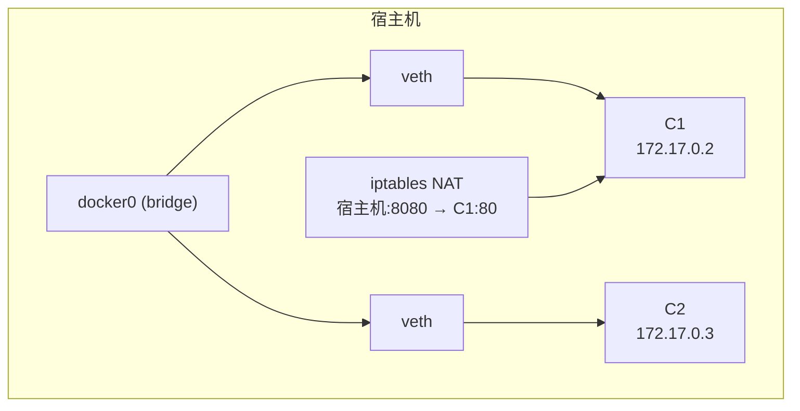
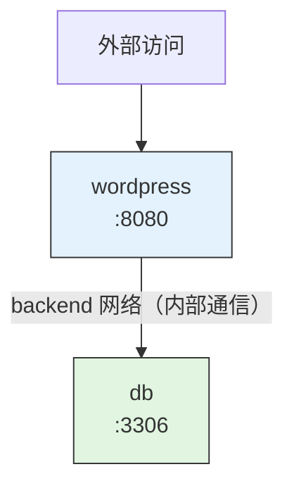

# 04 — 网络模式、数据持久化与日志管理

> 深入理解 Docker 网络原理、数据持久化方案和日志管理策略。

---

## 🎯 学习目标

- 掌握 Docker 四种网络模式（bridge/host/none/overlay）的原理与适用场景
- 能创建自定义网络并实现容器间通过容器名通信
- 理解三种数据持久化方式（Volume / Bind Mount / tmpfs）的差异与选择策略
- 掌握 Volume 生命周期管理命令与 Compose 中的配置
- 能配置容器日志轮转与生产级日志方案

---

## 1. Docker 网络基础

Docker 安装时会自动创建三个默认网络：

```bash
# 查看默认网络
docker network ls
```

输出示例：

```
NETWORK ID     NAME      DRIVER    SCOPE
9f3b8c1a2d3e   bridge    bridge    local
c5e2f4a6b7c8   host      host      local
a1b2c3d4e5f6   none      null      local
```

| 网络 | 驱动 | 说明 |
|------|------|------|
| **bridge** | bridge | 默认网络。容器通过私有 IP 通信，端口映射到宿主机 |
| **host** | host | 直接使用宿主机网络栈，不隔离 |
| **none** | null | 无网络，适合安全隔离场景 |

查看 bridge 网络的详细信息：

```bash
docker network inspect bridge
```

输出片段：

```json
[
    {
        "Name": "bridge",
        "Driver": "bridge",
        "IPAM": {
            "Config": [
                {
                    "Subnet": "172.17.0.0/16",
                    "Gateway": "172.17.0.1"
                }
            ]
        },
        "Containers": {}
    }
]
```

**核心概念**：每个容器在 bridge 网络中会分配一个私有 IP（默认 172.17.0.x），容器之间可以通过 IP 互通，但无法被宿主机外部直接访问——需要通过端口映射暴露。

---

## 2. 网络模式详解（面试必问）

Docker 支持五种网络模式，理解它们的区别是面试高频考点。

### bridge 模式（默认）

每个容器拥有独立的网络命名空间（Network Namespace），Docker 通过 `veth pair` 将容器连接到 Linux bridge（`docker0`）。


**原理要点**（面试回答）：
- 每个容器有自己的 Network Namespace，包括独立网卡、IP、路由表
- 通过 `veth pair` 虚拟网线连接到宿主机的 `docker0` bridge
- 容器间可通过 IP 直接通信（同在一个 bridge 下）
- 对外暴露需要通过 iptables NAT 实现端口映射
- 默认 DNS 使用宿主机的 DNS 配置

```bash
# bridge 模式运行（默认，--network bridge 可省略）
docker run -d --name web1 --network bridge -p 8080:80 nginx:alpine
```

### host 模式

容器直接共享宿主机的网络栈，**不隔离网络**。容器内看到的网络设备就是宿主机的网络设备。

```bash
# host 模式
docker run -d --name web2 --network host nginx:alpine
```

> ⚠️ **Docker Desktop 用户注意**：host 网络模式在 macOS/Windows 上受限于 VM 网络架构，通常无法直接通过 `localhost` 访问容器端口，建议在 Linux 环境或 Docker Desktop 的 WSL2 后端下使用。

**特点**：
- ✅ 性能最好（没有 NAT 转换开销）
- ✅ 端口自动暴露（容器监听 80，宿主机就监听 80）
- ❌ 端口冲突风险（两个容器不能监听同一端口）
- ❌ 隔离性差（容器可使用宿主机的所有网络接口）
- ❌ 不适用于 Docker Desktop（Mac/Windows 需在 VM 中运行，host 网络受限）

**适用场景**：对网络性能要求极高的场景（如代理服务、网络基准测试）。

### none 模式

容器只有 loopback 接口（127.0.0.1），没有任何网络设备。

```bash
# none 模式
docker run -d --name isolated --network none alpine sleep 3600
```

**适用场景**：
- 完全离线的安全沙箱
- 只需要本地进程通信的批处理任务
- 不需要网络的纯计算容器

### overlay 模式

跨宿主机网络，用于 Swarm 或 Kubernetes 集群场景。多个宿主机上的容器可以通过 overlay 网络直接通信。

```bash
# 创建 overlay 网络（需要 Swarm 模式）
docker network create -d overlay my-overlay

# 在 Swarm 服务中使用
docker service create --network my-overlay --name my-app nginx:alpine
```

**原理**：基于 VXLAN 技术，将二层数据包封装在 UDP 中跨宿主机传输。

### Container 模式

共享另一个容器的网络栈。两个容器共享同一个 IP 和端口空间。

```bash
# 先创建一个容器
docker run -d --name nginx-base nginx:alpine

# 新容器共享 nginx-base 的网络栈
docker run -d --name sidecar --network container:nginx-base alpine sleep 3600
```

**适用场景**：
- Sidecar 模式：网络代理容器与应用容器共享网络
- 调试容器：网络诊断容器复用目标容器的网络

### 网络模式对比

| 模式 | 隔离性 | 性能 | 端口映射 | 跨宿主机 | 适用场景 |
|------|--------|------|----------|----------|----------|
| **bridge（默认）** | 好 | 中（有 NAT） | 需要 `-p` | 否 | 单机多容器通信 |
| **host** | 无 | 最好 | 自动暴露 | 否 | 性能敏感服务 |
| **none** | 完全隔离 | — | 不需要 | 否 | 安全沙箱/离线任务 |
| **overlay** | 好 | 中（VXLAN 封装） | 需要 `-p` | 是 | Swarm/K8s 集群 |
| **container** | 共享 | 与共享对象一致 | 依赖共享对象 | 依赖共享对象 | Sidecar 模式 |

---

## 3. 自定义网络与容器间通信

默认 bridge 网络有一个限制：**容器间只能通过 IP 通信，不能通过容器名解析**。

自定义网络解决了这个问题——它内置 DNS 解析，容器名自动解析为 IP。

### 创建自定义网络

```bash
docker network create my-net
```

常用参数：

```bash
# 指定子网和网关
docker network create \
  --subnet=192.168.10.0/24 \
  --gateway=192.168.10.1 \
  my-net
```

### 演示：通过容器名通信

```bash
# 创建自定义网络
docker network create demo-net

# 在自定义网络中启动两个容器
docker run -d --name server --network demo-net alpine sleep 3600
docker run -d --name client --network demo-net alpine sleep 3600

# 在 client 中通过容器名 ping server
docker exec client ping -c 3 server
```

预期输出（关键行）：

```
PING server (172.18.0.2): 56 data bytes
64 bytes from 172.18.0.2: seq=0 ttl=64 time=0.123 ms
```

**如果使用默认 bridge 网络**，`ping server` 会失败（`ping: bad address 'server'`），只能用 IP。

### 容器连接多个网络

一个容器可以同时加入多个网络：

```bash
# 将已有容器连接到另一个网络
docker network connect my-net server

# 断开网络连接
docker network disconnect my-net server

# 启动时指定多个网络
docker run -d --name multi-net \
  --network net1 \
  alpine sleep 3600
# 再通过 docker network connect 添加第二个网络
docker network connect net2 multi-net
```

### Compose 中的自定义网络

```yaml
# 新版 Docker Compose 中 version 字段已可选，保留仅为了兼容旧版工具
version: '3.8'

services:
  app:
    image: nginx:alpine
    networks:
      - frontend
      - backend

  api:
    image: my-api:latest
    networks:
      - backend

  db:
    image: postgres:15-alpine
    networks:
      - backend

networks:
  frontend:
  backend:
```

Compose 会自动为每个 `networks:` 下声明的网络创建 Docker 网络，并自动实现 DNS 解析——服务名就是容器名。

---

## 4. 端口映射

端口映射解决的是**容器网络与宿主机网络的桥接**问题——让外部可以访问容器内的服务。

### 基本语法

```bash
docker run -p <宿主机端口>:<容器端口> <镜像>
```

### 常用示例

```bash
# 宿主机 8080 → 容器 80
docker run -d -p 8080:80 nginx:alpine

# 指定 IP 地址
docker run -d -p 127.0.0.1:8080:80 nginx:alpine

# 映射多个端口
docker run -d \
  -p 8080:80 \
  -p 8443:443 \
  nginx:alpine

# 随机分配宿主机端口（不指定宿主机端口）
docker run -d -p 80 nginx:alpine
# 查看实际映射：docker port <container>

# 指定协议（tcp/udp）
docker run -d -p 8080:80/tcp -p 8081:53/udp nginx:alpine
```

### 查看端口映射

```bash
# 查看容器的端口映射
docker port <container>

# 示例输出
# 80/tcp -> 0.0.0.0:8080
# 443/tcp -> 0.0.0.0:8443
```

### 面试重点：EXPOSE vs -p

**关键区别**：

| 方式 | 作用 | 是否实际映射端口 |
|------|------|-----------------|
| `EXPOSE 80`（Dockerfile） | 声明容器监听 80 端口（文档作用） | ❌ 不实际映射 |
| `-p 8080:80`（docker run） | 将宿主机 8080 映射到容器 80 | ✅ 实际映射 |

```dockerfile
FROM nginx:alpine
EXPOSE 80   # 只是告诉别人"我这个镜像会监听 80 端口"
             # 但运行时不加 -p 仍然无法从外部访问
```

```bash
# 即使 Dockerfile 有 EXPOSE，也必须 -p 才能访问
docker run -d -p 8080:80 nginx:alpine
```

**面试回答要点**：`EXPOSE` 是镜像作者对使用者的提示，相当于"我这个服务默认监听这个端口"。真正让外部可访问的是 `-p` 参数，它在 iptables 中添加 NAT 规则。

---

## 5. 数据持久化方案（面试常问）

### 容器文件系统的本质

容器由镜像层（只读）+ 容器层（可写）组成。当容器被删除时，**可写层随之销毁**，所有在容器运行期间产生的数据都会丢失。

```bash
# 演示数据丢失
docker run --name temp-test alpine sh -c "echo 'hello' > /data.txt"
docker rm temp-test
docker run --name temp-test2 alpine cat /data.txt
# 错误：/data.txt 不存在
```

这就是为什么需要数据持久化——将数据存储在容器生命周期之外。

### 三种持久化方式对比

Docker 提供三种数据持久化方案：

| 特性 | Volume（推荐） | Bind Mount | tmpfs |
|------|---------------|------------|-------|
| **管理方** | Docker 管理 | 用户管理 | Docker 管理 |
| **存储位置** | Docker 数据目录（`/var/lib/docker/volumes/`） | 宿主机任意路径 | 内存 |
| **生命周期** | 独立于容器 | 依赖宿主机文件 | 随容器停止而消失 |
| **数据持久性** | ✅ 持久 | ✅ 持久 | ❌ 不持久 |
| **跨容器共享** | ✅ 支持 | ✅ 支持 | ❌ 不共享 |
| **支持驱动插件** | ✅ 支持（如 NFS、S3） | ❌ 不支持 | ❌ 不支持 |
| **备份/迁移** | ✅ 容易（`docker run --volumes-from` 或直接操作数据目录） | ❌ 依赖宿主机路径 | ❌ 不可备份 |
| **适用场景** | 数据库、配置文件、生产环境 | 开发热重载、调试 | 敏感信息、临时缓存 |

### 命令示例

```bash
# Volume（推荐）
docker volume create my-data
docker run -d -v my-data:/app/data nginx:alpine

# Bind Mount
docker run -d -v /host/path:/container/path nginx:alpine

# tmpfs（内存挂载）
docker run -d --tmpfs /tmp nginx:alpine
```

三种方式在 `docker run` 中的表现：

```bash
# 1. Volume（名字开头，没有 /）
docker run -d --name app1 -v my-volume:/app/data nginx:alpine

# 2. Bind Mount（绝对路径或相对路径开头）
docker run -d --name app2 -v /home/user/data:/app/data nginx:alpine
docker run -d --name app3 -v "$(pwd)/data":/app/data nginx:alpine

# 3. tmpfs
docker run -d --name app4 --tmpfs /app/cache:size=100m nginx:alpine
```

---

## 6. Volume 深入

Volume 是 Docker 推荐的持久化方式，由 Docker 完全管理。

### Volume 生命周期管理

```bash
# 创建命名卷
docker volume create app-data

# 创建时指定驱动选项（如 NFS）
docker volume create \
  --driver local \
  --opt type=nfs \
  --opt o=addr=192.168.1.100,rw \
  --opt device=:/path/to/dir \
  nfs-volume

# 列出所有卷
docker volume ls

# 查看卷详情（包括挂载点路径）
docker volume inspect app-data

# 删除卷（仅当未被任何容器使用时）
docker volume rm app-data

# 清理所有未被使用的卷
docker volume prune
```

### 匿名卷 vs 命名卷

```bash
# 命名卷（推荐）——指定卷名
docker run -d -v my-nginx-html:/usr/share/nginx/html nginx:alpine

# 匿名卷——不指定卷名，Docker 自动生成 UUID
docker run -d -v /usr/share/nginx/html nginx:alpine
```

| 类型 | 命名方式 | 复用性 | 管理难度 |
|------|---------|--------|----------|
| **命名卷** | 用户指定，如 `my-data` | 容易复用 | 低 |
| **匿名卷** | Docker 自动生成 UUID | 难以复用 | 高（不易查找） |

**最佳实践**：始终使用命名卷。匿名卷容易变成"僵尸卷"堆积在磁盘上。

### Volume 在 Compose 中的配置

```yaml
# 新版 Docker Compose 中 version 字段已可选，保留仅为了兼容旧版工具
version: '3.8'

services:
  db:
    image: postgres:15-alpine
    volumes:
      # 使用命名卷
      - pgdata:/var/lib/postgresql/data
      # 使用匿名卷（不推荐）
      # - /var/lib/postgresql/data
    environment:
      POSTGRES_PASSWORD: example

  redis:
    image: redis:7-alpine
    volumes:
      - redis-data:/data

# 声明命名卷（必须在顶层 volumes 声明）
volumes:
  pgdata:
  redis-data:
```

Compose 中 `volumes:` 顶层声明的卷，生命周期由 `docker compose down -v` 控制：

```bash
# 停止并清理容器，但保留卷（数据不丢）
docker compose down

# 停止并清理容器和卷（数据丢失）
docker compose down -v
```

### 数据卷容器（旧模式，了解即可）

在 Docker 早期版本（Volume 驱动成熟之前），常见做法是创建一个专门的数据容器来共享卷：

```bash
# 创建数据容器
docker create -v /data --name data-container alpine

# 其他容器通过 --volumes-from 共享
docker run -d --volumes-from data-container --name app1 nginx:alpine
docker run -d --volumes-from data-container --name app2 nginx:alpine
```

现在 Docker 推荐直接使用命名卷（`docker volume create`），不再需要数据卷容器模式。了解即可，面试可能问到。

---

## 7. Bind Mount 开发实践

Bind Mount 直接将宿主机目录挂载到容器内，宿主机上的修改会实时反映到容器中，非常适合开发场景。

### 开发时热重载

```bash
# Node.js 开发：挂载源码目录，nodemon 自动重启
docker run -d \
  --name dev-app \
  -v "$(pwd):/app" \
  -p 3000:3000 \
  node:20-alpine \
  npx nodemon src/server.js

# 前端开发（Vite/Vue）
docker run -d \
  --name dev-frontend \
  -v "$(pwd):/app" \
  -p 5173:5173 \
  node:20-alpine \
  npx vite --host
```

### Bind Mount 在 Compose 中的配置

```yaml
# 新版 Docker Compose 中 version 字段已可选，保留仅为了兼容旧版工具
version: '3.8'

services:
  app:
    image: node:20-alpine
    working_dir: /app
    # 开发时挂载源码目录
    volumes:
      - ./src:/app/src
      # 排除 node_modules（避免覆盖）
      - /app/node_modules
    command: npx nodemon src/server.js
    ports:
      - "3000:3000"
    environment:
      - NODE_ENV=development
```

**重要提醒**：`/app/node_modules` 用匿名卷（没有宿主机路径），避免用宿主机的 `node_modules` 覆盖容器内的（因为宿主机和容器的原生模块可能架构不同）。

### 注意事项

| 问题 | 说明 | 解决方法 |
|------|------|----------|
| **文件覆盖** | 宿主机的目录会完全覆盖容器内的目标路径 | 确保宿主机目录不为空，或容器不依赖该路径下的镜像内容 |
| **权限问题** | 容器的 UID 与宿主机不同，可能无法读写挂载文件 | `docker run -u $(id -u):$(id -g)` 或在 Dockerfile 中匹配 UID |
| **性能** | Bind Mount 在 Mac 上通过 osxfs 或 gRPC FUSE 转发，性能低于 Volume | 生产环境用 Volume，开发环境可接受 |
| **不存在路径** | 宿主机路径不存在时，Bind Mount 会自动创建目录 | 注意检查路径拼写 |

---

## 8. 日志管理

### docker logs 基础用法

```bash
# 查看容器全部日志
docker logs my-container

# 实时跟踪日志（类似 tail -f）
docker logs -f my-container

# 显示最后 N 行
docker logs --tail 100 my-container

# 加上时间戳
docker logs -t my-container

# 查看指定时间范围的日志
docker logs --since 2024-01-01T00:00:00 my-container
docker logs --until 2024-01-02T00:00:00 my-container

# 组合使用
docker logs -f --tail 50 -t my-container
```

### Logging Driver 介绍

Docker 支持多种日志驱动（Logging Driver），控制容器日志的输出目的地。

| 驱动 | 说明 | 适用场景 |
|------|------|----------|
| **json-file（默认）** | JSON 格式写入宿主机文件 | 单机调试、开发环境 |
| **local** | 自定义格式，性能优于 json-file | 单机生产环境 |
| **syslog** | 输出到系统 syslog | 已有 syslog 基础设施的环境 |
| **fluentd** | 输出到 Fluentd 日志收集器 | 生产环境集中日志 |
| **gelf** | Graylog Extended Log Format | Graylog 日志平台 |
| **journald** | 输出到 systemd journal | systemd 系统 |
| **awslogs** | 输出到 Amazon CloudWatch | AWS 环境 |
| **splunk** | 输出到 Splunk | Splunk 用户 |
| **none** | 不记录日志 | 禁用日志输出 |

```bash
# 指定日志驱动
docker run -d \
  --log-driver syslog \
  --log-opt syslog-address=udp://192.168.1.100:514 \
  nginx:alpine
```

### 日志轮转

默认 json-file 驱动会无限增长日志文件，必须配置轮转：

```bash
# docker run 配置日志轮转
docker run -d \
  --name web \
  --log-opt max-size=10m \    # 每个日志文件最大 10MB
  --log-opt max-file=3 \       # 保留最近 3 个文件
  nginx:alpine
```

Docker Daemon 全局配置（`/etc/docker/daemon.json`）：

```json
{
  "log-driver": "json-file",
  "log-opts": {
    "max-size": "10m",
    "max-file": "3"
  }
}
```

### Compose 中的日志配置

```yaml
# 新版 Docker Compose 中 version 字段已可选，保留仅为了兼容旧版工具
version: '3.8'

services:
  app:
    image: my-app:latest
    logging:
      driver: json-file
      options:
        max-size: "10m"
        max-file: "3"

  fluentd-logger:
    image: my-app:latest
    logging:
      driver: fluentd
      options:
        fluentd-address: "localhost:24224"
        tag: "my-app.{{.Name}}"
```

### 生产环境建议

1. **容器只输出到 stdout/stderr**：不要往文件写日志，让 Docker 日志驱动接管
2. **始终配置日志轮转**：默认不限制，会被日志撑爆磁盘
3. **集中式日志采集**：使用 fluentd/logstash + Elasticsearch + Kibana 的 ELK 栈
4. **以 JSON 格式输出日志**：便于结构化查询

```bash
# 清理某个容器的日志
truncate -s 0 $(docker inspect --format='{{.LogPath}}' <container>)

# 清理所有容器的日志
docker system prune  # 不会清日志
# 需要手动 truncate 或限制全局日志驱动
```

---

## 🎯 实战：WordPress 站点

用 Docker Compose 部署一个完整的 WordPress + MySQL 站点，综合运用网络、Volume、日志的知识。

### docker-compose.yml

```yaml
# 新版 Docker Compose 中 version 字段已可选，保留仅为了兼容旧版工具
version: '3.8'

services:
  wordpress:
    image: wordpress:6-php8.2-apache
    ports:
      - "8080:80"
    environment:
      WORDPRESS_DB_HOST: db:3306
      WORDPRESS_DB_USER: wordpress
      WORDPRESS_DB_PASSWORD: wordpress_pass
      WORDPRESS_DB_NAME: wordpress
    volumes:
      # 命名卷持久化插件和上传文件
      - wordpress-data:/var/www/html
    networks:
      - frontend
      - backend
    logging:
      driver: json-file
      options:
        max-size: "10m"
        max-file: "3"
    depends_on:
      db:
        condition: service_healthy
    restart: unless-stopped

  db:
    image: mysql:8.0
    volumes:
      # 命名卷持久化数据库
      - mysql-data:/var/lib/mysql
    environment:
      MYSQL_ROOT_PASSWORD: root_pass
      MYSQL_DATABASE: wordpress
      MYSQL_USER: wordpress
      MYSQL_PASSWORD: wordpress_pass
    networks:
      - backend
    logging:
      driver: json-file
      options:
        max-size: "10m"
        max-file: "3"
    healthcheck:
      test: ["CMD", "mysqladmin", "ping", "-h", "localhost"]
      interval: 10s
      timeout: 5s
      retries: 5
    restart: unless-stopped

networks:
  frontend:
  backend:

volumes:
  wordpress-data:
  mysql-data:
```

**网络拓扑**：


### 启动验证

```bash
# 启动所有服务
docker compose up -d

# 查看状态
docker compose ps

# 访问 WordPress
# 浏览器打开 http://localhost:8080
# 进入 WordPress 安装界面即成功

# 查看日志
docker compose logs -f wordpress
docker compose logs -f db

# 验证 Volume
docker volume ls
# 应该看到两个卷：
# <项目名>_wordpress-data
# <项目名>_mysql-data

# 验证网络
docker network ls
# 应该看到两个网络
docker network inspect <项目名>_frontend
docker network inspect <项目名>_backend

# 验证容器间 DNS 解析
docker compose exec wordpress ping -c 2 db
```

### 验证数据持久化

```bash
# 删除所有容器（保留卷）
docker compose down

# 重新启动
docker compose up -d

# 数据依然存在（WordPress 页面和文章都在）
# 访问 http://localhost:8080 确认

# 彻底清理（删除卷）
docker compose down -v
```

### 知识点覆盖

| 知识点 | 在此实战中的体现 |
|--------|-----------------|
| 命名卷 | `mysql-data`、`wordpress-data` 持久化数据库和上传文件 |
| 自定义网络 | `frontend`（wordpress 独享）、`backend`（wordpress + db 共享） |
| 网络隔离 | db 不在 `frontend` 网络中，外部无法直接访问数据库 |
| DNS 解析 | `WORDPRESS_DB_HOST: db:3306`——通过服务名连接数据库 |
| 端口映射 | `8080:80` 将 WordPress 暴露到宿主机 |
| 日志轮转 | 每个服务都配置了 `max-size=10m, max-file=3` |
| 健康检查 | MySQL 配置了 healthcheck，wordpress 等待 db 就绪 |
| 重启策略 | `unless-stopped` 保证服务崩溃后自动恢复 |

---

## ✅ 自检清单

- [ ] 能说出 Docker 的 5 种网络模式及其适用场景
- [ ] 能解释 bridge 模式下容器间通信的原理（veth pair + docker0 + iptables NAT）
- [ ] 知道自定义网络与默认 bridge 的核心区别（内置 DNS 解析）
- [ ] 能熟练使用 `docker network create/ls/inspect/connect/disconnect`
- [ ] 能解释 EXPOSE 与 -p 的区别
- [ ] 能说出 Volume、Bind Mount、tmpfs 三种持久化方式的区别和适用场景
- [ ] 掌握 Volume 的完整生命周期管理（create/ls/inspect/rm/prune）
- [ ] 能在 Compose 中正确配置 Volume 和自定义网络
- [ ] 能配置容器日志轮转（max-size + max-file）
- [ ] 知道生产环境推荐使用集中式日志方案（Fluentd + ELK）
- [ ] 能独立使用 Compose 部署 WordPress 等有状态应用

---

## 🔗 相关文档

- 上一篇：[03 - Docker Compose + 多容器编排 + 实践项目](./03-compose-multi-container.md)
- 下一篇：[05 - 生产部署、安全加固与 CI/CD 集成](./05-production-deploy.md)
- 大纲：[Docker 学习大纲](../docker-learning-outline.md)
- [Docker 网络概述](https://docs.docker.com/network/)
- [Docker 存储概述](https://docs.docker.com/storage/)
- [Docker 日志配置](https://docs.docker.com/config/containers/logging/)
- [Docker Volume 官方文档](https://docs.docker.com/storage/volumes/)
- [Docker Compose 网络配置](https://docs.docker.com/compose/networking/)

---

*最后更新：2026年7月*
