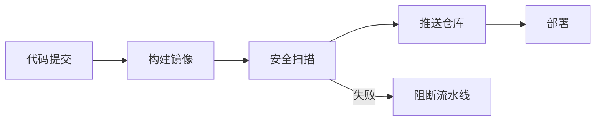
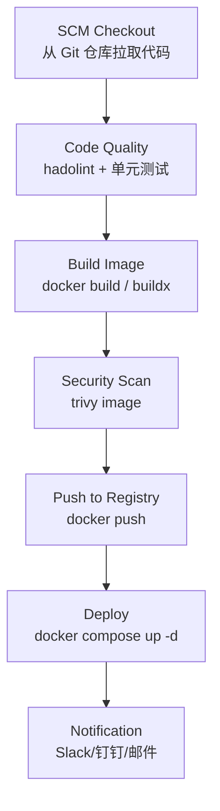
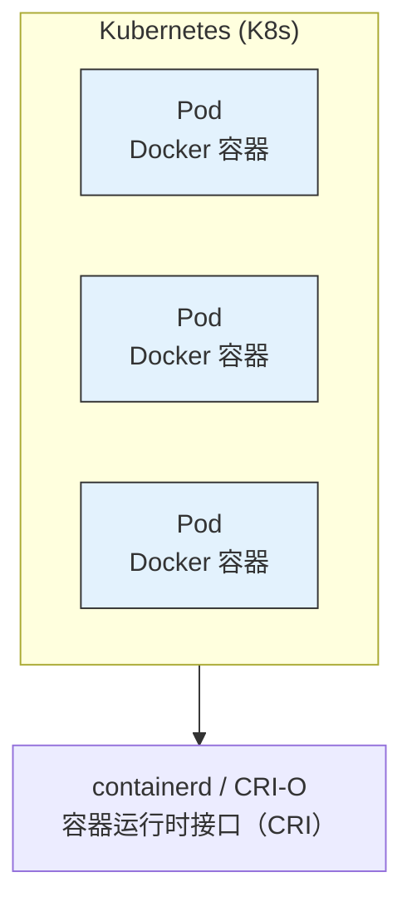

# 05 — 生产部署、安全加固与 CI/CD 集成

> 掌握生产级容器化部署的最佳实践，从开发到生产平滑过渡。

---

## 🎯 学习目标

- 掌握生产级镜像构建原则（最小化基础镜像、多阶段构建、镜像签名与安全扫描）
- 能对 Docker 容器进行安全加固（非 root 运行、只读文件系统、Capabilities 最小化）
- 能配置资源限制与重启策略，应对生产环境的高可用要求
- 能编写 GitHub Actions CI/CD 流水线，实现自动构建、推送与部署
- 了解 Docker Swarm 与 Kubernetes 的基本概念及选型场景

---

## 1. 生产级镜像构建原则

### 1.1 最小化基础镜像

选择合适的基础镜像能显著减小攻击面、降低体积、加快部署速度。

| 镜像类型 | 体积 | 内容 | 适用场景 |
|----------|------|------|----------|
| **Alpine** | ~5 MB | musl libc + busybox | Node.js / Go / Python 运行时 |
| **Distroless** | ~15 MB | 仅应用运行时，无 shell | 安全敏感场景 |
| **Slim (Debian)** | ~30 MB | debian 最小化 | 需要 glibc 兼容性时 |
| **Scratch** | 0 B | 空镜像 | 静态编译的 Go / Rust 二进制 |
| **Ubuntu / Debian** | ~70-150 MB | 完整用户态工具 | 需要大量系统依赖时 |

```dockerfile
# ❌ 不推荐：体积大，攻击面大
FROM node:20

# ✅ 推荐：体积小，攻击面小
FROM node:20-alpine

# ✅ 极致安全：无 shell、无包管理器
FROM gcr.io/distroless/nodejs20-debian12
```

### 1.2 多阶段构建（回顾）

多阶段构建将编译环境与运行环境分离，最终镜像只包含产物和运行时依赖。

```dockerfile
# 阶段 1：编译构建
FROM golang:1.22-alpine AS builder
WORKDIR /app
COPY go.mod go.sum ./
RUN go mod download
COPY . .
RUN CGO_ENABLED=0 go build -o /app/server .

# 阶段 2：极简运行镜像
FROM alpine:3.20
RUN apk add --no-cache ca-certificates tzdata
COPY --from=builder /app/server /server
CMD ["/server"]
```

### 1.3 固定版本标签（不用 latest）

```bash
# ❌ 不推荐：latest 每次拉取结果可能不同
docker pull nginx:latest

# ✅ 推荐：锁定具体版本，保证可复现
docker pull nginx:1.27.0-alpine

# ✅ 生产环境：精确到 patch 版本
docker pull postgres:16.4-alpine3.20
```

**为什么不用 latest**：
- latest 是可变标签，同一时间不同人拉取可能得到不同镜像
- 导致"我机器上能跑，你机器上跑不了"的问题重新出现
- 回滚困难：不知道 latest 对应哪个具体版本

### 1.4 镜像签名验证（Docker Content Trust）

Docker Content Trust（DCT）基于 Notary 项目，通过数字签名确保镜像的完整性和发布者身份。

```bash
# 启用 DCT（全局）
export DOCKER_CONTENT_TRUST=1

# 启用后，docker pull/push 会验证签名
docker pull nginx:alpine
# 如果镜像未签名，会报错：No valid trust data

# 签名镜像（首次需要创建签名密钥）
docker trust sign myapp:1.0.0

# 查看签名信息
docker trust inspect myapp:1.0.0
```

| 操作 | 无 DCT | 有 DCT |
|------|--------|--------|
| `docker pull` | 直接拉取 | 验证签名后才拉取 |
| `docker push` | 直接推送 | 需要签名密钥 |
| 中间人攻击 | 可能拉取到篡改的镜像 | 签名验证失败，阻止拉取 |

> 🔑 **延伸：现代镜像签名方案**
> Docker Content Trust（Notary v1）是 Docker 原生的签名机制。目前社区更推荐：
> - **Sigstore / cosign**：云原生计算基金会（CNCF）项目，支持 keyless 签名，与 GitHub Actions 集成友好
> - **Notation**：CNCF Notary Project 的新一代工具，符合 OCI 镜像签名规范
> 新方案在云原生生态中逐渐成为主流，面试时可作为 DCT 的延伸回答。

### 1.5 镜像安全扫描

**Docker Scout**（Docker 官方，集成在 Docker Desktop 和 CLI 中）：

```bash
# 分析镜像中的已知漏洞
docker scout quickview nginx:1.27.0-alpine

# 查看详细漏洞报告
docker scout cves nginx:1.27.0-alpine

# 比较两个镜像的安全状况
docker scout compare nginx:1.27.0-alpine nginx:1.26.0-alpine
```

**Trivy**（开源，由 Aqua Security 维护，推荐 CI 中使用）：

```bash
# 安装 Trivy
brew install trivy

# 扫描镜像漏洞
trivy image nginx:1.27.0-alpine

# 扫描镜像并输出 JSON（适合 CI 集成）
trivy image --format json --output result.json nginx:1.27.0-alpine

# 只扫描高危及以上漏洞
trivy image --severity HIGH,CRITICAL nginx:1.27.0-alpine
```

**安全扫描在 CI 中的位置**：


---

## 2. 安全加固

### 2.1 非 root 用户运行

Docker 容器默认以 root 运行——如果攻击者通过应用漏洞进入容器，等同于获得了宿主机的 root 权限（虽然受 Namespace 限制，但仍有逃逸风险）。

```dockerfile
# 不安全：以 root 运行
FROM node:20-alpine
WORKDIR /app
COPY . .
RUN npm ci --omit=dev
EXPOSE 3000
CMD ["node", "server.js"]
```

```dockerfile
# ✅ 安全：创建并切换到非 root 用户
FROM node:20-alpine

# Alpine 使用 addgroup/adduser
RUN addgroup -S appgroup && adduser -S appuser -G appgroup

WORKDIR /app

# 复制文件并修改权限
COPY --chown=appuser:appgroup package*.json ./
RUN npm ci --omit=dev
COPY --chown=appuser:appgroup . .

# 切换到非 root 用户
USER appuser

EXPOSE 3000
CMD ["node", "server.js"]
```

> **注意**：不同基础镜像的用户管理命令不同：
>
> | 基础镜像系列 | 创建组 | 创建用户 |
> |--------------|--------|----------|
> | Alpine | `addgroup -S appgroup` | `adduser -S appuser -G appgroup` |
> | Debian/Ubuntu | `groupadd -r appgroup` | `useradd -r -g appgroup -d /app -s /sbin/nologin appuser` |
> | Distroless | 预置了非 root 用户，可直接 `USER nonroot` |

### 2.2 只读根文件系统

将容器的根文件系统设为只读，防止攻击者写入恶意文件或修改配置。

```bash
# 运行只读容器
docker run -d --name my-app \
  --read-only \
  --tmpfs /tmp:rw,noexec,nosuid,size=64m \
  --tmpfs /var/run:rw,noexec,nosuid \
  myapp:1.0.0
```

- `--read-only`：根文件系统只读
- `--tmpfs`：为需要写入的目录挂载临时内存文件系统（如 `/tmp`、`/var/run`）
- 应用需要持久化的数据应使用 Volume

**判断应用是否需要写特定目录**：
```bash
# 先在可写模式下运行，查看写入路径
docker run --rm -it myapp:1.0.0 /bin/sh
# 然后 traced 查看
strace -f -e trace=openat,open 2>&1 | grep EACCES
```

### 2.3 资源限制

```bash
# 完整资源限制示例
docker run -d --name limited-app \
  --memory=512m \              # 最大内存 512MB
  --memory-swap=1g \           # 内存 + Swap 上限 1GB（超过则 OOM Kill）
  --memory-reservation=256m \  # 软限制：尽力保证至少 256MB
  --cpus=0.5 \                 # 最多使用 0.5 个 CPU 核心
  --cpuset-cpus=0,1 \          # 绑定到 CPU 0 和 1
  --ulimit nofile=65535:65535 \ # 文件描述符限制
  --ulimit nproc=1024:2048 \   # 进程数限制（soft:hard）
  myapp:1.0.0
```

| 参数 | 作用 | 建议值 |
|------|------|--------|
| `--memory` | 最大内存硬限制 | 根据应用压测结果设置 |
| `--memory-swap` | 内存 + Swap 上限 | 设为 `--memory` 的 1-2 倍 |
| `--memory-reservation` | 软限制（尽力保证） | 低于 `--memory` |
| `--cpus` | CPU 核心数限制 | 根据应用特性设置 |
| `--cpuset-cpus` | 绑定特定 CPU 核心 | 性能敏感场景使用 |
| `--ulimit nofile` | 文件描述符上限 | 高并发应用调大 |
| `--ulimit nproc` | 进程数上限 | 防止 fork 炸弹 |

### 2.4 内核能力（Capabilities）最小化

Linux Capabilities 将 root 的 powers 拆分为独立单元。默认容器拥有大部分 Capabilities，应删除不需要的。

```bash
# 安全的运行方式：先 Drop All，再加必需的
docker run -d --name secure-app \
  --cap-drop ALL \
  --cap-add NET_BIND_SERVICE \  # 允许绑定低端口（<1024）
  --cap-add CHOWN \              # 允许修改文件所有者
  --cap-add DAC_OVERRIDE \       # 允许覆盖文件权限检查
  --cap-add SET_UID \            # 允许修改用户 ID
  --cap-add SET_GID \            # 允许修改组 ID
  myapp:1.0.0
```

**常见 Capabilities 说明**：

| Capability | 含义 | 是否需要 |
|------------|------|----------|
| `NET_BIND_SERVICE` | 绑定特权端口（<1024） | 监听 80/443 时需要 |
| `CHOWN` | 修改文件所有者 | 运行时需 chown 时需要 |
| `SETUID` / `SETGID` | 修改用户/组 ID | 多数应用不需要 |
| `SYS_ADMIN` | 系统管理（挂载、命名空间） | **高危，默认应删除** |
| `NET_ADMIN` | 网络管理（iptables） | 一般不需要 |
| `SYS_PTRACE` | 进程跟踪 | **高危，生产环境不建议** |
| `KILL` | 发送信号 | watchdog 类应用需要 |
| `SYS_NICE` | 调整进程优先级 | 实时应用可能需要 |

> **面试要点**：容器内 root 不等于宿主机 root。但如果赋予了 `SYS_ADMIN`、`SYS_PTRACE` 等 Capability，攻击者可能利用其进行容器逃逸。**最小权限原则**：先 `--cap-drop ALL`，再按需添加。

### 2.5 seccomp 安全策略

seccomp（Secure Computing Mode）限制容器内可以调用的系统调用，减少内核攻击面。

```bash
# 使用 Docker 默认 seccomp 策略（自动启用）
docker run -d --name default-seccomp myapp:1.0.0

# 使用自定义 seccomp 策略
docker run -d --name custom-seccomp \
  --security-opt seccomp=/path/to/custom-policy.json \
  myapp:1.0.0

# 禁用 seccomp（不推荐，除非调试）
docker run -d --name no-seccomp \
  --security-opt seccomp=unconfined \
  myapp:1.0.0
```

**自定义 seccomp 策略示例**（`custom-policy.json`）：

```json
{
  "defaultAction": "SCMP_ACT_ERRNO",
  "architectures": ["SCMP_ARCH_X86_64"],
  "syscalls": [
    {
      "names": ["accept", "bind", "listen", "read", "write", "open", "close", "exit", "exit_group", "mmap", "munmap", "brk", "fstat", "stat", "lseek", "getdents64", "nanosleep", "clock_gettime", "gettid"],
      "action": "SCMP_ACT_ALLOW"
    }
  ]
}
```

> **注意**：自定义 seccomp 策略需要了解应用的系统调用需求，一般先用 `strace` 收集，然后只允许必需的调用。大多数场景使用 Docker 默认策略即可。

### 2.6 Docker Bench Security 审计

Docker Bench Security 是一个开源安全检查脚本，基于 CIS Docker Benchmark 标准自动审计。

```bash
# 在宿主机上运行安全审计
git clone https://github.com/docker/docker-bench-security.git
cd docker-bench-security
sudo sh docker-bench-security.sh

# 使用 Docker 运行（推荐）
docker run --rm \
  --net host \
  --pid host \
  --userns host \
  --cap-add audit_control \
  -e DOCKER_CONTENT_TRUST=$DOCKER_CONTENT_TRUST \
  -v /var/lib:/var/lib:ro \
  -v /var/run/docker.sock:/var/run/docker.sock:ro \
  -v /etc/localtime:/etc/localtime:ro \
  -v /usr/lib/systemd:/usr/lib/systemd:ro \
  aquasec/docker-bench-security
```

审计结果包括 200+ 项检查，分为：

| 检查类别 | 项目数 | 示例 |
|----------|--------|------|
| 主机配置 | 20+ | 禁用 IPv6、审计 Docker 文件 |
| Docker 守护进程配置 | 30+ | TLS 加密、日志级别 |
| 容器镜像与构建 | 15+ | 非 root 用户、健康检查 |
| 容器运行时 | 40+ | 只读文件系统、Capabilities 限制 |

---

## 3. 资源限制与监控

### 3.1 Docker stats 实时监控

```bash
# 查看所有运行中容器的资源使用
docker stats

# 查看指定容器（实时刷新）
docker stats my-app my-nginx

# 仅查看一次，不持续刷新
docker stats --no-stream my-app

# 格式化输出（便于脚本处理）
docker stats --no-stream --format "table {{.Name}}\t{{.CPUPerc}}\t{{.MemUsage}}\t{{.NetIO}}"
```

`docker stats` 输出示例：

```
CONTAINER ID   NAME      CPU %     MEM USAGE / LIMIT    MEM %     NET I/O          BLOCK I/O
a1b2c3d4e5f6   my-app    0.25%     128.5MiB / 512MiB    25.10%    10.5MB / 5.2MB   2.3MB / 1.1MB
```

### 3.2 内存限制

```bash
# 硬限制：最大 512MB，超出则 OOM Kill
docker run -d --memory=512m nginx:alpine

# 硬限制 + Swap：内存 512MB + Swap 512MB = 共 1GB
docker run -d --memory=512m --memory-swap=1g nginx:alpine

# 软限制：内存 <= 256MB 时性能最佳，超过 512MB 则 OOM Kill
docker run -d --memory=512m --memory-reservation=256m nginx:alpine

# 禁止使用 Swap（性能敏感场景）
docker run -d --memory=512m --memory-swap=512m nginx:alpine

# 查看 OOM 是否触发
docker inspect my-app | grep -i oom
```

> **面试要点**：容器进程被 OOM Kill 时退出码为 137（128 + SIGKILL=9）。检查日志 `docker logs` 可以看到 `Killed`。

### 3.3 CPU 限制

```bash
# 限制使用 0.5 个 CPU 核心
docker run -d --cpus=0.5 nginx:alpine

# 绑定到特定 CPU 核心（适合性能敏感场景）
docker run -d --cpuset-cpus=0,1 nginx:alpine

# CPU 份额（相对权重，默认 1024）
docker run -d --cpu-shares=512 nginx:alpine  # 低优先级
docker run -d --cpu-shares=2048 nginx:alpine  # 高优先级
```

**CPU 限制策略对比**：

| 参数 | 作用 | 示例 |
|------|------|------|
| `--cpus` | 限制使用的 CPU 核心数 | `--cpus=0.5` 表示最多用半个核心 |
| `--cpuset-cpus` | 绑定到指定物理核心 | `--cpuset-cpus=0,1` 绑定 CPU 0 和 1 |
| `--cpu-shares` | CPU 使用权重的相对比例 | 1024 为基准，2048 是两倍权重 |

### 3.4 磁盘 I/O 限制

```bash
# 限制容器对宿主机设备的读写速率
docker run -d --name io-limited \
  --device-read-bps /dev/sda:10mb \
  --device-write-bps /dev/sda:5mb \
  --device-read-iops /dev/sda:1000 \
  --device-write-iops /dev/sda:500 \
  nginx:alpine
```

| 参数 | 作用 | 典型值 |
|------|------|--------|
| `--device-read-bps` | 读取速率限制 | `10mb`, `100mb` |
| `--device-write-bps` | 写入速率限制 | `5mb`, `50mb` |
| `--device-read-iops` | 每秒读操作次数限制 | `1000` |
| `--device-write-iops` | 每秒写操作次数限制 | `500` |

### 3.5 重启策略

```bash
# 不自动重启（默认）
docker run -d --restart no nginx:alpine

# 容器退出码非 0 时自动重启，最多重试 5 次
docker run -d --restart on-failure:5 nginx:alpine

# 总是自动重启（除非手动停止）
docker run -d --restart always nginx:alpine

# 除非手动停止，否则总是重启（Docker 重启后也生效，推荐生产使用）
docker run -d --restart unless-stopped nginx:alpine
```

| 策略 | 行为 | 推荐场景 |
|------|------|----------|
| `no` | 不自动重启（默认） | 一次性任务、调试 |
| `always` | 容器退出总是重启 | 核心服务（不建议，因为手动停止也会重启） |
| `on-failure[:N]` | 非正常退出时重启，可设置最大重试次数 | 偶发故障的服务 |
| `unless-stopped` | 退出时重启，但手动停止后不再重启 | **生产环境推荐** |

### 3.6 Compose 资源限制配置

```yaml
# 新版 Docker Compose 中 version 字段已可选，保留仅为了兼容旧版工具
version: '3.8'

services:
  app:
    build: .
    restart: unless-stopped
    deploy:
      resources:
        limits:
          cpus: '0.50'
          memory: 512M
        reservations:
          cpus: '0.25'
          memory: 256M
    read_only: true
    tmpfs:
      - /tmp:rw,noexec,nosuid,size=64m
    cap_drop:
      - ALL
    cap_add:
      - NET_BIND_SERVICE
```

> **注意**：`deploy.resources` 在 `docker compose` 模式下有效。在 Docker Swarm 模式下，这些限制由调度器强制执行。

---

## 4. 日志与监控

### 4.1 Docker 自带监控命令

```bash
# 实时资源监控
docker stats

# 容器事件监听（创建、销毁、重启等）
docker events

# 过滤特定容器的事件
docker events --filter 'container=my-app'

# 查看容器的完整配置、状态、挂载、网络
docker inspect my-app

# 查看容器进程列表
docker top my-app

# 查看磁盘使用情况
docker system df
```

### 4.2 第三方监控方案：cAdvisor + Prometheus + Grafana

这是最常见的容器监控方案（cAdvisor 负责采集，Prometheus 负责存储和查询，Grafana 负责展示）：

```yaml
# 新版 Docker Compose 中 version 字段已可选，保留仅为了兼容旧版工具
version: '3.8'

services:
  cadvisor:
    image: gcr.io/cadvisor/cadvisor:latest
    container_name: cadvisor
    ports:
      - "8080:8080"
    volumes:
      - /:/rootfs:ro
      - /var/run:/var/run:ro
      - /sys:/sys:ro
      - /var/lib/docker/:/var/lib/docker:ro
    devices:
      - /dev/kmsg
    restart: unless-stopped

  prometheus:
    image: prom/prometheus:latest
    container_name: prometheus
    ports:
      - "9090:9090"
    volumes:
      - ./prometheus.yml:/etc/prometheus/prometheus.yml:ro
      - prometheus_data:/prometheus
    restart: unless-stopped

  grafana:
    image: grafana/grafana:latest
    container_name: grafana
    ports:
      - "3000:3000"
    environment:
      - GF_SECURITY_ADMIN_PASSWORD=admin
    volumes:
      - grafana_data:/var/lib/grafana
    restart: unless-stopped

volumes:
  prometheus_data:
  grafana_data:
```

### 4.3 日志驱动最佳实践

Docker 支持多种日志驱动（Log Driver），决定容器日志的存储和转发方式。

```bash
# json-file（默认驱动，日志写入宿主机文件）
docker run -d --log-driver json-file \
  --log-opt max-size=10m \
  --log-opt max-file=3 \
  --log-opt compress=true \
  nginx:alpine

# 无日志（性能最佳，但不记录日志）
docker run -d --log-driver none nginx:alpine

# 发送到宿主机 syslog
docker run -d --log-driver syslog --log-opt syslog-address=udp://192.168.1.100:514 nginx:alpine

# 发送到 Fluentd
docker run -d --log-driver fluentd --log-opt fluentd-address=localhost:24224 nginx:alpine
```

**日志驱动对比**：

| 驱动 | 适用场景 | 优点 | 缺点 |
|------|----------|------|------|
| `json-file`（默认） | 单机、调试 | 简单，`docker logs` 可用 | 无轮转时占满磁盘 |
| `none` | 性能压测、无日志需求 | 零开销 | 无法查日志 |
| `syslog` | 集中式日志收集 | 统一日志管理 | 依赖 syslog 服务 |
| `fluentd` | 日志管道、过滤转发 | 灵活的路由和转换 | 额外组件，增加复杂度 |
| `awslogs` | AWS 环境 | 直接写入 CloudWatch | 绑定 AWS |
| `gelf` | Graylog 用户 | 结构化日志 | 依赖 Graylog |

**生产环境日志建议**：

```bash
# Docker daemon 全局配置（/etc/docker/daemon.json）
{
  "log-driver": "json-file",
  "log-opts": {
    "max-size": "10m",
    "max-file": "3",
    "compress": true
  }
}
```

```yaml
# Compose 中配置日志
services:
  app:
    logging:
      driver: json-file
      options:
        max-size: "10m"
        max-file: "3"
        compress: "true"
```

---

## 5. CI/CD 容器化集成（重点）

### 5.1 GitHub Actions 完整 Workflow

以下是一个完整的 CI/CD 流水线：对 main 分支提交进行代码检查、构建镜像、安全扫描、推送仓库、自动部署。

```yaml
name: Build, Scan, Push & Deploy

on:
  push:
    branches: [main]
    tags:
      - 'v*'               # 推送 v1.0.0 等标签时触发
  pull_request:
    branches: [main]

env:
  REGISTRY: docker.io
  IMAGE_NAME: ${{ secrets.DOCKER_USERNAME }}/myapp

jobs:
  lint:
    runs-on: ubuntu-latest
    steps:
      - uses: actions/checkout@v4

      - name: Lint Dockerfile
        uses: hadolint/hadolint-action@v3.1.0
        with:
          dockerfile: Dockerfile

      - name: Lint Compose file
        run: |
          docker compose config

  build-and-scan:
    needs: lint
    runs-on: ubuntu-latest
    steps:
      - uses: actions/checkout@v4

      - name: Set up Docker Buildx
        uses: docker/setup-buildx-action@v3

      - name: Cache Docker layers
        uses: actions/cache@v4
        with:
          path: /tmp/.buildx-cache
          key: ${{ runner.os }}-buildx-${{ github.sha }}
          restore-keys: |
            ${{ runner.os }}-buildx-

      - name: Build Docker image
        uses: docker/build-push-action@v5
        with:
          context: .
          push: false
          load: true
          tags: ${{ env.IMAGE_NAME }}:${{ github.sha }}
          cache-from: type=local,src=/tmp/.buildx-cache
          cache-to: type=local,dest=/tmp/.buildx-cache

      - name: Scan image with Trivy
        uses: aquasecurity/trivy-action@master
        with:
          image-ref: ${{ env.IMAGE_NAME }}:${{ github.sha }}
          format: table
          exit-code: '1'     # 发现高危漏洞则阻断
          severity: HIGH,CRITICAL
          ignore-unfixed: true

  push:
    needs: build-and-scan
    if: github.event_name == 'push' && github.ref == 'refs/heads/main'
    runs-on: ubuntu-latest
    steps:
      - uses: actions/checkout@v4

      - name: Log in to Docker Hub
        uses: docker/login-action@v3
        with:
          username: ${{ secrets.DOCKER_USERNAME }}
          password: ${{ secrets.DOCKER_PASSWORD }}

      - name: Set up Docker Buildx
        uses: docker/setup-buildx-action@v3

      - name: Extract metadata for Docker
        id: meta
        uses: docker/metadata-action@v5
        with:
          images: ${{ env.IMAGE_NAME }}
          tags: |
            type=sha,prefix={{date 'YYYYMMDD'}}-
            type=ref,event=branch
            type=semver,pattern={{version}}
            type=semver,pattern={{major}}.{{minor}}

      - name: Build and push multi-arch image
        uses: docker/build-push-action@v5
        with:
          context: .
          push: true
          platforms: linux/amd64,linux/arm64
          tags: ${{ steps.meta.outputs.tags }}
          labels: ${{ steps.meta.outputs.labels }}
          cache-from: type=gha
          cache-to: type=gha,mode=max

  deploy:
    needs: push
    runs-on: ubuntu-latest
    steps:
      - name: Deploy to production via SSH
        uses: appleboy/ssh-action@v1.0.3
        with:
          host: ${{ secrets.DEPLOY_HOST }}
          username: ${{ secrets.DEPLOY_USER }}
          key: ${{ secrets.DEPLOY_SSH_KEY }}
          script: |
            cd /opt/myapp
            docker compose pull
            docker compose up -d --force-recreate
            docker image prune -f
```

#### 镜像标签策略

| 触发条件 | 标签示例 | 说明 |
|----------|----------|------|
| Git SHA | `20260718-a1b2c3d` | 唯一标识每次提交，支持精确回滚 |
| 分支名 | `main`, `develop` | 对应环境（prod/staging） |
| SemVer 标签 | `v1.2.3`, `1.2`, `1` | 正式发布版本，语义化版本控制 |
| latest | `latest` | 最新稳定版，方便开发环境使用 |

#### 多架构构建（docker buildx）

```bash
# 创建 builder 实例
docker buildx create --name multiarch --driver docker-container --use

# 一次性构建多平台镜像
docker buildx build \
  --platform linux/amd64,linux/arm64,linux/arm/v7 \
  -t myapp:latest \
  --push \
  .

# 查看支持的平台
docker buildx ls

# 在本地模拟其他架构（QEMU 模拟）
docker run --platform linux/arm64 -it ubuntu:22.04 uname -m
# 输出：aarch64
```

### 5.2 GitLab CI 简要示例

```yaml
# .gitlab-ci.yml
stages:
  - lint
  - build
  - scan
  - deploy

variables:
  IMAGE_TAG: $CI_REGISTRY_IMAGE:$CI_COMMIT_SHORT_SHA

hadolint:
  stage: lint
  image: hadolint/hadolint:latest
  script:
    - hadolint Dockerfile

build:
  stage: build
  image: docker:27
  services:
    - docker:27-dind
  script:
    - docker build -t $IMAGE_TAG .
    - docker push $IMAGE_TAG

trivy-scan:
  stage: scan
  image: docker:27
  services:
    - docker:27-dind
  script:
    - docker run --rm aquasec/trivy image --exit-code 1 --severity HIGH,CRITICAL $IMAGE_TAG

deploy:
  stage: deploy
  image: alpine:3.20
  before_script:
    - apk add --no-cache openssh-client docker-compose
  script:
    - ssh $DEPLOY_USER@$DEPLOY_HOST "cd /opt/myapp && docker compose pull && docker compose up -d"
  only:
    - main
```

### 5.3 自建 Jenkins 简要思路



**Jenkinsfile 片段**：

```groovy
pipeline {
    agent any

    environment {
        REGISTRY = 'registry.example.com'
        IMAGE_NAME = "${REGISTRY}/myapp"
        IMAGE_TAG = "${env.BUILD_TAG}"
    }

    stages {
        stage('Build') {
            steps {
                sh "docker build -t ${IMAGE_NAME}:${IMAGE_TAG} ."
            }
        }

        stage('Scan') {
            steps {
                sh "docker run --rm aquasec/trivy image --exit-code 1 --severity HIGH,CRITICAL ${IMAGE_NAME}:${IMAGE_TAG}"
            }
        }

        stage('Push') {
            steps {
                withDockerRegistry([credentialsId: 'docker-registry', url: "https://${REGISTRY}"]) {
                    sh "docker push ${IMAGE_NAME}:${IMAGE_TAG}"
                    sh "docker tag ${IMAGE_NAME}:${IMAGE_TAG} ${IMAGE_NAME}:latest"
                    sh "docker push ${IMAGE_NAME}:latest"
                }
            }
        }

        stage('Deploy') {
            steps {
                sshagent(['deploy-key']) {
                    sh """
                        ssh deploy@${env.DEPLOY_HOST} '
                            cd /opt/myapp && \
                            docker compose pull && \
                            docker compose up -d --force-recreate && \
                            docker image prune -f
                        '
                    """
                }
            }
        }
    }

    post {
        failure {
            slackSend(color: 'danger', message: "Pipeline failed: ${env.BUILD_URL}")
        }
        success {
            slackSend(color: 'good', message: "Pipeline succeeded: ${env.BUILD_URL}")
        }
    }
}
```

---

## 6. 镜像仓库管理

### 6.1 Docker Hub（公共仓库）

```bash
# 匿名拉取限制
# 未登录：100 pulls/6h
# 登录后：200 pulls/6h
# 付费用户：无限制（取决于套餐）

# 最佳实践
docker login  # 登录后获得更高配额
docker pull nginx:alpine  # 使用具体标签，不依赖 latest
```

| 方案 | 拉取限制 | 存储限制 | 费用 |
|------|----------|----------|------|
| 匿名用户 | 100次/6小时 | 无 | 免费 |
| 认证用户 | 200次/6小时 | 1 个私有仓库 | 免费 |
| Pro 套餐 | 5000次/6小时 | 无限私有仓库 | $5/月 |
| Team 套餐 | 无限 | 无限 | $15/用户/月 |

### 6.2 自建仓库（Registry v2）

```yaml
# docker-compose.yml
# 新版 Docker Compose 中 version 字段已可选，保留仅为了兼容旧版工具
version: '3.8'

services:
  registry:
    image: registry:2.8
    container_name: docker-registry
    ports:
      - "5000:5000"
    environment:
      REGISTRY_STORAGE_DELETE_ENABLED: "true"
    volumes:
      - registry_data:/var/lib/registry
      - ./auth/htpasswd:/auth/htpasswd:ro
      - ./certs:/certs:ro
    restart: unless-stopped

volumes:
  registry_data:
```

```bash
# 启动私有仓库
docker compose up -d

# 推送镜像到私有仓库
docker tag myapp:1.0.0 localhost:5000/myapp:1.0.0
docker push localhost:5000/myapp:1.0.0

# 从私有仓库拉取
docker pull localhost:5000/myapp:1.0.0

# 使用 HTTPS + 基本认证（生产环境必须）
# 先创建 htpasswd 文件
docker run --rm httpd:alpine htpasswd -Bbn admin mypassword > auth/htpasswd

# 配置证书目录（Let's Encrypt 或自签名）
# 目录结构：
# certs/
# ├── domain.crt
# └── domain.key
```

### 6.3 Harbor（企业级镜像仓库）

Harbor 是 CNCF 毕业项目，提供镜像管理、漏洞扫描、RBAC、镜像复制等功能。

**核心功能**：

| 功能 | 说明 |
|------|------|
| **镜像管理** | 多租户、项目隔离、标签管理 |
| **安全扫描** | 内置 Trivy，自动扫描镜像漏洞 |
| **镜像签名** | 集成 Notary，支持镜像签名验证 |
| **镜像复制** | 跨机房、跨云同步，支持双向复制 |
| **RBAC** | 基于角色的访问控制（管理员/开发/访客） |
| **GC 清理** | 自动清理未使用的镜像和 Blob |
| **Webhook** | 镜像推送/扫描完成后触发通知 |

```bash
# 安装 Harbor（离线包方式）
wget https://github.com/goharbor/harbor/releases/download/v2.11.0/harbor-offline-installer-v2.11.0.tgz
tar xzf harbor-offline-installer-v2.11.0.tgz
cd harbor
cp harbor.yml.tmpl harbor.yml

# 修改 harbor.yml（域名、证书、密码等）
vi harbor.yml

# 安装
sudo ./install.sh

# 启动/停止
docker compose up -d
docker compose down

# 登录 Harbor
docker login harbor.example.com
```

### 6.4 镜像清理策略

```bash
# 清理未被任何容器引用的镜像
docker image prune

# 清理所有未使用的镜像（包含 dangling 和未被引用的）
docker image prune -a

# 清理所有未使用的资源
docker system prune -a --volumes

# 清理特定时间之前的镜像
docker image prune -a --filter "until=24h"

# 清理未被引用的标签
docker image prune --filter "label!=keep"

# 查看磁盘使用
docker system df
```

**自动化清理脚本**（适合生产环境定时执行）：

```bash
#!/bin/bash
# 保留最近 5 个版本的镜像，删除其余
IMAGES_TO_KEEP=5

docker images --format "{{.Repository}}:{{.Tag}}" | grep "myapp" | sort -V | \
  head -n -${IMAGES_TO_KEEP} | xargs -r docker rmi

# 清理所有 dangling 镜像
docker image prune -f

# 清理一周前的构建缓存
docker builder prune --filter "until=168h" -f
```

---

## 7. Docker Swarm 简介

### 7.1 什么是 Swarm

Docker Swarm 是 Docker 原生的容器编排工具，将多台 Docker 主机组成一个集群，统一管理和调度容器。

```bash
# 初始化 Swarm 集群（在 Manager 节点上执行）
docker swarm init --advertise-addr 192.168.1.10

# 查看集群状态
docker node ls

# 添加 Worker 节点（在 Worker 节点上执行）
docker swarm join --token SWMTKN-1-xxxx 192.168.1.10:2377

# 部署服务（在 Manager 上）
docker service create --name web --replicas 3 -p 80:80 nginx:alpine

# 查看服务状态
docker service ls
docker service ps web

# 扩缩容
docker service scale web=5

# 更新服务（滚动更新）
docker service update --image nginx:1.27.0-alpine web

# 查看 Swarm 网络
docker network ls | grep overlay
```

### 7.2 核心概念

| 概念 | 说明 | 类比 |
|------|------|------|
| **Manager Node** | 管理节点，负责集群管理、调度、维护状态 | 团队领导 |
| **Worker Node** | 工作节点，实际运行容器 | 团队成员 |
| **Service** | 服务定义（镜像、端口、副本数等） | Compose 中的服务 |
| **Task** | Service 的单个运行实例（一个容器） | 一个运行实例 |
| **Stack** | 一组相关服务的集合（由 Compose 文件定义） | 完整的应用 |
| **Overlay Network** | 跨宿主机容器网络 | 集群内的虚拟网络 |
| **Raft Consensus** | Manager 节点间的状态同步协议 | 投票达成一致 |

### 7.3 与 Kubernetes 的简单对比

| 维度 | Docker Swarm | Kubernetes |
|------|-------------|------------|
| 安装复杂度 | 极低（Docker 内置） | 中等（需要 kubeadm 或托管服务） |
| 学习曲线 | 低（Docker 命令扩展） | 高（大量新概念） |
| 功能丰富度 | 基础调度、服务发现 | 自动扩缩、服务网格、CRD、Operator |
| 高可用 | 多 Manager 节点，Raft 共识 | 多控制平面，etcd 集群 |
| 社区生态 | 较小 | 极其庞大 |
| 适合场景 | 小规模集群（<50 节点） | 大规模集群、复杂微服务架构 |

### 7.4 适合什么场景

**适合 Swarm 的场景**：
- 小规模集群（5-20 台机器）
- 团队已熟悉 Docker，需要快速实现容器编排
- 不需要 K8s 的复杂功能（自动伸缩、服务网格等）
- 运维能力有限，不能承担 K8s 的学习和维护成本

**不适合 Swarm 的场景**：
- 大规模集群（50+ 节点）
- 需要精细化调度（节点亲和性、资源预留等）
- 需要在多云/混合云环境中部署
- 需要丰富的扩展生态（Operator、Helm）

---

## 8. Kubernetes 简介（了解）

### 8.1 K8s 是什么

Kubernetes（K8s）是 Google 开源的容器编排平台，目前是 CNCF 的毕业项目，也是业界容器编排的事实标准。

```bash
# 查看集群状态
kubectl cluster-info

# 查看节点
kubectl get nodes

# 查看 Pod
kubectl get pods

# 查看所有资源
kubectl get all

# 部署应用
kubectl create deployment nginx --image=nginx:alpine --replicas=3

# 暴露服务
kubectl expose deployment nginx --port=80 --type=LoadBalancer

# 查看 Pod 详情
kubectl describe pod nginx-xxxxx

# 查看日志
kubectl logs nginx-xxxxx

# 进入 Pod
kubectl exec -it nginx-xxxxx -- /bin/sh
```

### 8.2 核心概念

| 概念 | 说明 | Docker 类比 |
|------|------|-------------|
| **Pod** | 最小部署单元，一个或多个共享网络的容器 | 容器组 |
| **Deployment** | 管理 Pod 的声明式更新和回滚 | 类似 Swarm Service |
| **Service** | 稳定的网络端点，负载均衡到 Pod | docker network + 端口映射 |
| **Ingress** | 七层路由（HTTP/HTTPS），域名到 Service 的映射 | Nginx 反向代理 |
| **ConfigMap** | 配置管理（非敏感信息） | 环境变量 |
| **Secret** | 敏感信息（密码、证书） | 安全地管理密钥 |
| **Namespace** | 资源隔离和分组 | Compose 项目隔离 |
| **PersistentVolume** | 持久化存储 | Volume |
| **Helm** | K8s 的包管理器 | Docker Compose 的升级版 |

### 8.3 Docker 与 K8s 的关系



**关键理解**：
- K8s 不直接使用 `docker` 命令，而是通过 CRI（Container Runtime Interface）与容器运行时通信
- Docker 是 K8s 支持的一种容器运行时（通过 cri-dockerd 适配器）
- K8s v1.24+ 移除了内置的 dockershim，推荐使用 containerd 作为容器运行时
- 但 Docker Desktop / Minikube / Kind 等开发工具仍内置 Docker，开发体验友好

### 8.4 Docker Compose vs K8s 对比表

| 维度 | Docker Compose | Kubernetes |
|------|---------------|------------|
| **定位** | 单机容器编排 | 集群容器编排 |
| **节点数** | 单机（可扩展至多机，但有限） | 单机到数千节点 |
| **安装** | 随 Docker 安装 | 需要配置集群（kubeadm / 托管服务） |
| **服务发现** | 内置（服务名解析） | Service + DNS + Ingress |
| **自动伸缩** | 不支持 | 支持（HPA, VPA, Cluster Autoscaler） |
| **滚动更新** | `docker compose up -d` | `kubectl rollout`（精细控制） |
| **自愈** | restart: unless-stopped（单机） | 自动重建失败 Pod、调度到健康节点 |
| **配置管理** | 环境变量 + .env | ConfigMap + Secret |
| **存储** | Volume / Bind Mount | PV / PVC / StorageClass |
| **网格** | 不支持 | Istio / Linkerd 等服务网格 |
| **学习成本** | **低**（1-2 天） | **高**（数周至数月） |
| **适用场景** | 开发环境、小规模部署 | 生产环境、大规模分布式系统 |

> **面试要点**：能说出 K8s 的 3-5 个核心概念（Pod、Deployment、Service、Ingress、ConfigMap），理解 Docker 与 K8s 的"不是替代关系，而是不同层次"。

---

## 9. 常见故障排查

### 9.1 容器频繁重启

```bash
# 查看容器状态
docker ps -a | grep my-app

# 查看退出码
docker inspect my-app --format '{{.State.ExitCode}}'

# 查看最近退出原因
docker inspect my-app --format '{{.State.Status}} - {{.State.Error}}'

# 查看日志
docker logs --tail 50 my-app
```

**常见退出码**：

| 退出码 | 含义 | 常见原因 | 解决方案 |
|--------|------|----------|----------|
| 0 | 正常退出 | 应用执行完毕（如批处理任务） | 确认是否为预期行为 |
| 1 | 一般错误 | 应用启动失败、配置文件错误 | 检查应用日志 |
| 137 | SIGKILL | OOM Kill（超过内存限制） | 增大 `--memory` 或优化内存使用 |
| 139 | SIGSEGV | 段错误 | 镜像架构不匹配、库版本冲突 |
| 143 | SIGTERM | 优雅关闭（收到终止信号） | 检查 `stop_grace_period` 是否够长 |
| 255 | 未知错误 | 健康检查失败 | 调整 `healthcheck` 参数 |

```bash
# 调试新启动失败的容器
docker run --rm -it myapp:1.0.0 /bin/sh

# 覆盖入口点，检查文件系统
docker run --rm -it --entrypoint /bin/sh myapp:1.0.0 -c "ls -la && node --version"

# 带健康检查的调试（延长超时）
docker run -d --name debug-app \
  --health-cmd "curl -f http://localhost:3000/health || exit 1" \
  --health-interval 30s \
  --health-timeout 10s \
  --health-retries 10 \
  myapp:1.0.0
```

### 9.2 磁盘空间不足

```bash
# 查看 Docker 磁盘使用
docker system df

# 或查看整体磁盘使用
df -h

# 清理所有未使用的资源
docker system prune -a --volumes

# 查找大文件
du -sh /var/lib/docker/* | sort -rh | head -10

# 使用卷清理工具
docker run --rm -v /var/run/docker.sock:/var/run/docker.sock:ro \
  -v /var/lib/docker:/var/lib/docker:ro \
  martin/docker-cleanup-volumes

# 设置日志轮转（防止日志占满磁盘）
# /etc/docker/daemon.json
{
  "log-driver": "json-file",
  "log-opts": {
    "max-size": "10m",
    "max-file": "3"
  }
}
```

### 9.3 容器间网络不通

```bash
# 1. 确认容器是否在同一网络
docker network ls
docker inspect my-container --format '{{json .NetworkSettings.Networks}}' | jq

# 2. 确认目标容器是否在运行
docker ps | grep target-container

# 3. 测试连通性
docker exec my-container ping target-container

# 4. 查看容器 IP 地址
docker inspect target-container --format '{{.NetworkSettings.IPAddress}}'

# 5. 检查防火墙/iptables
iptables -L -n | grep DOCKER

# 6. 检查 DNS 解析
docker exec my-container cat /etc/resolv.conf

# 7. 检查端口是否监听到 0.0.0.0
docker exec target-container netstat -tlnp
```

### 9.4 时区问题

```bash
# 方法 1：通过环境变量设置时区（推荐，不改镜像）
docker run -e TZ=Asia/Shanghai nginx:alpine

# 方法 2：挂载宿主机的时区文件
docker run -v /etc/localtime:/etc/localtime:ro nginx:alpine

# 方法 3：在 Dockerfile 中设置（适用于 Alpine）
RUN apk add --no-cache tzdata
ENV TZ=Asia/Shanghai

# 方法 4：验证容器内时区
docker exec my-app date
docker exec my-app cat /etc/timezone
```

### 9.5 容器内无法连接宿主机服务

```bash
# 场景：容器内的应用需要访问宿主机上监听的 MySQL/Redis

# 解决方案 1：使用 host.docker.internal（macOS / Windows Docker Desktop）
docker run -d --name my-app \
  -e DB_HOST=host.docker.internal \
  myapp:1.0.0

# 解决方案 2：使用宿主机 IP（Linux）
docker run -d --name my-app \
  -e DB_HOST=172.17.0.1 \
  --add-host host.internal:172.17.0.1 \
  myapp:1.0.0

# 解决方案 3：使用 host 网络模式（性能好，但隔离性降低）
docker run -d --name my-app --network host myapp:1.0.0

# 解决方案 4：docker-compose 中将所需服务容器化
# 通过 service_name 访问（推荐）
```

---

## ✅ 自检清单

- [ ] 能解释为什么生产镜像应该使用 Alpine、固定版本标签、多阶段构建
- [ ] 能使用 Docker Content Trust 验证镜像签名
- [ ] 能使用 Trivy / Docker Scout 扫描镜像漏洞
- [ ] 能在 Dockerfile 和运行时做安全加固（非 root 用户、只读文件系统、Capabilities 最小化）
- [ ] 能配置 `--memory`、`--cpus`、`--restart` 等资源限制参数
- [ ] 能使用 `docker stats`、`docker events`、`docker inspect` 监控容器
- [ ] 能编写 GitHub Actions CI/CD 流水线（lint → build → scan → push → deploy）
- [ ] 能使用 `docker buildx` 构建多架构镜像
- [ ] 能选择适合场景的镜像仓库方案（Docker Hub / Registry v2 / Harbor）
- [ ] 能解释 Docker Swarm 与 Kubernetes 的核心概念及选型依据
- [ ] 能排查容器频繁重启、磁盘空间不足、网络不通等常见问题

---

## 🔗 相关文档

- 上一篇：[04 - 网络模式、数据持久化、日志管理](./04-network-volume-log.md)
- 大纲：[Docker 学习大纲](../docker-learning-outline.md)
- [Docker 安全最佳实践](https://docs.docker.com/go/security-best-practices/)
- [Docker Bench Security](https://github.com/docker/docker-bench-security)
- [Trivy - 镜像安全扫描](https://github.com/aquasecurity/trivy)
- [Docker Content Trust](https://docs.docker.com/engine/security/trust/)
- [Docker Buildx 多架构构建](https://docs.docker.com/build/building/multi-platform/)
- [Harbor - 企业级镜像仓库](https://goharbor.io/)
- [GitHub Actions Docker 集成](https://docs.docker.com/ci-cd/github-actions/)

---

*最后更新：2026年7月*
