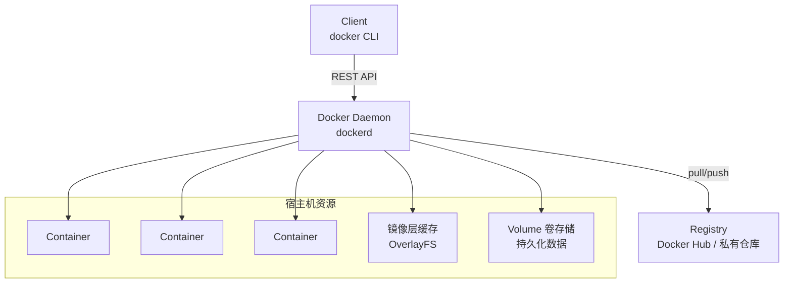
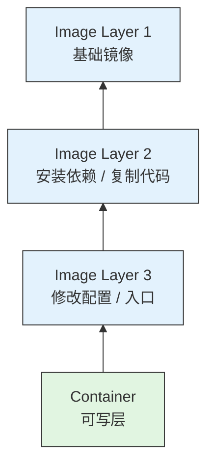

# Docker 入门教程

> 面向后端/全栈工程师的 Docker 快速入门 —— 掌握容器化核心概念、镜像构建、编排部署，从容应对面试与日常开发。

---

## 🎯 学习目标

- 理解 Docker 的架构模型与核心概念（镜像、容器、仓库、Dockerfile）
- 掌握 Dockerfile 编写规范与镜像构建优化
- 熟练使用 Docker Compose 编排多容器应用
- 能独立完成生产级镜像构建、数据持久化、网络配置
- 面试时能清晰解释 Docker 与虚拟机的区别、分层镜像原理、网络模式

---

## 📋 前置要求

| 领域 | 要求 |
|------|------|
| Linux 基础 | 了解基本命令、文件权限、进程管理 |
| 命令行 | 熟练使用终端、环境变量、重定向 |
| 网络基础 | 了解 IP、端口、TCP 连接、HTTP 协议 |
| 应用部署 | 了解传统部署方式（直接跑在宿主机上） |

---

## 🏗️ Docker 架构图



镜像分层结构：



> 镜像层只读，所有层共享，复用缓存。

---


## 🗺️ 学习路径（三天速成 + 两天进阶）

| 天数 | 内容 | 面试价值 |
|------|------|----------|
| **Day 1** | Docker 概述 + 核心概念 + 基础命令 | 理解架构，能运行容器 |
| **Day 2** | Dockerfile + 镜像构建 + 最佳实践 | **核心技能**，必须掌握 |
| **Day 3** | Docker Compose + 多容器编排 + 实践项目 + 前后端联合部署（可选扩展） | 完成生产级编排 |
| **Day 4**（选学） | 网络模式、数据持久化、日志与监控 | 进阶必知 |
| **Day 5**（选学） | Docker Swarm / K8s 简介 + 生产部署 | 集群入门 |

**核心文档**（Day 1-3 必学）：
- [01-docker-overview-command.md](./doc/01-docker-overview-command.md) — Docker 概述 + 核心概念 + 基础命令
- [02-dockerfile-image-build.md](./doc/02-dockerfile-image-build.md) — Dockerfile 指令 + 镜像构建 + 最佳实践
- [03-compose-multi-container.md](./doc/03-compose-multi-container.md) — Docker Compose + 多容器编排 + 实践项目

**进阶文档**（Day 4-5 选学）：
- [04-network-volume-log.md](./doc/04-network-volume-log.md) — 网络模式、数据持久化、日志管理
- [05-production-deploy.md](./doc/05-production-deploy.md) — 生产部署、安全加固、CI/CD 集成

---

## 📚 核心知识点

### 01 — Docker 核心概念与基础命令（Day 1）

**核心概念对比**（面试常问）：

| 概念 | 类比 | 说明 |
|------|------|------|
| **镜像（Image）** | 类 / 安装包 | 只读模板，包含运行所需的一切（OS + 依赖 + 代码） |
| **容器（Container）** | 实例 / 运行的程序 | 镜像的运行态，有独立的文件系统、网络、进程空间 |
| **仓库（Registry）** | Git 仓库 | 存储和分发镜像的地方（Docker Hub / 私有仓库） |
| **Dockerfile** | 配方 / 构建脚本 | 描述如何构建镜像的指令集 |
| **Volume** | U 盘 / 外置存储 | 持久化容器数据，生命周期独立于容器 |
| **Docker Compose** | 编排脚本 | 定义和运行多容器应用（YAML 配置） |

**Docker vs 虚拟机**（面试必问）：

| 维度 | Docker 容器 | 虚拟机 |
|------|-------------|--------|
| **内核** | 共享宿主机内核 | 每个 VM 独立内核（Hypervisor 层） |
| **启动速度** | 毫秒级 | 秒级至分钟级 |
| **资源占用** | 轻量（MB 级） | 重量（GB 级） |
| **隔离级别** | 进程级（cgroups + namespace） | 硬件级虚拟化 |
| **镜像大小** | MB 级（Alpine 仅 5MB） | GB 级（完整 OS） |
| **性能损耗** | 几乎无（直接调用宿主机内核） | 有一定损耗（虚拟化层开销） |
| **适用场景** | 微服务、CI/CD、应用打包 | 多 OS 需求、强隔离需求 |

**生命周期命令**：
```bash
# 镜像管理
docker pull nginx:alpine          # 拉取镜像
docker images                     # 列出本地镜像
docker rmi nginx                  # 删除镜像
docker tag nginx my-nginx:v1      # 打标签

# 容器运行
docker run -d --name my-nginx -p 80:80 nginx:alpine   # 后台运行
docker ps                         # 列出运行中容器
docker ps -a                      # 列出所有容器
docker stop my-nginx              # 停止容器
docker start my-nginx             # 启动已停止容器
docker rm my-nginx                # 删除容器

# 进入容器
docker exec -it my-nginx /bin/sh  # 交互式进入
docker logs -f my-nginx           # 查看日志

# 清理
docker system prune               # 清理所有未使用的资源
docker container prune            # 清理已停止的容器
docker image prune                # 清理 dangling 镜像
```

---

### 02 — Dockerfile 与镜像构建（Day 2 · 核心技能）

**Dockerfile 指令一览**：

| 指令 | 用途 | 说明 |
|------|------|------|
| `FROM` | 指定基础镜像 | 尽量选择 Alpine / Slim 版本 |
| `WORKDIR` | 设置工作目录 | 推荐使用，避免路径混乱 |
| `COPY` | 复制文件到镜像 | 比 `ADD` 更明确，只复制不处理 |
| `ADD` | 复制 + 自动解压 | 只有需要解压时才用 |
| `RUN` | 执行构建命令 | 每个 `RUN` 创建一个新层 |
| `ENV` | 设置环境变量 | 运行时也生效 |
| `EXPOSE` | 声明暴露端口 | **仅文档作用**，不真正映射端口 |
| `CMD` | 容器启动默认命令 | 可被 `docker run` 参数覆盖 |
| `ENTRYPOINT` | 容器入口命令 | 不可覆盖（除非 `--entrypoint`） |
| `ARG` | 构建时变量 | 仅在 `docker build` 时存在 |
| `VOLUME` | 声明挂载点 | 用于数据持久化 |
| `USER` | 指定运行用户 | 安全最佳实践，避免 root |
| `HEALTHCHECK` | 健康检查 | 生产环境必备 |

**基本 Dockerfile 示例**：
```dockerfile
# 1. 选择基础镜像（优先 Alpine）
FROM node:20-alpine

# 2. 设置工作目录
WORKDIR /app

# 3. 先复制依赖文件（利用缓存）
COPY package*.json ./
RUN npm ci --omit=dev

# 4. 再复制源码（依赖层不变时可复用缓存）
COPY . .

# 5. 暴露端口
EXPOSE 3000

# 6. 启动命令
CMD ["node", "server.js"]
```

**多阶段构建**（减少最终镜像体积）：
```dockerfile
# 阶段 1：构建
FROM node:20-alpine AS builder
WORKDIR /app
COPY package*.json ./
RUN npm ci
COPY . .
RUN npm run build

# 阶段 2：运行（只包含产物和运行时依赖）
FROM node:20-alpine
WORKDIR /app
COPY --from=builder /app/dist ./dist
COPY --from=builder /app/node_modules ./node_modules
EXPOSE 3000
CMD ["node", "dist/server.js"]
```

**镜像优化最佳实践**：

| 实践 | 说明 |
|------|------|
| 优先使用 Alpine 基础镜像 | node:20-alpine (120MB) vs node:20 (1GB+) |
| 合并 `RUN` 命令 | 减少镜像层数 |
| 利用构建缓存 | 不常变的内容放前面（依赖 → 源码） |
| 多阶段构建 | 构建环境和运行环境分离 |
| 最小化上下文 | 使用 `.dockerignore` 排除无关文件 |
| 不要用 `latest` 标签 | 用具体版本号，保证可复现 |
| 使用非 root 用户 | 安全加固 |

---

### 03 — Docker Compose 多容器编排（Day 3）

**docker-compose.yml 结构**：
```yaml
# 新版 Docker Compose 中 version 字段已可选，保留仅为了兼容旧版工具
version: '3.8'

services:
  # 前端应用
  frontend:
    build: ./frontend
    ports:
      - "3000:3000"
    environment:
      - API_URL=http://backend:8080
    depends_on:
      - backend

  # 后端 API
  backend:
    build: ./backend
    ports:
      - "8080:8080"
    environment:
      - DB_HOST=db
      - DB_PORT=3306
    depends_on:
      db:
        condition: service_healthy

  # MySQL 数据库
  db:
    image: mysql:8.0
    volumes:
      - db_data:/var/lib/mysql
    environment:
      MYSQL_ROOT_PASSWORD: rootpass
      MYSQL_DATABASE: myapp
    healthcheck:
      test: ["CMD", "mysqladmin", "ping", "-h", "localhost"]
      interval: 10s
      timeout: 5s

volumes:
  db_data:
```

**Compose 常用命令**：
```bash
# 启动服务
docker compose up -d                # 后台启动
docker compose up -d --build        # 重新构建后启动

# 查看状态
docker compose ps                   # 查看服务状态
docker compose logs -f              # 查看所有日志
docker compose logs -f backend      # 查看特定服务日志

# 执行命令
docker compose exec backend /bin/sh  # 进入容器

# 管理服务
docker compose stop                 # 停止所有
docker compose down                 # 停止并清理
docker compose down -v              # 停止并清理 Volume
```

**depends_on 的三种行为**：

| 写法 | 行为 |
|------|------|
| `depends_on: - db` | 仅确保 db 服务先启动，不等待就绪 |
| `depends_on: db: condition: service_started` | 同上，默认行为 |
| `depends_on: db: condition: service_healthy` | 等待 healthcheck 通过后才启动 |

---

### 04 — 网络与数据持久化（Day 4 · 选学）

**网络模式对比**（面试常问）：

| 模式 | 说明 | 适用场景 |
|------|------|----------|
| `bridge`（默认） | 私有网络，容器间互访 | 单机多容器通信 |
| `host` | 直接使用宿主机网络栈 | 性能敏感场景 |
| `none` | 无网络 | 安全隔离 |
| `overlay` | 跨宿主机网络 | Swarm / K8s 集群 |

**自定义网络与容器间通信**：
```yaml
services:
  app:
    networks:
      - frontend
      - backend
  db:
    networks:
      - backend

networks:
  frontend:
  backend:
```

**数据持久化方式**（面试常问）：

| 方式 | 说明 | 适用场景 |
|------|------|----------|
| **Volume**（推荐） | Docker 管理的持久化存储 | 数据库数据、配置文件 |
| **Bind Mount** | 直接挂载宿主机目录 | 开发热重载、调试 |
| **tmpfs** | 内存中的临时存储 | 敏感信息、缓存 |

```yaml
services:
  db:
    image: postgres:15
    volumes:
      # Volume（推荐）
      - pgdata:/var/lib/postgresql/data
      # Bind Mount（开发用）
      - ./init.sql:/docker-entrypoint-initdb.d/init.sql
    tmpfs:
      - /tmp

volumes:
  pgdata:
```

---

### 05 — 生产部署与 CI/CD 集成（Day 5 · 选学）

**生产镜像安全加固**：

```dockerfile
FROM node:20-alpine

# 1. 创建非 root 用户
RUN addgroup -S appgroup && adduser -S appuser -G appgroup

WORKDIR /app
COPY package*.json ./
RUN npm ci --omit=dev
COPY . .

# 2. 切换到非 root 用户
USER appuser

# 3. 只读根文件系统
# docker run --read-only ...

# 4. 资源限制
# docker run --memory=512m --cpus=0.5 ...

EXPOSE 3000
CMD ["node", "server.js"]
```

**CI/CD 集成示例（GitHub Actions）**：
```yaml
name: Build and Push Docker Image

on:
  push:
    branches: [main]

jobs:
  build:
    runs-on: ubuntu-latest
    steps:
      - uses: actions/checkout@v4

      - name: Build Docker Image
        run: docker build -t myapp:${{ github.sha }} .

      - name: Push to Registry
        run: |
          docker tag myapp:${{ github.sha }} registry.example.com/myapp:latest
          docker push registry.example.com/myapp:latest
```

---

### 🚨 常见错误排查清单

| 错误 | 原因 | 解决方案 |
|------|------|----------|
| **Exit Code 0** | 容器入口命令执行完毕 | 检查 `CMD`/`ENTRYPOINT` 是否应为守护进程 |
| **Exit Code 137** | OOM（内存不足被 Kill） | `docker run --memory` 增大内存限制 |
| **Exit Code 139** | 段错误（Segfault） | 镜像兼容性问题，尝试不同基础镜像 |
| **Port already allocated** | 端口被占用 | `lsof -i :<port>` 查看占用进程 |
| **No space left on device** | 磁盘空间不足 | `docker system prune` 清理或扩容 |
| **Cannot connect to Docker daemon** | Docker 未运行 | `systemctl start docker` 或检查权限 |
| **exec format error** | 架构不匹配（ARM vs x86） | `--platform linux/amd64` 指定架构 |
| **OCI runtime create failed** | 容器运行时错误 | 更新 Docker / 检查 `seccomp` 配置 |

**排查命令**：
```bash
# 查看容器日志
docker logs -f <container_name>

# 查看容器详情
docker inspect <container_name>

# 查看资源占用
docker stats

# 查看磁盘空间
docker system df

# 进入容器排查
docker exec -it <container_name> /bin/sh

# 带诊断的运行
docker run --rm -it --entrypoint /bin/sh <image>
```

---

## 🕹️ 实践项目：Node.js 应用容器化（Day 3）

### 场景描述

将一个 Node.js Express 应用 + PostgreSQL 数据库容器化部署，实现：
- 多阶段构建优化镜像体积
- Docker Compose 管理多容器编排
- 数据持久化（数据库 Volume）
- 环境变量配置
- 健康检查

### 项目结构

```
myapp/
├── .dockerignore
├── .env.example
├── docker-compose.yml
├── Dockerfile
├── package.json
└── src/
    └── server.js
```

### Dockerfile

```dockerfile
# ===== Build Stage =====
FROM node:20-alpine AS builder
WORKDIR /app
COPY package*.json ./
RUN npm ci
COPY . .
RUN npm run build

# ===== Production Stage =====
FROM node:20-alpine
WORKDIR /app

# 创建非 root 用户（以下命令为 Alpine 专用语法，Debian/Ubuntu 镜像需改用 groupadd/adduser）
RUN addgroup -S appgroup && adduser -S appuser -G appgroup

# 只复制构建产物和运行时依赖
COPY --from=builder /app/dist ./dist
COPY --from=builder /app/node_modules ./node_modules
COPY package*.json ./

USER appuser

EXPOSE 3000

# 需要在镜像中安装 curl：apk add --no-cache curl
# 同时后端服务需自行实现 /health 端点（返回 200 即可）
HEALTHCHECK --interval=30s --timeout=3s --start-period=5s --retries=3 \
  CMD curl -fsS http://localhost:3000/health > /dev/null || exit 1

CMD ["node", "dist/server.js"]
```

### docker-compose.yml

```yaml
# 新版 Docker Compose 中 version 字段已可选，保留仅为了兼容旧版工具
version: '3.8'

services:
  app:
    build: .
    ports:
      - "3000:3000"
    environment:
      - NODE_ENV=production
      - DB_HOST=db
      - DB_PORT=5432
      - DB_USER=${DB_USER}
      - DB_PASSWORD=${DB_PASSWORD}
      - DB_NAME=${DB_NAME}
    depends_on:
      db:
        condition: service_healthy
    restart: unless-stopped

  db:
    image: postgres:15-alpine
    volumes:
      - pgdata:/var/lib/postgresql/data
    environment:
      - POSTGRES_USER=${DB_USER}
      - POSTGRES_PASSWORD=${DB_PASSWORD}
      - POSTGRES_DB=${DB_NAME}
    healthcheck:
      test: ["CMD-SHELL", "pg_isready -U ${DB_USER} -d ${DB_NAME}"]
      interval: 10s
      timeout: 5s
      retries: 5
    restart: unless-stopped

volumes:
  pgdata:
```

### 覆盖知识点

- 多阶段构建
- 非 root 用户运行
- 健康检查配置
- Compose 环境变量引用
- depends_on 条件等待
- Volume 数据持久化
- 服务重启策略

---

## 🕹️ 扩展：前后端分离项目联合部署（Day 3+）

> 基于上面的 Node.js 后端项目，增加一个 Vue 前端服务，演示如何用 Docker Compose 把「前端 + 后端 + 数据库」一起跑起来。这也是个人知识库项目最终需要掌握的部署形态。

### 联合部署项目结构

```text
fullstack-app/
├── docker-compose.yml
├── backend/
│   ├── Dockerfile          # 沿用上一节的 Node.js Dockerfile
│   ├── package.json
│   └── src/
│       └── server.js
└── frontend/
    ├── Dockerfile          # 多阶段构建：Node 构建 → Nginx 运行
    ├── nginx.conf          # 处理 Vue history 模式 + 反向代理 /api
    ├── package.json
    └── src/
        └── main.ts
```

### 前端 Dockerfile（Vue/Vite 多阶段构建）

```dockerfile
# ===== Build Stage =====
FROM node:20-alpine AS builder
WORKDIR /app

# 先安装依赖（利用缓存）
COPY package*.json ./
RUN npm ci

# 复制源码并构建
COPY . .

# Vite/Vue CLI 的环境变量在构建时注入，运行后无法再改
ARG VITE_API_BASE_URL=/api
ENV VITE_API_BASE_URL=${VITE_API_BASE_URL}

RUN npm run build

# ===== Production Stage =====
FROM nginx:alpine

# 复制构建产物
COPY --from=builder /app/dist /usr/share/nginx/html

# 复制 Nginx 配置（处理 history 模式 + 反向代理）
COPY nginx.conf /etc/nginx/conf.d/default.conf

EXPOSE 80
```

### Nginx 配置（`frontend/nginx.conf`）

```nginx
server {
    listen 80;
    server_name localhost;

    # 前端静态资源
    location / {
        root /usr/share/nginx/html;
        index index.html;
        # Vue Router history 模式必须加这一行，否则刷新 404
        try_files $uri $uri/ /index.html;
    }

    # 把 /api/xxx 代理到后端服务
    location /api/ {
        proxy_pass http://backend:8080/;
        proxy_set_header Host $host;
        proxy_set_header X-Real-IP $remote_addr;
    }
}
```

### docker-compose.yml（三服务编排）

```yaml
# 新版 Docker Compose 中 version 字段已可选，保留仅为了兼容旧版工具
version: '3.8'

services:
  frontend:
    build:
      context: ./frontend
      args:
        # 前端构建时把 API 地址设为相对路径，由 Nginx 反向代理
        - VITE_API_BASE_URL=/api
    ports:
      - "80:80"
    depends_on:
      - backend

  backend:
    build: ./backend
    ports:
      - "8080:8080"
    environment:
      - NODE_ENV=production
      - DB_HOST=db
      - DB_PORT=5432
      - DB_USER=${DB_USER}
      - DB_PASSWORD=${DB_PASSWORD}
      - DB_NAME=${DB_NAME}
    depends_on:
      db:
        condition: service_healthy

  db:
    image: postgres:15-alpine
    volumes:
      - pgdata:/var/lib/postgresql/data
    environment:
      - POSTGRES_USER=${DB_USER}
      - POSTGRES_PASSWORD=${DB_PASSWORD}
      - POSTGRES_DB=${DB_NAME}
    healthcheck:
      test: ["CMD-SHELL", "pg_isready -U ${DB_USER} -d ${DB_NAME}"]
      interval: 10s
      timeout: 5s
      retries: 5
    restart: unless-stopped

volumes:
  pgdata:
```

### 启动方式

```bash
# 1. 复制环境变量模板并填写
cp .env.example .env

# 2. 一键启动前后端 + 数据库
docker compose up -d --build

# 3. 访问
# 前端：http://localhost
# 后端直接访问：http://localhost:8080
```

### 联合部署覆盖知识点

- Vue/Vite 前端多阶段构建（Node 构建 + Nginx 运行）
- 前端环境变量在构建时注入的特点（与后端运行时读取不同）
- Nginx 处理 Vue Router history 模式
- Nginx 反向代理 `/api` 到后端服务
- 三服务 Compose 编排与依赖管理
- 前端 `depends_on` 仅控制启动顺序，不能保证后端已就绪

### 常见踩坑

| 问题 | 原因 | 解决 |
|------|------|------|
| 页面刷新 404 | Nginx 没有 `try_files` | 加上 `try_files $uri $uri/ /index.html;` |
| 前端请求 API 404 | 跨域或代理路径不对 | 让 Nginx 代理 `/api` 到后端，前端用相对路径 |
| 修改 `.env` 后前端没变化 | Vite 变量在构建时固化 | 需要重新 `docker compose up -d --build` |
| 后端还没起好，前端已经启动 | `depends_on` 不等待就绪 | 需要的话在前端加简单轮询或重试逻辑 |

---

## 🗓️ 建议时间线（每天 1-2 小时）

| 天数 | 内容 | 面试价值 |
|------|------|----------|
| **Day 1** | 架构 + 核心概念 + 基础命令 | 理解容器化本质 |
| **Day 2** | Dockerfile 指令 + 镜像构建 + 优化 | **核心技能**，必须掌握 |
| **Day 3** | Compose 编排 + 多容器应用 + 实践项目 + 前后端联合部署（可选扩展） | 独立部署能力 |
| **Day 4**（选学） | 网络模式 + Volume + 日志 + 监控 | 进阶必知 |
| **Day 5**（选学） | 生产部署 + CI/CD + 安全加固 | 加分项 |
| **合计** | **3-5 天** | **独立容器化部署的能力** |

---

## ✅ 完成标准

### Day 1-3 必须掌握
- [ ] 理解 Docker 的 C/S 架构与镜像分层机制
- [ ] 能独立编写 Dockerfile 构建生产级镜像
- [ ] 能使用 Docker Compose 编排多容器应用
- [ ] 理解 Docker 与虚拟机的核心区别
- [ ] 能排查容器启动失败、端口冲突等常见问题
- [ ] 能配置数据持久化（Volume）和健康检查

### Day 4-5 选学加分
- [ ] 能区分 bridge/host/none 网络模式的适用场景
- [ ] 能使用多阶段构建优化镜像体积（从 1GB → < 200MB）
- [ ] 能配置 CI/CD 流水线自动构建和推送镜像
- [ ] 了解 Docker Swarm / K8s 的基本概念

### 面试能力
- [ ] 能画出 Docker 的 C/S 架构图，解释镜像分层原理
- [ ] 能解释 CMD 与 ENTRYPOINT 的区别
- [ ] 能说出 4 种网络模式及其适用场景
- [ ] 能解释多阶段构建为什么能减小镜像体积
- [ ] 能对比 Docker 与虚拟机的优缺点

---

## 🆚 面试高频对比表

| 维度 | Docker 容器 | 虚拟机 |
|------|-------------|--------|
| **内核** | 共享宿主机内核 | 独立内核 |
| **启动速度** | 毫秒级 | 秒-分钟级 |
| **镜像大小** | MB 级 | GB 级 |
| **性能** | 接近原生 | 5-15% 损耗 |
| **隔离性** | 进程级 | 硬件级 |
| **适用** | 微服务/CI/CD | 多 OS/强隔离 |

| 指令 | 用途 | 是否覆盖 |
|------|------|----------|
| `CMD` | 默认命令 | 可被覆盖（`docker run args`） |
| `ENTRYPOINT` | 入口命令 | `--entrypoint` 覆盖 |
| `COPY` | 复制文件 | 比 `ADD` 更明确 |
| `ADD` | 复制+解压 | 只有需要解压时用 |

---

## 📝 面试常见问题速查

### 基础概念
1. **Docker 是什么？解决了什么问题？**
   - 容器化平台，解决"我机器上能跑，你机器上跑不了"的环境一致性问题

2. **Docker 与虚拟机的区别？**
   - Docker 共享宿主机内核，虚拟机有独立内核
   - Docker 启动毫秒级，虚拟机秒级
   - Docker 轻量（MB），VM 重量（GB）

3. **镜像分层机制是什么？为什么重要？**
   - 分层构建，每层只读，共享缓存
   - 减少重复传输，节省磁盘空间

### 镜像构建
4. **如何减小镜像体积？**
   - 使用 Alpine 基础镜像
   - 多阶段构建
   - 合并 RUN 命令
   - 使用 `.dockerignore`

5. **CMD 与 ENTRYPOINT 区别？**
   - `CMD` 提供默认命令和参数，可被覆盖
   - `ENTRYPOINT` 固定入口，容器运行时必执行

6. **多阶段构建的优势？**
   - 构建环境与运行环境分离，减小最终镜像体积

### 网络与存储
7. **Docker 有哪几种网络模式？**
   - bridge（默认）：私有网络，容器互访
   - host：共享宿主机网络
   - none：无网络
   - overlay：跨宿主机集群

8. **Volume 与 Bind Mount 的区别？**
   - Volume：Docker 管理，可命名，可跨容器共享
   - Bind Mount：挂载宿主机目录，依赖宿主机路径

### 编排与运维
9. **depends_on 能保证服务就绪吗？**
   - 不能，只能保证启动顺序
   - 需要配合 healthcheck 等待服务就绪

10. **容器退出码常见含义？**
    - 0：正常退出
    - 137：OOM kill
    - 139：Segfault

---

## 🔗 延伸阅读

- [Docker 官方文档](https://docs.docker.com/)
- [Dockerfile 最佳实践](https://docs.docker.com/develop/develop-images/dockerfile_best-practices/)
- [Docker Compose 官方文档](https://docs.docker.com/compose/)
- [Play with Docker](https://labs.play-with-docker.com/)（在线练习环境）
- [Hadolint - Dockerfile Linter](https://github.com/hadolint/hadolint)

---

*最后更新：2026年7月*
