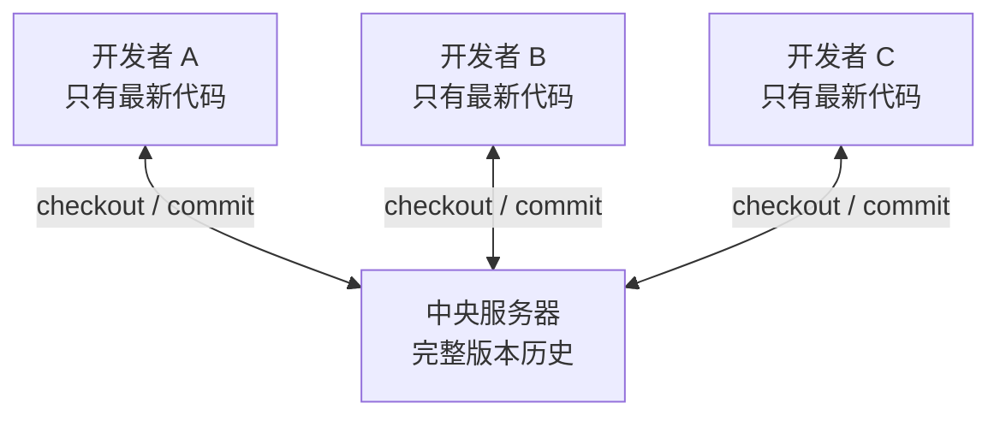
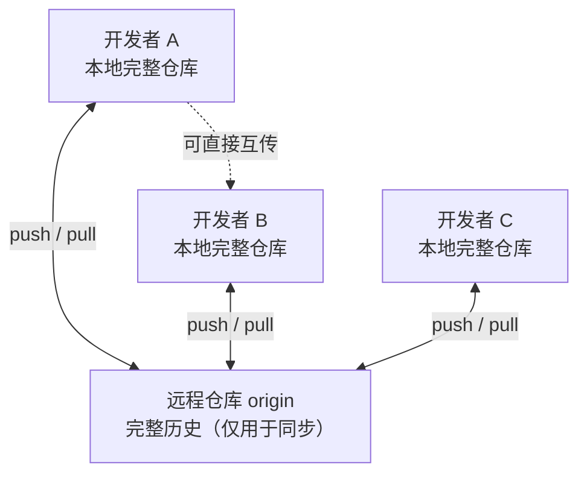
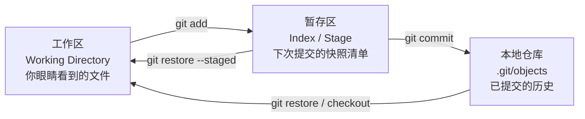

# 01 — Git 概述 + 核心概念 + 基础命令

> 建立 Git 的全局认知：它从哪来、解决什么问题、和集中式 VCS 有何本质区别；装好环境并完成第一个仓库的 init → add → commit → log 全流程。

| 项目 | 内容 |
|------|------|
| **本篇定位** | 认知层 —— 全景与起点，后续所有命令的地基 |
| **预计时间** | 45-60 分钟 |
| **面试可答** | Git 与 SVN 的区别、为什么 Git 是分布式的、暂存区存在的意义 |

---

## 🎯 学习目标

- 理解版本控制系统的演进（无 VCS → 集中式 → 分布式）与 Git 的诞生背景
- 掌握 Git 与 SVN 的核心区别（面试常问）
- 完成 Git 安装与必要配置（用户名、默认分支、凭据方式）
- 理解「工作区 / 暂存区 / 本地仓库」三区模型的最小可用版本
- 熟练使用 `init` / `clone` / `status` / `add` / `commit` / `diff` / `log` 完成日常提交
- 会编写 `.gitignore` 排除依赖目录与敏感文件

---

## 1. Git 是什么

### 1.1 版本控制的演进

**阶段一：无版本控制（手动备份）**

靠 `project_final_v2_真的最终版.zip` 管理版本。问题：无法追溯某一行是谁改的、无法多人协作、误删无法恢复。

**阶段二：集中式 VCS（CVS / SVN，2000 年代主流）**

存在一台中央服务器保存完整历史，开发者从服务器 checkout 代码、改完 commit 回去。



致命缺陷：

| 问题 | 说明 |
|------|------|
| 单点故障 | 服务器宕机 = 全员停工，服务器丢数据 = 历史全没 |
| 离线无法工作 | 提交、看历史、建分支都必须联网 |
| 分支昂贵 | SVN 的分支就是一次目录拷贝，合并痛苦，团队倾向于不用分支 |

**阶段三：分布式 VCS（Git / Mercurial，2005 至今）**

2005 年，Linux 内核团队与商业工具 BitKeeper 的合作破裂，Linus Torvalds 用两周写出了 Git。核心思想：**每个开发者的本地都有一份完整仓库**（含全部历史）。



这带来三个质变：

1. **离线可用**：提交、建分支、看历史、diff 全部本地完成，只在同步时才需要网络
2. **无单点故障**：任何一份本地仓库都包含完整历史，可用于恢复
3. **分支廉价**：Git 的分支只是一个指向提交的指针（40 字节），创建与切换近乎零成本，由此催生了「功能分支」开发模式

### 1.2 Git 的设计原则

| 原则 | 体现 |
|------|------|
| 内容为王 | 一切按内容哈希寻址，文件内容相同则只存一份 |
| 历史不可变 | 提交一旦产生永不修改，「改历史」实质是创建新提交替换旧引用 |
| 本地优先 | 95% 的操作不需要网络 |
| 一切可追溯 | 只要提交过（甚至暂存过），几乎都能通过 reflog 找回（详见 [05 篇](./05-git-undo-rescue.md)） |

---

## 2. 安装与配置

### 2.1 安装

```bash
# macOS（Homebrew，brew 安装的版本通常比系统自带的新）
brew install git

# Ubuntu / Debian
sudo apt install git

# CentOS / RHEL
sudo yum install git
```

```bash
# 验证安装
git --version
# 输出示例：git version 2.55.0
```

> 本教程以 Git ≥ 2.30 为基线（当前稳定版为 2.55，2026-06 发布）。低于 2.23 的旧版本没有 `git switch` / `git restore` 命令，请先升级。

### 2.2 三级配置体系

Git 配置分三级，优先级从高到低：

| 级别 | 参数 | 文件位置 | 作用范围 |
|------|------|---------|---------|
| local | `--local`（默认） | `<仓库>/.git/config` | 仅当前仓库 |
| global | `--global` | `~/.gitconfig` | 当前用户所有仓库 |
| system | `--system` | `/etc/gitconfig`（Linux） | 全机器 |

```bash
# 查看全部生效配置及来源
git config -l --show-origin

# 查看单项
git config user.name
```

### 2.3 必做配置

```bash
# 1. 身份标识（每次提交都会记录，必填）
git config --global user.name "你的名字"
git config --global user.email "you@example.com"

# 2. 默认分支名设为 main（Git 3.0 起将成为内置默认值）
git config --global init.defaultBranch main

# 3. 常用别名（可选，提升效率）
git config --global alias.st status
git config --global alias.co checkout
git config --global alias.lg "log --oneline --graph --decorate --all"

# 4. pull 默认使用 rebase（避免产生无意义的 merge 提交，团队协作推荐）
git config --global pull.rebase true
```

### 2.4 远程仓库凭据：SSH vs HTTPS

GitHub 自 2021-08 起不再接受账户密码的 HTTPS 认证，只剩两条路：

| 方式 | 配置 | 适用 |
|------|------|------|
| **SSH**（推荐） | 本地生成密钥对，公钥贴到 GitHub | 个人设备，一次配置长期有效 |
| **HTTPS + PAT** | 用 Personal Access Token 代替密码，可交给凭据管理器缓存 | 临时设备、公司网络封锁 22 端口 |

```bash
# SSH 密钥生成（ed25519 为现代推荐算法）
ssh-keygen -t ed25519 -C "you@example.com"

# 查看公钥，复制到 GitHub → Settings → SSH Keys
cat ~/.ssh/id_ed25519.pub

# 测试连通性
ssh -T git@github.com
# 成功输出：Hi <username>! You've successfully authenticated...
```

---

## 3. 获取仓库：init 与 clone

### 3.1 从零创建：git init

```bash
mkdir git-playground && cd git-playground
git init
# 输出：Initialized empty Git repository in .../git-playground/.git/
```

`git init` 做的唯一一件事：创建 `.git/` 目录。**这个目录就是仓库本体**——对象库、引用、配置全在里面；删掉它，工作区文件还在，但历史全没。

```bash
ls -a .git
# objects/   ← 对象库：所有提交、文件内容存这里（02 篇详解）
# refs/      ← 引用：分支和 tag 的指针存这里
# HEAD       ← 当前所在位置的指针
# config     ← 本仓库的 local 配置
```

### 3.2 克隆已有仓库：git clone

```bash
# 克隆远程仓库（SSH 协议）
git clone git@github.com:用户名/kb-vault.git

# 克隆时直接指定分支与目录名
git clone -b dev --single-branch git@github.com:用户名/kb-vault.git my-vault
```

注意与 SVN 的本质区别：`git clone` 拉下来的是**完整历史**，不是「最新代码快照」。即使远程服务器被删，你手里的克隆也能直接当服务器用。

```bash
cd kb-vault
git log --oneline | head -5   # 本地即可查看全部历史，无需联网
```

---

## 4. 核心概念：三区模型（最小可用版）

日常使用 Git，只需要先建立三区的心智模型（对象级原理在 [02 篇](./02-git-internals-model.md) 展开）：



| 区 | 位置 | 回答的问题 |
|----|------|-----------|
| 工作区 | 项目目录里除 `.git/` 外的所有文件 | 「我现在在改什么」 |
| 暂存区 | `.git/index` 文件 | 「我下次 commit 打算包含哪些改动」 |
| 本地仓库 | `.git/objects` + 引用 | 「已经固化成历史的快照」 |

**为什么要有暂存区**（面试常问）：

1. **部分提交**：改了 10 个文件，只想把其中 3 个相关文件的改动归为一个提交
2. **组织提交语义**：一个提交应该是一个完整的逻辑变更，暂存区是「打包前的分拣台」
3. **解耦**：工作区可以继续改下一批内容，不影响正在准备的提交

---

## 5. 基础工作流命令

### 5.1 git status —— 随时看当前状态

```bash
git status
# On branch main
# Changes not staged for commit:    ← 工作区有改动，未进暂存区
# Untracked files:                  ← 新文件，Git 还不认识
```

```bash
git status -s        # 简洁模式，适合高频查看
#  M README.md       ← 已修改未暂存（M 在右列）
# M  index.ts        ← 已暂存（M 在左列）
# ?? new-file.txt    ← 未跟踪
```

### 5.2 git add —— 把改动放进暂存区

```bash
git add README.md        # 暂存单个文件
git add src/             # 暂存整个目录
git add -A               # 暂存所有改动（新增 + 修改 + 删除）
git add -p               # 逐块（hunk）挑选，实现「一个文件只提交一半」
```

> `git add` 的名字有误导性：对已跟踪文件，它实际是「把最新内容同步进暂存区」，并非只在新增时使用。

### 5.3 git commit —— 生成一次提交

```bash
git commit -m "feat: 新增用户登录接口"

# 跳过暂存区：直接把所有已跟踪文件的修改提交（不含新文件）
git commit -am "fix: 修正登录超时判断"

# 打开编辑器写多行提交信息
git commit
```

提交信息规范（本仓库采用约定式提交）：

```
feat: 新增 xxx 功能
fix: 修正 xxx 问题
docs: 文档更新
refactor: 重构（不改变行为）
chore: 维护性操作
```

### 5.4 git diff —— 看清改动内容

`git diff` 的三个常用视角正好对应三区之间的比较：

```bash
git diff                # 工作区 vs 暂存区（还没 add 的改动）
git diff --staged       # 暂存区 vs 最新提交（add 了但没 commit 的改动）
git diff HEAD           # 工作区 vs 最新提交（所有未提交的改动）
```

### 5.5 git log —— 查看历史

```bash
git log                                  # 完整日志
git log --oneline                        # 每个提交一行（短哈希 + 消息）
git log --oneline --graph --decorate     # 带分支拓扑图
git log -p -2                            # 最近 2 个提交的完整 diff
git log --stat                           # 每个提交的文件变更统计
git log -- src/config.ts                 # 只看某文件的变更史
```

```bash
# 推荐的日常查看姿势（即 2.3 中配置的 git lg 别名）
git log --oneline --graph --decorate --all
# * a1b2c3d (HEAD -> main) feat: 新增用户登录接口
# * 9f8e7d6 docs: 初始化项目说明
```

### 5.6 git rm / git mv —— 删除与重命名

```bash
git rm old-file.txt          # 从工作区和暂存区同时删除
git rm --cached secret.env   # 只移出 Git 跟踪，保留本地文件
                             # （配合 .gitignore 处理「误提交的敏感文件」的第一步）
git mv old.ts new.ts         # 重命名 = rm + add；Git 不显式存储重命名，
                             # 而是在 diff/log 时按内容相似度检测（-M / --follow）
```

---

## 6. .gitignore —— 排除不该跟踪的文件

规则写在仓库根目录的 `.gitignore`：

```gitignore
# 依赖目录
node_modules/

# 构建产物
dist/
build/

# 环境变量与敏感文件（绝不提交）
.env
.env.local

# 编辑器与系统文件
.vscode/
.DS_Store

# 日志
*.log
```

**语法速记**：

| 模式 | 含义 |
|------|------|
| `node_modules/` | 结尾 `/` 表示目录 |
| `*.log` | `*` 匹配任意字符（不含 `/`） |
| `**/cache` | `**` 匹配任意层级目录 |
| `!important.log` | `!` 取反：例外不忽略 |

两个高频坑：

```bash
# 坑 1：已被跟踪的文件，加进 .gitignore 不生效，需先取消跟踪
git rm --cached .env
git commit -m "chore: 停止跟踪 .env"

# 坑 2：全局忽略（跨仓库生效，如 .DS_Store）
git config --global core.excludesfile ~/.gitignore_global
```

---

## 🎯 实战：从零到第三个提交

在 `git-playground` 演练仓库中完成完整流程：

```bash
# 1. 初始化仓库
mkdir git-playground && cd git-playground
git init

# 2. 配置 .gitignore
echo "node_modules/" > .gitignore
echo ".env" >> .gitignore

# 3. 创建第一个文件并提交
echo "# Git Playground" > README.md
git status                          # README.md 应显示为 Untracked
git add README.md
git status                          # README.md 应进入 Changes to be committed
git commit -m "docs: 初始化项目"

# 4. 修改 + 新增，一次提交两个文件
echo "console.log('hello')" > index.js
echo "## 用法" >> README.md
git add -A
git status -s                       # 应看到 M README.md 和 A index.js
git commit -m "feat: 新增入口文件"

# 5. 体会暂存区的分拣作用：只提交 README，不提交 index.js
echo "more" >> README.md
echo "console.log('wip')" >> index.js
git add README.md                   # 只暂存 README
git diff --staged                   # 确认暂存区里只有 README 的改动
git commit -m "docs: 补充用法说明"  # index.js 的改动留在工作区

# 6. 查看三步历史
git log --oneline --graph --decorate
# 预期输出（哈希不同）：
# * xxxxxxx (HEAD -> main) docs: 补充用法说明
# * xxxxxxx feat: 新增入口文件
# * xxxxxxx docs: 初始化项目
```

---

## 🏋️ 练习

### 练习 1：验证 .gitignore 的「已跟踪文件」陷阱

- **要求**：先提交一个 `.env` 文件，再把它写进 `.gitignore`，修改内容后执行 `git status`，观察并解释现象；然后取消跟踪并验证修复。
- **提示**：`.gitignore` 只拦截「未跟踪文件」，对已进入 Git 的文件无效；用 `git rm --cached`。
- **预期效果**：修复后修改 `.env` 不再出现在 `git status` 中，且本地文件仍在。

### 练习 2：用 `git add -p` 拆分一个文件的改动

- **要求**：对同一个文件做两处不相关的修改，用 `git add -p` 只暂存其中一处，分两次提交。
- **提示**：交互界面中 `y` = 暂存该块，`n` = 跳过，`s` = 把块拆得更小。
- **预期效果**：`git log -p -2` 显示两个提交各含一处修改。

### 练习 3：读懂 `git status -s` 的两列状态

- **要求**：构造出 `M `（已暂存）、` M`（未暂存）、`MM`（暂存后又改）、`??`（未跟踪）四种状态各一个文件。
- **提示**：左列 = 暂存区状态，右列 = 工作区状态；`MM` 需要 add 之后再改。
- **预期效果**：`git status -s` 同时显示四种状态，并能逐条解释含义。

---

## 🆚 对比板块：Git vs SVN vs 无版本控制

| 维度 | 无 VCS | SVN（集中式） | Git（分布式） |
|------|--------|--------------|--------------|
| 历史存放 | 无 | 仅中央服务器 | 每个本地仓库都有完整历史 |
| 离线提交 | — | ❌ | ✅ |
| 单点故障 | — | 有 | 无（任一副本可恢复） |
| 分支成本 | — | 高（目录拷贝） | 极低（移动指针） |
| 提交完整性 | — | 自增版本号（r12345） | 内容哈希（SHA-1），内容变则哈希变 |
| 典型代表 | 手动 zip | SVN、CVS、Perforce | Git、Mercurial |
| 适用场景 | — | 需要强中心管控、超大单文件（游戏美术资产） | 绝大多数软件项目的事实标准 |

> 追问预警：面试官问「SVN 一无是处吗」时，答两点即可——SVN 的线性版本号对非技术人员更友好，且对频繁变更的二进制大文件（美术资源）管理更省空间；但软件工程场景 Git 是绝对主流。

---

## ❓ 面试问答

### Q1：Git 和 SVN 的核心区别是什么？

- Git 是**分布式**的：每个本地都有完整历史，离线可提交/建分支/看日志；SVN 是集中式的，一切依赖中央服务器
- Git 分支是指针（近乎零成本），SVN 分支是目录拷贝（昂贵），这直接导致两者协作模式不同
- Git 按内容哈希（SHA-1）标识提交，SVN 是自增版本号
- 追问「SVN 还有用吗」：超大二进制资产（游戏美术）、强中心审批场景仍有一席之地

### Q2：为什么 Git 要有暂存区（Index）？直接 commit 不行吗？

- 暂存区让你能**组织提交**：10 个文件的改动可以拆成 3 个语义完整的提交
- 支持 `git add -p` 逐块挑选，实现文件级的部分提交
- 提交前有一个「待打包清单」，commit 只拍暂存区的快照，工作区可以继续改别的
- 延伸：这也是 `git diff` 与 `git diff --staged` 输出不同的原因

### Q3：`git clone` 之后本地有什么？断网还能工作吗？

- 本地有**完整仓库**：全部提交历史、所有分支、tag，不只是最新代码
- 断网可正常 commit、建分支、merge、看 log、diff；只有 push/pull/fetch 需要网络
- 这正是分布式的容灾价值：任何一份克隆都可作为恢复源

---

## ✅ 自检清单

- [ ] 能说出集中式 VCS 的三个致命缺陷，以及 Git 如何逐一解决
- [ ] 能画出三区流转图，并说出 add / commit / restore 各移动了什么
- [ ] 完成 user.name / user.email / init.defaultBranch 配置
- [ ] 能解释「为什么暂存区存在」并演示 `git add -p`
- [ ] 熟练使用 `status` / `diff` / `diff --staged` / `log --oneline --graph`
- [ ] 知道 `.gitignore` 对已跟踪文件无效，以及正确的解除跟踪姿势
- [ ] 演练仓库中有 3 个以上语义完整的提交

---

## 🔗 相关文档

- 下一篇：[02 - 三区 + 对象模型 + 引用（心智模型）](./02-git-internals-model.md)
- 大纲：[Git 学习大纲](../git-learning-outline.md)
- 关联模块：[CI/CD 学习大纲](../../ci/ci-learning-outline.md)（Git 是其前置）
- [Git 官方文档](https://git-scm.com/doc)
- [Pro Git 中文版（免费在线）](https://git-scm.com/book/zh/v2)

---

*最后更新：2026年8月*
