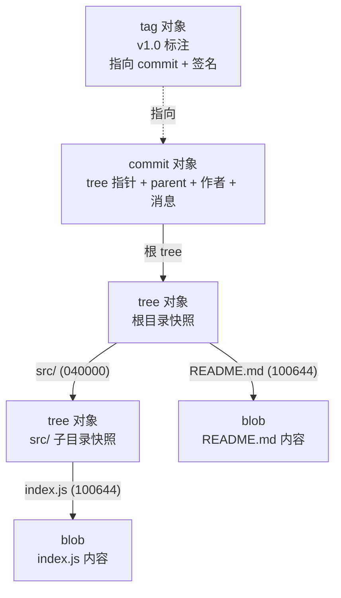
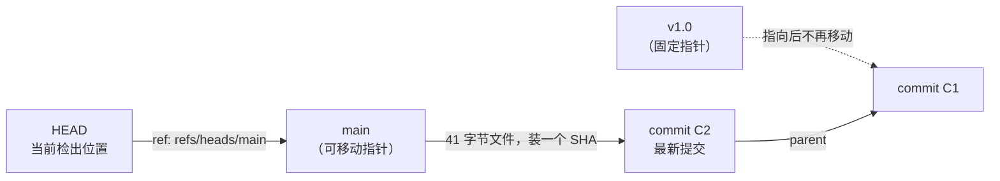

# 02 — 三区 + 对象模型 + 引用（心智模型）

> 打开 `.git/` 的黑盒：Git 本质上是一个「内容寻址的对象数据库 + 一层会移动的指针」。掌握「三区 + 四种对象 + 引用链」这套心智模型后，任何 Git 命令的行为都能被推导，而不是被背诵。

| 项目 | 内容 |
|------|------|
| **本篇定位** | 核心层 —— 心智模型，后续所有命令行为的推导基础 |
| **预计时间** | 60-75 分钟 |
| **面试可答** | HEAD 是什么、detached HEAD 怎么处理、blob/tree/commit 如何组织、Git 为什么内容寻址 |

---

## 🎯 学习目标

- 说清 `.git/` 目录每个关键条目（objects / refs / HEAD / index / config）的职责
- 理解 blob / tree / commit / tag 四种对象的组织方式，能用 `git cat-file` 亲手验证
- 理解内容寻址（SHA-1）的含义：相同内容只存一份、内容变则哈希变
- 理解三层引用链：HEAD → 分支指针 → 提交对象，知道 `refs/heads/xxx` 文件里装的就是一个 SHA
- 能从模型推导出 commit / switch / reset 等命令的本质，解释 Git 为什么快
- 会使用 `rev-parse` / `cat-file` / `ls-files` / `hash-object` 等 plumbing 命令观察底层状态
- 知道 detached HEAD 如何产生、风险在哪、如何用 `git switch -c` 抢救
- 知道 loose object 与 packfile 的关系，会用 `git count-objects -v` 观察 GC 前后变化

> 前置：01 篇已建立三区最小模型并完成 init → add → commit → log 流程，本篇不再复述基础命令，直接下钻到对象层。

---

## 1. .git 目录：仓库本体解剖

01 篇说过：`git init` 唯一做的事就是创建 `.git/` 目录。**这个目录就是仓库本体**，工作区文件只是某个对象快照的展开视图。

```bash
cd git-playground          # 沿用 01 篇的演练仓库
ls .git
# branches/  hooks/  info/  objects/  refs/  HEAD  config  description  index
```

目录树与各条目职责：

```text
.git/
├── objects/            ← 对象库：blob/tree/commit/tag 全部存这里（第 2 节详解）
│   ├── <前2位>/        ←   loose object，文件名 = SHA 后 38 位
│   ├── pack/           ←   packfile：gc 后的压缩打包存储（第 8 节）
│   └── info/           ←   对象库元信息
├── refs/               ← 引用层（第 4 节详解）
│   ├── heads/          ←   本地分支：每个文件内容就是一个 commit SHA
│   ├── tags/           ←   tag：每个文件内容就是一个 SHA
│   └── remotes/        ←   远程跟踪分支（clone/fetch 后出现，04 篇展开）
├── HEAD                ← 当前检出位置的指针（通常是 symbolic ref，第 4 节详解）
├── index               ← 暂存区：二进制文件，存下次提交的快照清单（第 6 节可查）
├── config              ← 本仓库的 local 级配置
├── hooks/              ← 钩子脚本目录（自带 .sample 示例，06 篇展开）
└── info/exclude        ← 仓库级忽略规则（不进版本控制、不想共享的 .gitignore）
```

两点关键认知：

1. **objects 存「内容」，refs 存「名字」**：对象库里的东西没有名字，只有 SHA；分支名、tag 名全部活在 refs 这一层。「删除分支」删的只是 refs 下的一个 41 字节文件，对象一个都没动。
2. **index 是二进制文件不是目录**：暂存区没有独立目录，就是 `.git/index` 这一个文件，`git add` 的本质就是重写它。

---

## 2. 四种对象：Git 数据库里只有这些东西

Git 的核心是一个极简的键值数据库：**值 = 数据内容，键 = 内容的 SHA 哈希**。往库里写的对象只有四种：

| 对象类型 | 存什么 | 类比 |
|---------|--------|------|
| blob | 文件内容（不含文件名！） | 文件系统里的「数据块」 |
| tree | 一个目录快照：文件名 → blob / 子 tree 的映射 | 文件系统里的「目录项」 |
| commit | 指向一个根 tree + 父提交 + 作者 + 时间 + 消息 | 一次快照的「元数据封面」 |
| tag | 指向某个 commit 的标注（可含 GPG 签名） | 给提交贴的「便利贴 / 钢印」 |

对象间的组织关系（tag 独立挂在 commit 上，不参与树状结构）：



三个值得记住的细节：

- **blob 不含文件名**：文件名记在 tree 里。所以「重命名文件」在对象层面零成本——Git 甚至不存储重命名，diff/log 时靠内容相似度检测（`-M`）。
- **commit 不存 diff**：每个 commit 指向的 tree 都是一份**完整快照**。「Git 只存增量」是流传最广的误解，diff 是查询时现算的。
- **commit 之间靠 parent 串成 DAG**：每个 commit 记录 0 个或多个父提交 SHA，历史因此是一张有向无环图，而不是一条线。

### 2.1 动手验证：git cat-file 逐层拆开

在 01 篇已提交 3 个提交的 `git-playground` 仓库里（假设当前在 `main`）：

```bash
# 查看 HEAD 所指的 commit 对象的类型与原始内容
git cat-file -t HEAD
# 输出：commit
git cat-file -p HEAD
# 输出：
# tree 9c1d2e3f...          ← 指向根 tree 对象
# parent 8b7a6c5d...         ← 父提交（第一个提交没有这一行）
# author You <you@example.com> 1754899200 +0800
# committer You <you@example.com> 1754899200 +0800
#
# docs: 补充用法说明           ← 空行之后是提交消息

# 顺着 tree 指针继续拆：根目录快照
git cat-file -p HEAD^{tree}
# 输出：
# 040000 tree 4b825dc6...   src          ← 子目录是一个 tree
# 100644 blob e69de29b...   README.md    ← 文件指向一个 blob

# 再拆一个 blob：文件内容本体
git cat-file -p HEAD:README.md
# 输出：README.md 当时的完整文本
```

`-t` 看类型、`-p` 按内容友好打印、`HEAD:路径` 表示「HEAD 提交快照里的某个路径」——这三个姿势贯穿本篇所有实验。

### 2.2 loose object 的存储路径

未打包的对象叫 loose object，直接以 zlib 压缩文件落盘，路径规则是 **`.git/objects/<SHA 前 2 位>/<SHA 后 38 位>`**：

```bash
SHA=$(git rev-parse HEAD)
ls .git/objects/${SHA:0:2}/${SHA:2}
# 输出：3f2a8b1c9d4e5f60718293a4b5c6d7e8f9012345（去掉前 2 位剩下的部分）
```

前 2 位当目录名只是为了避免单目录文件过多，没有任何语义——这就是为什么所有命令里短哈希至少 4 位。

---

## 3. 内容寻址：为什么 Git 几乎不浪费空间

「内容寻址」（content-addressable）= **对象的键不是分配出来的 ID，而是内容本身的 SHA-1 哈希**。推论有三：

1. **相同内容全局只存一份**：两个文件内容相同 → 哈希相同 → 同一个 blob
2. **内容变则哈希变**：篡改任何一个字节，哈希立刻不同，完整性校验天然内置
3. **对象不可变**：对象写入后永不修改（改不了，一改哈希就变了）；「修改提交」的实质是新建对象 + 移动引用

### 3.1 实验：两个文件，同一个 blob

```bash
# 造两个内容完全相同的文件
echo "same content" > a.txt
echo "same content" > b.txt
git add a.txt b.txt

# 暂存区里两个文件各自指向什么
git ls-files -s a.txt b.txt
# 输出（两行的 SHA 完全相同）：
# 100644 6357849182d44f736a8d1c431923a4b5c6d7e8f9 0  a.txt
# 100644 6357849182d44f736a8d1c4b5c6d7e8f90123456 0  b.txt
#        ↑ 同一个 blob SHA：数据库里只存了一份内容

git cat-file -p 63578491
# 输出：same content
```

推论：跨版本也一样——文件在 10 个提交里没动过，这 10 个 tree 全都指向**同一个 blob**，只为它付一次存储。所谓「Git 每次都存完整快照」，存的是指针的完整集合，不是内容的完整拷贝。

### 3.2 SHA-1 与 SHA-256

- 哈希是 40 位十六进制（SHA-1 输出 160 bit），日常显示的 7 位短哈希只是前缀
- SHA-1 的碰撞攻击已被工程实现（2017，Google），但 Git 的对象头部含类型与长度信息，实际攻击面很小；Git 也在持续加固
- 从 **2.29（2020）起 Git 支持实验性的 SHA-256 仓库**：`git init --object-format=sha256`。注意 SHA-1 仓库与 SHA-256 仓库**不能互相转换/互通**，目前仍以 SHA-1 为默认

---

## 4. 引用层：HEAD、分支、tag 都是指针

对象库解决了「内容存哪」，引用层解决「名字怎么找到内容」。三层指针关系：



| 引用 | 本质 | 会不会动 |
|------|------|---------|
| 分支（branch） | `refs/heads/<名>` 文件，内容是一个 commit SHA | 每次 commit 自动前移 |
| tag | `refs/tags/<名>` 文件，内容是一个 SHA | 创建后不动 |
| HEAD | `.git/HEAD` 文件，通常存 `ref: refs/heads/<分支名>` | 切换分支/检出提交时动 |

### 4.1 分支 = 可移动指针

```bash
# 分支在磁盘上就是一个文本文件，内容只有一个 SHA + 换行（41 字节）
cat .git/refs/heads/main
# 输出：3f2a8b1c9d4e5f60718293a4b5c6d7e8f9012345

# plumbing 验证：分支名解析到的就是 HEAD 所指的提交
git rev-parse main
# 输出：与上面完全相同的 SHA
```

这就是 01 篇说「分支廉价」的底层原因：**新建分支 = 写一个 41 字节的文件**，不拷贝任何数据。由此也能推出：`git branch -d` 删分支时如果提示「已合并」，是因为该分支指向的提交已能从别的引用到达，指针删了，对象还在。

### 4.2 tag = 固定指针

```bash
git tag v1.0                     # 轻量 tag：一个 SHA 文件，完事
cat .git/refs/tags/v1.0
# 输出：某个 commit SHA

git tag -a v1.1 -m "首个正式版"   # 附注 tag：额外创建一个 tag 对象（含签名位）
git cat-file -t v1.1
# 输出：tag（而 v1.0 会输出 commit）
```

轻量 tag 就是一个不动的分支；附注 tag 才是「四种对象」里的 tag 对象。发布版本一律用 `-a`。

### 4.3 HEAD = 指向指针的指针

```bash
cat .git/HEAD
# 输出：ref: refs/heads/main
```

HEAD 里存的是**另一个引用的名字**，这种形式叫 symbolic ref（符号引用）。它的语义是「我当前的位置由 main 决定」，所以 main 一前移，HEAD 自动跟上，不需要更新 HEAD 文件。

> 如果 HEAD 里直接装的是 SHA 而不是 `ref: ...`，就是 detached HEAD——第 7 节的主题。

---

## 5. 从模型推导命令本质

有了「对象 + 引用」模型，日常命令不再需要死记：

| 命令 | 本质 | 动了什么 | 没动什么 |
|------|------|---------|---------|
| `git add` | 把文件内容写成 blob，更新 index | objects、`.git/index` | HEAD、工作区 |
| `git commit` | 由 index 生成 tree + commit 对象，**当前分支指针前移** | objects、`refs/heads/当前分支` | 工作区 |
| `git switch <分支>` | 移动 HEAD（改 `.git/HEAD` 指向），再把目标快照铺回工作区 | `.git/HEAD`、工作区、index | 任何对象、任何分支指针 |
| `git reset --hard <提交>` | **移动当前分支指针**到目标提交，同步刷新 index 与工作区 | `refs/heads/当前分支`、index、工作区 | 任何对象（旧提交还在库里） |
| `git branch <名>` | 在某个提交上写一个 41 字节的引用文件 | `refs/heads/<名>` | 其余一切 |
| `git tag v1` | 同上，写在 refs/tags 下且不再移动 | `refs/tags/v1` | 其余一切 |

高频结论：**Git 为什么快**——commit / branch / switch / reset 全是本地「写对象 + 改文本文件」，纯磁盘 I/O，没有网络、没有数据拷贝；**「删除 / 回退」从来不删对象**——reset 只是把指针往回挪，被「丢弃」的提交还躺在 objects 里，reflog 能找回（05 篇展开）。

---

## 6. plumbing 命令速览

Git 命令分两层：**porcelain**（瓷器，给人用的 `commit`/`status`）与 **plumbing**（管道，暴露底层原语）。plumbing 是调试与脚本的利器，也是面试时展示深度的素材：

| 命令 | 作用 |
|------|------|
| `git rev-parse <任意引用>` | 把引用/表达式解析成完整 SHA |
| `git cat-file -t/-p <对象>` | 查看对象类型 / 内容 |
| `git ls-files -s` | 查看暂存区（index）里记录了哪些 blob |
| `git hash-object [-w] <文件>` | 计算内容的 blob SHA；`-w` 直接把对象写进数据库 |
| `git count-objects -v` | 统计 loose object 与 packfile 数量（第 8 节用） |

手动写一个 blob，全程不用 add/commit：

```bash
echo "plumbing demo" > demo.txt
git hash-object demo.txt
# 输出：c424a6dba3b1e0a921bbcd1723eb1dbd745391f3（只计算，不落盘）

git hash-object -w demo.txt
# 输出：c424a6dba3...（-w = 真正写入 .git/objects）

ls .git/objects/c4/24a6dba3b1e0a921bbcd1723eb1dbd745391f3
# 文件确实存在了——一个没有任何 tree/分支指向它的孤儿对象

git cat-file -p c424a6
# 输出：plumbing demo
```

这个孤儿对象没人引用，最终会在 GC 时被清理（第 8 节）。`git add` 在底层做的就是这件事 + 更新 index。

---

## 7. detached HEAD：本篇面试重点

### 7.1 如何产生

当你检出的不是分支名，而是一个**提交 / tag** 时，HEAD 无处可挂（不能把 `ref:` 指向一个 SHA），只好直接装 SHA：

```bash
git log --oneline
# 3f2a8b1 (HEAD -> main) docs: 补充用法说明
# 8b7a6c5 feat: 新增入口文件
# 9c1d2e3 docs: 初始化项目

git switch --detach 8b7a6c5        # 或直接 git checkout 8b7a6c5
# 输出：You are in 'detached HEAD' state...
cat .git/HEAD
# 输出：8b7a6c5d4e3f...            ← 直接是 SHA，不再是 ref: refs/heads/xxx
```

常见触发场景：`git checkout <某个 commit>`、`git checkout v1.0`（检出 tag）、CI 脚本里按 SHA 拉代码。

### 7.2 风险在哪

detached HEAD 本身**不是错误**——只想看看旧版本代码时它完全无害。风险在于：在游离状态下做了新提交，这些提交**没有任何分支指向**；一旦你切回分支，新提交就成了孤儿，只能靠 reflog 找回，且会在 GC 时被永久清除：

```bash
# 游离状态下提交
echo "hotfix" > fix.txt
git add fix.txt && git commit -m "fix: 游离状态下的提交"
# 此时新提交只被 HEAD 直接指着，没有任何分支指向它

git switch main
# 警告：warning: you are leaving 1 commit behind...
# HEAD 回到 main，那个提交失去最后一个直接引用 → 逻辑上「丢失」
```

### 7.3 正确处理

发现自己在 detached HEAD 且有想保留的提交，**先建分支再切走**：

```bash
git switch -c rescue-branch        # 在当前提交上创建分支，HEAD 重新挂上指针
git switch main                    # 现在可以安全离开，提交已被 rescue-branch 保住
git merge rescue-branch            # 或 cherry-pick / rebase 到目标分支（03/05 篇展开）
```

如果已经切走、提交成了孤儿：`git reflog` 找到它的 SHA 再 `git switch -c` 抢救（05 篇详解）。

---

## 8. packfile 与 GC：对象库的自我整理

loose object 是「一个对象一个 zlib 文件」，提交一多，文件数量爆炸（Linux 内核仓库级别的灾难）。Git 的对策：把一批 loose object 压缩打包成 **packfile**（`.git/objects/pack/*.pack` + 索引 `.idx`），打包时还会对相似对象做 delta 压缩。

本篇只需掌握「存在这么一层」以及怎么观察它：

```bash
git count-objects -v
# 关注两行：
# count: 12        ← loose object 数量
# in-pack: 0       ← packfile 中的对象数量

git gc
# 输出：Enumerating objects... done.（把 loose object 收进 packfile）

git count-objects -v
# count: 0         ← loose 清零
# in-pack: 12      ← 全部进了 packfile
```

两个延伸事实：`git gc` 顺带清理无任何引用可达的孤儿对象（detached HEAD 丢失的提交就死在这一步）；打包对上层完全透明，`cat-file` / `rev-parse` 不感知对象在 loose 还是 pack 里，且 Git 会在 `fetch`、loose 过多等时机自动触发 gc，平时不用手动管。

---

## 🎯 实战：用 plumbing 命令解剖一个提交

继续在 `git-playground` 中操作（前提：已完成 01 篇实战，仓库里有 3 个提交、`main` 分支）。目标：不借助任何 porcelain，把最新提交从 SHA 一路拆到文件内容。

```bash
# 1. 从 HEAD 出发拿到当前提交的完整 SHA，存进变量供后续步骤使用
C=$(git rev-parse HEAD)
echo $C
# 3f2a8b1c9d4e5f60718293a4b5c6d7e8f9012345（你的哈希不同）

# 2. 确认引用链：HEAD 是 symbolic ref，分支指针与 $C 一致
cat .git/HEAD
# ref: refs/heads/main
cat .git/refs/heads/main
# 输出与 $C 完全相同：HEAD→main→$C 链条成立

# 3. 打开 commit 对象本体
git cat-file -p $C
# tree 9c1d2e3f...
# parent 8b7a6c5d...
# author ...
# committer ...
#
# docs: 补充用法说明

# 4. 沿 tree 指针拆根目录快照
git cat-file -p $C^{tree}
# 100644 blob e69de29b...  README.md
# 100644 blob 7b8a9c0d...  index.js
# 100644 blob 5f4e3d2c...  .gitignore

# 5. 拆到底：blob 就是文件内容本身
git cat-file -p $C:README.md
# # Git Playground
# ## 用法

# 6. 验证内容寻址：两个同内容文件共享一个 blob
echo dedup > d1.txt
echo dedup > d2.txt
git add d1.txt d2.txt
git ls-files -s d1.txt d2.txt
# 两行输出的 blob SHA 相同 → 数据库只存了一份

# 7. 观察 loose object 的磁盘路径
ls .git/objects/${C:0:2}/
# 能看到以 $C 后 38 位命名的文件（每次 add/commit 都在新增 loose object）

# 8. 打包收尾并清理：d1/d2 只进了暂存区未提交，hard reset 直接抹掉
git gc
git count-objects -v
# count: 0，in-pack: 变成对象总数
git reset --hard HEAD
git status -s
# 无输出（第 6 节的 demo.txt 是未跟踪文件，可手动 rm demo.txt）
```

做完这一串，你应该能不看任何资料说出：一个 `git commit` 在磁盘上到底写了哪些文件、改了哪一行文本。

---

## 🏋️ 练习

### 练习 1：证明 Git 不存 delta

- **要求**：新建一个 500 行的文本文件并提交；随后只改动其中 1 行再提交。比较两次提交对应 blob 的 SHA 与大小，说明 Git 存的是什么。
- **提示**：`git rev-parse HEAD:文件名` 拿 blob SHA，`git cat-file -s <SHA>` 看对象字节数；想一想如果存 delta，blob 大小应该接近 1 行还是 500 行。
- **预期效果**：新 blob 的 SHA 完全不同，且大小仍是完整的 500 行左右——每个 blob 都是全量内容，「增量」只发生在 packfile 打包阶段的 delta 压缩。

### 练习 2：量化「分支是 41 字节的文件」

- **要求**：用 shell 命令查看 `.git/refs/heads/main` 的文件大小；创建新分支 `dev`，观察 refs 目录与 `git branch -v` 的变化；在 `dev` 上提交一次后，对比两个分支文件内容的差异。
- **提示**：`wc -c .git/refs/heads/main`；提交后用 `cat` 分别看两个分支文件。
- **预期效果**：文件大小 41 字节（40 位 SHA + 换行）；新建分支瞬间两文件内容完全相同；`dev` 提交后其文件内容变成新 SHA，`main` 纹丝不动。

### 练习 3：完整演练一次 detached HEAD 事故与抢救

- **要求**：切到倒数第二个提交进入 detached HEAD，新建一个文件并提交；然后不做任何处理直接 `git switch main`，复现「提交丢失」；再用 `git reflog` 找回该提交并用 `git switch -c` 挂上分支。
- **提示**：`git reflog | head -5` 能看到游离提交的 SHA；05 篇会把 reflog 讲透，这里先体会「指针丢了，对象还在」。
- **预期效果**：切回 main 后 `git log` 里看不到那个提交；reflog 能找到它的 SHA；`switch -c` 之后提交重新可见，并能解释它此前「丢失」的原因。

---

## 🆚 对比板块：Git 内容寻址对象模型 vs SVN delta 增量存储

| 维度 | Git（内容寻址对象模型） | SVN（delta 增量存储） |
|------|----------------------|---------------------|
| 存储单元 | blob = 完整文件内容快照，按内容 SHA 寻址 | 基线版本 + 每次变更的 diff（svndiff） |
| 去重机制 | 天然去重：内容相同 → 哈希相同 → 同一个 blob | 无全局去重，同内容文件各存各的 |
| 完整性校验 | SHA 贯穿每个对象，任何一位损坏立即可检出 | 依赖仓库端校验，传输/存储层校验较弱 |
| 分支成本 | 写一个 41 字节引用文件 | 服务端整目录拷贝 |
| 典型代价 | 频繁变更的大二进制文件仓库会膨胀（全量快照不吃 delta） | 大文件场景反而省空间，但分支/离线能力缺失 |

> 追问预警：
>
> - 「Git 每次都存全量，不浪费空间吗？」→ 同内容跨文件、跨版本天然共享同一 blob；且 GC 阶段 packfile 仍会做 delta 压缩，实际占用通常远小于「全量快照」的字面想象。
> - 「那 SVN 的 delta 存储什么时候更优？」→ 单个超大二进制文件被反复小改的场景（如游戏美术资产），delta 只存差异更省空间；这正是部分游戏团队仍用 SVN/Perforce 的原因之一。

---

## ❓ 面试问答

### Q1：HEAD 是什么？detached HEAD 是怎么产生的、怎么处理？

- HEAD 是一个特殊的**符号引用**，通常指向当前分支（`.git/HEAD` 内容为 `ref: refs/heads/main`），语义是「当前检出位置」
- 检出某个具体 commit 或 tag 时，HEAD 没有分支可指，退化为直接存储一个 SHA——这就是 detached HEAD
- 风险：游离状态下的新提交没有分支指向，切走后成为孤儿，GC 时被永久清除
- 正确处理：`git switch -c <新分支>` 把提交挂上分支再离开；已经切走则用 `git reflog` 找回 SHA 再抢救
- 加分句：detached HEAD 本身不是错误，只读浏览旧版本时它是正常工作状态

### Q2：blob / tree / commit 是如何组织的？为什么用内容寻址？

- commit 指向一个根 tree（完整目录快照），tree 条目是「模式 + SHA + 文件名」，指向 blob（文件内容）或子 tree；commit 之间用 parent 串成 DAG；tag 独立挂在 commit 上
- commit 存的是快照不是 diff；blob 不含文件名，文件名归 tree，因此重命名/移动零成本
- 内容寻址（键 = 内容的 SHA-1）的三个收益：同内容全局去重；哈希链自带完整性校验（篡改即哈希失配）；对象天然不可变，并发写入无冲突，历史可信
- 可补充：2.29+ 支持实验性 SHA-256 仓库（`git init --object-format=sha256`）

### Q3：为什么 Git 创建分支几乎零成本？为什么 Git 快？

- 分支只是 `refs/heads/<名>` 下 41 字节的文本文件（一个 SHA），创建分支 = 写文件，不拷贝任何数据；与之对比 SVN 分支是服务端目录拷贝
- commit = 本地写对象 + 更新一个指针文件；switch = 移动 HEAD + 刷新工作区；全程纯本地磁盘操作，无网络、无复制
- 只有 push/fetch 才走网络；这也是「离线可提交、可建分支、可看全部历史」的根源

---

## ✅ 自检清单

- [ ] 能徒手画出 `.git/` 目录结构并说出 objects / refs / HEAD / index 各自职责
- [ ] 能用 `git cat-file -p` 把一个 commit 逐层拆到 blob 内容
- [ ] 能解释内容寻址，并用「两个同内容文件共享一个 blob」的实验证明它
- [ ] 知道 `refs/heads/main` 文件里装的是什么、HEAD 的 symbolic ref 形式长什么样
- [ ] 能从「写对象 + 移指针」推导 commit / switch / reset 的行为
- [ ] 用过 `rev-parse` / `ls-files -s` / `hash-object -w` 中的至少三个
- [ ] 能说清 detached HEAD 的产生、风险与 `git switch -c` 抢救姿势
- [ ] 知道 `git gc` 会把 loose object 收进 packfile，并用 `count-objects -v` 观察过

---

## 🔗 相关文档

- 上一篇：[01 - Git 概述 + 核心概念 + 基础命令](./01-git-overview-basics.md)
- 下一篇：[03 - 分支、merge/rebase 与冲突解决](./03-git-branch-merge-rebase.md)
- 大纲：[Git 学习大纲](../git-learning-outline.md)
- [Pro Git 中文版 —— Git 内部原理](https://git-scm.com/book/zh/v2)（第 10 章，本篇的官方出处）

---

*最后更新：2026年8月*
