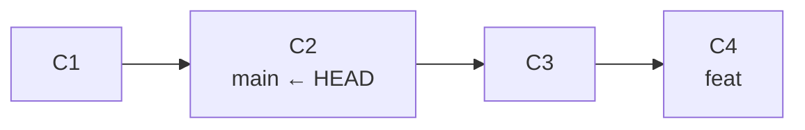
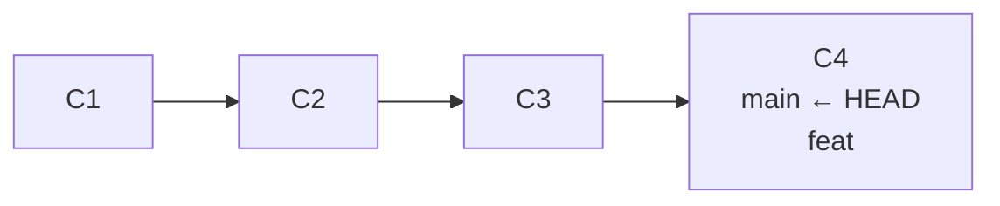
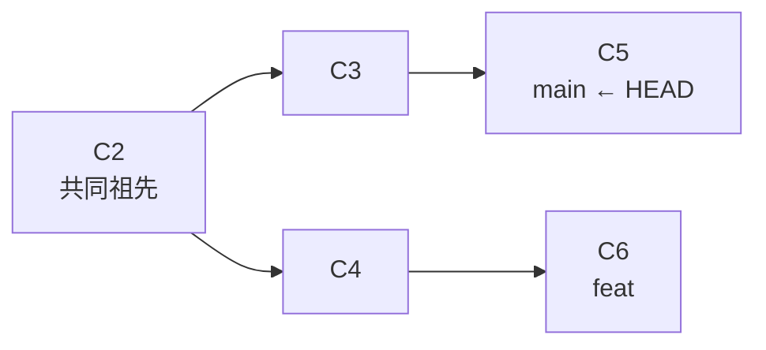
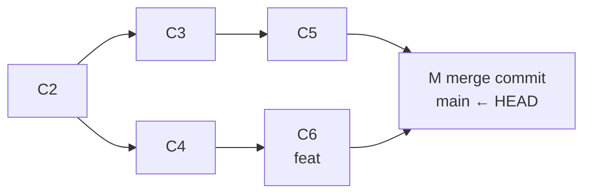
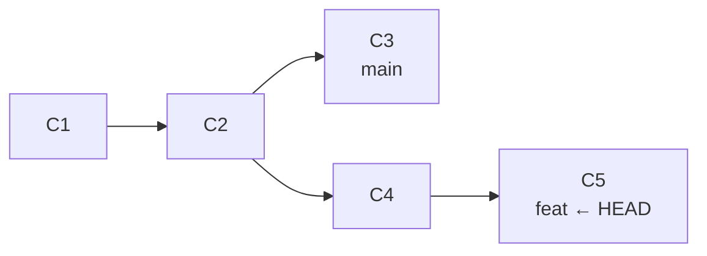
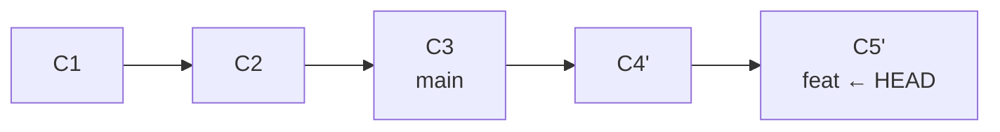

# 03 — 分支、merge/rebase 与冲突解决

> 以 02 篇的「分支 = 可移动指针、HEAD 指向指针」为唯一前置，吃透分支开发与两条整合路线：merge 的 fast-forward 与三方合并、rebase 的复制重放、冲突解决的完整流程，以及 `--no-ff` / `--ff-only` / `--squash` 的工程取舍。

| 项目 | 内容 |
|------|------|
| **本篇定位** | 应用层 —— 分支开发核心技能 |
| **预计时间** | 60 分钟 |
| **面试可答** | merge 与 rebase 的区别与适用场景、fast-forward 是什么、冲突怎么解决 |

---

## 🎯 学习目标

- 用指针模型解释 `branch` / `switch` / `-d` / `-m` 每条命令移动了什么
- 区分 merge 的两条路径（fast-forward vs 三方合并）的触发条件与历史形状
- 掌握 rebase 的「复制重放」原理、黄金法则与正当使用场景
- 独立解决 merge 与 rebase 中的冲突，会用 `--abort` 安全放弃
- 按团队场景选择 `--no-ff` / `--ff-only` / `--squash`
- 用 `git log --graph --all` 观察分支拓扑，用 `--merged` / `--no-merged` 判断分支可否删除

---

## 1. 分支操作：创建、切换、重命名、删除

02 篇已建立模型：**分支只是一个指向提交的指针，HEAD 是指向分支指针的指针**。本篇所有命令都只用这两句话推导。

### 1.1 常用命令

```bash
git branch                 # 列出本地分支，* 标记 HEAD 当前指向的分支
git branch feat            # 创建分支（在 HEAD 所指提交处落一个新指针）
git switch feat            # 切换分支：把 HEAD 改指向 feat 指针
git switch -c feat         # 创建并切换 = git branch feat + git switch feat
git switch -               # 切回上一个分支（类似 cd -）
git branch -d feat         # 删除分支：未合并则拒绝，安全删除
git branch -D feat         # 强制删除 = -d --force，不检查是否合并
git branch -m old new      # 重命名分支指针
git branch -v              # 每个分支 + 其指向的最后一次提交
```

> `git switch` / `git restore` 需要 Git ≥ 2.23（本教程基线 ≥ 2.30，当前稳定版 2.55，2026-06 发布）。旧教程里的 `git checkout <分支>` 等价于 `git switch <分支>`，但 checkout 一身兼多职，现代写法更明确。

### 1.2 指针视角：每条命令移动了什么

| 命令 | 对象库 | 引用层的变化 |
|------|--------|-------------|
| `git branch feat` | 不变 | 新增一个指针 `feat`，指向 HEAD 当前所指的提交；HEAD 本身不动 |
| `git switch feat` | 不变 | HEAD 改指向 `feat`；工作区与暂存区更新为该提交的快照 |
| `git switch -c feat` | 不变 | 上面两步合一 |
| `git branch -d feat` | 不变 | 删除指针文件 `refs/heads/feat`；提交对象不受影响（可达性由其他引用决定） |
| `git branch -m old new` | 不变 | 指针改名，指向的提交完全不变 |

两个细节：

```bash
# -d 的保护逻辑：只允许删除「已并入当前分支（或其上游）」的分支
git branch -d feat
# error: The branch 'feat' is not fully merged.   ← 有未合并提交时拒绝

# -D 强删后提交并没有消失：对象还在，可通过 reflog 找回（详见 05 篇）
git branch -D feat
```

---

## 2. merge：两条整合路径

`git merge feat`（站在 main 上）的行为取决于**两条分支是否分叉**，只有两种可能。

### 2.1 fast-forward：无分叉，直接移动指针

**触发条件**：当前分支（main）是源分支（feat）的祖先——即 main 自分出 feat 后没有新提交。此时无需任何合并计算，Git 直接把 main 指针**前移**到 feat 的位置。

**合并前**（feat 从 C2 分出并前进了两步，main 停在 C2）：



**合并后**（main 指针被移动到 C4，没有产生任何新提交）：



```bash
git switch main
git merge feat
# Updating 9f8e7d6..a1b2c3d
# Fast-forward                      ← 输出中出现这个词 = 只移动了指针
```

特点：历史完全线性、零新增提交；代价是**看不出这些提交曾经属于一条独立分支**。

### 2.2 三方合并：有分叉，生成 merge commit

**触发条件**：两条分支各自都有新提交，谁也回不到谁的路径上。Git 无法简单移动指针，于是：

1. 找到两条分支的**最近共同祖先**（`git merge-base main feat` 可直接查看）
2. 做三方 diff：base vs main（ours）、base vs feat（theirs）
3. 自动合并可合并的部分，生成一个**有两个父提交的 merge commit**

**合并前**：



**合并后**（新增 merge commit M，双亲分别是 C5 与 C6）：



```bash
git merge feat
# Merge made by the 'ort' strategy.   ← 三方合并，产生新提交
```

特点：历史呈菱形，完整保留「这些提交来自哪条分支、何时并入」的信息；代价是多一个 merge commit，频繁合并会让图变得杂乱。

### 2.3 --no-ff：强制保留合并点

fast-forward 可行时，默认行为会「抹掉分支存在过的痕迹」。`--no-ff` 强制生成 merge commit：

```bash
git switch main
git merge --no-ff feat -m "merge: feat/login 功能分支"
# Merge made by the 'ort' strategy.   ← 即使能 ff 也坚持产生 merge commit
```

**为什么发布分支要这么做**：

- **追溯**：`git log --graph` 一眼看出每次发布包含哪条功能分支的提交；CI 也常以 merge commit 作为构建/部署锚点
- **整体回滚**：`git revert -m 1 <merge-commit>` 一次撤销整个功能（ff 合并后没有合并点，做不到）

---

## 3. rebase：把历史拉成直线

### 3.1 原理：复制重放

`git rebase main`（站在 feat 上）做的事：

1. 找出 feat 独有的提交序列（C4、C5）
2. 以 main 的最新提交为新基底，把每个提交的 diff **逐个复制重放**
3. 生成内容相同但**哈希全新**的 C4'、C5'，把 feat 指针移到新链末端

**变基前**：



**变基后**（C4、C5 的原始对象仍在对象库中，成为无引用指向的悬挂提交，GC 前可用 reflog 找回——详见 05 篇）：



```bash
git switch feat
git rebase main
# Successfully rebased and updated refs/heads/feat.
```

**与 merge 的历史形状差异**：同样的变更，merge 留下菱形与合并点；rebase 之后是一条直线，看起来就像所有开发按顺序串行发生——可读性更好，但「分支何时分叉、何时汇合」的信息消失了。

### 3.2 黄金法则：不改已推送的公共历史

> **不要对已推送、且他人可能基于其工作的分支执行 rebase。**

原理层面的解释：rebase 会**重写提交哈希**（C4 → C4'）。如果旧提交已被别人 fetch 走，你再 push 新哈希就会被拒绝，只能 force push；此后每个人的本地历史都与远程分叉，团队协作陷入混乱。若确需在共享分支上整理历史，安全姿势是本地 rebase + `--force-with-lease`（详见 [04 篇](./04-git-remote-collaboration.md)）。

### 3.3 rebase 的正当场景

| 场景 | 说明 |
|------|------|
| 整理本地未推送的分支 | 提交前把散乱的 wip 提交收拾干净（`rebase -i`，详见 [06 篇](./06-git-advanced-toolbox.md)） |
| 保持个人分支线性、PR/MR 更好审 | `git pull --rebase` 避免堆满无意义 merge commit；合入前 rebase 到最新主干，评审者看到干净线性的提交 |

一句话决策：**rebase 管「自己的历史长什么样」，merge 管「大家的代码怎么汇合」。**

---

## 4. 冲突解决

### 4.1 冲突产生的条件

两边**修改了同一文件的同一区域**（同一行或紧邻的行）。不同文件、同文件不同区域的改动 Git 都能自动合并。冲突可能发生在 merge、rebase、cherry-pick 任何「双方改动相遇」的操作中。

### 4.2 冲突标记解读

冲突文件会被写成这样：

```text
<<<<<<< HEAD
main 版本的内容（ours：当前所在分支）
=======
feat 版本的内容（theirs：被合并进来的分支）
>>>>>>> feat
```

- `=======` 上方是 ours、下方是 theirs；解决 = 编辑出最终内容（取一边、取另一边或融合），**删掉全部三行标记**
- ⚠️ rebase 中方向相反：HEAD 一侧是**新基底**（ours），被重放的提交内容在下方（theirs）——这是 rebase 冲突最容易搞反的地方

### 4.3 解决流程

**merge 中**：

```bash
git merge feat
# CONFLICT (content): Merge conflict in app.txt
# Automatic merge failed; fix conflicts and then commit the result.

# 编辑冲突文件，删除标记
git add app.txt          # add 即表示「这个冲突我解决了」
git commit               # 完成 merge commit（消息已预填，直接保存即可）
```

**rebase 中**：

```bash
git rebase main
# CONFLICT (content): Merge conflict in app.txt

# 编辑冲突文件，删除标记
git add app.txt
git rebase --continue    # 继续重放下一个提交
# ⚠️ 不要执行 git commit！rebase 由 Git 自己逐个重放提交，
#    手动 commit 会破坏变基状态
```

rebase 是逐提交重放的：N 个提交可能遇到 N 次冲突，每次都要 add + `--continue`。

### 4.4 两个辅助工具

- `git mergetool`：调起外部三方合并工具（vimdiff、VS Code 等）可视化解决冲突，适合复杂冲突。
- `git rerere`（reuse recorded resolution）：

```bash
git config --global rerere.enabled true
```

开启后 Git 会**记录每次冲突的解法**，下次遇到相同冲突自动套用。对「rebase 一串提交反复撞同一个冲突」的场景极其有用。

### 4.5 放弃操作：随时安全撤退

```bash
git merge --abort        # merge 解到一半不想合了：回到 merge 前状态
git rebase --abort       # rebase 同理：回到变基前的分支位置
```

两个 abort 都依赖操作开始前 Git 记下的原始位置，前提是开始操作前工作区是干净的（没有未提交的混乱改动）。解不出来就 abort，**永远有退路**——这也是演练冲突时应该先学会的第一条命令。

---

## 5. merge 策略选项

```bash
git merge --no-ff feat     # 永远生成 merge commit（2.3 节已讲）
git merge --ff-only feat   # 只允许 fast-forward，否则报错拒绝
git merge --squash feat    # 压缩为一次变更，需手动 commit
```

| 选项 | 行为 | 适用 |
|------|------|------|
| 默认（能 ff 就 ff） | 无分叉移指针，有分叉三方合并 | 个人仓库、无强制规范时 |
| `--no-ff` | 强制生成 merge commit，保留合并点 | 发布分支、需要整段追溯/整体回滚 |
| `--ff-only` | 不能 ff 就直接失败 | CI 门禁、严格线性历史团队：逼你先 rebase 再合 |
| `--squash` | 把源分支全部提交压成暂存区里的一份变更 | PR 合入主干，主干只要一个语义完整的提交 |

`squash` 的完整流程：

```bash
git switch main
git merge --squash feat   # 改动全部进入暂存区，不产生提交
git commit -m "feat: 用户登录（squash 自 feat 分支的 5 个提交）"
```

两个注意点：

- squash 生成的是**全新单提交**，与源分支没有父子关系，`feat` 分支不会被标记为已合并——之后 `git branch -d feat` 会被拒绝，需 `-D` 删除
- squash 后源分支若继续开发，再次合并时 Git 不知道上次已合过，可能重复冲突；因此 squash 适合「分支用完即弃」的流程

---

## 6. 观察历史的辅助命令

```bash
git log --oneline --graph --all
# *   m1n2o3p (HEAD -> main) merge: feat/login 功能分支
# |\
# | * a1b2c3d feat: 登录表单校验
# | * 9f8e7d6 feat: 登录接口
# * | 4d5e6f7 fix: 修正 session 过期时间
# |/
# * c8d9e0f (feat/login) docs: 初始化项目说明
```

`--graph` 画拓扑、`--all` 显示所有分支——**每次 merge / rebase 后都该看一眼**，历史形状是否符合预期是检验操作正确性的最直接手段。

```bash
git branch --merged        # 已并入当前分支的分支 → 通常可安全删除
#   feat/login
# * main                   ← * 标记当前分支，忽略即可

git branch --no-merged     # 还有未合并提交的分支 → -d 会拒绝删除
#   feat/payment
```

---

## 🎯 实战：制造冲突并分别用 merge 与 rebase 整合

在 `git-playground` 中让 main 与 feat 修改同一文件的同一行，先 merge 解决一次，重置后用 rebase 解决一次，最后对比两种历史形状。

```bash
# 0. 准备干净的演练仓库与基线提交
rm -rf git-playground && mkdir git-playground && cd git-playground
git init
echo "line1" > app.txt
git add app.txt
git commit -m "chore: baseline"

# 1. 建 feat 分支并改第 2 行
git switch -c feat
printf 'line1\nfeat was here\n' > app.txt
git add app.txt
git commit -m "feat: 修改第 2 行（feat 侧）"

# 2. 回到 main，改同一行 → 制造分叉
git switch main
printf 'line1\nmain was here\n' > app.txt
git add app.txt
git commit -m "feat: 修改第 2 行（main 侧）"

git log --oneline --graph --all
# * xxxxxxx (HEAD -> main) feat: 修改第 2 行（main 侧）
# | * xxxxxxx (feat) feat: 修改第 2 行（feat 侧）
# |/
# * xxxxxxx chore: baseline
```

**第一回合：用 merge 整合（产生冲突 → 解决 → merge commit）**

```bash
git merge feat
# Auto-merging app.txt
# CONFLICT (content): Merge conflict in app.txt

cat app.txt
# line1
# <<<<<<< HEAD
# main was here
# =======
# feat was here
# >>>>>>> feat

# 手工编辑 app.txt，保留想要的内容并删除三行标记，例如：
printf 'line1\nmain and feat were here\n' > app.txt

git add app.txt            # 标记冲突已解决
git commit -m "merge: 整合 feat，保留双方改动"
# [main xxxxxxx] merge: 整合 feat，保留双方改动

git log --oneline --graph --all
# *   xxxxxxx (HEAD -> main) merge: 整合 feat，保留双方改动
# |\
# | * xxxxxxx (feat) feat: 修改第 2 行（feat 侧）
# * | xxxxxxx feat: 修改第 2 行（main 侧）
# |/
# * xxxxxxx chore: baseline          ← 菱形历史，合并点清晰可见
```

**第二回合：撤销 merge，改用 rebase 整合**

```bash
# 回到 merge 之前的状态（ORIG_HEAD 是 merge 前 Git 记下的位置，详见 05 篇）
git reset --hard ORIG_HEAD
# HEAD is now at xxxxxxx feat: 修改第 2 行（main 侧）

git switch feat
git rebase main
# CONFLICT (content): Merge conflict in app.txt
# error: could not apply xxxxxxx... feat: 修改第 2 行（feat 侧）

printf 'line1\nmain and feat were here\n' > app.txt   # 同样的解法
git add app.txt
git rebase --continue      # 注意：不是 git commit
# Successfully rebased and updated refs/heads/feat.

git switch main
git merge feat             # feat 已在 main 之上，直接 fast-forward
# Fast-forward

git log --oneline --graph --all
# * xxxxxxx (HEAD -> main, feat) feat: 修改第 2 行（feat 侧）
# * xxxxxxx feat: 修改第 2 行（main 侧）
# * xxxxxxx chore: baseline          ← 完全线性，看不出曾经分叉
```

---

## 🏋️ 练习

### 练习 1：验证 fast-forward 与 --no-ff 的历史差异

- **要求**：在演练仓库新建分支提交一次，切回 main（main 不新增提交），分别用默认 `git merge` 与 `git merge --no-ff` 各做一次，用 `git log --oneline --graph --all` 对比形状差异。
- **提示**：第二次演练前先 `git reset --hard ORIG_HEAD` 撤销上一次合并；观察哪种情况出现了 merge commit。
- **预期效果**：默认合并输出 `Fast-forward`、历史无合并点；`--no-ff` 产生带双亲的 merge commit、图上出现菱形。

### 练习 2：rebase --abort 安全撤退演练

- **要求**：复现实战中的分叉场景，在 feat 上执行 `git rebase main` 触发冲突后，不做任何解决直接 `git rebase --abort`，验证分支完全回到变基前。
- **提示**：对比 abort 前后的 `git log --oneline` 与 `git status`；注意 abort 之后**不应**残留 rebase 状态（`.git/rebase-merge/` 目录消失、status 不再提示 rebasing）。
- **预期效果**：HEAD、分支位置、工作区内容与 rebase 前完全一致，能解释「abort 依赖操作开始前记录的原始位置」。

### 练习 3：--squash 后观察「未合并」状态

- **要求**：对一条有 2 个以上提交的分支执行 `git merge --squash` 并手动 commit，然后执行 `git branch --merged`，观察源分支是否出现在列表中。
- **提示**：squash 提交与源分支没有父子关系，Git 的「已合并」判断依赖可达性；思考此时删除源分支该用 `-d` 还是 `-D`。
- **预期效果**：源分支出现在 `--no-merged` 而非 `--merged` 中，`git branch -d` 被拒绝、`-D` 成功。

---

## 🆚 对比板块：merge vs rebase vs squash

| 维度 | merge | rebase | merge --squash |
|------|-------|--------|----------------|
| 历史形状 | 菱形，保留分叉与合并点 | 一条直线，如同串行开发 | 直线 + 单个提交 |
| 是否产生新提交 | ff 无；三方合并产生 1 个 merge commit | 产生 N 个重放提交（哈希全新），无 merge commit | 产生 1 个全新提交，需手动 commit |
| 可追溯性 | 完整：分支来源、合并时机都在 | 提交内容在，但分叉/汇合信息丢失 | 只留整体结果，源分支细节丢失 |
| 风险 | 低：不改动任何已有提交 | 高：重写哈希，禁止用于已推送的公共历史 | 低：不改动已有历史；但源分支再开发会重复冲突 |
| 典型场景 | 主干整合、发布分支、需要整体回滚 | 整理本地个人分支、合入前拉直历史 | PR 合入：主干只收一个语义完整的提交 |

> 追问预警：面试官问「rebase 有什么风险」时，答三点——① 重写提交哈希，对已推送的公共历史 rebase 会让他人本地副本与远程分叉，只能 force push 强行对齐，扰乱协作；② 逐提交重放，一串提交撞同一冲突时要反复解决（可用 rerere 缓解）；③ 丢失合并点，事后追溯「这批提交来自哪条分支」变难。结论句：**rebase 只用于本地未推送、或个人独占的分支**。

---

## ❓ 面试问答

### Q1：merge 和 rebase 的区别？各自适用场景？

- **原理**：merge 找共同祖先做三方合并，产生 merge commit（或 ff 移动指针），不改动任何已有提交；rebase 把提交序列逐个复制重放到新基底，生成哈希全新的提交链
- **历史形状**：merge 保留菱形与合并点（信息完整但略杂）；rebase 拉成直线（干净但丢失分叉信息）
- **风险**：merge 无改写风险；rebase 重写哈希，**黄金法则是不改已推送的公共历史**
- **场景**：主干整合、发布分支用 merge（配 `--no-ff` 保留合并点）；整理本地个人分支、合入前清理历史用 rebase

### Q2：fast-forward 是什么？什么时候该用 --no-ff？

- 当前分支是源分支的祖先（无分叉）时，merge 不产生新提交，**直接把分支指针前移**到源分支末端，输出 `Fast-forward`
- 优点是历史线性零噪音；缺点是看不出「这里曾合入过一条分支」
- `--no-ff` 强制生成 merge commit，用于**发布分支/主干**：保留合并点便于 `git log --graph` 追溯、支持 `git revert -m 1 <merge>` 整体回滚；反向的 `--ff-only` 则禁止三方合并，用于严格线性历史的团队门禁

### Q3：冲突是如何产生的？怎么解决？rebase 冲突与 merge 冲突处理有何差异？

- **产生条件**：两条分支修改了同一文件的同一区域，Git 无法自动决定取舍；不同文件、不同区域都能自动合并
- **解决流程**：打开文件看 `<<<<<<< HEAD / ======= / >>>>>>> branch` 标记，编辑出最终内容并删除标记，`git add` 标记已解决，merge 中 `git commit`、rebase 中 `git rebase --continue`；随时可 `git merge --abort` / `git rebase --abort` 回到操作前
- **差异一**：rebase 中解决后**不能 commit**，必须 `--continue`，提交由 Git 逐个重放生成；手动 commit 会破坏变基状态
- **差异二**：rebase 中 `HEAD` 一侧是新基底（ours），被重放的提交在下方——与 merge 的方向感相反，是最高频的坑
- **差异三**：rebase 逐提交重放，N 个提交可能冲突 N 次（`rerere` 可自动复用解法）；merge 只冲突一次

---

## ✅ 自检清单

- [ ] 能用指针模型解释 `branch` / `switch` / `-d` / `-m` 各移动了什么
- [ ] 能说出 fast-forward 的触发条件，以及它和三方合并的历史形状差异
- [ ] 能解释 rebase 的「复制重放」原理，说出黄金法则及其原理级原因
- [ ] 完整解过一次 merge 冲突和一次 rebase 冲突，知道两者流程差异
- [ ] 知道 `--abort` 随时可撤退，知道 `rerere` 能复用冲突解法
- [ ] 能说出 `--no-ff` / `--ff-only` / `--squash` 各自的行为与适用场景
- [ ] 会用 `git log --oneline --graph --all` 验证每次合并/变基后的历史形状
- [ ] 演练仓库中留下了菱形（merge）与线性（rebase）两份历史可供对比

---

## 🔗 相关文档

- 上一篇：[02 - 三区 + 对象模型 + 引用（心智模型）](./02-git-internals-model.md)
- 下一篇：[04 - 远程仓库与团队协作](./04-git-remote-collaboration.md)
- 大纲：[Git 学习大纲](../git-learning-outline.md)
- [Pro Git 第 3 章：分支（免费在线）](https://git-scm.com/book/zh/v2)

---

*最后更新：2026年8月*
