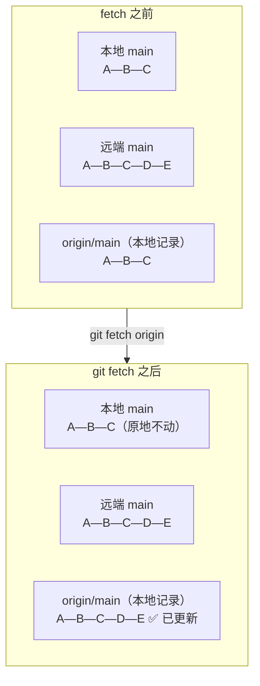
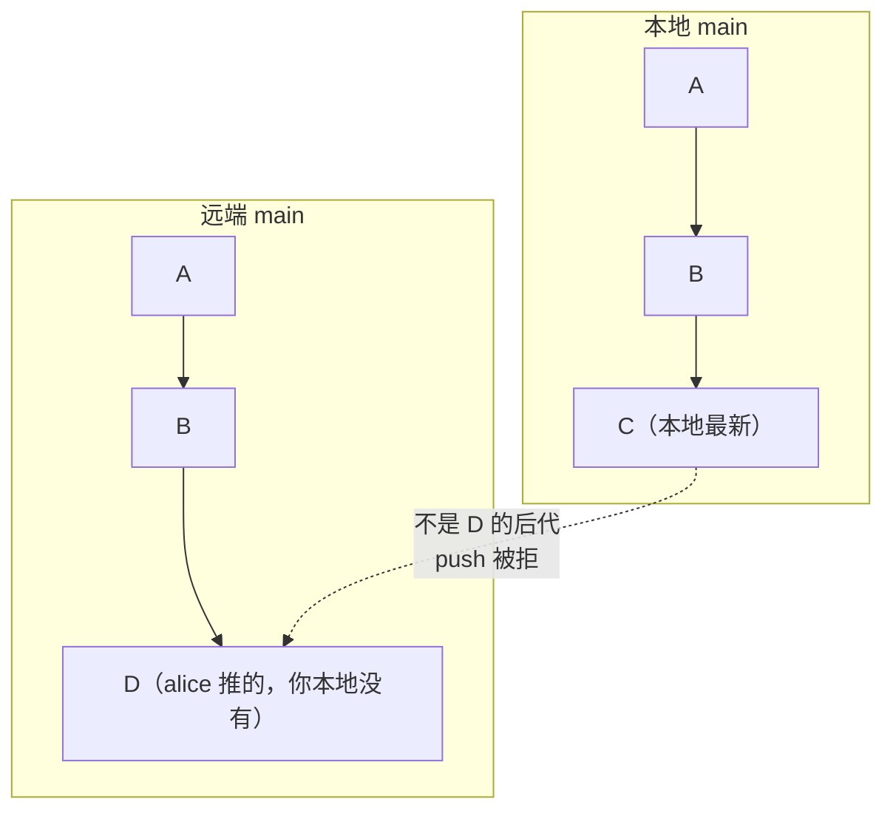
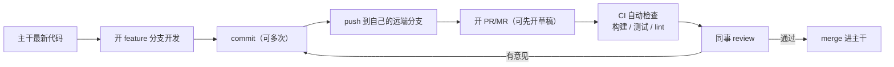

# 04 — 远程仓库与团队协作

> 打通本地与远程的最后一公里：remote 只是别名、fetch 只动引用、pull 是 fetch 加合并、push 被拒的正确姿势、PR/MR 工作流，以及强推时如何不覆盖队友的提交。

| 项目 | 内容 |
|------|------|
| **本篇定位** | 应用层 —— 远程协作核心技能，多人开发的日常主战场 |
| **预计时间** | 60 分钟 |
| **面试可答** | fetch 与 pull 的区别、`pull --rebase` 的意义、什么是 upstream、如何安全强推 |

---

## 🎯 学习目标

- 理解 remote 只是「远程仓库 URL 的别名」，会增删改查多个 remote
- 说清 `fetch` 与 `pull` 的本质区别，知道 `pull` = `fetch` + 合并
- 掌握 tracking branch 与 `-u/--set-upstream`，读懂 `git branch -vv` 的 ahead/behind
- 理解 push 被拒（non-fast-forward）的原因与正确处理流程
- 走通 PR/MR 工作流，分得清 fork 模式与分支模式
- 会用 `--force-with-lease` 安全强推，并知道它的失效边界

> 前置：03 篇已讲完 merge / rebase / 冲突解决，本篇直接使用这两条整合路线，不再重复原理。

---

## 1. remote：远程仓库的别名

### 1.1 origin 只是一个名字

`git clone` 时，Git 默认把来源地址记为 `origin`——它没有任何特殊含义，只是一个**指向 URL 的别名**。真正存地址的地方是仓库的 local 配置文件 `.git/config`：

```bash
git clone git@github.com:alice/demo.git
cd demo
cat .git/config
# [remote "origin"]
#         url = git@github.com:alice/demo.git
#         fetch = +refs/heads/*:refs/remotes/origin/*
```

`fetch` 行是 refspec：fetch 时把远程所有分支（`refs/heads/*`）映射到本地的 remote-tracking 分支（`refs/remotes/origin/*`）。

### 1.2 remote 的增删改查

```bash
# 列出所有 remote 及其 URL（-v 显示 fetch/push 两条地址）
git remote -v
# origin	git@github.com:alice/demo.git (fetch)
# origin	git@github.com:alice/demo.git (push)

git remote add backup git@github.com:alice/demo-backup.git   # 新增
git remote rename backup mirror                               # 重命名
git remote remove mirror                                      # 删除（只删本地记录，不影响远端）
```

### 1.3 一个仓库可以配多个 remote

fork 工作流就是典型场景：`origin` 指向你自己的 fork，`upstream` 指向原仓库：

```bash
git clone git@github.com:你/opensource-lib.git
cd opensource-lib
git remote add upstream git@github.com:原作者/opensource-lib.git
git remote -v
# origin    git@github.com:你/opensource-lib.git (fetch)
# origin    git@github.com:你/opensource-lib.git (push)
# upstream  git@github.com:原作者/opensource-lib.git (fetch)
# upstream  git@github.com:原作者/opensource-lib.git (push)
```

之后 `git fetch upstream` 拉原仓库更新、`git push origin` 推自己的 fork，职责分明（6、7 节会用到）。

---

## 2. fetch：只下载，不动工作区

### 2.1 fetch 前后发生了什么

`git fetch` 做两件事：① 下载本地没有的提交对象；② 更新 **remote-tracking 分支**（如 `origin/main`）。它**不碰你的本地分支，也不碰工作区**：



关键认知：`origin/main` 是**你本地的一份记录**，记录着「上次同步时远端 main 在哪」。fetch 只是把这份记录刷新；远端此刻真正的位置，永远以 fetch 后的 `origin/main` 为准。

### 2.2 观察 remote-tracking 分支

```bash
git fetch origin

# 列出所有 remote-tracking 分支
git branch -r

# 直接查看远端分支的历史（无需切换）
git log origin/main --oneline

# 本地分支与远端记录的差异 = 你落后/领先了什么
git log main..origin/main --oneline     # 远端有、你本地没有的提交
git diff main origin/main               # 内容层面的差异
```

> fetch 是绝对安全的只读操作（对远端只读、对你的工作区也只读）。拿不准要不要 pull 时，先 fetch 看看再决定，是资深工程师的标准姿势。

---

## 3. pull：fetch + 合并，合并方式可选

### 3.1 pull 的拆解

`git pull` 从来不是原子操作，它分两步：

1. `git fetch`：下载并更新 remote-tracking 分支
2. 用一个**合并操作**把远端变更整合进当前分支——默认是 `merge`，也可以配置成 `rebase`

| 姿势 | 等价于 | 历史形状 | 备注 |
|------|--------|---------|------|
| `git pull`（默认） | fetch + merge | 分叉时产生 merge 提交 | 未配置 `pull.rebase` 时的默认行为 |
| `git pull --rebase` | fetch + rebase | 线性，本地提交被搬到远端最新提交之后 | 本次生效，不改配置 |
| `git config --global pull.rebase true` | 之后所有 `git pull` 默认 fetch + rebase | 线性 | 01 篇 2.3 已推荐的全局配置 |

### 3.2 三种姿势怎么选

```bash
# 姿势一：fetch 后手动 merge（最透明，适合初学者与复杂场景）
git fetch origin
git merge origin/main

# 姿势二：一步到位的 merge 式 pull
git pull

# 姿势三：一步到位的 rebase 式 pull（推荐日常使用）
git pull --rebase
```

三者对历史的影响各不相同，见文末对比板块。一个判断原则：**本地还没推送的提交用 rebase 整理成线性；已共享的主干用 merge 保留真实分叉**（配置 `pull.rebase=true` 后仍可用 `git pull --no-rebase` 临时切回 merge）。

---

## 4. tracking branch：本地分支与远端分支的绑定

### 4.1 什么是跟踪关系

本地分支可以与某个远端分支建立「跟踪」（tracking / upstream）关系。建立后：

- `git pull` / `git push` 不带参数时，自动以它为目标
- `git status` / `git branch -vv` 会显示 ahead/behind（领先/落后几个提交）

```bash
git branch -vv
# * main    a1b2c3d [origin/main: ahead 2, behind 1] feat: 新增登录接口
#   dev     9f8e7d6 [origin/dev] fix: 修正超时判断
```

- `ahead 2`：本地有 2 个提交还没推上去
- `behind 1`：远端有 1 个提交你还没拉下来
- `ahead 2, behind 1`：两边分叉了，需要先整合再推送

### 4.2 跟踪关系如何建立

```bash
# clone 时自动建立：本地 main 跟踪 origin/main
git clone <url>

# 远端已有分支，本地想建同名分支跟踪它（现代写法，--track 可省略）
git switch dev                 # 自动匹配 origin/dev 并建立跟踪
git switch -c feat --track origin/feat   # 显式写法：本地名 feat，跟踪 origin/feat

# 本地已有分支，事后补建跟踪关系
git branch --set-upstream-to=origin/main main
```

### 4.3 -u / --set-upstream：push 时顺便绑定

新分支第一次推送时加 `-u`，推送的同时建立跟踪关系，之后的 push/pull 都可以省略参数：

```bash
git switch -c feat-login
git push -u origin feat-login     # = --set-upstream：推送 + 绑定
# 之后直接：
git push
git pull
```

> `-u` 只需要执行一次（每个分支的第一次推送），`git branch -vv` 可随时确认绑定状态。

---

## 5. push：为什么会被拒绝

### 5.1 non-fast-forward：远端有你本地没有的提交

push 的本质是「把本地分支指针移动到远端」。只有当远端分支是本地分支的**祖先**时（即 fast-forward），这一步才能安全完成；否则意味着覆盖别人的提交，Git 直接拒绝：



被拒时的真实输出：

```bash
git push origin main
# ! [rejected]        main -> main (non-fast-forward)
# error: failed to push some refs to '...'
# hint: Updates were rejected because the remote contains work that you do not have locally.
```

### 5.2 被拒后的正确处理：先整合，再推送

```bash
git pull --rebase       # fetch 远端 + 把本地提交 rebase 到远端最新之上
# （若冲突：解决 → git add → git rebase --continue，见 03 篇）
git push origin main    # 此时远端是本地祖先，fast-forward 成功
```

**永远不要**用 `git push --force` 绕过这个拒绝——那不是解决问题，是覆盖队友的提交（见第 7 节）。

### 5.3 push 的两个常用行为

```bash
# push.default 决定「git push 不带参数推什么」
git config --get push.default
# simple  ← Git 2.0+ 默认值：只推当前分支到同名远端分支，且要求名字一致

# 删除远程分支（-d 是 --delete 的简写）
git push origin --delete feat-login
```

---

## 6. PR / MR 工作流

### 6.1 标准闭环

现代团队协作几乎都收敛为同一条流水线：



关键点：

- **分支隔离**：每个改动一条 feature 分支，主干始终可发布
- **CI 守门**：push/PR 事件触发流水线，测试不过不允许合并（见文末关联的 CI 大纲）
- **review 闭环**：评审意见修完后再次 push，PR 自动更新，无需重开
- **草稿 PR（Draft PR）**：改动未完成但想提前让团队看到方向、跑 CI 时使用，标记 Ready 后才进入正式评审

### 6.2 fork 模式 vs 分支模式

| 维度 | 分支模式（同一仓库开分支） | fork 模式（克隆到自己账号） |
|------|---------------------------|---------------------------|
| 写权限 | 对仓库有 push 权限 | 无需原仓库任何权限 |
| 工作流 | 开分支 → push → 开 PR | fork → clone → push 到自己 fork → 跨仓库开 PR |
| 同步主干 | `git pull --rebase origin main` | `git fetch upstream` + rebase（见下） |
| 适用场景 | 团队内部项目 | 开源项目、外部贡献者 |

fork 模式下同步主干的完整动作：

```bash
git fetch upstream                    # 拉原仓库最新
git switch feat-my-change
git rebase upstream/main              # 把自己的提交变基到最新主干之上
git push --force-with-lease origin feat-my-change   # 更新自己 fork 上的 PR 分支
```

---

## 7. 强推：--force-with-lease 是底线

### 7.1 git push --force 的危害

force push 直接用本地指针**覆盖**远端指针。如果远端有你不知道的提交（队友刚推的），它们会被抹掉：远端引用没了，队友的本地分支还指着旧提交，下次 pull 还会推回来——历史彻底混乱，且受害者毫无预警。

**原则：对共享分支（main / dev / 任何别人在用的分支）永远不强推。**

### 7.2 --force-with-lease 的原理

`--force-with-lease` 在强推前做一次校验：**远端分支当前的真实位置，必须与你本地的 remote-tracking 记录（origin/xxx）一致**，否则拒绝推送。

- 一致 = 自你上次 fetch 后没人推过新提交 → 覆盖是安全的
- 不一致 = 有人推过东西，但你还没 fetch 到 → 拒绝，逼你先 fetch 看清现状

```bash
git rebase -i HEAD~3                          # 整理已推送分支的历史（改了提交哈希）
git push --force-with-lease origin feat-login
# 校验 origin/feat-login 与你本地记录一致后才允许覆盖
```

失效边界（追问常考）：lease 保护的是「**你不知道的变化**」。如果你在强推前习惯性 `git fetch` 了一下，本地的 remote-tracking 记录已被刷新，lease 校验会通过——队友在这之间的提交照样被覆盖。所以：**只在自己的 feature 分支上强推，且推之前不做无脑 fetch**。

### 7.3 何时仍要用真 --force

- 误推了含敏感信息的提交，需要**彻底从远端抹掉**（配合 `git filter-repo` 重写历史后强推），事后还要通知所有协作者重新 clone
- 仓库迁移、历史整体重写等一次性运维操作，且已全员协调；即便如此也要先备份远端（临时 tag 或镜像仓库）再动手

---

## 8. 凭据与协议（回顾）

SSH 与 HTTPS+PAT 的选择与配置在 [01 篇 2.4](./01-git-overview-basics.md) 已详讲。协作场景下最常做的只有一件事——切换 remote 的 URL：

```bash
# 查看当前 URL
git remote -v

# HTTPS 切到 SSH（配好密钥后免密推送）
git remote set-url origin git@github.com:alice/demo.git

# 反向切换（公司网络封锁 22 端口时走 HTTPS + PAT）
git remote set-url origin https://github.com/alice/demo.git
```

---

## 🎯 实战：用 bare 仓库在本地模拟远程协作

不依赖 GitHub 网络：`git init --bare` 创建一个只有仓库数据、没有工作区的「裸仓库」充当远程服务器，clone 两份模拟 alice 与 bob 两位开发者：

```bash
# 0. 准备演练目录
mkdir -p ~/code/playground/remote-lab && cd ~/code/playground/remote-lab

# 1. 创建 bare 仓库当「远程服务器」（约定以 .git 结尾）
git init --bare origin.git
# 输出：Initialized empty Git repository in .../remote-lab/origin.git/

# 2. alice 克隆并推送初始提交
git clone origin.git alice
# 输出：warning: You appear to have cloned an empty repository.
cd alice
git config user.name "Alice" && git config user.email "alice@example.com"
echo "# Demo" > README.md
git add README.md && git commit -m "docs: 初始化项目"
git push origin main
# 输出：* [new branch]      main -> main
git branch -vv
# * main xxxxxxx [origin/main] docs: 初始化项目   ← 跟踪关系自动建立

# 3. bob 克隆同一远程并推送
cd ..
git clone origin.git bob
cd bob
git config user.name "Bob" && git config user.email "bob@example.com"
echo "line from bob" >> README.md
git commit -am "feat: bob 的改动"
git push origin main      # 成功：远端是本地祖先，fast-forward
# 输出：To ../origin.git
#        xxxxxxx..xxxxxxx  main -> main

# 4. 制造分叉：alice 推了一个 bob 不知道的提交
cd ../alice
echo "line from alice" >> README.md
git commit -am "feat: alice 的改动"
git push origin main      # alice 成功

# 5. bob 直接 push —— 被拒（复现 5.1 场景）
cd ../bob
echo "bob again" >> README.md
git commit -am "feat: bob 的第二轮改动"
git push origin main
# 输出：
# ! [rejected]        main -> main (non-fast-forward)
# error: failed to push some refs to '.../origin.git'
# hint: Updates were rejected because the remote contains work that you do not have locally.

# 先 fetch 审查远端变化（只读，绝对安全）
git fetch origin
git log main..origin/main --oneline
# xxxxxxx feat: alice 的改动     ← 远端有、本地没有的提交

# 6. bob 正确处理：pull --rebase 后推送
git pull --rebase
# 输出：Successfully rebased and updated refs/heads/main.
git log --oneline --graph
# * xxxxxxx (HEAD -> main) feat: bob 的第二轮改动
# * xxxxxxx feat: alice 的改动
# * xxxxxxx feat: bob 的改动
# * xxxxxxx docs: 初始化项目
git push origin main      # fast-forward 成功

# 7. 演示 --force-with-lease（alice 改写自己的分支历史后强推）
cd ../alice
git reset --hard HEAD~1   # 引用被改写，普通 push 会被拒
git push --force-with-lease origin main
# 输出：+ xxxxxxx...xxxxxxx main -> main (forced update)
# 校验 origin/main 与本地记录一致 → 允许覆盖；
# 若此处用 git push --force，bob 刚推的提交会被无声覆盖 —— 共享分支永不强推
```

---

## 🏋️ 练习

### 练习 1：手动走一遍 fetch + merge，观察 ahead/behind

- **要求**：在实战的 bare 仓库环境中，bob 侧先 `git fetch`（不 pull），用 `git branch -vv` 和 `git log main..origin/main` 确认落后状态，再手动 `git merge origin/main`，观察 ahead/behind 归零。
- **提示**：fetch 后本地分支不会动，`behind` 数字只会在 fetch/pull 之后更新。
- **预期效果**：能解释 `git pull` 被拆成了哪两步，以及每一步分别移动了什么引用。

### 练习 2：给新分支建立跟踪关系

- **要求**：在 alice 仓库 `git switch -c feat-demo`，先直接 `git push` 看报错，再用 `git push -u origin feat-demo` 推送，最后用 `git branch -vv` 验证跟踪关系。
- **提示**：新分支没有 upstream 时，`push.default=simple` 不知道该推去哪。
- **预期效果**：`git branch -vv` 显示 `[origin/feat-demo]`，之后裸 `git push` / `git pull` 可直接使用。

### 练习 3：构造 --force-with-lease 的拦截现场

- **要求**：alice 在 feature 分支上推送后做了 `rebase`（或 reset）改写历史；在强推前，让 bob 向同一远端分支推一个提交；然后 alice 执行 `git push --force-with-lease`，观察被拒绝，fetch 之后再推。
- **提示**：lease 校验的是「远端真实位置 vs 你本地的 remote-tracking 记录」。
- **预期效果**：第一次强推输出 `(stale info)` 类的拒绝信息；能据此讲清 lease 的保护边界与失效场景。

---

## 🆚 对比板块：fetch vs pull(merge) vs pull --rebase

| 维度 | `git fetch` | `git pull`（merge 式） | `git pull --rebase` |
|------|-------------|----------------------|---------------------|
| 本地分支影响 | 只更新 remote-tracking 分支（origin/main），本地分支不动 | 分叉时在当前分支产生 merge 提交 | 把本地未推送的提交重放到远端最新之上，哈希改变 |
| 工作区影响 | 完全不动 | 合并时更新工作区；冲突需手动解决 | 逐个重放时更新工作区；冲突需手动解决（可能多次） |
| 历史形状 | 不改变历史 | 保留真实分叉，多出 merge 节点 | 线性，看不出曾分叉 |
| 适用场景 | 只想看看远端有什么、为后续操作做准备 | 整合共享主干、想保留「何时合并」的痕迹 | 日常同步自己的 feature 分支，保持历史干净 |

> 追问预警：面试官常追问「pull --rebase 有什么风险」——答两点：① 冲突多时需要逐提交解决，比 merge 的一次性解决更繁琐；② 若本地提交已推送并被别人基于其开发，rebase 改哈希等于改写共享历史，必须配合强推，会坑到别人。结论：rebase 只用于**尚未共享**的提交。

---

## ❓ 面试问答

### Q1：`git fetch` 和 `git pull` 的区别？

- `fetch` 只下载提交并更新 remote-tracking 分支（如 `origin/main`），**不碰本地分支和工作区**，是绝对安全的只读操作
- `pull` = `fetch` + 一次合并（默认 merge，可配成 rebase），会直接改当前分支和工作区
- 实践建议：不确定远端变化时先 fetch 审查（`git log main..origin/main`），再决定 merge 还是 rebase

### Q2：`pull --rebase` 解决什么问题？

- 解决的是 `pull` 默认 merge 产生的**无意义 merge 提交**：本地只是落后了几个提交，merge 却造出一个「Merge branch 'main'...」节点，历史变成大量菱形分叉
- 配置 `pull.rebase=true` 后，同步时把本地未推送的提交重放到远端最新之上，历史保持线性，`git log` 干净可读
- 边界：rebase 会改写提交哈希，只应用于**尚未推送共享**的本地提交；共享主干的整合仍用 merge

### Q3：什么是 upstream / tracking branch？如何安全地强推？

- tracking branch 是本地分支与远端分支的绑定关系：`git branch -vv` 显示 `[origin/main: ahead 2, behind 1]`；`git switch -c feat --track origin/feat` 或 `git push -u` 建立绑定；绑定后裸 `git pull` / `git push` 自动找到目标
- 强推安全姿势：永远优先 `git push --force-with-lease`——它校验远端分支的真实位置与你本地的 remote-tracking 记录一致才放行，能拦截「你 fetch 之后别人推的新提交」
- 两条铁律：不对共享分支强推；lease 保护不了「强推前自己刚 fetch 过」的场景，所以强推只发生在自己独占的 feature 分支上
- 必须真 `--force` 的场景（清除敏感信息、仓库迁移）要先备份并全员协调

---

## ✅ 自检清单

- [ ] 能说出 origin 只是别名，remote URL 存在 `.git/config`，并能配置多个 remote
- [ ] 能画出 fetch 前后的引用变化图，说明它不动本地分支与工作区
- [ ] 能拆解 `git pull`，说清 merge 式与 rebase 式的差异与配置方法
- [ ] 能读懂 `git branch -vv` 的 ahead/behind，会用 `-u` 和 `--track` 建立跟踪关系
- [ ] 能解释 non-fast-forward 被拒的原因，并给出「pull --rebase → push」的正确流程
- [ ] 完整走通 bare 仓库演练：alice/bob 分叉 → 被拒 → rebase 后成功
- [ ] 能讲清 `--force-with-lease` 的原理与失效边界
- [ ] 能说出 PR/MR 流程中 fork 模式与分支模式的区别

---

## 🔗 相关文档

- 上一篇：[03 - 分支、merge/rebase、冲突解决](./03-git-branch-merge-rebase.md)
- 下一篇：[05 - 撤销与事故救援](./05-git-undo-rescue.md)
- 大纲：[Git 学习大纲](../git-learning-outline.md)
- 关联模块：[CI/CD 学习大纲](../../ci/ci-learning-outline.md)（PR 触发 CI：本篇 6.1 的流水线由它实现）

---

*最后更新：2026年8月*
