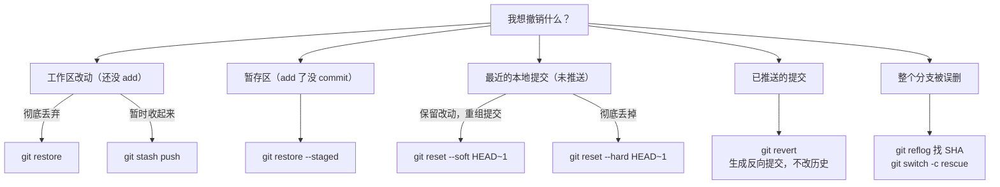
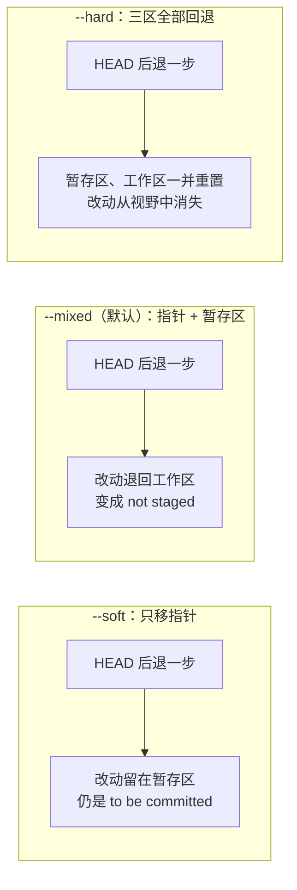

# 05 — 撤销与事故救援

> 误操作急救箱：改乱了工作区、提交错了文件、reset 丢了提交、手滑删了分支——本篇给出一棵决策树和一套标准救援流程，任何状态都能救回来。这是 Git 的「安全网」，也是面试高频区。

| 项目 | 内容 |
|------|------|
| **本篇定位** | 应用层 —— 事故救援，Git 的安全网 |
| **预计时间** | 60 分钟 |
| **面试可答** | reset --soft/--mixed/--hard 与 revert 的区别、reflog 能救什么救不了什么 |

前置知识：[02 篇](./02-git-internals-model.md)的引用/对象模型（reset 的本质是移动指针，revert 的本质是新建反向提交）、[03 篇](./03-git-branch-merge-rebase.md)的 merge/rebase（理解 revert merge commit 为什么需要 `-m`）。

---

## 🎯 学习目标

- 拿到一个「改坏了」的现场，能用决策树在 10 秒内定位到正确的撤销命令
- 熟练使用 `restore` 处理工作区与暂存区层面的反悔（2.23+ 现代命令）
- 说清 `reset --soft / --mixed / --hard` 对 HEAD、暂存区、工作区的不同影响
- 掌握 `revert` 撤销已推送提交的正确姿势，以及 revert merge commit 的后续影响
- 用 `stash` 临时封存/恢复工作区改动，理解 stash 的本质是提交
- 用 `reflog` 找回被丢弃的提交与被删除的分支，知道它的保留期与能力边界
- 用 `cherry-pick` 把单个提交搬到另一条分支（hotfix 回合主干）

---

## 1. 撤销决策树：先问「我想撤销什么」

出事故时最忌讳慌张乱敲命令。先回答一个问题：**改动现在在哪个区、有没有推送？** 然后对号入座：



三条底层原则（来自 02 篇的对象模型）：

1. **提交是不可变的**。所有「撤销」都不是删除数据，而是移动指针或新建提交
2. **只要提交过（甚至暂存过），对象就还在 `.git/objects` 里**，reflog 是找到它们的地图
3. **已推送的历史是公共契约**，只能用 revert「向前撤销」，不能用 reset「向后抹除」

---

## 2. restore：工作区与暂存区的反悔药

Git 2.23 把职责混乱的 `git checkout` 拆成了 `switch`（切分支）和 `restore`（恢复文件）。本篇文件级撤销一律用 `restore`。

```bash
# ① 丢弃工作区改动：README.md 改乱了，恢复成最近一次提交的样子
git restore README.md
# 无输出，文件已被 HEAD 版本覆盖；改动永久丢失（未提交内容无法找回）

git restore .                        # 丢弃所有已跟踪文件的工作区改动

# ② 取消暂存（保留改动）：git add . 手快了，把 secret.env 移出暂存区
git restore --staged secret.env
# 改动仍在工作区，只是不再进入下次提交

# ③ 从任意历史版本恢复文件（只动工作区，不动历史）
git restore --source=HEAD~3 src/config.ts
git diff src/config.ts               # 恢复后处于未暂存状态，确认后再决定是否提交
```

> ⚠️ 工作区里**从未 add 过**的改动一旦被 restore 丢弃，reflog 也救不回来——这是全篇唯一真正「不可逆」的操作，动手前先用 `git diff` 再看一眼。

网上旧教程还在用 `checkout` 干这些事，按此表翻译：

| 目的 | 现代命令（2.23+，本教程一律使用） | 旧命令 |
|------|-----------------------------------|--------|
| 丢弃工作区改动 | `git restore <file>` | `git checkout -- <file>` |
| 取消暂存 | `git restore --staged <file>` | `git reset HEAD <file>` |
| 从指定提交恢复文件 | `git restore --source=<commit> <file>` | `git checkout <commit> -- <file>` |

---

## 3. reset 三模式：移动 HEAD 指针的三种力度

`git reset <commit>` 的本质（02 篇）：**把当前分支指针移动到指定提交**，再按模式决定暂存区和工作区跟不跟。

### 3.1 三模式影响表

以 `git reset <mode> HEAD~1`（回退一个提交）为例：

| 模式 | HEAD（分支指针） | 暂存区（Index） | 工作区 | 被回退提交里的改动去哪了 |
|------|-----------------|----------------|--------|------------------------|
| `--soft` | ✅ 移动 | 不动 | 不动 | 留在暂存区，随时可重新 commit |
| `--mixed`（默认） | ✅ 移动 | 重置为 `<commit>` | 不动 | 退回工作区（未暂存状态） |
| `--hard` | ✅ 移动 | 重置为 `<commit>` | 重置为 `<commit>` | **彻底丢弃**（但提交本身可用 reflog 找回） |



### 3.2 实操对比

```bash
# 当前历史 A → B → C（HEAD 在 C）
git reset --soft HEAD~1              # 回退到 B，C 的改动原样留在暂存区
git status -s
# M  file.txt                        ← 左列 M，还在暂存区
git reset --soft HEAD@{1}            # 用 reflog 把指针移回去，恢复现场

git reset HEAD~1                     # --mixed（默认）：C 的改动退回工作区
git status -s
#  M file.txt                        ← 右列 M，未暂存

git reset --hard HEAD~1              # 三区全回退，像 C 从没存在过
# HEAD is now at xxxxxxx feat: A
git status
# nothing to commit, working tree clean
```

### 3.3 reset <commit> vs reset -- <file>

| 形式 | 移动 HEAD？ | 影响区域 | 用途 |
|------|-----------|---------|------|
| `git reset <commit>` | ✅ | 按 --soft/--mixed/--hard 决定 | 回退提交历史 |
| `git reset -- <file>` | ❌ | 只把该文件在暂存区的版本恢复为 HEAD 版本 | 取消暂存 |

`git reset -- <file>` 是旧时代的取消暂存写法，等价于 `git restore --staged <file>`，现代仓库直接用后者。

**--hard 的不可逆警告与 reflog 兜底**：`--hard` 会把未提交的改动直接蒸发且无法找回。两条纪律：

1. `--hard` 之前先 `git status`，确认 working tree clean；有舍不得的改动先 `git stash push` 兜底
2. 即使 `--hard` 丢了**已提交**的内容也不用慌：对象还在库里，走第 6 节的 reflog 流程找回（见实战演练一）

---

## 4. revert：面向已推送历史的「向前撤销」

### 4.1 原理：不改历史，新增一个反向提交

```bash
# 场景：某次提交引入了线上 bug，但它已经推送到 origin
git revert <SHA>
# [main xxxxxxx] Revert "feat: 新增缓存层"

git log --oneline -3
# xxxxxxx (HEAD -> main) Revert "feat: 新增缓存层"   ← 新增的反向提交
# xxxxxxx feat: 引入 bug 的提交                       ← 原提交仍保留在历史中
```

| 维度 | `git reset` | `git revert` |
|------|-------------|--------------|
| 实现方式 | 移动分支指针，让提交「消失」 | 新建一个内容相反的提交 |
| 历史 | 被改写 | 完整保留，追加一条撤销记录 |
| 已推送提交 | ❌ 禁用（改写公共历史，他人 pull 会炸） | ✅ 唯一正解，可正常 push |

### 4.2 revert merge commit：必须指定 -m

merge 提交有两个父提交，Git 不知道要「保留哪条线、反转哪条线」，必须用 `-m` 声明主线：

```bash
# -m 1 表示保留第 1 个父提交（main 线），反转第 2 个父提交（feature 线）带来的改动
git revert -m 1 <merge-SHA>
# [main xxxxxxx] Revert "Merge branch 'feature'"
```

**后续影响（面试追问点）**：revert merge 之后，将来再把该 feature 分支 merge 回来，**Git 不会带回那些改动**——从历史看「那些改动已被合并过、又被撤销过」。要重新引入，需先 revert 那个 revert（把撤销再撤销），或对 feature 分支 rebase 生成全新 SHA。

---

## 5. stash：把改到一半的现场存进抽屉

### 5.1 基本操作

```bash
# 场景：改到一半要切分支修紧急 bug，当前改动还不想提交
git stash push -m "wip: 登录表单改了一半"
# Saved working directory and index state On main: wip: 登录表单改了一半
git status
# nothing to commit, working tree clean    ← 可以安全切分支了

# ……修完 bug 回来
git stash list
# stash@{0}: On main: wip: 登录表单改了一半
git stash pop                              # 取出最近一条并从列表删除
# Dropped refs/stash@{0} (xxxxxxx)          ← 改动原样回到工作区
```

```bash
# 常用变体
git stash push --include-untracked    # 连未跟踪的新文件一起存（默认不含）
git stash apply stash@{1}             # 恢复但保留条目（pop = apply + drop）
git stash drop stash@{0}              # 手动删除一条
```

**pop 冲突处理**：stash 期间若当前分支与 stash 内容改了同一处，`pop` 会冲突。此时**stash 条目不会被自动丢弃**（Git 的保护机制）：手动解决冲突 → `git add` 标记已解决 → 确认无误后 `git stash drop` 清掉。

**stash 的本质是提交**：stash 不是黑盒，它就是普通的提交对象（挂在 `.git/refs/stash` 引用链上），因此 `git stash show -p stash@{0}` 能查看任意一条 stash 的完整 diff。推论：误 `drop` 的 stash 短时间内能通过 reflog / `git fsck` 找回（第 8 节思路），但**从未进过 stash、从未 add 过的工作区内容，Git 没有任何记录**。

---

## 6. reflog：HEAD 的移动日记，终极兜底

### 6.1 它记录什么

只要 HEAD 发生过移动（commit、reset、rebase、merge、switch……），Git 就记一笔。**即使分支被删、提交被 reset 掉，日记还在**。

```bash
git reflog
# xxxxxxx (HEAD -> main) HEAD@{0}: reset: moving to HEAD~2      ← 事故现场
# xxxxxxx HEAD@{1}: commit: feat: 支付回调重试                    ← 被丢掉的提交！
# xxxxxxx HEAD@{2}: commit: feat: 支付下单接口                    ← 被丢掉的提交！
# xxxxxxx HEAD@{3}: clone: from git@github.com:...
```

引用语法：`HEAD@{2}` = HEAD 两次移动前的位置；`HEAD@{yesterday}` = 昨天此时（也支持 `2.hours.ago`）；`main@{1}` = main 上次指向的提交。

### 6.2 保留期

| 条目类型 | 默认保留期 | 配置项 |
|----------|-----------|--------|
| 可达条目（仍有分支/tag 指向） | 90 天 | `gc.reflogExpire` |
| 不可达条目（已无任何引用指向） | 30 天 | `gc.reflogExpireUnreachable` |

事故后 30 天内救援都来得及；`git gc` 会清理过期条目与不可达对象，别拖太久。

### 6.3 核心救援流程（背下来）

```bash
# 第一步：翻日记，找到目标提交的 SHA
git reflog                       # 找到 "commit: feat: 支付下单接口" 条目，记下 SHA

# 第二步：不要原地 reset，先建救援分支
git switch -c rescue <SHA>

# 第三步：确认内容无误后再归位
git cherry-pick <需要的SHA>      # 只摘需要的提交回主干（见第 7 节）
# 或整段都要：git switch main && git merge rescue
```

### 6.4 能力边界：能救什么，救不了什么

| 场景 | 能救吗 | 原因 |
|------|--------|------|
| `reset --hard` 丢掉的已提交内容 | ✅ | 提交对象还在，reflog 有 SHA |
| 误删分支（`git branch -D`） | ✅ | 分支最后的指向位置有日记 |
| rebase 后想回到变基前 | ✅ | rebase 前的 HEAD 位置有日记 |
| `git stash drop` 不久的 stash | ✅（大概率） | stash 也是提交，走 fsck/reflog 找 |
| add 过但没 commit、随后被丢弃的内容 | ✅ | add 已生成 blob，`git fsck --lost-found` 可见 |
| **从未 add 过的工作区改动** | ❌ | Git 从未记录过它，神仙难救 |

一句话总结：**Git 只对「进过 Git 的内容」负责；编辑器里的草稿不归 Git 管。**

---

## 7. cherry-pick：把单个提交搬到当前分支

```bash
# 场景：hotfix 分支修了一个 bug（SHA: def5678），要把这一个提交带回 main
git switch main
git cherry-pick def5678
# [main xxxxxxx] fix: 修正订单金额精度
#  1 file changed, 3 insertions(+), 1 deletion(-)
```

cherry-pick 不是「移动」提交，而是**按原提交的 diff 在当前分支生成一个新提交**——内容相同，SHA 不同。

**-x 保留来源信息**：`git cherry-pick -x def5678` 会在提交消息追加 `(cherry picked from commit def5678)`。团队协作中 cherry-pick 一律加 `-x`，这是未来排查「这个修复怎么两边都有」的血缘证明。

典型场景：

| 场景 | 做法 |
|------|------|
| hotfix 回合主干 | 在 hotfix 分支修复后，`cherry-pick -x` 回 main |
| 提交到了错误分支 | switch 到正确分支 cherry-pick，再回错误分支 reset 掉原提交 |

冲突处理与 merge 相同：解决 → `git add` → `git cherry-pick --continue`；放弃用 `git cherry-pick --abort`。

---

## 8. 找回「删除」的分支

`git branch -d/-D` 删除的只是那个 40 字节的指针；只要提交曾被分支指向过，对象就还在对象库里（受 reflog 保留期约束）。

```bash
# 事故现场：注意 Git 在输出里已经把 SHA 告诉你了
git branch -D feature-pay
# Deleted branch feature-pay (was abc1234).
```

**救援姿势一：reflog（首选）**

```bash
git reflog | head -5
# abc1234 HEAD@{5}: checkout: moving from feature-pay to main   ← 离开前的最后位置
git branch feature-pay abc1234       # 原地重建
git log --oneline feature-pay -3     # 确认内容完整
```

**救援姿势二：git fsck --lost-found**

reflog 没线索时（比如克隆上本地从未 checkout 过该分支），扫描「悬空」对象：

```bash
git fsck --lost-found
# dangling commit abc1234
git show --stat abc1234              # 逐个确认哪个是丢失分支的提交
git branch feature-pay abc1234       # 确认后重建
```

> 同理，误 `drop` 的 stash 也会以 dangling commit 出现在 fsck 结果里，`git stash apply <SHA>` 即可恢复。

---

## 🎯 实战：四类事故演练与救援

在 `git-playground` 演练仓库中依次制造事故并救援（历史不足先补几个提交）。

### 演练一：hard reset 丢 2 个提交 → reflog 找回

```bash
# 制造事故：当前历史 A → B → C（HEAD 在 C），一口气丢掉 B 和 C
git reset --hard HEAD~2
# HEAD is now at xxxxxxx feat: A       ← B、C 从历史中消失

# 救援：翻 reflog 记下 C 的 SHA → 建救援分支 → 归位
git reflog -5
# xxxxxxx HEAD@{0}: reset: moving to HEAD~2
# xxxxxxx HEAD@{1}: commit: feat: C      ← 记下这个 SHA
git switch -c rescue <C的SHA>
# Switched to a new branch 'rescue'     ← git log 可见 B、C 都回来了

git switch main && git merge rescue      # fast-forward，main 重新指向 C
# Fast-forward
git branch -d rescue                     # 清理救援分支
```

### 演练二：误删分支 → reflog 重建

```bash
# 制造事故：建一个带提交的分支，然后删掉
git switch -c feature-demo
echo "demo" > demo.txt
git add demo.txt && git commit -m "feat: demo 提交"
git switch main
git branch -D feature-demo
# Deleted branch feature-demo (was <SHA>).

# 救援：reflog 找离开该分支前的最后位置，原地重建
git reflog | head -3
# xxxxxxx HEAD@{0}: checkout: moving from feature-demo to main
# xxxxxxx HEAD@{1}: commit: feat: demo 提交
git branch feature-demo HEAD@{1}         # 分支原地复活，git log 验证内容完整
```

### 演练三：工作区改乱 → restore 还原

```bash
# 制造事故
echo "garbage" >> README.md
echo "oops" >> index.js
git status -s
#  M README.md
#  M index.js

# 救援：先还原单个文件，再还原全部
git restore README.md
git status -s
#  M index.js                            ← README.md 已恢复干净
git restore .
git status
# nothing to commit, working tree clean
```

### 演练四：提交了不该包含的文件 → soft reset 拆分提交

```bash
# 制造事故：本想只提交 README.md，却把 index.js 一起带上了
echo "docs update" >> README.md
echo "wip code" >> index.js
git add -A && git commit -m "docs: 更新文档"
# git show --stat HEAD 可见 index.js 也被包含，不该在这个提交里

# 救援：soft reset 回退 → 移出多余文件 → 重新提交
git reset --soft HEAD~1
git status -s
# M  README.md                           ← 两个文件都还在暂存区
# M  index.js
git restore --staged index.js
git status -s
# M  README.md                           ← 暂存区只剩 README
#  M index.js                            ← index.js 退回工作区，留着以后提交
git commit -m "docs: 更新文档"
git show --stat HEAD
# README.md | 1 +                        ← 这次干净了
```

---

## 🏋️ 练习

### 练习 1：验证 reset 三模式的差异

- **要求**：造 3 个连续提交，分别用 `--soft`、`--mixed`、`--hard` 回退一个提交，每次用 `git status -s` 观察改动去向，并用 reflog 恢复现场再进行下一轮。
- **提示**：三种模式的唯一区别是「暂存区和工作区跟不跟着 HEAD 后退」；恢复现场用 `git reset --hard HEAD@{n}`（工作区本来就干净，hard 无副作用）。
- **预期效果**：能不看表说出被回退提交的改动分别处于「暂存区 / 工作区 / 消失」哪种状态。

### 练习 2：revert 一个 merge 提交，并验证「再合并带不回改动」

- **要求**：建 feature 分支改一个文件 → merge 回 main → `git revert -m 1 <merge-SHA>` → 再次 merge 该分支，观察改动是否回来；最后用「revert 那个 revert」把改动找回来。
- **提示**：第二次 merge 时 Git 认为 feature 线的改动「已合并并已被撤销」，不会重新引入；`git revert <revert提交的SHA>` 可把撤销再撤销。
- **预期效果**：第二次 merge 后文件仍是被撤销状态；revert 掉 revert 后改动回归，并能解释为什么。

### 练习 3：组合救援——stash + reflog 连环事故

- **要求**：工作区有改动时 `git stash push`；随后 `git reset --hard HEAD~1` 丢一个提交；再 `git stash pop` 制造冲突；依次解决：stash 冲突如何收尾、丢掉的提交如何用 reflog 找回。
- **提示**：pop 冲突时 stash 条目不会自动丢弃，解决完要手动 `git stash drop`；找回提交走「reflog → switch -c rescue」流程。
- **预期效果**：一次演练同时掌握 stash 冲突收尾与 reflog 救援两条技能线。

---

## 🆚 对比板块：reset vs revert vs restore

| 维度 | `restore` | `reset` | `revert` |
|------|-----------|---------|----------|
| 作用对象 | 文件（工作区 / 暂存区） | 提交（移动分支指针） | 提交（新建反向提交） |
| 是否改写历史 | 否（不碰提交） | 是（指针后退，提交从分支历史消失） | 否（历史只增不减） |
| 能否安全用于已推送 | — | ❌ 禁止（需 force push，影响协作者） | ✅ 唯一正解 |
| 典型场景 | 改乱了文件、误 add | 本地提交拆分重组、回退未推送的错误提交 | 撤销线上错误提交、revert merge |

> 追问预警：面试官常追问「reset --hard 之后真的找不回了吗？」——分两层答：**已提交过的内容**能找回（对象还在库里，reflog 记着 SHA，保留期内 `git switch -c rescue <SHA>` 即可）；**从未提交、从未 add 的工作区改动**找不回（Git 从未记录）。能答出这个分层，基本就是满分答案。

---

## ❓ 面试问答

### Q1：`reset --soft / --mixed / --hard` 和 `revert` 的区别？

- reset 是**移动分支指针**让提交「消失」，本质改写历史；revert 是**新建一个反向提交**，历史只增不减
- reset 三模式的区别在于暂存区和工作区跟不跟：`--soft` 只动 HEAD（改动留在暂存区）、`--mixed`（默认）连暂存区一起重置（改动退回工作区）、`--hard` 三区全重置（未提交改动永久丢失）
- 选型原则：**未推送的提交**用 reset 随便折腾；**已推送的提交**只能用 revert，否则改写公共历史会影响所有协作者
- 延伸：revert merge commit 必须 `-m 1` 指定保留的主线父提交，否则 Git 不知道该反转哪条线

### Q2：reflog 是什么？能救什么、救不了什么？

- reflog 是 HEAD 每次移动的日记（commit / reset / switch / rebase 都会记录），即使分支被删、提交被 reset 掉，日记依然保留
- 能救：被 hard reset 丢掉的提交、误删的分支、rebase 前的状态、误 drop 的 stash——共同点是**内容曾经进过 Git**（提交过或至少 add 过）
- 救不了：**从未 add 过的工作区改动**，Git 没有任何记录；另外有保留期——可达条目默认 90 天、不可达条目 30 天，过期被 gc 清理
- 救援姿势：`git reflog` 找到 SHA → `git switch -c rescue <SHA>` 先建分支，确认后再归位，不要原地 reset

### Q3：cherry-pick 用在什么场景？为什么建议加 `-x`？

- 把**单个提交**应用到当前分支：hotfix 修完回合主干、提交错分支后搬家、从长命分支只摘一个修复
- 本质是按原提交的 diff **生成一个新提交**，内容相同但 SHA 不同，两边历史是「双胞胎」而非同一提交
- `-x` 在新提交消息里追加 `(cherry picked from commit ...)`，留下血缘记录，方便排查「为什么两条分支都有/都没有这个修复」
- 延伸：长期靠 cherry-pick 同步两条分支会越同步越乱（重复 SHA 在 merge 时可能被跳过），应尽快让分支真正合并

---

## ✅ 自检清单

- [ ] 面对事故现场，能在决策树上 10 秒定位到正确命令
- [ ] 能区分 `git restore <file>` / `--staged` / `--source` 三种用法，并说出与旧 checkout 命令的对应关系
- [ ] 能默写 reset 三模式对 HEAD / 暂存区 / 工作区的影响表
- [ ] 知道 `--hard` 之前必须检查工作区，且知道 hard 丢掉的已提交内容如何找回
- [ ] 能解释为什么已推送的提交只能 revert，以及 revert merge 的 `-m 1` 与「再合并带不回改动」
- [ ] stash 的 push / pop / list / drop / apply 都能盲操，会处理 pop 冲突
- [ ] 能独立完成一次「reflog 找 SHA → switch -c 救援分支 → 归位」的完整救援，知道 reflog 保留期与能力边界
- [ ] 会 cherry-pick 并知道为什么要加 `-x`，能用 reflog 或 `git fsck --lost-found` 找回误删分支

---

## 🔗 相关文档

- 上一篇：[04 - 远程仓库与团队协作](./04-git-remote-collaboration.md)
- 下一篇：[06 - 历史整理 + bisect + worktree + hooks](./06-git-advanced-toolbox.md)
- 大纲：[Git 学习大纲](../git-learning-outline.md)
- [git-restore 官方文档](https://git-scm.com/docs/git-restore)
- [git-reflog 官方文档](https://git-scm.com/docs/git-reflog)

---

*最后更新：2026年8月*
