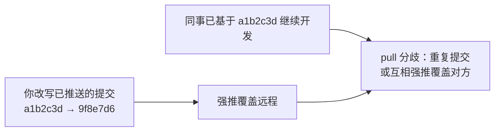
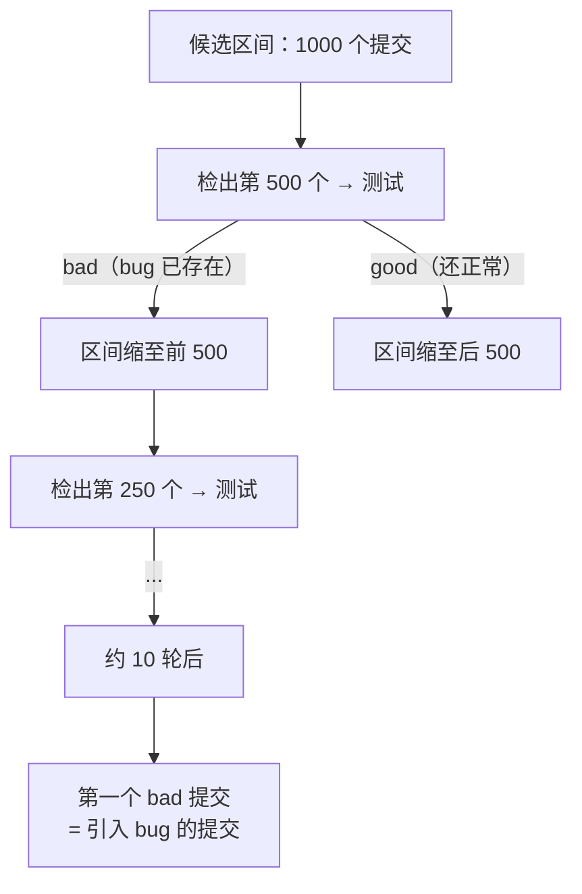

# 06 — 历史整理与工程化工具箱

> 工程层：从「会用 Git」到「把 Git 用出工程价值」。用 rebase -i 把零碎提交整理成语义完整的历史，用 bisect 二分定位引入 bug 的提交，用 blame / worktree / hooks / tag 覆盖追溯、并行开发、质量门禁与版本发布四个工程场景。

| 项目 | 内容 |
|------|------|
| **本篇定位** | 工程层 —— 从会用 Git 到把 Git 用出工程价值 |
| **预计时间** | 75 分钟 |
| **前置篇目** | [04 远程协作](./04-git-remote-collaboration.md)、[05 撤销与事故救援](./05-git-undo-rescue.md) |
| **面试可答** | 如何整理提交历史、已推送历史为什么不能随意改、bisect 怎么定位 bug |

---

## 🎯 学习目标

- 用 `amend` 修补最后一次提交，说清它在已推送场景下的代价
- 熟练使用 `rebase -i` 的六个动作整理历史，掌握 `--fixup` + `--autosquash` 工作流
- 牢记改写历史的黄金法则，能解释已推送公共历史为什么不能改写
- 用 `bisect` 手动与自动（`run`）两种方式定位引入 bug 的提交；用 `blame -L` / `--ignore-rev` 做行级追溯，用 `worktree` 实现不 stash 的并行开发
- 会写 pre-commit / commit-msg / pre-push 钩子，分清 lightweight 与 annotated tag，完成打 tag → 推送 → `git describe` 的发布闭环

> 本篇假设你已掌握 04 篇的远程推送（含 `--force-with-lease`）与 05 篇的 reset / reflog / revert，实战环节会高频回引这两篇。环境要求 Git ≥ 2.30（当前稳定版 2.55，2026-06 发布）。

---

## 1. amend —— 修补最后一次提交

### 1.1 两个高频场景

```bash
# 场景 1：提交消息写错了，只改消息
git commit --amend -m "fix: 修正登录超时判断"

# 场景 2：发现漏提交了一个文件，追加进最后一次提交
git add src/utils.ts
git commit --amend --no-edit    # 不打开编辑器，沿用原消息
```

### 1.2 amend 的本质与代价

`amend` 不是「修改」旧提交，而是**生成一个新提交替换它**（呼应 [02 篇](./02-git-internals-model.md)的「历史不可变」）：提交哈希必然变化，旧提交仍可通过 `reflog` 找回（05 篇）。

**已推送后 amend 的代价**：本地分支与远程从 amend 点开始分叉，普通 `push` 被拒绝（non-fast-forward），必须强推：

```bash
git push --force-with-lease origin main
# --force-with-lease 会校验远程分支是否还是你上次 fetch 的样子，若他人已推新提交则拒绝（04 篇安全强推姿势）
```

结论：**amend 只用于未推送的本地提交**；已推送还用 amend，等于主动制造一次需要全组协调的强推。

---

## 2. rebase -i —— 交互式变基整理历史

### 2.1 命令与 TODO 列表

```bash
git rebase -i HEAD~5    # 整理最近 5 个提交（不含基点）
git rebase -i main      # 整理当前分支上所有 main 之后的提交
```

执行后打开编辑器，显示一份 TODO 列表（**从上到下是最旧到最新**，与 `git log` 方向相反），每行格式为 `pick <短哈希> <提交消息>`，把行首动作改掉、调整行顺序（reorder），保存退出即执行。

### 2.2 动作速查表

| 动作 | 缩写 | 效果 | 典型时机 |
|------|------|------|---------|
| `pick` | `p` | 原样保留 | 默认动作 |
| `reword` | `r` | 保留内容，只改提交信息 | 消息写错、不符规范 |
| `edit` | `e` | 停在该提交，可改内容后 `--continue` | 拆提交、改代码 |
| `squash` | `s` | 并入上一个提交，消息可编辑合并 | 合并语义相关提交，两边消息都要留 |
| `fixup` | `f` | 并入上一个提交，**丢弃**本条消息 | 修补性小提交（typo、小 bug） |
| `drop` | `d` | 删除提交（删行等效） | 临时调试、废弃改动 |

> 高阶：`exec` 可在每个提交后跑命令（如逐个提交跑测试，保证历史中每个提交都可编译）。

### 2.3 实操：5 个零碎提交整理成 2 个

整理前的 `git log --oneline`（最新在上）：`chore: 临时调试输出` / `feat: 新增测试` / `fix: 修个小问题` / `wip: 写到一半` / `feat: 新增解析函数`。编辑 TODO 列表——修补 → fixup，无意义消息 → squash，调试垃圾 → drop：

```text
pick aaaaaaa feat: 新增解析函数
squash bbbbbbb wip: 写到一半
fixup ccccccc fix: 修个小问题
pick ddddddd feat: 新增测试
drop eeeeeee chore: 临时调试代码
```

squash 后编辑器弹出消息合并界面，整理为一行 `feat: 新增解析函数与基础实现` 保存退出。之后 `git log --oneline` 只剩 2 个语义完整的提交，调试垃圾彻底消失。

### 2.4 fixup + autosquash 工作流

「整理历史」最反直觉的痛点：开发时哪知道哪个提交将来要合并？autosquash 把决策推迟到整理时刻：

```bash
# 1. 开发中发现前面某提交有小问题，修完后打标记提交：
git add src/parser.ts
git commit --fixup=aaaaaaa        # 自动生成消息：fixup! feat: 新增解析函数

# 2. 整理时 Git 自动把 fixup! 提交排到目标提交后面并标记为 fixup：
git rebase -i --autosquash HEAD~6   # TODO 已自动排好，直接保存退出
```

价值：开发中随手提交不用纠结消息质量，合并主干前一次 `--autosquash` 自动归位。

### 2.5 中断与恢复

rebase 是逐个重放提交的过程，中途可能冲突或需要改内容：

```bash
git rebase --continue   # 解决冲突并 git add 后，继续重放
git rebase --abort      # 放弃整理，回到 rebase 前的状态（最安全的后悔药）
```

即使 `--abort` 之后又想找回整理前的状态，reflog 依然是最后兜底（05 篇）。

> 趋势观察：Git 2.54+ 引入了实验性命令 `git history`（reword / split / fixup 等子命令），让可视化整理历史更顺手；接口仍可能变化，本篇以成熟的 `rebase -i` 方案为教学主体。

---

## 3. 改写历史的边界：黄金法则

### 3.1 黄金法则（03 篇首次提出，此处重申）

**只整理未推送的本地历史。**

推导：提交是不可变的内容寻址对象（02 篇），所谓「改历史」是创建新提交、把分支指针移过去。未推送时只有你引用这些提交，指针怎么移都无害；**一旦推送，这些提交的 SHA 就成了团队共享引用**。

### 3.2 已推送公共历史改写 = 全组灾难



灾难的本质：Git 无法区分「你改写后的新历史」和「同事基于旧历史的正常开发」，强推后每个人的本地都成了孤岛。

### 3.3 唯一的例外：个人独占分支

你自己独占的功能分支（PR 分支、无人协作的 topic 分支）可以随意改写，前提：分支确实无人基于它开发；强推一律用 `git push --force-with-lease`（04 篇）；合入主干的那一刻起，规矩立即收紧。

---

## 4. bisect —— 二分查找定位 bug

### 4.1 原理

已知「某旧版本正常、当前版本有 bug」，引入 bug 的提交必在两者之间。bisect 每次检出中间提交验证，候选范围减半：**O(log n)**——1000 个提交约 10 轮锁定。



### 4.2 手动流程

```bash
git bisect start
git bisect bad HEAD             # 当前版本：有 bug
git bisect good v1.0.0          # 已知正常的版本（tag 或提交哈希）
# Bisecting: 31 revisions left to test after this (roughly 5 steps)
# Git 自动检出中间提交，你构建/运行/验证后标记：
git bisect good                 # 正常 → 往后半区找
git bisect bad                  # 有 bug → 往前半区找
# 重复直到：<sha> is the first bad commit
git bisect reset                # 结束，回到原来的 HEAD
```

### 4.3 自动化：git bisect run

人工判断每轮「好/坏」太慢时，把判断写成脚本全自动跑。**退出码即判定**：`0` = good，非 0 = bad，`125` = skip（如该提交编译不过无法测试）：

```bash
git bisect start HEAD v1.0.0        # start 时直接给 bad 和 good
git bisect run ./test-bug.sh
# ...自动检出、运行脚本、按退出码标记，若干轮后：
# <sha> is the first bad commit
git bisect reset
```

### 4.4 bisect log：可回放的定位过程

```bash
git bisect log > bisect.log     # 记录完整判定序列
git bisect reset
git bisect replay bisect.log    # 在任何克隆中回放同样的定位过程（复盘、复现）
```

---

## 5. blame —— 行级追溯

### 5.1 基本用法

```bash
git blame src/parser.ts                        # 每行：哈希 (作者 日期 行号) 内容
git blame -L 10,20 src/parser.ts               # 只看第 10~20 行
```

### 5.2 --ignore-rev：跳过格式化大提交

一次 prettier / ESLint --fix 全量格式化会让 blame 满屏都是那次提交，真正的作者被掩盖：

```bash
git blame --ignore-rev 6f7e8a9 src/parser.ts
# 被忽略提交改动的行，显示上一位真正修改它的作者
# 团队惯例：把要忽略的哈希写进 .git-blame-ignore-revs 并提交进仓库
echo "6f7e8a9  # 2026-05 全量 prettier 格式化" >> .git-blame-ignore-revs
git config blame.ignoreRevsFile .git-blame-ignore-revs
```

### 5.3 配合 05 篇命令做深度追溯

- `git log -L 10,20:src/parser.ts`：看这 10 行**每次变更的完整 diff**（05 篇），回答「这行为什么变成现在这样」；也可按函数名 `-L /^function parse/,+10:file`
- 文件重命名/迁移后：`git log --follow` 跟历史；确认某提交是否已迁移进当前分支用 `git cherry`（05 篇）

---

## 6. worktree —— 一个仓库，多个工作目录

### 6.1 场景与用法

主干功能改到一半，线上爆出紧急 bug：stash 现场 → 切分支 → 修完 → 恢复现场，繁琐且 stash 容易丢。worktree 直接开一个独立目录修 bug，原目录的半成品原封不动：

```bash
git switch -c hotfix/login-crash main
git worktree add ../playground-hotfix hotfix/login-crash
cd ../playground-hotfix      # ...修复、提交、推送...
cd ../playground
git worktree list
# /Users/you/git-playground            a1b2c3d [main]
# /Users/you/playground-hotfix         b2c3d4e [hotfix/login-crash]
git worktree remove ../playground-hotfix     # 修完清理
```

注意：**同一分支不能同时被两个 worktree 检出**（Git 直接报错），这是刻意设计，防止两处同时推进同一分支造成状态混乱。

### 6.2 worktree vs clone

| 维度 | `git worktree add` | `git clone` |
|------|-------------------|-------------|
| 对象库（.git/objects） | 与主仓库**共享**，不复制 | 完整复制一份 |
| 磁盘占用 | 仅多一份工作区文件 + 独立 index | 多一份完整历史 |
| refs / config | 共享（一边 fetch，两边都看见） | 完全独立 |
| 适用场景 | 同仓库并行任务（hotfix、跑长测试、对照阅读） | 需要完全隔离的环境（不同 fork、不同凭据） |

---

## 7. hooks —— 提交前后的质量门禁

### 7.1 三个核心客户端钩子

| 钩子 | 触发时机 | 非 0 退出的效果 |
|------|---------|-----------------|
| `pre-commit` | 提交创建前 | 中止本次 commit |
| `commit-msg` | 提交信息写入后、提交创建前 | 中止本次 commit |
| `pre-push` | push 与远程通信前 | 中止本次 push |

钩子是 `.git/hooks/` 下的**可执行脚本**（文件名即钩子名，无扩展名），任何语言皆可，退出码非 0 即拦截。

### 7.2 示例一：pre-commit 跑 lint

```bash
# .git/hooks/pre-commit
#!/usr/bin/env bash
set -e
STAGED=$(git diff --cached --name-only --diff-filter=ACM | grep -E '\.(js|ts)$' || true)
[ -z "$STAGED" ] && exit 0
npx oxlint $STAGED
```

### 7.3 示例二：commit-msg 校验约定式提交

```bash
# .git/hooks/commit-msg
#!/usr/bin/env bash
# 校验提交信息是否符合约定式提交：<type>[scope]: <描述>
MSG_FILE=$1
MSG=$(grep -v '^#' "$MSG_FILE" | grep -v '^$' | head -n 1)   # 跳过注释与空行
PATTERN='^(feat|fix|docs|style|refactor|perf|test|chore|revert)(\(.+\))?: .+'

echo "$MSG" | grep -qE "$PATTERN" && exit 0
echo "❌ 提交信息不符合约定式提交格式：<type>[scope]: <描述>"
echo "   收到的消息：$MSG"
exit 1
```

```bash
chmod +x .git/hooks/commit-msg
git commit -m "修了个bug"
# ❌ 提交信息不符合约定式提交格式：<type>[scope]: <描述>
git commit -m "fix: 修正登录超时判断"
# [main a1b2c3d] fix: 修正登录超时判断    ← 校验通过
```

### 7.4 示例三：pre-push 推前跑测试

```bash
# .git/hooks/pre-push
#!/usr/bin/env bash
set -e
npm test
```

### 7.5 钩子不分发的痛点与趋势

`.git/` 目录不随仓库分发（clone 只拉对象与引用），所以 **hooks 无法跟着仓库走**：新成员 clone 后钩子一片空白，规范形同虚设。常见解法是 **husky**：通过 postinstall 把 `core.hooksPath` 指到仓库内的 `.husky/` 目录，钩子脚本随仓库版本化、`npm install` 即生效（Node 项目事实标准；非 Node 项目可手动 `git config core.hooksPath hooks/`）。

趋势观察：Git 2.54+ 正在推进配置化钩子（config-based hooks，`core.hooksPath` 之外由仓库配置声明钩子的新机制），目标是让钩子可随仓库分发，值得关注，但当前落地仍以 hooksPath + husky 模式为主。

---

## 8. tag 与版本发布

### 8.1 两种 tag

```bash
# lightweight：只是指向提交的一个引用（和分支类似，但不移动）
git tag v0.9.0

# annotated：对象库中独立的 tag 对象，含打标签者、日期、消息，可 GPG 签名
git tag -a v1.0.0 -m "release: v1.0.0 首个正式版"
git tag -s v1.0.1 -m "release: v1.0.1"      # -s = GPG 签名
git cat-file -t v1.0.0    # tag        ← annotated 是独立对象
git cat-file -t v0.9.0    # commit     ← lightweight 只是指针
```

正式发布一律用 annotated：有元信息可追溯、可签名验证；`git describe` 默认也只认它（两者完整对比见文末 🆚 板块）。

### 8.2 推送与查看

```bash
git push origin v1.0.0            # tag 不随 push 自动上传，必须显式推
git push origin --tags            # 推送所有本地 tag
git push origin --follow-tags     # 随普通 push 只推 annotated tag（推荐）
git tag -l 'v1.*'                 # 按模式列出 tag
git tag -d v0.9.0                 # 删除本地 tag
```

### 8.3 git describe 与 SemVer

```bash
git describe --tags
# v1.0.0-3-g7a2b3c4
# └ 最近的 tag ─ 距它 3 个提交 ─ g 前缀 + 当前提交短哈希
```

`git describe` 的输出是 CI 构建版本的常用来源：tag 之后每多一个提交版本号自动递增，天然可追溯。SemVer（语义化版本）一句话：`MAJOR.MINOR.PATCH`——破坏性变更升 MAJOR，新增功能升 MINOR，修 bug 升 PATCH；发布节奏与分支策略的配合见 [07 篇](./07-git-workflow-cheatsheet.md)。

---

## 🎯 实战：整理历史 + bisect 定位预埋 bug

在 `git-playground` 演练仓库中完成完整闭环：制造零碎提交 → rebase -i 整理 → 预埋 bug → bisect run 自动定位。

### 第一步：制造 5 个零碎提交

```bash
cd git-playground && git switch main

# 基点提交（bisect 的 good 锚点）
printf '#!/usr/bin/env bash\necho "score: 10"\n' > app.sh
chmod +x app.sh
git add app.sh && git commit -m "chore: 初始化 app.sh"
# 之后 5 个零碎提交（文件已跟踪，直接 commit -am）
echo 'echo "score: 20"' >> app.sh && git commit -am "feat: 计算基础分数"
echo 'echo "score: 25"' >> app.sh && git commit -am "wip: 调一下分数"        # 稍后 squash
echo 'echo "debug: remove me"' >> app.sh && git commit -am "chore: 临时调试" # 稍后 drop
echo 'echo "level: 3"' >> app.sh && git commit -am "feat: 新增等级输出"
echo 'echo "level: 3 final"' >> app.sh && git commit -am "fix: typo"        # 稍后 fixup

git log --oneline
# * xxxxxxx (HEAD -> main) fix: typo
# * xxxxxxx feat: 新增等级输出
# ...（中间 3 个：chore: 临时调试 / wip: 调一下分数 / feat: 计算基础分数）
# * xxxxxxx chore: 初始化 app.sh
```

### 第二步：rebase -i 整理成 2 个语义提交

执行 `git rebase -i HEAD~5`，TODO 列表中：wip → squash 进功能提交（消息编辑界面合并为 `feat: 计算基础分数`）、调试 → drop、typo → fixup：

```text
pick xxxxxxx feat: 计算基础分数
squash xxxxxxx wip: 调一下分数
drop xxxxxxx chore: 临时调试
pick xxxxxxx feat: 新增等级输出
fixup xxxxxxx fix: typo
```

```bash
git log --oneline       # 保存退出后验证
# * xxxxxxx (HEAD -> main) feat: 新增等级输出
# * xxxxxxx feat: 计算基础分数
# * xxxxxxx chore: 初始化 app.sh
# 5 个零碎提交 → 2 个语义提交，调试输出彻底消失
```

### 第三步：预埋一个让脚本退出的 bug

```bash
# 在「feat: 计算基础分数」中埋入 exit 1：脚本走到 score: 20 就异常退出
git rebase -i HEAD~2
# TODO 中把「feat: 计算基础分数」一行改为 edit，保存退出：
# Stopped at xxxxxxx... feat: 计算基础分数
sed -i '' '2i\
exit 1
' app.sh                                  # macOS BSD sed 写法；Linux 去掉 ''
git add app.sh
git rebase --continue                     # 重放剩余提交，bug 被带进最终状态

bash app.sh
# score: 10
# （走到 score: 20 前就退出，exit code 1 —— bug 生效）
```

### 第四步：bisect run 自动定位

```bash
# 判断脚本：能正常跑完（exit 0）= good；脚本异常退出 = bad
printf '#!/usr/bin/env bash\n./app.sh\n' > test.sh && chmod +x test.sh

git bisect start HEAD <初始化提交的 sha>     # HEAD 为 bad，初始提交为 good
git bisect run ./test.sh
# ...自动检出中间提交、运行 test.sh、按退出码标记，2 轮内：
# <sha> is the first bad commit    ← 正是预埋 bug 的「feat: 计算基础分数」新哈希
git show HEAD                          # bisect 停在 first bad commit，直接看引入改动
git bisect reset                       # 结束，回到 main
```

至此完成工程闭环：**零碎提交被整理为语义历史，预埋 bug 被 O(log n) 自动定位**——这正是本篇两个核心工具在真实项目中的组合价值。

---

## 🏋️ 练习

### 练习 1：worktree 并行演练 fixup + autosquash

- **要求**：主干（main）保持一个「半成品」状态（工作区有未提交改动，不许 stash）；用 `git worktree add` 另开目录，在其中新分支上完成 2 次提交，追加一次 `git commit --fixup=<第一个提交>` 并用 `git rebase -i --autosquash` 合并，最后清理 worktree。
- **提示**：worktree 与主目录共享对象库，但工作区与暂存区各自独立，主干半成品互不干扰；同一分支不能两处检出，新 worktree 要用新分支。
- **预期效果**：主目录 `git status` 的半成品原封不动；整理后的分支 `git log --oneline` 中 fixup 提交已消失，内容并入目标提交。

### 练习 2：blame 跳过格式化大提交

- **要求**：构造一个 20 行文件分两次提交（用 `git commit --author="A <a@x.com>"` 模拟不同作者），第三次提交给每行行尾加一个空格（模拟格式化）；对比普通 `git blame` 与 `git blame --ignore-rev` 的输出，并配置 `.git-blame-ignore-revs`。
- **提示**：忽略列表文件要提交进仓库才对全组生效；配合 `blame.ignoreRevsFile` 配置后默认跳过。
- **预期效果**：普通 blame 满屏是格式化提交；加 `--ignore-rev` 后每行显示格式化之前真正的作者与时间。

### 练习 3：tag 发布闭环

- **要求**：为演练仓库各打一个 lightweight 与 annotated tag，用 `git cat-file -t` 对比类型；在两个 tag 之间的提交上跑 `git describe --tags` 观察输出；最后删除两个 tag。
- **提示**：`git cat-file -t` 对 annotated 返回 `tag`，对 lightweight 返回 `commit`；describe 默认只认 annotated，加 `--tags` 才计入 lightweight。
- **预期效果**：能解释 `v1.0.0-3-g7a2b3c4` 每段含义，并说出正式发布为什么必须用 annotated（元信息 + 可签名）。

---

## 🆚 对比板块

### annotated vs lightweight tag

| 维度 | annotated（`git tag -a`） | lightweight（`git tag`） |
|------|--------------------------|--------------------------|
| 存储本质 | 对象库中的独立 tag 对象 | `.git/refs/tags/` 下的一行指针 |
| 元信息 | 打标签者、日期、消息 | 无 |
| GPG 签名 | ✅ | ❌ |
| `git describe` 默认 | ✅ 采用 | ❌ 忽略（需 `--tags`） |
| 适用场景 | 正式发布（v1.0.0） | 本地临时书签 |

### rebase -i 动作速查表

| 动作 | 效果 | 使用时机 |
|------|------|---------|
| `pick` | 原样保留 | 默认 |
| `reword` | 只改消息 | 消息写错 / 不符规范 |
| `edit` | 停下改内容 | 拆分提交、修代码 |
| `squash` | 并入上一提交，消息合并可编辑 | 合并语义相关提交 |
| `fixup` | 并入上一提交，丢弃消息 | 修补性小提交 |
| `drop` | 删除 | 调试垃圾、废弃改动 |

> 追问预警：**「已推送的历史改错了怎么办？」**分两种情况：
> 1. **公共历史（main 等共享分支）**：不改写历史，用 `git revert <sha>` 创建反向提交（05 篇）——历史只增不改，对协作者零伤害；
> 2. **自己的独占分支**：可改写后 `--force-with-lease` 强推；若强推翻车，`git reflog` 找回旧 HEAD，`git reset --hard` 恢复（05 篇）。
> 无论哪种，先回到本篇第 3 节的黄金法则框架里判断边界。

---

## ❓ 面试问答

### Q1：如何整理提交历史？

- 主工具 `git rebase -i <基点>`：TODO 列表中用 pick / reword / edit / squash / fixup / drop 六个动作，可调行顺序重排提交
- 合并差异：`squash` 保留两边消息供编辑合并，`fixup` 直接丢弃修补消息——修补性提交一律 fixup；日常配合 `git commit --fixup=<sha>` 打标记，收尾时 `--autosquash` 自动归位

### Q2：已推送的历史为什么不能随意改？例外是什么？

- 提交是不可变的内容寻址对象，「改历史」实质是**创建新提交替换旧引用**，哈希必然变化；已推送的 SHA 是团队共享引用，改写后强推会导致同事本地与远程分歧——pull 出现重复提交或互相强推覆盖，是全组级灾难
- **黄金法则**：只改写未推送的本地历史。**例外**：个人独占分支（如 PR 功能分支）在团队约定下可改写，强推必须用 `--force-with-lease`
- 追问「公共历史改错了怎么办」：不改写，用 `git revert` 叠加反向提交；事故恢复靠 reflog（05 篇）

### Q3：bisect 的原理？怎么自动化？

- 原理：在「已知 good」和「已知 bad」之间做**二分查找**，每轮检出中间提交验证，候选减半，O(log n)——1000 个提交约 10 轮锁定
- 手动：`git bisect start` → `git bisect bad HEAD` → `git bisect good <旧版本>`，每轮验证后标记 good/bad，结束 `git bisect reset`
- 自动化：`git bisect run <script>`——退出码 0 = good、非 0 = bad、**125 = skip**（该提交无法测试），全程无人值守；`git bisect log` 记录判定序列，`replay` 可在任何克隆中复现

---

## ✅ 自检清单

- [ ] 能用 `amend` 改消息与追加文件，解释已推送后 amend 为什么必须配 `--force-with-lease` 强推
- [ ] 能默写 rebase -i 六个动作的差异，完成过「5 个零碎提交 → 2 个语义提交」，用过 `--fixup` + `--autosquash`
- [ ] 能复述黄金法则（只改写未推送的本地历史）与独占分支例外的前提
- [ ] 能手走 bisect start/good/bad/reset，解释 `git bisect run` 的退出码约定（0/非 0/125）
- [ ] 会用 `blame -L` 定位行级作者，知道 `--ignore-rev` / `.git-blame-ignore-revs` 应对格式化大提交
- [ ] 能用 worktree 在「不 stash 主干半成品」的前提下并行修 bug，说清它与 clone 的存储差异
- [ ] 写过 commit-msg 钩子拦截不合规的约定式提交，能解释钩子不分发的痛点与 husky 的解法
- [ ] 能说出 annotated 与 lightweight tag 的存储差异，解读 `git describe --tags` 的输出

---

## 🔗 相关文档

- 上一篇：[05 - 撤销与事故救援](./05-git-undo-rescue.md)（reflog / revert / cherry，本篇的安全网）
- 下一篇：[07 - 分支策略 + 排障清单 + 命令速查](./07-git-workflow-cheatsheet.md)
- 大纲：[Git 学习大纲](../git-learning-outline.md)
- [Pro Git：Git Tools（rewriting / bisect / hooks 章节）](https://git-scm.com/book/zh/v2)
- [githooks 官方文档](https://git-scm.com/docs/githooks)

---

*最后更新：2026年8月*
