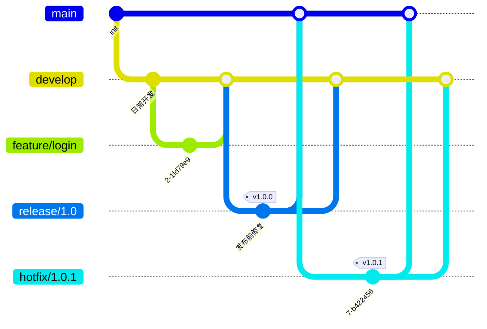
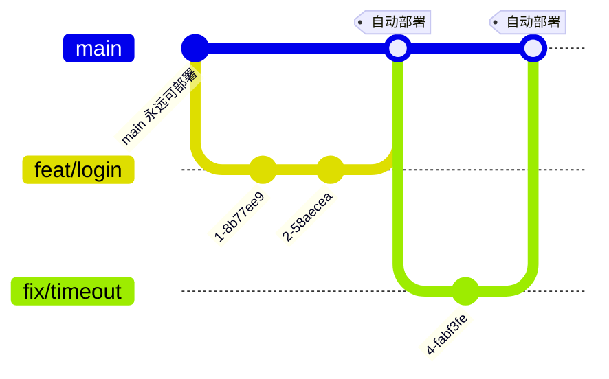
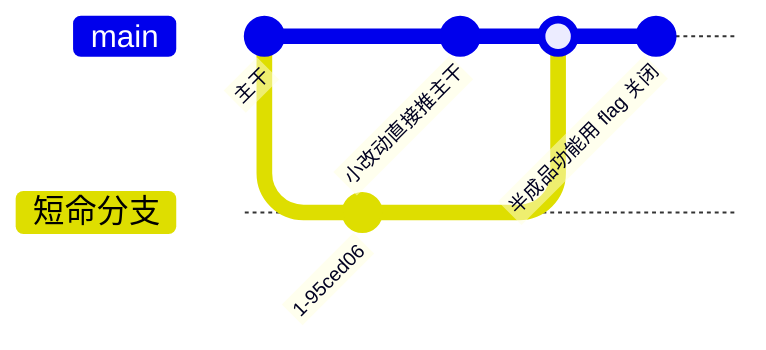

# 07 — 分支策略、事故排障与命令速查

> 团队级视角的收尾与工具书：三大分支策略怎么选、约定式提交怎么落地、高频事故怎么自救，外加一张浓缩全系列 01-06 的命令速查表——随用随查。

| 项目 | 内容 |
|------|------|
| **本篇定位** | 速查层 —— 团队级视角的收尾与工具书 |
| **预计时间** | 45 分钟 |
| **面试可答** | 三种分支策略的适用场景与选型依据 |

---

## 🎯 学习目标

- 说清 Git Flow / GitHub Flow / trunk-based 三种分支策略的结构、优缺点与适用场景
- 能根据团队规模、发布节奏、回滚需求、hotfix 频率为项目选型
- 掌握约定式提交（Conventional Commits）的格式与 CI 联动方式
- 面对 10 类高频事故，能按「症状 → 诊断 → 救援」清单自救
- 把本篇作为全系列 01-06 的浓缩索引，随用随查

---

## 1. 三大分支策略

分支策略回答两个问题：**代码从哪里出发、以什么路径进入可发布状态**。策略没有绝对优劣，只有与团队发布节奏的匹配度。

### 1.1 Git Flow：双长期分支 + 三类临时分支

由 Vincent Driessen 于 2010 年提出，是最早被广泛采用的模型：

| 分支 | 类型 | 职责 |
|------|------|------|
| `main` | 长期 | 只存放已发布版本的代码，每次发布打 tag |
| `develop` | 长期 | 日常开发集成分支，保存「下一个版本」的最新状态 |
| `feature/*` | 临时 | 新功能开发，从 develop 拉出，完成后合回 develop |
| `release/*` | 临时 | 发布准备（只修 bug、改版本号），同时回合 main 和 develop |
| `hotfix/*` | 临时 | 线上紧急修复，从 main 拉出，修完同时回合 main 和 develop |



- **适合**：版本制发布的软件——客户端 App、桌面软件、私有化交付产品，需要同时维护多个版本线
- **缺点**：复杂。分支多、合并路径多（hotfix 要回合两条分支），与持续部署天然冲突——代码从完成到上线要穿越 develop → release → main 三道关卡

> Git Flow 作者本人在 2020 年补充说明：如果你的产品是持续交付的 Web 服务，请考虑 GitHub Flow 等更简单的模型。

### 1.2 GitHub Flow：main 唯一长期分支 + PR

2011 年由 GitHub 团队提出，核心信条只有一条：**main 永远可部署**。



流程：从 main 拉短命分支 → 开发提交 → 开 PR → CI 检查 + Code Review → 合入 main → 自动部署。

- **适合**：持续部署的 Web 服务、SaaS、开源项目；hotfix 就是普通的 fix 分支，无需专门路径
- **缺点**：没有「版本缓冲」——若需要同时维护多个在途版本（如 v2.3 和 v2.4 并行开发），该模型无能为力；对 CI 门禁有一定依赖（main 可部署的前提是测试真的拦得住坏代码）

### 1.3 trunk-based：主干直接集成 + feature flag

所有开发者直接向主干（trunk/main）提交，或使用**不超过 1-2 天**的短命分支；未完成的功能用 feature flag 隐藏，保证主干随时可发布。



- **适合**：高成熟度团队——测试覆盖率高、CI 门禁严格、具备灰度/回滚能力（Google、Meta 均为极端的 trunk-based）
- **缺点**：对工程基础设施要求最高；没有严格 CI 和 feature flag 机制的团队强行采用，主干会被频繁弄坏

---

## 2. 选型决策表

| 决策维度 | Git Flow | GitHub Flow | trunk-based |
|---------|----------|-------------|-------------|
| 团队规模 | 中大型、多版本并行 | 小到中型 | 任意规模（但要求高工程成熟度） |
| 发布节奏 | 固定周期（月/季）版本制 | 随时发布、一天多次 | 持续部署、每小时级 |
| 回滚需求 | 靠 hotfix 分支修补旧版本 | revert + 重新部署 | feature flag 秒级关闭 + 重新部署 |
| hotfix 频率 | 高且有旧版本要维护 | 低，hotfix 即普通分支 | 极低，坏代码即时回滚 |
| 复杂度 | 高 | 低 | 模型最低、配套要求最高 |

按场景直接选型：

| 场景 | 推荐策略 |
|------|---------|
| 个人项目 / 开源库 / 小团队 Web 服务，持续部署 | GitHub Flow |
| App / 桌面软件 / 私有化交付，按版本发布、需维护旧版本 | Git Flow |
| SaaS 大厂团队，测试与 CI 门禁完善，追求部署频率 | trunk-based |
| 拿不准 | GitHub Flow——复杂化总比简单化容易，先从最简单的开始 |

---

## 3. 约定式提交（Conventional Commits）

提交信息不是写给自己看的备忘录，而是**可被机器解析的元数据**——changelog、版本号、发布说明都能自动生成，前提是格式统一。

### 3.1 格式与常用 type

```text
type(scope): description

[可选正文：说明 why，而不是 what]

[可选脚注：BREAKING CHANGE: 说明]
```

```bash
git commit -m "feat(auth): 新增手机号登录"
git commit -m "fix(upload): 修正大文件分片越界" -m "原实现未对齐 4MB 边界，导致 OSS 拒收"
```

| type | 含义 |
|------|------|
| `feat` | 新功能 |
| `fix` | 缺陷修复 |
| `docs` | 仅文档变更 |
| `style` | 格式调整（不影响逻辑：空格、分号等） |
| `refactor` | 重构（既非新功能也非修 bug） |
| `perf` | 性能优化 |
| `test` | 增删测试 |
| `build` | 构建系统或外部依赖变更 |
| `ci` | CI 配置变更 |
| `chore` | 其余维护性操作 |
| `revert` | 回滚某个提交 |

**破坏性变更**有两种写法，都会触发主版本号升级：

```bash
git commit -m "feat(api)!: 响应结构改为分页对象"   # type 后加 !
# 或在脚注中声明
git commit -m "feat(api): 重构响应结构" -m "BREAKING CHANGE: data 字段由数组改为 { list, total }"
```

> 本仓库的 [agents.md](../../../../agents.md) 采用同一约定（feat / docs / fix / refactor / chore），提交信息即知识库的变更日志。

### 3.2 与 CI 联动

| 环节 | 工具 | 作用 |
|------|------|------|
| 本地提交时 | commitlint + husky（commit-msg hook） | 格式不合规直接拒绝提交，把问题拦在推送前 |
| 发布时 | semantic-release | 按提交类型自动升版本号、生成 CHANGELOG、打 tag 发布（详见 [06 篇](./06-git-advanced-toolbox.md)的 tag 与发布） |

约定式提交的价值链条：**规范的提交信息 → 自动 changelog / 版本号 → tag → CI/CD 自动发布**，Git 历史本身成为交付流水线的输入。

---

## 4. 高频事故处理清单

先诊断、再救援——任何事故第一步都是搞清楚「我在哪、历史变成什么样了」：

```bash
git status                       # 我在哪个分支、有无未完成的操作
git log --oneline --graph --all  # 当前引用图谱
git reflog                       # 我的全部 HEAD 移动记录（救援的根本依据）
```

| # | 症状 | 诊断命令 | 救援命令 |
|---|------|---------|---------|
| 1 | 提交到了错误分支（未推送） | `git log --oneline -3` | `git switch 正确分支 && git cherry-pick <sha>`，再回错误分支 `git reset --hard HEAD~1`（详见 [05 篇](./05-git-undo-rescue.md)） |
| 2 | commit 消息写错 | `git log -1` | 未推送：`git commit --amend`；已推送：amend 后 `git push --force-with-lease`（公共分支勿改） |
| 3 | 忘记 .gitignore 提交了 node_modules / .env | `git ls-files \| grep node_modules` | `git rm -r --cached node_modules && git commit`；`.env` 同理且**立即轮换密钥**，历史清理用 git filter-repo（详见 [01 篇](./01-git-overview-basics.md)） |
| 4 | rebase 冲突解到一半想放弃 | `git status`（显示 rebase in progress） | `git rebase --abort` 回到 rebase 前状态；merge 冲突同理 `git merge --abort` |
| 5 | push 被拒（non-fast-forward） | `git fetch && git log HEAD..origin/main --oneline` | `git pull --rebase` 后重新 push；确需覆盖远程时用 `--force-with-lease` 而非 `--force`（详见 [04 篇](./04-git-remote-collaboration.md)） |
| 6 | 误删分支 | `git reflog` 找到该分支最后提交 | `git branch 分支名 <sha>` 重建（详见 [05 篇](./05-git-undo-rescue.md)） |
| 7 | hard reset 丢了提交 | `git reflog` | `git reset --hard <sha>` 或 `git cherry-pick <sha>` 找回 |
| 8 | 合并错分支想撤回 | `git log --oneline --merges -1` | 未推送：`git reset --hard ORIG_HEAD`；已推送：`git revert -m 1 <merge-sha>` |
| 9 | detached HEAD 上做了提交 | `git log --oneline -3`（HEAD 不指向任何分支） | `git switch -c 新分支` 把提交挂到新分支上，提交不会丢（详见 [02 篇](./02-git-internals-model.md)） |
| 10 | cherry-pick 冲突 | `git status` | 解决冲突后 `git cherry-pick --continue`；想放弃 `git cherry-pick --abort` |

三条心法：

1. **只要提交过，reflog 就能救**——Git 几乎不真正删除提交，丢的只是引用
2. **已推送的历史用 revert，不用 reset**——不要改写别人可能已经拉取的历史
3. **拿不准就先建分支备份**：`git branch backup-<日期>`，救援操作永远有退路

---

## 5. 命令速查表

全系列 01-06 的浓缩索引，按场景分组。

### 5.1 基础操作（01 篇）

| 命令 | 作用 | 详见 |
|------|------|------|
| `git init` | 初始化仓库 | [01](./01-git-overview-basics.md) |
| `git clone <url>` | 克隆远程仓库（含完整历史） | [01](./01-git-overview-basics.md) |
| `git status -s` | 简洁查看三区状态 | [01](./01-git-overview-basics.md) |
| `git add <file>` / `git add -p` | 暂存改动 / 逐块挑选 | [01](./01-git-overview-basics.md) |
| `git commit -m "msg"` | 提交 | [01](./01-git-overview-basics.md) |
| `git diff` / `git diff --staged` | 工作区 vs 暂存区 / 暂存区 vs HEAD | [01](./01-git-overview-basics.md) |
| `git log --oneline --graph --decorate --all` | 查看历史与分支拓扑 | [01](./01-git-overview-basics.md) |
| `git rm --cached <file>` | 取消跟踪但保留本地文件 | [01](./01-git-overview-basics.md) |

### 5.2 分支与合并（03 篇）

| 命令 | 作用 | 详见 |
|------|------|------|
| `git switch -c <分支>` | 创建并切换分支 | [03](./03-git-branch-merge-rebase.md) |
| `git switch <分支>` | 切换分支 | [03](./03-git-branch-merge-rebase.md) |
| `git merge <分支>` | 合并分支（可能 fast-forward） | [03](./03-git-branch-merge-rebase.md) |
| `git merge --no-ff <分支>` | 强制生成合并提交，保留分支痕迹 | [03](./03-git-branch-merge-rebase.md) |
| `git merge --squash <分支>` | 压缩为一个提交再手动 commit | [03](./03-git-branch-merge-rebase.md) |
| `git rebase <基线>` | 变基：把提交搬到新基线上重放 | [03](./03-git-branch-merge-rebase.md) |
| `git branch -d` / `-D <分支>` | 删除分支（-D 强删未合并分支） | [03](./03-git-branch-merge-rebase.md) |

### 5.3 远程协作（04 篇）

| 命令 | 作用 | 详见 |
|------|------|------|
| `git remote -v` | 查看远程仓库地址 | [04](./04-git-remote-collaboration.md) |
| `git fetch` | 只拉取远程更新，不动工作区 | [04](./04-git-remote-collaboration.md) |
| `git pull --rebase` | 拉取并变基，避免无意义合并提交 | [04](./04-git-remote-collaboration.md) |
| `git push -u origin <分支>` | 首次推送并建立上游跟踪 | [04](./04-git-remote-collaboration.md) |
| `git push --force-with-lease` | 安全强推（仅覆盖无他人新提交的远程分支） | [04](./04-git-remote-collaboration.md) |

### 5.4 撤销与救援（05 篇）

| 命令 | 作用 | 详见 |
|------|------|------|
| `git restore <file>` | 丢弃工作区改动 | [05](./05-git-undo-rescue.md) |
| `git restore --staged <file>` | 撤出暂存区（保留工作区改动） | [05](./05-git-undo-rescue.md) |
| `git reset --soft <sha>` | 移动 HEAD，改动留在暂存区 | [05](./05-git-undo-rescue.md) |
| `git reset <sha>` | 移动 HEAD，改动留在工作区（默认 --mixed） | [05](./05-git-undo-rescue.md) |
| `git reset --hard <sha>` | 移动 HEAD 并丢弃改动（危险） | [05](./05-git-undo-rescue.md) |
| `git revert <sha>` | 生成反向提交，安全撤销已推送的变更 | [05](./05-git-undo-rescue.md) |
| `git stash` / `git stash pop` | 暂存/恢复未提交的现场 | [05](./05-git-undo-rescue.md) |
| `git cherry-pick <sha>` | 摘取单个提交应用到当前分支 | [05](./05-git-undo-rescue.md) |
| `git reflog` | 查看 HEAD 全部移动记录，救援根本依据 | [05](./05-git-undo-rescue.md) |

### 5.5 历史整理与工程化（06 篇）

| 命令 | 作用 | 详见 |
|------|------|------|
| `git rebase -i HEAD~N` | 交互式整理最近 N 个提交（squash/fixup/reword/reorder） | [06](./06-git-advanced-toolbox.md) |
| `git commit --amend` | 修订最近一次提交（内容或消息） | [06](./06-git-advanced-toolbox.md) |
| `git bisect start/bad/good` | 二分定位引入 bug 的提交 | [06](./06-git-advanced-toolbox.md) |
| `git blame <file>` | 逐行追溯最后修改人与提交 | [06](./06-git-advanced-toolbox.md) |
| `git worktree add <dir> <分支>` | 同仓库多工作区并行 | [06](./06-git-advanced-toolbox.md) |
| `git tag v1.0.0 && git push --tags` | 打版本 tag 并推送 | [06](./06-git-advanced-toolbox.md) |

### 5.6 排障专用

| 命令 | 作用 | 详见 |
|------|------|------|
| `git branch --show-current` | 确认当前分支 | [03](./03-git-branch-merge-rebase.md) |
| `git rebase --abort` / `--continue` | 放弃 / 继续变基 | [03](./03-git-branch-merge-rebase.md) |
| `git merge --abort` | 放弃进行中的合并 | [03](./03-git-branch-merge-rebase.md) |
| `git cherry-pick --abort` | 放弃进行中的 cherry-pick | [05](./05-git-undo-rescue.md) |
| `git log HEAD..origin/main --oneline` | 查看远程领先了哪些提交 | [04](./04-git-remote-collaboration.md) |
| `git rev-parse HEAD` | 解析引用对应的完整 SHA | [02](./02-git-internals-model.md) |

---

## 6. 收尾：Git 在 CI/CD 中的位置与学习延伸

Git 是整条交付流水线的事实来源——CI/CD 的每一次触发、每一道门禁、每一次发布都挂在 Git 事件上：


| Git 事件 | CI/CD 侧行为 |
|---------|-------------|
| PR / MR 打开 | 触发 lint + test + build，失败则阻断合并 |
| 分支保护规则 | main 禁止直接 push，必须 PR + CI 通过 + Review |
| push tag `v*` | 触发发布流水线：构建制品 → 部署生产 |
| commit 信息 | semantic-release 据此生成 changelog 与版本号 |

CI 侧的 Pipeline 设计、质量门禁与部署策略，见 [CI/CD 学习大纲](../../ci/ci-learning-outline.md)。

**学习延伸**：

- [Pro Git 中文版（免费在线）](https://git-scm.com/book/zh/v2)——第 3、7、10 章值得反复读
- [Git 官方参考文档](https://git-scm.com/doc)——任何命令的权威出处
- 读完本系列后建议完整过一遍 `git help <命令>` 的 manual，验证自己的理解

---

## 🎯 实战：为演练仓库制定一份分支策略

场景设定：`git-playground` 是一个**个人项目，持续部署，偶尔需要 hotfix**。按第 2 节决策表——个人/小团队 + 持续部署 + 无旧版本维护需求 → **GitHub Flow**。

```bash
cd git-playground
```

第一步，写一份团队约定文档（30 行以内，个人项目也值得写——它是给三个月后的自己看的）：

```bash
cat > WORKFLOW.md <<'EOF'
# git-playground 分支约定（GitHub Flow）

## 分支模型
- main 是唯一长期分支，永远可部署；合入即触发部署
- 所有开发在 feature/fix 分支进行，命名：feat/*、fix/*、docs/*
- 分支生命周期不超过 3 天，超时就拆小

## 提交流程
1. git switch -c feat/xxx main        # 从最新 main 拉分支
2. 开发 + 提交（约定式提交：feat/fix/docs/refactor/chore）
3. git pull --rebase origin main      # 推送前同步主干
4. git push -u origin feat/xxx        # 推送并开 PR
5. CI 通过后合入 main，删除远程分支

## 质量底线
- main 分支保护：禁止直接 push，必须 PR + CI 通过
- 提交信息遵循 Conventional Commits，commitlint 本地拦截
- hotfix = 普通的 fix/* 分支，无专门路径

## 发布与回滚
- 合入 main 自动部署；tag 格式 v1.x.y 用于标注里程碑
- 回滚用 git revert（不改写已推送历史），重新走 PR 流程
EOF
```

第二步，列出分支保护配置要点（以 GitHub 为例：仓库 Settings → Branches → Add branch protection rule，规则对象填 `main`）：

| 配置项 | 设置 | 目的 |
|--------|------|------|
| Require pull request before merging | 开启，至少 1 个 approve | 杜绝直推 main |
| Require status checks to pass | 开启，勾选 lint / test / build | CI 门禁强制化 |
| Require branches to be up to date | 开启 | 合并前先同步 main，提前暴露冲突 |
| Do not allow force pushes / deletions | 默认开启即可 | 保护主干历史不可篡改 |
| Include administrators | 开启 | 管理员同样受约束 |

第三步，用一次真实流程验证约定可行：

```bash
git switch -c feat/workflow-demo main   # 按约定从 main 拉分支
git add WORKFLOW.md
git commit -m "docs: 制定 GitHub Flow 分支约定"
git switch main
git merge --no-ff feat/workflow-demo    # 本地演练用 merge 模拟 PR 合入
git tag v0.1.0                          # 为里程碑打 tag
git log --oneline --graph --decorate    # 检查历史形状符合预期
```

---

## 🏋️ 练习

### 练习 1：用事故清单自救一次

- **要求**：在 `git-playground` 中故意制造「提交到错误分支」事故——在 main 上提交一个本应属于功能分支的改动，然后按第 4 节清单把它搬回正确分支，并清理 main。
- **提示**：`git log --oneline -3` 记下 SHA → `git switch -c fix/xxx`（此时提交已在该分支上）→ 回到 main 用 `git reset --hard HEAD~1` 清理；全程未推送，可放心 reset。
- **预期效果**：`git log --oneline --graph --all` 显示该提交只存在于功能分支，main 恢复原状，并能说出为什么未推送时可以用 hard reset。

### 练习 2：为你当前项目做策略选型

- **要求**：画出你正在参与的一个真实项目的分支模型现状，对照第 2 节决策表评估其合理性；若不匹配，写出不超过 5 条的改进建议。
- **提示**：先回答四个问题——发布节奏是什么？要不要维护旧版本？hotfix 多不多？CI 门禁严不严？再看现状与答案是否一致。
- **预期效果**：产出一页纸的选型分析（现状图 + 四问答案 + 结论），面试 Q2 直接用这份素材。

### 练习 3：跑通一次约定式提交闭环

- **要求**：在演练仓库连续写 5 个约定式提交（至少覆盖 feat / fix / docs / chore 四种 type），再用 `git log --oneline` 验证历史可读性；可选：接入 commitlint + husky，尝试提交一条 `update` 开头的消息看它如何被拦截。
- **提示**：commitlint 通过 commit-msg hook 生效（回顾 [06 篇](./06-git-advanced-toolbox.md) hooks 一节）；拦截后按正确格式重写即可。
- **预期效果**：`git log --oneline` 输出每条都能按 type 归类，并能解释这些前缀如何驱动 semantic-release 的版本号决策。

---

## 🆚 对比板块：Git Flow vs GitHub Flow vs trunk-based

| 维度 | Git Flow | GitHub Flow | trunk-based |
|------|----------|-------------|-------------|
| 长期分支数 | 2（main + develop） | 1（main） | 1（trunk/main） |
| 发布方式 | release 分支 + tag，周期制 | 合入 main 即部署 | 主干每次提交均可部署 |
| hotfix 路径 | main → hotfix/* → 回合 main 与 develop | 普通 fix/* 分支走 PR | 直接修主干或极短分支 + 立即部署 |
| 复杂度 | 高（分支多、合并路径多） | 低 | 分支模型最低，但配套（CI/flag/灰度）要求最高 |
| 适用团队 | 版本制发布、需维护多版本线 | 持续部署的 Web 服务、小团队、开源 | 测试与 CI 成熟度高的大团队 |

> 追问预警：面试官常问「trunk-based 没有分支，怎么隔离半成品功能？」——答案是 feature flag 而非分支：代码照常合并，功能开关控制暴露，发布与功能完成解耦。另注意别把「Git Flow 过时了」说死——版本制发布的客户端场景它依然是合理选择。

---

## ❓ 面试问答

### Q1：三种分支策略怎么选？

- 先看**发布节奏**：版本制发布（App、私有化交付）选 Git Flow，它用 release/hotfix 分支显式管理版本线；持续部署的 Web 服务选 GitHub Flow，main 唯一长期分支、PR 合入即部署
- 再看**团队成熟度**：测试覆盖率高、CI 门禁严格、有 feature flag 与灰度能力的团队可以走 trunk-based，集成频率最高、反馈最快
- 最后看**维护成本**：分支模型越复杂，合并冲突与误操作概率越高；拿不准就从 GitHub Flow 开始，简单模型升级到复杂模型远比反向容易
- 加分点：提一句 Git Flow 作者自己建议持续交付项目改用更简单模型

### Q2：你的团队用什么流程，为什么？

- 参考回答结构：先说结论（如 GitHub Flow），再用事实支撑——我们每天可多次发布，没有旧版本维护需求，所以不需要 develop 和 release 分支
- 配套机制要说全：main 分支保护 + PR 必须 CI 通过 + 约定式提交 + tag 标记里程碑；hotfix 就是加急的 fix PR，无特殊路径
- 体现取舍意识：承认该模型的边界——如果哪天要并行维护多个大版本，会重新评估引入 release 分支
- 用第 6 节实战产出的 WORKFLOW.md 作为具体素材，避免空谈

### Q3：如何保证提交质量？

- **格式层**：约定式提交（type(scope): description），commitlint + husky 挂在 commit-msg hook 上，本地就拦掉不合规消息
- **内容层**：pre-commit hook 跑 lint / 类型检查；PR 侧 CI 门禁（lint + test + build + 安全扫描）不通过禁止合并，配合分支保护强制执行
- **发布层**：规范的提交信息由 semantic-release 自动推导版本号与 changelog，反过来激励团队认真写提交信息——写好提交有真实收益
- 一句话总结：提交质量 = 约定（Conventional Commits）+ hooks 本地拦截 + CI 门禁兜底，三层缺一不可

---

## ✅ 自检清单

- [ ] 能画出三种分支策略的结构图，并说出各自适合什么发布节奏
- [ ] 给定团队规模/发布节奏/回滚需求/hotfix 频率四个条件，能给出选型结论及理由
- [ ] 能默写约定式提交格式与 feat/fix/docs/refactor/chore 等常用 type
- [ ] 面对第 4 节 10 类事故，能在不看表的情况下说出诊断与救援命令
- [ ] 理解「未推送用 reset、已推送用 revert」的边界
- [ ] 能为仓库配置分支保护要点（PR 必须、CI 必须通过、禁止 force push）
- [ ] 已为演练仓库写好 WORKFLOW.md 并打出一个版本 tag

---

## 🔗 相关文档

- 上一篇：[06 - 历史整理 + bisect + worktree + hooks](./06-git-advanced-toolbox.md)
- 大纲：[Git 学习大纲](../git-learning-outline.md)
- 关联模块：[CI/CD 学习大纲](../../ci/ci-learning-outline.md)（PR 触发、分支保护、tag 发布的落地侧）
- 关联模块：[Docker 学习大纲](../../docker/docker-learning-outline.md)（CI 中的镜像构建依赖 Git commit/tag）
- [Git 官方文档](https://git-scm.com/doc)
- [Pro Git 中文版（免费在线）](https://git-scm.com/book/zh/v2)

---

*最后更新：2026年8月*
