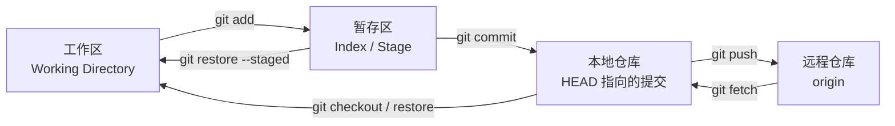
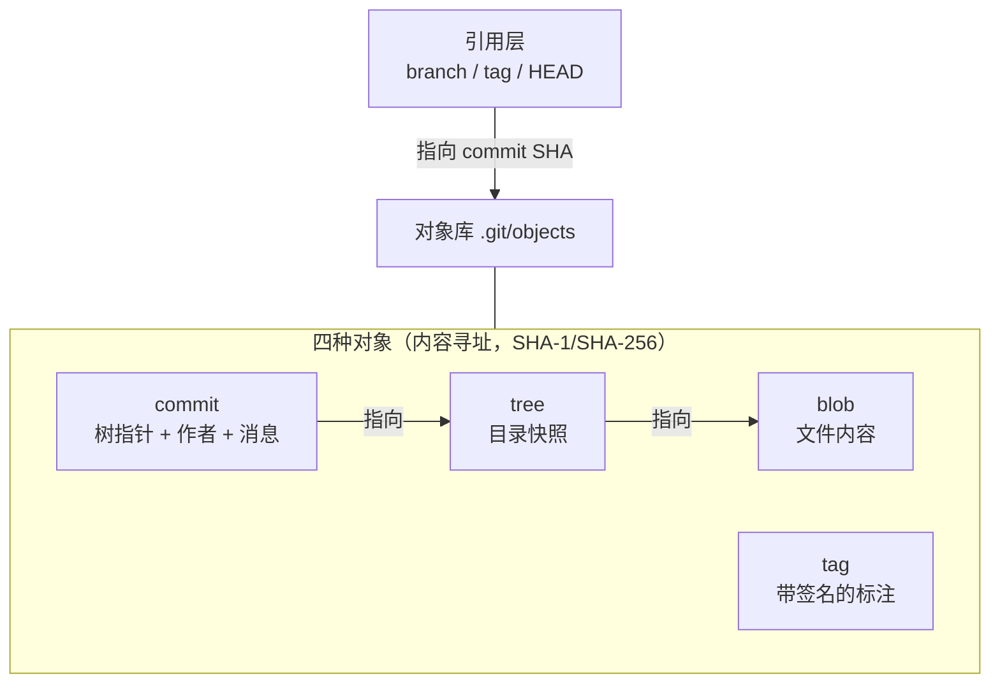
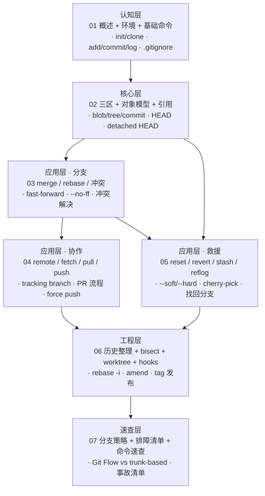

# Git 学习大纲

> 面向资深前端/全栈工程师的 Git 系统化补课 —— 不是零基础科普，而是把「每天在用」的 Git 从肌肉记忆升级为原理级理解：面试能答、事故能救、策略能设计。

---

## 📌 元信息

| 项目 | 说明 |
|------|------|
| **版本基线** | Git 2.55（2026-06，当前稳定版），命令以现代写法为准（`switch`/`restore`） |
| **预计学习时间** | 核心 5 篇 + 进阶 2 篇（约 8-12 小时） |
| **目标读者** | 已日常使用 Git（clone/commit/push）的前端/全栈工程师，目标是系统化与原理级补课 |
| **前置模块** | Linux Shell 基础；有一个可动手的本地项目 |
| **面试覆盖** | 12 道高频题 + 每篇内嵌面试问答 |
| **实战产出** | 在本地演练仓库完成：分支开发 → 冲突解决 → 历史整理 → 事故恢复全流程 |

---

## 🎯 学习目标

完成本模块学习后，你应该能够：

1. 用「三区 + 对象模型 + 引用」的心智模型解释任何 Git 命令的行为
2. 独立完成日常开发闭环：分支开发、提交、变基、合并、推送
3. 正确解决合并冲突，说清 `merge` 与 `rebase` 的区别与各自适用场景
4. 熟练使用 `reflog` / `reset` / `revert` / `stash` / `cherry-pick` 处理误操作事故
5. 用 `rebase -i` 整理提交历史，用 `bisect` 定位引入 bug 的提交
6. 为团队选择合适的分支策略（GitHub Flow / trunk-based / Git Flow）
7. 面试中能回答 Git 原理类问题（对象存储、fast-forward、detached HEAD 等）

---

## 📋 前置要求

| 领域 | 要求 |
|------|------|
| 命令行 | 熟悉终端、目录切换、环境变量 |
| Git 基础 | 用过 `clone` / `add` / `commit` / `push`（不要求理解原理） |
| 练习环境 | 本地有 Git ≥ 2.30，`git --version` 可查 |

---

## 🏗️ Git 工作模型（全教程的心智主线）



底层存储（面试核心）：



> 记住一条主线：**分支是移动的指针，HEAD 是指向指针的指针，提交是不可变的内容寻址对象**。后面所有命令的行为都能从这三句话推导。

---

## 🗺️ 学习路径图



---

## 📚 篇目规划

| 序号 | 篇名 | 层 | 一句话定位 | 核心知识点 | 前置篇目 |
|------|------|----|-----------|-----------|---------|
| 01 | [git-overview-basics.md](./doc/01-git-overview-basics.md) | 认知层 | Git 是什么、怎么装的、基础命令怎么跑 | VCS 演进、分布式 vs 集中式、安装配置、init/clone、add/commit/status/diff/log、.gitignore | 无 |
| 02 | [git-internals-model.md](./doc/02-git-internals-model.md) | 核心层 | 用三区 + 对象模型解释一切命令行为 | 三区流转、blob/tree/commit/tag、SHA 内容寻址、HEAD/分支/tag 引用、.git 目录结构、detached HEAD | 01 |
| 03 | [git-branch-merge-rebase.md](./doc/03-git-branch-merge-rebase.md) | 应用层 | 分支开发与两条整合路线 | branch/switch、merge（fast-forward vs 三方合并）、rebase、冲突解决、merge 策略（--no-ff/--squash） | 02 |
| 04 | [git-remote-collaboration.md](./doc/04-git-remote-collaboration.md) | 应用层 | 多人协作的远程仓库工作流 | remote、fetch vs pull、push 与上游分支、tracking branch、PR/MR 流程、force push 安全姿势 | 03 |
| 05 | [git-undo-rescue.md](./doc/05-git-undo-rescue.md) | 应用层 | 误操作急救箱：任何状态都能救回来 | restore/reset（--soft/--mixed/--hard）、revert、stash、reflog、cherry-pick、找回「删除」的分支 | 02、03 |
| 06 | [git-advanced-toolbox.md](./doc/06-git-advanced-toolbox.md) | 工程层 | 历史整理与工程化工具箱 | rebase -i（reword/squash/fixup/drop）、amend、bisect、blame、worktree、hooks、tag 与版本发布 | 04、05 |
| 07 | [git-workflow-cheatsheet.md](./doc/07-git-workflow-cheatsheet.md) | 速查层 | 分支策略选型 + 事故排障 + 随用随查 | Git Flow / GitHub Flow / trunk-based 对比、约定式提交、高频事故处理清单、命令速查表 | 06 |

### 每篇要素分配

每篇统一包含：

- **头部元信息**：本篇定位、预计时间、「面试可答」一句话摘要
- **代码示例**：完整可复制执行的命令序列（在演练仓库中逐步验证）
- **练习**：要求 + 提示 + 预期效果三段式，难度跨篇递增
- **面试问答**：本篇对应高频题（含追问：陷阱、对比、原理）
- **文末对比板块**：如 merge vs rebase vs squash、reset vs revert vs restore、三种分支策略对比

---

## 📚 文档目录规划

```text
src/deploy/git/
├── git-learning-outline.md            # 本文件：学习地图
├── doc/
│   ├── 01-git-overview-basics.md      # 概述 + 环境搭建 + 基础命令
│   ├── 02-git-internals-model.md      # 三区 + 对象模型 + 引用（心智模型）
│   ├── 03-git-branch-merge-rebase.md  # 分支、merge/rebase、冲突解决
│   ├── 04-git-remote-collaboration.md # 远程仓库与团队协作
│   ├── 05-git-undo-rescue.md          # 撤销与事故救援
│   ├── 06-git-advanced-toolbox.md     # 历史整理 + bisect + worktree + hooks
│   └── 07-git-workflow-cheatsheet.md  # 分支策略 + 排障清单 + 速查
└── assets/                            # 三区流转图、提交图谱等配图
```

---

## 🎮 练习递进线

所有练习在同一个本地演练仓库 `git-playground` 中连续进行，跨篇累积：

| 阶段 | 对应篇目 | 练习内容 |
|------|---------|---------|
| **基础操作** | 01-02 | 初始化仓库 → 提交 3 个文件 → 用 `git cat-file` / `git rev-parse` 观察对象与引用，画出当前提交图 |
| **组合应用** | 03-04 | 开两个功能分支制造同文件冲突 → 分别用 merge 与 rebase 整合 → 对比历史形状；配置第二个本地仓库当 remote，演练 fetch/pull/push |
| **事故演练** | 05 | 故意制造四类事故：误删分支、hard reset 丢提交、改错提交消息、工作区改乱，逐一用 reflog/reset/revert 救回 |
| **实战整合** | 06-07 | 用 rebase -i 把 5 个零碎提交整理成 2 个语义提交 → bisect 定位预埋的 bug → 为演练仓库打 tag 并写一份团队分支策略 |

---

## ❓ 面试覆盖图

| 高频面试点 | 覆盖篇目 |
|-----------|---------|
| Git 与 SVN 的区别（分布式 vs 集中式） | 01 |
| 三区（工作区/暂存区/仓库）流转与 `git add` 的作用 | 02 |
| Git 对象模型：blob/tree/commit 如何组织、为什么内容寻址 | 02 |
| HEAD 是什么、detached HEAD 如何产生与处理 | 02、05 |
| `merge` 与 `rebase` 的区别、各自适用场景与风险 | 03 |
| fast-forward 合并是什么、什么时候该用 `--no-ff` | 03 |
| 冲突是如何产生的、如何解决、rebase 冲突与 merge 冲突的差异 | 03 |
| `fetch` 与 `pull` 的区别、`pull --rebase` 的意义 | 04 |
| `reset --soft/--mixed/--hard` 与 `revert` 的区别 | 05 |
| `reflog` 是什么、能救什么、救不了什么 | 05 |
| 如何整理提交历史（squash/fixup）、已推送的历史为什么不能随意改 | 06 |
| 团队分支策略选型（Git Flow / GitHub Flow / trunk-based） | 07 |

---

## ✅ 完成标准

- [ ] 能画出三区 + 对象模型的完整流转图，并解释每条命令移动了什么
- [ ] 能独立解决一次真实的合并冲突（含 rebase 中的冲突）
- [ ] 能用 reflog 找回被 hard reset 丢弃的提交
- [ ] 能用 rebase -i 完成 squash、reword、reorder 各一次
- [ ] 能用 bisect 定位预埋 bug 的引入提交
- [ ] 能说出三种分支策略的适用场景并为团队选型
- [ ] 能回答面试覆盖图中 10 道以上问题

---

## 🔗 关联模块

- [CI/CD 学习大纲](../ci/ci-learning-outline.md)（以 Git 为前置：PR 触发、分支保护、tag 发布）
- [Docker 学习大纲](../docker/docker-learning-outline.md)（CI 中的镜像构建依赖 Git commit/tag）

---

## 📝 版本与时效说明

- 基线版本：Git 2.55（2026-06 发布）；教程命令兼容 Git ≥ 2.30
- 命令选型：优先现代写法 `git switch` / `git restore`（2.23+），`checkout` 仅在需要恢复提交的场景说明
- 新特性观察：`git history`（2.54+ 实验性命令，reword/split/fixup）仅作趋势提及，不作为教学内容主体
- 默认分支：一律使用 `main`（GitHub 默认；Git 3.0 计划将 `init.defaultBranch` 默认改为 main）
