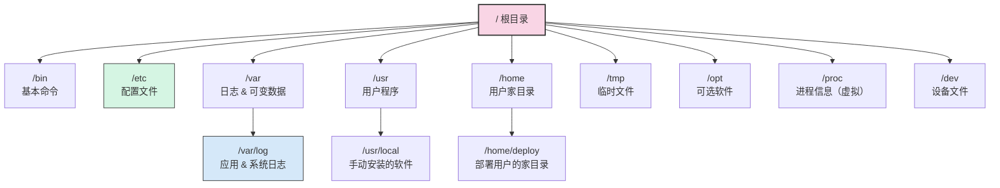
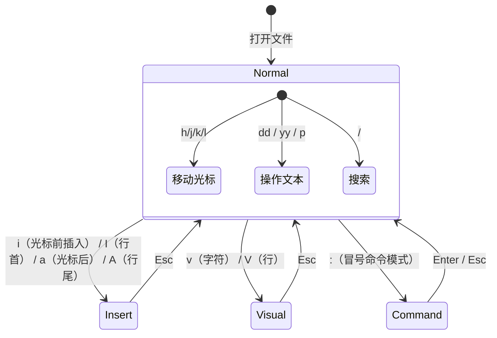

# 01 — 文件系统与基础命令

> 对应学习路径：**Day 1**
> 目标产出：能在服务器上定位文件、查看目录结构、修改配置
> 目标读者：后端开发者、从 GUI 转向命令行的开发者

---

## 1. Linux 目录结构

Linux 的文件系统是一棵从 `/`（根目录）开始的倒置树。以下是你最常打交道的主要子目录及其用途：

| 目录 | 用途 | 开发者关注点 |
|------|------|-------------|
| `/bin` | 系统基础命令（`ls`、`cp`、`mv` 等），所有用户可用 | 常用命令所在 |
| `/etc` | 系统配置文件（如 `nginx.conf`、`ssh/sshd_config`） | **改配置最常去的目录** |
| `/var` | 可变数据——日志（`/var/log`）、缓存、数据库文件 | **查日志的地方** |
| `/usr` | 用户程序和数据（`/usr/local` 通常放手动安装的软件） | 安装的运行时、工具链所在 |
| `/home` | 用户家目录（`/home/deploy`、`/home/ubuntu`） | 日常操作的工作目录 |
| `/tmp` | 临时文件（重启后清空） | 临时存放下载文件或测试数据 |
| `/opt` | 可选第三方软件包 | 某些大型软件安装在此 |



### 相对路径 vs 绝对路径

| 类型 | 定义 | 示例 |
|------|------|------|
| **绝对路径** | 从根目录 `/` 开始，完整描述位置 | `/etc/nginx/nginx.conf` |
| **相对路径** | 从当前目录开始，用 `.` 和 `..` 描述位置 | `./config/nginx.conf` 或 `../logs/access.log` |

- `.` 代表当前目录
- `..` 代表上级目录
- 日常操作中优先用绝对路径拼命令（不容易搞错），用相对路径写脚本（方便移植）

---

## 2. 文件操作基础命令

### 2.1 定位与查看：`pwd`、`ls`

```bash
pwd                        # 显示当前工作目录的绝对路径

ls                         # 列出当前目录内容（简洁模式）
ls -l                      # 长格式：权限、链接数、所有者、大小、修改时间、文件名
ls -a                      # 显示所有文件（包括 . 和 ..）
ls -la                     # 最常用组合：长格式 + 显示隐藏文件
ls -lh                     # 长格式 + 人类可读文件大小（K、M、G）
ls -lt                     # 长格式 + 按修改时间排序（最新在前）
ls -R                      # 递归列出子目录
```

> **关于 `.` 和 `..`**：每个目录下都有这两个特殊条目——`.` 指向自身，`..` 指向上级目录。`ls -la` 时看到的 `.xxx` 文件是隐藏文件（如 `.bashrc`、`.env`、`.gitignore`），用 `ls -a` 或 `ls -la` 才能看到。

### 2.2 切换目录：`cd`

```bash
cd /etc/nginx              # 切换到绝对路径
cd ../logs                 # 切换到上级目录下的 logs 子目录
cd ~                       # 切换到当前用户的家目录（/home/xxx）
cd -                       # 切换到上一个工作目录（来回切换很有用）
```

> **`cd -` 实战场景**：你在 `/etc/nginx` 改配置，然后 `cd /var/log` 看日志，这时想回 `/etc/nginx`——直接 `cd -`，不用再打一遍路径。

### 2.3 复制：`cp`

```bash
cp file.txt backup.txt              # 复制文件
cp -r config/ config-backup/        # -r 递归复制目录
cp -i file.txt target/              # -i 覆盖前提示（安全）
cp -v file.txt target/              # -v 显示复制过程
cp -p file.txt target/              # -p 保留原文件属性（权限、时间戳）
```

> **最佳实践**：修改重要配置文件前先 `cp -p /etc/nginx/nginx.conf /etc/nginx/nginx.conf.bak`，保留原属性方便还原。

### 2.4 移动 / 重命名：`mv`

```bash
mv file.txt /tmp/                   # 移动文件到 /tmp
mv oldname.txt newname.txt          # 重命名
mv -i file.txt target/              # 目标存在时提示确认
```

> `mv` 既可以移动文件，也可以重命名——在同一个目录下 `mv` 就是重命名。

### 2.5 删除：`rm`

```bash
rm file.txt                    # 删除文件
rm -r mydir/                   # -r 递归删除目录及其内容
rm -f file.txt                 # -f 强制删除（不提示）
rm -i file.txt                 # -i 删除前确认（推荐养成习惯）
```

> **安全删除三原则**：
> 1. 删除前先 `ls` 确认路径——确保你删的是对的文件和目录
> 2. 尽量用 `rm -i`，让系统再确认一次
> 3. 慎用 `rm -rf` 组合——`rm -rf /` 是灾难，`rm -rf ./*` 手滑了也会清空当前目录

### 2.6 创建目录：`mkdir`

```bash
mkdir mydir                         # 创建目录
mkdir -p parent/child/grandchild    # -p 递归创建（父目录不存在时自动创建）
```

> `mkdir -p` 是你部署时最常用的——你不需要关心上级目录是否存在，一条命令搞定。

### 2.7 创建文件与识别类型：`touch`、`file`

```bash
touch app.log              # 创建空文件（若已存在则更新修改时间）
file app.log               # 识别文件类型：文本、二进制、图片、压缩包等
```

> `file` 命令不依赖后缀名，它会读取文件头信息来判断真实类型。这在服务器上排查"这个文件是什么"时非常有用。

---

## 3. 文件查看与搜索

### 3.1 查看文件内容

| 命令 | 适用场景 | 示例 |
|------|---------|------|
| `cat` | 查看短文件（几十行以内） | `cat README.md` |
| `less` | 查看长文件（支持上下翻页、搜索） | `less /var/log/syslog` |
| `more` | 查看长文件（仅支持下翻） | `more longfile.txt` |
| `head` | 只看文件开头（默认 10 行） | `head -n 20 app.log` |
| `tail` | 只看文件末尾（默认 10 行） | `tail -n 50 app.log` |
| `tail -f` | **实时跟踪**日志文件（最常用的日志查看方式） | `tail -f access.log` |

> **`less` 使用技巧**：
> - `/search_term`：向下搜索
> - `?search_term`：向上搜索
> - `n` / `N`：下一个 / 上一个匹配
> - `g` / `G`：跳到第一行 / 最后一行
> - `q`：退出

### 3.2 `find`：查找文件

```bash
find . -name "*.log"                # 按文件名查找（当前目录下所有 .log 文件）
find /var -type f -name "*.log"     # -type f 只查文件（排除目录）
find /var -type d -name "log"       # -type d 只查目录
find . -size +10M                   # 查找大于 10MB 的文件
find . -mtime -7                    # 最近 7 天内修改过的文件
```

> **`find` 参数速记**：
> - `-name`：按文件名匹配（支持通配符 `*` `?`）
> - `-type`：`f` 文件、`d` 目录、`l` 符号链接
> - `-size`：`+` 大于、`-` 小于，单位 `k` `M` `G`
> - `-mtime`：`+7` 超过 7 天、`-7` 7 天内

### 3.3 `tree`：查看目录树

```bash
# 需要先安装
sudo apt install tree           # Ubuntu/Debian
sudo yum install tree           # CentOS/RHEL

tree                            # 当前目录树
tree -L 2                       # 只显示 2 层深度
tree -I 'node_modules'          # 排除 node_modules
```

> 在部署或交接项目时，用 `tree` 展示目录结构是最清晰的方式。

---

## 4. vim 基础操作

> vim 是 Linux 服务器上**默认都有的文本编辑器**。你不需要精通它，但至少要能——打开文件、改内容、保存退出。

### 4.1 三种模式



| 模式 | 用途 | 如何进入 |
|------|------|---------|
| **Normal**（普通模式） | 移动光标、删除、复制、粘贴 | 打开文件即进入，或按 `Esc` |
| **Insert**（插入模式） | 输入文本 | 按 `i` 进入，按 `Esc` 返回 Normal |
| **Visual**（可视模式） | 选中文本后批量操作 | 按 `v` 进入 |
| **Command**（命令模式） | 保存、退出、替换等 | 在 Normal 下按 `:` 进入 |

### 4.2 生存必备操作

```text
# 进入与退出
vim file.txt           # 打开文件
:q                     # 退出（未修改时）
:q!                    # 强制退出（不保存修改）
:w                     # 保存
:wq                    # 保存并退出
:wq!                   # 强制保存并退出

# 编辑
i                      # 在光标前进入插入模式
A                      # 在行尾进入插入模式
dd                     # 删除（剪切）当前行
yy                     # 复制当前行
p                      # 粘贴到光标后
u                      # 撤销上一步操作
Ctrl + r               # 重做（取消撤销）

# 导航与搜索
/error                 # 向下搜索 "error"
?error                 # 向上搜索 "error"
n                      # 下一个匹配
N                      # 上一个匹配
gg                     # 跳到文件第一行
G                      # 跳到文件最后一行
:25                    # 跳到第 25 行
```

### 4.3 配置 vim：`.vimrc`

在你的家目录创建 `~/.vimrc` 文件，写入以下常用配置，让你的 vim 更好用：

```vim
" 基本设置
set number              " 显示行号
set relativenumber      " 显示相对行号（方便 dd 等操作）
set tabstop=4           " Tab 宽度 4 空格
set shiftwidth=4        " 缩进宽度 4 空格
set expandtab           " 将 Tab 转为空格
set hlsearch            " 搜索高亮
set incsearch           " 边输入边搜索（实时高亮）
set ignorecase          " 搜索忽略大小写
set smartcase           " 但如果有大写则区分大小写
syntax on               " 语法高亮
```

> 配置完 `.vimrc` 后，重新打开 vim 即可生效。你也可以在 vim 中 `:source ~/.vimrc` 让配置立即生效。

---

## 5. 软链接与硬链接

### 5.1 基本概念

```bash
ln -s /original/file /link/symlink    # 创建软链接（符号链接）
ln /original/file /link/hardlink      # 创建硬链接
```

### 5.2 对比表格

| 特性 | 软链接（符号链接） | 硬链接 |
|------|-------------------|--------|
| **命令** | `ln -s 源文件 链接名` | `ln 源文件 链接名` |
| **跨文件系统** | ✅ 支持 | ❌ 不支持（必须在同一分区） |
| **指向目录** | ✅ 支持 | ❌ 不支持 |
| **删除源文件后** | 链接变成**红色断开状态**（悬空链接） | 链接**继续有效**（数据还在） |
| **inode** | 新的 inode，指向源文件的路径 | 与源文件共享同一 inode |
| **文件大小** | 很小（只存路径字符串） | 与源文件相同（共享数据块） |
| **典型用途** | 快捷方式、版本切换、链接日志目录 | 很少手动用（备份场景偶尔用） |

> **一个比喻帮你理解**：
> - **软链接**：像 Windows 的快捷方式——删了原文件，快捷方式就废了
> - **硬链接**：像文件的"分身"——原文件删了，分身还能用，因为数据还在磁盘上

### 5.3 真实场景

**场景：部署时切换版本**

```bash
# 假设你部署了一个 Node.js 项目，有时想切到不同版本
ln -sf /app/releases/v2.0 /app/current
# -s 创建软链接，-f 覆盖已存在的链接
# 这样 /app/current 永远指向最新版本，Nginx 反向代理配置不用改
```

---

## 6. 面试回答模板

> **问：** `ls -la` 看到的 `.` 开头的文件是什么？

**答：** 以 `.` 开头的文件是隐藏文件，Linux 默认不显示它们。`ls -la` 中的 `-a`（all）参数会显示包括隐藏文件在内的所有文件。常见的隐藏文件有 `.bashrc`（Shell 配置）、`.env`（环境变量）、`.gitignore`（Git 忽略规则）等。日常使用中，`ls -a` 和 `ls -la` 都能查看隐藏文件，但 `ls -la` 多了文件权限、所有者、大小等详细信息。还有个区别：`ls -A`（Almost all）会显示隐藏文件，但不显示 `.` 和 `..` 这两个特殊目录条目。

> **问：** 软链接和硬链接有什么区别？

**答：** 核心区别有三点：

1. **跨文件系统**：软链接可以跨文件系统，硬链接不行（必须在同一分区内）。
2. **目录支持**：软链接可以指向目录（比如 `/app/current -> /app/releases/v2.0`），硬链接不行。
3. **源文件删除后**：软链接会变成断开状态（悬空链接），硬链接仍然有效——因为硬链接与源文件共享同一个 inode，数据块还在磁盘上，只有所有硬链接都删除后数据才会被回收。

> 实际工作中，90% 的场景你用的是软链接。硬链接在日常开发中很少手动创建，但理解它的原理有助于理解 Linux 文件系统的 inode 机制。

---

> **问：** `rm -rf` 为什么危险？如何避免？

**答：** `rm -rf` 组合了递归删除（`-r`）和强制删除（`-f`），不会提示确认，如果手滑打成 `rm -rf /` 或 `rm -rf ./*` 路径写错，会直接删除系统文件，导致服务器崩溃。避免方法：养成删除前 `ls` 确认路径的习惯；必要时先 `cp -r` 备份再操作；高危场景下可以创建别名 `alias rm='rm -i'` 让删除前总是提示确认。

---

> **问：** `tail -f` 和 `tail -F` 有什么区别？

**答：** `tail -f` 是实时跟踪文件末尾新增内容，常用于查看正在写入的日志。`tail -F` 等同于 `--follow=name --retry`，当文件被轮转（rotate）时——比如日志文件被重命名并创建了新文件——`tail -F` 会自动跟随到新文件上，而 `tail -f` 仍然盯着旧文件。在生产环境中查看 Nginx、应用日志时，推荐用 `tail -F` 防止日志轮转后跟丢。

---

## 总结

Day 1 的核心目标是快速建立对 Linux 文件系统的**肌肉记忆**——不需要背参数，但要能在终端里流畅地"找文件、看内容、改配置"。

**实战自检清单**：

- [ ] 能在 `/etc`、`/var/log`、`/home` 之间自由切换并列出文件
- [ ] 会用 `ls -la` 查看文件详情，知道各字段含义
- [ ] 能用 `cp -p` 备份配置文件，用 `mv` 重命名，用 `rm -i` 安全删除
- [ ] 会用 `tail -f` 实时查看日志
- [ ] 能用 `find -name` 快速定位文件
- [ ] 能用 vim 打开文件、修改保存、搜索关键字
- [ ] 理解软链接的概念，能说出它和硬链接的区别
