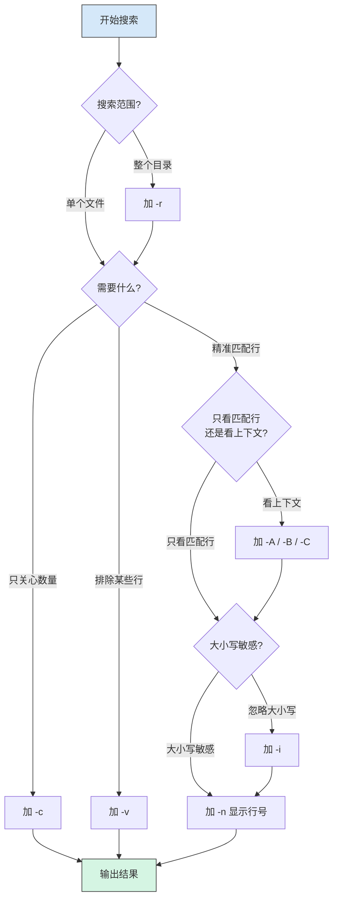

# 02 — 文本处理与日志排查

> 对应 Day 2 学习内容。目标：能用 `grep`/`tail`/`less` 快速定位日志中的问题。
>
> 目标读者：已掌握 Day 1 基础命令的开发者。

---

## 📌 元信息

| 项目 | 说明 |
|------|------|
| **学习目标** | 掌握 Linux 文本处理命令，能独立完成日志排查 |
| **前置知识** | Day 1：文件系统与基础命令 |
| **实战产出** | 能用一条命令统计 IP 访问次数、能快速定位日志错误 |

---

## 1. 文本查看命令

### 1.1 `cat` — 连接与输出文件

`cat` 是最简单的文本查看命令，但不适合大文件（会把全部内容刷到终端）。

```bash
cat /etc/passwd                      # 查看文件全部内容
cat -n /etc/passwd                   # 显示行号（含空行）
cat -b /etc/passwd                   # 显示行号（跳过空行）
```

> **注意**：生产服务器上慎用 `cat` 查看大日志文件，容易卡死终端。大文件优先用 `less`。

### 1.2 `less` — 分页查看（推荐）

`less` 是查看大文件的神器——只加载当前屏幕内容，不会把整个文件读到内存。

```bash
less /var/log/syslog                 # 打开大文件
```

**`less` 常用操作：**

| 操作 | 按键 |
|------|------|
| 向下翻一页 | `Space` |
| 向上翻一页 | `b` |
| 搜索关键词 | `/关键词`（按 `n` 下一个，`N` 上一个） |
| 跳转到第 N 行 | `:N`（如 `:100` 跳转到 100 行） |
| 跳转到文件末尾 | `G`（大写） |
| 跳转到文件开头 | `g`（小写） |
| 退出 | `q` |

> 💡 **搜索技巧**：在 less 中用 `/ERROR` 搜索后，配合 `n`/`N` 快速浏览所有错误行，比用 `grep` 更高效。

### 1.3 `head` / `tail` — 头尾查看

```bash
head -n 20 app.log                   # 查看前 20 行
tail -n 20 app.log                   # 查看后 20 行
tail -f app.log                      # 实时追踪日志（-f = follow）
tail -f app.log | grep ERROR         # 实时过滤错误（经典组合）
```

> **`tail -f`** 是日志排查中使用频率最高的命令之一。配合 `grep` 可以实时过滤出关心的内容。

### 1.4 `wc` — 统计

```bash
wc -l app.log                        # 统计行数
wc -w app.log                        # 统计单词数
wc -c app.log                        # 统计字节数
```

实战：`wc -l` 常用来快速了解日志文件大小量级。

---

## 2. grep 文本搜索

### 2.1 基本用法

`grep` 是日志排查的核心武器——在一堆文本中快速定位匹配行。

```bash
grep "ERROR" app.log                 # 搜索包含 ERROR 的行
grep "500" /var/log/nginx/access.log # 搜索 500 状态码
```

### 2.2 常用参数

| 参数 | 作用 | 示例 |
|------|------|------|
| `-i` | 忽略大小写 | `grep -i "error" app.log` |
| `-r` | 递归搜索目录 | `grep -r "timeout" /var/log/` |
| `-v` | 反向匹配（排除） | `grep -v "^#" config.conf`（去掉注释行） |
| `-n` | 显示行号 | `grep -n "ERROR" app.log` |
| `-c` | 只计数 | `grep -c "ERROR" app.log`（统计错误行数） |
| `-E` | 扩展正则 | `grep -E "^[0-9]{3}" app.log` |
| `-A N` | 匹配行后 N 行 | `grep -A 3 "ERROR" app.log` |
| `-B N` | 匹配行前 N 行 | `grep -B 3 "ERROR" app.log` |
| `-C N` | 匹配行前后各 N 行 | `grep -C 3 "ERROR" app.log` |

### 2.3 正则示例

```bash
# 匹配以 3 位数字开头的行
grep -E "^[0-9]{3}" app.log

# 匹配 ERROR 或 FATAL（| 需要转义，或使用 -E）
grep "ERROR\|FATAL" app.log
grep -E "ERROR|FATAL" app.log

# 匹配 IP 地址
grep -E "[0-9]{1,3}\.[0-9]{1,3}\.[0-9]{1,3}\.[0-9]{1,3}" access.log
```

### 2.4 grep 参数组合策略



> **核心思路**：先确定搜索范围（单个文件或目录），再选择匹配方式（精确/排除/计数），最后决定展示形式（行号/上下文）。

---

## 3. sed 流编辑器

`sed` 是一个非交互式的流编辑器，适合在脚本中批量处理文本。

### 3.1 替换文本

```bash
# 基本替换（只替换每行第一个匹配）
sed 's/8080/9090/' config.conf

# 全局替换（替换行内所有匹配）
sed 's/8080/9090/g' config.conf

# 原地修改（直接改文件，不输出到终端）
sed -i 's/8080/9090/g' config.conf

# 备份原文件后修改
sed -i.bak 's/8080/9090/g' config.conf
```

### 3.2 删除与打印

```bash
# 删除匹配行
sed '/^#/d' config.conf              # 删除注释行
sed '/DEBUG/d' app.log               # 删除 DEBUG 行

# 打印指定行范围
sed -n '10,20p' app.log              # 只打印 10-20 行
sed -n '100p' app.log                # 只打印第 100 行
```

### 3.3 实战场景：修改 Nginx 配置

```bash
# 将 nginx.conf 中的 listen 80 改为 listen 8080
sed -i 's/listen 80;/listen 8080;/g' /etc/nginx/nginx.conf

# 修改后检查语法
nginx -t
```

> **注意**：`sed -i` 是原地修改，没有后悔药。建议先不加 `-i` 试运行确认结果，确认无误再加 `-i`。或使用 `-i.bak` 保留备份。

---

## 4. awk 文本分析

`awk` 是文本分析领域的大杀器——按列处理文本、做条件过滤、做统计。

### 4.1 基本结构

```bash
awk '{print $1, $NF}' access.log     # 打印第 1 列和最后一列
```

- `$0` — 整行内容
- `$1`, `$2`, ..., `$NF` — 第 1 列、第 2 列……最后一列
- `NR` — 当前行号（Number of Row）
- `NF` — 当前行的列数（Number of Fields）

### 4.2 条件过滤

```bash
# 只打印第 3 列大于 100 的行的第 1 列
awk '$3 > 100 {print $1}' data.txt

# 打印状态码为 404 的行
awk '$9 == 404 {print $1, $7}' access.log
```

### 4.3 实战：Nginx 日志分析

Nginx 默认 `access.log` 格式中，各列含义大致为：`$1 IP 地址`、`$7 请求路径`、`$9 状态码`。实际列位置取决于日志格式配置，以下以常用格式为例。

```bash
# 统计每个 IP 的访问次数（经典一条命令）
awk '{print $1}' access.log | sort | uniq -c | sort -rn

# 统计 HTTP 状态码分布
awk '{print $9}' access.log | sort | uniq -c | sort -rn

# 只统计 404 请求的来源 IP
awk '$9 == 404 {print $1}' access.log | sort | uniq -c | sort -rn

# 统计每个 IP 产生的流量总和（$10 为字节数，依日志格式而定）
awk '{sum[$1] += $10} END {for (ip in sum) print ip, sum[ip]}' access.log | sort -k2 -rn | head -10
```

**这个管道链的拆解：**


> 这条管道链是 Linux 文本处理中最经典的组合之一，面试高频考点。

---

## 5. 日志排查实战

### 5.1 常见日志位置

| 日志文件 | 用途 |
|----------|------|
| `/var/log/syslog` | 系统日志（Ubuntu/Debian） |
| `/var/log/messages` | 系统日志（RHEL/CentOS） |
| `/var/log/nginx/access.log` | Nginx 访问日志 |
| `/var/log/nginx/error.log` | Nginx 错误日志 |
| `/var/log/auth.log` | SSH 登录、sudo 等认证日志 |
| `journalctl -u <service>` | systemd 服务的日志（推荐用这个查应用日志） |

### 5.2 排查流程

```mermaid
flowchart TD
    Start["发现线上问题"] --> Step1["Step 1: 确定时间范围<br/>• 问题第一次出现是什么时候？<br/>• tail / less 定位到时间段"]
    Step1 --> Step2["Step 2: 关键词过滤<br/>• grep ERROR / FATAL / 500<br/>• grep -i timeout<br/>• grep -E \"ORA-\|java.lang\" "]
    Step2 --> Step3["Step 3: 上下文分析<br/>• grep -C 5 ERROR app.log<br/>• 查看错误周围的日志"]
    Step3 --> Step4["Step 4: 关联事件<br/>• 同一时间的其他日志<br/>• journalctl -u 查系统服务<br/>• dmesg 查内核日志"]
    Step4 --> Q{"问题定位?"}
    Q -->|"是"| Done["修复 + 验证"]
    Q -->|"否"| Step2

    style Start fill:#f9d5e5,stroke:#333
    style Done fill:#d5f5e3,stroke:#333
```

### 5.3 实战演练：排查 Nginx 502 错误

```bash
# 1. 先看最近发生了什么
tail -n 100 /var/log/nginx/error.log

# 2. 搜索 502 错误，看上下文
grep -C 5 "502" /var/log/nginx/error.log

# 3. 同时看访问日志，确认哪些请求导致 502
grep " 502 " /var/log/nginx/access.log | tail -20

# 4. 检查后端应用是否存活
systemctl status my-app
journalctl -u my-app -n 50 --no-pager

# 5. 实时监控
tail -f /var/log/nginx/error.log | grep -E "502|504"
```

> 排查的关键思路：**从现象出发，由表及里**。先把时间范围和关键词缩小到可处理的规模，再通过上下文确认根因。

---

## 6. 面试回答模板

> **问：** 如何统计一个日志文件里每个 IP 出现的次数？

**答：** 核心是用 `awk` 提取 IP 列，再配合 `sort | uniq -c` 做计数。

```bash
# 标准答案
awk '{print $1}' access.log | sort | uniq -c | sort -rn

# 进阶：只统计 404 的 IP
grep ' 404 ' access.log | awk '{print $1}' | sort | uniq -c | sort -rn
```

这个管道链分为 4 步：
1. `awk '{print $1}'` — 提取 IP 列
2. `sort` — 排序（`uniq` 要求输入有序）
3. `uniq -c` — 去重并计数
4. `sort -rn` — 按次数降序排列

**思路比命令本身更重要**：日志分析的大多数场景都是"提取 → 排序 → 分组统计 → 排序展示"这一思路。

> **问：** `grep -r`、`grep -v`、`grep -c` 各有什么作用？

**答：**

- **`grep -r`**（recursive，递归搜索）：搜索整个目录下的所有文件。例如 `grep -r "error" /var/log/` 会递归查找 `/var/log/` 下所有包含 `error` 的文件。常用场景：不知道日志文件具体在哪，或需要在多个日志文件中搜索同一关键词。

- **`grep -v`**（invert match，反向匹配）：输出不匹配模式的行。例如 `grep -v "^#" config.conf` 会排除注释行，只显示有效配置行。常用场景：过滤掉调试日志、去掉注释行、排除不关心的内容。

- **`grep -c`**（count，计数）：统计匹配的行数，不输出具体内容。例如 `grep -c "ERROR" app.log` 会输出 `42`（42 行包含 ERROR）。常用场景：快速评估问题严重程度、统计错误频率。

**面试加分点**：说出它们在实际排查中的组合用法——例如 `grep -r -c "ERROR" /var/log/` 可以快速统计各个日志文件中 ERROR 的分布情况。

> **问：** `tail -f` 和 `less` 在查日志时分别适合什么场景？

**答：** `tail -f` 适合**实时追踪**——比如上线后观察日志输出，配合 `grep` 可以实时过滤关心的内容（`tail -f app.log | grep ERROR`）。`less` 适合**回溯查看**大文件——打开 1GB 的日志文件瞬间完成，还能用 `/` 搜索关键词、用 `:n` 跳转到指定行。实际排查中两者经常配合使用：先用 `less` 回溯找到关键时间点，再用 `tail -f` 观察最新状态。

---

## 📝 课后练习

1. 用 `grep -c` 统计 `/var/log/syslog` 中有多少行包含 `error`（忽略大小写）
2. 用一条命令找出 `access.log` 中访问次数最多的前 5 个 IP
3. 用 `sed` 把配置文件中的 `timeout=30` 改为 `timeout=60`
4. 用 `awk` 统计 `access.log` 中 404 和 500 状态码分别出现了多少次
5. 模拟排查：假设你的 Nginx 返回 502，写出完整的排查命令流程

> 💡 提示：所有练习都能用学过的命令完成，动手试试。

---

## 🔗 参考资源

- [grep 官方文档](https://www.gnu.org/software/grep/manual/)
- [sed 简明教程](https://www.gnu.org/software/sed/manual/sed.html)
- [awk 用户指南](https://www.gnu.org/software/gawk/manual/gawk.html)
- 上一篇：[文件系统与基础命令](01-file-system-commands.md)
- 下一篇：[用户、权限与包管理](03-user-permission-package.md)
