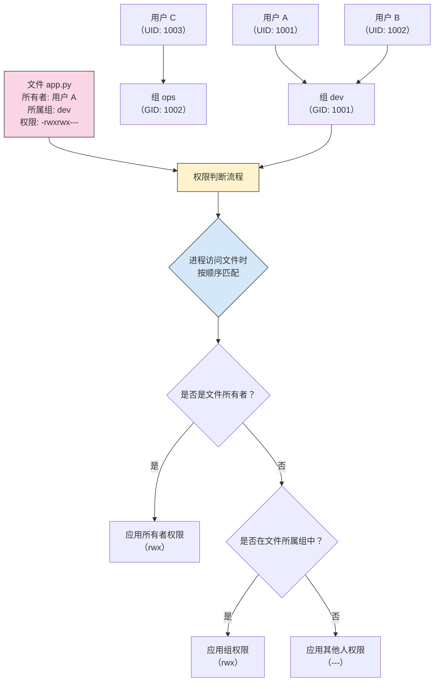
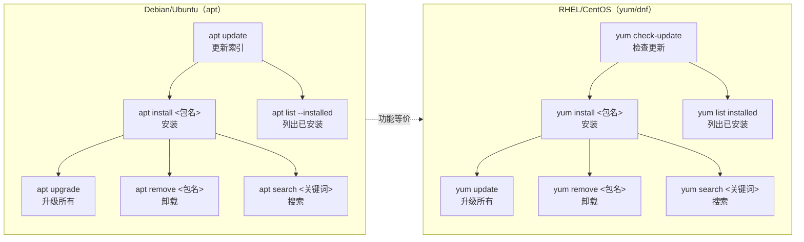

# 03 — 用户、权限与包管理

> 对应 Day 3 的学习内容。掌握用户管理、文件权限、提权操作和包管理，能解决常见的 "Permission denied" 问题、独立安装运行时环境。
>
> **前置要求**：已掌握 Day 1-2 的文件操作和文本处理命令。

---

## 🎯 本日学习目标

- [ ] 能查看当前用户信息和所属组
- [ ] 能创建用户、设置密码、将用户添加到组
- [ ] 能读懂 `/etc/passwd` 和 `/etc/group` 文件结构
- [ ] 能解释 `-rwxr-xr--` 每一位的含义，并换算为数值权限
- [ ] 能用 `chmod`（符号模式和数值模式）和 `chown` 修改权限与归属
- [ ] 理解文件（644）和目录（755）的权限策略差异
- [ ] 能用 `sudo` 执行提权操作，了解 `visudo` 配置
- [ ] 能用 `apt` 安装、更新、卸载软件包
- [ ] 了解 `yum/dnf` 的基本用法
- [ ] 能独立安装 Node.js 运行时

---

## 1. Linux 用户与组

### 1.1 查看当前用户

当你登录一台 Linux 服务器后，首先需要知道"我是谁"：

```bash
# 查看当前用户名
whoami

# 查看用户 ID、组 ID、所属组列表
id

# 查看用户所属的组
groups
```

输出示例：

```bash
$ whoami
deploy

$ id
uid=1001(deploy) gid=1001(deploy) groups=1001(deploy),4(adm),27(sudo)

$ groups
deploy adm sudo
```

关键解读：

- `uid=1001(deploy)` —— 用户 ID 为 1001，用户名为 `deploy`
- `gid=1001(deploy)` —— 主组的 ID 为 1001，组名为 `deploy`
- `groups=1001(deploy),4(adm),27(sudo)` —— 该用户属于 3 个组

### 1.2 用户管理

日常开发中，你可能需要创建部署用户或为同事创建账号。

```bash
# 创建用户（同时会创建同名主组和 home 目录）
sudo useradd -m -s /bin/bash deploy

# 设置或修改密码
sudo passwd deploy

# 将用户添加到补充组（-aG：append 追加到组）
sudo usermod -aG sudo deploy
sudo usermod -aG docker deploy
```

> **强烈建议**：日常使用普通用户，需要时用 `sudo` 提权。不要直接用 root 操作。

### 1.3 `/etc/passwd` 和 `/etc/group`

系统中所有用户信息存储在 `/etc/passwd` 中（注意不是密码——密码在 `/etc/shadow` 中）：

```bash
$ cat /etc/passwd
root:x:0:0:root:/root:/bin/bash
daemon:x:1:1:daemon:/usr/sbin:/usr/sbin/nologin
deploy:x:1001:1001:,,,:/home/deploy:/bin/bash
```

每行 7 个字段，以 `:` 分隔：

| 字段 | 含义 | 示例 |
|------|------|------|
| `deploy` | 用户名 | `deploy` |
| `x` | 密码占位符（密码实际存于 `/etc/shadow`） | `x` |
| `1001` | 用户 ID（UID） | `1001` |
| `1001` | 组 ID（GID） | `1001` |
| `,,,` | 用户全名或备注（GECOS 字段） | `,,,` |
| `/home/deploy` | 用户主目录 | `/home/deploy` |
| `/bin/bash` | 登录 Shell | `/bin/bash` |

组信息存储在 `/etc/group` 中：

```bash
$ cat /etc/group
root:x:0:
sudo:x:27:deploy
docker:x:993:deploy
deploy:x:1001:
```

每行 4 个字段：

| 字段 | 含义 | 示例 |
|------|------|------|
| `sudo` | 组名 | `sudo` |
| `x` | 组密码占位符 | `x` |
| `27` | 组 ID（GID） | `27` |
| `deploy` | 组成员（逗号分隔） | `deploy` |

### 1.4 用户、组、文件权限的关系



> **核心原则**：Linux 权限判断是"最先匹配"——如果进程的所有者是文件所有者，就只应用所有者权限，不再往下匹配组权限。

---

## 2. 文件权限详解

### 2.1 权限位解读

执行 `ls -l` 时，第一列就是文件权限：

```bash
$ ls -l
-rwxr-xr--  1 deploy  dev  1024 Jul 22 10:00 app.py
```

`-rwxr-xr--` 一共 10 位，逐位拆解：

```text
-  rwx  r-x  r--
│  └┬─  └┬─  └┬─
│   │    │    └── 其他人权限（other）
│   │    └─────── 组权限（group）
│   └──────────── 所有者权限（user/owner）
└──────────────── 文件类型
```

| 位置 | 含义 | 取值 |
|------|------|------|
| 第 1 位 | 文件类型 | `-` 普通文件，`d` 目录，`l` 链接，`c` 字符设备 |
| 第 2-4 位 | 所有者（user）权限 | `r` 读，`w` 写，`x` 执行 |
| 第 5-7 位 | 所属组（group）权限 | `r` 读，`x` 执行，`-` 无权限 |
| 第 8-10 位 | 其他人（other）权限 | `r` 读，`-` 无权限，`-` 无权限 |

所以 `-rwxr-xr--` 表示：

- 这是一个**普通文件**
- **所有者**可以读、写、执行（rwx）
- **所属组成员**可以读、执行（r-x）
- **其他人**只能读（r--）

### 2.2 数值权限表示

每一组权限可以用数字表示：

| 权限 | 二进制 | 数值 |
|------|--------|------|
| `---` | 000 | 0 |
| `--x` | 001 | 1 |
| `-w-` | 010 | 2 |
| `-wx` | 011 | 3 |
| `r--` | 100 | 4 |
| `r-x` | 101 | 5 |
| `rw-` | 110 | 6 |
| `rwx` | 111 | 7 |

**原理**：`r=4`、`w=2`、`x=1`，累加即可。

```text
rwx = 4+2+1 = 7
r-x = 4+0+1 = 5
r-- = 4+0+0 = 4
--- = 0+0+0 = 0
```

`-rwxr-xr--` 对应的数值 = **754**（7→所有者、5→组、4→其他人）。

### 2.3 chmod：修改权限

**符号模式**：

```bash
# 给所有者添加执行权限
chmod u+x script.sh

# 给组和其他人移除写权限
chmod go-w config.py

# 给所有人添加读权限
chmod a+r data.txt

# 多操作组合
chmod u+rwx,go-rwx private.sh
```

**数值模式**：

```bash
chmod 755 script.sh   # 所有者全部权限，组和其他人读+执行
chmod 644 config.py   # 所有者读写，组和其他人只读
chmod 600 id_rsa      # 只有所有者读写（SSH 私钥）
chmod 700 private/    # 只有所有者全部权限（私密目录）
```

### 2.4 文件 vs 目录的权限策略

**文件和目录的 `rwx` 含义完全不同**：

| 权限 | 对文件 | 对目录 |
|------|--------|--------|
| `r`（读） | 读取文件内容（`cat`） | 列出目录条目（`ls`） |
| `w`（写） | 修改文件内容 | 在目录中创建/删除文件 |
| `x`（执行） | 执行文件（脚本/二进制） | 进入目录（`cd`） |

**实际策略**：

```bash
# 文件：给予读写，不给执行
chmod 644 app.py          # -rw-r--r--

# 目录：给予读和执行（能进入并列出），目录的执行是必需的
chmod 755 /var/www/       # drwxr-xr-x

# SSH 私钥：仅所有者可读写
chmod 600 ~/.ssh/id_rsa   # -rw-------
```

> **一个最常见的错误**：给目录只设 `r--`（444），这会让你能 `ls` 列出内容，但无法 `cd` 进入——因为缺少 `x`（执行）权限。目录的 `x` 权限被称为"穿越权限"。

### 2.5 chown：修改所有者和组

```bash
# 只修改所有者
sudo chown deploy app.py

# 同时修改所有者和组
sudo chown deploy:dev app.py

# 递归修改目录下所有文件
sudo chown -R deploy:dev /var/www/myapp/
```

### 2.6 umask：默认权限掩码

`umask` 决定了新创建文件和目录的默认权限：

```bash
$ umask
0022
```

**计算方式**：

- 文件默认基础权限：666（rw-rw-rw-）
- 目录默认基础权限：777（rwxrwxrwx）
- **减去 umask** 得到实际权限

```text
umask 022：
  文件：666 - 022 = 644（rw-r--r--）
  目录：777 - 022 = 755（rwxr-xr-x）

umask 002：
  文件：666 - 002 = 664（rw-rw-r--）
  目录：777 - 002 = 775（rwxrwxr-x）
```

常用 umask 值：

| umask | 文件权限 | 目录权限 | 适用场景 |
|-------|---------|---------|---------|
| 022 | 644 | 755 | 默认，普通用户 |
| 002 | 664 | 775 | 多人协作，组成员可写 |
| 077 | 600 | 700 | 严格隔离，仅自己可访问 |

---

## 3. sudo 与提权

### 3.1 sudo 基本使用

```bash
# 以 root 身份执行命令
sudo apt update

# 以其他用户身份执行（默认 root）
sudo -u deploy whoami

# 切换到 root 的 Shell（谨慎使用）
sudo -i

# 以当前用户的环境执行
sudo -E env_command
```

### 3.2 visudo 与 /etc/sudoers

`/etc/sudoers` 文件控制哪些用户能用 `sudo`、能用哪些命令。**永远不要直接编辑**，要用：

```bash
sudo visudo
```

常见的配置行：

```text
# 允许 sudo 组成员执行所有命令
%sudo   ALL=(ALL:ALL) ALL

# 允许 deploy 用户无需密码执行 systemctl
deploy  ALL=(ALL) NOPASSWD: /usr/bin/systemctl

# 只允许 deploy 用户执行 apt 相关命令
deploy  ALL=(ALL) /usr/bin/apt-get, /usr/bin/apt
```

每行的格式：

```text
用户/组  主机名=(可切换的用户:可切换的组)  命令列表
```

- `%sudo` —— 以 `%` 开头的表示组
- `ALL=(ALL:ALL) ALL` —— 任何主机、任何用户、任何组、任何命令
- `NOPASSWD:` —— 执行时不要求输入密码

### 3.3 普通用户 vs root

| 场景 | 推荐做法 | 说明 |
|------|---------|------|
| 日常操作 | 普通用户 | 降低误操作风险 |
| 安装软件 | `sudo apt install` | 临时提权 |
| 修改系统配置 | `sudo visudo` / `sudo vim /etc/...` | 临时提权 |
| 批量运维 | 普通用户 + `sudo` | 通过 Ansible 等工具自动提权 |
| 确认要做什么 | 先用普通用户尝试 | 只有确认需要 root 权限时再用 `sudo` |

> **新手最容易犯的错误**：一登录服务器就 `sudo -i` 切到 root，然后什么操作都是 root 身份。这样做的问题一是误删系统文件的风险极高，二是审计日志里分不清是谁干的。**应该坚持"最小权限原则"**——只有需要写系统文件时才用 `sudo`。

---

## 4. 包管理

### 4.1 Debian/Ubuntu（apt）

APT（Advanced Package Tool）是 Debian 系列最常用的包管理器。

**核心操作**：

```bash
# 更新软件包索引（每次安装前建议执行）
sudo apt update

# 升级所有已安装的软件包
sudo apt upgrade

# 安装软件包
sudo apt install nginx
sudo apt install nodejs npm

# 卸载软件包（保留配置文件）
sudo apt remove nginx

# 卸载并删除配置文件
sudo apt purge nginx

# 搜索软件包
apt search nginx

# 查看已安装的软件包
apt list --installed

# 清理下载缓存
sudo apt autoremove    # 删除不再需要的依赖
sudo apt autoclean     # 清理旧版本缓存
```

**dpkg 底层工具**：

```bash
# 列出所有已安装的包
dpkg -l

# 安装本地 .deb 文件
sudo dpkg -i package.deb

# 查看某个包是否安装
dpkg -l | grep nginx

# 查看某个文件属于哪个包
dpkg -S /etc/nginx/nginx.conf
```

> 当 `dpkg -i` 遇到依赖问题时，运行 `sudo apt install -f` 自动修复。

### 4.2 RHEL/CentOS（yum/dnf）

RHEL 系列（CentOS 7 及更早）使用 `yum`，CentOS 8+/RHEL 8+ 使用 `dnf`（语法几乎一致）。

```bash
# 安装软件包
sudo yum install nginx
# 或 dnf
sudo dnf install nginx

# 卸载
sudo yum remove nginx

# 搜索
yum search nginx

# 查看已安装
yum list installed

# 更新所有包
sudo yum update

# 查看包信息
yum info nginx

# 安装本地 RPM 文件
sudo rpm -ivh package.rpm
```

### 4.3 apt 与 yum 命令对比



| 操作 | apt（Debian/Ubuntu） | yum/dnf（RHEL/CentOS） |
|------|---------------------|------------------------|
| 更新索引 | `apt update` | `yum check-update` |
| 安装 | `apt install nginx` | `yum install nginx` |
| 卸载 | `apt remove nginx` | `yum remove nginx` |
| 搜索 | `apt search nginx` | `yum search nginx` |
| 列出已安装 | `apt list --installed` | `yum list installed` |
| 升级全部 | `apt upgrade` | `yum update` |
| 包信息 | `apt show nginx` | `yum info nginx` |
| 本地安装 | `dpkg -i package.deb` | `rpm -ivh package.rpm` |

> **如何判断当前系统是哪个系列？**
>
> ```bash
> # 查看发行版信息
> cat /etc/os-release
> # 或
> cat /etc/redhat-release   # RHEL/CentOS 有此文件
> ```

### 4.4 实战：安装 Node.js

```bash
# ---- Debian/Ubuntu ----

# 1. 更新索引
sudo apt update

# 2. 安装 Node.js 和 npm（版本可能较旧）
sudo apt install nodejs npm

# 3. 验证
node --version
npm --version

# ---- 安装较新版本的 Node.js（推荐方式）----

# 使用 NodeSource 官方仓库（以 v18 LTS 为例）
# ⚠️ curl | bash 模式：建议在生产环境中先下载脚本审查内容后再执行
curl -fsSL https://deb.nodesource.com/setup_18.x | sudo -E bash -
sudo apt install -y nodejs

# 验证
node --version   # 应为 v18.x
npm --version
```

> 生产部署中推荐使用 NodeSource 或 nvm（Node Version Manager）来安装，以获得较新的 LTS 版本，而不是直接用系统的包管理器。

---

## 5. 常见错误排查

```bash
# 场景 1：Permission denied 执行脚本
$ ./deploy.sh
-bash: ./deploy.sh: Permission denied

# 解决：添加执行权限
chmod +x deploy.sh

# 场景 2：Permission denied 写入文件
$ echo "config" > /etc/app.conf
-bash: /etc/app.conf: Permission denied

# 解决：需要 root 权限
sudo vim /etc/app.conf

# 场景 3：Permission denied 进入目录
$ ls /root
ls: cannot open directory '/root': Permission denied

# 解决：普通用户不能进入 root 的 home 目录（700 权限）
# 这是正常的安全隔离，不是 bug

# 场景 4：APT 安装失败
E: Could not open lock file /var/lib/dpkg/lock-frontend - open (13: Permission denied)

# 解决：忘记加 sudo
sudo apt install nginx
```

---

## 6. 面试回答模板

> **问：** 一个文件权限是 `-rwxr-xr--`，各位置分别表示什么？

答：`-rwxr-xr--` 共 10 位，首位 `-` 表示这是一个普通文件。接着三组三位：所有者权限 `rwx`（可读、可写、可执行），所属组权限 `r-x`（可读、可执行），其他人权限 `r--`（只读）。对应数值权限是 754。需要特别注意，文件类型的 `d` 表示目录、`l` 表示符号链接。另外，面试中常被追问的是 SUID 位（如 `4755` 的 `4`），表示执行文件时以文件所有者的身份运行，典型的例子是 `/usr/bin/passwd`。

> **问：** 遇到 "Permission denied" 应该怎么排查？

答：按以下三步排查：**第一，看谁在执行**——`whoami` 确认当前用户，判断是否需要 `sudo`。**第二，看文件本身的权限和归属**——`ls -l` 查看文件权限位、所有者和所属组，`id` 查看当前用户和所属组是否匹配。**第三，分场景处理**：如果是执行脚本报错，用 `chmod +x` 添加执行权限；如果是写入系统目录（如 `/etc/`、`/var/`），需要用 `sudo`；如果是普通用户读不了 root 的 home 目录，这是正常的安全隔离。如果是目录方面的问题，还要确认目录是否有 `x` 权限（能否 `cd` 进去）。

---

## 📝 本日总结

| 学习内容 | 关键命令/概念 | 需要掌握的程度 |
|----------|-------------|--------------|
| 查看用户 | `whoami`、`id`、`groups` | 必会 |
| 用户管理 | `useradd`、`passwd`、`usermod -aG` | 了解 |
| 权限解读 | `-rwxr-xr--` 逐位分析 | **必会（面试高频）** |
| 修改权限 | `chmod`（符号+数值）、`chown` | **必会** |
| 权限策略 | 文件 644、目录 755、私钥 600 | **必会** |
| 提权 | `sudo`、`visudo`、`/etc/sudoers` | 必会 |
| 包管理 | `apt`（Debian/Ubuntu）、`yum`（RHEL/CentOS） | **必会（apt 为主）** |
| 安装运行时 | apt 安装 Node.js | 必会 |

> **Day 3 的实战产出**：能在服务器上解决常见的 `Permission denied` 错误，能用 `apt` 安装运行时和工具，能正确设置文件和目录的权限。
