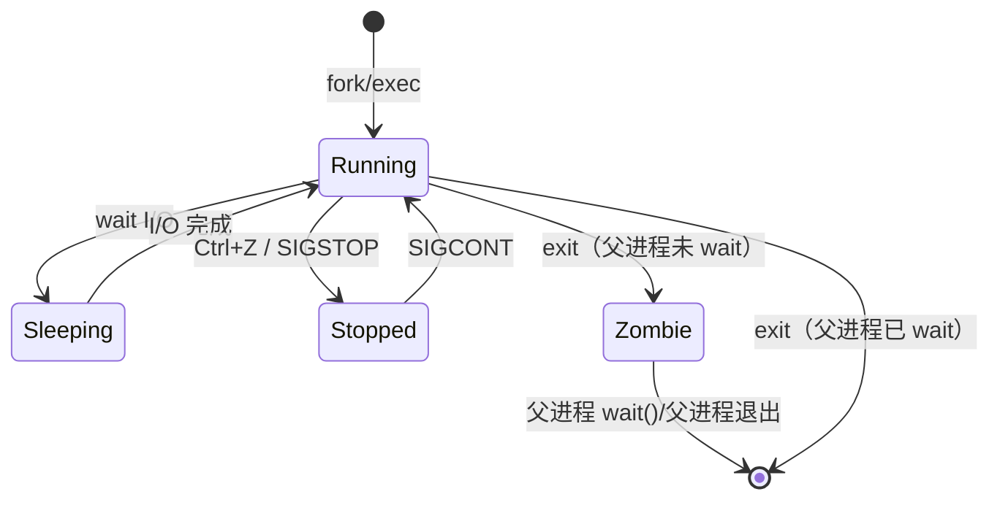

# 04 — 进程、网络与 systemd 服务管理

> 能用 `ps`/`ss` 排查进程和端口问题；能用 `systemd` 管理应用、查看日志。

---

## 🎯 学习目标

- 理解进程概念，能用 `ps`、`top` 查看进程状态
- 能用 `kill` 控制进程（正常终止、强制终止、重载配置）
- 能用 `nohup`、`&`、`disown` 让进程在后台运行
- 会用 `ss`、`curl`、`ping`、`nslookup`、`traceroute` 排查网络问题
- 掌握 `systemctl` 和 `journalctl` 管理服务与日志
- 能编写一个 `.service` 文件来管理 Node.js 应用

---

## 1. 进程管理

### 1.1 什么是进程

进程（Process）是 Linux 系统中正在执行的程序的实例。每次运行一个命令或启动一个应用，系统就会创建一个进程。每个进程都有一个唯一的 **PID（Process ID）**。

> 区分两个概念：**程序**是磁盘上的静态文件（如 `/usr/bin/node`），**进程**是程序被加载到内存后的运行实例。

### 1.2 `ps aux`——查看进程快照

`ps`（process status）是查看进程信息最常用的命令。组合参数 `aux` 是最通用的用法：

```bash
ps aux
```

输出示例（各列含义）：

```text
USER       PID  %CPU %MEM    VSZ   RSS TTY      STAT START   TIME COMMAND
root         1  0.0  0.3 103456 13548 ?        Ss   10:00   0:03 /sbin/init
www-data   856  0.0  0.5 256780 21456 ?        S    10:05   0:01 nginx: worker
deploy    1204  0.1  1.2 523456 48192 ?        Sl   10:08   0:12 node app.js
```

| 列名 | 含义 |
|------|------|
| **USER** | 启动该进程的用户 |
| **PID** | 进程 ID（唯一标识） |
| **%CPU** | CPU 使用率（占单个核的百分比，多核可能超过 100%） |
| **%MEM** | 物理内存使用率 |
| **VSZ** | 虚拟内存大小（KB），包括已分配但未实际使用的内存 |
| **RSS** | 常驻物理内存大小（KB），即实际占用的物理内存 |
| **TTY** | 终端设备号（`?` 表示非终端启动，如后台服务） |
| **STAT** | 进程状态码 |
| **START** | 进程启动时间 |
| **TIME** | 累计 CPU 占用时间（不是运行时长） |
| **COMMAND** | 启动该进程的命令名（含参数） |

**常用过滤技巧**：

```bash
# 查找特定进程（如 Node.js）
ps aux | grep node

# 查看 CPU 占用最高的进程
ps aux --sort=-%cpu | head -10

# 查看内存占用最高的进程
ps aux --sort=-%mem | head -10
```

### 1.3 `ps -ef` vs `ps aux`

这两个命令的功能几乎相同，只是输出格式略有差异：

| 对比项 | `ps aux` | `ps -ef` |
|--------|----------|----------|
| 输出风格 | BSD 风格 | UNIX System V 风格 |
| CPU/内存列 | 有（`%CPU`、`%MEM`） | 无 |
| 父进程 PID | 无 | 有（`PPID` 列） |
| 常用场景 | 日常排查资源占用 | 查看进程父子关系（如定位僵尸进程） |

**实际建议**：日常用 `ps aux` 就够了。需要查父进程时用 `ps -ef`。

### 1.4 `top` / `htop`——实时监控

`top` 提供实时刷新的进程列表，默认每 3 秒刷新一次：

```bash
top
```

`top` 运行时快捷键：

| 按键 | 作用 |
|------|------|
| `P` | 按 CPU 使用率降序排列（大写 P） |
| `M` | 按内存使用率降序排列（大写 M） |
| `k` | 杀掉某个进程（输入 PID） |
| `q` | 退出 |
| `1` | 展开/折叠每个 CPU 核心的使用情况 |
| `u` | 只查看指定用户的进程（输入用户名） |

**`htop`** 是 `top` 的增强版，界面更友好，支持鼠标操作和彩色显示：

```bash
# 需要先安装
sudo apt install htop   # Debian/Ubuntu
sudo yum install htop   # CentOS/RHEL
htop
```

> **面试提示**：面试官问"如何查看哪个进程最耗 CPU"——回答 `top` 后按 `P` 键。

### 1.5 进程状态（STAT 列）

`ps aux` 输出的 STAT 列表示进程当前状态，常见的有：

| 状态码 | 含义 | 说明 |
|--------|------|------|
| **R** | Running / Runnable | 正在运行或在运行队列中等待调度 |
| **S** | Sleeping | 可中断的休眠，等待某个事件（如 I/O 完成） |
| **D** | Uninterruptible Sleep | 不可中断的休眠，通常正在等待 I/O（如磁盘读写），此时 kill -9 无效 |
| **Z** | Zombie | 僵尸进程，子进程已结束但父进程未回收其退出状态 |
| **T** | Stopped | 已停止，通常被 Ctrl+Z 暂停或通过 `kill -SIGSTOP` 停止 |

状态码后可能跟附加字符，如 `Ss` 中的 `s` 表示该进程是会话领导者（session leader），`Sl` 中的 `l` 表示多线程。

**关于僵尸进程**：

- 僵尸进程不占用 CPU 和内存，但会占用进程表项（PID 有限）
- 正常情况：父进程调用 `wait()` 回收子进程退出状态
- 异常情况：父进程未回收 → 子进程成为僵尸
- 处理方式：杀掉父进程，僵尸会被 init 进程（PID 1）收养并回收

### 1.6 `kill`——给进程发送信号

`kill` 命令不是"杀掉"的意思，而是**发送信号**给进程。不同信号的行为不同：

```bash
kill -15 PID    # SIGTERM，默认信号，请求进程优雅退出
kill -9  PID    # SIGKILL，强制终止，进程无法捕获或忽略
kill -1  PID    # SIGHUP，通常让进程重载配置（reload）
```

| 信号 | 编号 | 行为 | 常用场景 |
|------|------|------|----------|
| SIGTERM | 15 | 请求终止 | 默认值，给进程清理资源的机会 |
| SIGKILL | 9 | 强制终止 | 进程无响应（hang 住）时的最后手段 |
| SIGHUP | 1 | 挂起 / 重载 | 服务配置变更后重新加载（`kill -1 PID`） |

**推荐优先级**：

```
kill -15 PID   → 先尝试优雅终止
kill  PID      → 同 kill -15 PID
kill -9  PID   → 最后手段（可能导致数据丢失或文件损坏）
```

还有 `pkill` 按进程名杀：

```bash
pkill node         # 杀掉所有 node 进程（慎用，会杀所有）
pkill -f "app.js"  # 按完整命令行匹配
```

### 1.7 `nohup` / `&` / `disown`——后台运行

默认情况下，关闭终端后该终端启动的进程会收到 SIGHUP 信号而退出。以下方法可以避免：

```bash
# &：将命令放入后台运行
node app.js &

# nohup：忽略 SIGHUP 信号，输出重定向到 nohup.out
nohup node app.js &

# nohup + & 组合（最常用）
nohup node app.js > app.log 2>&1 &
```

| 方法 | 说明 |
|------|------|
| `&` | 仅将进程放入后台，关终端后仍然会被 kill |
| `nohup` | 忽略 SIGHUP 信号，关终端后可继续运行 |
| `nohup ... &` | 后台运行 + 忽略 SIGHUP，临时场景的黄金组合 |
| `disown` | 将进程从当前 shell 的任务表中移除，关终端后不发送 SIGHUP |

`disown` 使用场景：

```bash
# 场景：已经在前台运行了，想让它不依赖当前终端
# 按 Ctrl+Z 暂停
# 然后：
bg          # 让进程在后台继续运行
disown      # 从 shell 任务表移除
```

### 1.8 进程生命周期



---

## 2. 网络排查工具

### 2.1 `ss`——查看端口与 socket 状态

`ss`（socket statistics）是 `netstat` 的现代替代品，更快、信息更全：

```bash
# 查看所有 TCP 监听端口（最常用）
ss -tlnp
```

参数含义：

| 参数 | 全称 | 含义 |
|------|------|------|
| `-t` | tcp | 只显示 TCP socket |
| `-l` | listening | 只显示监听中的 socket |
| `-n` | numeric | 不解析服务名（直接显示端口号，更快） |
| `-p` | processes | 显示占用端口的进程信息 |

**实际排查示例**：

```bash
# 查看 3000 端口被谁占用
ss -tlnp | grep 3000
# 输出: LISTEN 0 128 0.0.0.0:3000 0.0.0.0:* users:(("node",pid=1204,fd=18))

# 查看所有端口（包括非监听状态）
ss -tanp

# 查看 UDP 端口
ss -ulnp
```

> `ss -tlnp` 应该成为肌肉记忆——上服务器第一件事排查端口。

### 2.2 `curl`——HTTP 请求调试

`curl` 是开发者最常用的 HTTP 工具，可以发送各种类型的请求：

```bash
# 查看响应头（HEAD 请求）
curl -I http://localhost:3000

# 查看详细通信过程（包含请求头、SSL 握手、响应头等）
curl -v http://localhost:3000

# 查看更详细的响应头（比 -v 更精简）
curl -i http://localhost:3000

# 模拟 POST 请求
curl -X POST -H "Content-Type: application/json" -d '{"key":"value"}' http://localhost:3000/api

# 跟随重定向
curl -L http://example.com

# 设置超时时间（秒）
curl --connect-timeout 5 -m 10 http://localhost:3000
```

**常用排障场景**：

```bash
# 场景 1：服务是否在监听
curl -I localhost:3000

# 场景 2：访问外部 API 是否通
curl -v https://api.example.com/health

# 场景 3：检查 SSL 证书
curl -vI https://example.com
```

### 2.3 `ping`——ICMP 连通性测试

`ping` 使用 ICMP 协议测试目标主机是否可达，并测量往返时间（RTT）：

```bash
ping -c 5 google.com   # 发 5 个包后停止（Linux 默认一直发）
ping -c 5 -W 3 10.0.0.1  # 超时时间 3 秒
```

**输出了解**：

```text
PING google.com (142.250.80.14) 56(84) bytes of data.
64 bytes from 142.250.80.14: icmp_seq=1 ttl=118 time=12.3 ms
64 bytes from 142.250.80.14: icmp_seq=2 ttl=118 time=11.8 ms
--- google.com ping statistics ---
5 packets transmitted, 5 received, 0% packet loss, time 4005ms
rtt min/avg/max/mdev = 11.8/12.1/12.3/0.2 ms
```

> **注意**：某些云服务商（如 AWS）默认禁用了 ICMP，`ping` 无响应不代表连不上。这种情况下改用 `curl` 或 `tcping` 测试 TCP 连通性。

### 2.4 `nslookup` / `dig`——DNS 解析

```bash
# nslookup（简单查询）
nslookup example.com
nslookup example.com 8.8.8.8   # 指定 DNS 服务器

# dig（更详细的信息，推荐）
dig example.com
dig @8.8.8.8 example.com       # 指定 DNS 服务器
dig +short example.com          # 只取 IP 地址
```

`dig` 输出关键信息：

```text
; <<>> DiG 9.16.1-Ubuntu <<>> example.com
;; ->>HEADER<<- opcode: QUERY, status: NOERROR, id: 12345
;; QUESTION SECTION:
;example.com.           IN  A

;; ANSWER SECTION:
example.com.    86400   IN  A   93.184.216.34

;; Query time: 45 msec
;; SERVER: 8.8.8.8#53(8.8.8.8)
```

> **排查场景**：应用报"连接超时"时，先用 `dig` 确认域名能解析到正确的 IP，再排查网络连通性。

### 2.5 `traceroute`——路由追踪

`traceroute` 显示从本机到目标主机经过的每一跳（路由器）：

```bash
traceroute google.com
# 加 -n 不解析主机名，更快
traceroute -n google.com
```

输出示例：

```text
traceroute to google.com (142.250.80.14), 30 hops max, 60 byte packets
 1  192.168.1.1   1.2 ms   1.5 ms   1.1 ms
 2  10.0.0.1     3.2 ms   3.5 ms   3.0 ms
 3  172.16.0.1   12.3 ms  15.1 ms  11.8 ms
 4  * * *         # 该跳没有响应（可能是防火墙拦截）
 5  142.250.80.14 23.4 ms  22.1 ms  22.8 ms
```

> **排查场景**：用户反馈"访问慢"，`traceroute` 可以帮助定位是哪一跳延迟高或丢包。

### 2.6 连接超时排查流程

```mermaid
flowchart TD
    A[curl localhost:3000 超时或拒绝] --> B{本机还是远程？}
    B -->|本机| C[ss -tlnp | grep 3000]
    B -->|远程| D[ping 目标IP]
    
    C --> E{端口在监听？}
    E -->|否| F[检查服务是否启动<br/>systemctl status / ps aux]
    E -->|是| G[服务只绑定了 127.0.0.1？<br/>查看 ss 输出中的 Listen 地址]
    
    G -->|是| H[修改服务配置绑定 0.0.0.0]
    G -->|否| I[检查防火墙<br/>iptables -L / ufw status]
    
    D --> J{ping 通？}
    J -->|否| K[检查网络配置<br/>ip addr / route -n]
    J -->|是| L[dig 域名解析正确？]
    
    L -->|否| M[检查 /etc/resolv.conf<br/>或切换 DNS 服务器]
    L -->|是| N[端口是否可达？<br/>curl -v IP:PORT]
    
    N -->|拒绝| O[目标防火墙 / 安全组<br/>未放行该端口]
    N -->|超时| P[中间路由问题<br/>traceroute 排查]

    style A fill:#ffcccc,stroke:#333
    style H fill:#ccffcc,stroke:#333
    style I fill:#ccffcc,stroke:#333
    style K fill:#ccffcc,stroke:#333
    style M fill:#ccffcc,stroke:#333
    style O fill:#ccffcc,stroke:#333
    style P fill:#ccffcc,stroke:#333
```

---

## 3. systemd 服务管理

### 3.1 systemd 是什么

systemd 是现代 Linux 发行版（Ubuntu 16.04+、CentOS 7+、Debian 8+）的默认初始化系统和服务管理器。它是 **PID 1**，负责系统的首个进程，管理所有其他服务的启动、停止和监控。

> **核心价值**：开发者不需要自己写启动脚本、管理进程、处理日志轮转——systemd 替你做了。

### 3.2 `systemctl`——服务管理命令

```bash
# 基础操作
systemctl status my-app      # 查看服务状态（含最近日志）
systemctl start my-app       # 启动服务
systemctl stop my-app        # 停止服务
systemctl restart my-app     # 重启服务
systemctl reload my-app      # 重载配置（服务需支持，如 Nginx）

# 开机自启
systemctl enable my-app      # 设置开机自启
systemctl disable my-app     # 取消开机自启
systemctl is-enabled my-app  # 查看是否已启用

# 其他
systemctl list-units --type=service   # 列出所有服务
systemctl daemon-reload               # 重载所有 service 文件（修改后需要执行）
```

**`systemctl status` 输出解读**：

```text
● my-app.service - My Node.js Application
     Loaded: loaded (/etc/systemd/system/my-app.service; enabled; vendor preset: enabled)
     Active: active (running) since Mon 2026-07-22 10:00:00 CST; 2h 30min ago
   Main PID: 1204 (node)
      Tasks: 7 (limit: 2345)
     Memory: 48.2M
        CPU: 12.345s
     CGroup: /system.slice/my-app.service
             └─1204 node /opt/my-app/app.js
```

关键信息：是否已加载（Loaded）、是否在运行（Active）、主进程 PID、内存和 CPU 使用。

### 3.3 `journalctl`——日志查看

```bash
# 查看指定服务的日志
journalctl -u my-app

# 实时跟踪日志（类似 tail -f）
journalctl -u my-app -f

# 查看最近 30 分钟的日志
journalctl -u my-app --since "30 min ago"

# 查看指定时间范围的日志
journalctl -u my-app --since "2026-07-22 09:00:00" --until "2026-07-22 12:00:00"

# 查看本次启动以来的日志
journalctl -u my-app -b

# 只查看最后 50 行
journalctl -u my-app -n 50

# 分页浏览（默认行为）
journalctl -u my-app | less
```

> **实际应用**：部署新版本后，`journalctl -u my-app -f` 实时看日志，确认应用启动正常。如果启动失败，`journalctl -u my-app -n 50 --no-pager` 快速定位错误。

### 3.4 创建一个 `.service` 文件

假设有一个 Node.js 应用位于 `/opt/my-app/`，启动命令是 `node /opt/my-app/app.js`，需要以 `deploy` 用户运行。

**文件路径**：`/etc/systemd/system/my-app.service`

```ini
[Unit]
Description=My Node.js Application
After=network.target
Wants=network-online.target

[Service]
Type=simple
ExecStart=/usr/bin/node /opt/my-app/app.js
Restart=always
RestartSec=5
User=deploy
WorkingDirectory=/opt/my-app
Environment=NODE_ENV=production
Environment=PORT=3000

[Install]
WantedBy=multi-user.target
```

**各字段说明**：

| 字段 | 含义 |
|------|------|
| `[Unit]` 段 |
| `Description` | 服务描述，`systemctl status` 时会显示 |
| `After` | 在哪些单元之后启动（不强制依赖，仅排序） |
| `Wants` | 弱依赖，如果指定的单元失败不影响本服务 |
| `[Service]` 段 |
| `Type=simple` | 默认值，ExecStart 启动后即视为服务已运行 |
| `ExecStart` | 启动命令，**必须使用绝对路径** |
| `Restart=always` | 无论何种原因退出，都自动重启 |
| `RestartSec=5` | 重启前等待 5 秒 |
| `User` | 运行服务的系统用户（不要用 root） |
| `WorkingDirectory` | 工作目录 |
| `Environment` | 环境变量（可写多行） |
| `[Install]` 段 |
| `WantedBy=multi-user.target` | 相当于"运行级别 3"，系统进入多用户模式时启动 |

**部署步骤**：

```bash
# 1. 创建 service 文件
sudo vim /etc/systemd/system/my-app.service

# 2. 重载 systemd 配置
sudo systemctl daemon-reload

# 3. 启动服务
sudo systemctl start my-app

# 4. 设置开机自启
sudo systemctl enable my-app

# 5. 查看状态
sudo systemctl status my-app

# 6. 查看日志
journalctl -u my-app -f
```

**修改 service 文件后的标准流程**：

```bash
# 修改后必须 daemon-reload
sudo systemctl daemon-reload
# 然后重启服务
sudo systemctl restart my-app
```

### 3.5 `Restart` 策略详解

| 值 | 行为 | 适用场景 |
|----|------|----------|
| `no` | 不自动重启（默认值） | 一次性任务 |
| `on-success` | 仅退出码为 0 时不重启 | 脚本类任务 |
| `on-failure` | 仅非正常退出时重启 | 应用偶发崩溃，但主动退出时不要重启 |
| `always` | 任何退出原因都重启 | Web 服务、API 等需要一直运行的应用 |
| `on-abnormal` | 仅被信号终止或超时时重启 | 安全性更高的选项 |

> **面试追问**：`Restart=always` 和 `Restart=on-failure` 的区别？——`always` 在手动 `systemctl stop` 后也会自动重启，而 `on-failure` 不会。所以对需要手动停止维护的服务，`on-failure` 更合适。

---

## 4. 后台运行方案对比

| 方案 | 持久性 | 自重启 | 日志管理 | 适用场景 | 复杂度 |
|------|--------|--------|----------|----------|--------|
| `nohup ... &` | 关终端不退出 | ❌ 进程退出后不会重启 | 重定向到文件 | 临时测试、一次性任务 | ⭐ |
| `tmux` / `screen` | 关终端不退出，可重新连接 | ❌ 需手动重启 | 终端内可见 | 开发调试、交互式操作 | ⭐⭐ |
| `systemd` service | 开机自启、退出自动重启 | ✅ 支持 | `journalctl` 统一管理 | 生产环境服务管理 | ⭐⭐⭐ |

**选择建议**：

- **临时跑个脚本**：`nohup script.sh &`
- **开发环境调试**：`tmux`（推荐）或 `screen`
- **生产环境**：**必须用 systemd**，支持自重启、日志管理、开机自启

### 4.1 `tmux` 快速入门

```bash
# 安装
sudo apt install tmux

# 创建新会话
tmux new -s my-session

# 在 tmux 中运行应用
node app.js

# 按 Ctrl+B 然后按 D 脱离会话（detach）
# 重新连接
tmux attach -t my-session

# 列出所有会话
tmux ls
```

---

## 5. 面试回答模板

> **问：** 如何查看一个进程占用了哪些端口？

答：使用 `ss -tlnp`（现代推荐）或 `netstat -tlnp`。`-t` 表示 TCP 协议，`-l` 表示只显示监听中的 socket，`-n` 表示不解析服务名直接显示端口号，`-p` 显示占用端口的进程信息。如果要查特定端口，可以加上 `grep`：`ss -tlnp | grep 3000`。如果还要查对应的进程详细信息，可以通过 `ps aux | grep PID` 进一步查看。更精确的定位方式是 `lsof -i :3000`。

---

> **问：** `curl localhost:3000` 返回 `Connection refused`，怎么排查？

答：这是一个典型的多层排查问题，按以下顺序排查：

1. **服务是否在运行**：`systemctl status 服务名` 或 `ps aux | grep 应用名`，确认应用进程是否存在。
2. **端口是否在监听**：`ss -tlnp | grep 3000`，如果没有任何输出，说明应用没有成功绑定端口——检查应用日志。
3. **绑定地址是否正确**：如果 `ss` 显示的是 `127.0.0.1:3000`，则只能本机访问；如果需要外部访问，应用应绑定 `0.0.0.0:3000`。
4. **防火墙拦截**（远程场景）：`iptables -L -n` 或 `ufw status`，确认防火墙规则没有拦截该端口。
5. **SELinux**（CentOS/RHEL）：`getenforce` 查看 SELinux 状态，必要时 `ausearch -m avc` 查看拦截日志。

---

> **问：** systemd 的 service 文件中 ExecStart、Restart=always 是什么含义？

答：`ExecStart` 指定服务启动时要执行的命令，**必须使用绝对路径**（如 `/usr/bin/node /opt/my-app/app.js`），不能使用相对路径或依赖 PATH 环境变量。`Restart=always` 表示无论进程因何种原因退出（正常退出、崩溃、被 kill 等），systemd 都会自动重启该服务，保证服务持续可用。

面试追问中常提到的区别：`Restart=always` 和 `Restart=on-failure`。前者在手动 `systemctl stop` 后也会自动重启（需要先 `systemctl disable` 再 stop），而 `on-failure` 仅在进程非正常退出时重启，手动 stop 不会触发重启。所以对于需要定期维护的应用，`on-failure` 更合理。

---

> **问：** 如何让一个 Node.js 应用在后台持续运行，即使终端关闭也不会停止？

答：有三种方案，按场景选择：

1. **临时方案**：`nohup node app.js > app.log 2>&1 &`。`nohup` 忽略 SIGHUP 信号，`&` 放入后台运行，`> app.log 2>&1` 把标准输出和错误输出都重定向到文件。适合临时测试或脚本。

2. **开发调试方案**：`tmux new -s my-app` 创建一个持久化终端会话，在里面运行 `node app.js`，然后按 `Ctrl+B` + `D` 脱离。之后可以随时 `tmux attach -t my-app` 重新连接。适合开发过程中需要反复查看输出的场景。

3. **生产方案**：创建 systemd service 文件，通过 `systemctl start my-app` 管理。支持开机自启、退出自动重启、统一日志管理。生产环境强烈推荐。

---

> **问：** `kill -9 PID` 有什么风险？

答：`kill -9`（SIGKILL）会强制终止进程，进程无法捕获该信号来做任何清理工作，可能导致：

1. **数据丢失**：应用正在写入的数据可能只写到缓冲区，未刷新到磁盘（数据库场景尤其危险）。
2. **文件损坏**：正在进行文件 I/O 操作时被杀，可能产生损坏的文件。
3. **孤儿资源**：临时文件未清理、socket 未关闭、共享内存段未释放。
4. **僵尸进程**：如果被杀的是父进程，其子进程可能变成僵尸。

正确的做法是先 `kill -15`（SIGTERM）给进程优雅退出的机会，如果等待几秒后进程仍未退出，再使用 `kill -9`。

---

## ✅ 本日总结

| 技能 | 掌握标准 |
|------|----------|
| 进程查看 | 能用 `ps aux` 查看进程，能解释各列含义 |
| 进程状态 | 能区分 R/S/D/Z/T 状态，知道僵尸进程如何处理 |
| 信号控制 | 能说出 SIGTERM(15)、SIGKILL(9)、SIGHUP(1) 的区别 |
| 后台运行 | 会使用 `nohup` 和 `&`，能说出三种方案的区别 |
| 网络排查 | 能用 `ss -tlnp` 查端口，用 `curl -v` 调试 HTTP，用 `dig` 查 DNS |
| systemd | 会 systemctl 基本操作，能编写 `.service` 文件 |
| 日志查看 | 会用 `journalctl -u` 查看服务日志 |

---

## 🔗 参考链接

- [man ps](https://man7.org/linux/man-pages/man1/ps.1.html)
- [systemd.service 官方文档](https://www.freedesktop.org/software/systemd/man/systemd.service.html)
- [journalctl 官方文档](https://www.freedesktop.org/software/systemd/man/journalctl.html)
