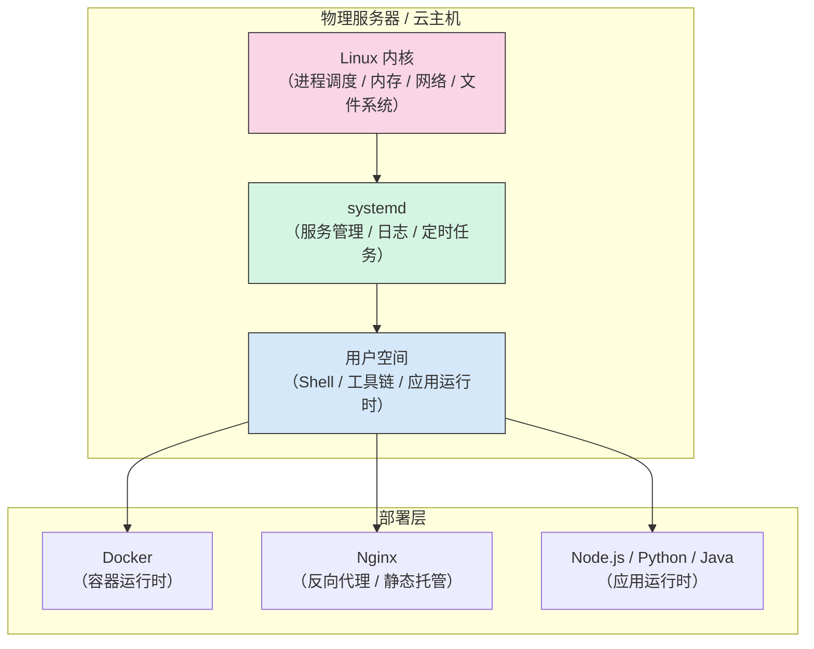

# Linux 基础学习大纲

> 面向开发者的 Linux 学习路径：不追求系统管理员级别的面面俱到，而是聚焦**日常开发与部署中最常用的 Linux 技能**——文件操作、进程管理、权限、网络排查、Shell 脚本、systemd 服务管理。

---

## 📌 元信息

| 项目 | 说明 |
|------|------|
| **预计学习时间** | 5 天（约 15-20 小时） |
| **目标读者** | 后端开发者、需要部署运维的开发者、从 GUI 转向命令行的开发者 |
| **前置模块** | 熟悉 SSH 基本使用、有一台可操作的 Linux 环境 |
| **面试覆盖** | 8 道核心题，覆盖 80% 初级运维面试 + 50% 后端面试 Linux 相关题目 |
| **实战产出** | 一个部署排障流程、一个 Nginx 日志分析脚本、一个应用部署脚本 |

---

## 🎯 学习目标

完成本模块学习后，你应该能够：

1. 熟练使用 Linux 常用命令进行文件操作、文本处理、进程管理
2. 理解用户 / 权限模型，能配置正确的文件权限
3. 能排查常见的网络问题（端口占用、DNS 解析、连接超时）
4. 会用 systemd 管理服务（启动、停止、查看日志）
5. 能编写简单的 Shell 脚本完成自动化任务
6. 在服务器上部署应用时能独立处理 80% 的常见问题

---

## 📋 前置要求

- 有一台 Linux 环境（以下任一均可）
  - 本地虚拟机（如 Ubuntu Server VM，推荐）
  - 云服务器（阿里云 / 腾讯云 / AWS EC2 的轻量应用服务器）
  - WSL2（Windows 用户）
  - Docker 容器内（`docker run -it --rm ubuntu bash`）
- 能用 SSH 连接到远程服务器（会基本的 `ssh user@host`）

---

## 🏗️ Linux 在服务器环境中的位置



> 对开发者而言，Linux 是**基础设施的基础**——Docker、Nginx、应用运行时都在它之上。

---

## 🧠 核心知识体系

| 领域 | 核心知识点 | 对开发者的价值 |
|------|-----------|---------------|
| **文件系统** | 目录结构、`ls`/`cd`/`cp`/`mv`/`rm`/`find`/`tree` | 部署文件、定位日志 |
| **文本处理** | `cat`/`grep`/`less`/`awk`/`sed`/`tail -f`/`vim` | 查日志、改配置 |
| **权限管理** | 文件权限 `chmod`/`chown`、用户与组、`sudo` | 解决"Permission denied" |
| **进程管理** | `ps`/`top`/`htop`/`kill`/`nohup`/`&` | 排查服务状态、杀进程 |
| **网络工具** | `curl`/`ping`/`ss`/`netstat`/`nslookup`/`traceroute` | 排障"连不上" |
| **包管理** | `apt`（Debian/Ubuntu）、`yum`（RHEL/CentOS） | 安装运行时和工具 |
| **服务管理** | `systemctl`/`journalctl` | 管理应用服务、查启动日志 |
| **磁盘与存储** | `df`/`du`/`lsblk`/`mount` | 排查磁盘满、挂载数据盘 |
| **Shell 脚本** | 变量、条件、循环、函数、参数、管道 | 自动化批量操作 |
| **SSH** | 密钥登录、端口转发、`scp`/`rsync` | 安全连接服务器、传文件 |

---

## 🗺️ 学习路径（5 天）

| 天数 | 主题 | 产出 |
|------|------|------|
| **Day 1** | 文件系统与基础命令 | 能在服务器上定位文件、查看目录结构、修改配置 |
| **Day 2** | 文本处理与日志排查 | 能用 `grep`/`tail`/`less` 快速定位日志中的问题 |
| **Day 3** | 用户、权限与包管理 | 能解决常见的 "Permission denied"、安装运行时 |
| **Day 4** | 进程、网络与服务管理 | 能用 `ps`/`ss` 排查进程和端口问题；能用 `systemd` 管理应用、查看日志 |
| **Day 5** | Shell 脚本入门 | 能为部署 / 监控 / 备份写一个实用脚本 |

> Day 4 内容偏多（进程 + 网络 + systemd）。如果觉得吃力，建议优先掌握进程和网络排障，systemd 部分可延后到 Shell 脚本之后再回头学。

---

## 📚 文档目录规划

```text
src/deploy/linux/
├── linux-learning-outline.md          # 本文件
├── doc/
│   ├── 01-file-system-commands.md     # 文件系统与基础命令
│   ├── 02-text-processing-log.md      # 文本处理与日志排查
│   ├── 03-user-permission-package.md  # 用户、权限与包管理
│   ├── 04-process-network-systemd.md  # 进程、网络与 systemd 服务管理
│   └── 05-shell-scripting.md          # Shell 脚本入门
└── assets/                            # 截图、架构图、流程图
```

---

## 🎮 实战项目

### 项目 1：部署排障实战
- 场景：部署一个 Node.js 应用后访问 `localhost:3000` 报错
- 需要用到：`systemctl status`、`journalctl -u`、`curl localhost:3000`、`ss -tlnp`、`tail -f`、`chmod`、`ls -l`
- 目标：能从"应用起不来"定位到具体原因并修复

### 项目 2：日志分析脚本
- 场景：Nginx 访问日志中统计 IP 访问次数、HTTP 状态码分布
- 需要用到：`awk`、`grep`、`sort`、`uniq -c`、`head`
- 目标：输出每个 IP 的请求数 + 404/500 状态码统计

### 项目 3：应用部署脚本
- 场景：写一个脚本完成拉代码 → 安装依赖 → 构建 → 启动 / 重启服务
- 需要用到：Shell 变量、条件判断、函数、`systemctl` 命令
- 目标：一个 `deploy.sh` 脚本，参数接受分支名或环境

---

## 📦 常用工具速查

```text
# 文件系统
ls -la           # 查看目录内容（含隐藏文件）
du -sh *         # 查看每个文件/目录的大小
find . -name "*.log"   # 查找 .log 文件

# 文本处理
grep -r "error" /var/log   # 递归搜索 error
tail -f access.log         # 实时查看日志
awk '{print $1}' log.txt   # 提取第一列

# 进程
ps aux | grep node    # 查看 Node 进程
top -o %MEM           # 按内存排序
kill PID              # 优雅终止（SIGTERM），先尝试
kill -9 PID           # 强制终止（SIGKILL），最后手段

# 网络
ss -tlnp              # 查看监听端口（替代 netstat）
curl -I http://localhost:3000   # 查看 HTTP 响应头
nslookup example.com  # DNS 解析

# 服务
systemctl status my-app    # 查看服务状态
journalctl -u my-app -f    # 实时查看服务日志

# 权限
chmod +x script.sh         # 添加可执行权限
chown -R deploy:deploy /app   # 修改文件归属

# 磁盘
df -h                  # 查看磁盘使用率
du -sh /var/log        # 查看目录大小
```

---

## ❌ 新手常见踩坑

| 错误操作 | 后果 | 正确做法 |
|---------|------|---------|
| `rm -rf /` 或 `rm -rf ./*` 手滑 | 系统崩溃 | 删除前 `ls` 确认路径 |
| `chmod 777` 一切 | 安全漏洞 | 按文件类型给权限：文件 644、目录 755；敏感文件 600/700 |
| 用 root 跑日常操作 | 误删/误改系统文件 | 用普通用户，需要时 `sudo` |
| 忘了 `chmod +x` 脚本 | `Permission denied` | 执行前 `chmod +x script.sh` |
| 磁盘满了不知道 | 应用写入失败 | 定期 `df -h` 检查 |
| 关闭终端后进程被 kill | 服务停止 | 用 `nohup`、`tmux` 或 `systemd` |

---

## ❓ 面试常见问题

> 以下题目标注了对应 doc 文档，细节回答请跳转到对应章节查阅。每种题型面试时能用 2-3 句话覆盖要点即可。

1. **如何查看一个进程占用了哪些端口？**（→ [04-process-network-systemd.md](doc/04-process-network-systemd.md)）
2. **一个文件权限是 `-rwxr-xr--`，各位置分别表示什么？**（→ [03-user-permission-package.md](doc/03-user-permission-package.md)）
3. **`curl localhost:3000` 返回 `Connection refused`，怎么排查？**（→ [04-process-network-systemd.md](doc/04-process-network-systemd.md)）
4. **如何让一个 Node.js 应用在后台持续运行，即使终端关闭也不会停止？**（→ [04-process-network-systemd.md](doc/04-process-network-systemd.md)）
5. **`ls -la` 看到的 `.` 开头的文件是什么？**（→ [01-file-system-commands.md](doc/01-file-system-commands.md)）
6. **如何统计一个日志文件里每个 IP 出现的次数？**（→ [02-text-processing-log.md](doc/02-text-processing-log.md)）
7. **`grep -r`、`grep -v`、`grep -c` 各有什么作用？**（→ [02-text-processing-log.md](doc/02-text-processing-log.md)）
8. **`systemd` 的 `service` 文件中 `ExecStart`、`Restart=always` 是什么含义？**（→ [04-process-network-systemd.md](doc/04-process-network-systemd.md)）

---

## ✅ 完成标准

- [ ] 能在服务器上用 `ls`/`cd`/`cp`/`mv`/`rm`/`find` 完成文件操作
- [ ] 能用 `grep`/`tail -f`/`less` 快速定位日志中的错误
- [ ] 能解释 `-rwxr-xr--` 各位置的含义
- [ ] 能用 `ss -tlnp` 查看端口占用
- [ ] 能创建一个 `systemd` service 文件管理应用
- [ ] 能写一个 20 行以上的 Shell 脚本
- [ ] 能用 `chmod` 和 `chown` 设置正确的文件权限
- [ ] 遇到 "Permission denied" 能自行解决

---

## 🔗 关联模块

- 部署实践：[Docker 学习大纲](../docker/docker-learning-outline.md)
- 反向代理：[Nginx 学习大纲](../nginx/nginx-learning-outline.md)
- CI/CD：[CI/CD 学习大纲](../ci/ci-learning-outline.md)

---

## 📝 学习建议

1. **别死记命令，记场景**：你不需要背下所有 `grep` 参数，但要知道"搜日志"用 `grep`、"实时看"用 `tail -f`
2. **一定要动手**：不要只看文档，每学一个命令就打开终端试一次
3. **Shell 脚本是分水岭**：能写 Shell 脚本的开发者，部署效率至少翻倍。重点学变量、`for` 循环、`if` 判断
4. **用 `man` 和 `--help` 自己学新命令**：`man ls`、`curl --help` 是最好的文档
5. **坚持用命令行操作**：尽量别用面板/图形界面，逼自己用命令行，一周后就习惯了
