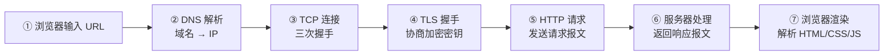
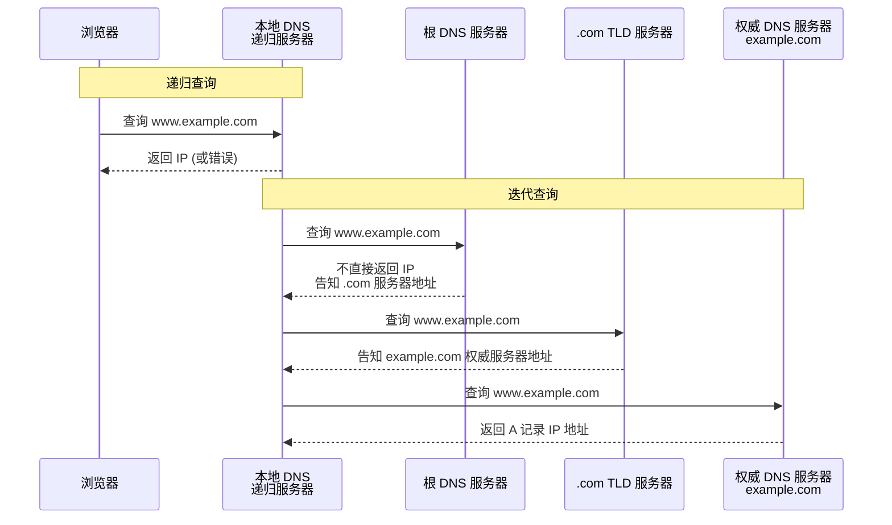
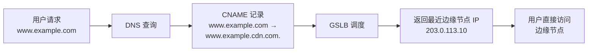
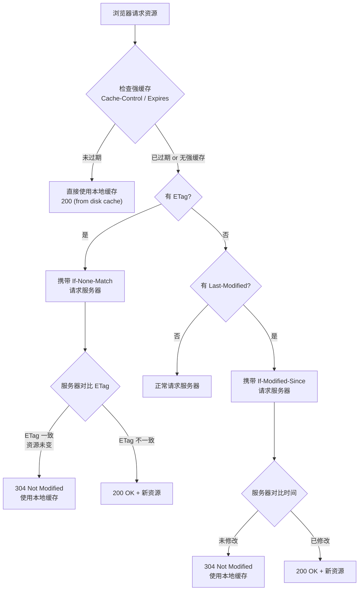

# 01 — DNS 与 HTTP 基础

> 理解从浏览器输入 URL 到页面加载的完整网络流程，掌握 DNS 解析原理与 HTTP 协议核心概念，能用 `dig` 和 `curl -v` 解决日常网络问题。

---

## 🎯 学习目标

- 能说清从输入 URL 到页面加载的 7 步流程
- 理解 DNS 递归查询与迭代查询的区别，知道常见记录类型
- 掌握 HTTP 请求/响应报文结构，能读懂常见状态码
- 理解强缓存与协商缓存的判断逻辑
- 能回答 DNS 与 HTTP 缓存相关的核心面试问题

---

## 1. 从 URL 到页面加载的完整流程

当你在浏览器输入 `https://www.example.com` 并按下回车，背后发生了 7 个关键步骤：



1. **浏览器输入 URL** — 浏览器解析 URL，提取协议、域名、端口、路径；检查是否有强缓存可用，若有则直接使用本地缓存。
2. **DNS 解析** — 将域名（如 `www.example.com`）解析为服务器 IP 地址。浏览器依次查询浏览器缓存 → 操作系统缓存（`/etc/hosts`）→ 本地 DNS 服务器 → 根 DNS 服务器 → 顶级域名服务器 → 权威 DNS 服务器。
3. **TCP 连接** — 客户端与服务器通过三次握手建立 TCP 连接（SYN → SYN-ACK → ACK），为可靠数据传输奠定基础。
4. **TLS 握手** — 在 TCP 之上进行 TLS 握手，协商加密算法、交换证书、生成对称密钥，后续通信全部加密（HTTPS 专属步骤，HTTP 跳过此步）。
5. **HTTP 请求** — 浏览器构建 HTTP 请求报文（请求行 + Header + Body），通过已建立的加密通道发送给服务器。
6. **服务器处理** — 服务器接收请求，经过路由匹配、业务逻辑处理、数据库查询等，生成 HTTP 响应报文返回给客户端。
7. **浏览器渲染** — 浏览器解析 HTML 构建 DOM 树，解析 CSS 构建 CSSOM 树，合并为 Render Tree，执行布局（Layout）和绘制（Paint），最终呈现页面。

---

## 2. DNS 详解

### 2.1 递归查询 vs 迭代查询

DNS 解析的完整链路涉及多种角色的 DNS 服务器。以查询 `www.example.com` 为例：



**递归查询**：客户端（浏览器）只向本地 DNS 服务器发一次请求，由本地 DNS 负责完成全部查找并返回最终结果——"你帮我查完，告诉我就行"。

**迭代查询**：本地 DNS 服务器依次向各级 DNS 服务器发起查询，每级服务器返回下一级的地址，而不是直接返回最终结果——"我不告诉你答案，但我告诉你去哪里问"。

> 实践中，浏览器 → 本地 DNS 是递归查询；本地 DNS → 根/TLD/权威服务器是迭代查询。

### 2.2 DNS 记录类型

| 类型 | 全称 | 用途 | 示例场景 |
|------|------|------|---------|
| **A** | Address Record | 将域名映射到 IPv4 地址 | `example.com → 93.184.216.34` |
| **AAAA** | IPv6 Address Record | 将域名映射到 IPv6 地址 | `example.com → 2606:2800:220:1:248:1893:25c8:1946` |
| **CNAME** | Canonical Name Record | 别名记录，将一个域名指向另一个域名 | `www.example.com → example.com` |
| **MX** | Mail Exchange Record | 指定邮件服务器地址及优先级 | `example.com → 10 mail.example.com` |
| **TXT** | Text Record | 存储任意文本信息，常用于验证和配置 | SPF 记录、DKIM 签名、域名所有权验证 |

### 2.3 TTL 和缓存

TTL（Time To Live）是 DNS 记录在缓存中的存活时间，以秒为单位。例如 `TTL=3600` 表示这条记录可以被缓存 1 小时。

**修改 DNS 后为什么不能立即生效？**
- 上游 DNS 服务器和各层递归服务器都会缓存记录，直到 TTL 过期才会重新查询
- 浏览器和操作系统也有 DNS 缓存
- 即使权威服务器上的记录已更新，全球所有缓存节点都需要等待 TTL 到期才会刷新

> **实践建议**：在计划修改 DNS 记录时，提前 48 小时将 TTL 从默认值（如 3600）改为 60（1 分钟），让旧记录快速过期。修改完成并验证无误后再将 TTL 恢复。

### 2.4 公共 DNS

| DNS 服务器 | IP 地址 | 特点 |
|-----------|---------|------|
| 114DNS | `114.114.114.114` | 国内运营商，延迟低，有防污染能力 |
| 阿里 DNS | `223.5.5.5` / `223.6.6.6` | 国内公共 DNS，稳定可靠 |
| Google Public DNS | `8.8.8.8` / `8.8.4.4` | 全球通用，国内延迟较高 |
| Cloudflare DNS | `1.1.1.1` / `1.0.0.1` | 重视隐私，支持 DNS over HTTPS |

### 2.5 CDN 原理

CDN（Content Delivery Network，内容分发网络）的核心是**就近分发**：用户请求时，DNS 通过 CNAME 记录将域名指向 CDN 服务商的 GSLB（Global Server Load Balancing）调度节点，GSLB 根据用户的地理位置和节点负载，返回离用户最近的边缘节点 IP。



CDN 的好处：降低延迟、减轻源站压力、抵御 DDoS 攻击。

### 2.6 DNS 劫持

**原理**：运营商在用户经过的 DNS 链路上拦截 DNS 请求，返回篡改后的结果（通常是广告页面或无法访问的提示），即使你配置了正确的 DNS 服务器。

**解决方案**：
1. **改用公共 DNS** — 将电脑或路由器的 DNS 改为 `114.114.114.114` 或 `223.5.5.5`
2. **使用 DNS over HTTPS（DoH）** — 将 DNS 查询加密在 HTTPS 中传输，运营商无法劫持。浏览器（Chrome/Firefox）和系统层面均支持配置
3. **使用 DNS over TLS（DoT）** — 类似 DoH，但使用专用 TLS 连接而非 HTTPS

### 2.7 `dig` 命令速查

```bash
# 完整追踪 DNS 解析链路（从根服务器开始）
dig +trace example.com

# 仅查询 A 记录，返回精简结果
dig example.com A +short

# 反向查询：IP 地址 → 域名
dig -x 8.8.8.8

# 查询所有记录类型（⚠️ RFC 8482 已废弃 ANY，多数 DNS 返回受限结果）
dig example.com any

# 指定 DNS 服务器查询
dig @114.114.114.114 example.com
```

---

## 3. HTTP 协议基础

### 3.1 请求报文结构

```text
┌─────────────────────────────────────┐
│ 请求行  │ GET /api/users HTTP/1.1  │  ← 方法 + 路径 + HTTP 版本
├─────────────────────────────────────┤
│ Header  │ Host: api.example.com     │  ← 键值对，每行一个
│         │ User-Agent: curl/7.68.0   │
│         │ Accept: application/json  │
│         │ Authorization: Bearer xxx │
├─────────────────────────────────────┤
│ 空行    │                           │  ← 分隔 Header 和 Body
├─────────────────────────────────────┤
│ Body    │ {"name": "Alice"}         │  ← 可选，POST/PUT 等携带请求数据
└─────────────────────────────────────┘
```

**关键要点**：
- 请求行包含 HTTP 方法（GET/POST/PUT/DELETE）、请求路径、HTTP 版本
- Header 字段名按 RFC 7230 是大小写不敏感的，但实践中建议统一为驼峰（如 `Content-Type`）
- GET 请求通常没有 Body，参数放在 URL 查询字符串中

### 3.2 响应报文结构

```text
┌──────────────────────────────────────┐
│ 状态行  │ HTTP/1.1 200 OK           │  ← HTTP 版本 + 状态码 + 原因短语
├──────────────────────────────────────┤
│ Header  │ Content-Type: application/json │
│         │ Content-Length: 42         │
│         │ Cache-Control: max-age=3600│
│         │ Set-Cookie: session=abc123 │
├──────────────────────────────────────┤
│ 空行    │                            │
├──────────────────────────────────────┤
│ Body    │ {"id": 1, "name": "Alice"} │
└──────────────────────────────────────┘
```

### 3.3 核心状态码速查

| 状态码 | 含义 | 说明 |
|--------|------|------|
| **200** OK | 请求成功 | 最常见的成功状态码，请求正常处理完毕 |
| **201** Created | 已创建 | POST 请求成功后，新资源已创建 |
| **204** No Content | 无内容 | 请求成功但无返回 Body，常用于 DELETE 操作 |
| **301** Moved Permanently | 永久重定向 | 资源已永久迁移到新 URL，浏览器会更新书签 |
| **302** Found | 临时重定向 | 资源临时移动到新 URL，下次请求还用原 URL |
| **304** Not Modified | 资源未修改 | 协商缓存生效，客户端可以使用本地缓存 |
| **400** Bad Request | 请求格式错误 | 客户端请求语法有误或参数不合法 |
| **401** Unauthorized | 未认证 | 缺少身份验证凭据或凭据无效 |
| **403** Forbidden | 禁止访问 | 服务器理解请求但拒绝执行，权限不足 |
| **404** Not Found | 资源不存在 | 请求的资源在服务器上不存在 |
| **429** Too Many Requests | 请求过多 | 客户端在一定时间内发送了太多请求（限流） |
| **500** Internal Server Error | 服务器内部错误 | 服务器遇到意外错误，无法完成请求 |
| **502** Bad Gateway | 网关错误 | 上游服务器返回无效响应（如 Nginx → 后端不通） |
| **503** Service Unavailable | 服务不可用 | 服务器暂时无法处理请求（重启/过载/维护） |

### 3.4 `curl -v` 排障利器

```bash
# 查看完整请求/响应头（-v = verbose）
curl -v https://api.example.com/health

# 仅查看响应头
curl -I https://example.com

# 跟随重定向（自动处理 301/302）
curl -L http://example.com

# 自定义请求头
curl -H "Authorization: Bearer token123" -H "Accept: application/json" \
  https://api.example.com/data

# POST 请求携带 JSON Body
curl -X POST -H "Content-Type: application/json" \
  -d '{"name":"Alice"}' \
  https://api.example.com/users

# 查看响应耗时
curl -w "\n\nTime: %{time_total}s\n" -o /dev/null -s \
  https://api.example.com
```

`curl -v` 的输出中，以 `>` 开头的行是请求头，以 `<` 开头的行是响应头，以 `*` 开头的行是连接信息（TLS 握手、证书链等）。

---

## 4. HTTP 缓存控制

### 4.1 强缓存 vs 协商缓存

**强缓存**：浏览器不向服务器发送请求，直接从本地缓存读取资源。是否使用强缓存由 `Cache-Control` 或 `Expires` 响应头决定。

**协商缓存**：浏览器向服务器发送请求，携带缓存标识（`ETag` 或 `Last-Modified`），由服务器判断资源是否变化，未变化则返回 `304 Not Modified`。

### 4.2 缓存判断逻辑



### 4.3 `Cache-Control` 指令说明

| 指令 | 含义 | 示例 |
|------|------|------|
| `max-age=<秒>` | 资源在缓存中的最大有效时间 | `max-age=3600`（1 小时） |
| `no-cache` | 每次使用前必须向服务器验证（协商缓存） | 不要误解为"不缓存" |
| `no-store` | 禁止任何缓存（包括浏览器和中间代理） | 敏感数据使用 |
| `must-revalidate` | 缓存过期后必须向服务器验证 | 配合 `max-age` 使用 |
| `public` | 任何缓存（浏览器 + CDN / 代理）都可以缓存 | 静态资源 |
| `private` | 仅浏览器可以缓存，中间代理不允许缓存 | 用户个人信息 |

> **`no-cache` vs `no-store` 的区别**：`no-cache` 是"每次用之前先问问服务器同不同意"（协商缓存），`no-store` 是"压根别存"。前者有缓存但每次验证，后者完全不缓存。

### 4.4 CDN 缓存

CDN 边缘节点也遵循 `Cache-Control` 指令，但有额外控制：

```http
# 告诉 CDN 缓存 1 小时，浏览器缓存 10 分钟
Cache-Control: public, max-age=600, s-maxage=3600
```

- **`s-maxage`** — 仅对共享缓存（CDN、代理）生效，覆盖 `max-age`
- **`public`** — 允许 CDN 和浏览器都缓存资源
- **`private`** — 仅允许浏览器缓存（如包含用户信息的页面），CDN 不得缓存

---

## 5. 面试回答模板

> **问：** 从浏览器输入 URL 到页面加载，中间发生了什么？

**答：** 主要分为 7 个步骤：

1. **URL 解析与缓存检查**：浏览器解析 URL 提取协议、域名、路径；检查强缓存是否有效，若有效则直接使用本地缓存，跳过后续所有网络请求。
2. **DNS 解析**：浏览器依次查询浏览器缓存 → 操作系统缓存（`/etc/hosts`）→ 本地 DNS 服务器 → 根 DNS 服务器 → TLD 服务器 → 权威 DNS 服务器，最终获取目标服务器的 IP 地址。
3. **TCP 三次握手**：客户端与服务器通过 SYN → SYN-ACK → ACK 建立 TCP 连接。
4. **TLS 握手**：若有 HTTPS，进行 TLS 握手协商加密算法、验证证书、生成对称密钥。
5. **HTTP 请求**：浏览器构建 HTTP 请求报文发送给服务器。
6. **服务器处理并返回响应**：服务器根据路由执行业务逻辑，返回 HTTP 响应报文。
7. **浏览器渲染**：解析 HTML/CSS/JS，构建 DOM 树和 CSSOM 树，生成 Render Tree，经过 Layout 和 Paint 呈现页面。

> **问：** DNS 的递归查询和迭代查询有什么区别？

**答：** 两者的核心区别在于**谁完成最终的解析工作**：

**递归查询**（Recursive Query）：客户端只向本地 DNS 服务器发出一次请求，由本地 DNS 负责完成整个解析过程并返回最终结果。用户侧的体验是——"我只需要问一次，不管中间查多少层，最终给我答案"。浏览器到本地 DNS 就是递归查询。

**迭代查询**（Iterative Query）：本地 DNS 服务器依次向各级 DNS 服务器发起查询，每级服务器只返回下一级服务器的地址，而不是直接返回最终的 IP 地址。各级服务器说"我不知道答案，但告诉你去哪里问"。本地 DNS 到根/TLD/权威服务器就是迭代查询。

简单记忆：**递归是"你帮我查完告诉我"，迭代是"你告诉我下一步该问谁"**。

> **问：** `Cache-Control: no-cache` 和 `no-store` 有什么区别？

**答：** 这两个指令经常被误解，它们的区别非常关键：

- **`no-cache`**：意思是"可以缓存，但每次使用前必须向服务器验证资源是否更新"。它并没有禁止缓存，而是禁止直接使用缓存——浏览器会把资源存下来，但每次请求都要带上 ETag 或 If-Modified-Since 去询问服务器"我缓存的内容还能用吗？"，如果服务器返回 304 则使用缓存，否则返回新资源。它实际是强制走协商缓存。

- **`no-store`**：意思是"禁止任何形式的缓存"。浏览器和中间代理（CDN、网关）都不能把资源存到任何缓存中，每次请求都必须完整地从服务器获取。这是最严格的缓存控制，适用于包含敏感信息（如银行账户、个人隐私数据）的响应。

**一句话总结**：`no-cache` 是"要验证才能用缓存"，`no-store` 是"根本别存"。

---

## 📝 总结

| 知识点 | 核心要点 | 对应工具 |
|--------|---------|---------|
| URL → 页面加载 | 7 步流程：DNS → TCP → TLS → HTTP → 渲染 | 无 |
| DNS | 递归/迭代查询、A/CNAME/MX/TXT/AAAA 记录 | `dig +trace`、`+short`、`-x` |
| HTTP | 请求/响应结构、14 个核心状态码 | `curl -v`、`-I`、`-L` |
| 缓存 | 强缓存 vs 协商缓存、`no-cache` vs `no-store` | 响应头分析 |
| CDN | CNAME → GSLB 调度 → 边缘节点 | — |

## 🔗 参考链接

- [网络学习大纲](../network-learning-outline.md)
- [Nginx 概述与配置基础](../../nginx/doc/01-nginx-overview-config-static.md)

---

## 🔗 下一章

[02-https-tls-certificate.md](02-https-tls-certificate.md) — TLS 握手原理、Let's Encrypt 证书管理、Nginx HTTPS 配置。
