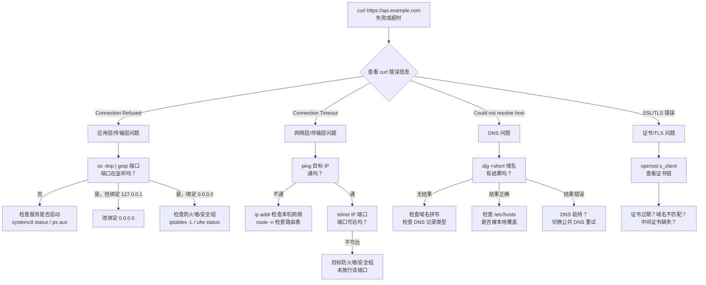

# 03 — 网络排障实战

> 掌握分层排障法，能独立解决 80% 的"连不上"问题。

---

## 🎯 学习目标

- 理解分层排障法的核心原则，能在 30 秒内定位问题出在哪一层
- 遇到 Connection Refused / Timeout / DNS 异常时，能按标准流程逐层排查
- 熟练使用 `curl -v`、`dig`、`ping`、`ss`、`traceroute`、`tcpdump` 等排障工具
- 能回答面试中关于网络排障的常见追问

---

## 1. 分层排障法

### 1.1 TCP/IP 四层模型回顾

网络排障的核心思路是**分层定位**——把复杂问题拆解到某一层，避免漫无目的地试错。

| 层号 | TCP/IP 模型 | 对应 OSI 层 | 典型协议 | 排障切入点 |
|------|-------------|-------------|----------|------------|
| 4 | 应用层 | 5-7 | HTTP/HTTPS/DNS | `curl -v` 看状态码、证书 |
| 3 | 传输层 | 4 | TCP/UDP | `ss -tlnp` 查端口监听 |
| 2 | 网络层 | 3 | IP/ICMP | `ping` 连通性、`traceroute` 路由 |
| 1 | 链路层 | 1-2 | ARP/MAC | `ip link`、物理线缆/网卡状态 |

### 1.2 从顶层开始排查

排障的黄金法则是**从应用层开始，逐层向下**。原因是：

- 应用层的症状最直接（浏览器报什么错、`curl` 返回什么）
- 大多数"连不上"问题出在应用层或传输层（服务没启动、防火墙拦截）
- 逐层向下可以快速排除，而不是一开始就去抓包看链路层



---

## 2. 三个典型场景的完整排障流程

### 2.1 Connection Refused

**现象**：`curl` 报 `Connection refused`，或浏览器显示"无法连接"。

**本质**：本机发送的 TCP SYN 包到达了目标主机，但目标主机上没有进程监听该端口，内核直接回复 RST 包。

**排查命令链**：

```bash
# Step 1: 确认服务进程是否存在
ps aux | grep 应用名
systemctl status 服务名

# Step 2: 确认端口是否在监听（sudo 可显示进程信息）
sudo ss -tlnp | grep 端口号
# 没有任何输出 → 服务没起来或端口号配错
# 输出 LISTEN 127.0.0.1:端口 → 只绑定了环回地址

# Step 3: 如果服务已启动但端口不在监听，查看应用日志
journalctl -u 服务名 -n 50 --no-pager

# Step 4: 本机测试排除防火墙
curl localhost:端口号

# Step 5: 远程测试
curl -v http://目标IP:端口号
```

**判断逻辑**：

| 现象 | 原因 | 解决 |
|------|------|------|
| `ss -tlnp` 无输出 | 服务没启动，或启动后崩溃 | 查看应用日志，修复后重启 |
| `ss` 显示 127.0.0.1:端口 | 只绑定了环回地址 | 修改配置绑定 `0.0.0.0` |
| 本机 `curl localhost` 正常，远程拒绝 | 防火墙/安全组拦截 | 检查 `iptables`、云服务商安全组 |
| 端口被其他进程占用 | 端口冲突 | 修改应用端口或杀掉占用进程 |

### 2.2 Connection Timeout

**现象**：`curl` 长时间无响应后报 `Connection timed out`。

**本质**：TCP SYN 包发出后没有收到 SYN-ACK 响应（可能丢包、路由不可达、防火墙静默丢弃）。

**排查命令链**：

```bash
# Step 1: 基础连通性检查
ping -c 5 目标IP
# 不通 → 网络层问题；通 → 往下排查

# Step 2: DNS 解析检查（如果是域名访问）
dig +short 域名
# 解析结果是否正确？

# Step 3: 路由追踪
traceroute -n 目标IP
# 看在哪一跳卡住（连续 * * * 表示该跳无响应）

# Step 4: 端口可达性测试（更精确）
# 用 telnet 测试 TCP 端口
telnet 目标IP 端口号
# 或用 curl 指定 IP 绕过 DNS
curl -v --connect-timeout 5 http://目标IP:端口号
```

**判断逻辑**：

| 现象 | 原因 | 解决 |
|------|------|------|
| `ping` 不通 | 网络不可达、目标关机、ICMP 被禁 | 检查路由表、确认目标状态 |
| `ping` 通但 `telnet` 超时 | 防火墙/安全组静默丢弃入站 SYN | 检查目标主机防火墙和安全组规则 |
| `traceroute` 在某跳后全 `*` | 中间路由拦截或路由黑洞 | 联系网络管理员，检查路由策略 |
| 部分用户能连、部分不能 | 区域性的 CDN/BGP 问题 | 切换 DNS 或联系 ISP |

> **关键区分**：`Connection refused` 是 TCP 连接被**主动拒绝**（RST），`Connection timeout` 是**没有任何响应**（SYN 发出去没人理）。两者的排查方向完全不同。

### 2.3 DNS 解析异常

**现象**：`curl` 报 `Could not resolve host`，或解析到了错误的 IP。

**排查命令链**：

```bash
# Step 1: 确认域名能否解析
dig +short example.com
# 有输出 → 解析正常；无输出 → 解析失败

# Step 2: 全链路追踪
dig +trace example.com
# 看在哪一环中断（根服务器 → TLD → 权威服务器）

# Step 3: 切换 DNS 服务器重试
dig @8.8.8.8 example.com        # Google DNS
dig @223.5.5.5 example.com      # 阿里 DNS

# Step 4: 反向查询（确认 IP 归属）
dig -x 8.8.8.8

# Step 5: 检查本地 hosts 文件
cat /etc/hosts
# 确认没有被本地条目覆盖

# Step 6: 检查 DNS 缓存（macOS）
dscacheutil -q host -a name example.com
# Linux 通常没有系统级缓存，取决于 nscd/systemd-resolved
```

**判断逻辑**：

| 现象 | 原因 | 解决 |
|------|------|------|
| `dig +short` 无输出 | DNS 记录不存在或解析链路中断 | 检查域名管理后台的 DNS 记录 |
| `dig @8.8.8.8` 正常，默认 DNS 异常 | 运营商 DNS 服务器故障或劫持 | 修改 `/etc/resolv.conf` 改用公共 DNS |
| 解析到错误 IP | DNS 劫持（运营商） | 改用公共 DNS 或 DoH |
| `dig` 结果正确但应用仍报错 | 本地 DNS 缓存未刷新 | 等待 TTL 过期或刷新缓存 |
| `/etc/hosts` 有覆盖条目 | 本地配置优先级高于 DNS | 确认 hosts 内容是否正确 |

> **注意 DNS 记录类型**：A 记录返回 IPv4，AAAA 记录返回 IPv6，CNAME 是域名别名。如果用 `dig` 查询 A 记录但配置的是 CNAME，也会返回空结果。

---

## 3. 实用工具详解

### 3.1 `curl -v` —— HTTP/HTTPS 排障一哥

`curl -v`（verbose 模式）会输出完整的请求/响应头、TCP 连接信息、TLS 握手过程和时间统计。

```bash
# 最常用：查看完整通信过程
curl -v https://api.example.com/health

# 只看响应头（HEAD 请求）
curl -I https://example.com

# 查看各阶段耗时
curl -w "\ntime_connect: %{time_connect}s\n\
time_starttransfer: %{time_starttransfer}s\n\
time_total: %{time_total}s\n" -o /dev/null -s https://example.com

# 跟随重定向并限制超时
curl -vL --connect-timeout 5 https://example.com
```

**`-v` 输出解读**：

```text
*   Trying 93.184.216.34:443...                  # 开始 TCP 连接
* Connected to example.com (93.184.216.34) port 443  # TCP 握手完成
* ALPN: offers h2,http/1.1                       # TLS 协商
* SSL connection using TLSv1.3 / AEAD-CHACHA20... # 加密套件
* Server certificate:                             # 证书信息
*   subject: CN=example.com
*   start date: Jul 15 00:00:00 2026 GMT
*   expire date: Jul 15 00:00:00 2027 GMT
*   issuer: C=US, O=Let's Encrypt, CN=R3
*   SSL certificate verify ok.
> GET / HTTP/1.1                                  # 请求头
> Host: example.com
> User-Agent: curl/8.0.0
>
< HTTP/1.1 200 OK                                # 响应头
< Content-Type: text/html
< Date: Fri, 24 Jul 2026 10:00:00 GMT
```

**看延迟**：使用 `-w` 参数输出各阶段耗时：

- `time_connect`：TCP 握手完成耗时
- `time_starttransfer`：从开始到收到第一个字节的耗时（包含 TLS 握手）
- `time_total`：总耗时
- `time_connect` 高 → 网络延迟或路由问题
- `time_starttransfer` - `time_connect` 高 → 服务端处理慢

### 3.2 `dig` —— DNS 瑞士军刀

```bash
# 最简查询（默认 A 记录）
dig example.com

# 只看 IP 地址
dig +short example.com

# 查询 AAAA 记录（IPv6）
dig example.com AAAA +short

# 查询 CNAME 记录
dig www.example.com CNAME +short

# 从根开始全链路追踪
dig +trace example.com

# 指定 DNS 服务器
dig @8.8.8.8 example.com

# 反向查询（IP → 域名）
dig -x 8.8.8.8
```

**输出关键信息**：

- `status: NOERROR` — 查询成功（即使没有记录也返回 NOERROR）
- `status: NXDOMAIN` — 域名不存在
- `ANSWER SECTION` — 查询到的记录
- `AUTHORITY SECTION` — 权威 DNS 服务器
- `Query time` — 查询耗时

### 3.3 `ping` —— ICMP 连通性测试

```bash
# 发 5 个包后停止
ping -c 5 google.com

# 设置超时（秒）
ping -c 5 -W 3 10.0.0.1

# MTU 探测（找出最大可用 MTU）
ping -c 3 -M do -s 1472 google.com
# -M do: 禁止分片（Don't Fragment）
# -s 1472: payload 大小（1472 + 28 ICMP 头 = 1500）
# 如果报错 "Message too long"，减小 -s 值
```

**注意事项**：

- 云服务器默认禁用 ICMP（如 AWS 安全组），`ping` 不通不代表连不上
- ICMP 包可能被运营商限速或丢弃
- 100% 丢包但应用正常 → 大概率是 ICMP 被拦截

### 3.4 `traceroute` / `mtr` —— 路由追踪

```bash
# 基本路由追踪
traceroute example.com

# 不解析主机名（更快）
traceroute -n example.com

# 设置超时和最大跳数
traceroute -n -w 2 -m 30 example.com

# mtr：持续追踪 + 统计（更直观）
mtr example.com

# mtr 报告模式（发送指定包数后退出）
mtr -r -c 10 example.com
```

**`mtr` 输出解读**：

```text
                                My traceroute  [v0.95]
example.com (0.0.0.0)                                  2026-07-24T10:00:00+0800
Keys: Help   Display mode   Restart statistics   Order of fields   quit
                              Packets               Pings
Host                        Loss%   Snt   Last   Avg  Best  Wrst StDev
1. 192.168.1.1              0.0%    10    1.2    1.5   0.8   3.2   0.7
2. 10.0.0.1                 0.0%    10    3.1    3.5   2.8   5.1   0.6
3. 172.16.0.1               0.0%    10   12.5   13.1  11.8  16.3   1.2
4. ???                     100.0%   10    0.0    0.0   0.0   0.0   0.0   ← 丢包
5. 142.250.80.14           0.0%    10   22.1   23.4  21.8  26.7   1.5
```

**场景**：用户反馈"访问慢"，`mtr` 能直观看到哪一跳延迟高或丢包。第 4 跳 100% 丢包但后续正常 → 说明中间路由器不响应 ICMP，不是真的丢包。

### 3.5 `ss -tlnp` —— 端口监听检查

```bash
# 查看所有 TCP 监听端口（肌肉记忆）
ss -tlnp

# 查看所有连接状态（含 ESTAB、TIME_WAIT 等）
ss -tanp

# 过滤特定端口
ss -tlnp | grep 3000

# 查看 UDP 监听
ss -ulnp

# 查看进程的详细连接信息
ss -tlnp | grep -E "PID"
```

**参数速记**：`-t`（TCP）+ `-l`（监听）+ `-n`（不解析服务名）+ `-p`（显示进程）= 排查端口的标准组合。

### 3.6 `tcpdump` —— 抓包分析

```bash
# 抓取特定网卡和端口的数据包
sudo tcpdump -i eth0 port 443

# 抓取 HTTP 请求（80 端口）
sudo tcpdump -i eth0 tcp port 80 -A
# -A: 以 ASCII 格式显示包内容

# 抓取并保存到文件（用 Wireshark 分析）
sudo tcpdump -i eth0 port 443 -w capture.pcap

# 只抓取 SYN 包（排查连接建立问题）
sudo tcpdump -i eth0 'tcp[tcpflags] & tcp-syn != 0 and tcp[tcpflags] & tcp-ack == 0'

# 限制抓取数量
sudo tcpdump -i eth0 port 443 -c 100
```

**使用时机**：当以上所有工具都无法定位时，`tcpdump` 能让你看到最原始的包交换过程——确认 SYN 是否发出、是否收到 SYN-ACK、是否收到 RST。

---

## 4. 面试回答模板

> **问：** `curl -v` 能看到哪些信息？怎么看延迟？

答：`curl -v` 能输出以下关键信息：

1. **TCP 连接信息**：目标 IP 和端口、是否连接成功
2. **TLS 握手信息**：TLS 版本、加密套件、服务器证书（主体、签发者、有效期）、证书验证结果
3. **请求头**：发送的 HTTP 方法、路径、Header
4. **响应头**：HTTP 状态码、Content-Type、Server 等
5. **时间统计**：结合 `-w` 参数可以输出各阶段耗时

看延迟时，使用 `-w` 自定义输出：

```
curl -w "TCP连接: %{time_connect}s\n首字节: %{time_starttransfer}s\n总计: %{time_total}s\n" \
  -o /dev/null -s https://example.com
```

- `time_connect` 高 → 网络延迟大（可能是物理距离远或路由问题）
- `time_starttransfer` - `time_connect` 高 → 服务端处理慢（需要优化后端性能）
- `time_total` 高且前两者正常 → 响应体传输慢（带宽或大文件问题）

---

> **问：** `ping` 不通但 `curl` 能通，可能是什么原因？

答：这是非常经典的场景，可能的原因有：

1. **ICMP 被防火墙拦截**（最常见）：云服务商的安全组或主机的 iptables 通常只放行 TCP/UDP，不放行 ICMP 协议。`ping` 使用 ICMP 协议，而 `curl` 使用 TCP 协议，两者不同。
2. **网络设备禁止 ICMP**：中间路由器或交换机可能配置了"丢弃 ICMP 包"的策略，但正常转发业务流量。
3. **ICMP 限速**：某些设备对 ICMP 包有 rate limit，超过后丢弃，但 TCP 流量正常。
4. **目标主机禁用 ICMP 响应**：`/proc/sys/net/ipv4/icmp_echo_ignore_all` 设为 1 时，主机不响应 ping。

**排查建议**：用 `curl -v` 确认 HTTP/HTTPS 确实正常，用 `telnet IP 端口` 确认 TCP 连通性。如果业务正常，可以忽略 `ping` 不通的问题。反之，如果 `ping` 通但 `curl` 不通，则是应用层或传输层的问题。

---

> **问：** 修改 DNS 记录后为什么不能立即生效？

答：主要原因有三层缓存机制：

1. **DNS 解析器缓存**：操作系统或本地 DNS 服务器（如 `systemd-resolved`、`dnsmasq`）会缓存 DNS 查询结果，缓存时间由记录的 **TTL（Time To Live）** 值决定。修改记录前查询到的旧结果会持续缓存，直到 TTL 过期。
2. **递归 DNS 服务器缓存**：运营商或公共 DNS 服务器的缓存。即使本机清了缓存，上游 DNS 服务器可能还在返回旧记录。8.8.8.8 等公共 DNS 服务通常遵循 TTL，但部分运营商 DNS 可能忽略 TTL 强制缓存更长时间。
3. **应用层缓存**：浏览器有内部 DNS 缓存（Chrome 的 `net::` 缓存）、操作系统有 `dnsmasq` / `nscd` 缓存、Java 等运行时有 JVM DNS 缓存。

**加速生效的方法**：

- **降低 TTL**：修改记录前先将 TTL 调小（如 60 秒），等待原 TTL 过期后再修改记录值，这样新记录在全球扩散只需 1 分钟
- **切换 DNS 服务器**：`dig @8.8.8.8 域名` 如果返回新记录，说明是本地或运营商缓存问题
- **刷新本地缓存**：
  - macOS：`sudo killall -HUP mDNSResponder`
  - Linux（systemd）：`sudo resolvectl flush-caches`
  - Windows：`ipconfig /flushdns`
- **等待**：最终还是要等 TTL 在全球 DNS 服务器上自然过期

---

## ✅ 本日总结

| 技能 | 掌握标准 |
|------|----------|
| 分层排障法 | 能根据错误信息快速定位问题所在层 |
| Connection Refused | 能用 `ss` + `systemctl` + 日志逐层排查 |
| Connection Timeout | 能区分超时类型，用 `ping` + `traceroute` + `telnet` 排查 |
| DNS 异常 | 能用 `dig` + `+trace` + `@DNS` 定位解析问题 |
| `curl -v` | 能读懂完整输出，会用 `-w` 看延迟 |
| `tcpdump` | 知道基本用法和抓包分析的时机 |

---

## 🔗 参考链接

- [RFC 1122 — Internet Layer Requirements](https://datatracker.ietf.org/doc/html/rfc1122)
- [curl man page](https://man7.org/linux/man-pages/man1/curl.1.html)
- [dig man page](https://man7.org/linux/man-pages/man1/dig.1.html)
- [tcpdump man page](https://www.tcpdump.org/manpages/tcpdump.1.html)

---

## 🔗 下一章

[04-cors-proxy-lb.md](04-cors-proxy-lb.md) — CORS 预检流程、反向代理、四层 vs 七层负载均衡。
