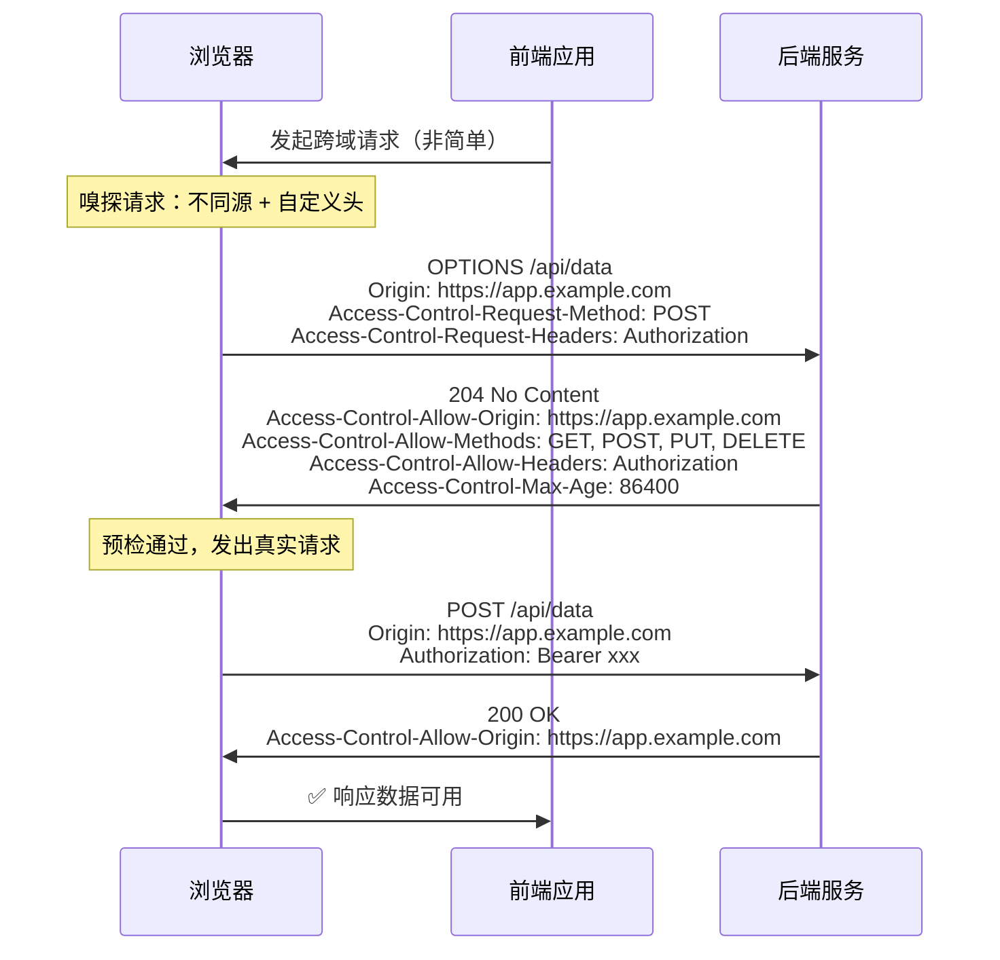

# 04 - CORS、代理与负载均衡

> 掌握 CORS 预检流程，能配置 Nginx 反向代理和简单负载均衡。

---

## 🎯 学习目标

- 理解同源策略的初衷及 CORS 的工作机制
- 掌握简单请求和预检请求的触发条件（**面试高频**）
- 理解正向代理与反向代理的区别
- 能独立配置 Nginx 反向代理（含 CORS 统一处理、HTTPS 终结）
- 掌握四层与七层负载均衡的区别及常见策略

---

## 1. CORS 详解

### 1.1 同源策略的初衷

浏览器的同源策略（Same-Origin Policy）是 Web 安全模型的基石。它的初衷很简单：**防止一个网站的脚本读取另一个网站的敏感数据**。

```text
┌──────────────────────────────────────────────────────────┐
│  用户已登录 bank.com                                     │
│  浏览器中存有 bank.com 的 Cookie / Session               │
├──────────────────────────────────────────────────────────┤
│  ┌─────────────────┐     ┌────────────────┐             │
│  │  bank.com 页面   │     │  malicious.com  │             │
│  │  (用户打开了)    │     │  嵌套 iframe     │             │
│  └────────┬────────┘     └───────┬────────┘             │
│           │                      │                       │
│           │  请求 bank.com/api   │  ❌ 读取银行数据？     │
│           │  ✅ 允许（同源）     │  🚫 同源策略拦截      │
│           ▼                      ▼                       │
│  返回用户账户数据         拒绝读取响应                      │
└──────────────────────────────────────────────────────────┘
```

如果没有同源策略，恶意网站可以通过脚本发起跨域请求，利用用户已登录的 Cookie 读取银行账户数据。**浏览器允许发送跨域请求**（否则 CDN、API 全废了），但**阻止 JavaScript 读取跨域响应的内容**。

### 1.2 跨域场景

什么情况算"跨域"？只要以下三者之一不同，即为跨域：

| 维度 | 示例 1（同源） | 示例 2（跨域） |
|------|---------------|---------------|
| **协议** | `http://example.com` | `https://example.com` |
| **域名** | `https://app.example.com` | `https://api.example.com` |
| **端口** | `https://example.com:443` | `https://example.com:8080` |

```bash
# 以下所有请求相对于 http://localhost:3000 都是跨域的
# http://localhost:4000       ← 端口不同
# https://localhost:3000      ← 协议不同
# https://api.example.com     ← 域名不同
```

### 1.3 简单请求 vs 预检请求

浏览器将跨域请求分为两类：**简单请求**和**非简单请求**。后者会先触发一次预检请求（Preflight）。

#### 简单请求的条件

必须**同时满足**以下所有条件：

1. **方法**：`GET`、`HEAD`、`POST` 之一
2. **请求头**：只能包含 Fetch 规范定义的"安全"头（如 `Accept`、`Accept-Language`、`Content-Language`、`Content-Type` 等），**不能有自定义头**
3. **`Content-Type`**：仅限于 `text/plain`、`multipart/form-data`、`application/x-www-form-urlencoded`

**不符合上述任一条件，即触发预检请求。**

```js
// 简单请求：不触发 OPTIONS 预检
fetch('https://api.example.com/data')

// 非简单请求：会触发预检（自定义 Authorization 头）
fetch('https://api.example.com/data', {
  headers: { 'Authorization': 'Bearer xxx' }
})

// 非简单请求：Content-Type 是 application/json
fetch('https://api.example.com/data', {
  method: 'POST',
  headers: { 'Content-Type': 'application/json' },
  body: JSON.stringify({ name: 'test' })
})
```

#### 预检请求流程



### 1.4 常见响应头详解

| 响应头 | 作用 | 示例值 |
|--------|------|--------|
| `Access-Control-Allow-Origin` | 允许哪些源访问 | `*` 或 `https://app.example.com` |
| `Access-Control-Allow-Methods` | 允许哪些 HTTP 方法 | `GET, POST, PUT, DELETE` |
| `Access-Control-Allow-Headers` | 允许哪些自定义请求头 | `Authorization, Content-Type` |
| `Access-Control-Allow-Credentials` | 是否允许携带凭证 | `true` |
| `Access-Control-Max-Age` | 预检结果缓存时间（秒） | `86400` |
| `Access-Control-Expose-Headers` | 允许 JS 读取哪些响应头 | `X-Total-Count, X-Request-Id` |

### 1.5 凭证请求（Credentials）

当请求需要携带 Cookie 或 HTTP 认证信息时，前端需要设置 `credentials: 'include'`：

```js
// 前端：允许发送 Cookie
fetch('https://api.example.com/data', {
  credentials: 'include'
})
```

**此时后端必须满足：**

- `Access-Control-Allow-Origin` **不能是 `*`**，必须指定明确的源
- `Access-Control-Allow-Credentials: true`

```text
# ❌ 错误配置（凭证请求下不允许用 *）
Access-Control-Allow-Origin: *
Access-Control-Allow-Credentials: true   # 浏览器会拒绝

# ✅ 正确配置
Access-Control-Allow-Origin: https://app.example.com
Access-Control-Allow-Credentials: true
```

### 1.6 面试追问：CORS 是前端还是后端问题？

> **问：** CORS 错误是前端问题还是后端问题？

**答：** 严格来说是**后端/服务端问题**。CORS 错误的本质是服务端没有正确配置跨域响应头，但**拦截行为发生在浏览器端**。

```text
┌───────────────────────────────────────────┐
│  ❌ 常见误区："前端跨域"                      │
│                                            │
│  请求发得出 ❌ 响应收不到                     │
│                                            │
│  根源：后端未配置 Access-Control-Allow-* 头   │
│  表象：浏览器拦截响应，JS 拿不到数据           │
│  排查方向：                                │
│  1. 后端是否处理了 OPTIONS 预检请求？        │
│  2. 响应头是否返回了正确的 Allow-Origin？     │
│  3. 如果需要带凭证，Allow-Origin 是否用了 *？ │
└───────────────────────────────────────────┘
```

**非浏览器环境（如 curl、Postman、服务器间调用）不存在 CORS 问题。** 这就是最好的证明——CORS 是浏览器安全机制，不是 HTTP 协议的强制要求。

---

## 2. Nginx 反向代理

### 2.1 正向代理 vs 反向代理

| 维度 | 正向代理（Forward Proxy） | 反向代理（Reverse Proxy） |
|------|--------------------------|--------------------------|
| **角色** | 代表**客户端**发送请求 | 代表**服务端**接收请求 |
| **客户端知晓** | 知道自己在用代理 | **不知道**有反向代理存在 |
| **典型场景** | 翻墙、公司内网访问外网 | 负载均衡、HTTPS 终结、隐藏后端 |
| **配置位置** | 配置在**客户端**（浏览器/系统） | 配置在**服务端**（Nginx / 网关） |
| **示例工具** | Squid、Shadowsocks、Clash | Nginx、HAProxy、Caddy |

```text
正向代理：
  客户端 → [正向代理] → 目标服务器
  （客户端知道代理的存在）

反向代理：
  客户端 → [反向代理] → 后端服务器（对内隐藏）
  （客户端只认识反向代理，不知道后端有机器）
```

### 2.2 Nginx 反代配置基础

```nginx
server {
    listen 80;
    server_name api.example.com;

    location /api/ {
        # 将请求转发到后端服务
        proxy_pass http://localhost:3000/;

        # 转发客户端真实信息
        proxy_set_header Host $host;
        proxy_set_header X-Real-IP $remote_addr;
        proxy_set_header X-Forwarded-For $proxy_add_x_forwarded_for;
        proxy_set_header X-Forwarded-Proto $scheme;
    }
}
```

**`proxy_pass` 末尾的 `/` 很关键**：

| 配置 | 请求 `/api/users` 转发的路径 |
|------|---------------------------|
| `proxy_pass http://backend;` | `/api/users`（不替换路径） |
| `proxy_pass http://backend/;` | `/users`（去掉 `/api` 前缀） |
| `proxy_pass http://backend/new;` | `/new/users`（替换前缀） |

### 2.3 反向代理的常见用途

| 用途 | 说明 |
|------|------|
| **隐藏后端** | 客户端只看到反向代理的 IP，后端服务器不暴露 |
| **统一入口** | 多个微服务统一到一个域名下，通过路径分发 |
| **解决跨域** | 同域代理——前端请求同域 Nginx，Nginx 转发到不同后端 |
| **HTTPS 终结** | Nginx 处理 TLS 加密，后端用 HTTP 通信（减轻后端压力） |
| **负载均衡** | 将请求分发到多个后端实例 |
| **缓存加速** | 静态资源缓存，减少后端压力 |
| **限流/安全** | IP 限制、请求频率限制、WAF |

### 2.4 在 Nginx 层统一处理 CORS

后端每新增一个接口都要配 CORS 头，容易遗漏。更好的实践是**在 Nginx 网关层统一处理**：

```nginx
server {
    listen 443 ssl http2;
    server_name api.example.com;

    ssl_certificate     /etc/letsencrypt/live/api.example.com/fullchain.pem;
    ssl_certificate_key /etc/letsencrypt/live/api.example.com/privkey.pem;
    ssl_protocols       TLSv1.2 TLSv1.3;
    ssl_ciphers         HIGH:!aNULL:!MD5;

    # 统一 CORS 处理（对所有 location 生效）
    # 使用 always 确保 4xx/5xx 响应也带上 CORS 头
    add_header Access-Control-Allow-Origin $http_origin always;
    add_header Access-Control-Allow-Methods "GET, POST, PUT, DELETE, PATCH, OPTIONS" always;
    add_header Access-Control-Allow-Headers "Authorization, Content-Type, X-Requested-With" always;
    add_header Access-Control-Allow-Credentials true always;
    add_header Access-Control-Max-Age 86400 always;

    # 预检请求直接返回 204
    # ⚠️ 注意：Nginx 的 if 块中只要出现 add_header，父级的 add_header 不会继承到该分支
    # 因此需要在这里补全 CORS 头
    if ($request_method = OPTIONS) {
        add_header Access-Control-Allow-Origin $http_origin always;
        add_header Access-Control-Allow-Methods "GET, POST, PUT, DELETE, PATCH, OPTIONS" always;
        add_header Access-Control-Allow-Headers "Authorization, Content-Type, X-Requested-With" always;
        add_header Access-Control-Allow-Credentials true always;
        add_header Access-Control-Max-Age 86400 always;
        add_header Content-Length 0;
        add_header Content-Type text/plain;
        return 204;
    }

    # 转发客户端真实 IP
    proxy_set_header Host $host;
    proxy_set_header X-Real-IP $remote_addr;
    proxy_set_header X-Forwarded-For $proxy_add_x_forwarded_for;
    proxy_set_header X-Forwarded-Proto $scheme;

    location /api/ {
        proxy_pass http://backend:3000/;
    }

    location /auth/ {
        proxy_pass http://auth-service:4000/;
    }
}
```

> **注意**：这里 `Access-Control-Allow-Origin` 用了 `$http_origin`（即请求头中的 `Origin`），可以动态允许任意源。生产环境如果要限制源，可以搭配 `map` 指令做白名单校验。

```nginx
# 白名单方式（更安全，仅适用于 API 网关场景）
# ⚠️ 注意：此配置会拦截所有不含 Origin 头的请求（如直接浏览器访问、静态资源加载）
# 仅在所有请求预期都携带 Origin 头的场景下使用（如纯 API 代理）
map $http_origin $cors_origin {
    default "";
    "~^https://app\.example\.com$" $http_origin;
    "~^https://admin\.example\.com$" $http_origin;
}

server {
    # ...
    add_header Access-Control-Allow-Origin $cors_origin always;
    # 如果 $cors_origin 为空，拒绝请求（仅 API 场景）
    if ($cors_origin = "") {
        return 403;
    }
}
```

### 2.5 完整 Nginx 配置示例

以下是一份可用于生产环境的 Nginx 反代配置（含 HTTPS、CORS、转发头、安全头）：

```nginx
upstream backend {
    server 10.0.0.1:3000 weight=3;
    server 10.0.0.2:3000 weight=1;
    keepalive 32;
}

server {
    listen 443 ssl http2;
    server_name api.example.com;

    # TLS 配置
    ssl_certificate     /etc/letsencrypt/live/api.example.com/fullchain.pem;
    ssl_certificate_key /etc/letsencrypt/live/api.example.com/privkey.pem;
    ssl_protocols       TLSv1.2 TLSv1.3;
    ssl_ciphers         HIGH:!aNULL:!MD5;
    ssl_prefer_server_ciphers on;
    ssl_session_cache   shared:SSL:10m;
    ssl_session_timeout 10m;

    # HSTS
    add_header Strict-Transport-Security "max-age=31536000; includeSubDomains" always;

    # 安全头
    add_header X-Content-Type-Options nosniff always;
    add_header X-Frame-Options SAMEORIGIN always;

    # CORS 统一处理
    add_header Access-Control-Allow-Origin $http_origin always;
    add_header Access-Control-Allow-Methods "GET, POST, PUT, DELETE, PATCH, OPTIONS" always;
    add_header Access-Control-Allow-Headers "Authorization, Content-Type, X-Requested-With" always;
    add_header Access-Control-Allow-Credentials true always;
    add_header Access-Control-Max-Age 86400 always;

    # 预检请求
    # ⚠️ Nginx 的 if 块中需补全 CORS 头，父级的 add_header 不会继承
    if ($request_method = OPTIONS) {
        add_header Access-Control-Allow-Origin $http_origin always;
        add_header Access-Control-Allow-Methods "GET, POST, PUT, DELETE, PATCH, OPTIONS" always;
        add_header Access-Control-Allow-Headers "Authorization, Content-Type, X-Requested-With" always;
        add_header Access-Control-Allow-Credentials true always;
        add_header Access-Control-Max-Age 86400 always;
        add_header Content-Length 0;
        add_header Content-Type text/plain;
        return 204;
    }

    # 转发头
    proxy_set_header Host $host;
    proxy_set_header X-Real-IP $remote_addr;
    proxy_set_header X-Forwarded-For $proxy_add_x_forwarded_for;
    proxy_set_header X-Forwarded-Proto $scheme;

    # 超时配置
    proxy_connect_timeout 5s;
    proxy_send_timeout    10s;
    proxy_read_timeout    30s;

    location /api/ {
        proxy_pass http://backend/;
    }

    location /static/ {
        alias /var/www/static/;
        expires 30d;
        add_header Cache-Control "public, immutable";
    }
}

# HTTP → HTTPS 跳转
server {
    listen 80;
    server_name api.example.com;
    return 301 https://$host$request_uri;
}
```

---

## 3. 四层 vs 七层负载均衡

### 3.1 对比表格

| 维度 | 四层（L4） | 七层（L7） |
|------|-----------|-----------|
| **工作层级** | 传输层（TCP/UDP） | 应用层（HTTP/HTTPS） |
| **转发依据** | IP + 端口 | URL、Header、Cookie、请求体 |
| **是否解析报文** | 否（只看包头） | 是（解析 HTTP 报文） |
| **典型工具** | HAProxy（TCP 模式）、LVS、F5 | Nginx、HAProxy（HTTP 模式）、Traefik |
| **性能** | 高（吞吐大、延迟低） | 略低（需解析 HTTP） |
| **功能丰富度** | 低（只能分发连接） | 高（可做路由、重写、限流） |
| **SSL 终结** | 不支持（但可透传 TLS） | 支持 |
| **适用场景** | 数据库负载均衡、TCP 长连接 | Web API、微服务网关 |

```text
L4 负载均衡：                         L7 负载均衡：
                                    
客户端 ─→ L4 均衡器 ─→ 后端           客户端 ─→ L7 均衡器 ─→ 后端
        只看目标 IP:Port                   解析 HTTP 路径/头
        按连接分发                         按内容路由
                                        
        游戏服务器、Redis                   Web API、前端页面
        TCP 长连接场景                     RESTful 微服务
```

### 3.2 Nginx upstream 配置

```nginx
# 定义后端服务器组
upstream backend {
    # 默认轮询（round-robin）
    server 10.0.0.1:3000 weight=3;     # weight=3：权重 3，处理 3/6 的请求
    server 10.0.0.2:3000 weight=2;     # weight=2：处理 2/6 的请求
    server 10.0.0.3:3000 weight=1;     # weight=1：处理 1/6 的请求

    server 10.0.0.4:3000 backup;       # 备份服务器，其他都挂了才用

    # 健康检查（需要 nginx-plus 或 nginx_upstream_check_module）
    # check interval=3000 rise=2 fall=5 timeout=1000 type=http;
    # check_http_send "GET /health HTTP/1.0\r\n\r\n";
}

server {
    listen 80;
    server_name api.example.com;

    location / {
        proxy_pass http://backend;
        proxy_set_header Host $host;
    }
}
```

### 3.3 负载均衡策略

| 策略 | Nginx 配置方式 | 说明 | 适用场景 |
|------|--------------|------|---------|
| **轮询** | 默认（无需配置） | 按顺序逐个分发 | 后端配置相同，无状态服务 |
| **加权轮询** | `server ... weight=3` | 按权重比例分发 | 后端机器性能不均 |
| **最少连接** | `least_conn` | 分发到当前连接数最少的节点 | 长连接或请求处理时间差异大 |
| **IP hash** | `ip_hash` | 同一 IP 固定分发到同一节点 | 需要会话保持（sticky session） |
| **随机** | `random` | 随机选择节点 | 测试环境 |

```nginx
# 最少连接
upstream backend {
    least_conn;
    server 10.0.0.1:3000;
    server 10.0.0.2:3000;
}

# IP hash（会话保持）
upstream backend {
    ip_hash;
    server 10.0.0.1:3000;
    server 10.0.0.2:3000;
}
```

### 3.4 会话保持（Sticky Session）

会话保持是负载均衡中的经典挑战。

**问题**：用户登录后将数据存到了 Server A 的 Session 中，下次请求被分到了 Server B，B 没有该 Session，导致用户需要重新登录。

**解决方案**：

| 方案 | 原理 | 优点 | 缺点 |
|------|------|------|------|
| **IP hash** | 同 IP 固定到同一节点 | 配置简单、无额外开销 | 用户 IP 变化（如手机切换基站）会失效 |
| **Cookie 插入** | 均衡器给响应设置 Cookie，后续根据 Cookie 路由 | 精确 | 需要均衡器支持（Nginx Plus / HAProxy） |
| **共享 Session** | Session 存入 Redis/Memcached，所有节点共享 | 真正的无状态 | 需要额外组件，增加延迟 |

**现代架构推荐使用共享 Session**（如 Redis 存 Session、JWT Token），而不是依赖 IP hash：

```text
❌ 传统方案：ip_hash 粘性会话
   请求1 → Server A（存 Session）
   请求2 → 还是 Server A（IP hash）
   ❌ 问题：A 挂了，Session 丢失

✅ 推荐方案：共享 Session（无状态）
   请求1 → Server A（Session 在 Redis）
   请求2 → Server B（从 Redis 读取 Session）
   ✅ 任意节点故障，Session 不丢失
```

---

## 4. 面试回答模板

> **问：** CORS 预检请求触发的条件是什么？

**答：** 当跨域请求不满足"简单请求"条件时，浏览器会自动先发送一个 `OPTIONS` 预检请求。简单请求必须**同时满足**三个条件：

1. 请求方法限于 `GET`、`HEAD`、`POST`
2. 不能有自定义请求头（只能使用 `Accept`、`Accept-Language`、`Content-Language`、`Content-Type` 等安全头）
3. `Content-Type` 只能是 `text/plain`、`multipart/form-data`、`application/x-www-form-urlencoded` 三者之一

常见触发预检的场景：使用 `Authorization` 头、`Content-Type: application/json`、自定义请求头、非简单方法（`PUT`、`DELETE`、`PATCH` 等）。

预检通过后，浏览器会将结果缓存一段时间（由 `Access-Control-Max-Age` 控制），后续同源跨域请求不再重复预检。

---

> **问：** 什么是反向代理？和正向代理的区别是什么？

**答：** 正向代理代表客户端发言——客户端明确配置代理地址，通过代理访问目标服务器。反向代理代表服务端发言——客户端不知道自己访问的是代理，代理将请求转发给内部的后端服务器。

区别可以用一句话概括：**正向代理隐藏客户端，反向代理隐藏服务端。**

---

> **问：** Nginx 负载均衡有哪些策略？如何做会话保持？

**答：** Nginx 支持轮询（默认）、加权轮询（`weight`）、最少连接（`least_conn`）、IP hash（`ip_hash`）等策略。

会话保持（sticky session）有几种做法：IP hash（简单但不可靠）、均衡器插入 Cookie（精确但需要 Plus 版本）、共享外部 Session 存储（推荐——用 Redis 共享 Session 或使用 JWT 实现真正的无状态）。**现代架构的答案应该是"不做会话保持，用共享 Session 让服务无状态"。**

---

> **问：** 四层负载均衡和七层负载均衡怎么选？

**答：** 纯性能考量选 L4（吞吐更高、延迟更低）；需要按内容路由、HTTPS 终结等功能选 L7。具体来说：数据库读写分离、TCP/UDP 长连接服务用 L4；Web API、微服务网关、前后端分离场景用 L7。生产环境中常结合使用——L4 做流量入口，分发给 L7 网关。

---

## 📝 小结

| 模块 | 核心要点 |
|------|---------|
| **CORS** | 同源策略是浏览器安全机制；预检请求帮助和服务端确认是否允许跨域；凭证请求下 `Access-Control-Allow-Origin` 不能用 `*` |
| **反向代理** | 隐藏后端、统一入口、解决跨域、HTTPS 终结；`proxy_pass` 末尾 `/` 决定路径是否替换；Nginx 层统一处理 CORS 头可以避免后端重复配置 |
| **负载均衡** | L4 看 IP:Port（高性能），L7 看 HTTP 内容（功能丰富）；`weight` 控制权重、`backup` 做故障备用、`ip_hash` 做会话保持；生产推荐共享 Session 实现无状态架构 |
